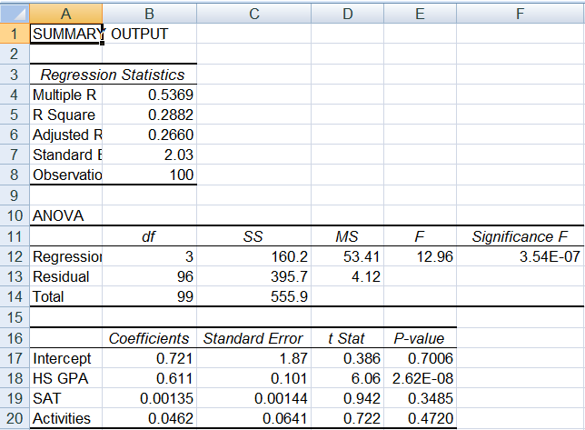
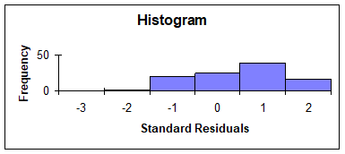
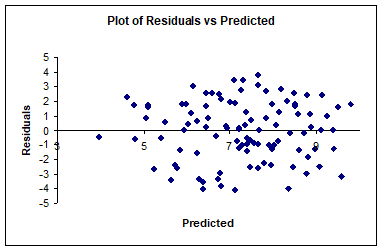
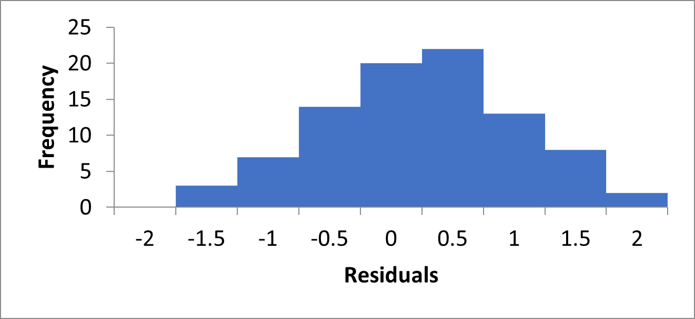
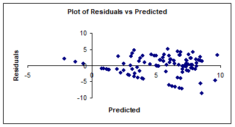
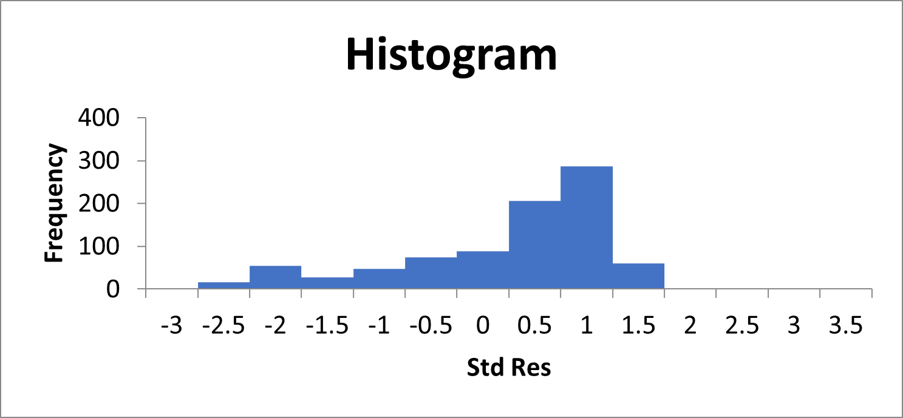
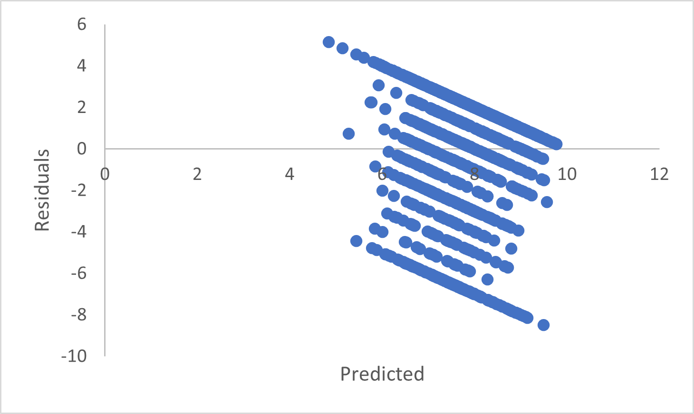

# Regresjon

I forrige modul fokuserte vi på *binære* spørsmål av typen "Er det en forskjell mellom disse to populasjonene, eller ikke?", "Er disse kjennetegnene uavhengige, eller ikke?", og så videre. I denne modulen skal vi prøve å gå et steg lenger og tillate mer interessante spørsmål. I stedet for bare å spørre om en eller annen effekt er til stede (eller ikke), så vil vi heller finne ut hvor stor denne effekten er, hvilken retning den går, og kanskje om vi kan bruke kunnskapen vi får om statistiske sammenhenger til å si noe fornuftig om hva som vil skje for noe som vi enda ikke har observert. Da er det regresjon som gjelder, og mer spesifikt for vår del: *lineær regresjon*. 

Regresjon er et hovedtema i MET4. Vi innfører en *statistisk modell* som i sin enkleste form sier at en *forklaringsvariabel* $X$ henger sammen med en responsvariabel $Y$ på en helt bestemt måte, nemlig gjennom ligningen

$$Y = \beta_0 + \beta_1 X + \epsilon.$$

Ligningen over sier at det er en *lineær* sammenheng mellom $X$ og $Y$, men at det i tillegg kommer en uforutsigbar støyvariabel $\epsilon$ som gjør at vi ikke vil kunne observere den lineære sammenhengen direkte. Det vi derimot kan gjøre, er å bruke de observerte $X$er og $Y$er til å finne ut hvilke verdier av $\beta_0$ og $\beta_1$ som passer *best*. Til det bruker vi minste kvadraters metode, som beskrevet i videoforelesningene i denne modulen.

Vi deler arbeidet med regresjon inn i tre deler. I den første (og største) delen går vi grundig gjennom ulike sider vi den enkle lineære regresjonsmodellen over. I den andre delen ser vi på *multippel regresjon* som er en utvidelse av enkel regresjon der vi tillater flere forklaringsvariabler på høyre side av likhetstegnet, og i den tredje delen ser vi på ulike praktiske aspekter ved regresjonsmodellering og modellbygging.

I videoforelesningene går vi gjennom noen slides, og vi skriver et R-skript. Du kan laste disse ned ved å klikke på lenkene under:

[Slides til "Regresjon"](script-slides/regresjon/regresjon-slides.html)

[R-script til "Regresjon"](script-slides/regresjon/regresjon-script.R)

**TIPS:** Hvis du ønsker å laste ned lysbildene som PDF trykker du på linken over, velger "Skriv ut", og så skriver du ut som PDF. Før du gjør det bør du scrolle gjennom alle sidene slik at ligningene vises korrekt.

## Enkel regresjon

### Videoforelesninger

<div style='padding:75% 0 0 0;position:relative;'><iframe src='https://vimeo.com/showcase/7781447/embed' allowfullscreen frameborder='0' style='position:absolute;top:0;left:0;width:100%;height:100%;'></iframe></div>

### Kommentarer

Vi har sett på en del figurer som illustrerer noen pedagogiske poenger, og lærebokens kapittel **16** går detaljert til verks når de beskriver de ulike læringsmomentene:

I kapittel **16.1** kan vi lese mer om den statistiske modellen som vi kaller enkel regresjon. I kapittel **16.2** introduseres minste kvadraters metode for å estimere regresjonskoeffisientene ved hjelp av data. De viser til og med hvordan det kan gjøres manuelt ved hjelp av bildatasettet, men det er selvsagt kun for å illustrere hvodan formlene ser ut. Vi estimerer ved hjelp av R, og vi har sett i videoforelesningen hvordan vi gjør det ved hjelp av `lm()`-funksjonen.

Det som gjør regresjon til et *statistisk* problem er feilleddet $\epsilon$. Vi tenker oss at for en gitt verdi av $X$, så vil «naturen» regne ut verdien av $Y$ ved å regne ut den lineære sammenhengen $Y = \beta_0 + \beta_1 X$, og så legge til støyvariabelen $\epsilon$ som *trekkes* fra en sannsynlighetsfordeling. Vi kan ikke observere direkte hvilke $\epsilon$ som «naturen» har «trukket» (for da ville vi med en gang kunne regnet oss frem til verdiene av $\beta_0$ og $\beta_1$). For gitte estimater av regresjonskoeffisientene $\widehat \beta_0$ og $\widehat \beta_1$ (som vi kan finne f.eks. ved hjelp av minste kvadraters metode), så kan vi regne ut de *observerte residualene* 

$$\widehat\epsilon_i = Y_i - \widehat Y_i = Y_i - (\widehat \beta_0 + \widehat \beta_1 X_i).$$

Ved å analysere residualene kan vi si mer om f.eks

1. Er det egentlig en lineær sammenheng mellom $X$ og $Y$? Hvis det er mønstre og sammenhenger i de observerte residualene, tyder det på at den enkle lineære modellen *ikke* fanger opp hele sammenhengen mellom $X$ og $Y$.
2. Vi kan gå mer spesifikt til verks: nøyaktig *hvilke* antakelser om residualene er ser ut til å være brutt? I senere økonometrikurs vil dere kunne lære mer om hvordan vi håndterer de ulike problemene. 
3. Hvor stor er variansen til $\epsilon$? Det brukes videre til å sette opp den viktige signifikanstesten for om stigningstallet i regresjonen er forskjellig fra null.

Alt dette behandles grudig i bokens kapittel **16.3--16.6**. Her bør teksten leses godt. Kode til bileksempelet finnes i scriptet som følger med videoforelesningene.

Når det gjelder enkel regresjon kan du sjekke om du har fått med deg det vesentligste ved å diskutere følgende spørsmål:

1. Hva er responsvariabelen og hva er forklaringsvariabelen i enkel regresjon?
1. Hva er fortolkningen av de to regresjonskoeffisientene?
1. Hvilket prinsipp er det vi legger til grunn når vi skal bestemme (estimere) verdien av koeffisientene ved hjelp av data?
1. Skriv opp formlene for koeffisientestimatene. Kan du gi en intuitiv fortolkning av disse? Er de rimelige? 
1. Kan du ved hjelp av formelen for $\widehat\beta_1$ utlede sammenhengen mellom *stigningstallet* $\beta_1$ og korrelasjonskoeffisienten* mellom $X$ og $Y$?
1. Hvilken rolle spiller feilleddet ($\epsilon$)?
1. Skriv opp de 4 + 1 forutsetningene. Når må den siste være oppfylt? Når kan vi klare oss uten?
1. Hva er testobservatoren når vi tester H$_0: \beta_1 = 0$?
1. Kan du holde styr på de fire standardavvikene vi har jobbet med i denne forelesningen?
1. Hva mener vi med å diagnostisere en regresjonsmodell?
1. Hva er $R^2$, og hva måler den?
1. Hva sier $R^2$ *ikke* noe om?

Her er noen grunnleggende ferdigheter fra kapittel 16. Klarer du dette? 

1. Bruke \texttt{R} til å tilpasse en enkel regresjonsmodell for et datasett?
1. Bruke \texttt{R} til å skrive ut oversiktlige regresjonstabeller?
1. Tolke en regresjonsutskrift?
1. Hente ut relevant informasjon etter en slik tilpasning?
1. Bruke informasjon fra regresjonsutskriften til å regne ut antall stjerner for hånd?
1. Lage diagnoseplott i \texttt{R}?
1. Diagnistisere en modell?
1. Identifisere innflytelsesrike observasjoner?

## Multippel regresjon

### Videoforelesninger

<div style='padding:75.14% 0 0 0;position:relative;'><iframe src='https://vimeo.com/showcase/7793207/embed' allowfullscreen frameborder='0' style='position:absolute;top:0;left:0;width:100%;height:100%;'></iframe></div>

### Kommentarer

I kapittel **17** utvides regresjonsbegrepet til *multippel* regresjon, som i prasis betyr at vi kan ha flere enn en forklaringsvariable:

$$Y = \beta_0 + \beta_1X_1 + \cdots \beta_kX_k + \epsilon,$$
men utover dette er alle detaljene vi har snakket om de samme. For eksempel:

- Tolkningen av regresjonskoeffisienten: En endring på en enhet i forklaringsvariabelen $X_j$ henger sammen med $\beta_j$ enhets endring i responsvariabelen $Y$ (merk at jeg ikke brukker begrepet "fører til", vi kan ikke uten videre fortolke sammenhengen som kausal!).
- Analysen av residualene $\widehat \epsilon_i = Y_i - \widehat Y_i$ er den samme og har samme formål 1--3 som over.
- $R^2$ har samme fortolkning.
- R-kommandoen er den samme, vi bare sette pluss mellom forklaringsvariablene, f.eks `reg <- lm(Y ~ X1 + ... + Xk, data = x)`

I tillegg innfører vi noen nye begreper:

**Justert** $R^2$: Vi viste i forelesningen at vi vil alltid klare å øke $R^2$ ved å legge til forklaringsvariable, selv om de ikke har noe med problemet å gjøre. Derfor innførte vi en *justert* $R^2$ som tar høyde for nettopp dette, ved å bli større bare dersom den aktuelle forklaringsvariebelen faktisk forklarer en reell mengde av variasjonen i responsvariabelen. Se avsnitt **17-2f** i læreboken.

**Multikolinearitet**: Dersom en forklaringsvariabel er sterkt korrelert med en eller flere andre forklaringsvariabler har vi multikolinearitet. Det blir naturlig nok et problem å skille effekter fra hverandre når de i realiteten er helt eller nesten like. Ekstremtilfellet er *perfekt multikolinearitet* der en variabel er en eksakt lineær funksjon av en eller flere andre variable. Det typiske tilfellet er at vi har to kolonner der vi måler det samme fenomenet, men med to ulike enheter, f.eks. **cm** og **m**. Selvsagt kan vi ikke klare å identifisere en *separat* og *uavhengig* effekt av $X$ på  $Y$ om vi skifter måleenhet, og vi vil få en feilmelding dersom vi prøver på det. Det er ekvivalent med å dele på null (every time you divide by zero, God kills a kitten!). Løsning: fjern en av kolonnene fra regresjonsanalysen.

Verre er det om to variable måler *nesten* det samme, men ikke helt, som i skoledataeksempelet der vi kunne bruke både innbyggertall og antall femteklassinger i kommunen som forklaringsvariabler. De henger tett sammen, men selvsagt ikke eksakt, og det virker rart å kunne knytte separate efekter til disse to variablene. I dette tilfellet får vi likevel ikke feilmeldinger, men konsekvensen kan fort bli at standardavvikene (usikkerheten!) til koeffisientestimatene eksploderer, og at ingen av variablene blir signifikant forskjellige fra null, selv det det faktisk er en sterk sammenheng mellom kommunestørrelse og prøveresultat (husk at testobservatoren: $t = \widehat \beta_k/\sigma_{\beta_k}$ blir liten når nevneren blir stor).

**F-test for multiple sammenligninger**: Dette henger nøye sammen med *variansanalyse (analysis of variance, ANOVA)*, som nå er tatt ut av pensum i kurset. For å forstå dette kan vi sette opp et eksempel, med to forklaringsvariabler:
$$Y = \beta_0 + \beta_1X_1 + \beta_2X_2.$$
Etter å ha brukt miste kvadraters metode for å estimere de tre koeffisientene er vi kanskje interessert i å vurdere den statsistiske signifikansene til de to stigningstallene separat. Da tester vi de to nullhypotesene $\beta_1 = 0$ og $\beta_2 = 0$, som vi i praksis gjør ved å se på hvor mange stjerner de får i regresjonsutskriften. Men sett at ingen av koeffisientene er signifikant forskjellige fra null, kan vi da slutte at vi ikke kan forkaste hypotesen $\beta_1 = \beta_2 = 0$, dvs at *begge* koeffisientene er lik null, og at ingen av forklaringsvariablene forklarer variasjon i $Y$? **NEI**, det kan vi ikke. Vi kan for eksempel lett tenke oss at vi på grunn av multikolinearitet ikke får separate forkastninger av de to nullhypotesene, men at ved å fjerne en variabel, så blir den andre signifikant.

For å virkelig forstå dette problemet kan du godt lese starten på kapittel **14.1** samt kapittel **14.2** om multiple sammenligninger (som strengt tatt ikke er pensum), men essensen er altså:

$$\textrm{Å forkaste H}_0: \beta_1 = 0 \textrm{ og H}_0: \beta_2 = 0 \textrm{ er ikke det samme som å forkaste H}_0: \beta_1 = \beta_2 = 0!$$

For å gjennomføre den siste testen må vi sette opp en egen testobservator, som viser seg å være $F$-fordelt. Læreboken lister opp noen detaljer i avsnitt **17-2f**, og essensen er at vi setter opp en brøk på formen
$$F = \frac{\textrm{Variasjon i } Y \textrm{ som fanges opp av regresjonsmodellen med } X_1 \textrm{ og }X_2}{\textrm{Variasjon i } Y \textrm{ som fanges opp av regresjonsmodellen uten } X_1 \textrm{ og }X_2}.$$
Dersom denne brøken viser seg å være stor (som definert av signifikansnivå og frihetsgrader, se lærebok), forkaster vi nullhypotesen om at begge koeffisientene begge kan være lik null. I en generell multippel regresjon med $k$ forklaringsvariable rapporterer R `F-statistic: ` etc, med verdien av $F$-observatoren i testen for
$$H_0: \beta_1 = \cdots = \beta_k = 0,$$
og dersom den oppgitte $p$-verdien er mindre enn f. eks. 5%, kan vi slutte at ikke alle koeffisientene kan være null samtidig (selv om ingen av koeffisientene i seg selv nødvendigvis er signifikant forskjellig fra null).

Som en såkalt *fun fact* kan vi nevne at det er enkelt å teste for signifikansen til *grupper* av variable på denne måten, f.eks hvis det er noen variable som måler lignende ting (si $X_2, X_4$ og $X_5$). I R kan du estimere to modeller, en modell som *inkluderer* variablene (f.eks. `reg_stor`) og en modell der du tar bort de aktuelle variablene (f.eks. `reg_liten`). Du kan da kjøre kommandoen `anova(reg_stor, reg_liten)` for å teste
$$H_0: \beta_2 = \beta_4 = \beta_5 = 0.$$


> **Kritikk av læreboken:** Læreboken har en tabell på s. 701 som viser sammenhengen mellom ulike statistiske størrelser som vi kan regne ut for en regresjonsmodell. $R^2$ kjenner vi som forklaringsgraden, $s_{\epsilon}$ er standardavviket til residualene, $F$ er testobservatoren for modellgyldighet som vi definerte uformelt over, og som er definert formelt nederst på s. 700, mens SSE (Sum of Squares Error) henger nøye sammen med standardavviket, som vi også kan se på s. 700. På disse sidene ser vi mange ligninger som viser hvordan disse størrelsene formelt henger sammen, og i tabellen på s. 701 ser vi blant annet at dersom SSE er liten, er også $s_{\epsilon}$ liten, $R^2$ er nær null, og $F$-observatoren er stor. Det er greit nok, **men** de har en ekstra kolonne som slår fast at regresjonsmodellen er *good*. 

 > Her menes det **ikke** at regresjonsmodellen er *god* i den forstand at vi skal reagere med glede eller lettelse (slik noen gjerne gjør), men at variasjonen i datamaterialet i stor grad lar seg forklare av modellen vår. I et tenkt eksempel der den sanne sammenhengen mellom $Y$ og $X$ er gitt ved $Y = \beta_0 + \beta_1X + \epsilon$, men der $\beta_1$ er forholdsvis liten og $s_{\epsilon}$ er relativt stor, vil f.eks. $R^2$ bli *liten*, selv om den enkle lineære regresjonsmodellen repsesenterer sannheten og av alle tenkende mennesker må sies å være *god*. 

> Det er desverre mange lærebøker som blander disse to fortolkningene, ikke gjør det!


Her er enda noen grunnleggende begreper. Har du fått med deg dette?

1. Hva mener vi med at en observasjon er innflytelsesrik?
1. Hva er grunnen til at vi trenger *justert* $R^2$ med flere forklaringsvariable?
1. Hva er forskjellen på *perfekt* og *tilnærmet* multikolinearitet i lineær regresjon? Hva blir konsekvensen i hvert av tilfellene?
1. Kan du gi en praktisk og intuitiv forklaring på hvorfor multikolinearitet nødvendigvis må være et problem?
1. Hva er forskjellen på statistisk og økonomisk signifikans? Kan du sette opp konkrete eksempler der vi kan estimere statistisk signifikante, men ikke økonomisk signifikante effekter i multippel regresjon? Hva med den motsatte situasjonen, økonomisk signifikant, men ikke statistisk signifikant? 

Grunnleggende ferdigheter: Klarer du dette?

1. Bruke R til å tilpasse en multippel regresjonsmodell for et datasett?
1. Bruke R til å finne særlig innflytelsesrike observasjoner?
1. Tolke en multippel regresjonsutskrift?

## Modellbygging

### Videoforelesninger

<div style='padding:75.21% 0 0 0;position:relative;'><iframe src='https://vimeo.com/showcase/7793253/embed' allowfullscreen frameborder='0' style='position:absolute;top:0;left:0;width:100%;height:100%;'></iframe></div>

### Kommentarer

Kapittel **18** dekker de grunnleggende begrepene innen modellbygging. I kap. **18.1** snakkes det om polynomiske modeller, i kap. **18.2** behandles dummyvariabler. Kapittel **18.3** og **18.4** handler om hvordan vi i praksis kan jobbe for å velge ut variable i en gitt situasjon. Forelesningene dekker i grunn greit det vi skal få med oss her. Som en sjekk om du har fått med deg det vesentlige, kan du svare på følgende spørsmål:

1. Vi har lært tre typer log-transformasjoner. Hva blir fortolkningen av koeffisientene for hver av disse?
1. Kan du nevne tre gode grunner til at log-transformasjoner er nyttige?
1. Hvorfor sier vi at følgende modell er lineær? $Y = \beta_0 + \beta_1X + \beta_1X^2 + \varepsilon$
1. Vil vi ikke få problemer med multikolinearitet i modellen over?
1. Nevn en veldig god grunn til at vi må være ytterst forsiktig med polynomtransformasjoner.
1. Hva er en dummyvariabel? 
1. Hva er fortolkningen av regresjonskoeffisienten til en dummyvariabel?
1. Hva er fortolkningen av regresjonskoeffisienten til et interaksjonsledd mellom målevariabelen $X$ og dummyvariabelen $D$?
1. Et utrolig viktig poeng, men bruk tid til å tenke over og formulere et svar: Hvorfor er det viktig å tenke på *multippel testing* i sammenheng med *variabelutvelgelse*?

Grunnleggende ferdigheter: Klarer du dette?

1. Bruke logtransformasjoner i R?
1. Bruke poynomtransformasjner i R?
1. Sette opp en fornuftig regresjonsmodell ved å ta utgangspunkt i et datasett og et analyseformål, og argumentere godt for dine valg? **Denne ferdigheten har blitt testet på hver eneste hjemmeeksamen i manns minne!**

## Oppgaver

### Regresjon med en forklaringsvariabel

#### Oppgave 1 {-}

Forskere har brukt statistikk til å undersøke om TV-titting er forbundet med overvekt. De har samlet inn data fra 15 10-åringer om antall timer TV-titting per uke og antall kilo overvekt hos barnet (rapportert som differanse fra normalvekt). De innsamlede dataene er oppsummert i tabellen:
```{r, echo=FALSE}
df_tv <- data.frame(
  TV_titting = c(42, 35, 28, 34, 37, 38, 32, 33, 18, 28, 36, 29, 29, 34, 18),
  Overvekt = c(17,  5, -1,  0, 13, 15,  5,  7, -7,  7,  6,  7,  4, 15, -5)
)
knitr::kable(
  df_tv, align = "c", format = "html"
)
```

a. Tegn et spredningsplott av resultatene. Hva tror du om forholdet mellom de to variablene utfra plottet?

b. Sett opp regresjonsuttrykket for å undersøke om overvekt er forbundet med overvekt. Hva er betydningen av hver parameter i uttrykket?

c. Estimér parameterne. Hva kan koeffisienten fortelle deg om forholdet mellom overvekt og TV-titting?

d. Beregn et 95 % prediksjonsintervall for overvekt i kilo for et barn som ser på TV 30 timer i uken. Hva forteller intervallet deg?

e. Beregn et 95 % konfidensintervall for gjennomsnittlig overvekt for barn som ser 30 timer på TV i uken. Hvordan er tolkningen av dette intervallet forskjellig fra det i oppgave d?

f. Hva er forventet overvekt for barn som ser 0 timer på TV i uken utfra modellen? Hva kan være problematisk ved å gjøre denne type analyser av en regresjonsmodell?

<details> <summary>Løsning</summary><div>

a)

```{r}
plot(df_tv$TV_titting, df_tv$Overvekt, type = "p", xlab="TV-titting", ylab="Overvekt")
```
Plottet viser en tydelig trend om at TV-titting og overvekt er relaterte. Dette kan vi undersøke nærmere.

b)

Vi setter overvekt som responsvariabel og TV-titting som forklaringsvariabel. Det er ikke noen grunn til å tenke at 0 TV-titting svarer til normalvekt, så vi har med et konstantledd. Uttrykket blir da:

\begin{equation}
   \text{Overvekt} = \beta_0 + \beta_1 \text{TV-titting} + \epsilon
\end{equation}

- $\beta_0$ er en korrigering av hvor linjen krysser andreaksen. Av spredningsplottet ser det ut som at vi ikke har data ved 0 TV-titting, det er derfor ikke fornuftig med en direkte tolkning av denne parameteren.

- $\beta_1$ forteller hvor relatert økt TV-titting er med overvekt.

c)

Vi estimerer en regresjonsmodell fra dataene og skriver ut tabellen med resultatene:

```{r}
library(stargazer)
reg <- lm(Overvekt ~ TV_titting, df_tv)
stargazer(reg, type="text")
```

Det er tydelig sigifikans for at hver av parameterne er ulik null. For $\beta_1$ betyr dette at trenden vi observerte i spredningplottet var signifikant. Videre kan vi tolke det positive fortegnet til $\beta_1$ som at flere timer TV-titting er relatert med økt overvekt.

Merk at vi *ikke* kan si utfra dataene at mer TV-titting *fører til* overvekt. En mer riktig tolkning er å si at de forekommer samtidig i populasjonen. (Dersom vi ønsket å finne ut av kausaliteten måtte man på et tilfeldig utvalg av barn satt noen til å se mye på TV og noen til å se mindre på TV, og deretter uundersøkt om dette resulterte i statistisk signifikant høyere overvekt hos en av gruppene. Dette krysser imidlertid noen etiske grenser om å påføre barn overvekt, dersom hypotesen er sann.)

d)

```{r}
reg.pred <- predict(reg, newdata = data.frame(TV_titting = c(30)), interval = "predict")

stargazer(reg.pred, type="text")
```

Dersom vi trekker måler overvekt hos nye barn som ser 30 timer på TV per uke, vil de i 95 % være innenfor prediksjonsintervallet.

e)

```{r}
reg.conf <- predict(reg, newdata = data.frame(TV_titting = c(30)), interval = "confidence")

stargazer(reg.conf, type="text")
```

Konfidensintervallet viser hvor *gjennomsnittet* av målinger på *et nytt sett* med barn som ser 30 timer på TV per uke vil ligge i 95 % av nye eksperimenter.

f)

```{r}
reg.zero <- predict(reg, newdata = data.frame(TV_titting = c(0)), interval = "prediction")

stargazer(reg.zero, type="text")
```

Beste gjetning er at barn som ser 0 timer på TV i uken er 22.2 kg under normalvekt (!). Et kjapt søk viser at barn på 10 år veier mellom 25.5 og 39 kg. Det høres urimelig ut at veldig lite TV-titting har sammenheng med ekstrem underernæring blant den samme populasjonen av barn som ser rundt 30 timer på TV i uken.

Det er flere ting som kan gå galt når man gjør en slik analyse av en modell:

- Modellen kan være gal. Vi antar et lineær forhold mellom TV-titting og overvekt, noe som ikke trenger å være riktig ved 0 timer TV-titting.

- Datasettet dekker ikke den gruppen barn som ser 0 timer på TV, så med mindre modellen er helt riktig (noe den sjelden er) vil den ikke kunne generalisere så langt utenfor området vi estimerte parameterne på.

- Med mindre forholdet mellom TV-titting og overvekt er kausalt, kan det være at sammenhengen som er observert mellom dem i dataene ikke vil være det samme langt utenfor det aktuelle data-området.

</div></details>

#### Oppgave 2 {-}
Vi skal undersøke om alder har sammenheng med hvor lang tid man bruker på et puslespill. Vi har data fra et tilfeldig utvalg av 210 voksne personer om alder og tid brukt på oppgaven. Uttrykk alder som $X$ og tid i minutter som $Y$. Følgende deskriptive statistikker er beregnet for datasettet: $s_{xy}^2= 8,	s_x^2, = 110,	s_y^2 = 42, \bar{x} = 40,	\bar{y} = 20$ hvor $\bar{x},\bar{y}$ er gjennomsnittene.

a. Sett opp regresjonsuttrykket for sammenhengen mellom $X$, $Y$ og støy $\epsilon$. Hva er antagelsen for sammenhengen mellom X og $\epsilon$?

b. Hva er uttrykket for beste gjetning/prediksjon $\hat{Y}_i$ gitt en verdi av forklaringsvariabelen $X_i$ for regresjonsmodellen du har satt opp? Hva er uttrykket for residualene?

c. Vis at hva uttrykket for regresjonsparameterne blir estimert med minste kvadraters metode. Regn ut minste kvadraters estimat av parameterne.

<!-- d. Gi en tolkning av koeffisientene.

e. Er det nok evidens til at vi kan hevde at det er en sammenheng mellom alder og tid? Bruk 95 % signifikansnivå. 

f. Estimer et 90 % konfidensintervall av gjennomsnittlig tid brukt på oppgaven for en 50-åring. -->

<details><summary>Løsning</summary><div>

a)
Regresjonsuttrykket er
\begin{equation}
  Y = \beta_0 + \beta_1 X + \epsilon
\end{equation}

Vi antar at forklaringsvariabelen $X$ er uavhenging støyen $\epsilon$. Dermed vil også kovariansen være null,
\begin{equation}
  \text{Cov}(X, \epsilon) = 0.
\end{equation}

b)

Beste gjetning er forvetningen betinget på utfallet av forklaringsvariabelen $X$:
\begin{align}
  \hat{Y}_i &= E[Y|X = X_i] = E[\beta_0 + \beta_1 X + \epsilon|X = X_i] \\
  &= \beta_0 + \beta_1 X_i + E[\epsilon|X = X_i] \\
  &= \beta_0 + \beta_1 X_i + E[\epsilon] \\
  &= \beta_0 + \beta_1 X_i
\end{align}

Residualene er forskjellen mellom data og prediksjon 

\begin{equation}
  r_i = \hat{Y}_i - Y_i
\end{equation}

c)

Minste kvadraters metode minimerer summen av residualene kvadrert, så 
\begin{align}
  SSE &= \sum_{i} r_i^2 \\
  &= \sum_{i} (\beta_0 + \beta_1 X_i - Y_i)^2.
\end{align}

Minimér ved å sette den deriverte for hver parameter til null:
\begin{align}
  \frac{dSSE}{d\beta_0} &= \sum_{i} 2 (\beta_0 + \beta_1 X_i - Y_i) \overset{!}{=} 0 \\
  \implies \quad \beta_0 &+ \beta_1 \frac{\sum_{i} X_i}{N} = \frac{\sum_{i} Y_i}{N} \\
  \implies \quad \beta_0 &= \frac{\sum_{i} Y_i}{N} -  \beta_1 \frac{\sum_{i} X_i}{N},
\end{align}
og
\begin{align}
  \frac{dSSE}{d\beta_1} &= \sum_{i} 2 (\beta_0 + \beta_1 X_i - Y_i)X_i \\
  &= 2 \beta_0 \sum_{i} X_i + 2 \beta_1 \sum_{i} X_i^2 - 2\sum_{i} X_i Y_i \overset{!}{=} 0 \\
  &\implies \quad \beta_0 \frac{\sum_{i} X_i}{N}  + \frac{\sum_{i} X_i^2}{N}  = \frac{\sum_{i} X_i Y_i}{N} .
\end{align}

Satt inn for $\beta_0$ blir det

\begin{align}
  \left ( \frac{\sum_{i} Y_i}{N} -  \beta_1 \frac{\sum_{i} X_i}{N} \right ) \frac{\sum_{i} X_i}{N}  + \beta_1\frac{\sum_{i} X_i^2}{N}  &= \frac{\sum_{i} X_i Y_i}{N} \\
  \beta_1 \left ( \frac{\sum_{i} X_i^2}{N} -  \left ( \frac{\sum_{i} X_i}{N} \right )^2 \right ) &= \frac{\sum_{i} X_i Y_i}{N} - \frac{\sum_{i} X_i}{N}\frac{\sum_{i} Y_i}{N} \\
  \beta_1 S_X^2 &= S_{XY}.
\end{align}

Da blir 
```{r}
beta_1 <- 8 / 110
beta_1
```
og 
```{r}
beta_0 <- 20 - beta_1 * 40
beta_0
```

</div></details>


<!-- #### (Oppgave 1) {-}

Begrepet regresjon ble for første gang brukt i 1885 av Sir Francis Galton i analysen av forholdet mellom høyden til barn og deres foreldre. Han formulerte da ‘loven om universell regresjon’, som sier at “each peculiarity in a man is shared by his kinsmen, but on average in a less degree”. Dette kan oversettes til noe slikt som at en ekstrem egenskap hos en person er felles hos slektningen, men vanligvis av mindre ekstrem grad. Tenk deg en uvanlig høy far. Sønnen hans vil som oftest være høy han også, men ikke like høy. På samme måte kan vi tenke oss en uvanlig høy sønn, hvor faren sannsynligvis også er høy, men nærmere gjennomsnittet enn sønnen. Dette er betydningen av «regression towards the mean». 
I 1903 gjorde to statistikere, K. Pearson og A. Lee et tilfeldig utvalg av 1708 far-sønn par for å undersøke Galtons lov. Regresjonsuttrykket ble beregnet til å være følgende:

$$(\text{Sønns høyde}) = 33.73 + 0.516 (\text{Fars høyde})$$
(Pearson og Lee er briter, og har målt høyden i tommer.)

a. Hva er betydningen av koeffisientene? 
b. Hva forteller regresjonsuttrykket om høyden til sønner av høye fedre?
c. Hva forteller regresjonsuttrykket om høyden til sønner av lave fedre?
Husk: koeffisientene tilsvarer tallverdiene i regresjonsuttrykket.  

<details>
<summary>Løsning</summary>

a. Helningskoeffisienten forteller oss at for hver ekstra tomme av far høyde vil sønnens høyde gjennomsnittlig øke med 0.516 tommer. Konstantleddet gir her ingen spesiell innsikt, ettersom vi aldri vil få konstantleddet «alene» (det eksisterer ingen fedre som måler 0 tommer). 

b. Sønnen vil gjennomsnittlig være lavere enn sin far.

c. Sønnen vil gjennomsnittlig være høyere enn sin far. 

</details> -->

### Multippel regresjon og modellbygging
<!-- 
#### (Oppgave 1) {-}

Studenten Rita Stata har som mål å gjennomføre et kurs i statistikk med minst mulig arbeid. Hun ligger foreløpig ikke så bra an, men ønsker å finne ut hva slags karakter hun forvente til slutt. Karakteren er basert på følgende beregning:
Karakter = 20 % (Assignment) + 30 % (Midterm test) + 50 % (Final exam)
Karakteren er et tall hvor 0 er lavest mulig og 100 er høyest mulig. 
Det er bare tre uker til eksamen, og på ‘assignment’ og ‘midterm test’ fikk Rita henholdvis 12/20 og 14/30 poeng. 
Rita samlet inn data over karakterer, og score på ‘midterm test’ og ‘assignment’ hos 30 tidligere studenter. Hun brukte deretter en statistikkprogramvare til å beregne et regresjonsuttrykk. Statistikkprogramvaren leverte følgende oppsummering:
 
{width=40em}

a. Hva er regresjonsuttrykket?

b. Hva er standardfeilen til målingen? Hva mener vi med standardfeil?

c. Hva er forklaringsgraden (bestemmelseskoeffisienten)? Hva forteller verdien oss?

d. Test validiteten av modellen. Dette gjøres ved hjelp av F-testen. 

e. Gi en tolkning av koeffisientene i modellen. 

f. Kan Rita anta at score på ‘assignment’ har et lineært forhold med karakter i statistikk?

g. Kan Rita anta at score på ‘midterm test’ har et lineært forhold med karakter i statistikk?

Husk: vi kaller ofte et regresjonsuttrykk for «modell». Dette er fordi regresjonsuttrykket i praksis fungerer som en modell, i dette tilfellet en modell som beregner karakter i statistikk. 

<details>
<summary>Løsning</summary>

</details>

#### (Oppgave 2) {-}
Et stort konsulentselskap i USA prøver å lage et system for å avgjøre hvilke søkere til internship som skal bli innkalt til intervju. Søkerne har bare gått ett år på universitetet, så de ønsker å bruke en modell til å predikere hvilke karakterer de vil få på bachelorgraden. De tror at karakterene fra High School og SAT Score er de viktigste variablene for å avgjøre hvilke karakterer søkeren vil få på universitetet. De tror også at søkere som har deltatt i utenomfaglige aktiviteter har større sannsynlighet for å få gode karakterer. For å undersøke dette velger de et tilfeldig utvalg av 100 ansatte som har hatt suksess i selskapet og finner følgende informasjon om de ansatte:
Karakterer fra universitetet (0-12) 
Karakterer fra High School (0-12)
SAT Score (400-1600)
Antall timer brukt på utenomfaglige aktiviteter per uke 
Under finner du en utskrift av regresjon med disse variablene:

{width=40em}
 
a. Hva er regresjonsutrykket til modellen? Hva er den avhengige (Y) og de uavhengige variablene (X)?  

b. Hva er forklaringsgraden til modellen? Tolk verdien. 

c. Test validiteten til modellen ved å beskrive F-testen og resultatet av testen.

d. Bestem hvilke av de uavhengige variablene som er lineære i modellen ved å tolke t-statistikken og p-verdien til hver av koeffisientene. 

e. Hva er den predikerte karakteren på universitetet til en søker som har High School GPA 10, SAT score 1200 og arbeider 2 timer i gjennomsnitt med utenomfaglige aktiviteter i uken. Merk: selv om noen av koeffisientene ikke er statistisk signifikante så kan man gjøre prediksjoner med modellen. Ved prediksjon er vi mest opptatt av at forklaringsgraden er høy.

f. Hva er den predikerte karakteren på universitetet til en søker som har High School GPA 8, SAT score 1100 og arbeider 10 timer i gjennomsnitt med utenomfaglige aktiviteter i uken. 

g. Kausalitet og korrelasjon er et viktig tema i dette faget. Viser denne modellen en kausal sammenheng mellom karakterer på High School og karakterer på universitetet? 

<details>
<summary>Løsning</summary>

</details>

#### (Oppgave 3) {-}

Vi undersøker om forutsetningene for OLS holder for modellen ovenfor. 

- Hvilke forutsetninger kan vi undersøke ved å studere de to diagrammene nedenfor? 

{width=30em}

{width=30em}

- Vil du si at de aktuelle forutsetningene holder?

<details>
<summary>Løsning</summary>

</details>

#### (Oppgave 4) {-}

- Hvordan tolker du diagrammene nedenfor?

- Holder forutsetningene for OLS?

a. 
{width=30em}
b. 
{width=30em}
c.
{width=30em}

{width=30em}

<details>
<summary>Løsning</summary>

a. Histogrammet er bjelle-formet og det kan se ut som at det er en normalfordeling.

b. Plottet viser tegn til heteroskedastisitet. Forutsetningen er ikke oppfylt. 

c. Histogrammet er skjevfordelt og forutsetningen om normalfordeling holder ikke.

d. Plottet viser tegn til heteroskedastisitet. Forutsetningen er ikke oppfylt.

</details>

#### (Oppgave 5) {-}

a. Hva er konsekvensen av brudd på forutsetningen om konstant varians?

b. Hva er konsekvensen av brudd på forutsetningen om normalfordelte feilledd? 


<details>
<summary>Løsning</summary>


</details>

#### (Oppgave 6) {-}

Et transportselskap ønsker å analysere hvordan ulike variabler påvirker hvor lang tid det tar å laste av lastebilene deres. I modellutskriften under vises resultatet av en modell hvor avhengig variabel er antall minutt det tar å laste av en lastebil. De uavhengige variablene er antall bokser og vekten på lasten. I tillegg ønsker transportselskapet å finne ut om tidspunktet på dagen påvirker hvor lang tid det tar å laste av bilene. De deler døgnet inn i tre: I1 = morgenen, I2 = tidlig ettermiddag og I3 = sen ettermiddag.
 
{width=40em}
 
a. Gi en kortfattet fortolkning av regresjonsutskriften over.

b. Det er mistanke om multikollinearitet i modellen. Hvilke to variabler tror du kan samvariere? 

c. Hvorfor er ikke l3 i regresjonsutskriften? 

d. Hva kan vi si om betydningen av tidspunktet på dagen og hvor lang tid det tar å laste av lastebilene? 

e. Tegn regresjonslinjen til modellen. 

<details>
<summary>Løsning</summary>

</details> -->

### Nøtter


<!-- I tabellen under finner du noen oppgaver som du kan bryne deg på for å sjekke forståelsen din og trene på metodene som vi har gått gjennom i denne modulen. Vi peker også på noen tidligere eksamensoppgaver som er relevante til denne tematikken, du finner oppgavene under seksjon \@ref(skoleeksamen). -->

<!-- Har du en eldre utgave av boken kan du laste ned [dette dokumentet](oppgaver/Recommended excercises.doc) for en oversikt over oppgavenummer tilbake til 7. utgave. -->

<!-- **På Canvas finner du en .zip-fil som inneholder alle datasettene, samt løsningsforslag til oppgavene i læreboken.** -->

<!-- ```{r, echo = FALSE, message = FALSE} -->

<!-- library(dplyr) -->
<!-- options(knitr.kable.NA = '') -->

<!-- "oppgaver/oppgaver-regresjon.xlsx" %>%  -->
<!--     readxl::read_excel() %>%  -->
<!--     kableExtra::kbl() %>%  -->
<!--     kableExtra::kable_styling(bootstrap_options = c("striped", "hover", "condensed")) -->

<!-- ``` -->


