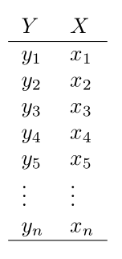
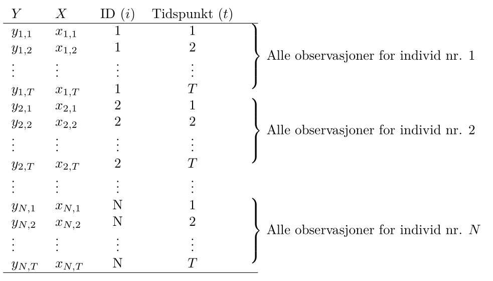

# Avansert regresjon og maskinlæring

I denne modulen tar vi en titt på noen litt mer avanserte statistiske metoder. De to første temaene, logistisk regresjon og "K-nearest-neighbor"-metoden (kNN), har til felles at de kan brukes når responsvariabelen er en kategorisk variabel med kun to kategorier. Begge disse metodene faller inn under det som populært kalles maskinlæring og er således en introduksjon til dette temaet. I det siste temaet, paneldata, skal vi se hvordan vi kan bygge regresjonsmodeller når hvert individ er observert flere ganger etter hverandre i tid. 

[R-script til "Logistisk Regresjon"](script-slides/logistisk/Logistisk regresjon i R.R)

[R-script til "KNN"](script-slides/logistisk/knn.R)

[R-script til "Paneldata"](script-slides/logistisk/Paneldata i R.R)


## Logistisk regresjon

### Videoforelesninger

<div style='padding:56.25% 0 0 0;position:relative;'><iframe src='https://vimeo.com/showcase/7802418/embed' allowfullscreen frameborder='0' style='position:absolute;top:0;left:0;width:100%;height:100%;'></iframe></div>

### Kontrollspørsmål

* I hvilke situasjoner bruker vi logistisk regresjon?
* Hva er det vi modellerer?
* Hvordan tolker vi èn enhets økning i forklaringsvariabelen?
* Hvilken metode brukes til å estimere en logistisk regresjonsmodell?
* Hva betyr klassifisering og hvordan gjøres dette?
* Hvis vi har flere modeller, hvilke(n) metode(r) kan vi bruker til å velge den beste?

### Teori

I denne forelesningen ser vi på situasjonen der vi ønsker å forklare utfallet av en *binær* variabel (en dummyvariabel) ved hjelp av et sett med forklaringsvariabler. Vi så at vanlig lineær regresjon ikke er særlig passende her fordi utfallet bare kan ta to verdier (0 eller 1, `FALSE` eller `TRUE` etc.), og fordi vi heller ikke kan tolke et kontinuerlig utfall direkte som en sannsynlighet fordi vi kan få ut verdier utenfor intervallet $[0, 1]$.

Løsningen er å heller forklare *log-oddsen til suksessansynligheten*. Sagt på en annen måte: på venstresiden i regresjonsligningen plasserer vi en *transformasjon* av suksessansynligheten, som gir oss en kontinuerlig variabel som kun kan variere mellom 0 og 1.

Pensumboken vår behandler desverre ikke logistisk regresjon. Heldigvis finnes det et meget godt alternativ, *An Introduction to Statistical Learning* (ISLR)  av James m.fl. som kan lastes ned gratis her:

[An introduction to statistical learning](https://www.statlearning.com/) (trykk på "Download the first edition")

Denne boken er for øvrig pensum i **BAN404**. Logistisk regresjon er omhandlet i kapittel *4.3* (avsnitt 4.3.5 er ikke pensum). Eksempelet vårt er tatt herfra, og datasettet er, som vist i forelesningsscriptet, inkludert i bokens egen R-pakke `ISLR`.

Bruk litt tid på å lese gjennom disse sidene, konseptet er ganske godt forklart. Bli også kjent med R-syntaksen, som ligner på den vi allerede kan for vanlig lineær regresjon. Vi bruker f.eks.

```{r, eval = FALSE}
reg1 <- glm(default ~ balance, 
            data = Default,
            family = "binomial")
```

Når du er klar til å prøve selv, kan du se på oppg *10a*, *b* og første del av *d* på s. 171 i ISLR. Dette datasettet er også inneholdt i `ISLR`-pakken.

## Introduksjon til maskinlæring med kNN

### Videoforelesninger

<div style='padding:56.25% 0 0 0;position:relative;'><iframe src='https://vimeo.com/showcase/7802427/embed' allowfullscreen frameborder='0' style='position:absolute;top:0;left:0;width:100%;height:100%;'></iframe></div>

### Kontrollspørsmål

* For hvilke typer responsvariabler bruker vi KNN?
* Hvordan fungerer KNN teoretisk sett?
* Hva er den praktiske tolkningen av KNN?
* Hvordan påvirker valget av $k$ måten KNN fungerer på?
* Hvordan velger vi $k$?

### Teori

Kanskje har du allerede hørt om maskinlæring, "data science", prediktiv modellering, "business analytics", etc., og kanskje har du fått med deg at disse tingene virkelig er i vinden for tiden. Som akademisk institusjon skal vi selvsagt være på vakt mot å la popularitet være en avgjørende faktor for hva vi driver med, men, som en kollega så treffende uttrykte seg: "Internett er kommet for å bli." Det skjer utrolig mye verdiskapning når vi får tak i den verdifulle informasjonen som ligger gjemt i de store datamengdene, og næringslivet skriker etter kompetanse. NHH har som svar på dette opprettet masterprofilen "Business Analytics (BAN)" (som ironisk nok er blitt superpopulær!), og det er naturlig å gi en liten smakebit på hva det går ut på i MET4. Det herlige er at vi ikke trenger å dykke så dypt i detaljene for å få brukbar innsikt i hva som skjer.

Overgangen fra logistisk regresjon er naturlig. Vi bruker det vi kan fra regresjonsanalyse til å sette opp en modell der vi *forklarer* utfallet i en dummyvariabel ved hjelp av et sett forklaringsvariable i allerede observerte data. I første omgang kan vi si at den moderne anvendelsen av logistisk regresjon (kall det gjerne en form for maskinlæring) er å bruke data til å estimere sammenhengen mellom $X$-ene og responsvariabelen $Y$, og så bruke denne sammengengen til å predikere $Y$ for nye $X$.

Artikkelen [*To explain or to predict* av Galit Shmueli](https://projecteuclid.org/euclid.ss/1294167961) forklarer distinksjonen mellom det å forklare og det å predikere godt, og skal være noenlunde lesbar for en interessert student.

Eksempelet fra logistisk regresjon er et godt eksempel på en anvendelse: Vi predikerer sannsynligheten for at kunder vil misligholde gjelden i fremtiden, basert på karakteristika vi kan observere nå. Slike sannsynligheter kan vi mate inn i en strategisk analyse for å bestemme oss hvem som skal få innvilget nye lån, men på en systematisk måte der vi sørger for at vi oppnår nødvendige profittmarginer og håndterer risiko på en fornuftig måte, og kan ta hensyn til f.eks. etiske avveininger. Selv om vi ut fra eget behov for profitt og innenfor en akseptabel risikoprofil kan tilby nye lån til kunder med 15% sannsynlighet for å havne i betalingsproblemer, bør vi likevel gjøre det? *Poenget her er at du ikke kan gjøre slike vurderinger før du faktisk kan estimere sannsynligheten for mislighold!* Statistikken er bunnplanken, og blir mer og mer relevant etter hvert som vi innser at svarene ligger i å analysere data.

Vi går videre til et annet eksempel. En teleoperatør med abonnementskunder ser at det er en systematikk i hvilke kunder som sier opp avtalene sine. Ved å se på spredningsplottet under (rød prikk = kunde som har sagt opp abonnementet), ser det ut til at *nye* kunder med *dyre* abonnementer har en tendens til å forlate oss. Kan vi sette opp en klassifiseringsregel der som vi kan anvende på *alle* kundene våre, som automatisk plukker ut kunder som har f.eks. mer enn 50% sannsynlighet for å si opp? Denne listen kan vi så sende videre til markedsavdelingen, som kan sette i verk forebyggende tiltak (f.eks. lokke de inn i bindende avtaler...?), og vi kan oppnå en *umiddelbar* gevinst.

```{r churn, message = FALSE, echo = FALSE, fig.height = 5, fig.cap = "Røde prikker er kunder som har sagt opp abbonnementet sitt, svarte prikker er kunder som ikke har gjort det. Finn den optimale avveiningen mellom systematikk og tilfeldig variasjon."}
library(ggplot2)
library(dplyr)

telco <- readr::read_csv("datasett/WA_Fn-UseC_-Telco-Customer-Churn.csv") %>% 
  select(Churn, MonthlyCharges, tenure) %>% 
  mutate(Churn = as.factor(Churn))


plot(telco$MonthlyCharges, telco$tenure, 
     xlab = "Måndedlig kostnad ($)",
     ylab = "Lengde på kundeforhold (mnd)",
     pch = 20,
     col = ifelse(telco$Churn == "Yes",
                  yes = alpha("red", .7),
                  no = alpha("black", .15)),
     bty = "l")
grid(col = "grey70")

```

Vi kan angripe dette datasettet på to måter:

- Vi estimerer sannsynligheter ved hjelp av logistisk regresjon. Den stramme strukturen gjør at klassifiseringsgrensen alltid utgjør en rett linje i koordinatsystemet.
- Vi ser også på en annen klassifiseringsregel: kNN (*k* nearest neighbours), som ikke bruker sannsynlighetsmodeller eller regresjonsparametre til å klassifisere, men heller er en enkel regel basert på følgende prinsipp:

> Hvis et flertall av kundene som er mest lik meg har sagt opp, er det mer enn 50% sannsynlig at også jeg vil si opp.

Her bruker vi litt tid på detaljer, men det handler i grunn bare om å lage en presis definisjom om hvem vi definerer som de kundene som ligner mest på meg, og svaret er de $k$ kundene som ligger nærmest meg i koordinatsystemet. 

På samme måte som for logistisk regresjon kan vi lese mer om kNN i [ISLR](https://www.statlearning.com/). På s. 39--42 står det hvordan teknikken fungerer, og i forelesningsnotatene og det medfølgende scriptet ser vi hvordan det kan gjøres i praksis.

Når vi forstår hvordan kNN fungerer, er neste steg å reflektere litt over hvordan vi har tenkt å velge parameteren $k$ i praksis. Vi så i forelesningen at:

- Vi kan ikke velge $k$ for liten. Da ser vi for mye på støy og tilfeldigheter. Vi kan enkelt tenke oss at jeg er en lavrisikokunde, selv om de to kundene som er nærmest meg i koordinatsystemet sa opp av en eller annen grunn. Hvis vi velger $k = 3$, vil jeg likevel bli klassifisert som høyrisiko og bli bombardert med unødvendig reklame (som i seg selv kan gjøre stor skade!) Hadde vi heller valgt $k = 50$ eller $k=500$ ville disse to raringene ikke bli tatt hensyn til, men blitt dominert av alle andre i området som faktisk ikke har sagt opp. Altså: **vi kan ikke henge oss for mye opp i detaljene og den tilfeldige variasjonen!**

- Vi kan heller ikke velge $k$ for stor, for det vil til slutt nærme seg en situasjon det det bare blir en avstemning mellom alle kundene i datasettet. Det er flest kunder som ikke sier opp avtalen, så da blir alle kunder klassifisert som lavrisiko. Altså: **vi vil heller ikke ignorere variasjonen i datamaterialet!** Hele poenget er jo å lære noe nyttig fra hvordan prikkene fordeler seg i koordinatsystemet.

I Figur \@ref(fig:churn) kan du prøve følgende: En liten $k$ svarer til å se nøye på figuren (putt hodet ditt helt inntil skjermen!), og virkelig legge merke til hvor hver eneste en av de røde prikkene befinner seg. Å velge en større $k$ svarer til å trekke lenger bort, og kanskje begynne å myse litt, slik at du får øye på systematikken, nemlig at det røde dominerer nede til høyre i figuren. Til slutt står du i rommet ved siden av med lukkede øyne, og da ser du plutselig ingenting! Et eller annet sted i mellom der ønsker vi å være.

*Kryssvalidering* er en systematisk og generell måte å velge *k* for KNN (og tilsvarende parametre i andre maskinlæringsmetoder), som litt lenger enn å bare dele datasettet inn i trenings- og testdata [ISLR](https://www.statlearning.com/) behandler temaet på s. 181--186, men det er forholdsvis teknisk og skrevet i lys av noen metoder som vi ikke har sett på i MET4. 

## Paneldata

### Videoforelesninger

<div style='padding:56.25% 0 0 0;position:relative;'><iframe src='https://vimeo.com/showcase/7802431/embed' allowfullscreen frameborder='0' style='position:absolute;top:0;left:0;width:100%;height:100%;'></iframe></div>

### Kontrollspørsmål

* Hva er paneldata?
* Hva må vi ta hensyn til når vi analyserer paneldata?
* Hvordan ser en generell modell for paneldata ut?
* Hva er den konseptuelle forskjellen mellom faste og tilfeldige effekter?
* Når kan vi bruke faste effekter?
* Når kan vi bruke tilfeldige effekter?
* Finnes det en måte å formelt teste om man skal bruke faste eller tilfeldige effekter? (obs: se helt nederst på denne siden for svaret på denne.)

### Teori og R

I denne forelesningen introduserer vi en ny datastruktur. Vi observerer flere individer (tversnittsdimensjonen) *gjentatte ganger* (tidsdimensjonen), og et slikt datasett kaller vi et *panel*, eller *paneldata*. Fordelen ved å jobbe med slike data er åpenbar: vi har mer informasjon og kan gjennomføre mer presise statistiske analyser. På den annen side må vi akseptere at en mer kompleks datastruktur gjør det nødvendig å innføre mer kompleks metodikk.

I gjennomgangen under bruker vi et liten del av dataene fra eksempelet som er beskrevet i videoene. Ønsker du å følge R-gjennomgangen laster du ned følgende datasett:

- [`panel_liten.csv`](datasett/panel_liten.csv)

#### Struktur på Paneldata

Til nå har vi typisk observert $n$ individer *en* gang. Hvis vi holder oss til eksempelet fra videoforelesningen, kan vi tenke oss at vi har spurt $n$ arbeidstakere om hvor mange timer de jobbet forrige år ($X$), og hvor mye de hadde i timelønn ($Y$). Da ville datasettet sett omtrent slik ut:

```{r, echo = FALSE}

```

Her er $y_i$ timelønn til arbeidstaker nummer $i$, og $x_i$ er antall timer jobbet for arbeidstaker nummer $i$. Hvis vi så ønsker å se om det er en sammenheng mellom disse to variablene, kan vi sette opp en enkel regresjonsmodell som vi har gjort før:

\begin{equation}
y_i = \alpha + \beta x_i + \epsilon_i,
\label{p-ols}
\end{equation}
der vi gjør de vanlige antakelsene om homoskedastisitet, uavhengige feilledd, og selvsagt at forklaringsvariabelen er *eksogen*, dvs at de stokastiske variablene $X$ og $\epsilon$ er *uavhengige fra hverandre*. Hvis vi aksepterer det, så kan vi estimere $\beta$ ved hjelp av minste kvadreters metode (OLS - orinary least squares), som vi kan tolke som forventet økning i timelønn ved å jobbe en time ekstra.

For paneldata har vi ikke lenger kun observert $n$ arbeidstakere 1 gang, men  spurt $N$ arbeidstakere $T$ ganger, slik at vi trenger to indekser til å identifisere hver enkelt observasjon: $y_{i,t}$ er timelønn til arbeidstaker nummer $i$ ved tidspunkt $t$. Våre observerte $X$er og $Y$er kan vi samle i en tabell som før, se illustrasjonen under. Legg merke til at det bare er de to første kolonnene for $X$ og $Y$ som utgjør de faktiske observasjonene, mens de to neste kolonnene sier hvilket individ som er observert, og ved hvilket tidspunkt observasjonen er utført, og viser bare indeksene til $X$- og $Y$-observasjonene. Kall det gjerne *metadata*, og vi trenger den informasjonen når vi skal utføre paneldatateknikker.

```{r, echo = FALSE}

```

Formatet i tabellen over kalles gjerne et *langt* format, og omtrent samtlige R-pakker og funksjoner som brukes til å analysere panel data forventer at dataene er organisert på denne måten.

Vi kan ta en titt på hvordan dette ser ut i R for eksempelet vårt:

```{r, warning = F, eval = F}
df <- read.csv("panel_liten.csv")              # Leser inn datasettet
head(df)                                       # Ser på datasettet
```

```{r, warning = F, echo = F}
df <- read.csv("datasett/panel_liten.csv")      # Leser inn datasettet
head(df)                                        # Ser på datasettet
```

Her svarer `lnwg`til responsvariabelen (log) lønn og `lnhr` til forklaringsvariabelen (log) antall timer jobbet. Legg merke til at det er en egen kolonne med navn `id` som forteller oss hvilket individ observasjonene gjelder for. Dette svarer til $i$-indeksen i notasjonen over. Det er også en egen kolonne kalt `year` som forteller oss hvilket år observasjonen er fra, og dette svarer til $t$-indeksen. F.eks er første rad observasjoner gjort for individ nr. 1 i år 1979.    

#### Hva må vi ta hensyn til?

Hovedmotivasjonen for å analysere paneldata er ennå å undersøke sammenhengen mellom respons og forklaringsvariabelen. En slik måte å samle inn data på gir f.eks mer innformasjon om sammenhengen mellom timelønn og antall arbeidstimer fordi vi har flere observasjoner enn om vi bare betraktet en observasjon per individ. Men siden vi har gjentatte observasjoner over tid kan responsvariablene være avhengige. Vi kan se for oss to grunner til dette:

1. En utvikling i tid som er felles for alle individene; Det er f.eks tenkelig at det er en generell utvikling i lønnsnivået over tid, eller at det f.eks finnes *gode* år hvor alle tjener spesielt godt. 
2. De gjentatte observasjonene for ett gitt individ vil typisk være avhengige; Har et individ høy inntekt det ene året er det tenkelig at det også har høy inntekt det neste året. Denne effekten kan misforstås som en effekt av forklaringsvariabelen.  
 
 Altså må vi både ta hensyn til at det kan være en *generell* utvikling i tid og at det kan være  *individuelt*  forskjellige lønnsnivå. Disse aspektene kan nemlig påvirke vårt estimat av effekten av å jobbe mer dersom vi bruker den tradisjonelle regresjonsmodellen og OLS.

La oss inspisere de $3$ individene vi har data for i vårt lille datasett ved å lage et figur med lønnsutvikling (`lnwg`) langs y-aksen og år (`year`) langs x-aksen for å se om det finnes et slags felles mønster i lønnsutviklingen (ref. punkt 1. over):

```{r}
library(ggplot2)  
ggplot(df) +
  geom_point(aes(x = year, y = lnwg, color = factor(id)))
```

her ser vi f.eks at alle individene har et dårlig år i 1983, mens 1985 virker å være et godt år. Det også tydelig at lønnen holder seg relavivt lik lønnen det foregående året. Det er altså rimelig å tro at det er fellestrekk i lønnen til individene for gitte år.
 
La oss så lage et spredningsplott mellom `lnhr` og `lnwg` hvor vi fargelegger hvilket individ observasjonene kommer fra:
 
```{r}
library(ggplot2)  
ggplot(df) +
  geom_point(aes(x = lnhr, y = lnwg, color = factor(id)))
```

Ser vi på disse dataene samlet sett ser du til å være en klart positiv korrelasjon mellom lønn og antall timer jobbet. Men legg merke til at individ nr. 1  ligger på et høyere lønnsnivå og jobber mer enn de to andre individene. Det er dette som i stor grad skaper et bilde av en sterk positiv sammenheng mellom variablene. Hvis vi ser på de individuelle observasjonene (hver fargesky) hver for seg, virker ikke sammenhengen å være like sterk, og det har kanskje ikke like mye å si for lønnen om du individuelt velger å jobber mer. Dette svarer til fenomenet beskrevet i punkt 2. over.   

#### Generelt oppsett av modell

Effektene av de fenomene vi beskrev over kan vi ta hensyn til ved å *inkludere* dem i regresjonsmodellen på følgende måte: 
 
 $$y_{it} = \beta_0 + \beta_1 x_{it} + v_t + \alpha_i + \epsilon_{it} $$
hvor vi nå har lagt til to nye ledd, $v_t$ og $\alpha_i$, i modellen:

1. Her representerer $v_t$ den generelle utviklingen i tid som er felles for alle individene (det er ingen "i"-indeks i denne). Det kan f.eks være en lineær trend ($v_t = \delta t$) eller helt unike årlige effekter $v_t$, som fanger opp *gode* og *dårlige* år. 

2. Leddene $\alpha_i$ representerer så de individuelle lønnsnivåene (disse er "i" indeksert). Har individ $1$ høyere lønn enn individ $2$ så vil $\alpha_1$ blir estimert til å være større enn $\alpha_2$. 

Vi justerer altså for at individer kan ligge på et forskjellig lønnsnivå, og at det er en felles årlige variasjoner i lønn. I praksis betyr dette at vi justerer regresjonslinjen *vertikalt* slik at den tilpasser seg lønnsnivået til hvert individ. Effekten $\beta_1$ av å jobbe mer er derimot antatt lik for hvert individ og den estimerte effekten vil da bli et slags gjennomsnitt av hvor mye det individuelt lønner seg å jobbe mer.

I utgangspunktet kan vi betrakte $v_t$ og $\alpha_i$ som kategoriske variabler som kan estimeres ved hjelp av dummyvariabler slik vi har lært før. Problemet er at i et tradisjonelt paneldatasett så er $N$ (antall individer) et stort tall, mens $T$ (antall observasjoner per individ) et relativt lite tall. Dette fører til svært mange kategoriske variabler $\alpha_i$ å estimere, og i praksis må vi derfor betrakte andre metoder. Vi noterer oss følgende:

* Egenskapene til $\alpha_i$ bestemmer typen paneldatamodell og vi deler disse modellene grovt sett inn i modeller med *faste effekter* og *tilfeldige effekter*. Selve ligningene vil altså se like ut, men tolkning og estimering er forskjellig.

* Leddene $v_t$ vil vi i de fleste tilfeller klare å estimere som kategoriske variabler og i fortsettelsen ser vi bort fra dette leddet 

* For enkelthets skyld betrakter vi bare èn forklaringsvariabel, men det kan selvsagt være flere forklaringsvariabler i en regresjonsmodell for panel data også.    

#### Forskjellige parameteriseringer

Merk at det både i lærebøker og i forskjellige R-pakker veksles mellom å to typer formuleringer av den generelle modellen over. Hvis vi ser bort fra $v_t$ leddet, er modellen vi til nå har betraktet formulert som:

\begin{align}
y_{it} = \beta_0 + \beta_1 x_{it}  + \alpha_i + \epsilon_{it} 
(\#eq:withb)
\end{align}

hvor $\beta_0$ er inkludert. Her kan $\beta_0$ tolkes som det *gjennomsnittlige* skjæringspunktet med y-aksen blant de individuelle regresjonslinjene, mens $\beta_0 + \alpha_i$ vil være skjæringspunktet med y-aksen for individ nr. $i$. Men det er også svært vanlig (og kanskje litt lettere) å formulere modellen uten $\beta_0$: 

\begin{align}
y_{it} = \beta_1 x_{it}  + \alpha_i + \epsilon_{it} 
(\#eq:withoutb)
\end{align}

og da vil $\alpha_i$ være det individuelle skjæringspunktet med y-aksen for individ nr. $i$. Forskjellen er rett og slett tolkningsmessig. I videoen for faste effekter går vi igjennom estimeringen av begge modellene, men under betrakter vi bare estimering av sistnevnte modell når vi bruker faste effekter. Dette gjør vi siden modellen i R er definert på denne måten. Når vi så ser på *tilfeldige effekter* vil vi av samme grunn betrakte modell \@ref(eq:withb). 

#### Faste effekter
 
I en modell med *faste effekter* betrakter vi $\alpha_i$ leddene som *faste størrelser* som må estimeres. Denne modellen er omtrent alltid gyldig og kan brukes selv om vi tror de individuelle forskjellene $\alpha_i$ er relativt store og at det er avhengighet mellom forklaringsvariabelen(e) og $\alpha_i$.

 I modellen vår som er formulert som

 $$y_{it} = \beta_1 x_{it}  + \alpha_i + \epsilon_{it} $$

skal vi altså estimere $\alpha_1, \alpha_2, ..., \alpha_N$ samt effekten av det å jobbe mer $\beta_1$.  Det finnes en rekke estimeringsteknikker og vi vil her (og i videoen) bare beskrive en metode. 

Vi begynner med å ta tidsgjennomsnittet av ligningen over for hvert individ: 

$$1/T \sum_{t = 1}^T y_{it} = 1/T \sum_{t = 1}^T \beta_1 x_{it} + 1/T \sum_{t = 1}^T \alpha_i + 1/T \sum_{t = 1}^T \epsilon_{it}$$
Her vil tidsgjennomsnittet av $\alpha_i$ bare være $\alpha_i$ siden dette leddet ikke varierer med tiden. Altså kan vi skrive ligningen over som:

\begin{align}
\overline{y}_{i} = \beta_1\overline{x}_i + \alpha_i + \overline{\epsilon}_i
(\#eq:timemean)
\end{align}

Her er henholdsvis $\overline{y}_i$ og $\overline{x}_i$ den gjennomsnittlige lønnen og antall timer jobbet for individ nr. i, og dette er størrelser vi kan regne ut. Vi tar så vår originale modell å trekker fra denne ligningen:

$$y_{it} - \overline{y}_{i}  = \beta_1(x_{it} - \overline{x}_i) + \alpha_i - \alpha_i +  \epsilon_{it} - \overline{\epsilon}_i$$
Nøkkelen her er at $\alpha_i$-leddene kansellerer hverandre og vi kan formulere en ligning helt uten disse leddene:

$$\tilde{y}_{it} = \beta_1\tilde{x}_{it} + \tilde{\epsilon}_{it},$$
hvor $\tilde{y}_{it} = y_{it} - \overline{y}_{i}$, $\tilde{x}_{it} = x_{it} - \overline{x}_{i}$ og $\tilde{\epsilon}_{it} =  \epsilon_{it} - \overline{\epsilon}_{i}$. 

Siden vi nå ikke lenger har $\alpha_i$ i ligningen, og siden $\tilde{\epsilon}_{it}$ bare er et nytt feilledd sentrert rundt null, kan vi estimere $\beta_1$ ved vanlig OLS, altså velge den verdien $\hat{\beta}_1$ som minimerer:

$$\sum_{i=1}^N\sum_{t=1}^T(\tilde{y}_{it} - \beta_1\tilde{x}_{it})^2$$

Gitt et estimat av $\beta_1$ kan vi få estimater av $\alpha_1, \dots, \alpha_N$ ved å  og ta forventning av den tidsgjennomsnittlige modellen \@ref(eq:timemean) (da forsvinner $\overline{\epsilon}_{it}$ leddet), erstatte $\beta_1$ med estimatet $\hat{\beta}_1$ og løse ligningen m.h.p $\alpha_i$.  

\begin{align}
\hat{\alpha}_1 &= \overline{y}_{1} - \hat{\beta}_1\overline{x}_1\\
\hat{\alpha}_2 &= \overline{y}_{2} - \hat{\beta}_1\overline{x}_2\\
&\vdots\\
\hat{\alpha}_N &= \overline{y}_{N} - \hat{\beta}_1\overline{x}_N\\
\end{align}

Sluttproduktet er derfor $N$ individuelle regresjonslinjer:

\begin{align}
y_{1t} &= \hat{\alpha}_1 + \hat{\beta}_1 x_{1t}   \\
y_{2t} &= \hat{\alpha}_2 + \hat{\beta}_1 x_{2t}   \\
&\vdots\\
y_{Nt} &= \hat{\alpha}_N + \hat{\beta}_1 x_{Nt}   \\
\end{align}

som har individuelle skjæringspunkt med $y$-aksen ($\hat{\alpha}_i$) for å justere for forskjellig lønnsnivå, men hvor *alle* observasjonene har blitt brukt til å estimere det felles stigningstallet $\hat{\beta}_1$. 

Det er verdt å merke seg at denne metoden ikke kan brukes dersom forklaringsvariabelen ikke varierer med tid (eksempelvis kjønn). Da vil nemlig $x_{it} - \overline{x}_i = x_{it} - x_{it} = 0$, og vi har derfor ingen mulighet til å estimere $\beta_1$ med OLS. 

Det finnes flere pakker som kan estimere slike modeller i R, men en veldig enkel pakke å bruke heter `plm`. Det første vi gjør er å laste pakken forså å "oversette" dataene våre til paneldata. På denne måten forstår `plm` funksjonen hva som er individ indeksen og hva som er tidsinndeksen:

```{r, warning = F, message=F}
library(plm)      # Pakke for å estimere faste effekter

# Oversetter til panel data frame
p.df <- pdata.frame(df,
                    index = c("id" ,"year"))

```

Syntaksen for å bruke `plm` funksjonen er svært lik den for `lm` og `glm`. For å bruke en modell med faste effekter må man huske å spesifiserer argumentet `model = "within"`:

```{r}

reg.fe <- plm(lnwg ~ lnhr,
              data = p.df,
              model = "within")
summary(reg.fe)

```

Vi ser at den estimerte $\beta_1$ effekten av å jobbe mer estimeres til $0.36$. Vi kan også få ut estimatene for de faste effektene $\alpha_1$, $\alpha_2$ og $\alpha_3$: 

```{r}
fixef(reg.fe)

```

Det kan være nyttig å ta en visuell innspeksjon på hvordan de individuelle regresjonskurvene passer til dataene:

```{r}
plot(reg.fe)
```

Denne figuren viser også hvordan regresjonskurven ville sett ut dersom vi hadde sett bort fra paneldatastrukturen og brukt en helt vanlig (pooled) regresjonsmodell. Sammenlignet med modellen med faste faste effekter (within) så ville vi da estimert effekten av jobbe mer til å være større. Selv om produktet her er $3$ individuelle regresjonsmodeller, presiserer vi at dette ikke er $3$ uavhengige analyser; alle observasjonene er brukt til å finne et estimat på $\beta_1$.        

Vi husker at det også kunne være en felles tidskomponent $v_t$ i en slik modell og at denne kunne betraktes som en kategorisk variabel siden det typisk ikke er så mange ($T$) av disse. Vi kan derfor bare legge til `year`  som en ekstra (kategorisk) forklaringsvariabel forutsatt at den er koded som en `factor`:

```{r}
is.factor(p.df$year)

reg.fe <- plm(lnwg ~ lnhr + year,
              data = p.df,
              model = "within")
summary(reg.fe)

```
For dette lekedatasettet kunne vi strengt tatt også betraktet $\alpha_i$-leddene som kategoriske variabler, men som sagt er som regel $N$ for stor til at dette lar seg gjøre.


#### Tilfeldige effekter
Hovedmotivasjonen for analysen av paneldataene er å finne ut hva effekten av å jobbe mer er ($\beta_1$). Vi vet at det eksisterer individuelle effekter $\alpha_i$ som en konsekvens av datastrukturen, men vi er ikke nødvendigvis interessert i disse verdiene i seg selv.  

I motsetning til en modell med *faste effekter* hvor vi betraktet $\alpha_i$ som faste størrelser,  vil vi i en modell med *tilfeldige effekter* betrakte disse som *tilfeldige variabler*. I en slik modell estimerer vi derfor heller *fordelingen* til disse effektene. En vanlig antagelse er da at

*$\alpha_i\sim N(0, \sigma_{\alpha}^2)$ dersom vi bruker parameteriseringen \@ref(eq:withb) med $\beta_0$ inkludert.  
* $\alpha_i\sim N(\beta_0, \sigma_{\alpha}^2)$ dersom vi bruker parameteriseringen \@ref(eq:withoutb) uten $\beta_0$.  

Variansen $\sigma_{\alpha}^2$ er da et mål på *uobservert heterogenitet*; i dette tilfellet hvor stor variasjon det i lønnsnivået mellom individene. Det også vanlig å anta at $\epsilon_{it}\sim N(0, \sigma_{\epsilon}^2)$, så i en slik modell skal vi altså estimere $\beta_1$ (og $\beta_0$), $\sigma_{\alpha}^2$ og $\sigma_{\epsilon}^2$. Vi bruker altså bare èn ekstra parameter ($\sigma_{\alpha}^2$) for å justere for forskjellen i lønnsnivåene. Sammenligner vi dette med modellen med faste effekter der vi trengte $N$ ($\alpha_1, \alpha_2,\dots,\alpha_N$) ekstra parametre er dette en mye enklere modell.

En modell med tilfeldige effekter brukes dersom det er rimelig å anta at de individuelle effektene $\alpha_i$ er små og uavhengig av forklaringsvariabelen(e). Dersom dette er oppfylt viser det seg at en kan få mer presise estimat av effekten vi egentlig er interessert i , $\beta_1$. Det finnes en rekke estimeringsmetoder og vi skal ikke gå detaljer på noen her, men nevner:

* Varianter av minstekvadraters metode som kan minne om det vi gjorde for faste effekter.
* Sannsynlighetsmaksimeringsestimering.
* Bayesiansk estimering.

De to siste metodene er mye brukt for å estimere tilfeldige effekter. 

I R kan vi fortsatt bruke `plm`, men må endre `model` argumentet til `"random"`:

```{r}
# tilfeldig effekt modell
reg.re <- plm(lnwg ~ lnhr,
              data = p.df,
              model = "random")
summary(reg.re)
```
I motsetningen til modellen vi estimerte med faste effekter er nå parameteriseringen gjort med $\beta_0$ leddet inkludert (modell \@ref(eq:withb)) og vi ser at dette blir estimert til å være $-1.35$. Videre estimeres effekten av å jobbe mer til $\hat{\beta}_1 = 0.54$. Litt lenger oppe i utskriften ser vi at  $\hat{\sigma}^2_{\alpha}= 0.0242$ ("individual"), mens $\hat{\sigma}^2_{\epsilon}= 0.0134$ ("idiosyncratic").   

#### Hausman test

En modell med faste effekter vil være mulig å bruke i alle tilfeller, mens en modell med tilfeldige effekter har strengere krav til hvordan disse individuelle effektene oppfører seg. Dersom disse er oppfylt er det en fordel å bruke en modell med tilfeldige effekter. 

En strategi for å finne riktig modell er å estimere begge modellene forså å utføre en såkalt Hausman test. Nullhypotesen er da at den riktige modellen er den med tilfeldige effekter. Forkaster vi bruker vi modellen med faste effekter, forkaster vi ikke bruker vi modellen med tilfeldige effekter.

I R utfører vi testen slik:

```{r}
# Hausman test
phtest(reg.fe, reg.re)
```
Siden vi får forkastning vil den beste modellen for dette (leke-) datasettet være modellen med faste effekter.

## Oppgaver

### Oppgaver om logistisk regresjon

Kommentar: Oppgave 1 a) og oppgave 2) er svært like i *hva* du skal gjøre, bare at den siste er mer realistisk.

**Oppgave 1 **

Du har estimert en logistisk regresjonsmodell med to forklaringsvariabler $x_1$ og $x_2$. Koeffisientene i modellen er estimert til $\hat{\beta}_0 = 0.4$, $\hat{\beta}_1 = -0.1$ og $\hat{\beta}_2 = 0.3$. Du observerer så et nytt individ med forklaringsvariablene $x_1 = 1$ og $x_2 = 2$. 

a) Prediker sannsynlighet for at $Y=1$ for dette individet.

<details><summary>Løsning</summary>

$$z = \beta_0 + \beta_1x_1 + \beta_2x_2 = 0.4 -0.1\times1 + 0.3\times2 = 0.9$$
Den predikerte *sannsynligheten* er gitt ved følgende sammenheng:

$$P(Y=1|Z=z) = \frac{e^z}{1+e^z} = \frac{e^{0.9}}{1 + e^{0.9}} \approx 0.71.$$
</details>


b) Klassifiser det nye individet.

<details><summary>Løsning</summary>
Siden vi estimerer $P(Y=1)$ til å være $0.71$ som er større enn $0.5$ klassifiserer vi dette individet til $\hat{y}=1$. Avhengig av kontekst, kan det være relevant å bruke enn høyere eller lavere terskel enn $0.5$, men dette er altså standardverdien.
</details>


**Oppgave 2 (Individuell Eksamen V2020 1 i))**

Denne eksamensoppgaven handlet om luftforurensning der myndighetene bruker en målestasjon for å advare innbyggerne dersom konsentrasjonen av nitrogendioksid (NO$_2$) overstiger 100 $\mu\textrm{g}/\textrm{m}^3$. I en av deloppgavene tilpasses det en logistisk regresjonsmodell der responsvariabelen er en dummyvariabelen `danger_warning`, som indikerer om gjenomsnittskonsentrasjonen av NO$_2$ den aktuelle dagen oversteg 100 $\mu\textrm{g}/\textrm{m}^3$. Dersom det skjer må myndighetene utstede et såkalt gult farevarsel. Den estimerte modellen er gitt i kolonne (2) i tabellen under.

..... I morgen er det lørdag 16. mai, og i den aktuelle byen er det meldt en gjennomsnittlig temperatur på 19 $^\circ$C og en gjennomsnittlig relativ luftfuktighet på 47%. 

i) Bruk den logistiske regresjonsmodellen til å predikere *sannsynligheten* for at gjennomsnittlig NO$\mathbf{_2}$-konsentrasjon overstiger 100 $\mu\textrm{g}/\textrm{m}^3$. Gi en kort vurdering om myndighetene bør utstede gult farevarsel. (Husk at luftfuktigheten er gitt på skala 0--100, og ikke 0--1).


```{r, echo = FALSE}
knitr::include_graphics("bilder/logistisk_output.jpg")
```

<details><summary>Løsning</summary>

Den predikerte log-oddsen får vi ved å sette inn for variablene (lørdag, temperatur, fuktighet, vinterdummyen er null):

$$z = 5.052 + -2.292 - 0.086*19 - 0.044*47 = -0.942.$$
Den predikerte *sannsynligheten* er gitt ved følgende sammenheng:

$$P(Y=1|Z=z) = \frac{e^z}{1+e^z} = \frac{e^{-0.942}}{1 + e^{-0.942}} \approx 0.28.$$


Den predikerte sannsynligheten er klart under 50%, som passer godt med den tidlighere analysen vår. Det er snakk om en forholdsvis varm lørdag i sommerhalvåret, og vi vil nok ikke utstede farevarsel.

Det kan også være gode argumenter for at vi ikke nødvendigvis bruker 50% som terskel for farevarsel. Kanskje er det mer alvorlig å *ikke* utstede et farevarsel som burde vært sendt ut fordi det kan være farlig for folk, enn å utstede et unødvendig farevarsel. Føre var osv., og det kan tilsi at vi f.eks. bruker 40% eller 30% sannsynlighet som grense. Det kommer litt an på situasjonen, som vi ikke har full oversikt over her.

</details>

### Oppgaver om KNN

**Oppgave 1  (Individuell hjemmeeksamen H2020, oppgave 3)**

Vi har følgende datasett med seks observasjoner bestående av en binær responsvariabel $y$ og to forklaringsvariabler $x_1$ og $x_2$:

```{r knn, echo=F}
library(knitr)
library(ggplot2)
x1 <- c(3, 4, 5, 3, 4, 6)
x2 <- c(4, 5, 3, 6, 3, 2)
y <- c(0, 0, 1,  0, 1, 1) 

ny_x1 <- 3
ny_x2 <- 3

d <- sqrt((x1 - ny_x1)^2 + (x2 - ny_x2)^2)
df <- data.frame(y = y, x1 = x1, x2 = x2)

knitr::kable(df, caption = "Datasett")
```

Du observerer så forklaringsvariablene $(x_1, x_2) = (3, 3)$ for et nytt individ.

(a) Regn ut hva klassifiseringen av $y$ blir for det nye individet ved å bruke k-nearest neighbor (KNN), med $k=3$.

<details><summary>Løsning</summary>

Vi begynner med å regne ut den euklidske avstanden mellom $(3,3)$ og alle punktene $(x_1, x_2)$ i datasettet vårt. F.eks er avstanden mellom $(3,3)$ og $(3,4)$ 

\begin{equation*}
d((3,3), (3,4)) = \sqrt{(3 - 3)^2 + (3 - 4)^2} = 1
\end{equation*}

Vi kan så legge disse avstandene inn i en egen kolonne i tabellen:

```{r knnfasit, echo=F}
library(knitr)
library(ggplot2)
x1 <- c(3, 4, 5, 3, 4, 6)
x2 <- c(4, 5, 3, 6, 3, 2)
y <- c(0, 0, 1,  0, 1, 1) 

ny_x1 <- 3
ny_x2 <- 3

avstand <- round(sqrt((x1 - ny_x1)^2 + (x2 - ny_x2)^2),3)
df <- data.frame(y = y, x1 = x1, x2 = x2, avstand = avstand)

kable(df, caption = "Utregnede avstander")
```

Vi ser da at observasjon $1$,$3$ og $5$ med avstander på h.h.v. $1$, $2$ og $1$ er de tre nærmeste naboene, og blant dem er det 2 mot 1 i flertall for å klassifisere $y$ som en 1'er. Altså er $\hat{y}=1$. 
  
Det går selvsagt an å løse oppgaven visuelt også.

</details>


(b) Hvordan fungerer KNN når $k = n$, hvor $n$ er antall observajoner i datasettet? Hva vil skje dersom $k = 6$ for dette datasettet?

<details><summary>Løsning</summary>

Siden vi bare har seks observasjoner vil alle verdier av $k\geq 6$ fullstendig ignorere informasjonen som ligger i forklaringsvariablene. Klassifiseringen vil da bare være basert på om det totalt sett er mest 1'ere eller 0'ere. I dette spesifikke datasettet har vi totalt tre 1'ere og tre 0'ere, så enhver majortetsavstemning med $k\geq 6$ blir uavgjort. Altså vil det her ikke være mulig å oppnå flertall for verken 0'er eller 1'er for store verdier av $k$.

</details>

### Oppgaver om paneldata

**Oppgave 1**

For et paneldata bestående av en responsvariabel $Y$ og en forklaringsvariabel $X$ har du estimert modellen

$$y_{it} =  \beta_1 x_{it}  + v_t + \alpha_i + \epsilon_{it} $$
der du har betraktet $\alpha_i$ som faste effekter og $v_t$ som kategoriske variabler. Estimatet av $\beta_1$ er $\hat{\beta}_1 = 1.5$. 

a) For individ $4$ i datasettet har du estimert $\alpha_4$ til å være $0.2$. Videre er årseffekten for 2012, $v_{2012}$, estimert til å være $-0.5$. Prediker responsvariabelen til dette individet for 2012 dersom $x_{4,2012} = 2$.

<details><summary>Løsning</summary>
$$\hat{y}_{4,2012}=\hat{\beta}_1 x_{4,2012}  + \hat{v}_{2012} + \hat{\alpha}_4 = 1.5\times2 -0.5 + 0.2 = 2.7$$
</details>

b) Du tilpasser også en tilsvarende modell med tilfeldige effekter. En Hausman test gir en p-verdi på $0.23$. Hvilken modell skal du da bruke?

<details><summary>Løsning</summary>

Forenklet sett har denne testen som nullhypotese at modellen med tilfeldige effekter er gyldig. Her er p-verdien veldig stor og vi har lite bevis for at denne nullhypotesen er feil. Vi kan altså bruke modellen med tilfeldige effekter. 

Dersom vi hadde fått forkastning ville det vært lurt å bruke modellen med faste effekter.

</details>

**Oppgave 2**

Prøv deg på Oppgave 2 i den individuelle hjemmeeksamen H2020 som du finner i kapittel \@ref(skoleeksamen). Det er spesielt oppgave e) og f) som er relatert til paneldata, men vi bemerker at oppgave f) var "nøtten" i det oppgavesettet.

