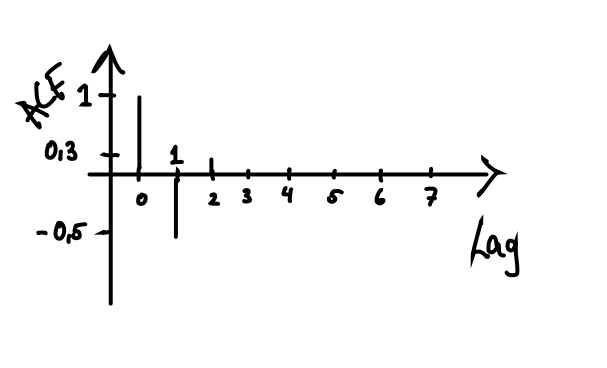
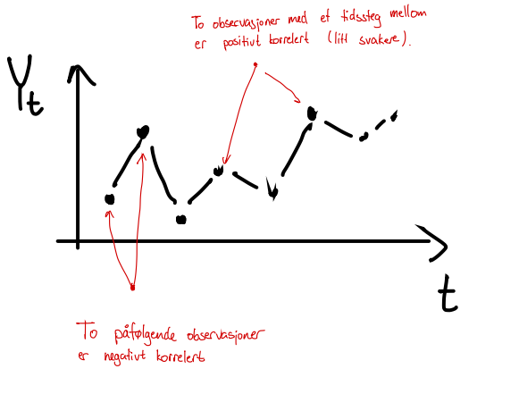
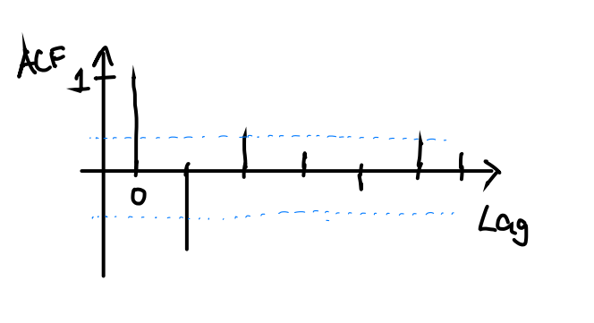

# Tidsrekker

Den neste MET4 handler om tidsrekker. I motsetning til modulene vi har jobbet med frem til nå, der vi separerte teorivideoene og dataøvingene, er disse to elementene nå blandet sammen. Vi har delt stoffet opp i en serie overskrifter, der du finner videosnuttene fulgt av en guide til relevante R-funksjoner, programmeringsøvelser og noen regneoppgaver.

Dataøvingen til denne modulen er også laget for å passe inn i BED4-opplegget. I øvingen skal vi lage prognoser av noen tidsrekker som kommer til å bli nyttige i en av casene i BED4. Hvis du ikke tar BED4 dette semesteret så er det også helt greit -- dataøvingen vår står støtt på egne bein.

Faglærer og studentassistenter vil være tilgjengelig på vanlig måte for konsultasjon, diskusjon og problemløsning.

Lykke til!

## Introduksjon til tidsrekker {#intro}

<div style='padding:75% 0 0 0;position:relative;'><iframe src='https://vimeo.com/showcase/7660844/embed' allowfullscreen frameborder='0' style='position:absolute;top:0;left:0;width:100%;height:100%;'></iframe></div>

### Kontrollspørsmål

1. Hvilke forskjeller er det mellom en tidsrekke og et sett med samtidige observasjoner?
2. Nevn noen typiske mønstre som vi kan se etter i en tidsrekke.
3. Hvorfor er det nyttig å identifisere slike mønstre?
4. Hvorfor kan det være nyttig å glatte en tidsrekke?
5. Beskriv kort hvordan man regner ut et glidende gjennomsnitt.
6. Hvorfor kan vi ikke bruke det glidende gjennomsnittet til å predikere neste observasjon i en tidsrekke?
7. Beskriv kort hvordan eksponensiell glatting fungerer, og hvorfor denne teknikken kan brukes til prediksjon.

### Oppgaver fra lærebok 

**Keller: Statistics for Management and Economics, 11. utg**

**a)** Regn ut et glidende gjennomsnitt med vindusstørrelse 3 for følgende tidsrekke:

|t|Y|
|:---|:---|
| 1 |48|
| 2 |41|
| 3 |37|
| 4 |32|
| 5 |36|
| 6 |31|
| 7 |43|
| 8 |52|
| 9 |60|
|10 |48|
|11 |41|
|12 |30|


<!-- ```{r, echo = F, out.width="300px"} -->
<!-- knitr::include_graphics("bilder/oppgave1.jpg") -->
<!-- ``` -->

<!-- {#id .class width=80% height=80%} -->

<details><summary>Løsning</summary>

|t|     Glidende gjennomsnitt   |
|---|:--------------------:|
| 1 |  NA |
| 2 |  (48+41+37)/3 = 42.00  |
| 3 |  (41+37+32)/3 = 36.67 |
| 4 |  (37+32+36)/3 = 35.00 |
| 5 |  (32+36+31)/3 = 33.00 |
| 6 |  (36+31+43)/3 = 36.67 |
| 7 |  (31+43+52)/3 = 42.00 |
| 8 |  (43+52+60)/3 = 51.67 |
| 9 |  (52+60+48)/3 = 53.33 |
| 10 | (60+48+41)/3 = 49.67|
| 11 | (48+41+30)/3 = 39.67 |
| 12 | NA |


</details>


**b)** Regn ut et glidende gjennomsnitt med vindusstørrelse 5 for tidsrekken over.

<details><summary>Løsning</summary>

|t|     Glidende gjennomsnitt   |
|---|:--------------------:|
| 1 |  NA |
| 2 |  NA  |
| 3 |(48 +41+37+32+36)/5 = 38.8 |
| 4 | (41+37+32+36+31)/5 = 35.4  |
| 5 | (37+32+36+31+43)/5 = 35.8 |
| 6 | (32+36+31+43+52)/5 = 38.8 |
| 7 | (36+31+43+52+60)/5 = 44.4  |
| 8 | (31+43+52+60+48)/5 = 46.8 |
| 9 | (43+52+60+48+41)/5 = 48.8|
| 10 | (52+60+48+41+30)/5 = 46.2 |
| 11 | NA |
| 12 | NA |


</details>


**c)** Tegn inn tidsrekken over med de to glattingene inn i samme figur.

<details><summary>Løsning</summary>

"Manuelt" i R: 

```{r, warning=F}
# Les først inn dine utregninger
time <- seq(12)
y <- c(48, 41, 37, 32, 36, 31, 43, 52, 60, 48, 41, 30)
glatt3 <- c(NA, 42, 36.67, 35, 33, 36.67, 42, 51.67, 53.33, 49.67, 39.67, NA)
glatt5 <- c(NA, NA, 38.8, 35.4, 35.8, 38.8, 44.4, 46.8, 48.8, 46.2, NA, NA) 

# Med base-R plot
plot(time, y)
lines(time, glatt3, col = "red")
lines(time, glatt5, col = "blue")

# eller med ggplot
library(ggplot2)
df <- data.frame(time = rep(time, 2),
                 y = rep(y, 2),
                glatting = c(glatt3, glatt5),
                      vindulengde = factor(c(rep("3", 12), rep("5", 12))))
ggplot(df) +
  geom_point(aes(x = time , y = y)) +
  geom_line(aes(x = time, y = glatting, color = vindulengde))
```

</details>


**d)** Regn ut eksponensiell glatting for tidsrekken under med glattefaktor $w = 0.1$:

|t|Y|
|:---|:---|
| 1 |38|
| 2 |43|
| 3 |42|
| 4 |45|
| 5 |46|
| 6 |48|
| 7 |50|
| 8 |49|
| 9 |46|
|10 |45|


<!--  ```{r, echo = F, out.width="300px"} -->
<!--  knitr::include_graphics("bilder/oppgave1b.jpg") -->
<!--  ``` -->

<details><summary>Løsning</summary>

|t|     Eksponensiell glatting   |
|---|:--------------------:|
| 1 | 38.00 |
| 2 | 0.1(43) + 0.9(38) = 38.50  |
| 3 |0.1(42) + 0.9(38.50) = 38.85|
| 4 | 0.1(45) + 0.9(38.85) = 39.47  |
| 5 |0.1(46) + 0.9(39.47) = 40.12 |
| 6 | 0.1(48) + 0.9(40.12) = 40.91 |
| 7 | 0.1(50) + 0.9(40.91) = 41.82  |
| 8 | 0.1(49) + 0.9(41.82) = 42.53 |
| 9 | 0.1(46) + 0.9(42.53) = 42.88|
| 10 | 0.1(45) + 0.9(42.88) = 43.09 |


</details>

**e)** Gjenta oppgaven over med glattefaktor $w = 0.8$.

<details><summary>Løsning</summary>

|t|     Glidende gjennomsnitt   |
|---|:--------------------:|
| 1 |  38 |
| 2 |  0.8(43) + 0.2(38) = 42.00  |
| 3 |0.8(42) + 0.2(42.00) = 42.00|
| 4 | 0.8(45) + 0.2(42.00) = 44.40  |
| 5 |0.8(46) + 0.2(44.40) = 45.68 |
| 6 | 0.8(48) + 0.2(45.68) = 47.54 |
| 7 | 0.8(50) + 0.2(47.54) = 49.51  |
| 8 | 0.8(49) + 0.2(49.51) = 49.10 |
| 9 | 0.8(46) + 0.2(49.10) = 46.62|
| 10 | 0.8(45) + 0.2(46.62) = 45.32 |


</details>

**f)** Tegn tidsrekken over inn i samme figur som de to glattede versjonene. Ser det ut til å være en trend i denne tidsrekken?

<details><summary>Løsning</summary>

"Manuelt" i R: 

```{r, warning=F}
# Les først inn dine utregninger
time <- seq(10)
y <- c(38, 43, 42, 45, 46, 48, 50, 49, 46, 45)
exp01 <- c(38, 38.50, 38.85, 39.47, 40.12, 40.91, 41.82, 42.53, 42.88, 43.09)
exp08 <- c(38, 42, 42, 44.40, 45.68, 47.54, 49.51, 49.10, 46.62, 45.32) 

# Med base-R plot
plot(time, y)
lines(time, exp01, col = "red")
lines(time, exp08, col = "blue")

# eller med ggplot
library(ggplot2)
df <- data.frame(time = rep(time, 2),
                 y = rep(y, 2),
                glatting = c(exp01, exp08),
                      glattefaktor = factor(c(rep("0.1", 10), rep("0.9", 10))))
ggplot(df) +
  geom_point(aes(x = time , y = y)) +
  geom_line(aes(x = time, y = glatting, color = glattefaktor))

```
Det ser ut til at det er en stigende trend som avtar mot de siste observasjonene i tidsrekken.

</details>

**bonusspørsmål)** Hva blir prediksjonen av $Y_{11}$ når du bruker modellen i henholdsvis oppgave d) og e)? 

<details><summary>Løsning</summary>

Våre prediksjoner av $Y_{11}$ blir da henholdsvis $43.09$ og $45.32$. 

</details>

### R-øving

Vi har lastet [ned den daglige prisen på Eqinoraksjen](datasett/equinor.xlsx) over en 5-års periode fra Oslo Børs' hjemmeside. Vi laster inn datasettet som før ved hjelp av `readxl`-pakken, og henter ut den aktuelle kolonnen. Legg merke til at vi bruker `rev()`-funksjonen til å reversere rekkefølgen til observasjonene slik at den første verdien kommer først:

```{r, message = FALSE, warning = FALSE, eval = FALSE}
library(readxl)
equinor <- read_excel("equinor.xlsx")
pris <- rev(equinor$Siste)                
```

```{r, message = FALSE, warning = FALSE, echo = FALSE}
library(readxl)
equinor <- read_excel("datasett/equinor.xlsx")
pris <- rev(equinor$Siste)                
```

Du kan så lage et raskt plott av tidsrekken:

```{r, eval = FALSE}
plot(pris, type = "l")
```

Både glidende gjennomsnitt og eksponensiell glatting har flere ulike implementeringer i R. For glidende gjennomsnitt skal vi bruke funksjonen `rollmean()` i pakken `zoo`. Du må først installere pakken og laste den inn;

```{r, eval = FALSE, warning = FALSE}
install.packages("zoo")
library(zoo)
```
```{r, echo = FALSE, message = FALSE, warning = FALSE}
library(zoo)
```

Hvis du leser litt på dokumentasjonen til `rollmean()` ved å kjøre `?rollmean` vil du se at du kan regne ut f.eks et glidende gjennomsnitt for Equinoraksjen med vindusstørrelse 5 ved å kjøre

```{r}
pris_glatt5 <- rollmean(pris, k = 5, fill = NA)
```

Da får vi ut en ny vektor med lik lengde som den vi hadde, og som inneholder den glattede versjonen. Den fyller opp verdiene i starten og slutten som vi ikke kan regne ut med et glidende gjennomsnitt med NA, slik at vi kan tegne inn den glattede versjonen i samme plott som vi viste selve tidsrekken:

```{r, eval = FALSE}
lines(pris_glatt5, col = "red")
```

Dersom du er interessert kan du lese mer [her](https://tradingsim.com/blog/simple-moving-average/) om hvordan det glidende gjennomsnittet blir brukt som en investeringsstrategi.

Tanken er at det glidende gjennomsnittet representerer den langsiktige trenden. Dersom tidrekken ligger under det glidende gjennomsnittet tolkes det som at aksjen er på vei nedover, og motsatt: dersom prisen ligger over det glidende gjennomsnittet, så er det et tegn på at aksjen er på vei oppover. Når de to seriene krysser hverandre går "alarmen", og man tar stilling til om man skal kjøpe eller selge. 

Vindusstørrelsen velger man ut fra hvor hyppig man handler. For profesjonelle investorer som driver med handel i høy hastighet kan kanskje 5-dagersviduet som vi regnet ut over være nok. Andre med mellomlang og lang sikt vil gjerne bruke et vindu på 50 eller 200 dager.

**Oppgave:** Regn ut et glidende gjennomsnitt med vindusstørrelse 200 for Equinoraksjen, og tegn det inn i figuren du har laget. Hjelper denne figuren deg til å lage en investeringsstrategi?


<details><summary>Løsning</summary>

Forutsatt at du har gjort det over kan du skrive

```{r, message = FALSE, warning = FALSE}
pris_glatt200 <- rollmean(pris, k = 200, fill = NA)
plot(pris, type = "l")
lines(pris_glatt200, col = "red")
```

Nå kan vi jo ikke se det glidende gjennomsnittet for de siste observasjonene, så ved bare å sammenligne de siste observasjonene hvor vi også har det glidende gjennomsnittet så ligger prisen under det glidende gjennomsnittet, altså bør vi ikke investere (evt. selge, shorte etc.).

</details>

Et problem med analysen over  er at vi trenger *fremtidige observasjoner* til å regne ut den glattede tidsrekken. Det betyr at vi kjenner den glattede versjonen av tidsrekken ved tid $t$ først ved tid $t+200$. Vi kan enkelt lage en annen variant der vi glatter tidsrekken ved tid $t$ ved å ta gjennomsnittet av $Y_{t-200}, Y_{t-199}, \ldots, Y_{t-1}$ i stedet for $Y_{t-100}, \ldots, Y_{t}, \ldots, Y_{t+100}$, altså at vi bare bruker fortiden. Det gjør du i R ved å legge til det ekstra argumentet `align = "right"` i funksjonen `rollmean`. Fordelen nå er at vi ved hvert tidspunkt kjenner både prisen på aksjen og den glattede varianten.

**Oppgave:** Regn ut et glidende gjennomsnitt med vindusstørrelse 200 for Equinoraksjen som hele tiden bruker tidligere observasjoner i glattingen. Tegn glattingen inn i figuren. Hvordan ser investeringsstrategien din ut nå?

<details><summary>Løsning</summary>


```{r, message = FALSE, warning = FALSE}
pris_glatt200 <- rollmean(pris, k = 200, fill = NA, align = "right")
plot(pris, type = "l")
lines(pris_glatt200, col = "red")
```

I denne figuren ligger de siste prisene over det glidende gjennomsnittet noe som er indikasjon på en stigende trend. Altså kan en strategi være å investere i aksjen. 

</details>


**Eksponensiell glatting** har også et annet navn: Holt Winters Metode. En funksjon for å gjennomføre den finnes innebygget i R, og heter `HoltWinters()`. I denne funksjonen er vektparameteren $w$ representert ved argumentet `alpha`. Funksjonen har noen flere argumenter som ikke vi skal bruke, så dersom vi ønsker å regne ut den eksponensielle glattingen for Equinoraksjen med $w = 0.5$, kjører vi:

```{r}
pris_exp1 <- HoltWinters(pris, alpha = .5, beta = FALSE, gamma = FALSE)
```

For å hente ut den glattede versjonen skriver vi

```{r, eval = FALSE}
pris_exp1$fitted[,"xhat"]
```

**Oppgave:** Lag en ny figur der du tegner inn aksjeprisen, samt den eksponensielle glattingen med hhv. $w = 0.5$, $w = 0.01$ og $w = 0.99$.

<details><summary>Løsning</summary>


```{r, message = FALSE, warning = FALSE}
pris_exp1 <- HoltWinters(pris, alpha = .5, beta = FALSE, gamma = FALSE)
pris_exp2 <- HoltWinters(pris, alpha = .01, beta = FALSE, gamma = FALSE)
pris_exp3 <- HoltWinters(pris, alpha = .99, beta = FALSE, gamma = FALSE)

plot(pris, type = "l")
lines(pris_exp1$fitted[,"xhat"], col = "red")
lines(pris_exp2$fitted[,"xhat"], col = "blue")
lines(pris_exp3$fitted[,"xhat"], col = "green")

```


</details>

## Trend og sesong {#trend-og-sesong}

<iframe src="https://player.vimeo.com/video/467126794" width="640" height="360" frameborder="0" allow="autoplay; fullscreen" allowfullscreen></iframe>

### Kontrollspørsmål

1. Hvilke tre komponenter kan en tidsrekke typisk bestå av?

### R-øving

**1. Data.** I pakken `fpp` finnes en tidsrekke som heter `ausbeer`, som er den kvartalsvise produksjonen av øl i Australia fra 1956 til 2008. Du kan få tak i det og se på tidsrekken ved å kjøre følgende  kommandoer:

```{r, eval = FALSE}
install.packages("fpp")
library(fpp)
plot(ausbeer)
```

```{r,warning = FALSE, echo = FALSE, message = FALSE}
library(fpp)
plot(ausbeer)
```

Vi ser at det er en klar trendkomponent, selv om den ikke er lineær, samt en årlig sesongvariasjon.


**2. Dekomponering.** Funksjonen `stl`  *dekomponerer* tidsrekken i de tre komponentene: trend, sesong, og tilfeldig variasjon. For å få tilgang på denne funskjonen trenger vi pakken `forecast`:


```{r, eval = FALSE}
install.packages("forecast")
library(forecast)
```

Vi så kan kjøre funksjonen slik:

```{r}
dekomponert <- stl(ausbeer, s.window = "periodic")
```

Vi kan hente ut de ulike komponentene ved å bruke dollartegnet: `dekomponert$time.series`. Pakken `forecast` har en egen plottefunksjon, `autoplot` som er spesialdesignet for tidsrekkeobjekter. Prøv å plotte de tre komponentene hver for seg ved å kjøre:

```{r autoplot, fig.height=7}
autoplot(dekomponert)
```

**3. Predikere.** For predikering bruker vi funksjonen `forecast()`, som tar en estimert modell som input, og som bruker modellen til å skrive frem tidsrekken ved å estimere fremtidige verdier. Dekomponeringen over utgjør også en modell som vi kan bruke til å predikere fremtidige observasjoner med.  

Kodesnutten under viser hvordan man predikerer $10$ tidssteg frem i tid ved å sette `h = 10` i funksjonen. I tillegg kan funksjonen regne ut prediksjonsintervall med en gitt dekningsgrad, her velger vi `level = 0.95` for $95\%$ prediksjonsintervall. Resultatet lagrer vi i objektet `prediksjon`. Dette objektet kan vi plotte ved bruk av `autoplot`-funksjonen:

```{r}
prediksjon <- forecast(dekomponert, h = 10, level = 0.95)
autoplot(prediksjon)
```

## AR(p) {#ar}

<div style='padding:56.25% 0 0 0;position:relative;'><iframe src='https://vimeo.com/showcase/7661169/embed' allowfullscreen frameborder='0' style='position:absolute;top:0;left:0;width:100%;height:100%;'></iframe></div>

### Kontrollspørsmål

1. Hva er definisjonen på en Hvit-støy-prosess?
2. Hva er definisjonen på en AR(1)-prosess?
3. Hvilken effekt har parameteren $\phi$ på egenskapene til en AR(1)-prosess?
4. Hva er forskjellen på en AR(1)-prosess og en generell AR($p$)-prosess?
5. Hvorfor kan vi si at AR($p$) er en *utvidelse*/*generalisering* av hvit støy?

### R-øving

**1. Simulere.** La oss først se hvordan vi kan simulere noen realiseringer fra disse tidsrekkene. Hvit støy består av ukorrelerte trekninger som alle har samme forventningsverdi og varians, noe vi kan simulere i R ved å bare trekke $n$ uavhengige observasjoner fra hvilken som helst fordeling og kalle det en tidsrekke. For eksempel har vi tidligere trukket standard normalfordelte observasjoner ved hjelp av `rnorm()`-funsksjonen. La oss gjøre det igjen, og plotte det som en tidsrekke. Merk at din trekning ikke vil være identisk som den under:

```{r, fig.height = 3.5}
n <- 50
hvit_støy <- rnorm(n)
plot(hvit_støy, type = "b")
```

Vi kan bruke funksjonen `arima.sim()` til å simulere tidsrekker fra AR-modellen (og den mer generelle ARIMA-modellen, mer om det senere). Du kan for eksempel simulere $n$ observasjoner fra en AR(1)-prosess med $\phi = 0.95$ ved hjelp av følgende kommandoer:

```{r, fig.height = 3.5}
ar1 <- arima.sim(model = list(ar = 0.95), n)
plot(ar1, type = "b")
```

I det siste eksempelet trekker `arima.sim()`-funskjonen hvit-støy-prosessen $u_t$ fra `rnorm()`-funksjonen, men det kan vi endre på hvis vi vil, se hjelpesiden `?arima.sim`. Videre kan vi bruke denne funksjonen til å simulere fra hvit støy ved å sette `model`-argumentet til en tom liste (`model = list()`), eller vi kan simulere fra en AR(2)-prosess med $\phi_1 = 0.2$ og $\phi_2 = 0.1$ ved å sette `model = list(ar = c(0.2, 0.1))`.

**2. Estimere.** 

La oss i første omgang si at vi har observert tidsrekken `ar1` som vi simulerte over, at vi mistenker at den følger en AR(1)-prosess $Y_t = \phi Y_{t-1} + u_t$, og at vi ønsker å estimere den ukjente parameteren $\phi$ ved hjelp av observasjonene. Som vi antydet i **AR**-videoen kan vi i dette tilfellet betrakte det som et regresjonsproblem med $Y_t$ som responsvariabel og $Y_{t-1}$ som forklaringsvariabel. La oss lage en `data.frame` med disse to kolonnene, og se hva vi får når vi bruker `lm()`-funksjonen. .

```{r}
df <- data.frame(Y = ar1[2:n],
                 lagged_Y = ar1[1:(n-1)])
summary(lm(Y ~ lagged_Y, data = df))
```

Vi ser at vårt estimat av $\phi$, som i regresjonutskriften er koeffisienten til `lagged_Y`, er i nærheten av den sanne verdien 0.95, men med så få observasjoner kan det godt hende at ditt estimat er noe forskjellig. Poenget er: vi kan bruke lineær regresjon til å estimere koeffisientene i en AR-modell basert på observasjoner. 


Som i forrige oppgave er pakken `forecast` svært nyttig for estimering og predikering:

```{r, eval = F}
library(forecast)
```


```{r, eval = T, echo = FALSE, message = F}
library(forecast)
```
Denne pakken inneholder en funskjon `Arima` for å estimere koeffisientene i en AR-modell (egentlig den mer generelle klasssen av ARIMA-modeller som vi kommer tilbake til senere). Denne funksjonen kan vi andvende direkte på tidsrekken ved å skrive

```{r}
Arima(ar1, order = c(1, 0, 0))
```
I første omgang kan vi legge merke til at vi har spesifisert *hvilken* modell vi ønsker å estimere gjennom argumentet `order = c(1, 0, 0)`, der ett-tallet angir AR-modellens orden $p$, som i dette tilfellet er 1. Dersom du mistenker at AR(2)-modellen gir en bedre beskrivelse av tidsrekken din, kan du endre til `order = c(2, 0, 0)`. Vi kommer tilbake til spørsmålet om hvordan du kan velge den beste modellen for et gitt praktisk problem.

Legg merke til at de to estimatene ikke er identiske selv om vi bruker det samme tidsrekken. Det er fordi `arima()`-funksjonen ikke bruker minste kvadraters metode til å regne ut estimatene (slik `lm()` gjør), men heller bruker en annen estimeringsteknikk som heter *maximum likelihood*.

**3. Predikere.** For predikering bruker vi funksjonen `forecast()`, som tar en estimert modell som input, og som bruker modellen til å skrive frem tidsrekken ved å estimere fremtidige verdier.

I kodesnutten under bruker vi den simulerte tidsrekken, og estimerer en AR(1)-modell som over som vi lagrer i objektet `ar1_estimat`. Så bruker vi det som argument i `forecast()`, der vi også spesifiserer hvor mange tidssteg fremover vi ønsker å predikere, her velger vi `h = 10`. I tillegg kan funksjonen regne ut prediksjonsintervall med en gitt dekningsgrad, her velger vi `level = 0.95` for $95\%$ prediksjonsintervall.  Resultatet lagrer vi i objektet `prediksjon`.

```{r}
ar1_estimat <- Arima(ar1, order = c(1, 0, 0))
prediksjon  <- forecast(ar1_estimat, h = 10, level = 0.95) 
```

Vi kan plotte resultatet i en pen liten figur ved å bruke funksjonen `autoplot` som under:

```{r, fig.show='hold'}
# Plotter den opprinnerlige tidsrekken, sammen med prediksjon og
# prediksjonsintervall
autoplot(prediksjon)
```

## Stasjonaritet {#stasjonaritet}

<iframe src="https://player.vimeo.com/video/467126666" width="640" height="360" frameborder="0" allow="autoplay; fullscreen" allowfullscreen></iframe>

### Kontrollspørsmål

1. Hva er definisjonen på en stasjonær tidsrekke?
2. Hva er poenget med å innføre stasjonaritet som et konsept i tidsrekkeanalyse?
3. Er AR(1) prosessen $X_t = 1.5 X_{t - 1} + u_t$ stasjonær? 

### Merk

En AR-prosess kan vi definere også med et konstantledd $c$, f.eks: $Y_t = c + \phi Y_{t-1} + u_t$. Vi kan ikke forvente at alle tidsrekkene vi observerer i praksis vil ligge å variere rundt null (dvs at E$(Y_t) = 0$). Vi kan flytte den opp og ned ved å legge til den samme konstanten $c$ i hver tidssteg. I forrige oppgavesett, der vi estimerte parameteren $\phi$ i en AR(1)-modell, kom det (på samme måte som når vi gjør regresjon) ut et estimat av et `intercept`, som altså er denne $c$'en. I den simulerte tidsrekken vi jobbet med der, var det ikke noe konstantledd (altså, $c = 0$), som vi ser igjen i estimatene ved at de ikke er signifikant forskjellige fra null. Vi kunne tvunget estimeringsfunksjonene til å sette $c = 0$, f.eks ved å inkludere argumentet `include.mean = FALSE` i `arima()`-funksjonen.

## Autokorrelasjon {#autokorrelasjon}

<iframe src="https://player.vimeo.com/video/467120768" width="640" height="360" frameborder="0" allow="autoplay; fullscreen" allowfullscreen></iframe>

### Kontrollspørsmål/Diskusjonsspørsmål

1. Formuler med egne ord: Hva er autokorrelasjon?
2. Hva kan vi lære ved å se på autokorrelasjonsplottet til en tidsrekke?
3. Kan du komme på noe vi *ikke* kan finne ut av ved å se på korrelasjoneplottet til en tidsrekke?

### R-øving

**1. Utregning av ACF** I R bruker vi funsksjonen `acf()` til å lage autokorrelasjonsplott. La oss i første omgang gjenskape noen av figurene fra videoen ved hjelp av simuleringer. For eksempel kan vi laget til to tidsrekker som på forrige oppgavesett, en hvit støy og en AR(1):

```{r}
n <- 50
hvit_støy <- rnorm(n)
ar1 <- arima.sim(model = list(ar = 0.95), n)
```

Autokorrelasjonsplottene til disse to tidsrekkene kan vi få frem ved å anvende `acf()`-funksjonen på dem:

<!-- ```{r fig.subcap=c('Autokorrelasjonsplott til en simulert hvit støy prosess', 'Autokorrelasjonsplott til en simulert AR(1)-prosess'), out.width='.49\\linewidth', fig.asp=1, fig.ncol = 2} -->
<!-- acf(hvit_støy) -->
<!-- acf(ar1) -->
<!-- ``` -->

```{r}
acf(hvit_støy)
acf(ar1)
```

Vi ser igjen mønsteret fra videoen: Hvit støy består av ukorrelerte observasjoner, mens AR(1)-modellen består av observasjoner som bygger på forrige observasjon, slik at det er en viss korrelasjon, og dermed avhengighet fra dag til dag. Det ser vi igjen i autokorrelasjonsplottet som gir tydelig utslag, og der korrelasjonen går gradvis mot null med økende avstand mellom observasjonene.

**2. ACF som sjekk av modell** En sjekk vi gjerne gjør for å se om en estimert tidsrekkemodell passer dataene våre, er å se autokorrelasjonen til residualene i modellen er liten. Det betyr nemlig at modellen plukker opp den (lineære) avhengigheten i tidsrekken. For en AR(1) modell er residualene f.eks gitt ved $\hat{u}_t = Y_t - \hat{\phi}Y_{t-1}$, men disse er tilgjengelig direkte fra modell estimeringen i R:

```{r, message=F}
library(forecast)
ar1_estimat <- Arima(ar1, order = c(1, 0, 0))
acf(ar1_estimat$residuals)
```


**3. Oppgave:** Prøv nå å plotte autokorrelasjonsfunksjonen for for følgende tre tidsrekker, og knytt en kort kommentar til hver av dem om hva du lærer om tidsrekken ved å se på autokorrelasjonsplottet til:

1. Prisen på Equinor-aksjen, som vi jobbet med i det første oppgavesettet.

<details><summary>Løsning</summary>

```{r, message = FALSE, warning = FALSE, eval = FALSE}
library(readxl)
equinor <- read_excel("equinor.xlsx")
pris <- rev(equinor$Siste)
acf(pris)
```


```{r, message = FALSE, warning = FALSE, echo = FALSE}
library(readxl)
equinor <- read_excel("datasett/equinor.xlsx")
pris <- rev(equinor$Siste) 
acf(pris)
```

Vi ser at det er høy positiv autokorrelasjon selv for store avstander (lag).  En lav pris (historisk sett) vil være assosiert med lave priser de foregående dagene og tilsvarende for høye priser. Dette stemmer bra med teorien med at dersom markedet er effisient (ikke pensum, slapp av!) skal prisen følge en tilfeldig gang, selv om dette ikke alltid er tilfellet. Det kan altså se ut til at prisen idag er tilnærmet prisen i går pluss ny støy. 


</details>

2. Equinoraksjens *prosentvise avkastning* (som er tilnærmet lik `diff(log(pris))` fra dag til dag.

<details><summary>Løsning</summary>

```{r, message = FALSE, warning = FALSE, eval = FALSE}
pr_avkastning <- diff(log(pris)))
acf(pr_avkastning)
```


```{r, message = FALSE, warning = FALSE, echo = FALSE}
library(readxl)
equinor <- read_excel("datasett/equinor.xlsx")
pris <- rev(equinor$Siste) 
pr_avkastning <- diff(log(pris))
acf(pr_avkastning)
```

Her ser vi at autokorrelasjon er svært lav uansett lag. Det virker altså ikke å være noen lineær sammenheng mellom avkastningen fra en dag til den neste (og den om 2, 3, .. dagen). Dette stemmer bra med at prisen i teorien skal følge en tilfeldig gang og at det i et effisient marked ikke skal gå an å predikere avkastningen for en aksje, noe som i teorien hadde vært mulige hadde det vært en positiv autokorrelasjon.   

</details>


3. Tidsrekken som er igjen etter at du fjernet trend og sesong fra ølproduksjonstidsrekken i det andre oppgavesettet.

<details><summary>Løsning</summary>

```{r, message = FALSE, warning = FALSE}
library(fpp)
library(forecast)

dekomponert <- stl(ausbeer, s.window = "periodic")

acf(dekomponert$time.series[ ,3], na.action = na.pass)
```

Figuren er litt misvisende siden ett lag i figuren svarer til ett år, og siden vi har kvartalsvise observasjoner har vi 4 acf verdier per år. Det kan se ut til at det er en årlig sesongvariasjon som ikke har blitt dekomponert fullt ut av tidsrekken pga av disse toppene i acf som kommer 1,2,3. .. året. 
</details>


Til slutt: husk at også autokorrelasjonsplottene må pyntes og ordnes på hvis vi skal vise dem til andre i rapporter, innleveringer etc. Du kan stort sett bruke de samme argumetene som i vanlige plott: `xlab = `, `ylab = `, `main = ` osv.

```{r, echo = F, eval = F}
library(readxl)
equinor <- read_excel("equinor.xlsx")
pris <- rev(equinor$Siste) 

acf(pris)

acf(diff(log(pris)))

library(fpp)
library(forecast)
plot(ausbeer)
dekomponert <- stl(ausbeer, s.window = "periodic")

acf(dekomponert$time.series[ ,3], na.action = na.pass)
```

## MA(q) {#ma}

<iframe src="https://player.vimeo.com/video/467126617" width="640" height="360" frameborder="0" allow="autoplay; fullscreen" allowfullscreen></iframe>

### Kontrollspørsmål/Diskusjonsspørsmål

1. Hva er definisjonen på en MA(1)- og en MA($q$)-modell?
2. Hvordan skiller definisjonen av en MA-prosess seg fra definisjonen av en AR-prosess?
3. På hvilken måte er autokorrelasjonsfunksjonene til AR- og MA-prosesser forskjellige?
4. Kan du, med egne ord, beskrive en type reelle fenomener som kan modelleres som en MA-prosess?

### R-øving

**1. Estimering og predikering.** På samme måte som for AR-prosessen kan vi nå **simulere** og **estimere** en MA(1)-prosess med $\theta = 0.95$:

```{r, eval = FALSE}
library(forecast)                                # Trengs for estimering
n    <- 100                                      # Antall observasjoner
ma1  <- arima.sim(model = list(ma = 0.95), n)    # Simuler tidsrekken
plot(ma1, type = "b")                            # Lag et plott 
Arima(ma1, order = c(0,0,1))                     # Estimer theta
```
```{r, echo = FALSE, message = F}
library(forecast)                                # Trengs for estimering

```

Stemmer estimatet overens med den sanne $\theta$? Sjekk ut dokumentasjonen `?Arima` og se hva du må gjøre for å spesifisere at modellen ikke har noe konstantledd $c$. Prøv også å modifisere koden fra AR-oppgavene slik at du predikerer den simulerte MA(1)-tidsrekken 10 steg frem. 

```{r, eval = FALSE, echo = FALSE}
library(dplyr)
readr::read_csv("monthly_csv.csv") %>% 
  filter(Source == "GCAG") %>% 
  select(-Source) %>% 
  purrr::map_df(rev) %>% 
  write.csv(file = "temp.csv", quote = FALSE, row.names = FALSE)

```


**2. Analyse av global temperatur.** La oss når ta for oss eksempelet fra videoen der vi ser på den globale månendlige gjennomsnittstemperaturen fra 1880 til 2016. Last ned [temp.csv](datasett/temp.csv), som er en CSV-fil med datasettet. Se på de første par radene:

```{r, eval = F}
temp <- read.csv("temp.csv")
head(temp)
```

```{r, echo = F}
temp <- read.csv("datasett/temp.csv")
head(temp)
```

Første kolonne inneholder informasjon om tidspunkt, og temperaturen er inneholdt i andre kolonne. La oss plotte både temperaturrekken og den *differensierte* temperaturrekken (dvs. forskjellen fra dag til dag). Hvis vi avslører at den differensierte tidsrekken kan regnes ut ved å kjøre `difftemp <- diff(temp$Mean)`, skulle det nå være grei skuring å produsere følgende to enkle plott:

```{r}
difftemp <- diff(temp$Mean)
plot(temp$Mean, type = "l")
plot(difftemp, type = "l")
```

Lag videre autokorrelasjonsplottet som vist i videoen for den differensierte tidsrekken:

```{r, echo = FALSE}
acf(diff(rev(temp$Mean)),
    main = "",
    xlab = "",
    ylab = "")
```

I autokorrelasjonsplottet ser vi nettopp et slikt MA-mønster som vi så i videoen; nemlig at autokorrelasjonen plutselig blir null (eller omtrent null) for et gitt lag. I dette tilfellet har vi at første ordens autokorrelasjon er klart forskjellig fra null, men at den fra og med $k = 2$ nesten ikke har utslag. 

Hvis de differensierte temperaturmålingene faktisk er MA(1), kan den skrives slik:

$$Y_t = c + \theta u_{t-1} + u_t,$$
der $\theta$ er en ukjent parameter. Vi kan bruke datasettet vårt til å estimere $\theta$ ved å bruke `Arima()`-funksjenen på samme måte som da vi estimerte en AR(1)-modell. Den eneste forandringen vi må gjøre er å endre `order`-argumentet fra `c(1, 0, 0)` til `c(0, 0, 1)`:

```{r}
Arima(difftemp, order = c(0, 0, 1))
```

Hvis du har tid til slutt og vil ha litt ekstra trening kan du prøve deg på følgende oppgave: 

- Prediker den differensierte temperaturrekken tre måneder frem i tid.
- Lag en figur der du plotter de 12 siste månedene i den observerte tidsrekken sammen med prediksjonene dine med prediksjonsintervaller.
- **Bonuspoeng:** Husk at vi nå har predikert *forandringen* i den globale gjennomsnittstemperaturen fra måned til måned. Kan du heller lage en figur med selve temperaturserien og bruke prediksjonene dine til å heller plotte inn de tilhørende predikerte temperaturene?
- Pynt så figuren slik at du kan sende den fra deg.

## ARMA og ARIMA {#arma-arima}

<div style='padding:56.25% 0 0 0;position:relative;'><iframe src='https://vimeo.com/showcase/7661207/embed' allowfullscreen frameborder='0' style='position:absolute;top:0;left:0;width:100%;height:100%;'></iframe></div>

### Kontrollspørsmål/Diskusjonsspørsmål

1. Hva er sammenhengen mellom AR-, MA-, og ARMA-modellene?
2. Hva er en ARIMA-modell?
3. Hvilken modell er dette: $$y_t = \phi_1 y_{t-1} + \phi_2 y_{t-2} + \theta u_{t-1} + u_t$$

### R-øving

**1. Data**
Vi tar en ny titt på [den daglige prisen på Eqinoraksjen](datasett/equinor.xlsx) over en 5-års periode som vi så på i introduksjonen til tidsrekker. Vi laster inn datasettet som før ved hjelp av `readxl`-pakken, og henter ut den aktuelle kolonnen. Legg merke til at vi bruker `rev()`-funksjonen til å reversere rekkefølgen til observasjonene slik at den første verdien komme først:

```{r, eval = F}
library(readxl)
equinor <- read_excel("equinor.xlsx")
pris <- rev(equinor$Siste)
plot(pris, type = "l")
```

```{r, echo = F}
library(readxl)
equinor <- read_excel("datasett/equinor.xlsx")
pris <- rev(equinor$Siste)
plot(pris, type = "l")
```

Vi kan lage en figur av den differensierte tidsrekken på følgende måte:

```{r}
# Sjekk av differanse 
diff_pris <- diff(pris)
plot(diff_pris, type = "l")
```

**Oppgave:** Vurder om en ARIMA modell er bedre egnet enn en ARMA modell ut fra de to figurene over.

<details><summary>Løsning</summary>

I forhold til prisen ser den differensierte prisen stasjonær ut og det er derfor rimelig med en ARIMA model. I et effisient marked skal prisen i teorien følge en tilfeldig gang slik at den differensierte tidsrekken bare er støy, altså at prisen følger en ARIMA(0, 1, 0) modell. 

</details>

**2. Estimering av ARIMA modeller**
Vi bruker den samme funksjonen `Arima` fra `forecast` pakken til å estimere både ARMA og ARIMA modeller og spesifisering av modellen gjør vi via argumentet `order`. Skal du estimerer en ARMA(1,1) modell setter du f.eks dette argumentet til `c(1, 0, 1)`. Elementet i midten av denne vektoren spesifiserer hvor mange ganger tidsrekken skal differensieres i ARIMA modellen. Estimering av en ARIMA modell med en enkelt differensiering og ett MA og AR ledd kan gjøres slik:
```{r, message = F}
library(forecast)
arima111 <- Arima(pris, order = c(1, 1 , 1))
```

**3. Hvordan skal vi velge p, d og q i en ARIMA(p,d,q) modell?**
Etter å ha tilpasset en ARIMA modell kan vi bruke modellen til å predikere de samme observasjonene vi har brukt til å tilpasse modellen. Vi kan så sammenligne hvor nær prediksjoner fra forskjellige modeller er de sanne dataene. Dette heter på godt norsk å gjøre en "in-sample" vurdering av modellen. 

Når du har tilpasset en modell, kan du ved å bruke `summary` funksjonen få opp flere mål på hvor god modellen er in-sample under fanen "Training set error measure":

```{r}
summary(arima111)
```

Her er f.eks $RMSE = \sqrt{1/T\sum_{t = 1}^T (\hat{y}_t - y_t)^2}$ et slags gjennomsnittlig avvik mellom prediksjonene og observasjonene. Litt lenger oppe i `summary` utskriften er det også en størrelse som heter AIC som måler hvor sannsynlig hver observasjon er gitt modelvalget ditt. Sammenligner du flere modeller er du  på jakt etter den modellen som har minst RMSE og/eller AIC.

Det krever en del arbeid skal du sammenligne mange ARIMA(p,d,q) modeller ettersom det er så mange måter å kombinere p,d og q på selv om du bestemmer en maksverdi for hver av dem. Det finnes heldigvis en veldig smart R funksjon kalt `auto.arima` som følger med pakken `forecast` som estimerer mange modeller og gir deg ut den modellen med minst AIC:

```{r}
arima_best_AIC <- auto.arima(pris)
summary(arima_best_AIC)
```
Hva slags modell har `auto.arima` valgt her?


**4. Prediksjon**
Prediksjon gjøres som tidligere med `forecast` funksjonen, så hvis en vil predikere 10 tidssteg frem i tid gjør man følgende:
```{r}
pred_arima111 <- forecast(arima111, h =  10)
autoplot(pred_arima111, include = 100)
```

merk at i `autoplot` har vi valgt å bare vise 100 observasjoner av tidsrekken sammen med prediksjonene.

Kommentar: I et effisient marked skal prisutviklingen i teorien følge en tilfeldig gang og dagens pris vil da være det beste du kan tippe på for morgendagens pris. Vi ser her at dette blir reflektert i prediksjonen gjort av Arima(1,1,1) modellen.  

## Modellbygging 

Vi har allerede sett på hvordan vi kan sammenligne modeller "in-sample". For å sammenligne tidsrekkemodeller bruker en ofte også å sammenligne hvor godt modellene predikerer observasjoner som ikke har vært inkludert når man tilpasser modellen. Dette heter på godt norsk å vurdere "out-of-sample" egenskapene ved modellen. 

Det finnes mange varianter for å undersøke dette, og under skal vi ta en titt på en enkel variant.

**Oppgave** Vi viser hvordan dette gjøres for en modell med eksponensiell glatting. Du skal gjenta prosedyren, men for en ARIMA-modell (velg den med best AIC, hint: `auto.arima`). Sammenlign så out-of-sample egenskapene til til disse to modellene.


### R-øving


**1. Data** 
Vi skal i denne øvingen prøve å finne en god modell for dax-indeksen:
```{r, message=F}
library(forecast)
dax <- EuStockMarkets[ ,1]
plot(dax)
```

**2. Trening og test data**
Vi ønsker f.eks å teste hvor god modellen er til å predikere de 10 siste observasjonene i datasettet. Vi deler derfor dataene inn i et treningssett bestående av alle observasjoner utenom disse 10 siste observasjonene, og et testsett bestående av de 10 siste observasjonene:

```{r}
trening <- head(dax, length(dax) - 10)
test <- tail(dax, 10)
```


**3. Estimering og prediksjon**
Vi tilpasser så en modell til treningssettet ved bruk av eksponensiell glatting og predikerer 10 tidssteg frem for å få prediksjoner av testsettet:

```{r}
fit_exp <- HoltWinters(trening)
pred_exp <- forecast(fit_exp, h = 10)
```

Merk at når vi ikke spesifiserer noen argumenter i `HoltWinters` vil en mer avansert modell bli tilpasset, samtidig som glattingsparameteren faktisk vil bli estimert ved å minimerer MSE. 

**3. Out-of-sample vurdering**

Vi kan så sammenligne disse prediksjonene `pred_exp` med de faktiske observasjonene `test` ved å "måle" hvor langt disse er fra hverandre. Funksjonen `accuracy` som kommer med `forecast` pakken regner ut flere forskjellig mål på avstand:

```{r}
accuracy(pred_exp, test)
```
Hver kolonne i utskriften over representerer et slikt mål, og det er rad nummer to med navn "Test set" som vi er interessert i siden det er utregningen av disse målene mellom prediksjonene og testsettet (Den første raden representerer in-sample egenskapene). Jo mindre disse verdiene er jo mindre er avstanden mellom prediksjonene og de sanne verdiene i vårt testsett.

## Oppgaver

1. Første ordens autokorrelasjon til en tidsrekke $Y_t$ er lik $-0.5$. Andre ordens autokorrelasjon er lik $0.3$.
    a. Tegn opp grafen til autokorrelasjonsfunksjonen til $Y_t$.
    b. Forklar med ord hva det vil si at autokorrelasjonsfunksjonen til $Y_t$ ser slik ut for *observerte* verdier av $Y_t$. 
    c. Forklar hva som er forskjellen på autokorrelasjonsfunksjonen til $Y_t$ og den *empiriske* autokorrelasjonen til $Y_t$ som vi har regnet ut for eksempel ved hjelp av 100 observerte realiseringer av tidsrekken. 
    d. Tegn opp en graf som kunne vært den empiriske autokorrelasjonsfunksjonen til $Y_t$ regnet ut for eksempel ved hjelp av 100 observerte realiseringer av tidsrekken.
    
<details><summary>Løsning</summary>

> a. Graf av autokorrelasjonen:

```{r, echo = FALSE, out.width=500}

```


> b. Første ordens autokorrelasjon er lik $-0.5$, noe som betyr at korrelasjonen mellom påfølgende observerte verdier av $Y_t$ er lik $-0.5$. I praksis betyr det at to påfølgende observasjoner vil ha en tendens til å være ganske forskjellige fra hverandre. Hvis $Y_t$ er "liten" (på en eller annen relevant skala), så vil $Y_{t+1}$ ha en tendens til å være "stor". Og hvis $Y_{t+1}$ er "stor", ja da vil $Y_{t+2}$ igjen ha en tendens til å være "liten". 
>
>    Andre ordens autokorrelasjon er lik $0.3$, noe som betyr at korrelasjonen mellom to observasjoner som er observert med ett tidssteg mellom seg er lik $0.3$. I praksis betyr det at dersom $Y_t$ er "liten", så vil $Y_{t+2}$ også ha en tendens til å være "liten", men denne tendensen er noe svakere enn den som er mellom to påfølgende observasjoner, der absoluttverdien til autokorrelasjonen er $0.5$.
>
>    For eksempel kan vi tenke oss at en realisering av $Y_t$ ser slik ut:

```{r,echo = FALSE, out.width=500}

```


>
> c. Dette er samme type spørsmål som vi kjenner til med forventningsverdi/gjennomsnitt, samt teoretisk og empirisk varians. En stokastisk variabel $X$ har en forventningsverdi $\mu$ og en varians $\sigma^2$, men disse er i praksis ukjente. Vi kan derimot *estimere* forventningsverdien ved å ta et gjennomsnitt $\overline X$, og vi kan *estimere* den teoretiske variansen ved å regne ut den *empiriske* variansen $s^2$. Store talls lov garanterer at dette er gode estimater, ved at $\overline X \rightarrow \mu$ og $s^2 \rightarrow \sigma^2$ når antall observasjoner går mot uendelig. 
>
>     Vi har nøyaktig det samme forholdet mellom empiriske og teoretiske autokorrelasjoner. Autokorrelasjonsfunksjonen til $Y_t$ som vi beskrev over er den teoretiske, og den er ikke kjent i praksis med mindre vi simulerer fra en kjent tidsrekkemodell. 
>
>     For et gitt datasett kan vi derimot regne ut den empiriske autokorrelasjonsfunksjonen, som er et *estimat* av det sanne, teoretiske autokorrelasjonsfunksjonen. Vi vet, fra store talls lov, at dette er et godt estimat som vil konvergere mot sannheten etter hvert som vi får flere og flere observasjoner. 
> 
> d. Den empiriske autokorrelasjonsfunksjonen vil ligne på den sanne autokorrelasjonsfunksjonen som vi tegnet opp over, men det vil være noe estimeringsfeil i tillegg som kommer av at vi bare har et endelig antall observasjoner. Laggene med null korrelasjon vil ikke måles til å ha *eksakt* null autokorrelasjon, men bare om lag 5% av dem vil havne utenfor forkastningsgrensene på 5% signifikansnivå. Vi tegner også inn noen tenkte forkastningsgrenser i figuren. 

```{r, echo = FALSE, out.width=500}

```
</details>

2. Vurdere hvilke(n) tidsrekkemodell(er) som passer til de empiriske autokorrelasjonsplottene under, regnet ut ved hjelp av $n=500$ observasjoner.

```{r, echo = FALSE, message = FALSE, warning = FALSE, fig.height=4, fig.width=10, fig.retina=2}
set.seed(69)
library(forecast)
library(patchwork)
library(ggplot2)

n <- 500

ts1 <- arima.sim(n = n, list(ma = c(-0.2279, 0.2488)))
ts1_acf <- 
  ggAcf(ts1) +
  theme_classic() +
  scale_x_continuous(breaks = 1:15, limits = c(0,15)) +
  ggtitle("a)") + xlab("") + ylab("")

ts2 <- arima.sim(n = n, list(ar = c(0.588)))
ts2_acf <- 
  ggAcf(ts2) +
  theme_classic() +
  scale_x_continuous(breaks = 1:15, limits = c(0,15)) +
  ggtitle("b)") + xlab("") + ylab("")

ts3 <- arima.sim(n = n, list(ar = c(-0.5)))
ts3_acf <- 
  ggAcf(ts3) +
  theme_classic() +
  scale_x_continuous(breaks = 1:15, limits = c(0,15)) +
  ggtitle("c)") + xlab("") + ylab("")


(ts1_acf + ts2_acf + ts3_acf) 
```

<details><summary>Løsning</summary>

> a. Vi har et statistisk signifikant negativt utslag på første lag, og et statistisk signifikant positivt utslag på andre lag. Det er ingen flere lags der autokorrelasjonsfunksjonen er stiatistisk signifikant forskjellig fra null. Det kan tyde på en MA(2)-prosess, med $\theta_1 <0$ og $\theta_2>0$.
>
> b. Autokorrelasjonsfunksjonen går sakte mot null med økende lag. Det kan tyde på en autoregressiv prosess, muligens en AR(1)-prosess med $\phi_1 > 0$.
>
> c. Autokorrelasjonsfunksjonen alternerer mellom positive og negative verdier, men i absoluttverdi ser de ut til å avta sakte mot null. Det kan tyde på en autoregressiv prosess, muligens en AR(1)-prosess med $\phi_1 < 0$.
>
> Det er ikke mulig å entydig fastslå hvilken modell som er "korrekt" ut fra et autokorrelasjonsplott. I alle tilfellene kan det være AR- eller MA-ledd som har for små koeffisienter, til at vi klarer å estimere dem til å være statistisk signifikant forskjellig fra null ved hjelp av datasettet som vi har. Det er også vanskelig å visuelt skille høyere ordens prosesser fra hverandre kun ved å se på autokorrelasjonsplottet. I det midterste plottet over for eksempel, kunne det like gjerne vært med andre- og tredjeordens AR-ledd, uten at vi ville klart å se så stor forskjell på plottet. 
>
> (I denne oppgaven er datasettene 500 observasjoner simulert fra henholdsvis en MA(2)-modell med $\theta_1 = -0.2279$ og $\theta_2 = 0.2488$, en AR(1)-modell med $\phi_1 = 0.588$, og en AR(1)-modell med $\phi_1 = -0.5$.)
</details>

3. Under har vi anvendt funksjonen `auto.arima` fra `forecast`-pakken for fire tidsrekker. Identifiser hvilken modell som er plukket ut i hvert tilfelle, og skriv den opp:

```{r, echo = FALSE}
set.seed(69)

n <- 100

ts <- arima.sim(n = n, list(ma = c(-0.34)))
forecast::auto.arima(ts)

ts <- arima.sim(n = n, list(ma = c(-0.34), ar = c(.1, .4)))
forecast::auto.arima(ts)

ts <- arima.sim(n = n, list(ma = c(.2), ar = c(.1), order = c(1,1,1)))
forecast::auto.arima(ts)

ts <- arima.sim(n = n, list(ma = c(.2, .8), ar = c(.1, .5), order = c(2,1,2)))
forecast::auto.arima(ts)
```
<details><summary>Løsning</summary>

> a. En ARMA(1,1)-modell:
> 
>     $$Y_t = 0.4307Y_{t-1} - 0.6955u_{t-1} + u_t,$$
> 
> 
> b. En ARMA(2,1)-modell:
>
>     $$Y_t = 0.3037Y_{t-1} + 0.4736Y_{t-2} - 0.5945u_{t-1} + u_t,$$
>
> c. En ARIMA(1,1,0)-modell:
>
>     $$\Delta Y_t = 0.3568\Delta Y_{t-1} + u_t,$$
>
>     der $\Delta Y_t$ er tidsrekken $Y_t$ differensiert en gang. Med andre ord er førstedifferansen til $Y_t$ en AR(1) prosess med $\phi_1 = 0.3568$.
>
> d. En ARIMA(2,1,2)-modell:
>
>     $$\Delta Y_t = -0.0001\Delta Y_{t-1} + 0.4345\Delta Y_{t-2} + 0.2207u_{t-1} + 0.8386u_{t-2} + u_t,$$
>   
>    Med andre ord er førstedifferansen til $Y_t$ en ARMA(2,2)-modell. 
> 
> I alle tilfellene er $u_t$ hvit støy.

</details>

4. Regn ut forventning og varians til følgende tidsrekkemodeller og avgjør om de er stasjonære. I alle tilfeller er $u_t$ hvit støy der $E(u_t)=0$ og $Var(u_t)=\sigma^2$.


a. $Y_t = t + u_t$
b. $Y_t = 3 + u_t$
c. $Y_t = t\cdot u_t$
d. $Y_t = u_1 + u_2 + \dots + u_t$


<details><summary>Løsning</summary>


>a.
> $$E(Y_t) = E(t + u_t) = E(t) + E(u_t) = t + 0 = t.$$
> $$Var(Y_t) = Var(t + u_t) = Var(t) + Var(u_t) = 0 + \sigma^2 = \sigma^2$$
>
> Siden forventningsverdien ikke er konstant kan ikke dette være en stasjonær tidsrekke.
>
>b.
>
> $$E(Y_t) = E(3 + u_t) = E(3) + E(u_t) = 3 + 0 = 3.$$
> $$Var(Y_t) = Var(3 + u_t) = Var(3) + Var(u_t) = 0 + \sigma^2 = \sigma^2$$
>
> Her er både forventning og varians konstant i tid så dette kan være en stasjonær tidsrekke (vi må formelt også sjekke at autokorrelasjonen er konstant)
>
>c.
>
> $$E(Y_t) = E(t\cdot u_t) = t \cdot E(u_t) = t\cdot 0 = 0.$$
> $$Var(Y_t) = Var(t\cdot u_t) = t^2\cdot Var(u_t) = t^2\sigma^2 $$
>
> Siden varians ikke er konstant i tid kan ikke dette være en stasjonær tidsrekke.
>
> d.
>
> $$E(Y_t) = E(u_1 + u_2 + \dots + u_t) = E(u_1) + E(u_2) + \cdot + E(u_t) = 0 + 0 + \dots + 0 = 0.$$
> \begin{align*}
> Var(Y_t) &= Var(u_1 + u_2 + \dots + u_t) \\ 
> & = Var(u_1) + Var(u_2) + \dots + Var(u_t) = \sigma^2 + \sigma^2 + \dots + \sigma^2 = t\sigma^2
> \end{align*}
> Siden variansen ikke er konstant i tid kan ikke dette være en stasjonær tidsrekke.

</details>


5. [Individuell eksamen V21, oppgave 3](tidligere-eksamensoppgaver/skole-21-v.pdf)
<details><summary>Løsning</summary>
[Løsningsforslag](tidligere-eksamensoppgaver/skole-21-v-fasit.pdf)
</details>


6. [Individuell eksamen V20, oppgave 3](tidligere-eksamensoppgaver/skole-20-v.pdf)
<details><summary>Løsning</summary>
[Løsningsforslag](tidligere-eksamensoppgaver/skole-20-v-fasit.pdf)
</details>

## Relevante R-kommandoer {#relevante-r-tidsrekker}

### Antakelser om datasettet {-}

Vi skal nå ha rimelig grei kontroll på de ulike datastrukturene i R, og det er bra, fordi i denne siste modulen om tidsrekker så er vi nødt til å kunne administrere data i litt forskjellige formater. I hovedtrekke må vi kunne:

- Lese inn data fra en Excel- eller `.csv`-fil til en data frame på samme måte som tidligere, der vi i tidsrekker typisk vil ha en kolonne for dato eller tidspunkt, og en eller flere kolonner med tidsrekker nedover.
- Hente ut tidsrekkene i en data frame som en vektor.
- Akseptere at en del tidsrekkedata (spesielt de som følger med ulike pakker i R) er lagret i andre typer mer spesialiserte datatyper.

Equinordatafilen ([equinor.xlsx](datasett/equinor.xlsx)) følger den første formen og kan leses inn på vanlig måte ved hjelp av `read_excel()` i `readxl`-pakken. `ausbeer`-datasettet fra `fpp`-pakken, derimot, har en spesiell tidsrekke-klasse (prøv å skrive `class(ausbeer)` i konsollen), noe vi ser ved å bare skrive ut tidsrekken i konsollen. Da ser vi at datasettet er på en slags matrisestruktur, men kvartal kolonnevis og år radvis.

### Nødvendige R-funksjoner {-}

Nødvendige R-funksjoner for denne modulen sammenfaller eksakt med gjennomgangen under forelesningsvideoene, så det er ikke nødvendig å gjenta det her. 

