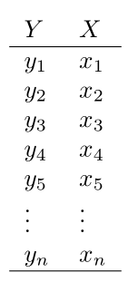
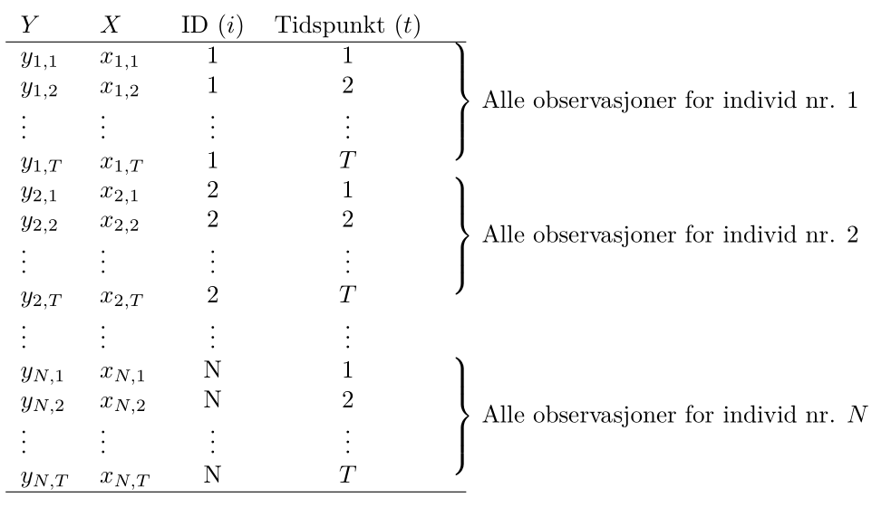
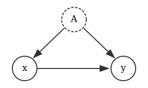

# Avansert regresjon og maskinlæring 

I denne modulen tar vi en titt på noen litt mer avanserte statistiske metoder. De to første temaene, logistisk regresjon og "K-nearest-neighbor"-metoden (kNN), har til felles at de kan brukes når responsvariabelen er en kategorisk variabel med kun to kategorier. Begge disse metodene faller inn under det som populært kalles maskinlæring og er således en introduksjon til dette temaet. I det siste temaet, paneldata, skal vi se hvordan vi kan bygge regresjonsmodeller når hvert individ er observert flere ganger etter hverandre i tid. 

[R-script til "Logistisk Regresjon"](script-slides/logistisk/Logistisk regresjon i R.R)

[R-script til "KNN"](script-slides/logistisk/knn.R)

[R-script til "Paneldata"](script-slides/logistisk/Paneldata i R.R)


## Logistisk regresjon

### Videoforelesninger

<div style='padding:56.25% 0 0 0;position:relative;'><iframe src='https://vimeo.com/showcase/7802418/embed' allowfullscreen frameborder='0' style='position:absolute;top:0;left:0;width:100%;height:100%;'></iframe></div>

### Kontrollspørsmål

* I hvilke situasjoner bruker vi logistisk regresjon?
* Hva er det vi modellerer?
* Hvordan tolker vi èn enhets økning i forklaringsvariabelen?
* Hvilken metode brukes til å estimere en logistisk regresjonsmodell?
* Hva betyr klassifisering og hvordan gjøres dette?
* Hvis vi har flere modeller, hvilke(n) metode(r) kan vi bruker til å velge den beste?

### Teori

I denne forelesningen ser vi på situasjonen der vi ønsker å forklare utfallet av en *binær* variabel (en dummyvariabel) ved hjelp av et sett med forklaringsvariabler. Vi så at vanlig lineær regresjon ikke er særlig passende her fordi utfallet bare kan ta to verdier (0 eller 1, `FALSE` eller `TRUE` etc.), og fordi vi heller ikke kan tolke et kontinuerlig utfall direkte som en sannsynlighet fordi vi kan få ut verdier utenfor intervallet $[0, 1]$.

Løsningen er å heller forklare *log-oddsen til suksessansynligheten*. Sagt på en annen måte: på venstresiden i regresjonsligningen plasserer vi en *transformasjon* av suksessansynligheten, som gir oss en kontinuerlig variabel som kun kan variere mellom 0 og 1.

Pensumboken vår behandler desverre ikke logistisk regresjon. Heldigvis finnes det et meget godt alternativ, *An Introduction to Statistical Learning* (ISLR)  av James m.fl. som kan lastes ned gratis her:

[An introduction to statistical learning](https://www.statlearning.com/) (trykk på "Download the first edition")

Denne boken er for øvrig pensum i **BAN404**. Logistisk regresjon er omhandlet i kapittel *4.3* (avsnitt 4.3.5 er ikke pensum). Eksempelet vårt er tatt herfra, og datasettet er, som vist i forelesningsscriptet, inkludert i bokens egen R-pakke `ISLR`.

Bruk litt tid på å lese gjennom disse sidene, konseptet er ganske godt forklart. Bli også kjent med R-syntaksen, som ligner på den vi allerede kan for vanlig lineær regresjon. Vi bruker f.eks.

```{r, eval = FALSE}
reg1 <- glm(default ~ balance, 
            data = Default,
            family = "binomial")
```

Når du er klar til å prøve selv, kan du se på oppg *10a*, *b* og første del av *d* på s. 171 i ISLR. Dette datasettet er også inneholdt i `ISLR`-pakken.

## Introduksjon til maskinlæring med kNN

### Videoforelesninger

<div style='padding:56.25% 0 0 0;position:relative;'><iframe src='https://vimeo.com/showcase/7802427/embed' allowfullscreen frameborder='0' style='position:absolute;top:0;left:0;width:100%;height:100%;'></iframe></div>

### Kontrollspørsmål

* For hvilke typer responsvariabler bruker vi KNN?
* Hvordan fungerer KNN teoretisk sett?
* Hva er den praktiske tolkningen av KNN?
* Hvordan påvirker valget av $k$ måten KNN fungerer på?
* Hvordan velger vi $k$?

### Teori

Kanskje har du allerede hørt om maskinlæring, "data science", prediktiv modellering, "business analytics", etc., og kanskje har du fått med deg at disse tingene virkelig er i vinden for tiden. Som akademisk institusjon skal vi selvsagt være på vakt mot å la popularitet være en avgjørende faktor for hva vi driver med, men, som en kollega så treffende uttrykte seg: "Internett er kommet for å bli." Det skjer utrolig mye verdiskapning når vi får tak i den verdifulle informasjonen som ligger gjemt i de store datamengdene, og næringslivet skriker etter kompetanse. NHH har som svar på dette opprettet masterprofilen "Business Analytics (BAN)" (som ironisk nok er blitt superpopulær!), og det er naturlig å gi en liten smakebit på hva det går ut på i MET4. Det herlige er at vi ikke trenger å dykke så dypt i detaljene for å få brukbar innsikt i hva som skjer.

Overgangen fra logistisk regresjon er naturlig. Vi bruker det vi kan fra regresjonsanalyse til å sette opp en modell der vi *forklarer* utfallet i en dummyvariabel ved hjelp av et sett forklaringsvariable i allerede observerte data. I første omgang kan vi si at den moderne anvendelsen av logistisk regresjon (kall det gjerne en form for maskinlæring) er å bruke data til å estimere sammenhengen mellom $X$-ene og responsvariabelen $Y$, og så bruke denne sammengengen til å predikere $Y$ for nye $X$.

Artikkelen [*To explain or to predict* av Galit Shmueli](https://projecteuclid.org/euclid.ss/1294167961) forklarer distinksjonen mellom det å forklare og det å predikere godt, og skal være noenlunde lesbar for en interessert student.

Eksempelet fra logistisk regresjon er et godt eksempel på en anvendelse: Vi predikerer sannsynligheten for at kunder vil misligholde gjelden i fremtiden, basert på karakteristika vi kan observere nå. Slike sannsynligheter kan vi mate inn i en strategisk analyse for å bestemme oss hvem som skal få innvilget nye lån, men på en systematisk måte der vi sørger for at vi oppnår nødvendige profittmarginer og håndterer risiko på en fornuftig måte, og kan ta hensyn til f.eks. etiske avveininger. Selv om vi ut fra eget behov for profitt og innenfor en akseptabel risikoprofil kan tilby nye lån til kunder med 15% sannsynlighet for å havne i betalingsproblemer, bør vi likevel gjøre det? *Poenget her er at du ikke kan gjøre slike vurderinger før du faktisk kan estimere sannsynligheten for mislighold!* Statistikken er bunnplanken, og blir mer og mer relevant etter hvert som vi innser at svarene ligger i å analysere data.

Vi går videre til et annet eksempel. En teleoperatør med abonnementskunder ser at det er en systematikk i hvilke kunder som sier opp avtalene sine. Ved å se på spredningsplottet under (rød prikk = kunde som har sagt opp abonnementet), ser det ut til at *nye* kunder med *dyre* abonnementer har en tendens til å forlate oss. Kan vi sette opp en klassifiseringsregel der som vi kan anvende på *alle* kundene våre, som automatisk plukker ut kunder som har f.eks. mer enn 50% sannsynlighet for å si opp? Denne listen kan vi så sende videre til markedsavdelingen, som kan sette i verk forebyggende tiltak (f.eks. lokke de inn i bindende avtaler...?), og vi kan oppnå en *umiddelbar* gevinst.

```{r churn, message = FALSE, echo = FALSE, fig.height = 5, fig.cap = "Røde prikker er kunder som har sagt opp abbonnementet sitt, svarte prikker er kunder som ikke har gjort det. Finn den optimale avveiningen mellom systematikk og tilfeldig variasjon."}
library(ggplot2)
library(dplyr)

telco <- readr::read_csv("datasett/WA_Fn-UseC_-Telco-Customer-Churn.csv") %>% 
  select(Churn, MonthlyCharges, tenure) %>% 
  mutate(Churn = as.factor(Churn))


plot(telco$MonthlyCharges, telco$tenure, 
     xlab = "Måndedlig kostnad ($)",
     ylab = "Lengde på kundeforhold (mnd)",
     pch = 20,
     col = ifelse(telco$Churn == "Yes",
                  yes = alpha("red", .7),
                  no = alpha("black", .15)),
     bty = "l")
grid(col = "grey70")

```

Vi kan angripe dette datasettet på to måter:

- Vi estimerer sannsynligheter ved hjelp av logistisk regresjon. Den stramme strukturen gjør at klassifiseringsgrensen alltid utgjør en rett linje i koordinatsystemet.
- Vi ser også på en annen klassifiseringsregel: kNN (*k* nearest neighbours), som ikke bruker sannsynlighetsmodeller eller regresjonsparametre til å klassifisere, men heller er en enkel regel basert på følgende prinsipp:

> Hvis et flertall av kundene som er mest lik meg har sagt opp, er det mer enn 50% sannsynlig at også jeg vil si opp.

Her bruker vi litt tid på detaljer, men det handler i grunn bare om å lage en presis definisjom om hvem vi definerer som de kundene som ligner mest på meg, og svaret er de $k$ kundene som ligger nærmest meg i koordinatsystemet. 

På samme måte som for logistisk regresjon kan vi lese mer om kNN i [ISLR](https://www.statlearning.com/). På s. 39--42 står det hvordan teknikken fungerer, og i forelesningsnotatene og det medfølgende scriptet ser vi hvordan det kan gjøres i praksis.

Når vi forstår hvordan kNN fungerer, er neste steg å reflektere litt over hvordan vi har tenkt å velge parameteren $k$ i praksis. Vi så i forelesningen at:

- Vi kan ikke velge $k$ for liten. Da ser vi for mye på støy og tilfeldigheter. Vi kan enkelt tenke oss at jeg er en lavrisikokunde, selv om de to kundene som er nærmest meg i koordinatsystemet sa opp av en eller annen grunn. Hvis vi velger $k = 3$, vil jeg likevel bli klassifisert som høyrisiko og bli bombardert med unødvendig reklame (som i seg selv kan gjøre stor skade!) Hadde vi heller valgt $k = 50$ eller $k=500$ ville disse to raringene ikke bli tatt hensyn til, men blitt dominert av alle andre i området som faktisk ikke har sagt opp. Altså: **vi kan ikke henge oss for mye opp i detaljene og den tilfeldige variasjonen!**

- Vi kan heller ikke velge $k$ for stor, for det vil til slutt nærme seg en situasjon det det bare blir en avstemning mellom alle kundene i datasettet. Det er flest kunder som ikke sier opp avtalen, så da blir alle kunder klassifisert som lavrisiko. Altså: **vi vil heller ikke ignorere variasjonen i datamaterialet!** Hele poenget er jo å lære noe nyttig fra hvordan prikkene fordeler seg i koordinatsystemet.

I Figur \@ref(fig:churn) kan du prøve følgende: En liten $k$ svarer til å se nøye på figuren (putt hodet ditt helt inntil skjermen!), og virkelig legge merke til hvor hver eneste en av de røde prikkene befinner seg. Å velge en større $k$ svarer til å trekke lenger bort, og kanskje begynne å myse litt, slik at du får øye på systematikken, nemlig at det røde dominerer nede til høyre i figuren. Til slutt står du i rommet ved siden av med lukkede øyne, og da ser du plutselig ingenting! Et eller annet sted i mellom der ønsker vi å være.

*Kryssvalidering* er en systematisk og generell måte å velge *k* for KNN (og tilsvarende parametre i andre maskinlæringsmetoder), som litt lenger enn å bare dele datasettet inn i trenings- og testdata [ISLR](https://www.statlearning.com/) behandler temaet på s. 181--186, men det er forholdsvis teknisk og skrevet i lys av noen metoder som vi ikke har sett på i MET4. 

## Paneldata {#paneldata}

### Videoforelesninger

<div style='padding:56.25% 0 0 0;position:relative;'><iframe src='https://vimeo.com/showcase/7802431/embed' allowfullscreen frameborder='0' style='position:absolute;top:0;left:0;width:100%;height:100%;'></iframe></div>

### Kontrollspørsmål

* Hva er paneldata?
* Hva må vi ta hensyn til når vi analyserer paneldata?
* Hvordan ser en generell modell for paneldata ut?
* Hva er den konseptuelle forskjellen mellom faste og tilfeldige effekter?
* Når kan vi bruke faste effekter?
* Når kan vi bruke tilfeldige effekter?
* Finnes det en måte å formelt teste om man skal bruke faste eller tilfeldige effekter? (obs: se helt nederst på denne siden for svaret på denne.)

### Teori og R

I denne forelesningen introduserer vi en ny datastruktur. Vi observerer flere individer (tversnittsdimensjonen) *gjentatte ganger* (tidsdimensjonen), og et slikt datasett kaller vi et *panel*, eller *paneldata*. Fordelen ved å jobbe med slike data er åpenbar: vi har mer informasjon og kan gjennomføre mer presise statistiske analyser. På den annen side må vi akseptere at en mer kompleks datastruktur gjør det nødvendig å innføre mer kompleks metodikk.

I gjennomgangen under bruker vi et liten del av dataene fra eksempelet som er beskrevet i videoene. Ønsker du å følge R-gjennomgangen laster du ned følgende datasett:

- [`panel_liten.csv`](datasett/panel_liten.csv)

#### Struktur på Paneldata

Til nå har vi typisk observert $n$ individer *en* gang. Hvis vi holder oss til eksempelet fra videoforelesningen, kan vi tenke oss at vi har spurt $n$ arbeidstakere om hvor mange timer de jobbet forrige år ($X$), og hvor mye de hadde i timelønn ($Y$). Da ville datasettet sett omtrent slik ut:

```{r, echo = FALSE}

```

Her er $y_i$ timelønn til arbeidstaker nummer $i$, og $x_i$ er antall timer jobbet for arbeidstaker nummer $i$. Hvis vi så ønsker å se om det er en sammenheng mellom disse to variablene, kan vi sette opp en enkel regresjonsmodell som vi har gjort før:

\begin{equation}
y_i = \alpha + \beta x_i + \epsilon_i,
\label{p-ols}
\end{equation}
der vi gjør de vanlige antakelsene om homoskedastisitet, uavhengige feilledd, og selvsagt at forklaringsvariabelen er *eksogen*, dvs at de stokastiske variablene $X$ og $\epsilon$ er *uavhengige fra hverandre*. Hvis vi aksepterer det, så kan vi estimere $\beta$ ved hjelp av minste kvadreters metode (OLS - orinary least squares), som vi kan tolke som forventet økning i timelønn ved å jobbe en time ekstra.

For paneldata har vi ikke lenger kun observert $n$ arbeidstakere 1 gang, men  spurt $N$ arbeidstakere $T$ ganger, slik at vi trenger to indekser til å identifisere hver enkelt observasjon: $y_{i,t}$ er timelønn til arbeidstaker nummer $i$ ved tidspunkt $t$. Våre observerte $X$er og $Y$er kan vi samle i en tabell som før, se illustrasjonen under. Legg merke til at det bare er de to første kolonnene for $X$ og $Y$ som utgjør de faktiske observasjonene, mens de to neste kolonnene sier hvilket individ som er observert, og ved hvilket tidspunkt observasjonen er utført, og viser bare indeksene til $X$- og $Y$-observasjonene. Kall det gjerne *metadata*, og vi trenger den informasjonen når vi skal utføre paneldatateknikker.

```{r, echo = FALSE}

```

Formatet i tabellen over kalles gjerne et *langt* format, og omtrent samtlige R-pakker og funksjoner som brukes til å analysere panel data forventer at dataene er organisert på denne måten.

Vi kan ta en titt på hvordan dette ser ut i R for eksempelet vårt:

```{r, warning = F, eval = F}
df <- read.csv("panel_liten.csv")              # Leser inn datasettet
head(df)                                       # Ser på datasettet
```

```{r, warning = F, echo = F}
df <- read.csv("datasett/panel_liten.csv")      # Leser inn datasettet
head(df)                                        # Ser på datasettet
```

Her svarer `lnwg` til responsvariabelen (log) lønn og `lnhr` til forklaringsvariabelen (log) antall timer jobbet. Legg merke til at det er en egen kolonne med navn `id` som forteller oss hvilket individ observasjonene gjelder for. Dette svarer til $i$-indeksen i notasjonen over. Det er også en egen kolonne kalt `year` som forteller oss hvilket år observasjonen er fra, og dette svarer til $t$-indeksen. F.eks er første rad observasjoner gjort for individ nr. 1 i år 1979.    

#### Hva må vi ta hensyn til?

Hovedmotivasjonen for å analysere paneldata er ennå å undersøke sammenhengen mellom respons og forklaringsvariabelen. En slik måte å samle inn data på gir f.eks mer innformasjon om sammenhengen mellom timelønn og antall arbeidstimer fordi vi har flere observasjoner enn om vi bare betraktet en observasjon per individ. Men siden vi har gjentatte observasjoner over tid kan responsvariablene være avhengige. Vi kan se for oss to grunner til dette:

1. En utvikling i tid som er felles for alle individene; Det er f.eks tenkelig at det er en generell utvikling i lønnsnivået over tid, eller at det f.eks finnes *gode* år hvor alle tjener spesielt godt. 
2. De gjentatte observasjonene for ett gitt individ vil typisk være avhengige; Har et individ høy inntekt det ene året er det tenkelig at det også har høy inntekt det neste året. Denne effekten kan misforstås som en effekt av forklaringsvariabelen.  
 
 Altså må vi både ta hensyn til at det kan være en *generell* utvikling i tid og at det kan være  *individuelt*  forskjellige lønnsnivå. Disse aspektene kan nemlig påvirke vårt estimat av effekten av å jobbe mer dersom vi bruker den tradisjonelle regresjonsmodellen og OLS.

La oss inspisere de $3$ individene vi har data for i vårt lille datasett ved å lage et figur med lønnsutvikling (`lnwg`) langs y-aksen og år (`year`) langs x-aksen for å se om det finnes et slags felles mønster i lønnsutviklingen (ref. punkt 1. over):

```{r}
library(ggplot2)  
ggplot(df) +
  geom_point(aes(x = year, y = lnwg, color = factor(id)))
```

her ser vi f.eks at alle individene har et dårlig år i 1983, mens 1985 virker å være et godt år. Det også tydelig at lønnen holder seg relavivt lik lønnen det foregående året. Det er altså rimelig å tro at det er fellestrekk i lønnen til individene for gitte år.
 
La oss så lage et spredningsplott mellom `lnhr` og `lnwg` hvor vi fargelegger hvilket individ observasjonene kommer fra:
 
```{r}
library(ggplot2)  
ggplot(df) +
  geom_point(aes(x = lnhr, y = lnwg, color = factor(id)))
```

Ser vi på disse dataene samlet sett ser du til å være en klart positiv korrelasjon mellom lønn og antall timer jobbet. Men legg merke til at individ nr. 1  ligger på et høyere lønnsnivå og jobber mer enn de to andre individene. Det er dette som i stor grad skaper et bilde av en sterk positiv sammenheng mellom variablene. Hvis vi ser på de individuelle observasjonene (hver fargesky) hver for seg, virker ikke sammenhengen å være like sterk, og det har kanskje ikke like mye å si for lønnen om du individuelt velger å jobber mer. Dette svarer til fenomenet beskrevet i punkt 2. over.   

#### Generelt oppsett av modell

Effektene av de fenomene vi beskrev over kan vi ta hensyn til ved å *inkludere* dem i regresjonsmodellen på følgende måte: 
 
 $$y_{it} = \beta_0 + \beta_1 x_{it} + v_t + \alpha_i + \epsilon_{it} $$
hvor vi nå har lagt til to nye ledd, $v_t$ og $\alpha_i$, i modellen:

1. Her representerer $v_t$ den generelle utviklingen i tid som er felles for alle individene (det er ingen "i"-indeks i denne). Det kan f.eks være en lineær trend ($v_t = \delta t$) eller helt unike årlige effekter $v_t$, som fanger opp *gode* og *dårlige* år. 

2. Leddene $\alpha_i$ representerer så de individuelle lønnsnivåene (disse er "i" indeksert). Har individ $1$ høyere lønn enn individ $2$ så vil $\alpha_1$ blir estimert til å være større enn $\alpha_2$. 

Vi justerer altså for at individer kan ligge på et forskjellig lønnsnivå, og at det er en felles årlige variasjoner i lønn. I praksis betyr dette at vi justerer regresjonslinjen *vertikalt* slik at den tilpasser seg lønnsnivået til hvert individ. Effekten $\beta_1$ av å jobbe mer er derimot antatt lik for hvert individ og den estimerte effekten vil da bli et slags gjennomsnitt av hvor mye det individuelt lønner seg å jobbe mer.

I utgangspunktet kan vi betrakte $v_t$ og $\alpha_i$ som kategoriske variabler som kan estimeres ved hjelp av dummyvariabler slik vi har lært før. Problemet er at i et tradisjonelt paneldatasett så er $N$ (antall individer) et stort tall, mens $T$ (antall observasjoner per individ) et relativt lite tall. Dette fører til svært mange kategoriske variabler $\alpha_i$ å estimere, og i praksis må vi derfor betrakte andre metoder. Vi noterer oss følgende:

* Egenskapene til $\alpha_i$ bestemmer typen paneldatamodell og vi deler disse modellene grovt sett inn i modeller med *faste effekter* og *tilfeldige effekter*. Selve ligningene vil altså se like ut, men tolkning og estimering er forskjellig.

* Leddene $v_t$ vil vi i de fleste tilfeller klare å estimere som kategoriske variabler og i fortsettelsen ser vi bort fra dette leddet 

* For enkelthets skyld betrakter vi bare èn forklaringsvariabel, men det kan selvsagt være flere forklaringsvariabler i en regresjonsmodell for panel data også.    

#### Forskjellige parameteriseringer

Merk at det både i lærebøker og i forskjellige R-pakker veksles mellom å to typer formuleringer av den generelle modellen over. Hvis vi ser bort fra $v_t$ leddet, er modellen vi til nå har betraktet formulert som:

\begin{align}
y_{it} = \beta_0 + \beta_1 x_{it}  + \alpha_i + \epsilon_{it} 
(\#eq:withb)
\end{align}

hvor $\beta_0$ er inkludert. Her kan $\beta_0$ tolkes som det *gjennomsnittlige* skjæringspunktet med y-aksen blant de individuelle regresjonslinjene, mens $\beta_0 + \alpha_i$ vil være skjæringspunktet med y-aksen for individ nr. $i$. Men det er også svært vanlig (og kanskje litt lettere) å formulere modellen uten $\beta_0$: 

\begin{align}
y_{it} = \beta_1 x_{it}  + \alpha_i + \epsilon_{it} 
(\#eq:withoutb)
\end{align}

og da vil $\alpha_i$ være det individuelle skjæringspunktet med y-aksen for individ nr. $i$. Forskjellen er rett og slett tolkningsmessig. I videoen for faste effekter går vi igjennom estimeringen av begge modellene, men under betrakter vi bare estimering av sistnevnte modell når vi bruker faste effekter. Dette gjør vi siden modellen i R er definert på denne måten. Når vi så ser på *tilfeldige effekter* vil vi av samme grunn betrakte modell \@ref(eq:withb). 

#### Faste effekter
 
I en modell med *faste effekter* betrakter vi $\alpha_i$ leddene som *faste størrelser* som må estimeres. Denne modellen er omtrent alltid gyldig og kan brukes selv om vi tror de individuelle forskjellene $\alpha_i$ er relativt store og at det er avhengighet mellom forklaringsvariabelen(e) og $\alpha_i$.

 I modellen vår som er formulert som

 $$y_{it} = \beta_1 x_{it}  + \alpha_i + \epsilon_{it} $$

skal vi altså estimere $\alpha_1, \alpha_2, ..., \alpha_N$ samt effekten av det å jobbe mer $\beta_1$.  Det finnes en rekke estimeringsteknikker og vi vil her (og i videoen) bare beskrive en metode. 

Vi begynner med å ta tidsgjennomsnittet av ligningen over for hvert individ: 

$$1/T \sum_{t = 1}^T y_{it} = 1/T \sum_{t = 1}^T \beta_1 x_{it} + 1/T \sum_{t = 1}^T \alpha_i + 1/T \sum_{t = 1}^T \epsilon_{it}$$
Her vil tidsgjennomsnittet av $\alpha_i$ bare være $\alpha_i$ siden dette leddet ikke varierer med tiden. Altså kan vi skrive ligningen over som:

\begin{align}
\overline{y}_{i} = \beta_1\overline{x}_i + \alpha_i + \overline{\epsilon}_i
(\#eq:timemean)
\end{align}

Her er henholdsvis $\overline{y}_i$ og $\overline{x}_i$ den gjennomsnittlige lønnen og antall timer jobbet for individ nr. i, og dette er størrelser vi kan regne ut. Vi tar så vår originale modell å trekker fra denne ligningen:

$$y_{it} - \overline{y}_{i}  = \beta_1(x_{it} - \overline{x}_i) + \alpha_i - \alpha_i +  \epsilon_{it} - \overline{\epsilon}_i$$
Nøkkelen her er at $\alpha_i$-leddene kansellerer hverandre og vi kan formulere en ligning helt uten disse leddene:

$$\tilde{y}_{it} = \beta_1\tilde{x}_{it} + \tilde{\epsilon}_{it},$$
hvor $\tilde{y}_{it} = y_{it} - \overline{y}_{i}$, $\tilde{x}_{it} = x_{it} - \overline{x}_{i}$ og $\tilde{\epsilon}_{it} =  \epsilon_{it} - \overline{\epsilon}_{i}$. 

Siden vi nå ikke lenger har $\alpha_i$ i ligningen, og siden $\tilde{\epsilon}_{it}$ bare er et nytt feilledd sentrert rundt null, kan vi estimere $\beta_1$ ved vanlig OLS, altså velge den verdien $\hat{\beta}_1$ som minimerer:

$$\sum_{i=1}^N\sum_{t=1}^T(\tilde{y}_{it} - \beta_1\tilde{x}_{it})^2$$

Gitt et estimat av $\beta_1$ kan vi få estimater av $\alpha_1, \dots, \alpha_N$ ved å  og ta forventning av den tidsgjennomsnittlige modellen \@ref(eq:timemean) (da forsvinner $\overline{\epsilon}_{it}$ leddet), erstatte $\beta_1$ med estimatet $\hat{\beta}_1$ og løse ligningen m.h.p $\alpha_i$.  

\begin{align}
\hat{\alpha}_1 &= \overline{y}_{1} - \hat{\beta}_1\overline{x}_1\\
\hat{\alpha}_2 &= \overline{y}_{2} - \hat{\beta}_1\overline{x}_2\\
&\vdots\\
\hat{\alpha}_N &= \overline{y}_{N} - \hat{\beta}_1\overline{x}_N\\
\end{align}

Sluttproduktet er derfor $N$ individuelle regresjonslinjer:

\begin{align}
y_{1t} &= \hat{\alpha}_1 + \hat{\beta}_1 x_{1t}   \\
y_{2t} &= \hat{\alpha}_2 + \hat{\beta}_1 x_{2t}   \\
&\vdots\\
y_{Nt} &= \hat{\alpha}_N + \hat{\beta}_1 x_{Nt}   \\
\end{align}

som har individuelle skjæringspunkt med $y$-aksen ($\hat{\alpha}_i$) for å justere for forskjellig lønnsnivå, men hvor *alle* observasjonene har blitt brukt til å estimere det felles stigningstallet $\hat{\beta}_1$. 

Det er verdt å merke seg at denne metoden ikke kan brukes dersom forklaringsvariabelen ikke varierer med tid (eksempelvis kjønn). Da vil nemlig $x_{it} - \overline{x}_i = x_{it} - x_{it} = 0$, og vi har derfor ingen mulighet til å estimere $\beta_1$ med OLS. 

<!-- Det finnes flere pakker som kan estimere slike modeller i R, men en veldig enkel pakke å bruke heter `plm`. Det første vi gjør er å laste pakken forså å "oversette" dataene våre til paneldata. På denne måten forstår `plm` funksjonen hva som er individ indeksen og hva som er tidsinndeksen:

```{r, warning = F, message=F}
library(plm)      # Pakke for å estimere faste effekter

# Oversetter til panel data frame
p.df <- pdata.frame(df,
                    index = c("id" ,"year"))

```

Syntaksen for å bruke `plm` funksjonen er svært lik den for `lm` og `glm`. For å bruke en modell med faste effekter må man huske å spesifiserer argumentet `model = "within"`:

```{r}

reg.fe <- plm(lnwg ~ lnhr,
              data = p.df,
              model = "within")
summary(reg.fe)

```
--> 

Det finnes flere pakker som kan estimere slike modeller i R. Den moderne standarden, som både er enkel å bruke og effektiv på store datasett, heter `fixest` (med kommandoen `feols`). Syntaksen for å bruke `plm` funksjonen er svært lik den for `lm` og `glm`. For å inkludere faste effekter legger vi dem inn bak en vertikal strek:

```{r, warning = F}
library(fixest)      # Pakke for å estimere faste effekter

reg.fe <- feols(lnwg ~ lnhr | id, # id er FE-variabelen
                data = df)
summary(reg.fe)
```


Vi ser at den estimerte $\beta_1$ (effekten av å jobbe mer) estimeres til $0.36$. Vi kan også få ut estimatene for de faste effektene $\alpha_1$, $\alpha_2$ og $\alpha_3$: 

```{r}
fe <- fixef(reg.fe) #henter ut FE
fe$id #viser for ID
```

Det kan være nyttig å ta en visuell innspeksjon på hvordan de individuelle regresjonskurvene passer til dataene. Til å gjøre dette trenger vi en annen pakke, `plm`, som har denne funksjonen innebygd:

```{r, warning = F, message=F}
library(plm)
# klargjør og kjører samme modell med plm som med feols
## Oversetter til panel data frame
p.df <- pdata.frame(df,
                    index = c("id" ,"year"))
reg.fe2 <- plm(lnwg ~ lnhr,
              data = p.df,
              model = "within")

# plotter
plot(reg.fe2)
```

Denne figuren viser også hvordan regresjonskurven ville sett ut dersom vi hadde sett bort fra paneldatastrukturen og brukt en helt vanlig (pooled) regresjonsmodell. Sammenlignet med modellen med faste faste effekter (within) så ville vi da estimert effekten av jobbe mer til å være større. Selv om produktet her er $3$ individuelle regresjonsmodeller, presiserer vi at dette ikke er $3$ uavhengige analyser; alle observasjonene er brukt til å finne et estimat på $\beta_1$.        

<!-- Vi husker at det også kunne være en felles tidskomponent $v_t$ i en slik modell og at denne kunne betraktes som en kategorisk variabel siden det typisk ikke er så mange ($T$) av disse. Vi kan derfor bare legge til `year`  som en ekstra (kategorisk) forklaringsvariabel forutsatt at den er koded som en `factor`:-->

Vi husker at det også kunne være en felles tidskomponent $v_t$ i en slik modell og at denne kunne betraktes som en kategorisk variabel siden det typisk ikke er så mange ($T$) av disse. Vi kan derfor bare legge til `year`  som en ekstra (kategorisk) forklaringsvariabel. Med `feols` kan vi gjøre dette ved å skrive `i()` rundt variabelnavnet:


```{r}
reg.fe <- feols(lnwg ~ lnhr + i(year) | id,
                data = df)
summary(reg.fe)
```
For dette lekedatasettet kunne vi strengt tatt også betraktet $\alpha_i$-leddene som kategoriske variabler, men som sagt er som regel $N$ for stor til at dette lar seg gjøre.

I praksis pleier vi ofte bare legge inn faste effekter direkte, i stedet for å bruke kategoriske variabler (med mindre vi er interesserte i koeffisientene på disse kategoriske variablene spesifikt). Det er mer effektivt, og vi slipper at de dukker opp sammen med de koeffisientene vi er interesserte i. Vi ser at dette gir akkurat samme resultat som tidligere (men er mye enklere å implementere):

```{r}
reg.fe3 <- feols(lnwg ~ lnhr | id + year,
                data = df)
etable(reg.fe, reg.fe3)
```

#### Tilfeldige effekter
Hovedmotivasjonen for analysen av paneldataene er å finne ut hva effekten av å jobbe mer er ($\beta_1$). Vi vet at det eksisterer individuelle effekter $\alpha_i$ som en konsekvens av datastrukturen, men vi er ikke nødvendigvis interessert i disse verdiene i seg selv.  

I motsetning til en modell med *faste effekter* hvor vi betraktet $\alpha_i$ som faste størrelser,  vil vi i en modell med *tilfeldige effekter* betrakte disse som *tilfeldige variabler*. I en slik modell estimerer vi derfor heller *fordelingen* til disse effektene. En vanlig antagelse er da at

*$\alpha_i\sim N(0, \sigma_{\alpha}^2)$ dersom vi bruker parameteriseringen \@ref(eq:withb) med $\beta_0$ inkludert.  
* $\alpha_i\sim N(\beta_0, \sigma_{\alpha}^2)$ dersom vi bruker parameteriseringen \@ref(eq:withoutb) uten $\beta_0$.  

Variansen $\sigma_{\alpha}^2$ er da et mål på *uobservert heterogenitet*; i dette tilfellet hvor stor variasjon det i lønnsnivået mellom individene. Det også vanlig å anta at $\epsilon_{it}\sim N(0, \sigma_{\epsilon}^2)$, så i en slik modell skal vi altså estimere $\beta_1$ (og $\beta_0$), $\sigma_{\alpha}^2$ og $\sigma_{\epsilon}^2$. Vi bruker altså bare èn ekstra parameter ($\sigma_{\alpha}^2$) for å justere for forskjellen i lønnsnivåene. Sammenligner vi dette med modellen med faste effekter der vi trengte $N$ ($\alpha_1, \alpha_2,\dots,\alpha_N$) ekstra parametre er dette en mye enklere modell.

En modell med tilfeldige effekter brukes dersom det er rimelig å anta at de individuelle effektene $\alpha_i$ er små og uavhengig av forklaringsvariabelen(e). Dersom dette er oppfylt viser det seg at en kan få mer presise estimat av effekten vi egentlig er interessert i , $\beta_1$. Det finnes en rekke estimeringsmetoder og vi skal ikke gå detaljer på noen her, men nevner:

* Varianter av minstekvadraters metode som kan minne om det vi gjorde for faste effekter.
* Sannsynlighetsmaksimeringsestimering.
* Bayesiansk estimering.

De to siste metodene er mye brukt for å estimere tilfeldige effekter. 

<!--I R kan vi fortsatt bruke `plm`, men må endre `model` argumentet til `"random"`: -->

I R trenger vi nok en gang `plm` (som vi gjorde for å plotte de faste effektene over), men må endre `model`-argumentet til `"random"`:

```{r}
# tilfeldig effekt modell
reg.re <- plm(lnwg ~ lnhr,
              data = p.df,
              model = "random")
summary(reg.re)
```
I motsetningen til modellen vi estimerte med faste effekter er nå parameteriseringen gjort med $\beta_0$ leddet inkludert (modell \@ref(eq:withb)) og vi ser at dette blir estimert til å være $-1.35$. Videre estimeres effekten av å jobbe mer til $\hat{\beta}_1 = 0.54$. Litt lenger oppe i utskriften ser vi at  $\hat{\sigma}^2_{\alpha}= 0.0242$ ("individual"), mens $\hat{\sigma}^2_{\epsilon}= 0.0134$ ("idiosyncratic").   

#### Hausman test

En modell med faste effekter vil være mulig å bruke i alle tilfeller, mens en modell med tilfeldige effekter har strengere krav til hvordan disse individuelle effektene oppfører seg. Dersom disse er oppfylt er det en fordel å bruke en modell med tilfeldige effekter. 

En strategi for å finne riktig modell er å estimere begge modellene forså å utføre en såkalt Hausman test. Nullhypotesen er da at den riktige modellen er den med tilfeldige effekter. Forkaster vi bruker vi modellen med faste effekter, forkaster vi ikke bruker vi modellen med tilfeldige effekter.

I R utfører vi testen slik:

```{r}
# Hausman test
# Vi trenger modellene vi har laget med plm, som heter reg.fe2 og reg.re

phtest(reg.fe2, reg.re)
```
Siden vi får forkastning vil den beste modellen for dette (leke-)datasettet være modellen med faste effekter.

## Identifikasjon og kausalitet
**Litteratur** Denne modulen er godt dekket av Scott Cunninghams *Causal Inference: The Mixtape*, tilgjengelig på https://mixtape.scunning.com. Cunningham har også nyttige data- og kodeeksempler. Se særlig kapittel 4 og 8. Kapittel 7 og 9 beskriver eksempler på metoder for å studere naturlige eksperimenter (Differences-in-Differences og instrumentelle variabler), som vi bare ser kort på i dette kurset. Det er ikke meningen at vi skal lære å gjennomføre disse mer avanserte regresjonsmetodene. Målet er i stedet at vi skal lære å reflektere over kausalitetsspørsmålet, og vite om noen vanlige løsninger når variasjonen vi er interessert i, i utgangspunktet er endogen. 

For deg som er særlig interessert anbefales boka *Mastering 'Metrics* av Angrist og Pischke (2015), som bl.a. er tilgjengelig på NHH-biblioteket. Kapittel 1 og 2 er mest sentrale for oss. Kapittel 3 og 5 beskriver eksempler på metoder for å studere naturlige eksperimenter (Differences-in-Differences og instrumentelle variabler).


### Kausalitet 
Hittil i faget har vi i stor grad beskrevet statistiske sammenhenger. Vi har kunnet observere en korrelasjon (om to variabler samvarierer) og andre statistiske trender, eksempelvis om et utfall systematisk er større enn null. Vi har imidlertid i liten grad kunne sagt noe om *effekter* eller om én variabel har *forårsaket* en endring i en annen variabel.  

Ofte er målet med statistisk analyse å si noe om hvorvidt én variabel *påvirker* en annen variabel, eller om en hendelse *fører til* en annen hendelse. Dette kaller vi å trekke **kausale slutninger**, nemlig slutninger som sier noe om en årsakssammenheng. Det ligger noen vilkår til grunn for at det skal være mulig å tolke en sammenheng kausalt, men disse vilkårene lar seg som regel ikke teste med data. I praksis er dette ofte et tolkningsspørsmål: Hvis vi har brukt data til å finne en statistisk sammenheng, hva forteller denne sammenhengen oss om virkeligheten? 

Hittil i kurset har vi understreket at å gjennomføre statistiske tester (som hypotesetester) eller estimere parametere (for eksempel med lineær regresjonsanalyse) ikke er tilstrekkelig for å trekke kausale slutninger. Denne delen introduserer noen verktøy for å vurdere om det er rimelig å trekke en kausal slutning i ulike situasjoner, og hvilke grep vi kan ta for å gjøre det mer rimelig. 

### Identifikasjon 
Første steg i empirisk analyse er alltid å bestemme seg for et forskningsspørsmål. I denne sammenhengen: Hva er effekten du vil estimere? Det innebærer å stille et presist og målbart spørsmål. La oss si at vi ønsker å si noe om effekten av å ta høyere utdanning på fremtidig lønn. Selv om dette antyder et spørsmål, er det ikke nok til å sette fingeren på hvilken parameter vi trenger å estimere.  For å bestemme oss for denne parameteren, er det nyttig med et tankeeksperiment: Hva vil vi endre, og hva vil vi måle? Ved å se for oss at vi *tvinger* noen til å ta ett års ekstra skolegang, hva skjer med lønna deres fem år senere? 

Identifikasjon er et sentralt begrep i økonometrien, og omhandler *parameteren* vi ønsker å si noe om. Ofte kan vi hente denne fra en teoretisk modell, eller fra et bredere, mer generelt forskningsspørsmål vi vil vite mer om. Der estimering handler om hva vi kan si på bakgrunn av den dataen vi har foran oss, er identifikasjon mer abstrakt. Vi sier at en parameter er  **identifisert** hvis vi kan bestemme den basert på data som kan observeres (men ikke nødvendigvis som vi observerer). Vi kan tenke på dette som at vi klarer å forestille oss en setting vi kan bruke til å identifisere parameteren -- selv om vi ikke nødvendigvis har dataen. 

#### Det ideelle eksperimentet
Den enkleste måten å tenke på identifikasjon på er å sette opp et ideelt eksperiment. Gitt parameteren du vil identifisere, hva er den ideelle måten å måle dette på? Still deg selv tre spørsmål:

1. Hva vil du manipulere? Hvilken variabel vil du endre, og hvor mye?
2. Hva vil du måle? Hvilket utfall, og når?
3. Hva sammenlignes med hva? Hvem er behandlingsgruppen, hvem er kontrollgruppen, og hvorfor er de sammenlignbare?

Det tredje spørsmålet er det viktigste, og det skiller ofte gode forskningsdesign fra dårlige. En effekt er alltid en forskjell mellom det som skjedde og det som ville skjedd uten behandlingen. Det ideelle eksperimentet må gi oss begge deler. I praksis løser vi dette med randomisering. Hvis vi tilfeldig bestemmer hvem som får behandlingen, vil behandlings- og kontrollgruppen i gjennomsnitt være like i utgangspunktet. Da kan vi tilskrive forskjellen i utfall til behandlingen, og ikke til andre faktorer som skiller gruppene.

La oss gå tilbake til spørsmålet om utdanning. Vi vil vite effekten av ett års ekstra skolegang på lønn fem år senere. Hva er det ideelle eksperimentet?

- Manipulasjon: Vi tvinger noen til å ta ett ekstra år med utdanning, mens andre ikke får lov.
- Utfall: Vi måler lønna til begge grupper fem år etter.
- Sammenligning: Fordi vi tilfeldig bestemte hvem som fikk ekstra utdanning, er gruppene sammenlignbare. De har samme evner, samme motivasjon, samme bakgrunn i gjennomsnitt, og forskjellen i lønn må derfor skyldes utdanningen.

Vi kan selvsagt ikke gjennomføre dette eksperimentet. Men det gir oss et referansepunkt. Når vi skal vurdere en empirisk strategi (enten vår egen eller noen andres) er det nyttig å spørre seg hvor  nær vi kommer det ideelle eksperimentet, og hvilke antakelser som kreves for å komme dit.


### Eksogenitet som identifikasjonsbetingelse: Når kan vi gi en statistisk sammenheng en kausal tolkning? {#ekso}
Når vi skal tolke en statistisk sammenheng som en årsakssammenheng trenger vi både å si noe om en sammenheng vi ser i virkeligheten (noe deskriptivt), og å si noe om hva som ville skjedd under andre omstendigheter (noe **kontrafaktisk**). I den moderne økonometrilitteraturen omtales dette rammeverket som "potensielle utfall". Tenk deg at vi kunne observert det samme individet i to helt like settinger som bare er ulike på én måte, nemlig at det mottar en form for behandling (treatment) i den ene settingen og ikke mottar slik behandling. Da kunne vi sammenliknet de to utfallene og vært sikre på at enhver forskjell i utfallene må skyldes behandlingen individet mottok. I virkeligheten kan det kontrafaktiske utfallet nødvendigvis ikke observeres, og vi må tilnærme oss dette idealet ved å holde så mange faktorer som mulig, konstante. Siden dette aldri vil bli helt ideelt -- eller kan testes -- må vi gjøre *antakelser* for å kunne trekke kausale konklusjoner. Hvorvidt disse antakelsene er rimelige, vil variere fra kontekst til kontekst. 

I praksis anvender vi ofte regresjonsmodeller for å trekke ut statistiske sammenhenger. I modulen om "Enkel regresjon" gjennomgikk vi noen forutsetninger for OLS. En enkel regresjonslikning kunne se slik ut: 
$$y_{i}=\beta_0+\beta_1x_{i}+\varepsilon_{i}$$
Med denne likningen deler vi opp $y_i$ i tre deler: Konstantleddet $\beta_0$, det $x$ forklarer ($\beta_1x_i$) og det $x$ ikke forklarer (restleddet $\varepsilon_i$). 

Én sentral betingelse for OLS var **eksogenitet**, nemlig at forventningsverdien til restleddet $\varepsilon_i$ gitt forklaringsvariabelen $X_i$, er lik null: 
$$\mathbb{E}[\varepsilon_i \vert x_i]=0$$
Dette innebærer at det ikke må være noen systematisk sammenheng mellom restleddet og forklaringsvariabelen -- vilkåret forutsetter bl.a. at det ikke er noen korrelasjon mellom $\varepsilon$ og $x$, slik at $\mathbb{E}[\varepsilon_i x_i]=0$. Intuitivt krever eksogenitet at  oppdelingen av $y_i$ i ulike deler er "ren", dvs. at det vi putter i $\varepsilon$-boksen virkelig er uavhengig av $x$. Hvis noe i $\varepsilon$-boksen egentlig hører sammen med $x$, har vi et problem.

Dersom dette vilkåret ikke holder sier vi at $x_i$ er **endogen**. Da blir regresjonsparameteren $\beta_1$ forventningsskjev, og plukker opp noe mer enn bare sammenhengen mellom forklaringsvariabelen $X_i$ og utfallsvariabelen $Y_i$. Vi skal se på noen eksempler lenger ned. 

#### Trusler mot identifikasjon

<!-- Legge inn en smak av potential outcomes her? --> 

##### Eksempel 1: Fører sykehusopphold til dårligere helse? {-}
<!-- Formål: Vise seleksjon --> 
Et typisk lærebokeksempel (se for eksempel Angrist og Pischke, 2009) er sykehusopphold. La oss si at vi ønsker å lære noe om hvorvidt sykehusopphold bedrer helsetilstanden til de innlagte. 
I gjennomsnitt har en pasient innlagt på sykehus signifikant dårligere helsetilstand enn noen som ikke er innlagt på sykehus. Dersom vi skulle gjort en regresjon eller en hypotesetest, ville denne konkludert med at innlagte på sykehus har dårligere helse enn befolkningen forøvrig. Betyr det at sykehusbehandling *fører til* dårligere helsetilstand? Det høres lite sannsynlig ut. Det er mer nærliggende å tro at pasienter som er innlagt på sykehus, er innlagt fordi de *allerede* har dårligere helsetilstand enn befolkningen forøvrig. I dette eksempelet er altså $X_i$ og $\varepsilon_i$ korrelert. Det er lettere å tro på omvendt kausalitet -- altså at det er den dårlige helsetilstanden som førte til sykehusoppholdet -- enn opprinnelige tolkningen om at sykehusoppholdet førte til dårligere helsetilstand! 

Dette er et klassisk eksempel på **seleksjonsskjevhet**: Forventningsskjevhet i estimatene som introduseres fordi individene tildeles behandling på bakgrunn av ikke-tilfeldige egenskaper som eksisterte før behandlingen trådde i kraft. Individene ville hatt ulik helse også i fravær av behandlingen -- vi kan derfor ikke sammenlikne disse gruppene for å lære noe om effekten av behandlingen på utfallet vi var interessert i. 


##### Eksempel 2: Fører lengre utdanning til høyere lønn? ([Angrist og Krueger, 1991](https://www.jstor.org/stable/2937954))  {-#eks2}
Effekten av utdanning på lønn er et sentralt spørsmål i arbeidsmarkedsøkonomien. Umiddelbart kan man fristes til å ville kjøre en regresjon med lønn på venstre side av likhetstegnet, og hvor lang utdanning individet har på høyre side av likhetstegnet. La oss kalle utfallsvariabelen lønn $w_i$, og la oss kalle variabelen for hvor mange års utdanning individet har fullført $x_i$. Da vil en enkel regresjonslikning se slik ut: 
$$ \log w_i = \beta_0 + \beta_1 x_i + \varepsilon_i$$ 
Dersom $x_i$ er eksogen kan vi tolke $\beta_1$ som at ett års ekstra utdanning fører til at individet får omtrent $\beta_1 \%$ høyere lønn. 

La oss bruke dette datasettet^[Datasettet vi skal bruke er en forenklet versjon av Angrist og Kruegers replikasjonspakke, som kan hentes [her](https://economics.mit.edu/people/faculty/josh-angrist/angrist-data-archive).]:

[Angrist_Krueger_eksempelfil](datasett/Angrist_Krueger_eksempelfil.Rdata) 

```{r last-data, message=FALSE, warning = F, eval = F}
library(dplyr)
load("Angrist_Krueger_eksempelfil.Rdata")
```

```{r last-data-sant, message=FALSE, warning = F, echo = F}
library(dplyr)
load("datasett/Angrist_Krueger_eksempelfil.Rdata")
```

```{r OLS-modell}
ols <- lm(logwage ~ educ, data = AK)
summary(ols)
```
Dersom vi tror på denne "naïve" modellen, tolker vi det altså som at ett års ekstra skolegang fører til at ukentlig lønn øker med 7 \%. Det er imidlertid gode grunner til også å være skeptisk til denne modellen. Vi kan tenke oss at det er flere årsaker til at noen individer har flere års skolegang enn andre. Personer som har bedre akademiske evner vil sannsynligvis velge å ta lengre utdanning enn de som er mindre akademisk anlagt. I mange sammenhenger vil også personer med akademiske evner få høyere lønn -- også i fravær av høyere utdanning. Da risikerer vi at $\beta_1$ fanger opp mer enn bare effekten av utdanning på lønn -- den fanger også opp effekten av å ha bedre evner. <!-- Slik kan vi også tenke på sosioøkonomiske forhold. Personer fra rike familier har ofte mulighet til å ta lengre utdanning enn personer fra fattige familier, bl.a. fordi utdanning kan være kostbart. Personer fra familier med høyere inntekt vil kanskje --> 

Dette er et eksempel på **utelatt variabelskjevhet**: <!-- er det riktig term? --> Når det er en variabel forskeren ikke observerer, men som er korrelert med både utfalls- og forklaringsvariabelen. Da vil forklaringsvariabelen også fange opp noe av sammenhengen mellom den utelatte variabelen, og altså fange opp *mer* enn den kausale effekten på utfallet av forklaringsvariabelen. 

<!--
### Potensielle utfall 
Potensielle utfall gir oss et rammeverk for å tenke på 

Det finnes ingen sikre tester vi kan bruke for å undersøke om vi har estimert en kausal sammenheng, eller ikke. I stedet må vi vurdere hvert enkelt tilfelle for seg: Er det 
--> 

#### I en ideell verden: Randomiserte, kontrollerte forsøk (RCT)
I innledende deler av kurset snakket vi om at randomiserte utvalg kan brukes til å trekke generelle konklusjoner om populasjonen (med en viss grad av usikkerhet). Randomiserte studier er også "gullstandarden" når vi ønsker å trekke kausale slutninger: Når en RCT (Randomized Control Trial) gjennomføres riktig, lar den oss sikre at den eneste sammenhengen vi observerer mellom utfalls- og forklaringsvariabel nettopp er den kausale effekten. 

Når vi gjennomfører randomiserte, kontrollerte forsøk gjør vi mer enn å trekke et tilfeldig utvalg fra populasjonen. Vi randomiserer *hvilke individer* som utsettes for en behandling. Vi kontrollerer også omgivelsene så godt vi kan for å unngå at andre faktorer påvirker utfallet. Det klassiske eksemplet er et labeksperiment. Hvis man forsker på en ny medisin, kan man for eksempel sette opp et laboratorium der man skal teste hvordan forsøkspersonene reagerer.  Blant alle deltakerne trekker man så en tilfeldig gruppe av mennesker som er en "behandlingsgruppe". Resten av forsøkspersonene utgjør kontrollgruppa. Behandlingsgruppa får den nye medisinen, og kontrollgruppa får en placebo-medisin, for å unngå at man bare fanger opp placebo-effekten. Ved å randomisere tildelingen til grupper sikrer man at det ikke er noen seleksjonsskjevhet. Ved å kontrollere omgivelsene, kan man sikre at ingen forstyrrende variasjon oppstår. Man kan til og med sikre at det er balanse i forhåndsbestemte tilstander (for eksempel helsetilstand) ved å sørge for at dette er likt fordelt i behandlings- og kontrollgruppene. Dersom dette gjøres riktig, kan man derfor tilskrive forskjellen i hvordan de to gruppene reagerer til medisinen.  Forskerene vil da argumentere for at de har observert en kausal effekt. 


#### Kontrollvariabler
Dersom vi vet hvordan to variabler $x$ og $y$ henger sammen, og at de begge påvirkes av en felles, ytre faktor, kan vi kontrollere for denne faktoren:



I figuren over ser vi dette tydelig. Dersom A er en felles faktor som påvirker både $x$ og $y$, er  årsakssammenhengen mellom  $x$ og $y$ i utgangspunktet ikke identifisert. Men dersom vi kan kontrollere for $A$ fordi vi observerer denne i datasettet vårt, kan vi "stenge ned" A-kanalen, og dermed identifisere den kausale sammenhengen! 

Hvis vi skal omformulere diagrammet over til en regresjonsmodell, vil den ta denne formen:
$$y_i=\beta_0+\beta_1x_i+\beta_2A_i+\varepsilon_i$$
Pilen mellom $A_i$ og $x_i$ forteller oss at disse to variablene er korrelerte, og tilsvarende for $A_i$ og $y_i$. Formelt innebærer dette (generelt) at $\mathbb{E}[A_i x_i]\neq0$ og $\mathbb{E}[A_i y_i]\neq0$. Se for deg at vi i stedet for å inkludere $A_i$, hadde kjørt den enkle regresjonen med bare $x_i$ som forklaringsvariabel:
$$y_i=\beta_0+\beta_1x_i+\xi_i\qquad \text{der } \xi_i=\beta_2A_i+\varepsilon_i$$
Fordi det er sammenheng mellom $A$ og $y$, inneholder det nye restleddet vårt $\xi$ nå også $A$. I avsnitt \@ref(ekso) så vi at vi trenger *eksogenitet* for å kunne trekke kausale slutninger, som krevde at det ikke var noen sammenheng mellom forklaringsvariabelen og restleddet ($\mathbb{E}[\varepsilon_i\vert x_i]=0$). Dette ser vi tydelig at ikke kan være tilfelle når restleddet $\xi_i$ inneholder $A_i$. $A_i$ er jo korrelert med $x$, så da blir $\mathbb{E}[\xi_i\vert x_i]\neq0$, og eksogenitetsbetingelsen er brutt. Dette er en formell illustrasjon av *utelatt variabelskjevhet*, som vi diskuterte i [eksempel 2](#eks2): Når det er en utelatt variabel som er korrelert med både utfalls- og forklaringsvariabelen vår, fanger $\beta_1$ opp mer enn bare effekten av $x_i$ på $y_i$. 

Dersom vi observerer $A_i$ kan vi i stedet inkluderer  denne  som **kontrollvariabel**, som i den multipple regresjonsmodellen over. Da løser vi dette endogenitetsproblemet, og kan lettere tolke $\beta_1$ kausalt. Merk at $A_i$ ikke selv trenger å være eksogen (ukorrelert med restleddet $\varepsilon_i$) for at vi skal kunne inkludere den som kontrollvariabel -- men dersom vi ønsker å gi $\beta_2$ en kausal tolkning, må vi ha like strenge krav til $A_i$ som vi her har stilt til $x_i$. I praksis er det imidlertid en begrensning at vi ikke alltid observerer alle variabler som påvirker både $x_i$ og $y_i$. Noen ganger betyr dette at vi må være forsiktige i tolkningene våre -- andre ganger kan vi gjøre antakelser som lar oss implisitt kontrollere for uobserverte variabler, for eksempel hvis vi har paneldata. Dette diskuteres mer i neste avsnitt.


##### Faste effekter {#FE}
I modulen om [paneldata](#paneldata) introduseres et eksempel på faste effekter. Vi satte opp en paneldatamodell med en individkomponent $\alpha_i$ og en tidskomponent $\nu_t$:
$$ y_{it}=\beta_1x_{it}+\nu_t+\alpha_i+\varepsilon_{it}$$
Her er  $\alpha_i$ konstant for samme enhet $i$ (lik for samme enhet over tid), og $\nu_t$ konstant for samme tidsperiode $t$ (lik for alle enheter innad i én periode). 
I [eksempel 2](#eks2) diskuterte vi at ulike evner kan være korrelert med hvor lang skolegang ulike personer tar, og med lønna de får etter endt skolegang. Hvis vi tenker at evner er noe man er født med, og et slags permanent personlighetstrekk, vil dette fanges opp av $\alpha_i$, som inneholder alle egenskaper som er konstante ved en person. Tilsvarende kan tids-faste effekter ($\nu_t$) være nyttige å inkludere, fordi de fanger opp makroøkonomiske sjokk eller generell lønnsvekst, slik at vi får en renere sammenlikning av ulike tidsperioder. 

I litteraturen kalles modeller med både individ- og tidsfaste effekter ofte *toveis faste effekter* (two-way fixed effects, TWFE), og vi kan estimere dette som faste effekter. Vi bruker datasettet `panel_liten.xls` fra modulen om [paneldata](#paneldata) for å illustrere. Her er vi nysgjerrige på sammenhengen mellom lønn (`lnwg`) og antallet timer en arbeidstaker jobber (`lnhr`). Også her kan det være rimelig å inkludere individ-faste effekter $\alpha_i$. Igjen kan disse fange opp noens evner, eller langsiktig arbeidskapasitet, som også vil påvirke lønnsnivå utover effekten på antall arbeidstimer. Tidsfaste effekter vil for eksempel fange opp endringer i lovverket som påvirker hvor mange timer det er lovlig å jobbe, eller hvor mye overtidsbetalt man skal få. 
```{r FE, message=FALSE, warning=FALSE, eval=F}
# Starter som i paneldatamodulen ... 
# Last inn data
library(readr)    # Lese inn csv-filer
library(fixest)   # Faste effekter (effektiv, og håndterer så mange faste effekter vi vil)
library(dplyr)

# Innlesning av data: 
df <- read_csv("panel_liten.csv")
```

```{r FE-true, message=FALSE, warning=FALSE, echo=F}
# Starter som i paneldatamodulen ... 
# Last inn data
library(readr)    # Lese inn csv-filer
library(fixest)   # Faste effekter (effektiv, og håndterer så mange faste effekter vi vil)
library(dplyr)

# Innlesning av data: 
df <- read_csv("datasett/panel_liten.csv")
```

```{r FE-model, message=FALSE, warning=FALSE}
# Lage en enkel regresjonsmodell uten faste effekter for å sammenlikne 
ols_model <- feols(lnwg ~ lnhr, data = df)

# Sett opp modell:
fe_model <- feols(
  lnwg ~ lnhr | id + year, # her er id og year individ- og årsfaste effekter
  data = df
)
etable(ols_model, fe_model) # vis resultat
```


Tabellen viser tydelig at det er stor forskjell på å kjøre modellen med og uten faste effekter. Modellen uten faste effekter indikerer en sterk, positiv sammenheng mellom arbeidstimer og lønn -- 1 \% økning i arbeidstid er assosiert med hele 2 \% økning i lønn, og estimatet er signifikant på 0.1 \%-nivå. Hvis vi i stedet inkluderer faste effekter, får vi et mye mindre estimat (0.18). Dette er heller ikke statistisk signifikant, selv om sammenhengen fortsatt er positiv. 

**Flere faste effekter** Vi kan introdusere ytterligere faste effekter, dersom vi ønsker det. Vi kan se for oss at det skjer noe med arbeidstakere når de får barn: De jobber kanskje noe mindre, samtidig som det kan påvirke produktiviteten deres på arbeidsplassen. 
Vi fortsetter på eksempelet over, og legger til en dummy-variabel for hvorvidt arbeidstakeren har barn eller ikke. Vi estimerer dette med faste effekter for `has_kids`:
```{r FE2, message=FALSE, warning=FALSE}
# Lag en dummy-variabel for hvorvidt noen har barn: 
df <- df %>%
  mutate(has_kids = as.integer(kids > 0))

# Legg til flere faste effekter (her: hvorvidt de har barn)
fe_model2 <- feols(
  lnwg ~ lnhr | id + year + has_kids, 
  data = df
)
etable(ols_model, fe_model, fe_model2) # vis resultat
```
Den nye faste effekten fanger opp effekten mellom arbeidstakeres produktivitet, arbeidstimer og om de har barn. Estimatet endrer fortegn -- selv om det heller ikke nå er signifikant ulikt fra null. 

I mange anvendelser kan vi nærmest introdusere så mange dimensjoner av faste effekter vi ønsker. Dersom vi har et datasett bestående av alle norske bedrifter fra 2000 til 2020, kan vi for eksempel trekke ut mange nivå av faste effekter. Hvis vi ønsker å si noe om hvordan en skatteendring påvirket produksjonen i bedriftene, vil vi antakelig både kontrollere for størrelsen på bedriften, makroøkonomiske trender (som finanskrisa), og hvordan etterspørselen etter varer fra hver enkelt næring har endret seg gjennom tidsperioden. Fordi vi observerer mange bedrifter innad i samme næring $k$ og i samme år $t$, kan vi kontrollere for nærings- og tidsfaste effekter $\eta_{kt}$:
$$ y_{it}=\beta_1x_{it}+\nu_t+\alpha_i+\eta_{kt}+\varepsilon_{it}$$
 Dette betyr at vi lager dummy-variabler for hver næring i hvert enkelt år. Her tilhører hver observasjon $i,t$ én næring $k$ i det aktuelle året $t$.
Merk at vi må ha mange observasjoner innad i hver næring og hvert år for å kunne inkludere så mange faste effekter. Formelt trenger vi mange observasjoner, fordi sentralgrenseteoremet må holde innad i næring og år (men vi skal ikke vise dette formelt). Intuitivt kan vi illustrere det med et ekstremt eksempel:  Dersom vi i stedet inkluderte en dummy-variabel for tid multiplisert med individ, ville vi absorbert *all* variasjon i  $x_{it}$. Faktisk ville vi fått perfekt multikollinearitet med med alle andre variabler som varierer på nivået $i,t$! 

På samme måte som for andre kontrollvariabler, må vi imidlertid være bevisste på at vi bare sitter igjen med residualvariasjonen i analysen vi skal gjennomføre, fordi vi holder de dimensjonene vi bruker faste effekter for, konstante. 


### Naturlige eksperimenter ("kvasi-eksperimenter")
I samfunnsforskningen er det sjelden mulig å gjennomføre randomiserte eksperimenter der vi kan kontrollere både hvem som utsettes for en endring (sjokk), og omgivelsene deres. Likevel forekommer det noen "naturlige" sjokk som vi kan benytte oss av, og som kan gjøre det lettere å trekke kausale slutninger. Felles for disse er at én gruppe (individer, bedrifter e.l.) utsettes for en intervensjon, mens en annen gruppe ikke utsettes for denne intervensjonen. 

#### Differences-in-differences (DiD)
Én vanlig måte å implementere naturlige eksperimenter på er gjennom et såkalt "differences-in-differences"-design, ofte forkortet til DiD eller diff-in-diff. Ideen er at vi kan sammenlikne *endringer* fra perioden før til perioden etter behandlingstidspunktet dersom noen sentrale antakelser holder. Figuren under illustrerer konseptet: 


```{r did-figur, echo=FALSE, fig.cap="Illustrasjon av difference-in-differences. Den stiplede linjen viser det kontrafaktiske utfallet for behandlingsgruppen."}

# Kode skrevet ved hjelp av ClaudeAI.

library(ggplot2)

# Points for the lines - extended pre-period
kontroll <- data.frame(time = c(2015, 2016, 2017, 2018, 2020), outcome = c(0.5, 1, 1.5, 2, 3))
behandling <- data.frame(time = c(2015, 2016, 2017, 2018, 2020), outcome = c(2.5, 3, 3.5, 4, 6))
kontrafaktisk <- data.frame(time = c(2018, 2020), outcome = c(4, 5))

ggplot() +
  # Control group
  geom_line(data = kontroll, aes(x = time, y = outcome), 
            color = "steelblue", linewidth = 1) +
  geom_point(data = kontroll, aes(x = time, y = outcome), 
             color = "steelblue", size = 3) +
  
  # Treatment group - full path including post
  geom_line(data = behandling, aes(x = time, y = outcome), 
            color = "firebrick", linewidth = 1) +
  geom_point(data = behandling, aes(x = time, y = outcome), 
             color = "firebrick", size = 3) +
  
  # Counterfactual (dashed)
  geom_line(data = kontrafaktisk, aes(x = time, y = outcome), 
            color = "firebrick", linewidth = 1, linetype = "dashed") +
  geom_point(data = data.frame(time = 2020, outcome = 5), aes(x = time, y = outcome), 
             color = "firebrick", size = 3, shape = 1) +
  
  # Treatment effect arrow and label
  annotate("segment", x = 2020.15, xend = 2020.15, y = 5, yend = 6,
           arrow = arrow(ends = "both", length = unit(0.1, "inches")),
           color = "black") +
  annotate("text", x = 2020.25, y = 5.5, label = "\u0394 Behandlingseffekt", hjust = 0, size = 3.5) +
  
  # Labels - repositioned
  annotate("text", x = 2014.95, y = 0.3, label = "Kontroll", hjust = 1, color = "steelblue") +
  annotate("text", x = 2014.95, y = 2.3, label = "Behandling", hjust = 1, color = "firebrick") +
  annotate("text", x = 2020.05, y = 4.75, label = "Kontrafaktisk", hjust = 0, 
           color = "firebrick", fontface = "italic", size = 3.5) +
  
  # Vertical line at treatment
  geom_vline(xintercept = 2019, linetype = "dotted", color = "gray50") +
  annotate("text", x = 2019, y = 6.4, label = "Behandlingstidspunkt", color = "gray30", size = 3) +
  
  # Axes and theme
  scale_x_continuous(
    breaks = c(2015, 2016, 2017, 2018, 2019, 2020),
    labels = c("2015", "2016", "2017", "2018\n(F\u00f8r)", "2019", "2020\n(Etter)"),
    limits = c(2014.3, 2021.5)
  ) +
  scale_y_continuous(limits = c(0, 6.6), expand = c(0, 0.1)) +
  labs(x = "Tid", y = "Utfall") +
  theme_minimal() +
  theme(
    panel.grid.minor = element_blank(),
    panel.grid.major.x = element_blank(),
    axis.text = element_text(size = 11),
    axis.title = element_text(size = 12)
  )
```

##### Antakelse: Parallelle trender
Denne antakelsen fanger opp ideen om at behandlingen må tildeles (som om) tilfeldig. I figuren over så vi at vi kan tillate at det er ulikt nivå på utfallet før sjokket inntreffer, men bare dersom vi fortsatt kan bruke kontrollgruppen til å si noe om den kontrafaktiske utviklingen for behandlingsgruppen. Formelt betyr det at vi må anta at *behandlingsgruppen (som utsettes for et sjokk) ville fulgt samme utvikling som kontrollgruppen i fravær av behandlingen*.

Dersom dette vilkåret holder, bidrar det til at vi kan tolke resultatet kausalt. Parallelle trender holder bare dersom sjokket er eksogent -- dersom det er tilnærmet tilfeldig hvilken individer som utsettes for et sjokk, og hvem som ikke gjør det. Parallelle trender holder heller ikke dersom det er seleksjon inn i behandlingsgruppen, for eksempel dersom mer ressurssterke individer kan velge å teste en ny medisin, eller dersom det er andre, uobserverte karakteristikker som gjør at disse to gruppene ville utviklet seg annerledes uansett. 

I figuren under kommer dette tydelig frem. Her bruker vi kontrollgruppen (den blå linjen) til å *anta* hvordan behandlingsgruppen ville utviklet seg uten behandling. Dermed er det også tydelig hvorfor vi må anta parallelle trender: Dersom disse *uansett* ville utviklet seg ulikt, kan vi ikke bruke differansen mellom den kontrafaktiske linjen og det observerte utfallet i 2020 til å si noe om effekten av behandlingen. 

Fordi parallelle trender er en antakelse om den kontrafaktiske utviklingen til behandlingsgruppen, kan den nødvendigvis ikke testes. I mange anvendelser er det likevel vanlig å teste om trendene er parallelle før sjokket inntreffer. Selv om det ikke sikrer at denne utviklingen ville fortsatt, er det lettere å tro at gruppene er såpass like at de antakelig ville fortsatt å utvikle seg likt, hvis disse *pre-trendene* er like for begge gruppene. 

##### Antakelse: Ingen spillovers mellom gruppene (SUTVA)
SUTVA (Stable Unit Treatment Value Assumption) krever at utfallet til én enhet ikke påvirkes av behandlingsstatusen til andre enheter. Med andre ord må vi sikre at behandlingen ikke på noen måte har påvirket kontrollgruppene -- det kan ikke være spillovers mellom gruppene.

Hvorfor trenger vi denne antakelsen? Når vi sammenligner behandlings- og kontrollgruppen, antar vi at kontrollgruppens utfall viser oss hva som ville skjedd uten behandling. Men hvis behandlingen påvirker kontrollgruppen indirekte, for eksempel gjennom konkurranse, smitteeffekter, eller felles markeder, bryter denne logikken sammen. Da observerer vi ikke lenger det "rene" kontrafaktiske utfallet.

Se for deg at du vil måle effekten av et jobbsøkerkurs på sannsynligheten for å få jobb. Noen arbeidsledige får kurset, andre ikke. Men hvis de som får kurset konkurrerer om de samme jobbene som kontrollgruppen, kan kurset øke sjansene for behandlingsgruppen og redusere sjansene for kontrollgruppen. Da vil en enkel sammenligning overvurdere effekten av kurset.

Ofte brytes SUTVA når vi har såkalte generelle likevektseffekter (som i eksempelet over), som gjør at effekten sprer seg fra gruppen som behandles til gruppen som ikke behandles. I andre sammenhenger har vi nettverkseffekter -- for eksempel kan vi tenke oss at en behandling som gjør at én elev i en klasse lærer mer, også påvirker læringsutbyttet til andre elever i samme klasse, selv om de ikke mottok behandlingen. 

##### Estimering 
I de enkleste implementeringene av DiD beregner man gjennomsnittet for de to gruppene før og etter behandling, tar differansen mellom før- og etterperioden for hver gruppe, og deretter differansen i differanser for de to gruppene:
$$
\Delta\mu_{\text{behandling}} = \mu_{\text{behandling(etter)}} - \mu_{\text{behandling(før)}} \\
\Delta\mu_{\text{kontroll}} = \mu_{\text{kontroll(etter)}} - \mu_{\text{kontroll(før)}} \\
\text{Behandlingseffekt} = \Delta\mu_{\text{behandling}}-\Delta\mu_{\text{kontroll}}
$$

I dag estimerer vi som regel DiD med en regresjonsmodell. Spesifikasjonen vi er ute etter tar formen 
$$
y_{it}=\beta_0+\beta_1\text{Treat}_i+\beta_2\text{Post}_t+\beta_3(\text{Treat}_i\times\text{Post}_t)+\varepsilon_{it}
$$
For å se hvorfor regresjonen gir oss DiD-estimatet direkte, kan vi sette inn for de fire gruppene:
<table style="border-collapse: collapse; text-align: center; margin: 20px 0;">
  <tr>
    <th style="padding: 8px; text-align: left; border-bottom: 2px solid black;"></th>
    <th style="padding: 8px; border-bottom: 2px solid black;">Før (Post = 0)</th>
    <th style="padding: 8px; border-bottom: 2px solid black;">Etter (Post = 1)</th>
    <th style="padding: 8px; border-bottom: 2px solid black;">Endring</th>
  </tr>
  <tr>
    <td style="padding: 8px; text-align: left;">Kontroll (Treat = 0)</td>
    <td style="padding: 8px;">$\beta_0$</td>
    <td style="padding: 8px;">$\beta_0 + \beta_2$</td>
    <td style="padding: 8px;">$\beta_2$</td>
  </tr>
  <tr>
    <td style="padding: 8px; text-align: left; border-bottom: 1px solid black;">Behandling (Treat = 1)</td>
    <td style="padding: 8px; border-bottom: 1px solid black;">$\beta_0 + \beta_1$</td>
    <td style="padding: 8px; border-bottom: 1px solid black;">$\beta_0 + \beta_1 + \beta_2 + \beta_3$</td>
    <td style="padding: 8px; border-bottom: 1px solid black;">$\beta_2 + \beta_3$</td>
  </tr>
</table>

Dermed blir Difference-in-differences (forskjellen i forskjeller) endringen for behandlingsgruppen minus endringen for kontrollgruppen:
$$(\beta_2+\beta_3)-\beta_2=\beta_3$$

Regresjonen gir oss altså $\beta_3$ direkte som DiD-estimatet, samtidig som vi får standardfeil og enkelt kan inkludere kontrollvariabler.

Den oppmerksomme leser ser kanskje at $\text{Treat}_i$ er en fast effekt på individnivå, og at $\text{Post}_t$ er en fast effekt på tidsperiodenivå (f.eks. årsnivå). Dette betyr at vi enten kan implementere spesifikasjonen over med dummyvariabler, eller at vi rett og slett kan kjøre den som toveis faste effekter (som beskrevet i avsnitt \@ref(FE)): 
$$
y_{it}=\beta_1(\text{Treat}_i\times\text{Post}_t)+\nu_t+\alpha_i+\varepsilon_{it}
$$


##### Eksempel: [Card og Krueger (1994)](https://davidcard.berkeley.edu/papers/njmin-aer.pdf)

Vi skal se på et eksempel fra en forskningsartikkel publisert i *American Economic Review* i 1994, av økonomene David Card og Alan Krueger. De studerer effekten av økt minstelønn på sysselsetting. 

Grunnleggende økonomisk teori vil predikere at høyere minstelønn gir lavere sysselsetting. Ideen er enkel: Arbeidsgivere vil ansette én ny arbeidstaker så lenge den marginale arbeidstakeren produserer verdi som minst tilsvarer lønna de må betale dem. Når minstelønna øker, øker også denne terskelen, og færre vil få tilbud om jobb. Likevel er det uvisst hvor stor denne effekten er. I studien sammenlikner Card og Krueger hvordan sysselsettingen i fast food-restauranter utvikler seg i to amerikanske delstater, der én stat (New Jersey) innfører høyere minstelønn, mens nabostaten (Pennsylvania) ikke endret minstelønnsnivået. De finner ikke en negativ effekt av minstelønn på sysselsetting. Denne forskningsartikkelen var en av de tidlige som implementerte differences-in-differences i økonomifaget, og bidro samtidig til dagens konsensus om at minstelønnssatser som regel har liten betydning for sysselsettingen. 

For enkelhets skyld skal vi bruke en vasket versjon av fila^[Den opprinnelige versjonen av datasettet kan lastes ned fra [David Cards nettside](https://davidcard.berkeley.edu/data_sets). Vaskingen er gjennomført av [Bruno Rodrigues](https://brodrigues.co/posts/2019-05-04-diffindiff_part2.html).], som du kan laste ned her: 
[Card_Krueger](datasett/Card_Krueger.Rdata)

Vi skal gjøre en forenklet øvelse for å illustrere hvordan DiD kan implementeres på dette datasettet. 


```{r DiD-Card-Krueger-load, message=FALSE, warning=FALSE, eval=F}
library(dplyr)
library(tidyr)

# last inn data
load("Card_Krueger.RData")
```

```{r DiD-Card-Krueger-load-true, message=FALSE, warning=FALSE, echo=F}
library(dplyr)
library(tidyr)

# last inn data
load("datasett/Card_Krueger.RData")
```

```{r DiD-Card-Krueger-intro, message=FALSE, warning=FALSE}
# sett opp dummy-variabler og generer variabel for årsverk (full-time equivalents), 
njmin <- njmin %>%
  mutate(
    post = if_else(observation == "November 1992", 1, 0),
    treat = if_else(state == "New Jersey", 1, 0),
    fte = empft + nmgrs + 0.5*emppt
  )

# Se på gjennomsnitt over tid og differanser
means_table <- njmin %>%
  group_by(state, observation) %>%
  summarise(mean_fte = mean(fte, na.rm = TRUE), .groups = "drop") %>%
  pivot_wider(names_from = observation, values_from = mean_fte) %>%
  mutate(endring = `November 1992` - `February 1992`)

did <- means_table$endring[means_table$state == "New Jersey"] - 
       means_table$endring[means_table$state == "Pennsylvania"]

means_table %>%
  bind_rows(tibble(state = "Difference-in-differences", endring = did))
```

Her har vi startet med å lage en deskriptiv tabell, som inneholder gjennomsnittlig antall årsverk i fast food-restauranter i New Jersey og Pennsylvania før (februar 1992) og etter (november 1992) minstelønna økte. Vi ser at gjennomsnittlig antall årsverk øker noe i New Jersey, mens det faller i Pennsylvania. Altså er endringen i endring (difference-in-differences) 2,75: Antall årsverk økte med 2,75 i New Jersey relativt til i Pennsylvania. Nå skal vi vise det litt mer formelt, og samtidig teste statistisk signifikans. 


```{r DiD-Card-Krueger-run-model, message=FALSE, warning=FALSE}
library(fixest)

# Naiv OLS-modell: sammelikn NJ og PA etter endringen 
ols <- feols(
  fte ~ treat, 
  data = njmin %>% filter(post == 1)
)

# Klassisk DiD 
did <- feols(
  fte ~ treat + post + treat:post, 
  data = njmin
)

# DiD implementert som faste effekter
did_fe <- feols(
  fte ~ treat:post | treat + post , 
  data = njmin
)

# Toveis faste effekter med ID og tid
## Merk: Her er "sheet" ID-variabelen for hver fast food-restaurant, og "observation" variabelen som markerer tid 
did_twfe <- feols(
  fte ~ treat:post | sheet + observation , 
  data = njmin
)

# vis resultat
etable(ols, did, did_fe, did_twfe) 
```
Her setter vi opp fire ulike regresjonsmodeller. Den første vi setter opp er en slags naïv OLS-modell, `ols`, som kjører en regresjon med årsverk på venstresiden av likhetstegnet, og en dummy-variabel for New Jersey på høyresiden. Altså sammenlikner den New Jersey med Pennsylvania *etter* minstelønnen har blitt redusert. Her ser vi at en typisk fast food-restaurant i New Jersey hadde litt færre årsverk enn Pennsylvania i november 1992 (men forskjellen er ikke statistisk signifikant). Den andre modellen, `did`, implementerer en klassisk difference-in-differences. Her er vi interessert i koeffisienten `treat x post`. Denne viser at sysselsettingen i fast food-restauranter i  New Jersey økte i gjennomsnitt med 2.75 årsverk mer enn i Pennsylvania. `did_fe` implementerer akkurat samme spesifikasjon, men plasserer `treat` og `post` som faste effekter i stedet -- og vi ser at alt er uendret, også standardfeilen. Til slutt implementerer vi toveis faste effekter i `did_twfe`, der vi har faste effekter for restauranten og tidsperioden. Fordi `treat` er konstant for restauranten (den ligger enten i New Jersey eller i Pennsylvania i både februar og november), og `post` er lik 0 i februar og 1 i november, fanger disse opp den samme variasjonen som i `did_fe`. Den fanger imidlertid også opp all annen konstant variasjon for samme restaurant og tidsperiode, som gjør at vi her får et litt mer presist estimat (5 % signifikansnivå)^[Estimatene våre avviker noe fra den originale artikkelen til Card og Krueger. Det er fordi vi har gjort betydelige forenklinger, og hoppet over noen fornuftige steg for å vaske data og gjøre estimeringen ryddigere. Vi kommer imidlertid til samme kvalitative konklusjon.]. 


### Avsluttende poeng om tolkning 
I denne modulen har vi diskutert krav til at en statistisk sammenheng kan tolkes kausalt, dvs. at vi tolker det som at det finnes en årsakssammenheng mellom variabler i dataene våre. Vi har illustrert noen tilfeller der *eksogenitetsbetingelsen* tydelig ikke holder, for eksempel fordi vi har systematisk seleksjon inn i "behandling" (seleksjonsskjevhet) eller variabler vi ikke kontrollerer for, og som er korrelerte med både utfalls- og forklaringsvariabelen (utelatt variabelskjevhet).  Vi har sett på noen løsninger på endogenitetsproblemer, som at vi tildeler behandling tilfeldig, kontrollerer for utelatte variabler, bruker faste effekter eller sammenlikner en behandlings- og kontrollgruppe med "differences-in-differences". 

Men er dette nok til å trekke en kausal konklusjon? I virkeligheten kan det aldri slås fast med sikkerhet. Som lesere eller forfattere av statistiske analyser må vi vurdere om vi tror at antakelsene som ligger til grunn for slike konklusjoner er rimelige. Dersom vi er bekymret for endogenitet er det viktig at vi er åpne om dette overfor leserne eller tilhørerne våre. Å reflektere rundt hvilken retning parameteren trekkes i av en eventuell skjevhet kan hjelpe oss å vurdere om den sannsynligvis er "for stor" eller "for liten", og dermed hva vi kan lære av studien, også med noen svakheter. Det er avgjørende at vi *ikke* bruker kausale begreper som "effekter", "årsaker", "påvirkning", osv. dersom vi ikke tror at vilkårene for å konkludere kausalt er tilstede. I stedet kan vi bruke begreper som "samvariasjon" eller "korrelasjon", eller "en endring i $x$ er assosiert med en endring i $y$". Slik deskriptiv statistikk kan også være nyttig i mange sammenhenger -- men i sammenhenger der vi i stedet er interessert i en årsakssammenheng må vi være åpne og ærlige om begrensningene i analysene våre. 

**NOTAT OM NULLEFFEKT: ** Noen ganger estimerer vi empiriske sammenhenger mellom to variabler, og finner ingen signifikant effekt. I mange anvendelser omtales dette som en "null-effekt". I slike tilfeller er det viktig å minne oss selv om hva signifikansnivået egentlig tester. At vi ikke kan avvise nullhypotesen om ingen effekt, er ikke det samme som å påvise at det ikke er noen effekt! Dette gjelder *også* dersom vi har et ideelt forskningsdesign, som gjør det mulig å etablere kausale sammenhenger. 

### Kontrollspørsmål 
* Hva er forskjellen mellom en statistisk sammenheng og en kausal sammenheng? 
* Hva menes med at en parameter er identifisert? 
* Forklar med egne ord hva eksogenitetsbetingelsen $\mathbb{E}[\varepsilon_i \vert x_i]=0$ innebærer. 
* Kan vi teste om eksogenitetsantakelsen holder?  
* I sykehuseksempelet observerer vi at innlagte pasienter har dårligere helse enn resten av befolkningen. Hvorfor kan vi ikke tolke dette som at sykehusopphold forårsaker dårligere helse? 
* Hva er seleksjonsskjevhet? Gi et eksempel. 
* Hva er utelatt variabelskjevhet, og hvordan skiller det seg fra seleksjonsskjevhet? 
* Hvorfor er randomiserte kontrollerte forsøk (RCT) ansett som "gullstandarden" for å etablere kausale sammenhenger? 
* Hva er formålet med å inkludere kontrollvariabler eller faste effekter i en regresjon? 
* Hva er et naturlig eksperiment, og hvorfor kan det hjelpe oss å trekke kausale slutninger? 


## Oppgaver

### Oppgaver om logistisk regresjon

Kommentar: Oppgave 1 a) og oppgave 2) er svært like i *hva* du skal gjøre, bare at den siste er mer realistisk.

**Oppgave 1 **

Du har estimert en logistisk regresjonsmodell med to forklaringsvariabler $x_1$ og $x_2$. Koeffisientene i modellen er estimert til $\hat{\beta}_0 = 0.4$, $\hat{\beta}_1 = -0.1$ og $\hat{\beta}_2 = 0.3$. Du observerer så et nytt individ med forklaringsvariablene $x_1 = 1$ og $x_2 = 2$. 

a) Prediker sannsynlighet for at $Y=1$ for dette individet.

<details><summary>Løsning</summary>

$$z = \beta_0 + \beta_1x_1 + \beta_2x_2 = 0.4 -0.1\times1 + 0.3\times2 = 0.9$$
Den predikerte *sannsynligheten* er gitt ved følgende sammenheng:

$$P(Y=1|Z=z) = \frac{e^z}{1+e^z} = \frac{e^{0.9}}{1 + e^{0.9}} \approx 0.71.$$
</details>


b) Klassifiser det nye individet.

<details><summary>Løsning</summary>
Siden vi estimerer $P(Y=1)$ til å være $0.71$ som er større enn $0.5$ klassifiserer vi dette individet til $\hat{y}=1$. Avhengig av kontekst, kan det være relevant å bruke enn høyere eller lavere terskel enn $0.5$, men dette er altså standardverdien.
</details>


**Oppgave 2 (Individuell Eksamen V2020 1 i))**

Denne eksamensoppgaven handlet om luftforurensning der myndighetene bruker en målestasjon for å advare innbyggerne dersom konsentrasjonen av nitrogendioksid (NO$_2$) overstiger 100 $\mu\textrm{g}/\textrm{m}^3$. I en av deloppgavene tilpasses det en logistisk regresjonsmodell der responsvariabelen er en dummyvariabelen `danger_warning`, som indikerer om gjenomsnittskonsentrasjonen av NO$_2$ den aktuelle dagen oversteg 100 $\mu\textrm{g}/\textrm{m}^3$. Dersom det skjer må myndighetene utstede et såkalt gult farevarsel. Den estimerte modellen er gitt i kolonne (2) i tabellen under.

..... I morgen er det lørdag 16. mai, og i den aktuelle byen er det meldt en gjennomsnittlig temperatur på 19 $^\circ$C og en gjennomsnittlig relativ luftfuktighet på 47%. 

i) Bruk den logistiske regresjonsmodellen til å predikere *sannsynligheten* for at gjennomsnittlig NO$\mathbf{_2}$-konsentrasjon overstiger 100 $\mu\textrm{g}/\textrm{m}^3$. Gi en kort vurdering om myndighetene bør utstede gult farevarsel. (Husk at luftfuktigheten er gitt på skala 0--100, og ikke 0--1).


```{r, echo = FALSE}
knitr::include_graphics("bilder/logistisk_output.jpg")
```

<details><summary>Løsning</summary>

Den predikerte log-oddsen får vi ved å sette inn for variablene (lørdag, temperatur, fuktighet, vinterdummyen er null):

$$z = 5.052 + -2.292 - 0.086*19 - 0.044*47 = -0.942.$$
Den predikerte *sannsynligheten* er gitt ved følgende sammenheng:

$$P(Y=1|Z=z) = \frac{e^z}{1+e^z} = \frac{e^{-0.942}}{1 + e^{-0.942}} \approx 0.28.$$


Den predikerte sannsynligheten er klart under 50%, som passer godt med den tidlighere analysen vår. Det er snakk om en forholdsvis varm lørdag i sommerhalvåret, og vi vil nok ikke utstede farevarsel.

Det kan også være gode argumenter for at vi ikke nødvendigvis bruker 50% som terskel for farevarsel. Kanskje er det mer alvorlig å *ikke* utstede et farevarsel som burde vært sendt ut fordi det kan være farlig for folk, enn å utstede et unødvendig farevarsel. Føre var osv., og det kan tilsi at vi f.eks. bruker 40% eller 30% sannsynlighet som grense. Det kommer litt an på situasjonen, som vi ikke har full oversikt over her.

</details>

### Oppgaver om KNN

**Oppgave 1  (Individuell hjemmeeksamen H2020, oppgave 3)**

Vi har følgende datasett med seks observasjoner bestående av en binær responsvariabel $y$ og to forklaringsvariabler $x_1$ og $x_2$:

```{r knn, echo=F}
library(knitr)
library(ggplot2)
x1 <- c(3, 4, 5, 3, 4, 6)
x2 <- c(4, 5, 3, 6, 3, 2)
y <- c(0, 0, 1,  0, 1, 1) 

ny_x1 <- 3
ny_x2 <- 3

d <- sqrt((x1 - ny_x1)^2 + (x2 - ny_x2)^2)
df <- data.frame(y = y, x1 = x1, x2 = x2)

knitr::kable(df, caption = "Datasett")
```

Du observerer så forklaringsvariablene $(x_1, x_2) = (3, 3)$ for et nytt individ.

(a) Regn ut hva klassifiseringen av $y$ blir for det nye individet ved å bruke k-nearest neighbor (KNN), med $k=3$.

<details><summary>Løsning</summary>

Vi begynner med å regne ut den euklidske avstanden mellom $(3,3)$ og alle punktene $(x_1, x_2)$ i datasettet vårt. F.eks er avstanden mellom $(3,3)$ og $(3,4)$ 

\begin{equation*}
d((3,3), (3,4)) = \sqrt{(3 - 3)^2 + (3 - 4)^2} = 1
\end{equation*}

Vi kan så legge disse avstandene inn i en egen kolonne i tabellen:

```{r knnfasit, echo=F}
library(knitr)
library(ggplot2)
x1 <- c(3, 4, 5, 3, 4, 6)
x2 <- c(4, 5, 3, 6, 3, 2)
y <- c(0, 0, 1,  0, 1, 1) 

ny_x1 <- 3
ny_x2 <- 3

avstand <- round(sqrt((x1 - ny_x1)^2 + (x2 - ny_x2)^2),3)
df <- data.frame(y = y, x1 = x1, x2 = x2, avstand = avstand)

kable(df, caption = "Utregnede avstander")
```

Vi ser da at observasjon $1$,$3$ og $5$ med avstander på h.h.v. $1$, $2$ og $1$ er de tre nærmeste naboene, og blant dem er det 2 mot 1 i flertall for å klassifisere $y$ som en 1'er. Altså er $\hat{y}=1$. 
  
Det går selvsagt an å løse oppgaven visuelt også.

</details>


(b) Hvordan fungerer KNN når $k = n$, hvor $n$ er antall observajoner i datasettet? Hva vil skje dersom $k = 6$ for dette datasettet?

<details><summary>Løsning</summary>

Siden vi bare har seks observasjoner vil alle verdier av $k\geq 6$ fullstendig ignorere informasjonen som ligger i forklaringsvariablene. Klassifiseringen vil da bare være basert på om det totalt sett er mest 1'ere eller 0'ere. I dette spesifikke datasettet har vi totalt tre 1'ere og tre 0'ere, så enhver majortetsavstemning med $k\geq 6$ blir uavgjort. Altså vil det her ikke være mulig å oppnå flertall for verken 0'er eller 1'er for store verdier av $k$.

</details>

### Oppgaver om paneldata

**Oppgave 1**

For et paneldata bestående av en responsvariabel $Y$ og en forklaringsvariabel $X$ har du estimert modellen

$$y_{it} =  \beta_1 x_{it}  + v_t + \alpha_i + \epsilon_{it} $$
der du har betraktet $\alpha_i$ som faste effekter og $v_t$ som kategoriske variabler. Estimatet av $\beta_1$ er $\hat{\beta}_1 = 1.5$. 

a) For individ $4$ i datasettet har du estimert $\alpha_4$ til å være $0.2$. Videre er årseffekten for 2012, $v_{2012}$, estimert til å være $-0.5$. Prediker responsvariabelen til dette individet for 2012 dersom $x_{4,2012} = 2$.

<details><summary>Løsning</summary>
$$\hat{y}_{4,2012}=\hat{\beta}_1 x_{4,2012}  + \hat{v}_{2012} + \hat{\alpha}_4 = 1.5\times2 -0.5 + 0.2 = 2.7$$
</details>

b) Du tilpasser også en tilsvarende modell med tilfeldige effekter. En Hausman test gir en p-verdi på $0.23$. Hvilken modell skal du da bruke?

<details><summary>Løsning</summary>

Forenklet sett har denne testen som nullhypotese at modellen med tilfeldige effekter er gyldig. Her er p-verdien veldig stor og vi har lite bevis for at denne nullhypotesen er feil. Vi kan altså bruke modellen med tilfeldige effekter. 

Dersom vi hadde fått forkastning ville det vært lurt å bruke modellen med faste effekter.

</details>

**Oppgave 2**

Prøv deg på Oppgave 2 i den individuelle hjemmeeksamen H2020 som du finner i kapittel \@ref(skoleeksamen). Det er spesielt oppgave e) og f) som er relatert til paneldata, men vi bemerker at oppgave f) var "nøtten" i det oppgavesettet.

**Oppgave 3**

Vi fortsetter å bruke datasettet `panel_liten`, som du kan laste ned lenger opp på denne siden.

a) Kjør en regresjon med lønn (`lnwg`) som utfallsvariabel og arbeidstimer (`lnhr`) som forklaringsvariabel, der du antar ingen faste effekter. Tolk koeffisienten på arbeidstimer. 

b) Er det noen grunn til å være bekymret for om koeffisienten fra modellen over fanger opp noe annet eller mer enn *effekten* av å jobbe flere arbeidstimer på lønn? 

c) Vi skal nå legge til faste effekter. Vi skal ta i bruk pakken `fixest` og kommandoen `fe_model`, som egner seg godt for å estimere faste effekter. Tolk koeffisienten i modellen med faste effekter, og sammenlikn med modellen uten. Hva kan være årsaker til at estimatet endrer seg? 


d) Vi legger nå også til tidsfaste effekter. Tolk koeffisienten, sammenlikn med de to foregående modellene. Hva kan forklare at koeffisienten har endret seg? 

<details><summary>Løsning</summary>
a) Setter opp modellen (bruker pakken `fixest` og `feols` fordi vi skal bruke disse i senere deloppgaver):
```{r, message=FALSE, warning=FALSE, eval=FALSE}
library(readr)    # Lese inn csv-filer
library(fixest)   # Faste effekter (effektiv, og håndterer så mange faste effekter vi vil)
df <- read_csv("panel_liten.csv")
```

```{r, message=FALSE, warning=FALSE, echo=FALSE}
library(readr)    # Lese inn csv-filer
library(fixest)   # Faste effekter (effektiv, og håndterer så mange faste effekter vi vil)
df <- read_csv("datasett/panel_liten.csv")
```

```{r, message=FALSE, warning=FALSE}
# kjører først modellen uten faste effekter
re <- feols(
  lnwg ~ lnhr , 
  data = df
)
etable(re)
```

Modellen uten faste effekter gir en koeffisient på `lnhr` lik 2.04, som er statistisk signifikant på 0,1 %-nivå. Fordi både lønn og arbeidstimer er log-transformerte, tolker vi dette som en elastisitet: En økning i arbeidstimer på 1 % er assosiert med en økning i timelønn på omtrent 2 %. 


b) Vi bør være forsiktige med å tolke dette som at flere arbeidstimer fører til høyere lønn. Fra modulen om OLS-betingelser husker vi at eksogenitet krever at det ikke er noen systematisk sammenheng mellom forklaringsvariabelen og restleddet. Her kan vi tenke oss at personer som jobber mange timer er systematisk annerledes enn de som jobber få timer -- de kan ha høyere utdanning, mer erfaring, eller jobbe i andre typer stillinger. Slike egenskaper påvirker trolig også lønna, og ligger i restleddet. Da er eksogenitetsbetingelsen sannsynligvis brutt, og koeffisienten plukker opp mer enn bare sammenhengen mellom arbeidstimer og lønn.

c) Kjører først modellen med faste effekter (fortsetter her videre fra deloppgave a)): 
```{r, message=FALSE, warning=FALSE}
# legger først til individ-FE
fe_id <- feols(
  lnwg ~ lnhr | id , # her er id individfaste effekter
  data = df
)

# skriv ut tabell
etable(re, fe_id)
```


Når vi inkluderer individfaste effekter faller koeffisienten dramatisk, fra 2,04 til 0,36, og den er ikke lenger statistisk signifikant. Dette er fordi modellen nå utelukkende bruker variasjon *innad i* hvert individ over tid: Tjener person $i$ mer i år hvor hun jobber flere timer enn i år hvor hun jobber færre? Alle tidskonstante egenskaper ved personen -- som evner, utdanningsnivå og personlighet -- holdes konstant gjennom de individfaste effektene. At koeffisienten faller så mye tyder på at den sterke, positive sammenhengen i den første modellen i stor grad var drevet av forskjeller *mellom* individer: Personer som jobber mye har høy lønn, men dette kan skyldes at de har egenskaper som gir både mange arbeidstimer og høy lønn. 

d) Fortsetter videre på koden, og legger til tidsfaste effekter: 

```{r, message=FALSE, warning=FALSE}
# legger også til års-FE
fe_id_t <- feols(
  lnwg ~ lnhr | id + year, # her er id og year individ- og årsfaste effekter
  data = df
)
etable(re, fe_id, fe_id_t)
```
Når vi i tillegg legger til tidsfaste effekter faller koeffisienten ytterligere, til 0,18, og er fortsatt ikke statistisk signifikant. Tidsfaste effekter kontrollerer for alt som er felles for alle individer i et gitt år, for eksempel generell lønnsvekst eller makroøkonomiske svingninger. At koeffisienten faller litt videre tyder på at noe av den gjenværende sammenhengen var drevet av felles tidstrender: I gode år jobber folk mer og tjener mer, uten at det nødvendigvis er arbeidstimene som driver lønna. Etter å ha kontrollert for både individ- og tidseffekter er den estimerte sammenhengen mellom arbeidstimer og timelønn liten og ikke statistisk signifikant.
</details>


### Oppgaver om kausal identifikasjon
**Oppgave 1**

En kommune vurderer å innføre gratis skolemåltider for å bedre elevenes skoleprestasjoner.

a) Formuler et presist kausalt spørsmål. Hva vil du manipulere, hva vil du måle, og hva sammenlignes med hva?

b) Beskriv det ideelle eksperimentet for å besvare dette spørsmålet. Hvorfor ville randomisering vært viktig?

c) Kommunen har ikke mulighet til å randomisere, men innfører tiltaket på tre skoler som melder sin interesse. Forklar hvorfor denne "frivillige" tildelingen gjør det vanskelig å trekke kausale slutninger. Hvilket begrep beskriver dette problemet?

<details><summary>Løsning</summary>

a) Et presist kausalt spørsmål kan være: "Hva er effekten av å tilby gratis skolemåltider på elevenes karaktersnitt ved utgangen av skoleåret?" Vi manipulerer tilgangen til gratis skolemåltider (behandlingen), vi måler skoleprestasjoner (f.eks. gjennomsnittskarakter), og vi sammenligner elever som får gratis måltider med elever som ikke får det.

b) Det ideelle eksperimentet ville vært å tilfeldig dele elever (eller skoler) i to grupper: én gruppe som får gratis skolemåltider, og én gruppe som ikke får det. Randomiseringen sikrer at de to gruppene i gjennomsnitt er like på alle andre egenskaper -- familiebakgrunn, motivasjon, skolekvalitet, osv. Da vet vi at enhver forskjell i skoleprestasjoner må skyldes skolemåltidene, og ikke andre faktorer.

c) Når skolene selv melder sin interesse, får vi et seleksjonsproblem (seleksjonsskjevhet). Skoler som melder seg er sannsynligvis systematisk forskjellige fra skoler som ikke gjør det -- kanskje har de mer engasjerte rektorer, mer ressurssterke foreldre, eller allerede et fokus på elevvelferd. Disse egenskapene kan i seg selv påvirke skoleprestasjoner. Da kan vi ikke vite om en eventuell forbedring skyldes skolemåltidene eller de underliggende forskjellene mellom skolene.

</details>

**Oppgave 2**

En dagligvarekjede ønsker å finne ut om lokal markedsføring øker omsetningen. De har data fra 200 butikker, og estimerer følgende modell:
$$\log(\text{Omsetning}_i) = \beta_0 + \beta_1 \log(\text{Reklamekroner}_i) + \varepsilon_i$$
der $\text{Omsetning}_i$ er månedlig omsetning i kroner for butikk $i$, og $\text{Reklamekroner}_i$ er beløpet butikken brukte på lokal reklame (flyers, Facebook-annonser o.l.) den måneden.

a) Forklar med egne ord hva eksogenitetsbetingelsen $\mathbb{E}[\varepsilon_i \vert x_i]=0$ krever i denne sammenhengen. Hva må vi anta om restleddet?

b) Nevn minst to variabler som kan tenkes å ligge i restleddet $\varepsilon_i$, og som sannsynligvis er korrelert med hvor mye butikken bruker på reklame. Tegn gjerne et DAG-diagram.

c) Hvis du kunne observert én av disse variablene -- for eksempel butikkens beliggenhet (sentrum vs. utkant) -- hvordan ville du inkludert den i modellen? Forklar hvordan dette "stenger ned" en kanal for endogenitet.

d) Noen av variablene du nevnte i b) er kanskje ikke observerbare. Hva kunne vi gjort dersom vi hadde hatt data fra de samme butikkene over flere måneder?

<details><summary>Løsning</summary>

a) Eksogenitetsbetingelsen krever at restleddet $\varepsilon_i$ -- alt annet som påvirker omsetningen utover reklame -- ikke er systematisk relatert til hvor mye butikken bruker på reklame. Hvis vi visste at en butikk brukte 50 000 kroner på reklame denne måneden, skal dette ikke fortelle oss noe om de andre faktorene som påvirker omsetningen. Intuitivt: butikker som bruker mye på reklame skal ikke være systematisk annerledes (på relevante måter) enn butikker som bruker lite.

b) To aktuelle variabler:

* *Beliggenhet/kundetrafikk*: Butikker i sentrum har typisk høyere omsetning *og* større markedsføringsbudsjetter (kanskje fordi hovedkontoret allokerer mer til butikker med høy kundetrafikk). Beliggenhet påvirker altså både reklamebruk og omsetning, og skaper en spuriøs sammenheng.
* *Butikkstørrelse (areal)*: Større butikker har bredere vareutvalg og høyere omsetning, og vil trolig også ha større reklamebudsjetter. Igjen påvirker størrelse begge variablene i modellen.

Begge variablene er felles årsaker som påvirker både forklaringsvariabelen og utfallsvariabelen. I et DAG-diagram ville vi tegnet piler fra beliggenhet (eller størrelse) til *både* reklamekroner og omsetning.

c) Vi kan inkludere beliggenhet som kontrollvariabel:
$$\log(\text{Omsetning}_i) = \beta_0 + \beta_1 \log(\text{Reklamekroner}_i) + \beta_2 \text{Sentrum}_i + \varepsilon_i$$
Når vi kontrollerer for beliggenhet, sammenligner vi i praksis butikker med *lik* beliggenhet. Dermed "stenger vi ned" kanalen der beliggenhet påvirker både reklamebudsjett og omsetning. $\beta_1$ fanger da bare opp sammenhengen mellom reklame og omsetning *innenfor* samme type beliggenhet.

d) Dersom vi har data fra de samme butikkene over flere måneder, har vi paneldata. Da kan vi inkludere butikkfaste effekter, som kontrollerer for *alle* tidskonstante egenskaper ved butikken -- inkludert beliggenhet, størrelse, og andre ting vi kanskje ikke observerer direkte. Vi identifiserer da sammenhengen mellom reklame og omsetning utelukkende fra variasjon *innad i* hver butikk over tid: Selger butikk $i$ mer i måneder der den bruker mer på reklame enn i måneder der den bruker mindre?

</details>

**Oppgave 3**

Et forsikringsselskap ønsker å undersøke om kunder som har kjøpt en utvidet helseforsikring har lavere helseutgifter enn kunder med standardforsikring. De finner at kunder med utvidet forsikring faktisk har *høyere* helseutgifter.

a) Forklar hvorfor dette ikke nødvendigvis betyr at utvidet forsikring fører til høyere utgifter. Bruk begrepet seleksjonsskjevhet i svaret ditt.

b) I sykehuseksempelet observerer vi at innlagte pasienter har dårligere helse enn resten av befolkningen, og konkluderer ikke med at sykehusopphold forårsaker dårlig helse. Hva er den felles mekanismen i disse to eksemplene?

c) Hvordan kunne du designet en studie som unngår seleksjonsskjevheten?

<details><summary>Løsning</summary>

a) Det er ikke tilfeldig hvem som kjøper utvidet forsikring. Personer som velger utvidet helseforsikring gjør det sannsynligvis *fordi* de forventer å ha høye helseutgifter -- kanskje de har kroniske sykdommer, driver med risikosport, eller har familiær disposisjon for sykdom. Disse personene ville hatt høyere helseutgifter uansett hvilken forsikring de hadde. Seleksjonen inn i utvidet forsikring er altså drevet av egenskaper som også påvirker utfallet (helseutgifter), noe som gjør at en naiv sammenligning overestimerer "effekten" av forsikringen.

b) Den felles mekanismen er seleksjonsskjevhet: I begge tilfellene er det ikke tilfeldig hvem som mottar "behandlingen". Sykehuspasienter er innlagt fordi de allerede er syke, og forsikringskunder velger utvidet dekning fordi de forventer høye utgifter. I begge tilfellene driver egenskaper som eksisterte *før* behandlingen både seleksjonen inn i behandlingsgruppen og utfallet vi måler. En naiv sammenligning av gruppene fanger derfor opp disse forhåndsforskjellene, ikke behandlingseffekten.

c) En randomisert, kontrollert studie: Trekk tilfeldig hvem som får tilbud om utvidet forsikring (f.eks. til redusert pris), slik at valget ikke drives av forventede helseutgifter. Alternativt kunne man utnytte en situasjon der noen kunder tilfeldig fikk tilbudt utvidet forsikring, for eksempel gjennom en kampanje rettet mot et tilfeldig utvalg av kundene.

</details>

**Oppgave 4**

La oss si at Bergen kommune har innført et piggdekkgebyr på 50 kroner per døgn for å redusere svevestøv. Nabokommunen Øygarden innførte ikke et slikt gebyr. En forsker ønsker å bruke difference-in-differences for å estimere effekten av piggdekkgebyret på luftkvalitet (målt som gjennomsnittlig konsentrasjon av svevestøv, PM$_{10}$, i $\mu \text{ g}/m^3$).

a) Sett opp DiD-designet: Hvem er behandlingsgruppen og kontrollgruppen? Hva er "før"- og "etter"-periodene? Skriv opp regresjonsmodellen forskeren bør estimere.

b) Hvilken antakelse må holde for at forskeren skal kunne tolke $\beta_3$ som den kausale effekten av piggdekkgebyret? Diskuter om du synes denne antakelsen er rimelig her. Tenk på hva som driver luftkvalitet i de to kommunene.

c) Kan du tenke deg en måte behandlingen i Bergen kan ha påvirket luftkvaliteten i Øygarden? Hva betyr det for DiD-estimatet dersom det er slike spillovers mellom behandlings- og kontrollgruppen? (Hint: Tenk på hva bilister som kjører mellom kommunene gjør.)

d) Forskeren finner at $\hat{\beta}_3 = -4,2$ med en $p$-verdi på 0,03. Tolk dette resultatet. Hva betyr det, og er du overbevist om at det er en kausal effekt?

<details><summary>Løsning</summary>

a) Behandlingsgruppen er Bergen (innfører piggdekkgebyr). Kontrollgruppen er Øygarden (innfører ikke gebyr). "Før"-perioden er tiden før gebyret ble innført (f.eks. forrige vinter), og "etter"-perioden er tiden etter innføringen (f.eks. første vinter med gebyr). Regresjonsmodellen:
$$\text{PM}_{10,it} = \beta_0 + \beta_1 \text{Bergen}_i + \beta_2 \text{Etter}_t + \beta_3 (\text{Bergen}_i \times \text{Etter}_t) + \varepsilon_{it}$$
der $\beta_3$ er DiD-estimatet -- den estimerte effekten av piggdekkgebyret på svevestøvnivået.

b) Antakelsen om parallelle trender må holde: Luftkvaliteten i Bergen og Øygarden ville fulgt *samme utvikling* i fravær av piggdekkgebyret. Det er grunner til å være skeptisk. Bergen er en stor by med langt høyere trafikktetthet, tunneler, og mer kompleks topografi (fjord og fjell som "fanger" forurenset luft) enn Øygarden. Faktorer som påvirker luftkvaliteten -- f.eks. byggeaktivitet, endringer i trafikkmønstre, eller værforhold -- kan slå ulikt ut i de to kommunene. Dersom noe annet enn piggdekkgebyret endret seg i Bergen mellom periodene (f.eks. et stort veiprosjekt ble ferdigstilt), vil dette forstyrre estimatet. På den annen side er Øygarden en nabokommune med lignende klima, og piggdekkgebyret ble innført på et bestemt tidspunkt som trolig var uavhengig av kortsiktige endringer i luftkvalitet. Hvis trendene i PM$_{10}$ var like i de to kommunene i årene før innføringen, styrker det troverdigheten.

c) Mange bilister pendler mellom Bergen og Øygarden. Dersom piggdekkgebyret gjør at pendlere bytter til piggfrie dekk, vil disse bilene også forurense mindre når de kjører i Øygarden. Da *forbedres* luftkvaliteten i kontrollgruppen som en følge av behandlingen i Bergen. Kontrollgruppen viser da ikke lenger det "rene" kontrafaktiske utfallet -- altså hva som ville skjedd uten piggdekkgebyret -- fordi den selv er påvirket av tiltaket. Konsekvensen er at DiD-estimatet vil *undervurdere* den sanne effekten av gebyret: Luftkvaliteten forbedres i begge kommuner, og forskjellen mellom dem blir mindre enn den faktiske effekten.

d) Estimatet $\hat{\beta}_3 = -4,2$ betyr at svevestøvkonsentrasjonen i Bergen falt med 4,2 $\mu$g/m$^3$ mer enn i Øygarden etter innføringen av piggdekkgebyret, og denne forskjellen er statistisk signifikant på 5 %-nivå ($p = 0,03$). Om vi er overbevist om at dette er en kausal effekt, avhenger av om antakelsene diskutert i b) og c) holder. Spesielt bør vi vurdere om noe annet enn piggdekkgebyret endret seg i Bergen rundt samme tidspunkt, og om parallelle trender er en rimelig antakelse gitt de strukturelle forskjellene mellom kommunene. Estimatet er et plausibelt utgangspunkt, men vi bør være forsiktige med å konkludere med kausalitet uten å ha undersøkt trendene før innføringen og vurdert om spillovers mellom kommunene kan ha påvirket kontrollgruppen.

</details>

**Oppgave 5**

Les følgende oppsummering av en (fiktiv) studie:

> *En forskergruppe undersøkte effekten av å innføre fleksibel arbeidstid på ansattes produktivitet. Studien brukte et naturlig eksperiment: I 2021 innførte bedrifter i næring A fleksibel arbeidstid som følge av nye bransjenormer, mens bedrifter i næring B beholdt faste arbeidstider. Forskerne sammenlignet produktivitetsendringen i de to gruppene fra 2020 til 2022, og fant at bedrifter med fleksibel arbeidstid hadde 8 % høyere produktivitetsvekst ($p < 0,05$).*

a) Hvilken identifikasjonsstrategi bruker forskerne? Skriv opp regresjonsmodellen de sannsynligvis har estimert.

b) Hvilke antakelser må holde for at vi skal tolke dette som en kausal effekt? Vurder om antakelsene er rimelige i denne konteksten.

c) Forskerne hevder at de har funnet at fleksibel arbeidstid *øker* produktiviteten. Er du enig i denne konklusjonen? Identifiser minst én trussel mot denne tolkningen.

d) Foreslå ett konkret grep forskerne kunne tatt for å styrke troverdigheten til studien.

<details><summary>Løsning</summary>

a) Forskerne bruker en difference-in-differences-strategi. Regresjonsmodellen de sannsynligvis har estimert er:
$$\log(\text{Produktivitet}_{it}) = \beta_0 + \beta_1 \text{NæringA}_i + \beta_2 \text{Etter2021}_t + \beta_3 (\text{NæringA}_i \times \text{Etter2021}_t) + \varepsilon_{it}$$
der $\beta_3$ er DiD-estimatet som måler den relative produktivitetsveksten i næring A sammenlignet med næring B.

b) To sentrale antakelser:

* *Parallelle trender:* Produktiviteten i næring A og B ville fulgt samme utvikling i fravær av fleksibel arbeidstid. Dette er problematisk fordi ulike næringer typisk påvirkes av helt ulike markedskrefter, teknologiske endringer og konjunktursykluser. At to *forskjellige næringer* ville hatt parallell produktivitetsutvikling er en sterk antakelse.

* *Ingen spillovers mellom gruppene:* Innføring av fleksibel arbeidstid i næring A skal ikke påvirke produktiviteten i næring B. Dette kan brytes f.eks. dersom de konkurrerer om de samme arbeidstakerne, slik at næring B mister ansatte til næring A.

c) Det er flere trusler mot den kausale tolkningen. Forskerne sier at fleksibel arbeidstid ble innført "som følge av nye bransjenormer". Men disse normene kan ha inneholdt langt mer enn bare fleksibel arbeidstid -- kanskje også nye digitale verktøy, nye ledelsesmetoder, eller omstrukturering. Da er det ikke fleksibel arbeidstid i seg selv som driver produktivitetsveksten, men hele pakken av endringer som fulgte med de nye bransjenormene. I tillegg kan det tenkes at næring A var i en vekstfase og næring B i en nedgangsfase uavhengig av arbeidstidsordningen. Da vil DiD-estimatet fange opp denne forskjellen og feilaktig tilskrive den fleksibel arbeidstid.

d) Forskerne kunne styrket troverdigheten ved å vise at produktivitetstrenden var parallell i de to næringene *før* 2021 (en pre-trend-analyse). Dersom produktivitetsveksten var lik i for eksempel 2018, 2019 og 2020, er det mer overbevisende at avviket etter 2021 skyldes innføringen av fleksibel arbeidstid, og ikke underliggende trendforskjeller. Et annet grep kunne vært å bruke flere kontrollgrupper (næring C, D, osv.) for å sjekke om resultatet er robust.

</details>


## Relevante R-kommandoer {#relevante-r-avansert-regresjon}

Under følger en liste over hvilke oppgaver du skal klare i R fra denne modulen. Vår policy  er at R-kommandoene under er *tilstrekkelige* for å løse oppgavene i datalabber og eksamen i MET4. Det er med andre ord ikke nødvendig å lære seg teknikker utover det som er listet opp eksplisitt i listen under. Eventuelle nye teknikker som trengs for å løse en bestemt oppgave vil bli oppgitt og forklart dersom det er nødvendig. Det antas i tillegg at du kan den grunnleggende R-syntaksen som er dekket under [Introduksjon til R].


### Antakelser om datasett {-}

Du kan gjøre de samme antakelsene om datasettet som i [den tilsvarende oversikten i modulen om hypotesetesting](#relevant-r-testing): Datasettene er inneholdt i Excel-filer (`.xls` eller `xslx`) eller `.csv`-filer, som kolonner av variabler, med variabelnavn i første rad.

### Tilpasse en logistisk regresjonsmodell {-}

Dersom vi ønsker å foklare variasjon i en *binær* variabel ved hjelp av en eller flere forklaringsvariabler. Vi kan bruke det samme datasettet som tilvarende seksjon i forrige modul: [data-reg.xsls](datasett/data-reg.xlsx). I dette datasettet har vi en binær variabel i `x3`, samt to kontinuerlige variabler `x1` og `x2`.

Du må kunne lese inn datasettet, estimere en logistisk regresjonsmodell, og skrive ut resultatet på følgende måte:

```{r, eval = FALSE}
df <- readxl::read_excel("datasett/data-reg.xlsx")

model_logistisk <- glm(x3 ~ x1 + x2, data = df,
              family = "binomial")
summary(model_logistisk)
```

Dersom du skal bruke logistisk regresjon til å predikere verdien av den binære responsvariabelen for nye "individer" må du først være i stand til å dele opp datasettet i et testsett og et treningssett. Det holder å kunne gjøre en enkel splitt basert på rekkenummer. Her utgjør treningsdatasettet de første 70 observasjonene og testdatasettet resten:

```{r, eval = FALSE}
treningssett     <- df[1:70, ]
testsett         <- df[71:nrow(df), ]
```

Du vil da estimere modellen ved å bruke treningsdatasettet:

```{r, eval = FALSE}

model1 <- glm(x3 ~ x1 + x2, data = treningssett,
              family = "binomial")
```

og du kan teste prediksjonsevnen ved å predikere utfallet i observasjonene i testdatasettet ved p bruke `predict()`:

```{r, eval = FALSE}
predikert <- predict(model1, newdata = testsett, type = "response")
```

Resultatet blir en data frame med predikerte sannsynligheter for at verdien av `x3` for den aktuelle observasjonen er lik 1. Du kan oversette sannsynlighetene til 0 eller 1 ved å velge en terskelverdi. Vi kan for eksempel velge at vi predikerer at `x3` tar verdien 1 dersom den predikerte sannsynligheten for 1 er større enn 0.5 på følgende måte:

```{r, eval = FALSE}
sann              <- df$x3                           # Den sanne verdien i testdataene
pred_test         <- predict(model1, 
                             newdata = testsett, 
                             type = "response")      # Predikert sannsynlighet
klassifisering    <- ifelse(pred_test > 0.5, 1, 0)   # Klassifisering av kundene
table(sann, klassifisering)                          # Kontigenstabell
```

Det kan i flere sammenhenger være nyttig med en normalisert kontigenstabell, med andeler istedet for antall i hver celle. Da kan man bruke funksjonen `prop.table()` på følgene måte:

```{r, eval = FALSE}
library(dplyr) # Hvis du vil bruke pipe-operatoren

table(sann, klassifisering) %>% 
  prop.table

```

Et par ekstra bemerkninger:
- Du kan predikere responsvariabel for nye kombinasjoner av forklaringsvariablene ved å lage en data frame som du sender inn i `newdata`-argumentet til `predict()`-funksjonen på akkurat samme måte som for [vanlig regresjon](#relevante-r-regresjon). 

### Trene en kNN-modell {-}

Logistisk regresjon kan brukes både til statistisk inferens (vi bruker modellen til å forstå sammenhenger mellom respons- og forklaringsvariablene) og til prediksjon. Dersom vi først og fremst er interessert i prediksjon kan vi også bruke kNN, som kan gi bedre resultater. 

Vi antar at vi har med oss datasettet og oppsplittingen i treningssett og testsett fra seksjonen over. Du må kunne trene en kNN-modell, evaluere den på testsettet, og predikere status på nye individer.

```{r, eval = FALSE}
# Pass på at caret-pakken er installert
library(caret)    

# Hvis vi vil sette k selv
model2 <- train(x3 ~ x1 + x2,
                data = treningssett,
                method = "knn",
                tuneGrid = data.frame(k = 50))


# R-kode dersom vi vil velge k automatisk med kryssvalidering
trControl <- trainControl(method  = "cv", # 5-fold kryssvalidering
                          number  = 5)

# Tilpasser modellen
model3 <- train(x3 ~ x1 + x2,
                data = treningssett,
                method = "knn",
                trControl  = trControl,
                metric     = "Accuracy")

# Hvilken k valgte kryssvalideringen?
k <- model3$finalModel$k
k
```

`predict()`-funksjonen kan så brukes til å klassifisere et nytt datasett direkte, for eksempel testsettet:

```{r, eval = FALSE}
klassifisering_knn <- predict(model3, newdata = testsett)
table(sann, klassifisering_knn)
```


### Paneldata {-}

Skriptfilen som følger denne modulen gir et greit sammendrag for hvilke R-kommandoer som er relevanter for å estimere paneldatamodeller. Datasettet som brukes her er [panel_liten.csv](datasett/panel_liten.csv).

```{r, eval = FALSE}
library(readr)    # Lese inn csv-filer
library(plm)      # Paneldata
library(fixest)   # Faste effekter (effektiv, og håndterer så mange faste effekter vi vil)

# Innlesning av data: OBS! Linken i videoen fungerer ikke så du må laste ned
# panel_liten.csv fra modulen selv og så lese inn på vanlig måte:
df <- read_csv("panel_liten.csv")


# Oversetter til panel data frame med metadata for kolonner som skal brukes som
# faste effekter.
p.df <- pdata.frame(df,
                    index = c("id" ,"year"))


# Faste effekter med utskrift av sammendrag
reg.fe <- plm(lnwg ~ lnhr,
              data = p.df,
              model = "within")
summary(reg.fe)
fixef(reg.fe)

# Tilfeldige effekter med utskrift av sammendrag
reg.re <- plm(lnwg ~ lnhr,
              data = p.df,
              model = "random")
summary(reg.re)


# Hausmann-test
phtest(reg.fe, reg.re)

# Faste effekter (særlig ved mer enn én dimensjon), samt utskrift av sammendrag
fe_model <- feols(
  lnwg ~ lnhr | id + year, # her er id og year individ- og årsfaste effekter
  data = df
)
etable(fe_model) # vis resultat

```


