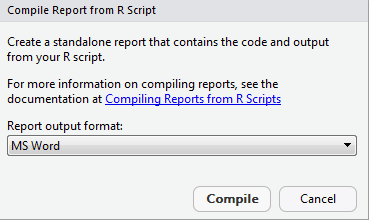
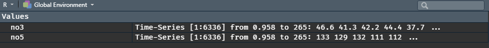

# Dataøvinger

Her finner du dataøvingene som skal gjennomføres i MET4. Se tidsplanen til kurset for en oversikt over når de ulike øvingene skal gjøres og hvilke uker studentassistentene gjennomfører øvingene på datasal.

## Dataøving 1

### Innledning

Velkommen til den første dataøvelsen i MET4. I denne øvelsen skal vi bli litt kjent med verktøyene R og Rstudio som brukes i datalabbene. Disse verktøyene er også essensielle for gjennomføringen av den obligatoriske innleveringen og på hjemmeksamen. Den første delen av øvingen inneholder praktisk informasjon om bruk av R og Rstudio etterfulgt av oppgaver.

### Om R og Rstudio

R er et program/programmeringsspråk som er spesialdesignet til å utføre statistiske analyser. R er basert på at du må skrive forskjellige kommandoer for å utføre utregninger og analyser. Gjennomsnittet av 3, 2 og 5 finner man for eksempel ved å skrive:  

```{r, eval = F}
mean(c(3,2,5))
```
Dette kan for mange være litt uvant i starten, men datalabbene vil gi deg god trening på denne type tankegang.

Rstudio er et program som gjør det enklere å bruke R. På samme måte som Word kan hjelpe deg til å lage fine og oversiktlige tekster, kan Rstudio hjelpe deg til å utføre fine og oversiktlige statistiske analyser. Rstudio er et redigeringsprogram som vi i dette kurset skal bruke til å redigere og utføre R-kommandoer.

#### Installere R og Rstudio

Bruker du din egen datamaskin kan du enkelt laste ned og installere R og Rstudio. Begge programvarene er gratis og kan installeres med å følge instruksene under. Får du problemer kan du få en av studentassistentene til å hjelpe deg.

1. Start med å installere R:
    - Gå til [r-project.org](https://cran.uib.no/)
    - Last ned versjonen som passer ditt operativsystem (Windows/Mac/Linux) 
    - Kjør installasjonsfilen og følg instruksene. Standard innstillingene skal være greie å bruke, så du kan trykke neste/ok til installasjonen er ferdig. 
2. Installer så RStudio:
    - [rstudio.com](https://rstudio.com/), og naviger deg frem til siden for **RStudio**. Du skal der laste ned desktop-versjonen av programmet ("Open source edition") for ditt operativsystem og  installere på vanlig måte.
    - Kjør installasjonsfilen som lastes ned og følg instruksene 

#### Vinduene i Rstudio og det å jobbe med R
Første gang du åpner Rstudio vil du se tre vinduer. Et fjerde vindu åpner du med å klikke på **File** i menyen, så **New File**, og så **R Script**. Figur \@ref(fig:rstudio1) viser en oversikt over de fire vinduene. Det er viktig at du forstår forskjellen på de to vinduene til venstre. 

```{r rstudio1, echo = F, fig.cap='Oversikt over vinduene i RStudio.'}
knitr::include_graphics('bilder/Rstudio1.PNG')
```


Nederste vindu til venstre (b) viser R-konsollen og det er her alle utregninger blir gjennomført. I dette vinduet kan du for eksempel skrive
```{r}
(3*5 - 3/4)*(2 + 2)
```

Her er `(3*5 - 3/4)*(2 + 2)` en såkalt kommando og det er programmet R som finner ut hva du mener med kommandoen og gir deg svaret `57` i retur. Du kan se at R tillater standard matteoperasjoner som gange, deling, pluss og minus (`*, /, +, -`). 

R er det vi kaller 'objektbasert', som betyr at du kan definere 'objekter' (ofte kalt variabler). Utregningen over kan for eksempel også regnes ut ved å skrive: 

```{r}
a <- 3*5 - 3/4
b <- 2 + 2
a*b
```

```{r, echo = F}
rm(list=ls())
```

Her er `a` og `b` objekter/variabler som vi definerer ved bruk av 'tildelingspilen'  `<-` (du kan også bruke `=`). Det går an å lagre objekter i egne filer, men vi skal se at det stort sett er smartere å lagre 'oppskriften' (selve koden) på hvordan de lages i en egen `.R`-fil. 

Det øverste vinduet til venstre (a) viser en `.R`-fil (et skript). En `.R`-fil fungerer som et manuskript med R-kommandoer (kode) og kan lagres slik at du kan senere kan se hvilke kommandoer du har brukt i analysen og eventuelt fortsette der du slapp. I Del 2 av denne dataøvingen skal du selv lage en `.R`-fil som inneholder alle kommandoer som brukes i en enkel analyse.  Når du vil at R skal utføre noen av kommandoene du har skrevet i `.R`-filen markerer du bare disse (eller lar pekeren stå i linjen du vil kjøre) og trykker **Ctrl + Enter** (**Cmd + Enter** på Mac):

```{r rstudiorun, echo = F, fig.cap='Utførelse av kommandoer du har skrevet i R filen. Marker eller la pekeren stå i linjen du vil kjøre og trykk **ctrl + Enter** (**Cmd + Enter på Mac**)'}
knitr::include_graphics('bilder/Rstudiorun.PNG')
```

Vinduet nederst til høyre (d) vil vise blant annet figurer du lager og hjelpetekst. Vinduet øverst til høyre (c) gir deg en oversikt over hvilke objekter du har laget og er spesielt nyttig hvis du vil ta en nærmere titt på et datasett du har lest inn. 

Det er viktig at du forstår forskjellen på de to vinduene til venstre, altså `.R`-filen og konsollen. R-kode du ønsker å ta vare på og som er en essensiell del av analysen skriver og lagrer du i `.R`-filen, mens små eksperimenter og undersøkelser som du ikke trenger senere kan du gjerne gjøre direkte i konsollen. 

For de av dere som er glad i hurtigtaster finnes det en oversikt i Rstudio som kommer opp dersom du trykker **Alt + Shift + K** (**Option + Shift + K** på Mac). Ofte vil man f.eks måtte skifte musepeker fra `.R`-filen til konsoll og motsatt, og hurtigtaster for å veksle mellom disse er **Ctrl + 1** (R-fil) og **Ctrl + 2** (konsoll). Hurtigtasten du kommer til å bruke desidert mest er **Ctrl + Enter** for å kjøre kode fra R-skriptet ditt i konsollen (På Mac erstatter du **Ctrl** med **Cmd** over alt).

#### Funksjoner, dokumentasjon og R-pakker

<!-- I R kan man lage egne funksjoner som utfører det en måtte ønske, f.eks en funksjon som regner ut t-observatoren gitt en vektor med observasjoner `x` og en gitt $\mu_0$: -->

<!-- ```{r, eval = F} -->
<!-- t.observator <- function(x, mu0){ -->
<!--   t <- (mean(x) - mu0)/(sd(x)/sqrt(length(x))) -->
<!--   return(t) -->
<!-- } -->
<!-- ``` -->

R kommer med en rekke "innebygde" funksjoner som kan utføre ulike statistiske analyser. For eksempel kan en t-test utføres med å bruke en funksjon som heter nettopp `t.test()`. Alle slike funksjoner kommer med en dokumentasjon som viser hva funksjonen gjør og hvordan den skal brukes. For å tilgang til denne dokumentasjonen skriver man `?` foran funksjonen i konsollen. Skriver du f.eks `?t.test` ser du at det dukker opp en side i vinduet nede til høyre:

```{r dokumentasjon, echo = F, fig.cap='Dokumentasjon av funksjoner dukker opp i et vindu nede til høyre. Dette vinduet kan åpnes til et større vindu som vist over'}
knitr::include_graphics('bilder/Dokumentasjon.JPG')
```

Dokumentasjonen vil som hovedregel inneholder en kort beskrivelse av hva funksjonen gjør, hvilke argumenter funksjonen tar og hva den gir ut. Helt i slutten av dokumentasjonen er det ofte et eksempel på hvordan funksjonen kan brukes og er ofte svært nyttig å se på. 

Selv om det finnes mange funksjoner som allerede er innebygget i R, må man noen ganger installere ekstra 'pakker' for å få tilgang til spesielle funksjoner. I oppgave 2.2 i denne øvelsen vil vi gå gjennom hvordan dette gjøres for en bestemt pakke. 

#### Skriv pen R-kode!

Det er viktig at R-koden du skriver er veldokumentert og skrevet på en oversiktlig og pen måte. Hvis vi ønsker å skrive kommentarer til koder som står i `.R`-filen bruker vi tegnet `#` foran kommentaren. Dette gjør at R ikke prøver å evaluere kommentaren som en R-kode. Det finnes en rekke konvensjoner når det kommer til mellomrom, linjeskift, navngivning av objekter og lignende. Vi anbefaler tipsene som er oppsummert på (http://adv-r.had.co.nz/Style.html)[http://adv-r.had.co.nz/Style.html], men det er selvsagt lov å ha sine egne preferanser. 

Under ser du et eksempel på dårlig praksis ved R-koding. Her er det manglende dokumentasjon, dårlig navngivning og ingen 'luft' i form av mellomrom og linjeskift. Dette gjør at du eller andre vil måtte bruke unødvendig mye tid på å finne ut hva koden faktisk gjør på et senere tidspunkt.

```{r, eval = F}
# Dårlig praksis:

library(readxl)
d<-readxl(file="financedata.xlsx",sheetIndex = 1) %>%
  na.omit()
Ø95<-mean(d$value)-qt(0.975,df=length(d$value)-1)*sd(d$value)  
N95<-mean(d$value)+qt(0.975,df=length(d$value)-1)*sd(d$value)
```

Følgende R kode gir det samme resultatet men er mye mer oversiktlig siden den er mer luftig, er brutt ned i biter, er godt dokumentert og har fornuftige objektnavn:

```{r, eval = F}
# God praksis:

# ---------- Analyse av data

# Nødvendige pakker i analysen
library(readxl)

# Les data, fjern NA-verdier og hent ut gjeld
my_data <- readxl(file = "financedata.xlsx", sheetIndex = 1) %>%
  na.omit()
debt <- my_data$debt

# Konfidensintervall
n_obs <- length(debt)     # antall observasjoner
alpha <- 0.05             # signifikansnivå  
average <- mean(debt)     # gjennomsnitt
st_dev <- sd(debt)        # standardavvik
lower <- average - qt(1 - alpha/2, df = n_obs - 1)*st_dev/sqrt(n)  # nedre grense
upper <- average + qt(1 - alpha/2, df = n_obs - 1)*st_dev/sqrt(n)  # øvre grense
```

Vi oppfordrer deg til å prøve å skrive R-kode som er pen og oversiktlig i datalabbene fremover. Dårlige vaner kan være vonde å vende!

### Oppgave 1: Interaktiv øvelse 

Her skal du bruke et læringsverktøy kalt `swirl` som vil ta deg gjennom en interaktive øvelse hvor du må utføre forskjellige oppgaver i konsollen. I flere av dataøvingene vil det være en slik interaktiv del. Her er tanken at du skal leke deg litt med R.

Før du kan begynne må du installere `swirl`. Kopier derfor følgende tre linjer og lim dem inn i R-konsollen: 
```{r, eval = F}
install.packages("swirl")
library(swirl)
install_course("R Programming")
```

For å starte swirl skriver du så følgende i konsollen:

```{r, eval = F}
swirl()
```

Du vil i starten bli bedt om å skrive inn ditt navn og så følger litt info om hvordan swirl fungerer. Du blir så bedt om å velge kurs. Her skal du velge alternativet 'R Programming' (**1** og så **enter**). Du får så se alle modulene dette kurset inneholder:


```{r, echo = F}
knitr::include_graphics('bilder/swirl1.PNG')
```

I denne øvingen skal du prøve deg på modul 1 **'Basic Building Blocks'**, modul 4  **'Vectors'** (kun første halvdel), og modul 12 **'Looking at Data'**.  I modul 1 vil du lære litt om de mest grunnleggende operasjonene som kan gjøres i R. Modul 4 ser nærmere på vektorer og her er første halvdel av modulen mest relevant. Modul 12 tar for seg det å utforske strukturen på et datasett. Start med modul 1 (**1** og så **Enter**). Du vil bli bedt om å gjøre enkle operasjoner i R og av og til må du svare på multiple choice spørsmål:

```{r, echo = F}
knitr::include_graphics('bilder/swirl2.PNG')
```

Merk at det helt til høyre vil står hvor langt du har kommet i prosent. Står du helt fast med et punkt kan du skrive `skip()` for å hoppe over dette punktet. Når du har fullført en modul blir du spurt om du vil motta 'credit' for å ha fullført modulen. Her kan du svare nei. Ønsker du å avbryte underveis skriver du `bye()`. Skriver du inn det samme navnet når du eventuelt starter swirl igjen kan du fortsette der du slapp. Husk å avslutt swirl (**Esc**) før du begynner på del to av øvingen. Lykke til!

### Oppgave 2: Innlesning av data og deskriptiv statistikk i R

I denne oppgaven skal vi lese inn noen data og produsere enkel deskriptiv statistikk av disse dataene. Dataene kommer fra [et amerikansk forsøk](https://journals.sagepub.com/doi/10.1177/0956797619829688) hvor man ville undersøke påstanden om at voldelige dataspill fører til voldelig adferd ved la to grupper spille hvert sitt dataspill. I det "voldelige" dataspillet var oppdraget å *skyte* og *drepe* et romvesen,  mens i den ikke-voldelige varianten skulle man *finne* og *redde* romvesenet fra fare. Utover det var spillene helt likt utformet, og i etterkant av en spilleøkt ble deltakernes aggresjonsnivå målt på en skala fra 1 til 9 ved hjelp av en standard psykologisk test. Dette datasettet ble brukt i eksamensoppgaven vårsemesteret 2019.

**Oppgave 2.1.** [Last ned filen violence.xslx](datasett/violence.xlsx). Denne filen lagrer du fortrinnsvis i en egen mappe der du ønsker at filer fra denne øvingen skal ligge. Åpne så **RStudio**, velg  `File -> New File -> R Script` for å åpne et nytt Rscript.  Lagre så scriptet ditt i samme mappen som du har lagt datasettet, slik at du nå har en mappe som ser ut som figuren under:

```{r, echo = F}
knitr::include_graphics('bilder/mappe.JPG')
```

Når vi skal lese inn data, lagre figurer og andre ting har R en standard 'mappesti' (working directory) den leter/lagrer i. Du kan se hva denne stien peker på ved å skrive `getwd()` i konsollen. Du skal nå spesifisere denne mappestien til mappen du har opprettet. Dette gjør du raskest ved å velge `Session -> Set Working Directory -> To Source File Location`. Neste gang du skal jobbe med dette prosjektet kan du åpne **RStudio** ved å dobbeltklikke på `dataøving1.R`, og mappestien skal da settes automatisk til riktig mappe.

Lag gjerne en liten overskrift ved hjelp av kommentartegnet `#` slik at .R filen din ser omtrent slik ut:

```{r, echo = F}
knitr::include_graphics('bilder/rstudio3.JPG')
```

**Oppgave 2.2.** Du skal nå lese inn excel filen du lagret i over i R. Selv om det finnes mange funksjoner som allerede er innebygget i R, må man noen ganger installere ekstra 'pakker' for å få tilgang til spesielle funksjoner. For å lese inn en excel fil trenger du nettopp en slik ikke standard funksjon. Denne finnes i pakken `readxl`. Selve installeringen kan du gjøre direkte i konsollen med å skrive (hvis du ikke har gjort det allerede, for eksempel da du gikk gjennom [forelesningsvideoen om R-pakker](#pakker)):

```{r, eval = F}
install.packages("readxl")
```

Pakken legger seg da i en bibliotekmappe der R er installert. For å gi R beskjed om å laste inn funksjonene til pakken du nettopp installerte bruker du funksjonen `library()`. Du har nå tilgang til en funksjon kalt `read_excel()` som du kan bruke til å lese inn excel filen:

```{r, eval = F, warning=F}
# MET4 - Dataøving 1
# ------------------

# les inn data
library(readxl)
violence <- read_excel("violence.xlsx")
```

```{r, echo = F, message=F}
library(readxl)
violence <- read_excel("datasett/violence.xlsx")
```


Marker linjene du nettopp skrev i R-skriptet ditt og trykk **Ctrl + Enter** (**Cmd + Enter**), for å opprette objektet `violence` som inneholder datasettet.  Funksjonen `ls()` lister opp alle objekter som har blitt definert. Du kan prøve selv å skrive følgende i konsollen:

```{r}
ls()
```

Du ser at det har kommet et nytt objekt som heter `violence`. En tilsvarende oversikt finner du i vinduet øverst til   høyre i Rstudio (se Figur \@ref(fig:rstudio1)) hvor du også kan klikke på objektet for å se nærmere på det.

**Oppgave 2.3.** Ta en titt på strukturen til datasettet du nettopp leste inn. Husker du kanskje noe fra den interaktive øvelsen 'Looking at Data'? Når du gjør slike små utforskninger kan du gjerne jobbe direkte i konsollen, og det du gjør i dette punktet trenger nødvendigvis ikke være med i .R-filen din. Gå til konsollen og bruk funksjoner som `class`, `dim`, `names`, `head` og `str` for å utforske strukturen på dataene. Vi ser at det er 5 variabler:

- `id` er bare et tall som identifiserer forsøkspersonen.
- `aggression_level` er aggresjonsnivået som ble målt rett etter at forsøkspersonen hadde spilt en viss tid.
- `violent_treatment` er varianten av dataspillet som forsøkspersonen ble utsatt for; enten `Violent` eller `Less Violent`.
- `difficulty_treatment` er vanskelighetsgraden av spillet, som enten var `Easy` eller `Hard`. En mulig forklaring på aggressiv adferd er at vanskelige spill fører til høyere stressnivå, som igjen kan føre til aggressivitet.
- `experienced_violence` er svaret til forsøkspersonen på spørsmålet om vedkommende *oppfattet* spillet som `Violent` eller `Less Violent`.  Forsøkspersonene visste ikke selv hva forssøket gikk ut på, eller at det var flere varianter av det samme spillet.

**Oppgave 2.4**

Vi skal se nærmere på om aggresjonsnivået er forskjellig i de to gruppene. Da må vi trekke ut de aktuelle tallene fra datasettet. Vi ønsker å velge ut *to vektorer* for å gjøre denne sammenligningen: en vektor som inneholder aggresjonsnivået til gruppen som har spilt det voldelige dataspillet, og en vektor som inneholder aggresjonsnivået til gruppen som har spilt det ikke-voldelige dataspillet. 

La disse to vektorene få navn `voldelig` og `ikke_voldelig`, og lag dem ved å skrive følgende kodelinjer (se [video om pipe-operatoren og enkel datavask](#pipe) for en forklaring av disse funksjonene. Den siste linjen, `pull`, gjør en dataframe med én kolonne om til en vektor) :

```{r}
# Laster inn dplyr-pakken for 
library(dplyr)

# Vektorer med aggresjonsnivå til gruppen som har spilt voldelig/ikke-voldelig spill 
voldelig <- 
  violence %>% 
  filter(violent_treatment == "Violent") %>% 
  select(aggression_level) %>% 
  pull

ikke_voldelig <- 
  violence %>% 
  filter(violent_treatment == "Less Violent") %>% 
  select(aggression_level) %>% 
  pull
```

Sjekk nå at dette har fungert ved å skrive `voldelig` og `ikke_voldelig` inn i konsollen for å se at det faktisk er vektorer som inneholder tallene 1 -- 9. Bruk også noen minutter til å prøve å forstå hva kodelinjene over faktisk gjør. 

(**NB!** Pass på at du skriver `Violent` og `Less Violent` helt riktig med store og små bokstaver, ellers vil det ikke fungere!)

**Oppgave 2.5.** I eksamensoppgaven fra 2019 får vi oppgitt deskriptiv statistikk over aggresjonsnivået for de to gruppene i følgende tabell:

```{r, echo = FALSE}
knitr::include_graphics("bilder/descriptive.png")
```

Bruk funksjoner som `min()`, `max()`, `median()`, `mean()`, `length()` og `summary()` til å finne ut om tallene stemmer (Du vil se at datasettet ditt inneholder noen færre observasjoner enn det som er oppgitt i tabellen, som gjør at tallene er litt forskjellige).

**Oppgave 2.6.** Vi skal nå lage et histogram av hver av gruppene du lagret som vektorer i tidligere. Vi kan først kikke på Figur \@ref(fig:to-histogrammer) og koden som lagde disse figurene for å få en idé om hva vi må gjøre. Et svært viktig punkt er føgende:

**`ggplot`-funksjonen skal alltid ha hele datasettet (en data frame) som argument!!**

Det betyr at vi *ikke* skal bruke de to vektorene `voldelig` og `ikke_voldelig`, slik som i `hist()`-funksjonen, men bruke hele datasettet `violence`. Vi ser av oversikten over at variabelen som inneholder aggresjonsnivået er `aggression_level`, så det er den vi skal bruke som $x$-argument. Ved å ta utgangspunkt i koden som lagde Figur \@ref(fig:to-histogrammer), kan vi gjøre et første forsøk (der vi husker å laste inn `ggplot2`-pakken først):

```{r}
library(ggplot2)
ggplot(violence, aes(x = aggression_level)) +
        geom_histogram(bins = 9)
```

Nesten! Det eneste problemet er at vi har ett histogram for alle observasjonene, mens det vi egentlig ønsket var å lage et histogram for hver av gruppene. Dette er såre enkelt i `ggplot2`. Det eneste vi trenger å gjøre er å identifisere den variabelen i datasettet som angir gruppetilhørighet (sjekk variabeloversikten over, svaret er `violent_treatment`), og så plusse på en funksjon som heter `facet_wrap()` som vist under.

```{r}
ggplot(violence, aes(x = aggression_level)) +
  geom_histogram(bins = 9) +
  facet_wrap(~ violent_treatment)
```

Dersom vi i stedet ønsker et skalert histogram kan vi spesifisere `y`-argumentet på følgende vis:

```{r, eval = FALSE}
ggplot(violence, aes(x = aggression_level, y = ..density.. )) +
  geom_histogram(bins = 9) +
  facet_wrap(~ violent_treatment)
```

**Oppgave 2.7.** Når man skal sammenligne sentrum og spredning i to grupper er et boxplott et ypperlig alternativ og vi kan da bruke funksjonen `boxplot()` i "base R", eller funksjonen `geom_boxplot()` hvis vi heller ønsker å benytte `ggplot2`. Vi holder oss til det siste alternativet her, og ser at kodelinjene ligner på det vi laget over.

Dersom vi ønsker å lage et enkelt boxplot av en variabel for å sammenligne spredingen i to eller flere grupper kan vi skrive

```{r, eval = F}
ggplot(a, aes(x = b, y = c)) +
  geom_boxplot()
```

Her må du selv erstatte bokstavene a, b og c i henhold til følgende regel:

- `a` er navnet på datasettet.
- `b` er variabelen som inneholder gruppeinndelingen.
- `c` er variabelen som inneholder målingene.

De ferdige kodelinjene skal være med i .R-skriptet ditt. For å se boxplottet kan du som vanlig kjøre kommandoene med å trykke **Ctrl + Enter**. Ser det ut til å være noe forskjell på sentrum og spredning i de to gruppene?

**Bonusoppgave.** Bytt ut `geom_boxplot()` over med `geom_jitter()` og `geom_violin()`. Hva viser disse plottene?

## Dataøving 2

### Interaktiv øvelse 
Før vi tar fatt på dataanalysen begynner vi med litt R-trening i swirl.  Har du allerede installert pakken `swirl` (skriv `install.packages("swirl")` i konsoll hvis ikke) starter du opp swirl med å skrive følgende i konsollen:

```{r, eval = FALSE}
library(swirl)
swirl()
```

Du vil i starten bli bedt om å skrive inn ditt navn. Hvis du bruker samme navn som tidligere får du kanskje tilbud om å starte opp igjen der du slapp, men da kan du bare velge det nederste valget 'No. Let me start something new'. Du velger så alternativet 'R Programming' hvor du får se alle modulene dette kurset inneholder. I denne øvingen skal du prøve deg på modul 6 **'Subsetting Vectors'** og modul 8 **'Logic'**. 

Husk at det helt til høyre vil står hvor langt du har kommet i prosent. Står du helt fast med et punkt kan du skrive `skip()` for å hoppe over dette punktet. Når du har fullført en modul blir du spurt om du vil motta 'credit' for å ha fullført modulen. Her kan du svare nei. Ønsker du å avbryte underveis skriver du `bye()`. Skriver du inn det samme navnet når du eventuelt starter swirl igjen kan du fortsette der du slapp. Husk å avslutt swirl (\textbf{esc}) før du begynner på neste del av datalabben. Lykke til!


### Data til dataøvelsen

I denne dataøvelsen skal vi ved hjelp av R gjennomføre en del av testene som vi har lært i praksis. Vi skal gjøre både ett- og to-utvalgs tester, og vi skal bruke $\chi^2$-testen

Vi skal jobbe med tre ulike datasett i denne øvingen, og alle sammen kan lastes ned ved å klikke på lenkene under:

- [`testdata.xls`](datasett/testdata.xls)
- [`violence.xlsx`](datasett/violence.xlsx)
- [`roubik_2002_coffee_yield.xlsx`](datasett/roubik_2002_coffe_yield.xlsx)

Last ned disse filene og legg dem i en mappe på datamaskinen din. Åpne så **RStudio**, velg  `File -> New File -> R Script` for å åpne et nytt Rscript, og lag gjerne en liten overskrift ved hjelp av kommentartegnet `#`. Lagre så scriptet ditt i samme mappen som du har lagt datasettene, slik at du nå har en mappe som ser ut som figuren under:

```{r, echo = FALSE}
knitr::include_graphics("bilder/mappe2.png")
```

Det neste du må gjøre er å sørge for at du har satt opp riktig mappesti (working directory) i **RStudio**, og det gjør du raskest ved å velge `Session -> Set Working Directory -> To Source File Location`. Neste gang du skal jobbe med dette prosjektet kan du åpne **RStudio** ved å dobbeltklikke på `dataøving2.R`, og mappestien skal da settes automatisk til riktig mappe. I alle tilfeller skal vinduet ditt se omtrent slik ut:

```{r, echo = FALSE}
knitr::include_graphics("bilder/rstudio2.png")
```

### Oppgaver til øvingen:

#### Oppgave 1

Costa Rica er en stor kaffeprodusent med moderne produksjon. Kaffeprodusentene har over lengre tid benyttet en standardisert miks av sprøytemidler som skal ta knekken på ugress og skadelige insekter, men uten å skade avlingen eller miljøet ellers. 

En liten kaffeplantasje i Costa Rica har begynt å eksperimentere med en ny kombinasjon av sprøytemidler som skal være like effektiv mot ugress, men samtidig enda mer skånsom mot kaffeplantene, slik at avlingen blir større. Innehaveren av plantasjen ønsker å sette opp et eksperiment for å undersøke denne påstanden. Han velger ut 25 tilfeldige jordlapper fordelt på hele eiendommen der han bruker de nye sprøytemidlene gjennom en hel sesong.

Lang erfaring har vist at avlingen ved bruk av gammel metode er normalfordelt med forventning $\mu = 100$ og standardavvik $\sigma = 10$, der vi har brukt en standardisert enhet for mengde avling per arealenhet. Hjelp bonden, ved å løse følgende oppgaver:

**Oppgave 1.1:** Les inn datasettet `testdatasdata.xsl` i **RStudio** og se på de første par radene. Det kan du gjøre ved å kjøre følgende kodelinjer:

```{r, warning = F, eval = F}
library(readxl)                                 # Pakke for å lese excel-filer
data <- read_excel("testdata.xls")              # Leser inn datasettet
data                                            # Ser på datasettet
```

```{r, warning = F, echo = F}
library(readxl)                                 # Pakke for å lese excel-filer
data <- read_excel("datasett/testdata.xls")             # Leser inn datasettet
data                                            # Ser på datasettet
```

Det er kolonnen `X2` som inneholder de observerte avlingene på de 25 forsøksseksjonene. 

**Oppgave 1.2:** Er forventet avling ved bruk av den nye metoden *større* enn forventet avling ved bruk av den gamle metoden? *Hint: Forelesningsnotatene/scriptet inneholder koden du trenger for å løse denne og neste oppgave. Du kan også se på [oversikten over relevante R-kommandoer](#relevante-r-testing) for det du trenger.*

**Oppgave 1.3:** Det er viktig for kaffebonden at avlingen ikke varierer for mye mellom de ulike delene av farmen. En viktig måleparameter for denne type produksjon er derfor variansen. Kan vi slå fast at variansen til avlingen har forandret seg etter omlegging til ny metode? 

**Oppgave 1.4:** Kaffebonden er skeptisk til påstanden om at forventet avling med den gamle metoden er $\mu = 100$, og mener at det vil variere med for eksempel jordsmonn. For å ta høyde for dette gjennomførte han året i forveien tilsvarende målinger på de samme jordlappene, med med gammel sprøytemetode. Disse målingene finner du i kolonne `X1` i datasettet. Test om avlingene er forskjellige, både med og uten paring av observasjonene. Kommenter resultatet. 

#### Oppgave 2

Vi skal i denne oppgaven se på oppgave **1a** og **1b** som ble gitt på skoleeksamen i MET4 vårsemesteret 2019. Dette er det samme datasettet som vi så på i forrige dataøving. I [et amerikansk forsøk](https://journals.sagepub.com/doi/10.1177/0956797619829688) ville man undersøke påstanden om at voldelige dataspill fører til voldelig adferd ved la to grupper spille hvert sitt dataspill. I det "voldelige" dataspillet var oppdraget å *skyte* og *drepe* et romvesen,  mens i den ikke-voldelige varianten skulle man *finne* og *redde* romvesenet fra fare. Utover det var spillene helt likt utformet, og i etterkant av en spilleøkt ble deltakernes aggresjonsnivå målt på en skala fra 1 til 9 ved hjelp av en standard psykologisk test.

I denne oppgaven skal vi i hovedsak finne ut om gruppen som spilte de voldelige dataspillet hadde signifikant høyere aggresjonsnivå enn kontrollgruppen.

**Oppgave 2.1:** Les inn datasettet `violence.xslx` på samme måte som i forrige dataøving. Hvis du allerede har kjørt `library(readxl)` trenger du ikke gjøre det igjen med mindre du har startet **RStudio** på nytt. Gi datasettet et passende navn, f.eks

```{r, eval = F}
violence <- read_excel("violence.xlsx")
```

```{r, echo = F}
violence <- read_excel("datasett/violence.xlsx")
```

Vi skal altså teste om aggresjonsnivået er forskjellig i de to gruppene. Da må vi trekke ut de aktuelle tallene fra datasettet. Som vi husker fra forelesningsnotatene trenger vi *to vektorer* for å gjøre en to-utvags $t$-test: en vektor som inneholder aggresjonsnivået til gruppen som har spilt det voldelige dataspillet, og en vektor som inneholder aggresjonsnivået til gruppen som har spilt det ikke-voldelige dataspillet. 

La disse to vektorene få navn `voldelig` og `ikke_voldelig`, og lag dem ved å skrive følgende kodelinjer (samme som forrige dataøving):

```{r}
voldelig <-
  violence %>%
  filter(violent_treatment == "Violent") %>%
  select(aggression_level) %>%
  pull

ikke_voldelig <-
  violence %>%
  filter(violent_treatment == "Less Violent") %>%
  select(aggression_level) %>%
  pull
```

**Oppgave 2.2:** Vi er nå klare til å gjøre en to-utvalgs $t$-test for om aggresjonsnivået er det samme i de to gruppene. Prøv å gjøre det nå, men vær bevisst på hvilke valg du gjør underveis, og som du mater inn i `t.test()`-funksjonen, f.eks:

- Antar du lik varians i de to gruppene? Hvorfor/Hvorfor ikke?
- Bruker du ensidig eller tosidig test? Hvorfor?

**Oppgave 2.3:** En avgjørende detalj i studien som vi ser på i denne oppgaven er at forskerne også spurte forsøkspersonene hvorvidt de selv syntes spillet de spilte var voldelig. For å kunne trekke noen som helst lærdom fra et slikt forsøk er det viktig at den voldelige spillvarianten faktisk blir oppfattet som voldelig og vice versa. Vi ønsker dermed å undersøke nullhypotesen om at variablene `violence_tratment` og `experienced_violence` er uavhengige av hverandre. Den hypotesen er vi nødt til å forkaste for at forsøket skal være gyldig: hvis det ikke er noen sammenheng mellom opplevd og faktisk voldelighet er forsøket helt klart ugyldig.

Første steg er å lage et nytt datasett der vi bare ta med oss de to kolonnene vi er interessert i. Kall det hva du vil, f.eks. `violence_redusert`. Vi bruker `select()`-funksjonen til å velge ut variablene vi trenger, se [video om datavask](#pipe) dersom du trenger å repetere denne funksjonen.

```{r}
violence_redusert <- 
  violence %>% 
  select(violent_treatment, experienced_violence)
```

Skriv `violence_redusert` i konsollen for å bekrefte at du har valgt ut de korrekte kolonnene.

Vi fortsetter som i videoforelesningen og lager en krysstabell for disse variablene

```{r}
krysstabell <- table(violence_redusert) 
krysstabell
```

**Oppgave 2.4:** Heldigvis ser det ut til at det er en klar sammenheng mellom faktisk og opplevd voldelighet ved at de fleste forsøkspersonene havner på diagonalen i krysstabellen. Bruk funksjonen `chisq.test()` på samme måte som i forelesningen til å formelt teste nullhypotesen om uavhengighet.

#### Oppgave 3

Vi skal i denne oppgaven returnere til kaffeproduksjon. Vi skal gjøre statistiske tester i R som i de tidligere oppgavene i denne øvingen, men vanskelighetsgraden går opp fordi vi også må tenke nøye over hvordan vi anvender metodene korrekt i en gitt kontekst.

I 2002 publiserte det prestisjetunge tidsskriftet *Nature* en kort artikkel skrevet av David W. Roubik^[David W. Roubik: *The value of bees to the coffee harvest*. Nature (2002)], som handler om den kjente kaffebønnen *Arabica*. Arabicabønnen kommer opprinnelig fra Afrika, og er en selvpollinerende plante. Det vil si at den ikke er avhengig av insekter for å formere seg, og man trodde lenge at den heller ikke hadde noen fordeler av insektspollinering. 

For å undersøke denne påstanden samlet Roubik inn historiske data over arabicaavlinger fra hele verden. Han delte verdens kaffeproduserende land inn i to kategorier: *Old world* som omfatter afrikanske  og asiatiske land, og *New world* som omfatter land i Latin-Amerika. Han registrerte videre *gjennomsnittlig årlig avling* (målt i kg/hektar) i to perioder: 1961--80 og 1981--2001.

Nøkkelen til analysen er at den afrikanske honningbien var en viktig pollinator i Afrika og Asia både i den første og andre perioden, men knapt eksisterte i Amerika før 1980. Etter 1980, derimot, økte utbredelsen av denne bien i Amerika, og ble fort naturalisert. Kan vi sette denne utviklingen i sammenheng med økt kaffeavling i Latin-Amerika etter 1980, og dermed skrote teorien om at kaffeplanter ikke drar nytte av insektspollinering?

**Oppgave 3.1:** For å undersøke dette kan vi bruke datasettet som Roubik brukte, som finnes i filen `roubik_2002_coffe_yield.xlsx`. Last datasettet inn i R på vanlig måte, og se på det:

```{r, eval = F}
yield <- read_excel("roubik_2002_coffe_yield.xlsx")
yield
```

```{r, echo = F}
yield <- read_excel("datasett/roubik_2002_coffe_yield.xlsx")
yield
```

Vi ser at det er fire kolonner i datasettet:

- `world` angir om det er snakk om *New world* (`new`) eller *Old world* (`old`).
- `country` angir navnet på landet.
- `yield_61_to_80` angir avlingen i perioden 1961--80.
- `yield_81_to_01` angir avlingen i perioden 1981--2001.

**Oppgave 3.2:** Kall den første tidsperioden `p1` og den andre tidsperioden `p2`. Lag så *fire* vektorer, en for hver kombinasjon av `world` og tidsperiode ved å bruke samme teknikk som i oppgave **2.2** over. Når du er ferdig, skal du ha laget følgende vektorer:

- `new_p1`: inneholder avling for alle land med `world == new` i første periode.
- `new_p2`: inneholder avling for alle land med `world == new` i andre periode.
- `old_p1`: inneholder avling for alle land med `world == old` i første periode.
- `old_p2`: inneholder avling for alle land med `world == old` i andre periode.

Her må du bruke både `filter()` og `select()`, og du må avslutte med en `pull` for å oversette en en-kolonnes dataframe til en vektor.

```{r, echo = FALSE}
new_p1 <- yield %>% filter(world == "new") %>% select(yield_61_to_80) %>% pull 
new_p2 <- yield %>% filter(world == "new") %>% select(yield_81_to_01) %>% pull
old_p1 <- yield %>% filter(world == "old") %>% select(yield_61_to_80) %>% pull
old_p2 <- yield %>% filter(world == "old") %>% select(yield_81_to_01) %>% pull
```

Dersom du har gjort det riktig, ser vektorene slik ut når du er ferdig:

```{r}
new_p1
new_p2
old_p1
old_p2
```

**Oppgave 3.3:** Bruk en paret $t$-test til å finne ut om kaffeavlingen i den gamle verden er signifikant forskjellig i de to tidsperiodene.

**Oppgave 3.4:** Bruk en paret $t$-test til å finne ut om kaffeavlingen i den nye verden er signifikant forskjellig i de to tidsperiodene.

**Oppgave 3.5 (Diskusjonsopgave):** Dersom du har gjort de to foregående oppgavene riktig vil du se at den gjennomsnittlige kaffeavlingen ikke har endret seg signifikant i den gamle verden, mens økningen i den nye verden er klart statistisk signifikant. Vi har brukt parrede $t$-tester, slik at vi "kontrollerer for" eventuelle landeffekter (denne terminologien blir skal vi bruke mer når vi skal jobbe med regresjon).

Roubik omtaler funnet som følger:

> *A substantial increase in Latin American coffee yield partly coincided with the establishment of African honeybees in those countries, although there was no such change in the Old World, where honeybees originated [...]. This comparison underlines a possible cause-and-effect relationship between the presence of social bees and cofee yield.* 

Dette er intet mindre enn en **kortslutning**, på minst to forskjellige måter. Hvorfor? Diskuter med dine medstudenter. Kan det gjennomføres en enkel test som gir et bedre bilde av situasjonen?

<!-- ### BONUS: En alternativ teknikk for datamanipulering (Gjør bare om du har overskudd til det!) -->

<!-- Se på denne kodelinjen: -->

<!-- ```{r, eval = FALSE} -->
<!-- voldelig <- violence$aggression_level[violence$violent_treatment == "Violent"] -->
<!-- ``` -->

<!-- Vi skrev denne linjen for å hente ut noen bestemte verdier fra et bestemt datasett. Det er kanskje ikke så lett å se hva kodelinjen gjør ved å bare kaste et raskt blikk på den, og det er spesielt to grunner til det: -->

<!-- - den er lang, og -->
<!-- - du må lese den delvis "innenfra og ut" (alstå, begynne innerst i parantesene) og delvis fra høyre mot venstre. -->

<!-- Spesielt det siste punktet er kontraintuitivt, siden det er motsatt av slik vi vanligvis leser. Mye arbeid i R går ut på å manipulere datasett på ulike vis (hente ut kolonner og rader, lage nye kolonner), og derfor er det utviklet noen alternative verktøy for å gjøre slike jobber mye mer effektivt. Vi vil i dette avsnittet gi en kort og meget grunleggende innføring i slike teknikker. Merk at dette ikke er *pensum* i klassisk forstand. Det viktigste er at jobben blir gjort korrekt. Hvordan du gjør det er i så måte underordnet. -->

<!-- For å gjennomføre øvelsen under må du installere og laste inn en ny pakke: `dplyr`: -->

<!-- ```{r, eval = FALSE} -->
<!-- install.packages("dplyr") -->
<!-- library(dplyr) -->
<!-- ``` -->

<!-- ```{r, message = FALSE, echo = FALSE, warning = FALSE} -->
<!-- library(dplyr) -->
<!-- ``` -->

<!-- #### KONSEPT 1: Pipe-operatoren `%>%` {-} -->

<!-- Tenk deg at vi skal regne ut logaritmen til kvadratroten av 2. Vi må da anvende to funksjoner i riktig rekkefølge. Vi kan alltids bruke en mellomregning: -->

<!-- ```{r} -->
<!-- kvadratroten_til_2 <- sqrt(2) -->
<!-- log(kvadratroten_til_2) -->
<!-- ``` -->

<!-- Eventuelt kjører vi alt sammen i en linje: -->

<!-- ```{r} -->
<!-- log(sqrt(2)) -->
<!-- ``` -->

<!-- Nå er ikke den siste linjen spesielt lang, men den er som sagt ikke helt intuitiv. Grunnen er at hvis vi skal lese høyt hva den gjør, så må vi begynne innerst i parantesene: "Vi starter med tallet 2, så tar vi kvadratroten, så tar vi logaritmen..." -->

<!-- I `dplyr`-pakken finnes en såkalt pipe-operator som gjør at vi kan skrive dette som kode i den rekkefølgen ting skal skje. Eksempelet over skrives slik: -->

<!-- ```{r} -->
<!-- 2 %>% sqrt %>% log -->
<!-- ``` -->

<!-- Det som skjer er at R leser linjen fra venstre, og ved hver "pipe/`%>%`" sendes det som står på venstre side inn som argument i funksjonen på høyre side. Når du leser kode, kan denne operatoren uttales som **så** (**then** på engelsk): **Først** har vi tallet 2, **så** tar vi kvadratroten, **så** tar vi logaritmen. -->

<!-- Tenk når vi har en sekvens av 10 eller 20 eller 50 steg (ikke uvanlig i den virkelige verden), hvor mye enklere det blir å kode på denne måten fremfor å ha 10, 20 eller 50 nivå med paranteser! -->

<!-- **Tips:** Hurtigtasten for `%>%` i RStudio er `Ctrl - Shift - M` (Bytt ut **Ctrl** med **Cmd** på Mac). -->

<!-- #### KONSEPT 2: Datamanipuleringsfunksjoner i `dplyr` {-} -->

<!-- I `dplyr` finnes det noen meget praktiske funksjoner som vi kan bruke til å manipulere datasatt i R. La oss ta utgangspunkt i datasettet `violence` og prøve å skrive om den aktuell kodelinjen over ved hjelp av pipe-operatoren. I klartekst skal vi gjøre følgende operasjoner: -->

<!-- 1. Starte med datasettet `violence` -->
<!-- 2. Plukke ut alle radene som har verdi `"Violent"` i kolonnen `violent_treatment`. -->
<!-- 3. Plukke ut kolonnen `aggression_level` -->

<!-- For å velge ut bestemte rader kan vi bruke funksjonen `filter()`. Ved hjelp av pipe-operatoren kan vi skrive steg 1 og 2 som -->

<!-- ```{r} -->
<!-- violence %>% filter(violent_treatment == "Violent") -->
<!-- ``` -->

<!-- Nå ser vi at vi bare har 126 rader igjen, og det er nettopp de radene som i kolonnen `violent_treatment` har verdi `"Violent"`. Det neste steget er å velge ut kolonnen `aggression_level`. Det gjør vi ved å bruke funksjonen `select()`, og hele sekvensen ser da slik ut (linjeskift gjør det enda mer lesbart): -->

<!-- ```{r} -->
<!-- violence %>%  -->
<!--   filter(violent_treatment == "Violent") %>%  -->
<!--   select(aggression_level) -->
<!-- ``` -->

<!-- Man kan velge flere kolonner ved å sette komma mellom kolonnenavn, og man kan i stedet velge *bort* kolonner ved å sette minustegn foran kolonnenavnet, f.eks: -->

<!-- ```{r, eval = FALSE} -->
<!-- violence %>% select(id, aggression_level) -->
<!-- violence %>% select(-id) -->
<!-- ``` -->

<!-- Nå har det seg slik at vi gjerne ønsker å hente ut den aktuelle kolonnen som en *vektor*. Det gjør vi enkelt ved å slenge på en `pull` på slutten av en pipe-sekvens. Til slutt må vi passe på å lagre vektoren med riktig navn, slik at vi får: -->

<!-- ```{r} -->
<!-- voldelig <- violence %>%  -->
<!--   filter(violent_treatment == "Violent") %>%  -->
<!--   select(aggression_level) %>%  -->
<!--   pull -->
<!-- ``` -->

<!-- Denne koden er ekvivalent med den som startet dette avsnittet i øvingen. Den er derimot mye enklere å lese, og *veldig* mye enklere å utvide til å inkludere flere operasjoner. -->

<!-- La oss se på enda en funksjon som vil være svært nyttig for oss senere. Vi kan bruke `mutate()` til å *lage nye kolonner*. La oss for eksempel si at vi vil lagre kvadratet av `aggression_level` eller summen av `aggression_level` og `id` som egne kolonner (som selvsagt er helt meningsløst i dette tilfellet, kun et eksempel). Det kan vi gjøre slik: -->

<!-- ```{r, eval = FALSE} -->
<!-- violence %>%  -->
<!--   mutate(ny1 = aggression_level^2)  -->
<!-- ``` -->

<!-- eller -->

<!-- ```{r, eval = FALSE} -->
<!-- violence %>%  -->
<!--   mutate(ny2 = id + aggression_level) -->
<!-- ``` -->

<!-- Her er `ny1` og `ny2` navn på de nye kolonnene, som vi kan velge selv. -->

<!-- **Oppgave:** Gjenta **Oppgave 3.2**, men ved å bruke teknikkene i dette avsnittet. -->

<!-- #### Interaktiv øving i `dplyr` {-} -->

<!-- Hvis du ønsker å trene mer på dette så finnes det en interaktiv modul i `swirl` som omhandler datamanipulasjon ved hjelp av `dplyr`. Hvis du ikke har gjort det alledede, skriv `install.packages("swirl")` i konsoll. Start du opp `swirl` med å skrive følgende: -->

<!-- ```{r, eval = F} -->
<!-- library(swirl) -->
<!-- install_course("Getting_and_Cleaning_Data ") # legger til nytt kursmateriale -->
<!-- swirl() -->
<!-- ``` -->

<!-- Du vil i starten bli bedt om å skrive inn ditt navn og så følger litt info om hvordan swirl fungerer. Du blir så bedt om å velge kurs. Her skal du først velge alternativet 'Getting and Cleaning Data'. Du får så se alle modulene dette kurset inneholder. I denne øvingen skal du prøve deg på modul 1 **'Manipulating Data with dplyr'**.  -->

## Dataøving 3

### Oppgave 1: Interaktiv øvelse

Før vi tar fatt på dataanalysen begynner vi som vanlig med litt R-trening i swirl.  Har du allerede installert pakken swirl (skriv `install.packages("swirl")` i konsoll hvis ikke) starter du opp swirl med å skrive følgende i konsollen:

```{r, eval = FALSE}
library(swirl)
install_course("Regression_Models") # legger til nytt kursmateriale om regresjon
swirl()
```

Du vil i starten bli bedt om å skrive inn ditt navn. Hvis du bruker samme navn som tidligere får du kanskje tilbud om å starte opp igjen der du slapp, men da kan du bare velge det nederste valget 'No. Let me start something new'. Du velger så alternativet 'Regression Models' hvor du får se alle modulene dette kurset inneholder. I denne øvingen skal du prøve deg på modul modul 1 **'Introduction'**. Her vil du lære litt om hvordan du kan bruke R til å gjøre en regresjonsanalyse ved hjelp av et treningsdatasett. Noen av kommandoene som gjennomgås i denne modulen vil komme til nytte senere i datalabben. 

Husk at det helt til høyre vil står hvor langt du har kommet i prosent. Står du helt fast med et punkt kan du skrive `skip()` for å hoppe over dette punktet. Når du har fullført en modul blir du spurt om du vil motta 'credit' for å ha fullført modulen. Her kan du svare nei. Ønsker du å avbryte underveis skriver du `bye()`. Skriver du inn det samme navnet når du eventuelt starter swirl igjen kan du fortsette der du slapp. Husk å avslutt swirl (`esc`) før du begynner på del to av øvingen. Lykke til!

### Oppgave 2: Regresjonsanalyse 

Et rock-and-roll museum åpnet i Atlanta i 1990. Museet lå i en sentral del av byen i nærheten av mange ulike butikker. Mot slutten av juli måned i 1992 startet en stor brann i en av disse butikkene som ødela hele kvartalet, inkludert museet. Heldigvis var museet forsikret, både mot selve brannskadene, og mot tapte billettinntekter i gjennoppbyggingsperioden. 

Vanligvis vil et forsikringsselskap beregne erstatningsbeløpet under antakelsen om at besøkstallene i gjenoppbyggingsperioden ville vært på samme nivå som besøkstallene i tiden før brannen. I dette tilfellet mente derimot eierne av museet at besøkstallene var *økende*, slik at de reelt sett hadde krav på et større erstatningsbeløp. Argumentet var basert på besøkstallene til en fornøyelsespark like ved. Fornøyelsesparken åpnet i desember 1991, slik at museet og parken opererte sammen i de siste fire ukene av 1991, og de første 28 ukene i 1992 før brannen ødela museet. 

Museet åpnet igjen i april 1995, men var da betydelig større enn det var opprinnelig. Data for besøkstall for museet og fornøyelsesparken finner vi i regnearket [`C16-01.xlsx`](datasett/C16-01.xlsx). Som i de to foregående dataøvingene legger du denne filen i en mappe på maskinen din, og oppretter et tomt R-script der du lagrer koden for denne oppgaven. 

**Oppgave 2.1:** Kikk raskt på datasettet i Excel eller tilsvarende. Du ser at det er tre kolonner, en som angir ukenummer (`Week`, teller fra 1 til 205), en som angir ukentlig besøkstall på museet (`Museum`) og en som angir ukentlig besøkstall i fornøyelsesparken (`A-Park`). Legg merke til at besøkstallet i museet er null fra og med uke 33, til og med uke 179, som er perioden fra brannen til nyåpning.

**Oppgave 2.2:** Last så datasettet inn i R som før ved hjelp av `read_excel()`-funksjonen. Gi det et passelig navn (f.eks `visits`), og sjekk raskt at det har gått bra ved å taste inn datanavnet i konsollen. Da skal det se omtrent slik ut:

```{r, echo = FALSE, fig.height = 2, warning = FALSE}
library(readxl)
visits <- read_excel("datasett/C16-01.xlsx")
```

```{r}
visits
```
Legg merke til følgende:

- Observasjonene ser ut til å være de samme som vi så da vi kikket på selve regnearket. Det er alltid en god vane å forsikre seg om at R har lest inn datasettet på riktig måte.
- Et av variabelnavnene har fått noen rare tødler rundt seg. Grunnen til det er at `A-park` inneholder en bindestrek, så for at R ikke skal tolke det tegnet som et minustegn (og dermed gi oss et mareritt med feilmeldinger), må vi alltid bruke disse tødlene når vi refererer til denne variabelen. (På tastaturet som forfatteren av disse ord skriver på, er det `Shift +`  tasten til venstre for `Backspace`. 

**Oppgave 2.3:** Før vi går videre, må vi få et bedre begrep om problemet ved å kikke grafisk på observasjonene. La oss plotte observasjonene i et linjeplott for å se hvordan de utvikler seg over tid, ved å ha ukenummer på $x$-aksen og besøkstall på $y$-aksen. Vi kan lage et enkelt plott for besøkstall for museet ved å skrive

```{r, fig.height = 3.5}
# Laster først ggplot-pakken (det trenger vi bare gjøre en gang i skriptet)
library(ggplot2)        

# Lager et enkelt linjeplott:
ggplot(visits, aes(x = Week, y = Museum)) +
  geom_line()
```

Du kan legge til besøkstall for fornøyelsesparken ved å plusse på en ny linje med `geom_line()`, men da må du spesifisere `y`-variabelen på nytt. Hele plottekommandoen blir da:

```{r, fig.keep='last', fig.height = 3.5}
ggplot(visits, aes(x = Week, y = Museum)) +
  geom_line() +
  geom_line(aes(y = `A-Park`))
```

Vi ser at det er en sterk sammenheng mellom besøkstallene til museet og parken, spesielt etter gjenåpningen i 1995, og det skal vi utnytte når vi senere skal beregne erstatningssummen.

**Oppgave 2.4:** Juster på argumentene i `geom_line()`-funskjonene, og legg til flere "lag" på samme måte som vi gjorde for å pynte på figuren i oppgave 3 i kapittel \@ref(r-ekstra) (det er 100% lov å Google). Dette ser bedre ut:

```{r, fig.keep='last', fig.height = 3.5, echo = FALSE}
ggplot(visits, aes(x = Week, y = Museum)) +
  geom_line(colour = "red") +
  geom_line(aes(y = `A-Park`)) +
  xlab("Ukenummer") +
  ylab("Besøkstall") +
  ggtitle("Besøkstall på museet (rødt) og i fornøyelsesparken (svart)") +
  theme_classic()
```

**Oppgave 2.5:** La oss nå ta utgangspunkt i forsikringsselskapets påstand: besøkstallet i perioden der museet er stengt skal beregnes ved hjelp av observasjonene *før brannen*. Vi estimerer parametrene i en enkel regresjonsmodell

$$y_i = \beta_0 + \beta_1x_i + \epsilon,$$
der responsvariabelen $y_i$ er besøkstallet på museet på dag nr. *i*, og $x_i$ er besøkstallet i fornøyelsesparken samme dag. Datasettet vi skal bruke er altså *de 32 første radene* i datasettet `visits`. Da kan vi enten lage en ny tabell som består av de 32 første radene (for eksempel ved hjelp av `filter(Week <= 32)`), eller så kan vi bruket argumentet `subset` i `lm()`-funkesjonen til å spesifisere hvilke observasjoner som skal brukes for å estimere modellen:

```{r}
reg1 <- lm(Museum ~ `A-Park`, data = visits, subset = 1:32)
```

**Oppgave 2.6:** Pakken `stargazer` inneholder funksjoner for å lage pene regesjonstabeller automatisk fra regresjonsobjekter i R. Pakken må installeres og lastes på vanlig måte:

```{r, eval = FALSE}
install.packages("stargazer")
library(stargazer)
```

Inne i `stargazer`-pakken er det en funksjon som også heter `stargazer()`. Hvis du ikke har sett den brukt før (f.eks i forelesning), kan du lese mer om den ved hjelp av hjelpefunksjonen: `?stargazer`. Bruk så `stargazer()` til å lage følgende regresjonsutskrift (hint: bruk argumentet `type = "text"`):

```{r, echo = FALSE, comment = ""}
stargazer::stargazer(reg1, type = "text")
```

**Oppgave 2.7:** Lag tre diagnoseplott etter mal som er gitt i forelesningsnotatene: Et som viser residualene i regresjonsmodellen i et spredningsdiagram, et QQ-plott, og et histogram. Kan du gjøre en grov vurdering om hvorvidt forutsetningene for lineær regresjon er oppfylt?

**Oppgave 2.8:** Bruk denne regresjonsmodellen til å beregne hva besøkstallet *hadde vært* dersom museet hadde vært åpent som vanlig. Dette kan vi gjøre ved å bruke `predict()`-funksjonen. Følg oppskriften under nå, så skal du prøve å gjøre det selv etterpå.

```{r}
# Vi lager et nytt datasett bestående av de ukene der museet var stengt:
visits_pred <- 
  visits %>% 
  filter(Museum == 0) %>% 
  select("Week", "A-Park")

# Bruker predict()-funksjonen til å predikere tilhørende y'er:
predicted_visits1 <- predict(reg1, newdata = visits_pred)

# Til slutt legger vi til de predikerte verdiene som en ny kolonne i visits_pred:
visits_pred$predikert1 <- predicted_visits1
```

De predikerte besøkstallene er nå lagret som kolonne `predicted1` i datasettet `visits_pred`.

**Oppgave 2.9** For å få bedre greie på hvordan prediksjonene egentlig ser ut kan vi legge dem til figuren vår fra over. La oss lage en blå stiplet linje, og det kan vi gjøre med å legge til enda et kall til `geom_lines()`. Denne gangen må vi bruke flere argumenter:

- Vi må bruke argumentet `data` til å si at tallene vi skal plotte for den nye linjen nå ligger i datasettet `visits_pred`, og ikke `visits`.
- Vi må bruke argumentet `colour` til å fortelle hvilken farge vi skal ha på linjen.
- Vi må bruke argumentet `linetype` til å fortelle at vi vil ha en stiplet linje.

Ta for deg figuren du lagde i oppgave 2.4, og legg til følgende linjer (husk å få med en `+` mellom hvert lag):

```{r, eval = FALSE}
geom_line(aes(x = Week, y = predikert1), 
          data = visits_pred, 
          colour = "blue", 
          linetype = "dashed")
```

Da blir figuren min seende slik ut:

```{r, fig.height = 3.5, echo = FALSE}
ggplot(visits, aes(x = Week, y = Museum)) +
  geom_line(colour = "red") +
  geom_line(aes(y = `A-Park`)) +
  xlab("Ukenummer") +
  ylab("Besøkstall") +
  ggtitle("Besøkstall på museet (rødt) og i fornøyelsesparken (svart)") +
  theme_classic() +
  geom_line(aes(x = Week, y = predikert1), data = visits_pred, colour = "blue", linetype = "dashed")
```

**Oppgave 2.10:** Kommenter kort regresjonsutskriften fra oppgave 2.6 og figuren fra oppgave 2.9. Ser det fornuftig ut?

**Oppgave 2.11:** Se på saken heller fra museets side. De mener at det er besøkstallene fra *etter* åpningen i 1995 som skal brukes til å estimere regresjonsmodellen. Det er lett å forstå hvorfor de ønsker det, for da ser det ut som at det er omtrent like mange besøkende på museet som i fornøyelsesparken.

```{r, echo = FALSE}
# Setter subset manuelt her, men vi kunne ganske enkelt sluppet den jobben.
reg2 <- lm(Museum ~ `A-Park`, data = visits, subset = 180:205)
```

Repeter oppgave 2.5, men nå bruker du altså besøkstallene fra etter åpningen til å estimere regresjonskoeffisientene. **Hint 1:** Det eneste du må endre er hva som skal inn i `subset`-argumentet. **Hint 2:** Stigningstallet i den nye modellen skal være `r format(reg2$coefficients[2], digits = 2)`.

**Oppgave 2.12:** Beregn hvilke besøkstall museet hadde hatt i perioden det var stengt ved å legge til grunn den nye regresjonsmodellen etter mønster fra oppgave 2.8, og legg dem inn i figuren etter mønster fra oppgave 2.9. Figuren blir skal da se omtrent slik ut hvis vi bruker en finn grønnfarge (`forestgreen`) til den siste linjen:

```{r, fig.keep='last', fig.height = 3.5, echo = FALSE}
# Bruker predict()-funksjonen til å predikere tilhørende y'er:
predicted_visits2 <- predict(reg2, newdata = visits_pred)

# Til slutt legger vi til de predikerte verdiene som en ny kolonne i visits_pred:
visits_pred$predikert2 <- predicted_visits2

ggplot(visits, aes(x = Week, y = Museum)) +
  geom_line(colour = "red") +
  geom_line(aes(y = `A-Park`)) +
  xlab("Ukenummer") +
  ylab("Besøkstall") +
  ggtitle("Besøkstall på museet (rødt) og i fornøyelsesparken (svart)") +
  theme_classic() +
  geom_line(aes(x = Week, y = predikert1), data = visits_pred, colour = "blue", linetype = "dashed") +
  geom_line(aes(x = Week, y = predikert2), data = visits_pred, colour = "forestgreen", linetype = "dashed")
```

**Oppgave 2.13:** Når vi ser hvor tett de to besøkstallene beveger seg etter nyåpningen er det ikke rart at de beregnede besøkstallene basert på den nye modellen (markert i grønt over) følger observasjoenen fra fornøyelsesparken.  

Anta at hver billett til museet koster $6.99. Hvor stor er differansen mellom erstatningskravet til museet og tilbudet til forsikringsselskapet?

```{r, eval = FALSE, echo = FALSE}
sum(6.99*(predicted_visits2 - predcted_visits1))
```

**Oppgave 2.14 (Diskusjon):** Det er ganske stor forskjell mellom tilbud og krav, men hvis vi tenker oss om skjønner vi fort at begger parter befinner seg i en klassisk *catch-22*. Hvis den ene partens argument fører til en utbetaling som er for stor eller for liten fordi de tar utgangspunkt i slutten eller starten på en stigende utvikling, må nødvendigvis det motsatte standpunkt også være galt av nøyaktig samme grunn. Kan du foreslå et kompromiss?

<!-- ### Oppgave 3: Rapporter basert på R-analyser -->

<!-- Ofte er det ønskelig å bruke resultater fra R inn i rapporter, artikler og foredrag. I MET4 skal du blant annet levere både en obligatorisk innlevering og en hjemmeksamen. Det er fullt mulig å åpne et hvilken som helst tekstdokument (f.eks Word) for så å belage seg på en 'klipp og lim'-tilnærming. I R-studio kan man lagre figurer ved å trykke på 'Export' fanen i vinduet nede til høyre og så 'Save as', eventuelt bruke `ggsave()`-funksjonen til å lagre plott laget med `ggplot2`. Disse kan så åpnes i det samme dokumentet.  -->

<!-- En klipp og lim-tilnærming kan være tidkrevende og det finnes verktøy som gjør det lett å lage ganske så elegante rapporter av R-analyser. I de følgende oppgavene gir vi to alternativer til å lage rapporter. Den første metoden er noe enklere enn den andre.  -->
<!-- **Oppgave 3.1:**  Rstudio kan lage en enkel rapport ut av .R filen din ved at du trykker **ctrl + shift + k** (**cmd + shift + K** på mac).  Prøv det med .R filen du laget i Oppgave 2. Første gang du gjør dette blir du bedt om å installere noen pakker og det aksepterer du. Du får så opp et vindu som ber deg velge format på rapporten: -->

<!-- ```{r, echo = FALSE} -->
<!--  -->
<!-- ``` -->

<!-- Har du tilgang til 'Word' kan du velge 'MS word', hvis ikke velger du formatet HTML. For PDF format er du avhengig av å installere 'latex'. Rapporten vil da legge seg i mappen hvor du har lagret datasettet og .R filen. Fordelen med å velge 'MS word' formatet er at du kan bruke den samme word filen til å redigere og kommentere resultatene.      -->

<!-- **Oppgave 3.2 (litt mer krevende):** Man kan også lage rapporter ved å bruke et tekstformat kalt R Markdown. Dette er nok litt mer utfordrende enn tilnærmingen i oppgaven over, men vil gi svært pene raporter/dokumenter. Ønsker du å utforske denne muligheten så ta en titt på [denne videoguiden](https://www.youtube.com/watch?v=tKUufzpoHDE). -->

## Dataøving 4

En produsent som vil selge kraft til Nord Pool leverer salgsbud til kraftbørsen som spesifiserer, for hver time neste dag, hvor mange megawatt (MW) man er villig til å produsere til ulike priser. Fristen for å levere salgsbud er kl 12:00 dagen før produksjonen skal finne sted. For en vindkraftprodusent er det flere usikre faktorer man må ta stilling til når man skal levere salgsbud for neste dag:

1. Timeprisene i spotmarkedet (Euro/MW) er ukjente (blir ikke offentliggjort før kl 12:45).
2. For å vite hvor mange megawatt (MW) man kan produsere i en gitt time trenger man å vite vindstyrken. Selv med gode værprognoser vil det fremdeles være betydelig usikkerhet knyttet til vindstyrken i de ulike timene neste dag. 
3. Dersom den faktiske produksjonen avviker fra det man har meldt inn vil det påløpe en straffekostnad. I timer med mye vind vil man måtte selge den overskytende produksjonen til en lavere pris enn spotprisen, og i timer med lite vind vil man måtte kompensere fleksible produsenter for å dekke opp for den manglende produksjonen. Straffekostnaden (Euro/MW) for over- eller underproduksjon er en ukjent størrelse på budgivningstidspunktet.

I denne dataøvingen skal vi konsentrere oss om å lage prognoser for spotprisen. I case 3 i BED4 kommer dere også til å få bruk for vindstyrken og straffekostnadene, men å lage prognoser for disse vil kreve ferdigheter utover det som gjennomgås i MET4.

Hvis du ikke tar BED4 dette semesteret, så går det helt fint også. Dataøvingen står fint på egne bein, og du kan uansett komme tilbake til disse resultatene hvis du for eksempel skal ta BED4 på et senere tidspunkt.

Du har kanskje lagt merke til at R-kodingen i tidsrekkemodulen har en litt forskjellig stil fra det vi har gjort tidligere i kurset. I denne øvingen vil derfor størsteparten av koden blir oppgitt i oppgaveteksten. Din oppgave blir å kjøre koden, få ut figurer og resultater, samt å kommentere og tolke resultatene. 

Vi starter med å laste inn noen pakker som vi kommer til å trenge. Som vanlig må du installere pakkene først dersom du ikke har gjort det allerede:

```{r, message = FALSE}
library(forecast)
library(ggplot2)
```


### Oppgave 1: Last inn og se på datasettet

Denne gang er datasettet pakket inn i en såkalt `.Rdata`-fil. Det er et enkelt filformat for å lagre R-objekter. Last ned [p_da.Rdata](datasett/p_da.Rdata), og last datasettet inn i R ved å kjøre følgende kommando (der du selvsagt har satt arbeidsmappen til der du har lagt datafilen):

```{r, echo = FALSE}
load("datasett/p_DA.Rdata")
```

```{r, eval = FALSE}
load("p_DA.Rdata")
```

Du skal nå få to tidsrekker i minnet: `n03` og `no5`, som i figuren under:

```{r, echo = FALSE, out.width=800}

```

Disse to tidsrekkene inneholder strømprisen i to prisområder i Norge hver time fra 1. januar 2022 til og med 21. september 2022. Tidsrekken `no3` inneholder prisen for Midt-Norge (NO3) og `no5` inneholder prisen for Vest-Norge (NO5).

Vi konsentrerer oss om NO3 i første omgang, og kikker raskt på datasettet ved å plotte tidsrekken direkte med `autoplot()`-funksjonen som vi finner i `forecast`-pakken:

```{r}
autoplot(no3)
```

På $x$-aksen har vi antall dager siden 1. januar 2022. Skriv en kort kommentar der du peker på noen viktige karakteristikker ved denne tidsrekken. Du må gjerne bruke `xlim`-argumentet i `plot()`-funksjonen for å zoome inn og se på mindre tidsperioder. Ser tidsrekken ut til å være stasjonær?

### Oppgave 2: Gjem bort den siste dagen slik at vi kan sjekke prediksjonene våre

For å kunne gjøre en vurdering av hvor gode prediksjonene våre er, deler vi nå datasettet vårt i to, der vi tar ut de siste 24 timene som vi kan bruke til å evaluere prediksjonene. Vi kaller disse to delene `no3_train`, som er den lange delen som vi skal bruke til å estimere en modell (*trene* en modell), og `no3_test` som er de siste 24 timene som vi skal bruke til å teste etterpå om modellen duger. 

Vi bruker funksjonen `window()` til å hente ut deler av tidsrekken, der vi må spesifisere start- og sluttverdier som vektorer med to elementer; en for dag og en for time. Det er 264 dager i datasettet vårt, så da får vi:

```{r}
no3_train <- window(no3, start = c(1, 0), end = c(263, 23))
no3_test  <- window(no3, start = c(264, 0), end = c(264, 23))
```

Du kan nå dobbelsjekke at du har fått ut en enkelt dag i `no3_test` ved å kjøre `autoplot(no3_test)`.

### Oppgave 3: Hent ut sesong og trend

Vi har lært at et første steg i tidsrekkeanalyse er å hente ut eventuelle sesong og trendkomponenter. Vi har også sett at det er en enkel funksjon i R som kan gjøre dette for oss, nemlig `stl()`, slik vi så i [seksjonen om trend og sesong](#trend-og-sesong).

```{r}
dekomponert <- stl(no3_train, s.window = "periodic")
autoplot(dekomponert)
```

Det var ikke så lett å se detaljer i sesongkomponenten i dette plottet, så vi zoomer inn på en mindre del av x-aksen:

```{r, message=FALSE, warning = FALSE}
autoplot(dekomponert) + xlim(245, 260)
```

Gi en kort beskrivelse av de ulike komponentene i tidsrekken.

### Oppgave 4: Prediker treningstidsrekken 24 steg frem og visualiser resultatene.

Vi skal nå slippe veldig billig unna! Denne oppgaven består egentlig av flere steg:

1. Finn en statistisk modell for residualtidsrekken. Bruk for eksempel `auto.arima()` for å finne den ARIMA-modellen som passer best til treningsdatasettet.
2. Bruk denne modellen til å predikere residualtidsrekken 24 steg frem.
3. Skriv trendserien 24 steg frem. Her må vi ha en fornuftig måte å ekstrapolere som vi ikke har dekket eksplisitt i materialet vårt.
4. Hekt på en ny dag med den daglige sesongvariasjonen.
5. Legg sammen prediksjonene av residualene, trend- og sesongkomponenten for å lage en prediksjon av prisserien. 

Vi kunne godt satt oss ned for å programmere disse stegene hver for seg. Heldigvis har noen gjort dette før oss, gjennom funksjonen `forecast()` i `forecast`-pakken. For å lage en prognose må vi sende inn den dekomponerte tidsrekken, sammen med en spesifikasjon av hvilken type statistisk tidsrekkemodell vi ønsker å tilpasse til residualtidsrekken (vi velger ARIMA, for det er den modellen vi har lært om), og hvor mange steg frem vi ønsker å predikere. Vi kan også legge til signifikansnivået for et prediksjonsintervall som vi vil ha på 95%:

```{r}
prognose <- forecast(dekomponert, method = "arima", h = 24, level = 95)
```

Vi kan visualisere resultatet ved hjelp av `autoplot()`. For å kunne se noe fornuftig i plottet så tar vi bare med de 100 siste observerte tidsstegene i tillegg til de 24 prediksjonene:


```{r}
autoplot(prognose, include = 100)
```

Gi en kommentar til dette plottet. 

### Oppgave 5: Sammenlign prediksjonene med de faktiske observasjonene

Vi kan nå finne frem igjen `no3_test`, som er en tidsrekke som inneholder de faktiske observasjonene for dagen der vi har gjort prediksjoner. La oss sammenligne. En måte å visualisere dette på er å hente ut prediksjonene fra `prognose`-objektet (de ligger under `$mean`), og sette det sammen med de faktiske observasjonene (som vi har lagret i `no3_test`). Vi kan også hente ut prediksjonsintervallene, og sette alt inn i en data frame:

```{r, message = FALSE}
# Setter prediksjoner, intervaller og observasjoner inn i samme data frame.  
prediksjoner <- data.frame(
  x = 1:24,                            # Timer i døgnet for x-aksen
  prediksjon = prognose$mean,          # Predikerte priser
  nedre = prognose$lower[,1],          # Nedre og øvre prediksjonsintervaller
  ovre = prognose$upper[,1],
  observert = no3_test                 # De faktiske observasjonene
)

# Lager plott
ggplot(prediksjoner) +
  geom_line(aes(x = x, y = prediksjon), linetype = "dashed") +    # Prediksjoner
  geom_line(aes(x = x, y = nedre), colour = "darkred") +          # Nedre grense
  geom_line(aes(x = x, y = ovre), colour = "darkred") +           # Øvre grense
  geom_line(aes(x = x, y = observert), size = 1.5) +              # Observert
  xlab("") + ylab("") +
  ggtitle("24 timers prognose av strømpris") +
  theme_minimal()
```

I dette plottet er prediksjonene av strømprisen vist som en stiplet linje, mens de prisene som faktisk ble observert er vist som en tykk heltrukken linje. Kommenter plottet.

### Oppgave 6: Lag prediksjoner for neste dag

Så langt har vi brukt alle dagene i datasettet vårt *bortsett fra den siste* til å predikere strømprisen på den siste dagen. Resultatene ser ut til å være gode. Du kan nå gjenta denne prosedyren, men i stedet for tidsrekken `no3_train` skal du nå bruke hele tidsrekken `no3` til å predikere prisen for dagen etter det -- den 22. september 2022 -- en dag der vi ikke har de faktisk realiserte prisene i datasettet vårt. 

Du skal få et prediksjonsplott som ser slik ut:

```{r, echo = FALSE}
dekomponert2 <- stl(no3, s.window = "periodic")
prognose2 <- forecast(dekomponert2, method = "arima", h = 24, level = 95)
autoplot(prognose2, include = 100)
```

Du kan så samle prediksjonene i en data frame som i forrige oppgave, men der vi selvsagt ikke kan ha med en kolonne med observerte priser, siden vi ikke har dem tilgjengelige. Den endelige tabellen med observasjoner skal se slik ut:

```{r, echo = FALSE}
prediksjoner2 <- data.frame(
  x = 1:24,                            # Timer i døgnet for x-aksen
  prediksjon = prognose2$mean,          # Predikerte priser
  nedre = prognose2$lower[,1],          # Nedre og øvre prediksjonsintervaller
  ovre = prognose2$upper[,1]
)

prediksjoner2
```

Kommenter.

### Oppgave 7: Lagre prediksjonene i en excel-fil.

Hvis du tar BED4 dette semesteret (eller skal ta BED4 på et senere tidspunkt) så trenger du nå å eksportere disse prediksjonene til en Excel-fil. En pakke som kan gjøre dette er `writexl` (som du, igjen, er nødt til å installere før bruk: `install.packages("writexl")`). Hvis du har lagret prediksjonene i en data frame som heter `prediksjoner2`, så kan du skrive den ut i en Excel-fil på følgende måte:

```{r, eval = FALSE}
library(writexl)
write_xlsx(prediksjoner2, "no3_prediksjoner.xlsx")
```

Du skal nå ha en Excel-fil med prediksjonene dine i filen `no3_prediksjoner.xlsx` i arbeidsmappen din.

### Oppgave 8: Gjør det samme for `no5`

Du kan nå gjenta øvelsen over for å få ut samme type prediksjoner for det andre prisområdet. Tidsrekken finner du i `no5` og prediksjonsplottet ser slik ut:

```{r, echo = FALSE}
dekomponert3 <- stl(no5, s.window = "periodic")
prognose3 <- forecast(dekomponert3, method = "arima", h = 24, level = 95)
autoplot(prognose3, include = 100)
```

Data framen med prediksjonene skal se slik ut:

```{r}
prediksjoner3 <- data.frame(
  x = 1:24,                            # Timer i døgnet for x-aksen
  prediksjon = prognose3$mean,          # Predikerte priser
  nedre = prognose3$lower[,1],          # Nedre og øvre prediksjonsintervaller
  ovre = prognose3$upper[,1]
)

prediksjoner3
```

Du lagrer den som en Excel-fil slik:

```{r, eval = FALSE}
write_xlsx(prediksjoner3, "no5_prediksjoner.xlsx")
```


Du kan laste ned de ferdige Excel-filene her for å kontrollere at du har fått det til: [`no3_prediksjoner.xlsx`](no3_prediksjoner.xlsx) og  [`no5_prediksjoner.xlsx`](no5_prediksjoner.xlsx).

## Dataøving 5

### Oppgave 1: Interaktiv øvelse
Før vi tar fatt på dataanalysens begynner vi som vanlig med litt R-trening i swirl.  Har du allerede installert pakken swirl (skriv `install.packages("swirl")` i konsoll hvis ikke) starter du opp swirl med å skrive følgende i konsollen:

```{r, eval = F}
library(swirl)
swirl()
```

Du vil i starten bli bedt om å skrive inn ditt navn og så følger litt info om hvordan swirl fungerer. Du blir så bedt om å velge kurs. Her skal du først velge alternativet 'R Programming'. Merk at du kanskje må trykke alternativet **'No. Let me start something new'** for å komme tilbake til hovedmenyen etter å ha brukt swirl tidligere. Du får så se alle modulene dette kurset inneholder. I denne øvingen skal du prøve deg på modul 9 **'Functions'**. I denne modulen vil du lære litt om funksjoner i R.

Merk at det helt til høyre vil står hvor langt du har kommet i prosent. Står du helt fast med et punkt kan du skrive `skip()` for å hoppe over dette punktet. Når du har fullført en modul blir du spurt om du vil motta 'credit' for å ha fullført modulen. Her kan du svare nei. Ønsker du å avbryte underveis skriver du `bye()`. Skriver du inn det samme navnet når du eventuelt starter swirl igjen kan du fortsette der du slapp. Husk å avslutt swirl (`esc`) før du begynner på del to av øvingen. Lykke til!

### Oppgave 2 - Maskinlæring: Logistisk regresjon og k nærmeste naboer

I denne oppgaven skal vi se på de samme dataene som ble brukt i forelesningen om logistisk regresjon. Vi har data på 10000 kredittkortkunder og vi ønsker å kunne bygge og trene en best mulig modell til å predikere hvilke kunder som vil misligholde sin gjeld. 


**Oppgave 2.1:** Vi starter med å få tak i dataene. Disse er integrert i pakken `ISLR`. Last inn pakken og ta en titt på dataene ved bruk av følgende linjer (hvordan du kommenterer er opp til deg):

```{r,  echo=T, results='hide', warning = F}
library(ISLR)       # Pakke som inneholder dataene     
head(Default)       # Viser starten på dataframen
str(Default)        # Viser hvilke typer variabler dataframen inneholder
```
 
* Responsvariabelen er
    + \texttt{default}: Dette er en kategorisk variabel. Misligholdt kunden gjelden?
* Forklaringsvariabler:
    + \texttt{student}: Kategorisk
    + \texttt{balance}: Kontinuerlig, størrelsen på gjelden ($)
    + \texttt{income}: Kontinuerlig, kundens årlige inntekt ($)

**Oppgave 2.2:** Det neste vi gjør er å visuelt undersøke avhengigheten mellom det å misligholde (`default`) og hvor stor gjeld (`balance`) kunden har . Vanligvis når vi visuelt skal inspisere sammenhengen mellom to variabler lager vi et spredningsplott. Men når den ene variabelen er kategorisk er det mer informativt å sammenligne to boksplott av den kontinuerlige variabelen for hver av gruppene den kategoriske variabelen representer. Dette kan gjøres på følgende måte:

```{r, eval = FALSE}
boxplot(balance ~ default, data = Default,
        ylab = "balance", xlab = "default")
```
Her er det formelen `balance ~ default` som gjør at `boxplot()` funksjonen lager to boksplott av `balance`; et for gruppen som misligholdt ("Yes") og et for gruppen som ikke misligholdt ("No"). Reflekter over figuren og gjør deg opp en mening om sammenhengen mellom `default` og `balance`.

**Oppgave 2.3:** Det er lurt å dele inn dataene i et treningssett og et testsett når vi driver med maskinlæring. Treningsettet bruker vi til å tilpasse (trene/lære) modellen, mens testsettet bruker vi til å se hvor godt forskjellige modeller presterer. Dette kan gjøres på flere måter, men vi velger her å bruke pakken `dplyr` som ble beskrevet i siste del av datalabb 2. 

Først legger vi til en unik id til hver kunde. Vi lar id-nummeret være lik radnummeret til kunden og til dette bruker vi funksjonen `mutate`: 

```{r, echo=T, results='hide', warning = F, message = F}
library(dplyr)
my_data <- Default %>%
  mutate(id = row_number()) 
```
Siden vi nå skal trekke et utvalg av dataene våre kan det være lurt å sikre at resultatet er reprodusibelt ved å sette 
```{r, echo=T, results='hide'}
set.seed(123) 
```
foran koden som følger. Du kan gjerne velge et annet tall enn 123, men når en gjør dette i forkant av en tilfeldig trekning i R er trekningen bestemt.

Så trekker vi et treningssett bestående av 70 % av dataene ved bruk av funksjonen `sample_frac`:
```{r, echo=T, results='hide'}
train <- my_data %>%  
  sample_frac(.70)
```
De resterende kundene bruker vi som testsett ved bruk av funksjonen `anti_join`: 
```{r, echo=T, results='hide'}
test <- my_data %>%         # Treningssettet er da de resterende 30 % av dataene
  anti_join(train, by = 'id')
```
Koden over trekker ut alle kunder som ikke har lik `id` som i treningssettet som derfor svarer til de resterende 30 % av dataene.

**Oppgave 2.4:** Vi forklarer i denne oppgaven hvordan en logistisk regresjonsmodell kan estimeres, tolkes og brukes. Du vil måtte lage nye modeller med tilsvarende koder i oppgavene som følger.

Vi lager en modell hvor vi bruker variabelen `balance` (gjeld) som forklaringsvariabel.  Vi bruker da funksjonen `glm`:
```{r, echo=T, results='hide'}
model1 <- glm(default ~ balance, data = train,
              family = "binomial")
```
Syntaksen til `glm`-funksjonen er veldig lik den vi bruker i regresjon (`lm`-funksjonen) bortsett fra at vi må spesifisere argumentet `family = "binomial"` for at å fortelle `R` at vi ønsker å gjøre en logistisk regresjon. Merk at vi bruker treningssettet til å estimere (trene) modellen ved å spesifisere argumentet `data = train`. 

Det kan være lurt å se om forklaringsvariabelen `balance` har en signifikant effekt på `default` ved å bruke `summary` funksjonen:
```{r, eval = F}
summary(model1)
```

For å tolke hvilken effekt `balance` (gjeld) har på `default` (mislighold) er det lurt å regne ut hva effekt en økning på 1 $ i  `balance` har på oddsen for `default` (Se forelesning): 
```{r}
exp(coef(model1))
```
Vi ser at oddsen for `default` øker med en faktor `r round(exp(coef(model1))[2], 4)` (en `r round((exp((coef(model1))[2]) - 1)*100, 2)` % økning) dersom `balance` øker med 1 $.

Si at du ønsker å predikere sannsynligheten for hvorvidt to kunder med henholdsvis 1000 \$ og 2000 \$ i `balance`  vil misligholde sitt lån. Da kan vi bruke `predict`^[Funksjonen `predict`  er satt opp med litt forskjellige argumenter alt ettersom hvilken type modell vi bruker. Du kan lese dokumentasjonen `?predict.glm` for å se hvordan den er satt opp for `glm` objekter] på følgende måte:

```{r}
to_personer <- data.frame(balance = c(1000, 2000))
pred <- predict(model1, newdata = to_personer, type = "response")
pred
```
Det første argumentet i funksjonen `predict` er hvilken modell vi skal bruke i prediksjonen (`model1`). Det andre argumentet `newdata` er hvilke kunder vi ønsker å predikere misligholdsannsynligheter for. Vi setter dette argumentet til `data.frame`'n vi har kalt `to_personer` hvor hver rad svarer til en kunde med et sett forklaringsvariabler (i dette tilfellet to kunder og derfor to rader). Det er viktig at den inneholder en (eller flere) kolonne(r) med kolonnenavn som svarer til navnet til forklaringsvariabelen(e) vi har brukt i modellen.  Argumentet `type = "response"` gjør at vi får returnert sannsynligheten for mislighold og ikke bare verdien av det lineære leddet i modellen. 

Hvis vi ut fra disse sannsynlighetene ønsker en klassifiseringsregel som klassifiserer om kunden vil misliholde eller ikke ("Yes/No") er det naturlig å tildele kunden "Yes" hvis misligholdsannsynligheten overstiger en hvis grense og "No" hvis ikke. Det kan det tenkes at kredittgiver vil være enten konservativ (sette grensen lavt, si 0.3) eller liberal (sette grensen høyt, si 0.7), men i eksempelet under bruker vi en "nøytral" grense på 0.5:

```{r}
ifelse(pred > 0.5, "Yes", "No")
```
Som navnet tilsier, vurderer `ifelse` funksjonen en logisk test i første argumentet (`pred > 0.5` hvor `pred` er misligholdsannsynlighetene vi predikerte) og hvis testen har verdi `TRUE` gir den ut det du skriver i det andre argumentet (`"Yes"`), og det tredje argumentet (`"No"`) ellers. Vi ser at individet med 1000 \$ i gjeld blir klassifisert som "`r ifelse(pred > 0.5, "Yes", "No")[1]`", mens individet med 2000 \$ i gjeld blir klassifisert som "`r ifelse(pred > 0.5, "Yes", "No")[2]`".    

**Oppgave 2.5:** Lag en ny modell ved navn `model2` hvor du bruker den kategoriske variabelen `student` som forklaringsvariabel.

* Hvilken effekt har det å være student på for oddsen for mislighold? 
* Prediker sannsynligheten for at en student og en ikke-student misligholder gjelden sin.

**Oppgave 2.6:** Lag en tredje model ved navn `model3` hvor du bruker alle forklaringsvariablene. 

* Hvilken effekt har det å være student på for oddsen for mislighold nå? Sammenlign med forrige oppgave.
* Undersøk visuelt om det er en sammenheng mellom `student` og `balance` med å lage et boxplot over `balance` for studenter og et for ikke-studenter (hint: se Oppgave 2.2). 
* Prediker sannsynligheten for mislighold for en ikke-student og en student med lik `balance` og `income` på henholdsvis 1500 $ og 10000 $. Sammenlign med prediksjonen du gjorde i Oppgav 2.4. Basert på `model2` og `model3`, hvordan skal kredittgiver forholde seg til en student versus en ikke-student dersom a) Ingen informasjon om `balance` eller `income` er oppgitt og b) dersom en vet `balance` og `income`?  

**Oppgave 2.7:** I denne oppgaven skal vi trene opp en knn (k-nærmeste-naboer) modell til å gjøre en tilsvarende klassifisering som den logistiske regresjonsmodellen gjorde over. Funksjonen `train` som vi trenger er inneholdt i pakken `caret` (som må installeres ved hjelp av `install.packages("caret")`). Vi velger å tilpasse en modell hvor antall naboer "k" velges automatisk med kryssvalidering vi argumentet "`trControl":  


```{r, message = F, warning = F}
library(caret)

# R-kode dersom vi vil velge k automatisk
set.seed(200)
trControl <- trainControl(method  = "cv", # 5-fold kryssvalidering
                          number  = 5)

# Tilpasser modellen
model4 <- train(default ~ balance + income + student,
                 data = train,
                 method = "knn",
                 trControl  = trControl,
                 metric     = "Accuracy")

```

Vi kan sjekke hvilken k som ble valgt på følgende måte (siden kryssvalidering bruker tilfeldige trekninger kan resultatet bli noe foreskjellig fra gang til gang, selv om datasettet er det samme):

```{r}
# Hvilken k valgte kryssvalideringen?
k <- model4$finalModel$k
k

```
Som for de andre modellene bruker vi funksjonen `predict` når vi skal predikere og syntaksen er helt lik:
```{r}
to_kunder <- data.frame(balance = c(1000, 2000), income = 10000, student = c("Yes", "Yes"))
predict(model4, newdata = to_kunder)
```
Merk at i motsetning til de logistiske regresjonsmodellene som predikerte sannsynligheter klassifiserer knn modellen kundene direkte som "Yes"/"No". 

**Oppgave 2.8:** Vi ønsker å vurdere hvilken av `model3` (logistisk regresjon) og `model4` (knn) som er best. Vi kan da sjekke hvor godt de klarer å klassifisere testsettet vårt hvor vi vet hvem som har misligholdt lånene sine. Vi starter med å hente ut de sanne verdiene av `default` i treningssettet: 

```{r}
sann <- test$default  # Den sanne verdien av default i testdataene
```
Disse skal vi så sammenligne med hvordan modellene klassifiserer de samme kundene basert på de andre variablene. Vi gjør først klassifiseringen med den logistiske regresjonsmodellen:

```{r, include = F}
model3 <- glm(default ~ balance + income + student, family = "binomial", data = train)
```

```{r}
pred_logreg <- predict(model3, newdata = test, type = "response") # Predikert sannsynlighet
klass_logreg <- ifelse(pred_logreg > 0.5, "Yes", "No")            # Klassifisering av kundene

```
En oversikt over hvor mange riktige/feil klassifiseringer modellen gjør kan lett oppsummeres med en kontigenstabell. For å lage en kontigenstabell i R bruker vi funksjonen `table`:

```{r}
logreg_tab <- table(sann, klass_logreg) # Kontigenstabell
logreg_tab
```
Her kan vi f.eks se at `r logreg_tab[1,1]` kunder blir riktig klassifisert som "No", dvs at de ikke misligholdt lånet og modellen spår at de ikke vil misligholde lånet. Merk at diagonalen (`r logreg_tab[1,1]` og `r logreg_tab[2,2]`) representerer korrekte klassifiseringer, mens av-diagonal (`r logreg_tab[1,2]` og `r logreg_tab[2,1]`) representer feil klassifiseringer. 

Det kan være en fordel å dele kontigenstabellen over med totalt antall kunder for å få andelel i stedet. Funksjonen `prop.table` gjør nettopp dette:

```{r}
logreg_tab_norm <- logreg_tab %>% 
  prop.table %>%  # normaliser
  round(3)        # rund av til 3 desimaler
logreg_tab_norm
```

Summen av diagonalen på denne tabellen (`r logreg_tab_norm[1, 1]` og `r logreg_tab_norm[2, 2]`) gir da totalt andel korrekt klassifiseringer:

```{r}
logreg_tot <- sum(diag(logreg_tab_norm))               # Total andel korrekt klassfisering
logreg_tot

```

**Oppgave 2.9:** Gjør en tilsvarende klassifisering av kundene i testsettet med knn modellen `model4` og sammenlign med resultatet over. Hvilken modell foretrekker du? Hvilke egenskaper ved klassifisering tror du kredittgiver vektlegger?
