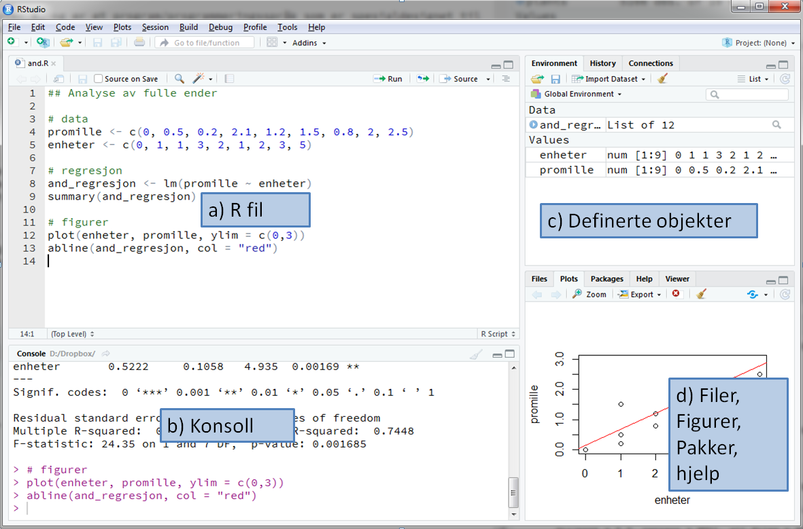
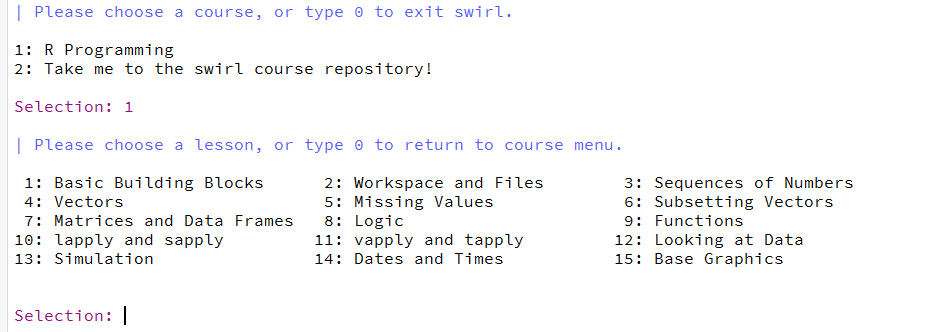
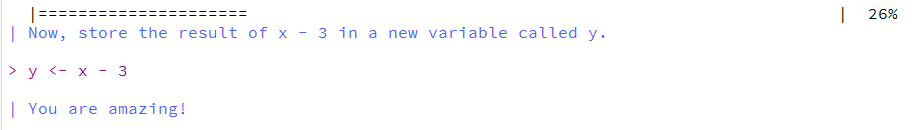
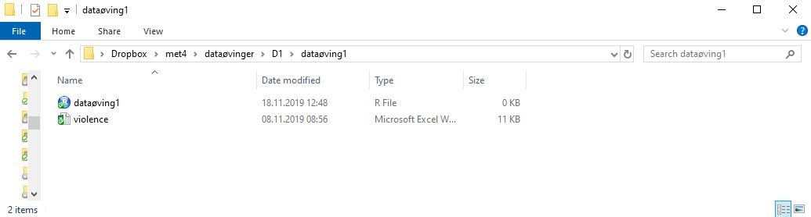
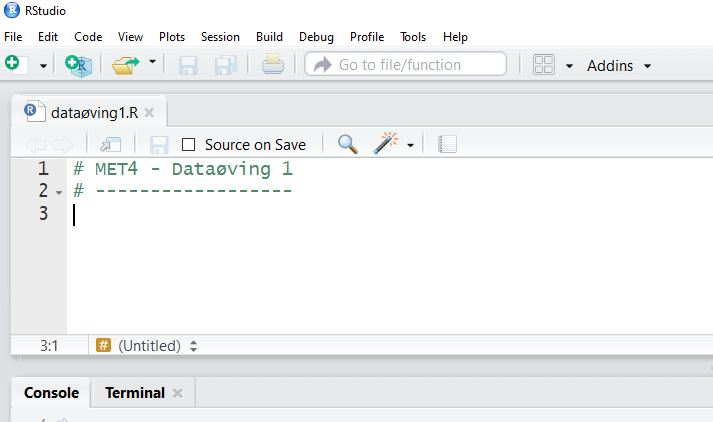
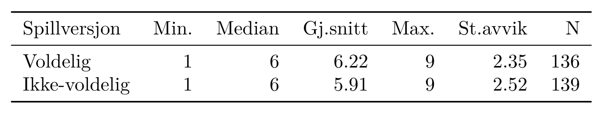
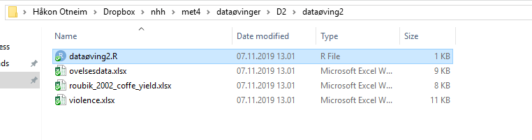
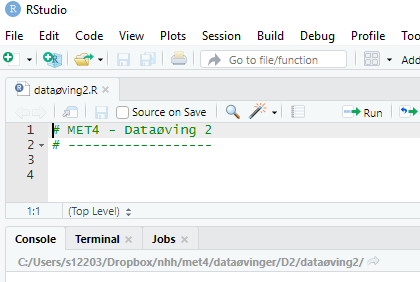

# Dataøvinger

Blabla intro til øvinger

## Dataøving 1

### Innledning

Velkommen til den første dataøvelsen i MET4. I denne øvelsen skal vi bli litt kjent med verktøyene R og Rstudio som brukes i datalabbene. Disse verktøyene er også essensielle for gjennomføringen av den obligatoriske innleveringen og på hjemmeksamen. Den første delen av øvingen inneholder praktisk informasjon om bruk av R og Rstudio etterfølgt av oppgaver.

### Om R og Rstudio

R er et program/programmeringsspråk som er spesialdesignet til å utføre statistiske analyser. R er basert på at du må skrive forskjellige kommandoer for å utføre utregninger og analyser. Gjennomsnittet av 3, 2 og 5 finner man for eksempel ved å skrive:  

```{r, eval = F}
mean(c(3,2,5))
```
Dette kan for mange være litt uvant i starten, men datalabbene vil gi deg god trening på denne type tankegang.

Rstudio er et program som gjør det enklere å bruke R. På samme måte som Word kan hjelpe deg til å lage fine og oversiktlige tekster, kan Rstudio hjelpe deg til å utføre fine og oversiktlige statistiske analyser. Rstudio er et redigeringsprogram som vi i dette kurset skal bruke til å redigere og utføre R-kommandoer.

#### Installere R og Rstudio

Bruker du din egen datamaskin kan du enkelt laste ned og installere R og Rstudio. Begge programvarene er gratis og kan installeres med å følge instruksene under. Får du problemer kan du få en av studentassistentene til å hjelpe deg.

1. Start med å installere R:
    - Gå til [r-project.org](https://cran.uib.no/)
    - Last ned versjonen som passer ditt operativsystem (Windows/Mac/Linux) 
    - Kjør installasjonsfilen og følg instruksene. Standard innstillingene skal være greie å bruke, så du kan trykke neste/ok til installasjonen er ferdig. 
2. Installer så RStudio:
    - [rstudio.com](https://rstudio.com/), og naviger deg frem til siden for **RStudio**. Du skal der laste ned desktop-versjonen av programmet ("Open source edition") for ditt operativsystem og  installere på vanlig måte.
    - Kjør installasjonsfilen som lastes ned og følg instruksene 

#### Vinduene i Rstudio og det å jobbe med R
Første gang du åpner Rstudio vil du se tre vinduer. Et fjerde vindu åpner du med å klikke på **File** i menyen, så **New File**, og så **R Script**. Figur \@ref(fig:rstudio1) viser en oversikt over de fire vinduene. Det er viktig at du forstår forskjellen på de to vinduene til venstre. 

```{r rstudio1, echo = F, fig.cap='Oversikt over vinduene i RStudio.'}

```


Nederste vindu til venstre (b) viser R-konsollen og det er her alle utregninger blir gjennomført. I dette vinduet kan du for eksempel skrive
```{r}
(3*5 - 3/4)*(2 + 2)
```

Her er $(3*5 - 3/4)*(2 + 2)$ en såkalt kommando og det er programmet R som finner ut hva du mener med kommandoen og gir deg svaret $57$ i retur. Du kan se at R tillater standard matteoperasjoner som gange, deling, pluss og minus (`*, /, +, -`). 

R er det vi kaller 'objektbasert', som betyr at du kan definere 'objekter'. Utregningen over kan for eksempel også regnes ut ved å skrive: 

```{r}
a <- 3*5 - 3/4
b <- 2 + 2
a*b
```

```{r, echo = F}
rm(list=ls())
```

Her er `a` og `b` objekter som vi definerer ved bruk av 'tildelingspilen'  `<-` (du kan også bruke `=`). Det går an å lagre objekter i egne filer, men vi skal se at det stort sett er smartere å lagre 'oppskriften' (selve koden) på hvordan de lages i en egen .R fil. 

Det øverste vinduet til venstre (a) viser en .R fil (et skript). En .R fil fungerer som et manuskript med R-kommandoer (kode) og kan lagres slik at du kan senere kan se hvilke kommandoer du har brukt i analysen og eventuelt fortsette der du slapp. I Del 2 av denne dataøvingen skal du selv lage en .R fil som inneholder alle kommandoer som brukes i en enkel analyse.  Når du vil at R skal utføre noen av kommandoene du har skrevet i .R filen markerer du bare disse (eller lar pekeren stå i linjen du vil kjøre) og trykker **ctrl + Enter** (**Cmd + Enter** på Mac):

```{r rstudiorun, echo = F, fig.cap='Utførelse av kommandoer du har skrevet i R filen. Marker eller la pekeren stå i linjen du vil kjøre og trykk **ctrl + Enter** (**Cmd + Enter på Mac**)'}
knitr::include_graphics('bilder/Rstudiorun.PNG')
```

Vinduet nederst til høyre (d) vil vise blant annet figurer du lager og hjelpetekst. Vinduet øverst til høyre (c) gir deg en oversikt over hvilke objekter du har laget og er spesielt nyttig hvis du vil ta en nærmere titt på et datasett du har lest inn. 

Vinduet nederst til høyre (d) vil vise blant annet figurer du lager og hjelpetekst. Vinduet øverst til høyre (c) gir deg en oversikt over hvilke objekter du har laget og er spesielt nyttig hvis du vil ta en nærmere titt på et datasett du har lest inn. 

Det er viktig at du forstår forskjellen på de to vinduene til venstre, altså .R filen og konsollen. R kode du ønsker å ta vare på og som er en essensiell del av analysen skriver og lagrer du i .R filen, mens små eksperimenter og undersøkelser kan du gjerne gjøre direkte i konsollen. 

For de av dere som er glad i hurtigtaster finnes det en oversikt i Rstudio som kommer opp dersom du trykker **Alt + Shift + K** (**Option + Shift + K** på Mac). Ofte vil man f.eks måtte skifte musepeker fra R-filen til konsoll og motsatt, og hurtigtaster for å veksle mellom disse er **Ctrl + 1** (R-fil) og **Ctrl + 2** (konsoll). Hurtigtasten du kommer til å bruke desidert mest er **ctrl + Enter** for å kjøre kode fra R-skriptet ditt i konsollen (På Mac erstatter du **ctrl** med **command** over alt).

#### Funksjoner, dokumentasjon og R-pakker

I R kan man lage egne funksjoner som utfører det en måtte ønske, f.eks en funksjon som regner ut t-observatoren gitt en vektor med observasjoner `x` og en gitt $\mu_0$:

```{r, eval = F}
t.observator <- function(x, mu0){
  t <- (mean(x) - mu0)/(sd(x)/sqrt(length(x)))
  return(t)
}
```

R kommer med en rekke "innebygde" funksjoner som kan utføre ulike statistiske analyser. For eksempel kan en t-test utføres med å bruke en funksjon som heter nettopp `t.test`. Alle slike funksjoner kommer med en dokumentasjon som viser hva funksjonen gjør og hvordan den skal brukes. For å tilgang til denne dokumentasjonen skriver man `?` foran funksjonen i konsollen. Skriver du f.eks `?t.test` ser du at det dukker opp en side i vinduet nede til høyre:

```{r dokumentasjon, echo = F, fig.cap='Dokumentasjon av funksjoner dukker opp i et vindu nede til høyre. Dette vinduet kan åpnes til et større vindu som vist over'}
knitr::include_graphics('bilder/Dokumentasjon.JPG')
```

Dokumentasjonen vil som hovedregel inneholder en kort beskrivelse av hva funksjonen gjør, hvilke argumenter funksjonen tar og hva den gir ut. Helt i slutten av dokumentasjonen er det ofte et eksempel på hvordan funksjonen kan brukes og er ofte svært nyttig å se på. 

Selv om det finnes mange funksjoner som allerede er innebygget i R, må man noen ganger installere ekstra 'pakker' for å få tilgang til spesielle funksjoner. I oppgave 2.2 i denne øvelsen vil vi gå gjennom hvordan dette gjøres for en bestemt pakke. 

#### Skriv pen R-kode!

Det er viktig at R-koden du skriver er veldokumentert og skrevet på en oversiktlig og pen måte. Hvis vi ønsker å skrive kommentarer til koder som står i .R filen bruker vi tegnet `#` foran kommentaren. Dette gjør at R ikke prøver å evaluere kommentaren som en R-kode. Det finnes en rekke konvensjoner når det kommer til mellomrom, linjeskift, navngivning av objekter og lignende. Vi anbefaler tipsene som er oppsummert på (http://adv-r.had.co.nz/Style.html)[http://adv-r.had.co.nz/Style.html], men det er selvsagt lov å ha sine egne preferanser. 

Under ser du et eksempel på dårlig praksis ved R-koding. Her er det manglende dokumentasjon, dårlig navngivning og ingen 'luft' i form av mellomrom og linjeskift. Dette gjør at du eller andre vil måtte bruke unødvendig tid på å finne ut hva koden faktisk gjør på et senere tidspunkt.

```{r, eval = F}
# Dårlig praksis:

library(readxl)
library(tidyverse)
d<-readxl(file="financedata.xlsx",sheetIndex = 1) %>%
  na.omit()
Ø95<-mean(d$value)-qt(0.975,df=length(d$value)-1)*sd(d$value)  
N95<-mean(d$value)+qt(0.975,df=length(d$value)-1)*sd(d$value)
```

Følgende R kode gir det samme resultatet men er mye mer oversiktlig siden den er mer luftig, er brutt ned i biter, er godt dokumentert og har fornuftige objektnavn:

```{r, eval = F}
# God praksis:

# ---------- Analyse av data

# Nødvendige pakker i analysen
library(readxl)
library(tidyverse)

# Les data, fjern NA-verdier og hent ut gjeld
my_data <- readxl(file = "financedata.xlsx", sheetIndex = 1) %>%
  na.omit()
debt <- my_data$debt

# Konfidensintervall
n_obs <- length(debt)     # antall observasjoner
alpha <- 0.05             # signifikansnivå  
average <- mean(debt)     # gjennomsnitt
st_dev <- sd(debt)        # standardavvik
lower <- average - qt(1 - alpha/2, df = n_obs - 1)*st_dev/sqrt(n)  # nedre grense
upper <- average + qt(1 - alpha/2, df = n_obs - 1)*st_dev/sqrt(n)  # øvre grense
```

Vi oppfordrer deg til å prøve å skrive R-kode som er pen og oversiktlig i datalabbene fremover. Dårlige vaner kan være vonde å vende!

### Oppgaver til øvingen

#### Oppgave 1: Interaktiv øvelse 

Her skal du bruke et læringsverktøy kalt `swirl` som vil ta deg gjennom en interaktive øvelse hvor du må utføre forskjellige oppgaver i konsollen. I flere av dataøvingene vil det være en slik interaktiv del. Her er tanken at du skal leke deg litt med R.

Før du kan begynne må du installere swirl. Kopier derfor følgende tre linjer og lim dem inn i R-konsollen: 
```{r, eval = F}
install.packages("swirl")
library(swirl)
install_course("R Programming")
```

For å starte swirl skriver du så følgende i konsollen:

```{r, eval = F}
swirl()
```

Du vil i starten bli bedt om å skrive inn ditt navn og så følger litt info om hvordan swirl fungerer. Du blir så bedt om å velge kurs. Her skal du velge alternativet 'R Programming' (**1** og så **enter**). Du får så se alle modulene dette kurset inneholder:


```{r, echo = F}

```

I denne øvingen skal du prøve deg på modul 1 **'Basic Building Blocks'**, modul 4  **'Vectors'** (kun første halvdel), og modul 12 **'Looking at Data'**.  I modul 1 vil du lære litt om de mest grunnleggende operasjonene som kan gjøres i R. Modul 4 ser nærmere på vektorer og her er første halvdel av modulen mest relevant. Modul 12 tar for seg det å utforske strukturen på et datasett. Start med modul 1 (**1** og så **enter**). Du vil bli bedt om å gjøre enkle operasjoner i R og av og til må du svare på multiple choice spørsmål:

```{r, echo = F}

```

Merk at det helt til høyre vil står hvor langt du har kommet i prosent. Står du helt fast med et punkt kan du skrive `skip()` for å hoppe over dette punktet. Når du har fullført en modul blir du spurt om du vil motta 'credit' for å ha fullført modulen. Her kan du svare nei. Ønsker du å avbryte underveis skriver du `bye()`. Skriver du inn det samme navnet når du eventuelt starter swirl igjen kan du fortsette der du slapp. Husk å avslutt swirl (**esc**) før du begynner på del to av øvingen. Lykke til!

#### Oppgave 2: Innlesning av data og deskriptiv statistikk i R

I denne oppgaven skal vi lese inn noen data og produsere enkel deskriptiv statistikk av disse dataene. Dataene kommer fra [et amerikansk forsøk](https://journals.sagepub.com/doi/10.1177/0956797619829688) hvor man ville undersøke påstanden om at voldelige dataspill fører til voldelig adferd ved la to grupper spille hvert sitt dataspill. I det "voldelige" dataspillet var oppdraget å *skyte* og *drepe* et romvesen,  mens i den ikke-voldelige varianten skulle man *finne* og *redde* romvesenet fra fare. Utover det var spillene helt likt utformet, og i etterkant av en spilleøkt ble deltakernes aggresjonsnivå målt på en skala fra 1 til 9 ved hjelp av en standard psykologisk test. Dette datasettet ble brukt i eksamensoppgaven vårsemesteret 2019.

**Oppgave 2.1**

[Last ned filen violence.xslx](datasett/violence.xlsx). Denne filen lagrer du fortrinnsvis i en egen mappe der du ønsker at filer fra denne øvingen skal ligge. Åpne så **RStudio**, velg  `File -> New File -> R Script` for å åpne et nytt Rscript.  Lagre så scriptet ditt i samme mappen som du har lagt datasettet, slik at du nå har en mappe som ser ut som figuren under:

```{r, echo = F}

```

Når vi skal lese inn data, lagre figurer og andre ting har R en standard 'mappesti' (working directory) den leter/lagrer i. Du kan se hva denne stien peker på ved å skrive \textbf{getwd()} i konsollen. Du skal nå spesifisere denne mappestien til mappen du har opprettet. Dette gjør du raskest ved å velge `Session -> Set Working Directory -> To Source File Location`. Neste gang du skal jobbe med dette prosjektet kan du åpne **RStudio** ved å dobbeltklikke på `dataøving1.R`, og mappestien skal da settes automatisk til riktig mappe.

Lag gjerne en liten overskrift ved hjelp av kommentartegnet `#` slik at .R filen din ser omtrent slik ut:

```{r, echo = F}

```

**Oppgave 2.2** 

Du skal nå lese inn excel filen du lagret i over i R. Selv om det finnes mange funksjoner som allerede er innebygget i R, må man noen ganger installere ekstra 'pakker' for å få tilgang til spesielle funksjoner. For å lese inn en excel fil trenger du nettopp en slik ikke standard funksjon. Denne finnes i pakken `readxl`. Selve installeringen kan du gjøre direkte i konsollen med å skrive (hvis du ikke har gjort det allerede):

```{r, eval = F}
install.packages("readxl")
```

Pakken legger seg da i en bibliotekmappe der R er installert. For å gi R beskjed om å laste inn funksjonene til pakken du nettopp installerte bruker du funksjonen `library`. Du har nå tilgang til en funksjon kalt `read_excel()` som du kan bruke til å lese inn excel filen:

```{r, eval = F, warning=F}
# MET4 - Dataøving 1
# ------------------

# les inn data
library(readxl)
violence <- read_excel("violence.xlsx")
```

```{r, echo = F, message=F}
library(readxl)
violence <- read_excel("datasett/violence.xlsx")
```


Marker linjene du nettopp skrev i R-skriptet ditt og trykk **ctrl + enter** (**cmd + enter**), for å opprette objektet `violence` som inneholder datasettet.  Funksjonen `ls` lister opp alle objekter som har blitt definert. Du kan prøve selv å skrive følgende i konsollen:

```{r}
ls()
```

Du ser at det har kommet et nytt objekt som heter `violence`. En tilsvarende oversikt finner du i vinduet øverst til   høyre i Rstudio (se Figur \@ref(fig:rstudio1)) hvor du også kan klikke på objektet for å se nærmere på det.

**Oppgave 2.3**

Ta en titt på strukturen til datasettet du nettopp leste inn. Husker du kanskje noe fra den interaktive øvelsen 'Looking at Data'? Når du gjør slike små utforskninger kan du gjerne jobbe direkte i konsollen, og det du gjør i dette punktet trenger nødvendigvis ikke være med i .R-filen din. Gå til konsollen og bruk funksjoner som `class`, `dim`, `names`, `head` og `str` for å utforske strukturen på dataene. Vi ser at det er 5 variabler:

- `id` er bare et tall som identifiserer forsøkspersonen.
- `aggression_level` er aggresjonsnivået som ble målt rett etter at forsøkspersonen hadde spilt en viss tid.
- `violent_treatment` er varianten av dataspillet som forsøkspersonen ble utsatt for; enten `Violent` eller `Less Violent`.
- `difficulty_treatment` er vanskelighetsgraden av spillet, som enten var `Easy` eller `Hard`. En mulig forklaring på aggressiv adferd er at vanskelige spill fører til høyere stressnivå, som igjen kan føre til aggressivitet.
- `experienced_violence` er svaret til forsøkspersonen på spørsmålet om vedkommende *oppfattet* spillet som `Violent` eller `Less Violent`.  Forsøkspersonene visste ikke selv hva forssøket gikk ut på, eller at det var flere varianter av det samme spillet.

**Oppgave 2.4**

Vi skal se nærmere på om aggresjonsnivået er forskjellig i de to gruppene. Da må vi trekke ut de aktuelle tallene fra datasettet. Vi ønsker å velge ut *to vektorer* for å gjøre denne sammenligningen: en vektor som inneholder aggresjonsnivået til gruppen som har spilt det voldelige dataspillet, og en vektor som inneholder aggresjonsnivået til gruppen som har spilt det ikke-voldelige dataspillet. 

La disse to vektorene få navn `voldelig` og `ikke_voldelig`, og lag dem ved å skrive følgende kodelinjer:

```{r}
# Vektorer med aggresjonsnivå til gruppen som har spilt voldelig/ikke-voldelig spill 
voldelig      <- violence$aggression_level[violence$violent_treatment == "Violent"]      
ikke_voldelig <- violence$aggression_level[violence$violent_treatment == "Less Violent"]
```

Sjekk nå at dette har fungert ved å skrive `voldelig` og `ikke_voldelig` inn i konsollen for å se at det faktisk er vektorer som inneholder tallene 1 -- 9. Bruk også noen minutter til å prøve å forstå hva kodelinjene over faktisk gjør. Her er noen punkter som kan hjelpe til med å obdusere den første linjen:

1. `violence$aggression_level` henter ut kolonnen `aggression_level` fra datasettet `violence`.
2. Vi kan bruke firkantparantes `[ ]` til å hente ut spesifikke elementer fra en vektor. Her skal vi hente ut bestemte elementer fra vektoren `violence$aggression_level`, og vi kan for eksempel skrive  `violence$aggression_level[1]`, `violence$aggression_level[1:10]` eller `violence$aggression_level[c(1, 5)]` for å hente ut henholdsvis det første, de ti første, eller det første og det femte tallet i vektoren. (Prøv!)
3. Vi skal hente ut noen helt bestemte tall fra `violence$aggression`, nemlig de målingene som tilhører testpersonene som har `violent_treatment` lik `"Violent"`. Alle disse kan vi finne ved å skrive inn `violence$violent_treatment == "Violent"`. Prøv det. Du vil da få ut en vektor fylt med enten `TRUE` eller `FALSE`, alt etter om den tilhørende forsøkspersonen har `violent_treatment` lik `Violent` eller ikke.
4. Denne vektoren kan vi bruke til å hente ut tall som svarer til `TRUE` fra `violence$aggression_level` ved å putte den i firkantparanteser. Det er det som står til høyre for tilordningen `<-`.
5. Til slutt lagrer vi resultatet i vektoren `voldelig`.

(**NB!** Pass på at du skriver `Violent` og `Less Violent` helt riktig med store og små bokstaver, ellers vil det ikke fungere!)

**Oppgave 2.5**

I eksamensoppgaven fra 2019 får vi oppgitt deskriptiv statistikk over aggresjonsnivået for de to gruppene i følgende tabell:

```{r, echo = FALSE}

```

Bruk funksjoner som `min()`, `max()`, `median()`, `mean()`, `length()` og `summary()` til å finne ut om tallene stemmer. Hvordan kan det ha seg at tallene ikke er identiske?

**Oppgave 2.6** 

Vi skal nå lage et histogram av hver av gruppene du lagret som vektorer i tidligere, og vi skal gjøre det på to måter:

- Først skal vi bruke plottefunksjonene som følger med R ("Base R").
- Så skal vi gjøre det samme ved hjelp av `ggplot`-pakken.

Vi skal først bruke funksjonen `hist()` som altså følger med R-installasjonen din. De fleste R-funksjoner har flere argumenter slik de kan utføre forskjellige operasjoner. Om vi for eksempel ønsker at histogrammet skal vise andel og ikke frekvens, må vi angi dette i ett av argumentene. For å ta en titt på hvilke argument `hist()` har å tilby skriver `?hist`  i konsollen. Det vil da poppe opp en dokumentasjonside i vinduet nede til høyre. Skroll ned å les om argumentet 'freq'. Hva skal du erstatte spørsmålstegnene under med for at histogrammene skal vise andel? 

```{r, eval = F}
# Skalert Histogram, vi velger breaks = 9 fordi det er 9 mulige utfall: 1 -- 9.
hist(voldelig, freq = ?, breaks = 9, main = "Voldelig")
hist(ikke_voldelig, freq = ?, breaks = 9, main = "Ikke-voldelig")
```

De fullførte linjene over skal være med i .R-filen din. For å se histogrammene kan du kjøre kommandoene en etter en i konsoll med å trykke **ctrl + enter**. Figurene dukker da opp i vinduet nede til høyre. Du kan også prøve å eksperimentere med argumentet `breaks`.

La oss så forsøke å gjenta denne operasjonen ved å bruke `ggplot`-pakken. Vi kan først kikke på Figur \@ref(fig:to-histogrammer) og koden som lagde disse figurene for å få en idé om hva vi må gjøre. Et svært viktig punkt er føgende:

**`ggplot`-funksjonen skal alltid ha hele datasettet (en data frame) som argument!!**

Det betyr at vi *ikke* skal bruke de to vektorene `voldelig` og `ikke_voldelig`, slik som i `hist()`-funksjonen, men bruke hele datasettet `violence`. Vi ser av oversikten over at variabelen som inneholder aggresjonsnivået er `aggression_level`, så det er den vi skal bruke som $x$-argument. Ved å ta utganspunkt i koden som lagde Figur \@ref(fig:to-histogrammer), kan vi gjøre et første forsøk (der vi husker å laste inn `ggplot2`-pakken først):

```{r}
library(ggplot2)
ggplot(violence, aes(x = aggression_level)) +
        geom_histogram(bins = 9)
```

Nesten! Det eneste problemet er at vi har ett histogram for alle observasjonene, mens det vi egebntlig ønsket var å lage et histogram for hver av gruppene. Dette er såre enkelt i `ggplot2`. Det eneste vi trenger å gjøre er å identifisere den variabelen i datasettet som angir gruppetilhørighet (sjekk variabeloversikten over, svaret er `experienced_violence`), og så plusse på en funksjon som heter `facet_wrap()` som vist under.

```{r}
ggplot(violence, aes(x = aggression_level)) +
  geom_histogram(bins = 9) +
  facet_wrap(~ experienced_violence)
```

Dersom vi i stedet ønsker et skalert histogram kan vi spesifisere `y`-argumentet på følgende vis:

```{r, eval = FALSE}
ggplot(violence, aes(x = aggression_level, y = ..density.. )) +
  geom_histogram(bins = 9) +
  facet_wrap(~ experienced_violence)
```

**Oppgave 2.7** 

Når man skal sammenligne sentrum og spredning i to grupper er et boxplott et ypperlig alternativ og vi kan da bruke funksjonen `boxplot()` i "base R", eller funksjonen `geom_boxplot()` hvis vi heller ønsker å benytte `ggplot2`. Vi holder oss til det siste alternativet her, og ser at kodelinjene ligner på det vi laget over.

Dersom vi ønsker å lage et enkelt boxplot av en variabel for å sammenligne spredingen i to eller flere grupper kan vi skrive

```{r, eval = F}
ggplot(a, aes(x = b, y = c)) +
  geom_boxplot()
```

Her må du selv erstatte bokstavene a, b og c i henhold til følgende regel:

- `a` er navnet på datasettet.
- `b` er variabelen som inneholder gruppeinndelingen.
- `c` er variabelen som inneholder målingene.

De ferdige kodelinjene skal være med i .R-skriptet ditt. For å se boxplottet kan du som vanlig kjøre kommandoene med å trykke **ctrl + enter**. Ser det ut til å være noe forskjell på sentrum og spredning i de to gruppene?

**Bonusoppgave**

Bytt ut `geom_boxplot()` over med `geom_jitter()` og `geom_violin()`. Hva viser disse plottene?

## Dataøving 2

### Interaktiv øvelse 
Før vi tar fatt på dataanalysen begynner vi med litt R-trening i swirl.  Har du allerede installert pakken `swirl` (skriv `install.packages("swirl")` i konsoll hvis ikke) starter du opp swirl med å skrive følgende i konsollen:

```{r, eval = FALSE}
library(swirl)
swirl()
```

Du vil i starten bli bedt om å skrive inn ditt navn. Hvis du bruker samme navn som tidligere får du kanskje tilbud om å starte opp igjen der du slapp, men da kan du bare velge det nederste valget 'No. Let me start something new'. Du velger så alternativet 'R Programming' hvor du får se alle modulene dette kurset inneholder. I denne øvingen skal du prøve deg på modul 6 **'Subsetting Vectors'** og modul 8 **'Logic'**. 

Husk at det helt til høyre vil står hvor langt du har kommet i prosent. Står du helt fast med et punkt kan du skrive `skip()` for å hoppe over dette punktet. Når du har fullført en modul blir du spurt om du vil motta 'credit' for å ha fullført modulen. Her kan du svare nei. Ønsker du å avbryte underveis skriver du `bye()`. Skriver du inn det samme navnet når du eventuelt starter swirl igjen kan du fortsette der du slapp. Husk å avslutt swirl (\textbf{esc}) før du begynner på neste del av datalabben. Lykke til!


### Data til dataøvelsen

I denne dataøvelsen skal vi ved hjelp av R gjennomføre en del av testene som vi har lært i praksis. Vi skal gjøre både ett- og to-utvalgs tester, og vi skal bruke $\chi^2$-testen

Vi skal jobbe med tre ulike datasett i denne øvingen, og alle sammen kan lastes ned ved å klikke på lenkene under:

- [`testdata.xls`](datasett/testdata.xls)
- [`violence.xlsx`](datasett/violence.xlsx)
- [`roubik_2002_coffee_yield.xlsx`](datasett/roubik_2002_coffe_yield.xlsx)

Last ned disse filene og legg dem i en mappe på datamaskinen din. Åpne så **RStudio**, velg  `File -> New File -> R Script` for å åpne et nytt Rscript, og lag gjerne en liten overskrift ved hjelp av kommentartegnet `#`. Lagre så scriptet ditt i samme mappen som du har lagt datasettene, slik at du nå har en mappe som ser ut som figuren under:

```{r, echo = FALSE}

```

Det neste du må gjøre er å sørge for at du har satt opp riktig mappesti (working directory) i **RStudio**, og det gjør du raskest ved å velge `Session -> Set Working Directory -> To Source File Location`. Neste gang du skal jobbe med dette prosjektet kan du åpne **RStudio** ved å dobbeltklikke på `dataøving2.R`, og mappestien skal da settes automatisk til riktig mappe. I alle tilfeller skal vinduet ditt se omtrent slik ut:

```{r, echo = FALSE}

```

### Oppgaver til øvingen:

#### Oppgave 1

Costa Rica er en stor kaffeprodusent med moderne produksjon. Kaffeprodusentene har over lengre tid benyttet en standardisert miks av sprøytemidler som skal ta knekken på ugress og skadelige insekter, men uten å skade avlingen eller miljøet ellers. 

En liten kaffeplantasje i Costa Rica har begynt å eksperimentere med en ny kombinasjon av sprøytemidler som skal være like effektiv mot ugress, men samtidig enda mer skånsom mot kaffeplantene, slik at avlingen blir større. Innehaveren av plantasjen ønsker å sette opp et eksperiment for å undersøke denne påstanden. Han velger ut 25 tilfeldige jordlapper fordelt på hele eiendommen der han bruker de nye sprøytemidlene gjennom en hel sesong.

Lang erfaring har vist at avlingen ved bruk av gammel metode er normalfordelt med forventning $\mu = 100$ og varians $\sigma^2 = 10$, der vi har brukt en standardisert enhet for mengde avling per arealenhet. Hjelp bonden, ved å løse følgende oppgaver:

**Oppgave 1.1:** Les inn datasettet `testdatasdata.xsl` i **RStudio** og se på de første par radene. Det kan du gjøre ved å kjøre følgende kodelinjer:

```{r, warning = F, eval = F}
library(readxl)                                 # Pakke for å lese excel-filer
data <- read_excel("testdata.xls")              # Leser inn datasettet
data                                            # Ser på datasettet
```

```{r, warning = F, echo = F}
library(readxl)                                 # Pakke for å lese excel-filer
data <- read_excel("datasett/testdata.xls")             # Leser inn datasettet
data                                            # Ser på datasettet
```

Det er kolonnen `X2` som inneholder de observerte avlingene på de 25 forsøksseksjonene. 

**Oppgave 1.2:** Er forventet avling ved bruk av den nye metoden *større* enn forventet avling ved bruk av den gamle metoden? *Hint: Forelesningsnotatene/scriptet inneholder koden du trenger for å løse denne og neste oppgave.*

**Oppgave 1.3:** Det er viktig for kaffebonden at avlingen ikke varierer for mye mellom de ulike delene av farmen. En viktig måleparameter for denne type produksjon er derfor variansen. Kan vi slå fast at variansen til avlingen har forandret seg etter omlegging til ny metode? 

**Oppgave 1.4:** Kaffebonden er skeptisk til påstanden om at forventet avling med den gamle metoden er $\mu = 100$, og mener at det vil variere med for eksempel jordsmonn. For å ta høyde for dette gjennomførte han året i forveien tilsvarende målinger på de samme jordlappene, med med gammel sprøytemetode. Disse målingene finner du i kolonne `X1` i datasettet. Test om avlingene er forskjellige, både med og uten paring av observasjonene. Kommenter resultatet. 

#### Oppgave 2

Vi skal i denne oppgaven se på oppgave **1a** og **1b** som ble gitt på skoleeksamen i MET4 vårsemesteret 2019. Dette er det samme datasettet som vi så på i forrige dataøving. I [et amerikansk forsøk](https://journals.sagepub.com/doi/10.1177/0956797619829688) ville man undersøke påstanden om at voldelige dataspill fører til voldelig adferd ved la to grupper spille hvert sitt dataspill. I det "voldelige" dataspillet var oppdraget å *skyte* og *drepe* et romvesen,  mens i den ikke-voldelige varianten skulle man *finne* og *redde* romvesenet fra fare. Utover det var spillene helt likt utformet, og i etterkant av en spilleøkt ble deltakernes aggresjonsnivå målt på en skala fra 1 til 9 ved hjelp av en standard psykologisk test.

I denne oppgaven skal vi i hovedsak finne ut om gruppen som spilte de voldelige dataspillet hadde signifikant høyere aggresjonsnivå enn kontrollgruppen.

**Oppgave 2.1:** Les inn datasettet `violence.xslx` på samme måte som over. Hvis du allerede har kjørt `library(readxl)` trenger du ikke gjøre det igjen med mindre du har startet **RStudio** på nytt. Gi datasettet et passende navn, f.eks

```{r, eval = F}
violence <- read_excel("violence.xlsx")
```

```{r, echo = F}
violence <- read_excel("datasett/violence.xlsx")
```

Vi skal altså teste om aggresjonsnivået er forskjellig i de to gruppene. Da må vi trekke ut de aktuelle tallene fra datasettet. Som vi husker fra forelesningsnotatene trenger vi *to vektorer* for å gjøre en to-utvags $t$-test: en vektor som inneholder aggresjonsnivået til gruppen som har spilt det voldelige dataspillet, og en vektor som inneholder aggresjonsnivået til gruppen som har spilt det ikke-voldelige dataspillet. 

La disse to vektorene få navn `voldelig` og `ikke_voldelig`, og lag dem ved å skrive følgende kodelinjer:

```{r}
voldelig      <- violence$aggression_level[violence$violent_treatment == "Violent"]
ikke_voldelig <- violence$aggression_level[violence$violent_treatment == "Less Violent"]
```

For en forklaring på disse kodelinjene, se Dataøving 1.

**Oppgave 2.2:** Vi er nå klare til å gjøre en to-utvalgs $t$-test for om aggresjonsnivået er det samme i de to gruppene. Prøv å gjøre det nå, men vær bevisst på hvilke valg du gjør underveis, og som du mater inn i `t.test()`-funksjonen, f.eks:

- Antar du lik varians i de to gruppene? Hvorfor/Hvorfor ikke?
- Bruker du ensidig eller tosidig test? Hvorfor?

**Oppgave 2.3:** En avgjørende detalj i studien som vi ser på i denne oppgaven er at forskerne også spurte forsøkspersonene hvorvidt de selv syntes spillet de spilte var voldelig. For å kunne trekke noen som helst lærdom fra et slikt forsøk er det viktig at den voldelige spillvarianten faktisk blir oppfattet som voldelig og vice versa. Vi ønsker dermed å undersøke nullhypotesen om at variablene `violence_tratment` og `experienced_violence` er uavhengige av hverandre. Den hypotesen er vi nødt til å forkaste for at forsøket skal være gyldig: hvis det ikke er noen sammenheng mellom opplevd og faktisk voldelighet er forsøket helt klart ugyldig.

Første steg er å lage et nytt datasett der vi bare ta med oss de to kolonnene vi er interessert i. Kall det hva du vil, f.eks. `violence_redusert`:

```{r}
violence_redusert <- violence[c("violent_treatment", "experienced_violence")]
```

Vi fortsetter som i videoforelesningen og lager en krysstabell for disse variablene

```{r}
krysstabell <- table(violence_redusert) 
krysstabell
```

**Oppgave 2.4:** Heldigvis ser det ut til at det er en klar sammenheng mellom faktisk og opplevd voldelighet ved at de fleste forsøkspersonene havner på diagonalen i krysstabellen. Bruk funksjonen `chisq.test()` på samme måte som i forelesningen til å teste nullhypotesen om uavhengighet formelt.

#### Oppgave 3

Vi skal i denne oppgaven returnere til kaffeproduksjon. Vi skal gjøre statistiske tester i R som i de tidligere oppgavene i denne øvingen, men vanskelighetsgraden går opp fordi vi også må tenke nøye over hvordan vi anvender metodene korrekt i en gitt kontekst.

I 2002 publiserte det prestisjetunge tidsskriftet *Nature* en kort artikkel skrevet av David W. Roubik^[David W. Roubik: *The value of bees to the coffee harvest*. Nature (2002)], som handler om den kjente kaffebønnen *Arabica*. Arabicabønnen kommer opprinnelig fra Afrika, og er en selvpollinerende plante. Det vil si at den ikke er avhengig av insekter for å formere seg, og man trodde lenge at den heller ikke hadde noen fordeler av insektspollinering. 

For å undersøke denne påstanden samlet Roubik inn historiske data over arabicaavlinger fra hele verden. Han delte verdens kaffeproduserende land inn i to kategorier: *Old world* som omfatter afrikanske  og asiatiske land, og *New world* som omfatter land i Latin-Amerika. Han registrerte videre *gjennomsnittlig årlig avling* (målt i kg/hektar) i to perioder: 1961--80 og 1981--2001.

Nøkkelen til analysen er at den afrikanske honningbien var en viktig pollinator i Afrika og Asia både i den første og andre perioden, men knapt eksisterte i Amerika før 1980. Etter 1980, derimot, økte utbredelsen av denne bien i Amerika, og ble fort naturalisert. Kan vi sette denne utviklingen i sammenheng med økt kaffeavling i Latin-Amerika etter 1980, og dermed skrote teorien om at kaffeplanter ikke drar nytte av insektspollinering?

**Oppgave 3.1:** For å undersøke dette kan vi bruke datasettet som Roubik brukte, som finnes i filen `roubik_2002_coffe_yield.xlsx`. Last datasettet inn i R på vanlig måte, og se på det:

```{r, eval = F}
yield <- read_excel("roubik_2002_coffe_yield.xlsx")
yield
```

```{r, echo = F}
yield <- read_excel("datasett/roubik_2002_coffe_yield.xlsx")
yield
```

Vi ser at det er fire kolonner i datasettet:

- `world` angir om det er snakk om *New world* (`new`) eller *Old world* (`old`).
- `country` angir navnet på landet.
- `yield_61_to_80` angir avlingen i perioden 1961--80.
- `yield_81_to_01` angir avlingen i perioden 1981--2001.

**Oppgave 3.2:** Kall den første tidsperioden `p1` og den andre tidsperioden `p2`. Lag så *fire* vektorer, en for hver kombinasjon av `world` og tidsperiode ved å bruke samme teknikk som i oppgave **2.2** over. Når du er ferdig, skal du ha laget følgende vektorer:

- `new_p1`: inneholder avling for alle land med `world == new` i første periode.
- `new_p2`: inneholder avling for alle land med `world == new` i andre periode.
- `old_p1`: inneholder avling for alle land med `world == old` i første periode.
- `old_p2`: inneholder avling for alle land med `world == old` i andre periode.

```{r, echo = FALSE}
new_p1 <- yield$yield_61_to_80[yield$world == "new"]
new_p2 <- yield$yield_81_to_01[yield$world == "new"]
old_p1 <- yield$yield_61_to_80[yield$world == "old"]
old_p2 <- yield$yield_81_to_01[yield$world == "old"]
```

Dersom du har gjort det riktig, ser vektorene slik ut når du er ferdig:

```{r}
new_p1
new_p2
old_p1
old_p2
```

**Oppgave 3.3:** Bruk en paret $t$-test til å finne ut om kaffeavlingen i den gamle verden er signifikant forskjellig i de to tidsperiodene.

**Oppgave 3.4:** Bruk en paret $t$-test til å finne ut om kaffeavlingen i den nye verden er signifikant forskjellig i de to tidsperiodene.

**Oppgave 3.5 (Diskusjonsopgave):** Dersom du har gjort de to foregående oppgavene riktig vil du se at den gjennomsnittlige kaffeavlingen ikke har endret seg signifikant i den gamle verden, mens økningen i den nye verden er klart statistisk signifikant. Vi har brukt parrede $t$-tester, slik at vi "kontrollerer for" eventuelle landeffekter (denne terminologien blir skal vi bruke mer når vi skal jobbe med regresjon).

Roubik omtaler funnet som følger:

> *A substantial increase in Latin American coffee yield partly coincided with the establishment of African honeybees in those countries, although there was no such change in the Old World, where honeybees originated [...]. This comparison underlines a possible cause-and-effect relationship between the presence of social bees and cofee yield.* 

Dette er intet mindre enn en **kortslutning**, på minst to forskjellige måter. Hvorfor? Diskuter med dine medstudenter. Kan det gjennomføres en enkel test som gir et bedre bilde av situasjonen?

### BONUS: En alternativ teknikk for datamanipulering (Gjør bare om du har overskudd til det!)
 
Se på denne kodelinjen:

```{r, eval = FALSE}
voldelig <- violence$aggression_level[violence$violent_treatment == "Violent"]
```

Vi skrev denne linjen for å hente ut noen bestemte verdier fra et bestemt datasett. Det er kanskje ikke så lett å se hva kodelinjen gjør ved å bare kaste et raskt blikk på den, og det er spesielt to grunner til det:

- den er lang, og
- du må lese den delvis "innenfra og ut" (alstå, begynne innerst i parantesene) og delvis fra høyre mot venstre.

Spesielt det siste punktet er kontraintuitivt, siden det er motsatt av slik vi vanligvis leser. Mye arbeid i R går ut på å manipulere datasett på ulike vis (hente ut kolonner og rader, lage nye kolonner), og derfor er det utviklet noen alternative verktøy for å gjøre slike jobber mye mer effektivt. Vi vil i dette avsnittet gi en kort og meget grunleggende innføring i slike teknikker. Merk at dette ikke er *pensum* i klassisk forstand. Det viktigste er at jobben blir gjort korrekt. Hvordan du gjør det er i så måte underordnet.

For å gjennomføre øvelsen under må du installere og laste inn en ny pakke: `dplyr`:

```{r, eval = FALSE}
install.packages("dplyr")
library(dplyr)
```

```{r, message = FALSE, echo = FALSE, warning = FALSE}
library(dplyr)
```

#### KONSEPT 1: Pipe-operatoren `%>%` {-}

Tenk deg at vi skal regne ut logaritmen til kvadratroten av 2. Vi må da anvende to funksjoner i riktig rekkefølge. Vi kan alltids bruke en mellomregning:

```{r}
kvadratroten_til_2 <- sqrt(2)
log(kvadratroten_til_2)
```

Eventuelt kjører vi alt sammen i en linje:

```{r}
log(sqrt(2))
```

Nå er ikke den siste linjen spesielt lang, men den er som sagt ikke helt intuitiv. Grunnen er at hvis vi skal lese høyt hva den gjør, så må vi begynne innerst i parantesene: "Vi starter med tallet 2, så tar vi kvadratroten, så tar vi logaritmen..."

I `dplyr`-pakken finnes en såkalt pipe-operator som gjør at vi kan skrive dette som kode i den rekkefølgen ting skal skje. Eksempelet over skrives slik:

```{r}
2 %>% sqrt %>% log
```

Det som skjer er at R leser linjen fra venstre, og ved hver "pipe/`%>%`" sendes det som står på venstre side inn som argument i funksjonen på høyre side. Når du leser kode, kan denne operatoren uttales som **så** (**then** på engelsk): **Først** har vi tallet 2, **så** tar vi kvadratroten, **så** tar vi logaritmen.

Tenk når vi har en sekvens av 10 eller 20 eller 50 steg (ikke uvanlig i den virkelige verden), hvor mye enklere det blir å kode på denne måten fremfor å ha 10, 20 eller 50 nivå med paranteser!

**Tips:** Hurtigtasten for `%>%` i RStudio er `Ctrl - Shift - M` (Bytt ut **Ctrl** med **Cmd** på Mac).

#### KONSEPT 2: Datamanipuleringsfunksjoner i `dplyr` {-}

I `dplyr` finnes det noen meget praktiske funksjoner som vi kan bruke til å manipulere datasatt i R. La oss ta utgangspunkt i datasettet `violence` og prøve å skrive om den aktuell kodelinjen over ved hjelp av pipe-operatoren. I klartekst skal vi gjøre følgende operasjoner:

1. Starte med datasettet `violence`
2. Plukke ut alle radene som har verdi `"Violent"` i kolonnen `violent_treatment`.
3. Plukke ut kolonnen `aggression_level`

For å velge ut bestemte rader kan vi bruke funksjonen `filter()`. Ved hjelp av pipe-operatoren kan vi skrive steg 1 og 2 som

```{r}
violence %>% filter(violent_treatment == "Violent")
```

Nå ser vi at vi bare har 126 rader igjen, og det er nettopp de radene som i kolonnen `violent_treatment` har verdi `"Violent"`. Det neste steget er å velge ut kolonnen `aggression_level`. Det gjør vi ved å bruke funksjonen `select()`, og hele sekvensen ser da slik ut (linjeskift gjør det enda mer lesbart):

```{r}
violence %>% 
  filter(violent_treatment == "Violent") %>% 
  select(aggression_level)
```

Man kan velge flere kolonner ved å sette komma mellom kolonnenavn, og man kan i stedet velge *bort* kolonner ved å sette minustegn foran kolonnenavnet, f.eks:

```{r, eval = FALSE}
violence %>% select(id, aggression_level)
violence %>% select(-id)
```

Nå har det seg slik at vi gjerne ønsker å hente ut den aktuelle kolonnen som en *vektor*. Det gjør vi enkelt ved å slenge på en `pull` på slutten av en pipe-sekvens. Til slutt må vi passe på å lagre vektoren med riktig navn, slik at vi får:

```{r}
voldelig <- violence %>% 
  filter(violent_treatment == "Violent") %>% 
  select(aggression_level) %>% 
  pull
```

Denne koden er ekvivalent med den som startet dette avsnittet i øvingen. Den er derimot mye enklere å lese, og *veldig* mye enklere å utvide til å inkludere flere operasjoner.

La oss se på enda en funksjon som vil være svært nyttig for oss senere. Vi kan bruke `mutate()` til å *lage nye kolonner*. La oss for eksempel si at vi vil lagre kvadratet av `aggression_level` eller summen av `aggression_level` og `id` som egne kolonner (som selvsagt er helt meningsløst i dette tilfellet, kun et eksempel). Det kan vi gjøre slik:

```{r, eval = FALSE}
violence %>% 
  mutate(ny1 = aggression_level^2) 
```

eller

```{r, eval = FALSE}
violence %>% 
  mutate(ny2 = id + aggression_level)
```

Her er `ny1` og `ny2` navn på de nye kolonnene, som vi kan velge selv.

**Oppgave:** Gjenta **Oppgave 3.2**, men ved å bruke teknikkene i dette avsnittet.

#### Interaktiv øving i `dplyr` {-}

Hvis du ønsker å trene mer på dette så finnes det en interaktiv modul i `swirl` som omhandler datamanipulasjon ved hjelp av `dplyr`. Hvis du ikke har gjort det alledede, skriv `install.packages("swirl")` i konsoll. Start du opp `swirl` med å skrive følgende:

```{r, eval = F}
library(swirl)
install_course("Getting_and_Cleaning_Data ") # legger til nytt kursmateriale
swirl()
```

Du vil i starten bli bedt om å skrive inn ditt navn og så følger litt info om hvordan swirl fungerer. Du blir så bedt om å velge kurs. Her skal du først velge alternativet 'Getting and Cleaning Data'. Du får så se alle modulene dette kurset inneholder. I denne øvingen skal du prøve deg på modul 1 **'Manipulating Data with dplyr'**. 

