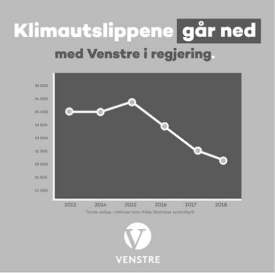
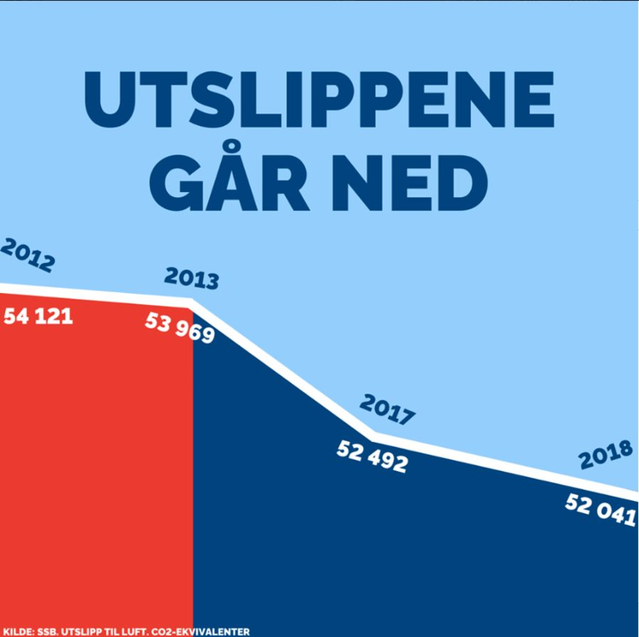
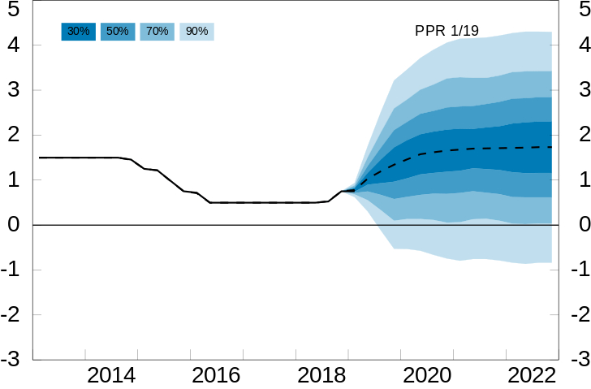
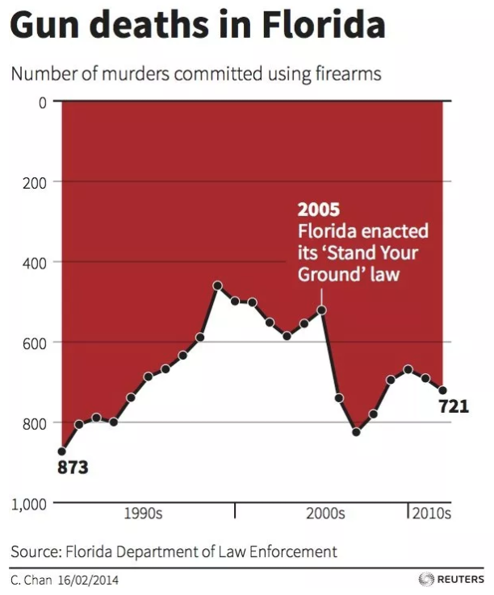
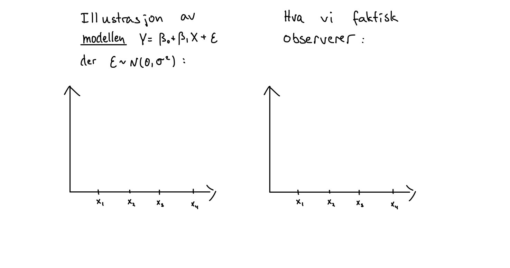

# Seminaroppgaver {#seminar}


Her finner dere oppgavesettene som vi skal regne på oppgaveseminarene som vi i all hovedsak skal bruke torsdagstimene på. 

## Seminar 1 - Grunnleggende statistikk 

1. **(V20, OPPG 1)** Grafen ble publisert av klima- og miljøminister Ola Elvestuen fra Venstre på Twitter 1. november 2019 (men senere tatt bort), og viser norske CO$_2$-utslipp (i 1000 tonn CO$_2$-ekvivalenter) som funksjon av tid. Venstre gikk inn i regjering sammen med Høyre og Fremskrittspartiet i januar 2018. Denne figuren ble kritisert for å være *misvisende*. På hvilken måte er den det, og hvordan ville du forandret den for at den skulle være mindre misvisende?

```{r, echo = F}

```

2. **(V20, OPPG 1)** Figuren under ble publisert av Høyre på Facebook 1. november 2019, og viser norske CO$_2$-utslipp (i 1000 tonn CO$_2$-ekvivalenter) som funksjon av tid. Denne figuren ble *også* kritisert for å være misvisende. På hvilken måte er den det, og hvordan ville du forandret den for at den skulle blitt mindre misvisende?

```{r, echo = F}

```

3. **(V19, OPPG 3)** I figuren under ser vi en graf over den norske styringsrenten siden 2013 og anslag over hvilken bane renten skal følge de neste tre årene med fire usikkerhetsintervaller. Bruk figuren til å anslå sannsynligheten for negativ styringsrente ved utgangen av 2022.

```{r, echo = F}

```

4. Florida innførte i 2005 en såkalt "Stand Your Ground"-lov, som i større grad tillater folk å bruke dødelig makt i selvforsvar. Grafen under, som viser utviklingen av dødsoffer i skyteepisoder i Florida, illustrerte mange nyhetsreportasjer etter et [drap i 2012](https://en.wikipedia.org/wiki/Shooting_of_Trayvon_Martin), men fikk skarp kritikk i ettertid. Hvorfor det tror du?

```{r, echo = F}

```

<!-- 5. **(H13, OPPG 1)**  -->
<!--     a. Gjør oppgave 1a og 1b på dette oppgavesettet. -->
<!--     b. Kan du foreslå en *grafisk* fremstilling som kan vise eventuelle forskjeller i responstid før og etter omleggingen? -->
    
5. La oss anta at 50 avgangsstudenter som gikk ut av NHHs masterprogram i fjor svarte på et spørreskjema hvor mye de har i startlønn i sin første jobb. Gjennomsnittslønnen var 450.000, med et standardavvik på 120.000. Anta videre at lønnsfordeningen for årets studenter er den samme (og se bort fra inflasjon). 
    a. Estimer sannsynligheten for at gjennomsnittlig startlønn for 50 responenter i år vil være større enn 450.000.
    b. Estimer sannsynligheten for at gjennomsnittlig startlønn for 50 responenter i år vil være større enn 500.000.
    
6. La $X$ være en stokastisk variabel med forventningsverdi lik 5 og varians lik 2. Definer to nye stokastiske variabler $Y = 2X-1$ og $Z = X^2 + Y$. Regn ut:
    a. E$(Y)$ og Var$(Y)$.
    b. E$(Z)$ og Var$(Z)$.
    
7. La $X$ være en standard normalfordelt variabel. Du får oppgitt at det medfører at E$(X^3) = 0$. La $Y = X^2$.
    a. Vis at korrelasjonen mellom $X$ og $Y$ er lik null.
    b. Er $X$ og $Y$ uavhengige?


## Seminar 2 - Hypotesetesting 

1. Sett opp en generell regel/oppskrift som du kan følge *alle* gangene du skal gjennomføre en hypotesetest.

2. Tegn opp en figur som viser hvordan de samme verdiene av $\overline{X}$ og $\mu$ i to ett-utvalgs $t$-tester likevel kan føre til motsatt konklusjon av testen.

3. Det er desverre et stort problem at folk som bruker begrepet *p-verdi* i ulike sammenhenfer ofte ikke forstår hva begrepet betyr. I den sammenheng publiserte *The American Statistical Association* i 2016 [et skriv som i klare ordelag beskriver problemet](https://www.tandfonline.com/doi/pdf/10.1080/00031305.2016.1154108). Les gjennom dette skrivet, og spesiel avsnitt 3 "*Principles*". 
    a. Oversett hver av disse seks overskriftene (prinsippene) til norsk med dine egne ord, og skriv så en setning, igjen med egne ord, om hvordan du forstår hvert av punktene. 
    b. Prøv å definer begrepet *p-verdi* med så enkle ord som du klarer.

4. Gjør oppgave 11.38 i læreboken: *The club professional at a difficult public course boasts that his course is so tough that the average golfer loses a dozen or more golf balls during a round of golf. A dubious golfer sets out to show that the pro is fibbing. He asks a random sample of 15 golfers who just completed their rounds to report the number of golf balls they lost. Assuming that the number of golf balls lost is normally distributed with a standard deviation of 3, can we infer at the 10% significance level that the average (rett ord her er vel egentlig "expected") number of golf balls lost is less than 12?*
    
    Observasjonene er: 1, 14, 8, 15, 17, 10, 12, 6, 14, 21, 15, 9, 11, 4, 8
    
5. Anta at det sanne forventede antall golfballer som forsvinner i forrige oppgave er 10, hva er da styrken (power) til testen som du gjorde der? Hva er tolkningen til dette tallet?

6. Gjør skoleeksamen V17, oppgave 1a og 1b.

7. Gjør skoleeksamen V19, oppgave 1b.


## Seminar 3 - Regresjon I

1. Se på den estimerte regresjonskurven under:

```{r, enkel oppgave, Message=F, echo=F}
library(ggplot2)
set.seed(1)
x <- rnorm(100, mean = 5, sd = 3)
Ey <- 10 - 2*x
y <- Ey  + rnorm(100,0,2)
df <- data.frame(x = x, y = y, Ey = Ey)
ggplot(df) +
  geom_point(aes(x = x, y = y)) + 
  geom_line(aes(x = x, y = Ey), color = "red")
#summary(lm(y ~ x))
#cor(x,y)

```

a. Bestem hvilke av de følgende parameterestimatene som kan være riktig:
    i. $\hat{\beta}_0 = 5$, $\hat{\beta}_1 = -3$ 
    ii. $\hat{\beta}_0 = 10$, $\hat{\beta}_1 = 4$ 
    iii. $\hat{\beta}_0 = -4$, $\hat{\beta}_1 = 2$ 
    iv. $\hat{\beta}_0 = 10$, $\hat{\beta}_1 = -2$ 


b. Bestem hvilke av de følgende utsagn om den estimerte korrelasjonen mellom $X$ og $Y$ og andel forklart variasjon ($R^2$) som er riktig:
    i. Korrelasjonen er $-0.94$ andel forklart variasjon er $-0.88$.
    ii. Korrelasjonen er $0.94$ andel forklart variasjon er $0.88$.
    iii. Korrelasjonen er $-0.94$ andel forklart variasjon er $0.88$.
    iv. Korrelasjonen er $1$ andel forklart variasjon er $0.88$.


2. Under ser du et residualplott og et QQ-plot for en regresjonsanalyse. Hvilke brudd på antagelsene for lineær regresjon ser du? Dersom alle andre kriterier er oppfylt, hvilke konsekvenser har disse bruddene? 

```{r, hetro, echo = F, message=F}
library(lindia)
set.seed(1)
x=rep(1:300,2)
a=0
b = 1
sigma2 = x^1.3
eps = rnorm(300,mean=0,sd=sqrt(sigma2))
y=a+b*x + eps
mod <- lm(y ~ x)
plots <- gg_diagnose(mod, plot.all = F)
include <- plots[c(3, 4)]
plot_all(include)

```


3. En student ønsker å undersøke sammenhengen mellom pris og størrelsen på leiligheter (m^2). Han bestemmer seg for å samle inn data på solgte leiligheter ukentlig over et helt år. Hva kan være problematisk for en slik strategi? 

4. Anta $Y_i$ er forandring i BNP fra kvartal $i-1$ til kvartal $i$, mens $x_i$ er forandringen i arbeidsledighet fra kvartal $i$ til kvartal $i-1$. Du tilpasser så regresjonsmodellen
\begin{equation}
Y_i = \beta_0 + \beta_1 x_i + \epsilon_i
\end{equation}
Forklar hva forskjellen på et prediksjonsintervall og konfidensintervall er i denne sammenhengen dersom $x=0$, og hvorfor begge typer intervall er interessante.     

5. Eksamen Vår 2019, Oppgave 2d) og e).


## Seminar 4 - Regresjon II 

1. Vi har lyst til å forstå forskjellen på den statistiske *modellen* $Y = \beta_0 + \beta_1X + \epsilon$ der $\epsilon$ er normalfordelt med forventningsverdi 0 og varians $\sigma^2$, og det vi faktisk observerer, som er par av observasjoner $(X_1, Y_1), \ldots, (X_n, Y_n)$. Klarer du å illustrere denne forskjellen ved å fortsette på tegningen under? Her har vi satt $n=4$.

```{r, echo = FALSE}

```

2. Et lite firma som selger babyutstyr ser god effekt av å markedsføre produktene sine på Youtube. For å analysere denne sammenhengen nøyere samler de inn historiske data på hvor mye de har brukt på Youtube-reklame (`youtube`) i løpet av en måned, og omsetningen den måneden (`sales`), og gjennomfører så en enkel lineær regresjon med `youtube` som forklaringsvariabel og `sales` som responsvariabel. Gi en kort fortolkning av regresjonsutskriften under:

```{r, echo = FALSE, message = FALSE}
library(dplyr)
library(ggplot2)

data(marketing, package = "datarium")

reg <- lm(sales ~ youtube, data = marketing)

stargazer::stargazer(reg, type = "text")
```


3. I figuren under har vi plottet inn datasettet, den estimerte regresjonslinjen (rød heltrukken strek), samt linjen $y = x$ (sort stiplet linje). Hvordan skal babyutstyrforhandleren tolke denne figuren?

```{r, echo = FALSE}
marketing %>% 
  ggplot(aes(x = youtube, y = sales)) +
  geom_point() +
  geom_abline(slope = reg$coefficients[2], intercept = reg$coefficients[1], 
              colour = "red", size = 1.5) +
  geom_abline(slope = 1, intercept = 0, linetype = "dashed", size = 1.5)
```

4. Ved hjelp av den estimerte regresjonsmodellen lager babyutstyrforhandleren følgende plott av residualene mot de predikerte verdiene for hver observasjon i datasettet. Hva sier denne figuren oss om lineær regresjon som modell for sammenhengen mellom penger brukt på markedsføring og omsetning? 

```{r, echo = FALSE}
tibble(fitted.values = reg$fitted.values,
       residuals = reg$residuals) %>% 
  ggplot(aes(x = fitted.values, y = residuals)) +
  geom_point()

```

Det er gjort mange forsøk på å forklare hvorfor noen land er rike, mens andre land er fattige, se f.eks hjemmeeksamen i MET4, V17. En mulig forklaring kan ligge in landenes fysiske og geografiske egenskaper. For eksempel, kan det hende at land som har ulendt terreng kan ha større vanskeligheter med å bygge infrastruktur og frakte varer enn land som er helt flate, og dermed ende opp som fattigere av den grunn? 

Vi ser på et lite datasett ([lånt fra boken *Statistical Rethinking*](https://xcelab.net/rm/statistical-rethinking/)) der vi har et mål på landenes rikdom (logaritmen av BNP, `log_gdp`), samt et mål på hvor ulendt terrenget er i det landet (`rugged`). Vi har også mer informasjon om landene, for eksempel om det ligger i Afrika eller ikke (`cont_africa`).

Vi har gjort tre regresjonsanalyser i R, med følgende utskrifter:

```{r, echo = FALSE}
# data("rugged", package = "rethinking")
load("datasett/rugged.Rdata")

nations <-
  rugged %>% 
  mutate(
    log_gdp = log(rgdppc_2000),
    continent = ifelse(cont_africa, "Africa", "Other")
  ) %>% 
  filter(! is.na(log_gdp))

reg1 <- lm(log_gdp ~ rugged, data = nations)
reg2 <- lm(log_gdp ~ rugged + cont_africa, data = nations)
reg3 <- lm(log_gdp ~ rugged * cont_africa, data = nations)

stargazer::stargazer(reg1, reg2, reg3, type = "text")
```
5. Skriv opp de tre estimerte regresjonsmodellene.

6. Gi en kort fortolkning av modell (2).

7. Gi en forklaring på hva vi lærer ved å gå fra modell (2) til modell (3). Fokuser spesielt på rollen til interaksjonsleddet (`rugged:cont_africa`). Hvordan kan det ha seg at `rugged`-variabelen nå plutselig er statistisk signifikant forskjelig fra null? Kan du tenke deg en praktisk fortolkning av disse resultatene?


## Seminar 5 - Tidsrekker 
 
Vi skal jobbe oss gjennom en serie tidligere eksamensoppgaver om tidsrekker:

- V17, oppgave 1g
- V18, oppgave 2a--2b
- H19, opppgave m--n
- V20, oppgave 3

Oppgaveformuleringene finner du i seksjon \@ref(skoleeksamen).


## Seminar 6 - Avansert regresjon og maskinlæring 

1. Nevn minst to grunner til at en ønsker å utføre en vanlig regresjonsanalyse. Reflekter så over hva hovedgrunnen er med å lage henholdsvis en KNN-modell og en regresjonsmodell.

2. Diskuter i hvilken grad det er rimelig med komponenten $v_t$ i en paneldatamodell


    $$y_{it} = \beta_0 + \beta_1 x_{it} + ...  + v_t + \alpha_i + \epsilon_{it} $$
     
dersom en skal analysere paneldata av følgende responsvariabler $y_{it}$:

a. Antall konkurser hver måned i ulike land.
b. Timentlig energi-etterspørsel i norske kommuner.
c. Lønn per år for forskjellige individer i et land.
d. Kan du komme på en tidsinvariant forklaringsvariabel som er relevant for responsvariablene over? Gjør det noe om vi "glemmer" disse?

3. Tegn et sett med observasjoner bestående av en dummy-variabel $Y$ og en kontinuerlig variabel $X$ i et xy-koordinatsystemet
hvor en ville fått bedre prediksjoner av $Y$ med KNN-metoden enn med logistisk-regresjon.

4. Prøv deg på eksamen H21 oppgave 3

Oppgaveformuleringene finner du i seksjon \@ref(skoleeksamen).

