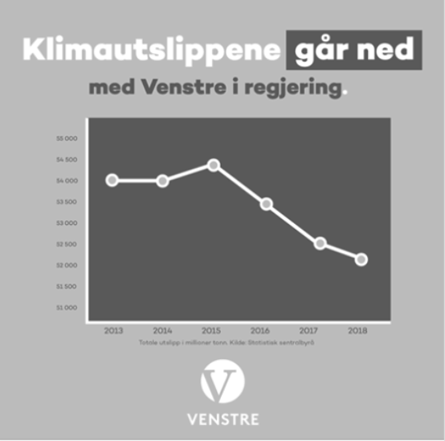
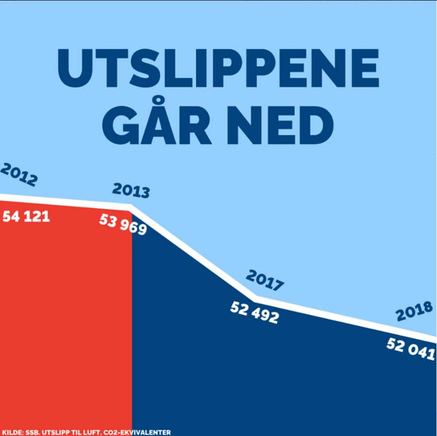
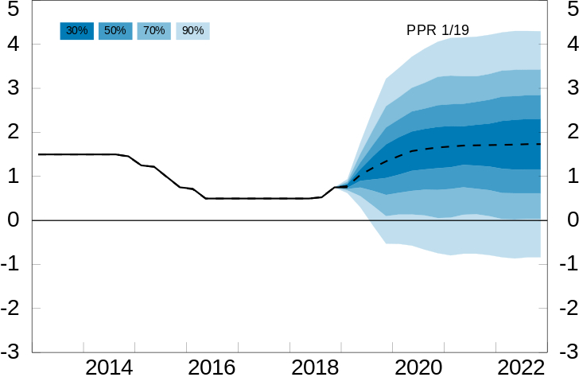
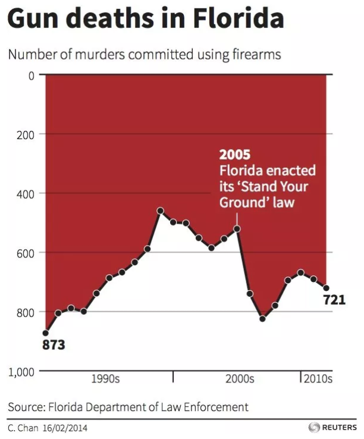
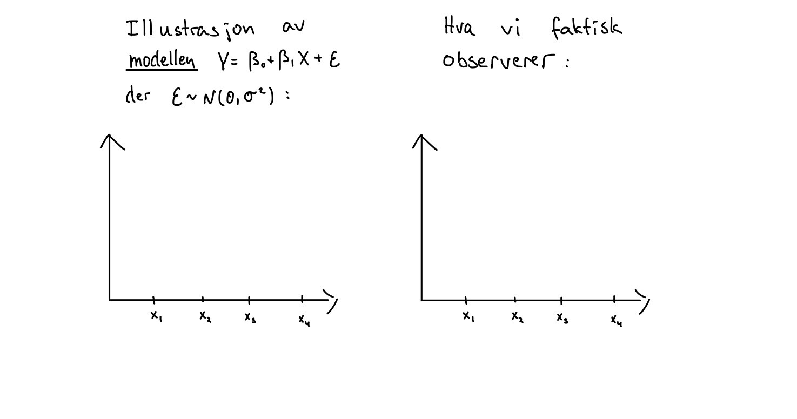

# Seminaroppgaver {#seminar}


Her finner dere oppgavesettene som vi skal regne på oppgaveseminarene som vi i all hovedsak skal bruke torsdagstimene på. 

## Seminar 1 - Grunnleggende statistikk 

1. **(V20, OPPG 1)** Grafen ble publisert av klima- og miljøminister Ola Elvestuen fra Venstre på Twitter 1. november 2019 (men senere tatt bort), og viser norske CO$_2$-utslipp (i 1000 tonn CO$_2$-ekvivalenter) som funksjon av tid. Venstre gikk inn i regjering sammen med Høyre og Fremskrittspartiet i januar 2018. Denne figuren ble kritisert for å være *misvisende*. På hvilken måte er den det, og hvordan ville du forandret den for at den skulle være mindre misvisende?

```{r, echo = F}

```

2. **(V20, OPPG 1)** Figuren under ble publisert av Høyre på Facebook 1. november 2019, og viser norske CO$_2$-utslipp (i 1000 tonn CO$_2$-ekvivalenter) som funksjon av tid. Denne figuren ble *også* kritisert for å være misvisende. På hvilken måte er den det, og hvordan ville du forandret den for at den skulle blitt mindre misvisende?

```{r, echo = F}

```

3. **(V19, OPPG 3)** I figuren under ser vi en graf over den norske styringsrenten siden 2013 og anslag over hvilken bane renten skal følge de neste tre årene med fire usikkerhetsintervaller. Bruk figuren til å anslå sannsynligheten for negativ styringsrente ved utgangen av 2022.

```{r, echo = F}

```

4. Florida innførte i 2005 en såkalt "Stand Your Ground"-lov, som i større grad tillater folk å bruke dødelig makt i selvforsvar. Grafen under, som viser utviklingen av dødsoffer i skyteepisoder i Florida, illustrerte mange nyhetsreportasjer etter et [drap i 2012](https://en.wikipedia.org/wiki/Shooting_of_Trayvon_Martin), men fikk skarp kritikk i ettertid. Hvorfor det tror du?

```{r, echo = F}

```

<!-- 5. **(H13, OPPG 1)**  -->
<!--     a. Gjør oppgave 1a og 1b på dette oppgavesettet. -->
<!--     b. Kan du foreslå en *grafisk* fremstilling som kan vise eventuelle forskjeller i responstid før og etter omleggingen? -->
    
5. La oss anta at 50 avgangsstudenter som gikk ut av NHHs masterprogram i fjor svarte på et spørreskjema hvor mye de har i startlønn i sin første jobb. Gjennomsnittslønnen var 450.000, med et standardavvik på 120.000. Anta videre at lønnsfordelingen for årets studenter er den samme (og se bort fra inflasjon). 
    a. Estimer sannsynligheten for at gjennomsnittlig startlønn for 50 responenter i år vil være større enn 450.000.
    b. Estimer sannsynligheten for at gjennomsnittlig startlønn for 50 responenter i år vil være større enn 500.000.
    
6. La $X$ være en stokastisk variabel med forventningsverdi lik 5 og varians lik 2. Definer to nye stokastiske variabler $Y = 2X-1$ og $Z = X^2 + Y$. Regn ut:
    a. E$(Y)$ og Var$(Y)$.
    b. E$(Z)$ og Var$(Z)$.
    
7. La $X$ være en standard normalfordelt variabel. Du får oppgitt at det medfører at E$(X^3) = 0$. La $Y = X^2$.
    a. Vis at korrelasjonen mellom $X$ og $Y$ er lik null.
    b. Er $X$ og $Y$ uavhengige?


## Seminar 2 - Hypotesetesting 

1. Sett opp en generell regel/oppskrift som du kan følge *alle* gangene du skal gjennomføre en hypotesetest.

2. Tegn opp en figur som viser hvordan de samme verdiene av $\overline{X}$ og $\mu$ i to ett-utvalgs $t$-tester likevel kan føre til motsatt konklusjon av testen.

3. Det er desverre et stort problem at folk som bruker begrepet *p-verdi* i ulike sammenhenfer ofte ikke forstår hva begrepet betyr. I den sammenheng publiserte *The American Statistical Association* i 2016 [et skriv som i klare ordelag beskriver problemet](https://www.tandfonline.com/doi/pdf/10.1080/00031305.2016.1154108). Les gjennom dette skrivet, og spesiel avsnitt 3 "*Principles*". 
    a. Oversett hver av disse seks overskriftene (prinsippene) til norsk med dine egne ord, og skriv så en setning, igjen med egne ord, om hvordan du forstår hvert av punktene. 
    b. Prøv å definer begrepet *p-verdi* med så enkle ord som du klarer.

4. Gjør oppgave 11.38 i læreboken: *The club professional at a difficult public course boasts that his course is so tough that the average golfer loses a dozen or more golf balls during a round of golf. A dubious golfer sets out to show that the pro is fibbing. He asks a random sample of 15 golfers who just completed their rounds to report the number of golf balls they lost. Assuming that the number of golf balls lost is normally distributed with a standard deviation of 3, can we infer at the 10% significance level that the average (rett ord her er vel egentlig "expected") number of golf balls lost is less than 12?*
    
    Observasjonene er: 1, 14, 8, 15, 17, 10, 12, 6, 14, 21, 15, 9, 11, 4, 8
    
5. Anta at det sanne forventede antall golfballer som forsvinner i forrige oppgave er 10, hva er da styrken (power) til testen som du gjorde der? Hva er tolkningen til dette tallet?

6. Gjør skoleeksamen V17, oppgave 1a og 1b.

7. Gjør skoleeksamen V19, oppgave 1b.


## Seminar 3 - Regresjon I

1. Se på den estimerte regresjonskurven under:

```{r, enkel oppgave, Message=F, echo=F}
library(ggplot2)
set.seed(1)
x <- rnorm(100, mean = 5, sd = 3)
Ey <- 10 - 2*x
y <- Ey  + rnorm(100,0,2)
df <- data.frame(x = x, y = y, Ey = Ey)
ggplot(df) +
  geom_point(aes(x = x, y = y)) + 
  geom_line(aes(x = x, y = Ey), color = "red")
#summary(lm(y ~ x))
#cor(x,y)

```

a. Bestem hvilke av de følgende parameterestimatene som kan være riktig:
    i. $\hat{\beta}_0 = 5$, $\hat{\beta}_1 = -3$ 
    ii. $\hat{\beta}_0 = 10$, $\hat{\beta}_1 = 4$ 
    iii. $\hat{\beta}_0 = -4$, $\hat{\beta}_1 = 2$ 
    iv. $\hat{\beta}_0 = 10$, $\hat{\beta}_1 = -2$ 


b. Bestem hvilke av de følgende utsagn om den estimerte korrelasjonen mellom $X$ og $Y$ og andel forklart variasjon ($R^2$) som er riktig:
    i. Korrelasjonen er $-0.94$ andel forklart variasjon er $-0.88$.
    ii. Korrelasjonen er $0.94$ andel forklart variasjon er $0.88$.
    iii. Korrelasjonen er $-0.94$ andel forklart variasjon er $0.88$.
    iv. Korrelasjonen er $1$ andel forklart variasjon er $0.88$.


2. Under ser du et residualplott og et QQ-plot for en regresjonsanalyse. Hvilke brudd på antagelsene for lineær regresjon ser du? Dersom alle andre kriterier er oppfylt, hvilke konsekvenser har disse bruddene? 

```{r, hetro, echo = F, message=F, warning=F}
library(lindia)
set.seed(1)
x=rep(1:300,2)
a=0
b = 1
sigma2 = x^1.3
eps = rnorm(300,mean=0,sd=sqrt(sigma2))
y=a+b*x + eps
mod <- lm(y ~ x)
plots <- gg_diagnose(mod, plot.all = F)
include <- plots[c(4, 5)]
plot_all(include)

```


3. En student ønsker å undersøke sammenhengen mellom pris og størrelsen på leiligheter (m^2). Han bestemmer seg for å samle inn data på solgte leiligheter ukentlig over et helt år. Hva kan være problematisk for en slik strategi? 

4. Anta $Y_i$ er forandring i BNP fra kvartal $i-1$ til kvartal $i$, mens $x_i$ er forandringen i arbeidsledighet fra kvartal $i$ til kvartal $i-1$. Du tilpasser så regresjonsmodellen
\begin{equation}
Y_i = \beta_0 + \beta_1 x_i + \epsilon_i
\end{equation}
Forklar hva forskjellen på et prediksjonsintervall og konfidensintervall er i denne sammenhengen dersom $x=0$, og hvorfor begge typer intervall er interessante.     

5. Eksamen Vår 2019, Oppgave 2d) og e).


## Seminar 4 - Regresjon II 

1. Vi har lyst til å forstå forskjellen på den statistiske *modellen* $Y = \beta_0 + \beta_1X + \epsilon$ der $\epsilon$ er normalfordelt med forventningsverdi 0 og varians $\sigma^2$, og det vi faktisk observerer, som er par av observasjoner $(X_1, Y_1), \ldots, (X_n, Y_n)$. Klarer du å illustrere denne forskjellen ved å fortsette på tegningen under? Her har vi satt $n=4$.

```{r, echo = FALSE}

```

2. Et lite firma som selger babyutstyr ser god effekt av å markedsføre produktene sine på Youtube. For å analysere denne sammenhengen nøyere samler de inn historiske data på hvor mye de har brukt på Youtube-reklame (`youtube`) i løpet av en måned, og omsetningen den måneden (`sales`), og gjennomfører så en enkel lineær regresjon med `youtube` som forklaringsvariabel og `sales` som responsvariabel. Gi en kort fortolkning av regresjonsutskriften under:

```{r, echo = FALSE, message = FALSE}
library(dplyr)
library(ggplot2)

data(marketing, package = "datarium")

reg <- lm(sales ~ youtube, data = marketing)

stargazer::stargazer(reg, type = "text")
```


3. I figuren under har vi plottet inn datasettet, den estimerte regresjonslinjen (rød heltrukken strek), samt linjen $y = x$ (sort stiplet linje). Hvordan skal babyutstyrforhandleren tolke denne figuren?

```{r, echo = FALSE}
marketing %>% 
  ggplot(aes(x = youtube, y = sales)) +
  geom_point() +
  geom_abline(slope = reg$coefficients[2], intercept = reg$coefficients[1], 
              colour = "red", size = 1.5) +
  geom_abline(slope = 1, intercept = 0, linetype = "dashed", size = 1.5)
```

4. Ved hjelp av den estimerte regresjonsmodellen lager babyutstyrforhandleren følgende plott av residualene mot de predikerte verdiene for hver observasjon i datasettet. Hva sier denne figuren oss om lineær regresjon som modell for sammenhengen mellom penger brukt på markedsføring og omsetning? 

```{r, echo = FALSE}
tibble(fitted.values = reg$fitted.values,
       residuals = reg$residuals) %>% 
  ggplot(aes(x = fitted.values, y = residuals)) +
  geom_point()

```

Det er gjort mange forsøk på å forklare hvorfor noen land er rike, mens andre land er fattige, se f.eks hjemmeeksamen i MET4, V17. En mulig forklaring kan ligge in landenes fysiske og geografiske egenskaper. For eksempel, kan det hende at land som har ulendt terreng kan ha større vanskeligheter med å bygge infrastruktur og frakte varer enn land som er helt flate, og dermed ende opp som fattigere av den grunn? 

Vi ser på et lite datasett ([lånt fra boken *Statistical Rethinking*](https://xcelab.net/rm/statistical-rethinking/)) der vi har et mål på landenes rikdom (logaritmen av BNP, `log_gdp`), samt et mål på hvor ulendt terrenget er i det landet (`rugged`). Vi har også mer informasjon om landene, for eksempel om det ligger i Afrika eller ikke (`cont_africa`).

Vi har gjort tre regresjonsanalyser i R, med følgende utskrifter:

```{r, echo = FALSE}
# data("rugged", package = "rethinking")
load("datasett/rugged.Rdata")

nations <-
  rugged %>% 
  mutate(
    log_gdp = log(rgdppc_2000),
    continent = ifelse(cont_africa, "Africa", "Other")
  ) %>% 
  filter(! is.na(log_gdp))

reg1 <- lm(log_gdp ~ rugged, data = nations)
reg2 <- lm(log_gdp ~ rugged + cont_africa, data = nations)
reg3 <- lm(log_gdp ~ rugged * cont_africa, data = nations)

stargazer::stargazer(reg1, reg2, reg3, type = "text")
```
5. Skriv opp de tre estimerte regresjonsmodellene.

6. Gi en kort fortolkning av modell (2).

7. Gi en forklaring på hva vi lærer ved å gå fra modell (2) til modell (3). Fokuser spesielt på rollen til interaksjonsleddet (`rugged:cont_africa`). Hvordan kan det ha seg at `rugged`-variabelen nå plutselig er statistisk signifikant forskjelig fra null? Kan du tenke deg en praktisk fortolkning av disse resultatene?


## Seminar 5 - Tidsrekker 
 
Vi skal jobbe oss gjennom en serie tidligere eksamensoppgaver om tidsrekker:

- V17, oppgave 1g
- V18, oppgave 2a--2b
- H19, opppgave m--n
- V20, oppgave 3

Oppgaveformuleringene finner du i seksjon \@ref(skoleeksamen).


## Seminar 6 - Avansert regresjon og maskinlæring 

### Logistisik regresjon, maskinlæring, paneldata

1. Nevn minst to grunner til at en ønsker å utføre en vanlig regresjonsanalyse. Reflekter så over hva hovedgrunnen er med å lage henholdsvis en KNN-modell og en regresjonsmodell.

2. Diskuter i hvilken grad det er rimelig med komponenten $v_t$ i en paneldatamodell


    $$y_{it} = \beta_0 + \beta_1 x_{it} + ...  + v_t + \alpha_i + \epsilon_{it} $$
     
dersom en skal analysere paneldata av følgende responsvariabler $y_{it}$:

a. Antall konkurser hver måned i ulike land.
b. Timentlig energi-etterspørsel i norske kommuner.
c. Lønn per år for forskjellige individer i et land.
d. Kan du komme på en tidsinvariant forklaringsvariabel som er relevant for responsvariablene over? Gjør det noe om vi "glemmer" disse?

3. Tegn et sett med observasjoner bestående av en dummy-variabel $Y$ og en kontinuerlig variabel $X$ i et xy-koordinatsystemet
hvor en ville fått bedre prediksjoner av $Y$ med KNN-metoden enn med logistisk-regresjon.

4. Prøv deg på eksamen H21 oppgave 3. Oppgaveformuleringene finner du i seksjon \@ref(skoleeksamen).


### Paneldata, kausal identifikasjon

**Oppgave 1**

Card og Krueger (1994) undersøkte effekten av en økning i minstelønn på sysselsetting i hurtigmat-restauranter. I april 1992 økte New Jersey (NJ) sin minstelønn fra \$4.25 til \$5.05, mens nabostaten Pennsylvania (PA) beholdt sin minstelønn på $4.25.

Forskerne samlet inn data fra restauranter i begge stater i februar 1992 (før endringen) og november 1992 (etter endringen).

a) Last inn [Card-Krueger-datasettet](datasett/Card_Krueger). Lag først variabelen for heltidsekvivalente ansatte:
``` {r, eval=F}
njmin <- njmin %>%
  mutate(fte = empft + nmgrs + 0.5*emppt)
```
Lag deretter en figur som viser gjennomsnittlig `fte` over tid (`observation`), separat for New Jersey og Pennsylvania (`state`). Beskriv hva du ser.

b) Hva ville vi konkludert dersom vi bare sammenlignet sysselsettingsnivået i New Jersey og Pennsylvania i november 1992? Hvorfor er denne sammenligningen problematisk?

**Oppgave 2**

a) Lag først dummy-variabler for behandling:
``` {r, eval=F}
njmin <- njmin %>%
  mutate(
    treat = if_else(state == "New Jersey", 1, 0),
    post = if_else(observation == "November 1992", 1, 0)
  )
```

Estimer deretter følgende tre modeller (der `fte` er antall årsverk):
   - Pooled OLS: $\text{fte}_{it} = \beta_0 + \beta_1 \text{treat}_{i} + \beta_2 \text{post}_{t} + \beta_3 (\text{treat}_i \times \text{post}_t) + \varepsilon_{it}$
   - Delstatsfaste effekter: $\text{fte}_{it} = \alpha_i + \beta_1 \text{post}_{t} + \beta_2 (\text{treat}_i \times \text{post}_t) + \varepsilon_{it}$
   - Toveis faste effekter: $\text{fte}_{it} = \alpha_i + \nu_t + \beta_1 (\text{treat}_i \times \text{post}_t) + \varepsilon_{it}$


Presenter resultatene i en tabell (f.eks. med `etable()`).

b) Forklar hvorfor koeffisienten for interaksjonsleddet $\text{treat}_i \times \text{post}_t$ (behandlingseffekten) er forskjellig i de tre modellene. Hvilken variasjon i dataene bruker hver modell?

c) Hvilken av modellene gir oss det mest troverdige estimatet av effekten av minstelønnsøkningen? Begrunn svaret ditt.

**Oppgave 3**

a) Prøv å estimere en modell med delstatsfaste effekter, men der du *ikke* inkluderer tidsfaste effekter. Hva skjer med koeffisienten for interaksjonsleddet $\text{treat}_i \times \text{post}_t$? 

b) Tenk over hva delstatsfaste effekter gjør: De absorberer all variasjon som er konstant innad i hver delstat over tid. Hvorfor er dette et problem når behandlingen (minstelønnsøkningen) også er konstant innad i delstaten?

c) Forklar med egne ord hvorfor det ikke alltid er lurt å "hive inn flest mulig faste effekter".


**Oppgave 4**

En konsulent har analysert data fra 200 butikker i en klesbutikk-kjede. Konsulenten finner at butikker som bruker mer penger på markedsføring har høyere salg, og konkluderer: "Markedsføring øker salget".

a) Forklar hvorfor denne konklusjonen ikke nødvendigvis er riktig. Gi minst ett alternativ scenario som kan forklare sammenhengen.

b) Hva ville det ideelle eksperimentet for å måle effekten av markedsføring sett ut? Beskriv kort hvem som får hva, og hva du ville sammenlignet.


**Oppgave 5**

I Card-Krueger-studien sammenligner forskerne *endringen* i sysselsetting i New Jersey med *endringen* i Pennsylvania.

a) Hvorfor er det ikke nok å bare se på endringen i New Jersey fra februar til november?

b) Forklar med egne ord hvorfor vi bruker Pennsylvania som sammenligningsgruppe. Hva antar vi om hvordan sysselsettingen i New Jersey ville utviklet seg dersom minstelønn *ikke* hadde økt?

c) Når ville denne fremgangsmåten gi oss et feil svar? Gi et konkret eksempel på noe som kunne skjedd som ville gjort sammenligningen villedende.

**Oppgave 6**

En forsker ønsker å undersøke om fjernarbeid påvirker produktivitet. Hun samler data fra to bransjer: IT-konsulentselskaper (bransje A) og revisjonsfirmaer (bransje B). I 2021 innførte alle IT-konsulentselskapene full fleksibilitet på hjemmekontor som følge av nye bransjenormer, mens revisjonsfirmaene beholdt kontorplikt.

Forskeren estimerer en modell med toveis faste effekter (bransje og år) og finner at produktiviteten økte mer i bransje A enn i bransje B etter 2021. Hun konkluderer med at fjernarbeid øker produktiviteten.

a) Hvilke sentrale antakelser må holde for at vi skal kunne tolke dette som en kausal effekt? Forklar kort hva hver antakelse betyr i denne konteksten.

b) Vurder om antakelsene du identifiserte i (a) er rimelige. Identifiser minst én konkret trussel mot den kausale tolkningen.

c) Forskeren hevder at de har funnet at fjernarbeid *øker* produktiviteten. Er du enig i denne konklusjonen? Begrunn.

---

#### Tilleggsoppgaver 
Dette er ekstraoppgaver for den som vil jobbe litt mer med dette materialet. Oppgavene er omtrent på eksamensnivå. De første oppgavene bruker Fatalities-datasettet fra `AER`-pakken.

**Oppgave 7**

Fatalities-datasettet inneholder observasjoner fra 48 amerikanske delstater over perioden 1982-1988. Vi skal undersøke sammenhengen mellom ølskatt (`beertax`) og antall trafikkdødsfall per 10 000 innbyggere (`frate`).

a) Last inn datasettet fra `AER`-pakken med `data("Fatalities")`. Lag først variabelen for dødsfall per 10 000 innbyggere:
``` {r, eval=F}
Fatalities <- Fatalities %>%
  mutate(frate = fatal / pop * 10000)
```
Lag deretter et spredningsplott med `beertax` på x-aksen og `frate` på y-aksen. Hva ser du?

b) Estimer en enkel lineær modell: $\text{frate}_{it} = \beta_0 + \beta_1 \text{beertax}_{it} + \varepsilon_{it}$. Tolk koeffisienten. Er resultatet overraskende?

c) Hva kan forklare sammenhengen du ser i (b)? Diskuter mulige utelatte variabler.

**Oppgave 8**

a) Estimer følgende modeller (bruk `state` som delstatsvariabel og `year` som tidsvariabel):
   - Pooled OLS: $\text{frate}_{it} = \beta_0 + \beta_1 \text{beertax}_{it} + \varepsilon_{it}$
   - Delstatsfaste effekter: $\text{frate}_{it} = \alpha_i + \beta_1 \text{beertax}_{it} + \varepsilon_{it}$
   - Toveis faste effekter: $\text{frate}_{it} = \alpha_i + \nu_t + \beta_1 \text{beertax}_{it} + \varepsilon_{it}$

b) Forklar hva som skjer med koeffisienten når du legger til delstatsfaste effekter. Hvorfor endrer fortegnet seg?

c) Hva kontrollerer tidsfaste effekter ($\nu_t$) for? Gi eksempler på faktorer som påvirker trafikkdødsfall på landsbasis over tid.

d) Kan vi tolke koeffisienten fra toveis FE-modellen som kausal? Diskuter kort.

**Oppgave 9 (Vanskeligere)**

a) Sammenlign antall observasjoner, antall koeffisienter estimert (inkludert faste effekter), og frihetsgrader for de tre modellene i oppgave 8. Du kan bruke `summary()` eller inspisere modellobjektene.

b) Sammenlign standardfeilene til koeffisienten for `beertax` på tvers av modellene. Hva skjer med presisjonen når vi legger til flere faste effekter?

c) Prøv å estimere en modell med delstatsfaste effekter, årsfaste effekter, *og* delstat-år-interaksjoner (delstat $\times$ år faste effekter). Hva skjer? Hvorfor?

**Oppgave 10**

En forsker vil undersøke effekten av fysisk trening på inntekt. Hun kjører en regresjon av årsinntekt på antall timer trening per uke (selvrapportert), basert på tverrsnittdata fra 1000 personer.

a) Identifiser minst to utelatte variabler som kan skape problemer for en kausal tolkning. Forklar hvorfor hver av dem er problematisk.

b) For hver av de utelatte variablene du identifiserte: Tror du estimatet av effekten av trening blir for høyt eller for lavt? Begrunn.

c) Dersom folk systematisk underrapporterer hvor mye de trener, hva gjør dette med estimatet? (Hint: Dette er målefeil i forklaringsvariabelen.)

**Oppgave 11**

En by innfører en kampanje mot fyllekjøring i 2020, inkludert strengere kontroller og bøter. Nabokommunen innfører ingen slik kampanje. En forsker vil bruke nabokommunen som kontrollgruppe for å måle effekten av kampanjen på antall trafikkuhell.

a) Forklar ideen bak å bruke nabokommunen som kontrollgruppe. Hva antar vi om hvordan antall uhell i behandlingsbyen ville utviklet seg uten kampanjen?

b) Kan kampanjen i byen påvirke antall trafikkuhell i nabokommunen? Gi minst ett konkret scenario der dette kan skje.

c) Dersom kampanjen faktisk påvirker nabokommunen, hva betyr det for vår estimerte effekt? Vil vi overvurdere eller undervurdere den sanne effekten?

**Oppgave 12**

I mange studier som bruker en "før-etter"-logikk med en behandlings- og en kontrollgruppe, sjekker forskerne om de to gruppene hadde *lik utvikling* i perioden før behandlingen ble innført.

a) Hvorfor er det nyttig å sjekke dette? Hva forteller det oss om gruppene dersom de utviklet seg likt før behandling?

b) Anta at forskerne finner at behandlingsgruppen hadde sterkere vekst enn kontrollgruppen allerede *før* behandlingen. Hva indikerer dette om troverdigheten til studien?

c) Gir en lik utvikling før behandling oss noen *garanti* for at gruppene ville fortsatt å utvikle seg likt uten behandling? Hvorfor/hvorfor ikke?


