class: center, middle, inverse

# Del I: DESKRIPTIV STATISTIKK

---

## Beskrivende statistikk

- Beskrivende statistikk **bearbeider og presenterer data** for å belyse faktiske forhold.
- Lar dataene "fortelle sin egen historie"
- Bruker ikke statistiske metoder til å vurdere resultatene
    - Generaliserer ikke til populasjonen
    - Tester ikke årsaksforhold
- Beskrivende statistikk kan ha stor gjennomslagskraft
    - I form av numeriske mål
    - I form av tabeller
    - I form av grafer
- God beskrivende statistikk er **helt avgjørende** for å oppnå godt resultat på hjemmeeksamen

---

## Napoleon

```{r, echo = FALSE, out.width = 700, fig.align = "center"}

```

---

## Napoleon

```{r, echo = FALSE, out.width = 700, fig.align = "center"}
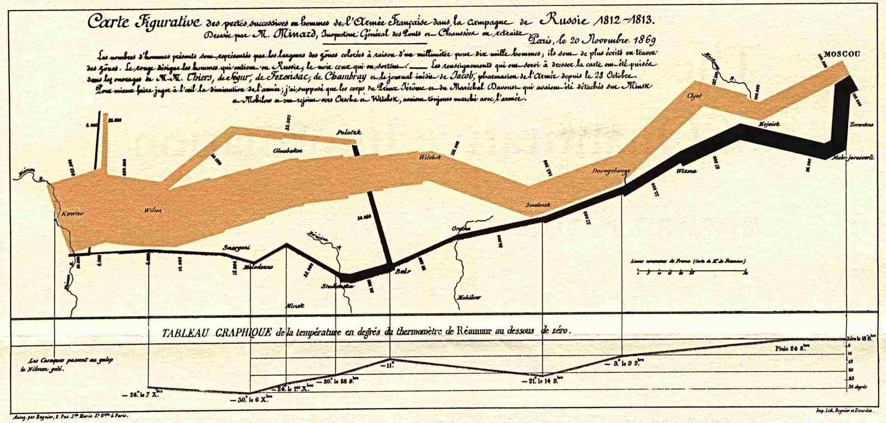
```

---

## Et berømt eksempel på deskriptiv statistikk

<iframe width="560" height="315" src="https://www.youtube.com/embed/jbkSRLYSojo" frameborder="0" allow="accelerometer; autoplay; encrypted-media; gyroscope; picture-in-picture" allowfullscreen></iframe>

---

## To hovedformål med deskriptiv statistikk

1. Bli kjent med et nytt datasett

--

2. Presentere resultat av analyser

---

## Målenivå

```{r, echo = FALSE, out.width = 700, fig.align = "center"}
knitr::include_graphics("fig-maleniva.png")
```

---

## Beskrivelse av sentraltendens

```{r, echo = FALSE, message = FALSE, fig.width = 10, fig.retina = 4}

data1 <- rnorm(500)
data2 <- rgamma(500, 2, 1)
data3 <- c((rnorm(250)-5), (rnorm(250)+5))

par(mfrow = c(2,2))
plot(data1, rep(0, 500),
     pch = "|",
     col = "#005790",
     xlab = "",
     ylab = "")
arrows(x0 = 0, y0 = .5, x1 = 0, y1 = .1, col = "#005790")
text(x = 0, y = .6, "Midten", pos = 3, cex = 2)
plot(data2, rep(0, 500),
     pch = "|",
     col = "#005790",
     xlab = "",
     ylab = "")
arrows(x0 = 2, y0 = .5, x1 = 2, y1 = .1)
text(x = 2, y = .6, "Midten?", pos = 3, cex = 2)
plot(data3, rep(0, 500),
     pch = "|",
     col = "#005790",
     xlab = "",
     ylab = "")
arrows(x0 = -5, y0 = .5, x1 = -5, y1 = .1)
text(x = -5, y = .6, "Midten?", pos = 3, cex = 2)

arrows(x0 = 5, y0 = .5, x1 = 5, y1 = .1)
text(x = 5, y = .6, "Midten?", pos = 3, cex = 2)

arrows(x0 = 0, y0 = .5, x1 = 0, y1 = .1)
text(x = 0, y = .6, "Midten?", pos = 3)


plot(faithful,
     pch = 20,
     xlab = "Varighet (min)",
     ylab = "Ventetid (min)",
     main = "Hvor er midten i dette datasettet?",
     col = "#005790",
     cex.main = 2,
     cex.lab = 1.5)

```

---

## Beskrivelse av sentraltendens

- Gjennomsnitt:

$$\overline X = \frac{1}{n}\sum_{i = 1}^n X_i$$

- Median:

$$\textrm{Den} \,\, \mathbf{midterste} \,\, \textrm{verdien}$$

- Typetall:

$$\textrm{Den} \,\, \mathbf{vanligste} \,\, \textrm{verdien}$$

- Hvorfor er median av og til å foretrekke foran gjennomsnitt selv for måledata? 
    - Medianen er midre følsom for (mer robust mot) ekstremverdier

---

## Illustrasjon

```{r, echo = FALSE, out.width = 800}
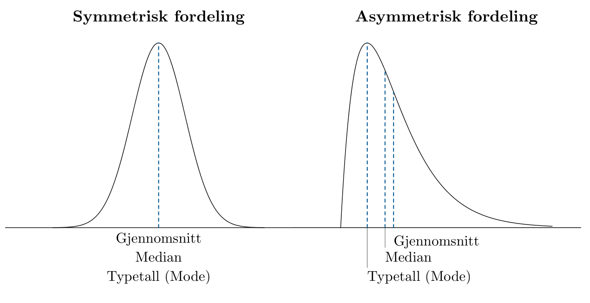
```

---

## Beskrivelse av sentraltensens

```{r, echo = FALSE, out.width = 700}

```

---

## R-verktøykassen

.pull-left[
```{r, eval = FALSE}
# Lese .csv-filer
library(readr)
read_csv()

# Sjekke strukturen til et 
# objekt, f.eks et datasett
str()

# Mål for sentraltendens
mean()     # Gj.snitt
median()   # Median
table()    # Telle opp

# Pakke som inneholder %>%
library(dplyr)

# Telle opp og finne maks.
table() %>% which.max
```
]

---

## Beskrivelse av spredning


```{r, echo = FALSE,  fig.width = 10, fig.height = 4, fig.retina = 4}
data1 <- rnorm(100)
data2 <- 3*rnorm(100)
data3 <- c(rnorm(95), 10, 25, 30, 100, 498)

par(mfrow = c(1, 3))
plot(data1, rep(0, 100),
     pch = "|",
     col = "#005790",
     xlab = "",
     ylab = "",
     xlim = c(-10, 10),
     cex.axis = 2)

plot(data2, rep(0, 100),
     pch = "|",
     col = "#005790",
     xlab = "",
     ylab = "",
     xlim = c(-10,10),
     cex.axis = 2)
plot(data3, rep(0, 100),
     pch = "|",
     col = "#005790",
     xlab = "",
     ylab = "",
     cex.axis = 2)
```

---

## Beskrivelse av spredning

- Standardavvik:

$$s = \sqrt{\frac{1}{n-1} \sum_{i=1}^n (X_i - \overline X)^2}$$

- Varians: $s^2$

- Prosentil: 
    - $p$-prosentilen er det tallet som har $p$% av verdiene under seg.
  
- Kvartiler:
    - 25-, 50-, og 75-prosentilene
    
- IQR
    - InterQuartile Range
    - Avstanden mellom 75- og 25-prosentilene
    
---

## Eksempel på bruk av kvantiler

Verdsettelsesdebatten på unoterte selskaper (ligningsverdi/markedsverdi)

```{r, echo = FALSE, out.width = 700, fig.align = "center"}
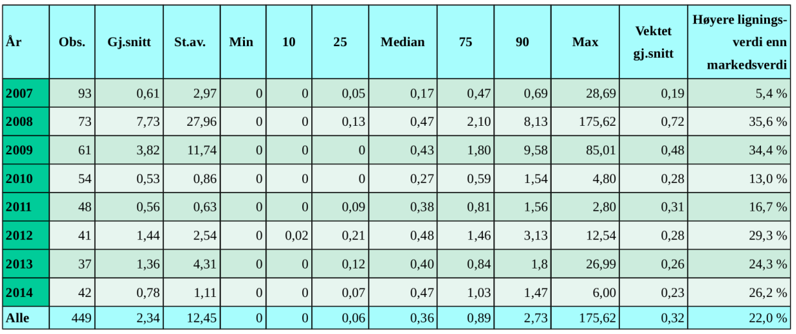
```

*Kilde: Masteroppgave av Gobel og Hestdal (2015)*

---

## Eksempel på boksplot 

Ligningsinntekter i Tippeligaen 2015

```{r, echo = FALSE, out.width = 700, fig.align = "center"}
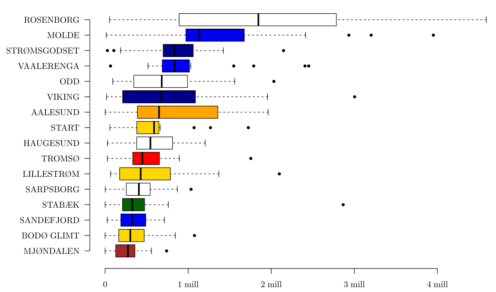
```

---

## R-verktøykassen

.pull-left[
```{r, eval = FALSE}
# Lese .csv-filer
library(readr)
read_csv()

# Sjekke strukturen til et 
# objekt, f.eks et datasett
str()

# Mål for sentraltendens
mean()     # Gj.snitt
median()   # Median
table()    # Telle opp

# Pakke som inneholder %>%
library(dplyr)

# Telle opp og finne maks.
table() %>% which.max

# Mål for spredning
sd()       # St.avvik
quantile() # Kvantiler
```
]

.pull-right[
```{r, eval = FALSE}
# Boksplott
library(ggplot2)
data %>% ggplot + 
  geom_boxplot(
    aes(x = gruppe,
        y = variabel))

# Søylediagram
data %>% ggplot + 
  geom_bar(aes(x = variabel))

# Histogram
data %>% ggplot +
  geom_histogram(
    aes(x = variabel))
```
]

---

## Beskrivelse av sammenhengen mellom to målevariabler

- Grafisk: Spredningsdiagram
- Numerisk: Korrelasjonskoeffisienten
    - Korrelasjonskoeffisienten, $r$, forteller oss hvor nær vi er en **lineær** sammenheng. 
    - $r$ varierer mellom $-1$ og $1$.
    - $r$ forteller oss om det er positiv eller negativ samvariasjon, men ikke stigningsforholdet. 
    - Formel:
    
    $$r = \frac{\sum_{i = 1}^n(X_i - \overline{X})(Y_i - \overline{Y})}{(n-1)S_XS_Y} = \frac{\textrm{Cov}(X,Y)}{S_XS_Y}$$

---

## Positiv og negativ korrelasjon

.pull-left[

$$r = 0.91$$

```{r, echo = FALSE, out.width = 700, fig.align = "center"}
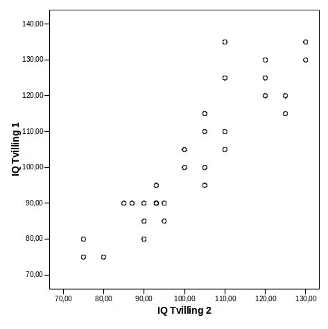
```

Positiv korrelasjon: IQ-skår for tvillinger.
]

.pull-right[

$$r = -0.70$$

```{r, echo = FALSE, out.width = 700, fig.align = "center"}
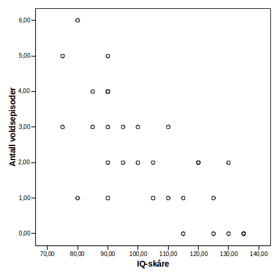
```

Negativ korrelasjon: IQ og voldsepisoder
]

---

## VIKTIG

Med $r=0$ kan det likevel være en sammenheng.

- Ukorrelerthet medfører *ikke* uavhengighet
- (Men **u**avhengighet medfører **u**korrelerthet)

.pull-left[

```{r, echo = FALSE, out.width = 700, fig.align = "center"}
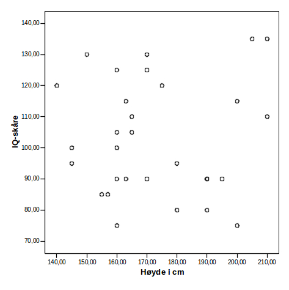
```

]

.pull-right[

```{r, echo = FALSE, out.width = 700, fig.align = "center"}
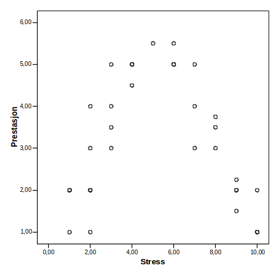
```

]
---


## R-verktøykassen

.pull-left[
```{r, eval = FALSE}
# Lese .csv-filer
library(readr)
read_csv()

# Sjekke strukturen til et 
# objekt, f.eks et datasett
str()

# Mål for sentraltendens
mean()     # Gj.snitt
median()   # Median
table()    # Telle opp

# Pakke som inneholder %>%
library(dplyr)

# Telle opp og finne maks.
table() %>% which.max

# Mål for spredning
sd()       # St.avvik
quantile() # Kvantiler
```
]

.pull-right[
```{r, eval = FALSE}
# Boksplott
library(ggplot2)
data %>% ggplot + 
  geom_boxplot(aes(x = gruppe,
                   y = var))

# Søylediagram
data %>% ggplot + 
  geom_bar(aes(x = variabel))

# Histogram
data %>% ggplot +
  geom_histogram(
    aes(x = variabel))

# Spredningsplott
data %>% ggplot +
  geom_point(
    aes(x = var1, y = var2))

# Korrelasjonskoeffisienten
cor(var1, var2)
```
]

---

## Noen skrekkeksempler

```{r, echo = FALSE, out.width = 300, fig.align = "center"}
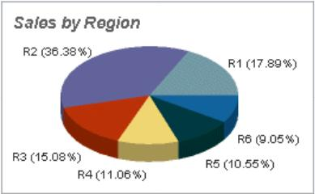
```

```{r, echo = FALSE, out.width = 500, fig.align = "center"}
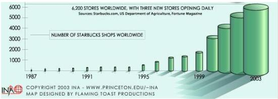
```

---

## Hva med denne?

```{r, echo = FALSE, out.width = 700, fig.align = "center"}

```

---

## ...eller...?

```{r, echo = FALSE, out.width = 500, fig.align = "center"}
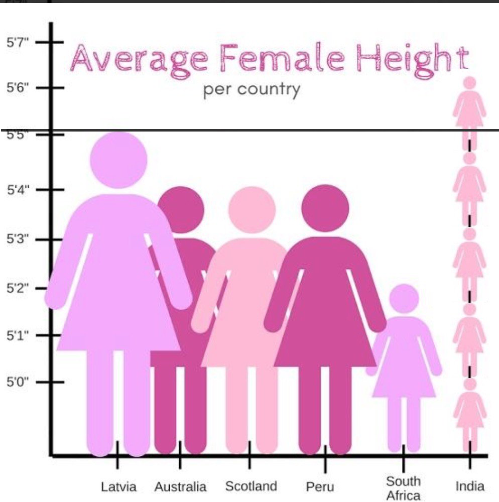
```

---

## Hva vil vi få frem?

```{r, echo = FALSE, out.width = 600, fig.align = "center"}
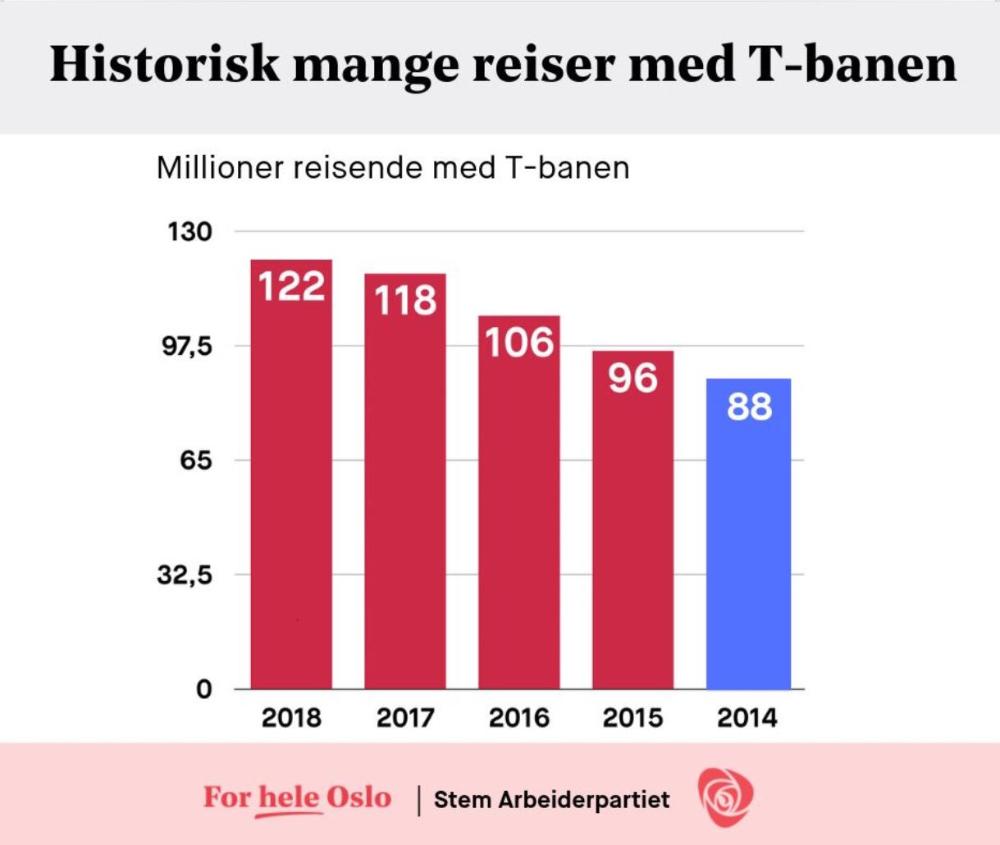
```

---

## Eksempel på strålende grafikk

Presentert av Morgenbaldet før stortingsvalget i 2017

```{r, echo = FALSE, out.width = 600, fig.align = "center"}
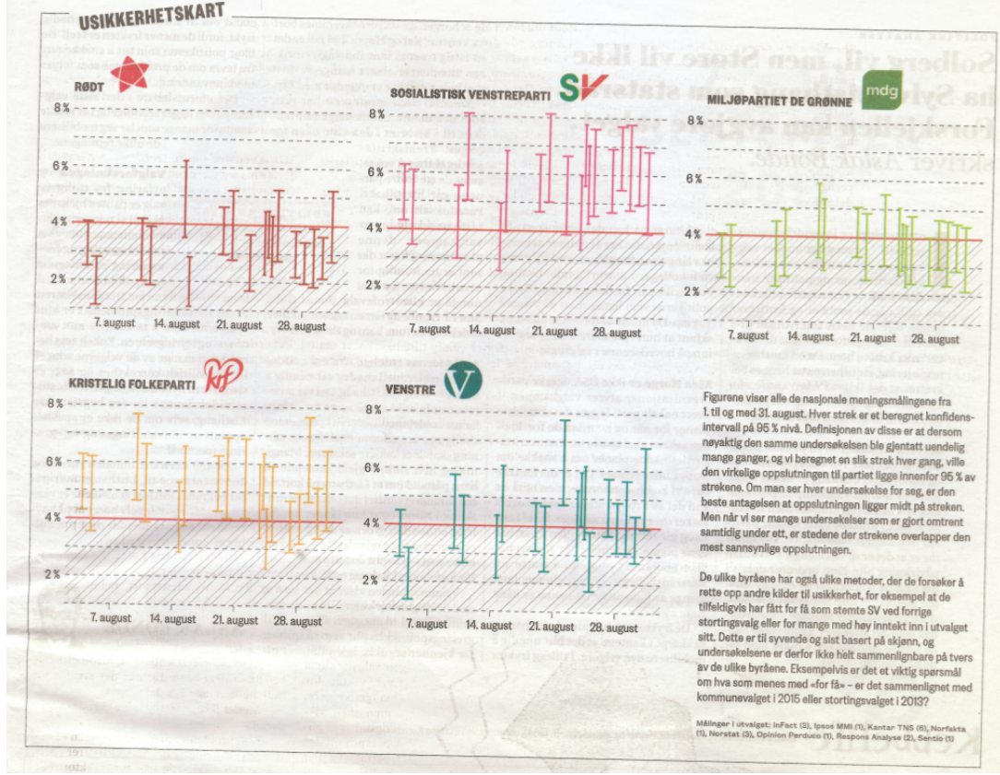
```

---

## Enda et eksempel

Fra Financial Times - 29. mars 2020

```{r, echo = FALSE, out.width = 750, fig.align = "center"}
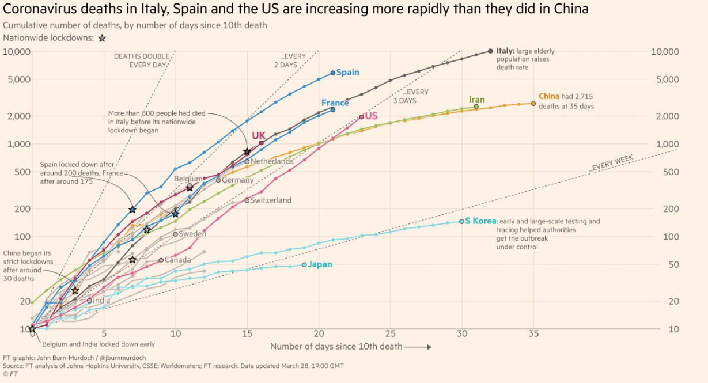
```

---

## Til slutt, råd om layout før hjemmeeksamen

- Ikke rapporter programutskrifter uberarbeidet
    - Lag dine egne tabeller eller bruk en passende R-funksjon
- Tabeller skal inneholde så få streker som mulig
    - 2--4 horisontale, ingen vertikale
- Tabeller og figurer skal være selvforklarende!
    - Merk grafer tydelig
    - Skriv variabelnavn mest mulig ut i tekst
    - Bruk undertekster til å oppgi utvalg, metode, variabeldefinisjoner, etc.
- Unngå tredimensjonal grafikk om det ikke er **strengt** nødvendig

---

class: center, middle, inverse

# Del II: UTVALG OG ESTIMERING

---

## Sannsynligetsmodell

* En sannsynlighetsmodell består av 
    + **Et utfallsrom** (diskret eller kontinuerlig)
    + **Sannsynligheter tilordnet utfall eller kombinasjoner av utfall**
        + Diskret utfallsrom: Summen av alle sannsynligheter = 1. Eks.: Terningkast, produktvalg.
        + Kontinuerlig utfallsrom: Areal under tetthetskurven = 1. Eks.: Dagsomsetning
* Stokastisk variabel
    + En funksjon (regel) $X(u)$ som tilordner en tallverdi, $x$, til ethvert utfall i en sannsynlighetsmodell.
    
---

## Sannsynlighetsfordeling

* En sannsynlighetsfordeling er
    + en oppramsing av de mulige verdiene til $X$ sammen med sannsynlighetene $P(X=x)$ [forenklet: $p(x)$] for å observere hver enkelt verdi $x$.
* En sannsynlighetsfordeling kan være 
    + Diskret (Kapittel 7)
        + Tegnes som søylediagram med punktsannsynligheter
    + Kontinuerlig (Kapittel 8)
        + Tegnes som tetthetsfunksjon
        + Når $X$ er kontinuerlig gir det bare mening å snakke om sannsynligheten for at $X$ skal ligge i et intervall

---

## Eksempel: Terning

Hva betyr det da at **X er antall øyne på en terning**?

- Vi har et *utfallsrom*:

```{r, echo = FALSE, fig.align = "center"}
knitr::include_graphics("fig-terning1.png", dpi = 200)
```

- Vi har en *stokastisk variabel* $X$, som altså er en funksjon fra $U$ til $\{1, 2, 3, 4, 5, 6\}$:

```{r, echo = FALSE, fig.align = "center"}
knitr::include_graphics("fig-terning2.png", dpi = 200)
```

- $X$ har en *sannsynlighetsfordeling*, som i dette tilfellet er kjent og enkel:

$$P(X=1) = P(X=2)=\cdots=P(X=6) = \frac{1}{6}.$$

---

## Eksempel: En laksemerd

**Aktuelle stokastiske variabler:** Temperaturer, antall fisk, antall døde fisk, lusemengde, etc...


```{r, echo = FALSE, fig.align = "center", out.width=800}
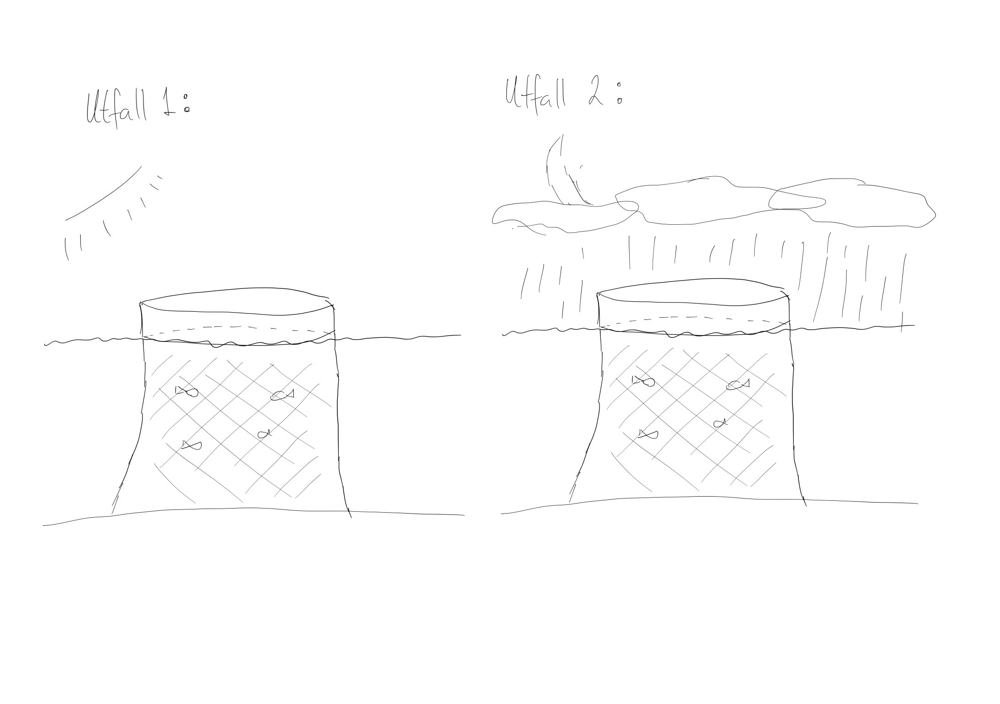
```

**Aktuelle stokastiske variabler:** Temperaturer, antall fisk, antall døde fisk, lusemengde, etc...

---

## En kjent fordeling

```{r, echo = FALSE, out.width = 550, fig.align = "center", fig.retina = 4}
x <- seq(-4, 4, length.out = 200)
y = dnorm(x)

plot(x, y, type = "l",
     bty = "n", axes = FALSE,
     xlab = "", ylab = "",
     lwd = 2)
grid(lwd = 1.5)
axis(1, at = -4:4, pos = 0, cex.axis = 1, col = "#00000070")
axis(2, pos = 0, at = c(0, 1), labels = c("", ""), cex.axis = 1, col = "#00000070")
```

---

## Samplingfordelinger 

* Når enkeltobservasjonene i et utvalg er stokastiske variable må også kjennetegn ved hele utvalget være stokastiske og ha en fordeling
* Slike fordelinger kaller vi samplingfordelinger
* Vi er spesielt interessert i 
    + Fordelingen til gjennomsnittet
    + Fordelingen til utvalgsvariansen
* siden disse gir oss informasjon om forventningen og variansen til hele populasjonen

---

## Forventning og varians til et gjennomsnitt

* Anta at $X_1, X_2, \ldots, X_n$ er **uavhengige** stokastiske variable med forventning $\mu$ og varians $\sigma^2$ (*ikke nødvendigvis normalfordelt!*)
* Vi regner ut gjennomsnittet i et utvalg av størelse $n$
* Ved å bruke regnereglene for forventning og varians, finner vi at
$$\textrm{E}\left(\overline{X}\right) = \mu, \qquad \textrm{Var}\left(\overline{X}\right) = \frac{\sigma^2}{n} \Rightarrow \sigma\left(\overline X\right) = \frac{\sigma}{\sqrt{n}}$$
* Altså: Forventet utvalgsfeil (presisjonen) til gjennomsnittet påvirkes av størrelsen på utvalget

---


## Repetisjon: Forventning og varians

* Definisjon av forventning
$$\textrm{E}(X) = \sum_{\textrm{alle } x} x\cdot p(x)$$
* Definisjon av varians

\begin{align*}
\textrm{Var}(X) &= \textrm{E}(X - \textrm{E}(X))^2 \\
                &= \textrm{E}(X^2) - \left(\textrm{E}(X)\right)^2
\end{align*}

- Det forventede kvadratavviket fra forventningen
- Standardavviket $\sigma$ er kvadratroten til variansen slik at $\sigma^2 = \textrm{Var}(X)$

* Definisjon av kovarians

\begin{align*}
\textrm{Cov}(X,Y) &= \textrm{E}\left(X - \textrm{E}(X)\right)\left(Y - \textrm{E}(Y)\right) \\ 
                  &= \textrm{E}(XY) - \textrm{E}(X)\textrm{E}(Y) 
\end{align*}

---

## Regneregler for forventning


-  $\textrm{E}(k)=k$                                                                            
-  $\textrm{E}(k+X) = k + \textrm{E}(X)$ der $k$ er en konstant                                 
-  $\textrm{E}(kX) = k\cdot\textrm{E}(X)$                                                       
-  $\textrm{E}(X+Y) = \textrm{E}(X) + \textrm{E}(Y)$                                            
-  $\textrm{E}(X\cdot Y) = \textrm{E}(X)\cdot\textrm{E}(Y)$  hvis uavhengige                    
-  $\textrm{E}(X\cdot Y) = \textrm{E}(X)\cdot\textrm{E}(Y) + \textrm{Cov}(X,Y)$ hvis avhengige  
-  $\textrm{E}\big(\phi(X)\big) = \sum_{\textrm{alle } x}\phi(x)\cdot p(x)$                     

---

## Regneregler for varians

-  $\textrm{Var}(X) = \textrm{E}(X^2) - (EX)^2$                                                 
-  $\textrm{Var}(k) = 0$ der $k$ er en konstant                                                 
-  $\textrm{Var}(k+X) = \textrm{Var}(X)$                                                        
-  $\textrm{Var}(kX) = k^2\cdot \textrm{Var}(X)$                                                
-  $\textrm{Var}(X \pm Y) = \textrm{Var}(X) + \textrm{Var}(Y)$  hvis $X$ og $Y$ er uavhengige   
-  $\textrm{Var}(X \pm Y) = \textrm{Var}(X) + \textrm{Var}(Y) \pm 2\textrm{Cov}(X,Y)$ hvis $X$ og $Y$ er avhengige                                                                 
---

## Regneregler for kovarians

- $\textrm{Cov}(X,Y) = \textrm{Cov}(Y,X)$                       
- $\textrm{Cov} = 0$ hvis $X$ og $Y$ er uavhengige              
- $\textrm{Cov}(a,b) = 0$ der $a$ og $b$ er konstanter          
- $\textrm{Cov}(X,a) = 0$                                       
- $\textrm{Cov}(X,X) = \textrm{Var}(X)$                         
- $\textrm{Cov}(X+a,Y+b) = \textrm{Cov}(X,Y)$                   
- $\textrm{Cov}(aX,bY) = ab\cdot\textrm{Cov}(x,Y)$              
- $\textrm{Cov}(X+Y,Z) = \textrm{Cov}(X,Z) + \textrm{Cov}(Y,Z)$ 

---

## Fordelingen til et gjennomsnitt

* Dersom $X$ er normalfordelt er $\overline X$ normalfordelt
    + Lineærkombinasjoner av normalfordelte variable er normalfordelte
    + I eksperimentet vårt regnet vi ut gjennomsnitt av utalg på 100 observasjoner fra en normalfordeling med forventning $\mu = 0$ og varians $\sigma^2 = 1$. 
    + Altså var gjennomsnittene vi trakk normalfordelt med forventningsverdi $\mu = 0$ og varians $\sigma^2/n = 1/100$.
 
* Ofte kjenner vi ikke den den eksakte fordelingen til $X$
    + Hvilken fordeling har gjennomsnittet dersom X ikke er normalfordelt?
    + Fordelingen til gjennomsnittet vil **for alle praktiske formål** nærme seg normalfordelingen når $n$ øker.
    + Følger av **sentralgrenseteoremet**.
    
---

## Sentralgrenseteoremet

* Mange problemer kan studeres ved å uttrykke en stokastisk variabel som en sum av andre stokastiske variable
    + **samlet** tid for å gjennomføre $n$ trinn i en prosess
    + **total** avkastning etter $n$ perioder
    + **samlet** etterspørsel over $n$ perioder
    + **samlet** etterspørsel etter en vare under varens (stokastiske) leveringstid
* Problemstillingen kan uttrykkes
$$S_n = X_1 + X_2 +\ldots+X_n$$
* Hva kan vi si om $S_n$ på grunnlag av kunnskap om $X$’ene?

---

## Antagelser om X'ene

* Mulige antagelser om $X$’ene er
    + uavhengighet
    + samme fordeling
    + bestemt type fordeling
* Jo mer spesifikke antagelser, desto mer kan sies om $S_n$
* Helt generelt gjelder
$$\textrm{E}(S_n) = \textrm{E}(X_1) + \textrm{E}(X_2) + \cdots + \textrm{E}(X_n)$$
 og
$$\textrm{Var}(S_n) = \sum_{\textrm{alle } i} \textrm{Var}(X_i) + \sum_{i\neq j} \textrm{Cov}(X_i ,X_j)$$

---

## Antagelser om X'ene

* Dersom $X$'ene er identisk fordelte er
$$\textrm{E}(S_n) = \textrm{E}(X) + \textrm{E}(X) + \cdots + \textrm{E}(X) = n\cdot \textrm{E}(X)$$
* Dersom $X$'ene i tillegg er uavhengige (*iid*) gjelder
$$\textrm{Var}(S_n) = n\cdot\textrm{Var}(X)$$
* Dersom $n$ i tillegg er stor (og $\textrm{E}(X)$ og $\textrm{Var}(X)$ eksisterer) gjelder
    + $S_n$ er tilnærmet normalfordelt (eksakt når $n\rightarrow\infty$)
    + Dette kalles **sentralgrensesetningen** og er et av statistikkfagets viktigste resultater

---

## En illustrasjon

**På biblioteket:** *Probably not: future prediction using probability and statistical inference.* Lawrence N. Dworsky, 2008.

```{r, echo = FALSE}
N <- c(1, 2, 20)   # antall terningkast pr. eksperiment
k <- 5000          # antall eksperimenter
```

Antall terningkast pr. eksperiment $N =$ `r N[1]`, `r N[2]` og `r N[3]`

Antall eksperimenter $k =$ `r k`

```{r, echo = FALSE, fig.width = 10, fig.height = 5, fig.align = "center"}
par(mfrow = c(1, length(N)))
for(i in 1:length(N)) {
  x <- rowMeans(matrix(sample(1:6, size = k*N[i], replace = TRUE), ncol = N[i]))
  if(i == 1) {
    breaks <- c(.5, 1.5, 2.5, 3.5, 4.5, 5.5, 6.5)
  } else if(i == 2){
    breaks <- seq(1, 6, length.out = 12)
  } else if(i == 3) {
    breaks <- seq(1, 6, length.out = 25)
  }
  
  hist(x, breaks = breaks, main = paste("N =", N[i]), ylab = "", xlab = "",
       col = "grey30", border = "white")
}
```

---

## Illustrasjon vha nedbørsdata


```{r, echo = FALSE, message = FALSE, warning = FALSE, fig.align = "center"}
library(dplyr)
library(readr)
library(lubridate)
library(ggplot2)

florida <- read_table("florida.txt", na = ".") %>%
   mutate(date = dmy(Date)) %>%
   select(station_number = St.no,
          date,
          percip = RR) %>%
   mutate(year = year(date),
          month = month(date))


florida %>%
   select(percip) %>%
   pull %>%
   hist(breaks = -1:100,
        xlab = "",
        ylab = "Andel",
        main = "Nedbør på Florida målestasjon (mm) 1983 - 2018",
        col = "#00000070",
        border = "white",
        freq = FALSE,
        xlim = c(0,60))
text(30, 0.025, "Nedpør per dag", col = "#00000070")

```


---

## Illustrasjon vha nedbørsdata


```{r, echo = FALSE, message = FALSE,  warning = FALSE, fig.align = "center"}

florida %>%
    select(percip) %>%
    pull %>%
    hist(breaks = -1:100,
         xlab = "",
         ylab = "Andel",
         main = "Nedbør på Florida målestasjon (mm) 1983 - 2018",
         col = "#00000070",
         border = "white",
         freq = FALSE,
         xlim = c(0,60))
text(30, 0.025, "Nedpør per dag", col = "#00000070")

florida %>%
    group_by(month, year) %>%
    summarise(mean = mean(percip, na.rm = TRUE)) %>%
    select(mean) %>%
    pull %>%
    hist(add = TRUE,
         freq = FALSE,
         border = "#FFFFFF50",
         col = "#CD333370",
         breaks = 13)
text(30, 0.06, "Gjennomsnlittlig daglig nedbør per måned", col = "#CD333370")

```

---

## Illustrasjon vha nedbørsdata


```{r, echo = FALSE, message = FALSE,  warning = FALSE, fig.align = "center"}
florida %>%
    select(percip) %>%
    pull %>%
    hist(breaks = -1:100,
         xlab = "",
         ylab = "Andel",
         main = "Nedbør på Florida målestasjon (mm) 1983 - 2018",
         col = "#00000070",
         border = "white",
         freq = FALSE,
         xlim = c(0,60))
text(30, 0.025, "Nedpør per dag", col = "#00000070")

florida %>%
    group_by(month, year) %>%
    summarise(mean = mean(percip, na.rm = TRUE)) %>%
    select(mean) %>%
    pull %>%
    hist(add = TRUE,
         freq = FALSE,
         border = "#FFFFFF50",
         col = "#CD333370",
         breaks = 13)
text(30, 0.06, "Gjennomsnlittlig daglig nedbør per måned", col = "#CD333370")

florida %>%
    group_by(year) %>%
    summarise(mean = mean(percip, na.rm = TRUE)) %>%
    select(mean) %>%
    pull %>%
    hist(add = TRUE,
         freq = FALSE,
         border = "#FFFFFF50",
         col = "#483D8B70",
         breaks = 5)
text(27, 0.12, "Gjennomsnlittlig daglig nedbør per år", col = "#483D8B90")

```

---

## Samplingfordelingen til en andel

- Gjennomsnitt er bare meningsfylt for målevariabler
- For nominale variabler er vi ofte interessert i den sanne **andelen** i en populasjon
    - Andelen av en kundemasse som kjøper «vårt» produkt
    - Andelen feilvare i en produksjonsprosess

*Eksempel: hvor stor andel av befolkningen vil stemme på et bestemt parti?*

- Andelen i et utvalg kan vi betrakte som resultatet av en binomisk forsøksrekke
    - Observasjonene er tilfeldige trekninger fra populasjonen
    - Utfallene er uavhengige (**!**)
    - Hver observasjon klassifiseres som «suksess» eller «fiasko» (f.eks.: **SSSSFFFFFF**)
    - Andel suksesser i vårt utvalg er stokastisk, men sannsynligheten for suksess, $p$, er den samme i hver trekning
- Vi ønsker å finne fordelingen til den observerte andelen

---

## Samplingfordelingen til en andel

- La utfallet av hver trekning være representert av en indikatorvariabel $I_j$ der $j = 1,2,3,\ldots$
    - $I_j = 1$ hvis suksess, $I_j=0$ ellers (altså fiasko)  
- Prosessen $\{I_j: j=1,2,3,\ldots\}$ er en binomisk forsøksrekke fordi

|    |                                                                   |
|----|-------------------------------------------------------------------|
| 1. | $I_j$ bare kan anta to verdier                                  |
| 2. | Sannsynligheten for å observere $I_j=1$ er $p$ for alle $j$ |
| 3. | $I_j$ og $I_k$ er uavhengige for alle $j$ og $k$          |


Forventning og varians til hver enkelt observasjon er
$$\textrm{E}(I_j) = p\cdot 1 + (1-p)\cdot 0 = p$$
$$\textrm{Var}(I_j) = \textrm{E}(I_j^2) - (\textrm{E}I_j)^2 = \textrm{E}(I_j) - (\textrm{E}I_j)^2 = p - p^2 = p(1-p)$$

---

## Samplingfordelingen til en andel

- Vi er interessert i antall suksesser i et utvalg på $n$
$$X_n = \sum_{j=1}^n I_j = I_1 + I_2 + \cdots + I_n$$
- Regnereglene for summer av stokastiske variable gir nå
$$\textrm{E}X_n = np$$
$$\textrm{Var}(X_n) = np(1-p)$$
- Vi vet at $X_n$ er binomisk fordelt $(n,p)$ fordi antall suksesser i en binomisk forsøksrekke er binomisk fordelt

---

## Samplingfordelingen til en andel

- Vi kan nå regne ut forventning og varians for *andelen* suksesser, $X_n/n$:
$$\textrm{E}\left(\frac{X_n}{n}\right) = \frac{\textrm{E}(X_n)}{n} = \frac{np}{n} = p$$
$$\textrm{Var}\left(\frac{X_n}{n}\right) = \frac{\textrm{Var}(X_n)}{n^2} = \frac{np(1-p)}{n^2} = \frac{p(1-p)}{n}$$

---

## Normaltilnærming

- Antall suksesser, $X_n$, er binomisk fordelt
- Men den observerte andelen kan skrives som et gjennomsnitt:
$$\widehat p = \frac{X_n}{n} = \frac{1}{n}\sum_{j=1}^n I_j.$$
- Altså har vi følgende tilnærming fra sentralgrenseteoremet:
$$\frac{X_n}{n} = \widehat p \sim N\left(p, \frac{p(1-p)}{n}\right).$$

- **Dette er (tilnærmet) samplingfordelingen til en observert andel!**
    - Tommelfingerregel: Tilnærmingen er god dersom $np>5$ og $n(1-p)>5$.

---

## Eksempel

Anta at den *sanne* fordelingen av velgere på partier i Norge akkurat nå er:

|        |          |
|--------|----------|
| Rødt   | 4.6%     |
| SV     | 7.2%     |
| AP     | 27.9%    |
| SP     | 12.2%    |
| MDG    | 3.3%     |
| V      | 3.6%     |
| KrF    | 3%       |
| H      | 24.2%    |
| FrP    | 12%      |
| Andre  | 2%       |

---

## Eksempel

Anta at vi spør et representativt utvalg på $n = 1000$ personer om foretrukket parti. Hva vil da være *fordelingen* til de *observerte* andelene? 

--

```{r, echo = FALSE, fig.height = 6, fig.width = 10, fig.retina = 4, fig.align = "center"}

x <- seq(-.2, .5, length.out = 1000)
n <- 1000
textlevel <- 70

p_R <- 0.046
p_SV <- 0.072
p_AP <- 0.279
p_SP <- 0.122
p_MDG <- .033
p_V <- .036
p_KRF <- .03
p_H <- .242
p_FRP <- 0.12

f_R <- dnorm(x, mean = p_R, sd = sqrt(p_R*(1-p_R)/n))
f_SV <- dnorm(x, mean = p_SV, sd = sqrt(p_SV*(1-p_SV)/n))
f_AP <- dnorm(x, mean = p_AP, sd = sqrt(p_AP*(1-p_AP)/n))
f_SP <- dnorm(x, mean = p_SP, sd = sqrt(p_SP*(1-p_SP)/n))
f_MDG <- dnorm(x, mean = p_MDG, sd = sqrt(p_MDG*(1-p_MDG)/n))
f_V <- dnorm(x, mean = p_V, sd = sqrt(p_V*(1-p_V)/n))
f_KRF <- dnorm(x, mean = p_KRF, sd = sqrt(p_KRF*(1-p_KRF)/n))
f_H <- dnorm(x, mean = p_H, sd = sqrt(p_H*(1-p_H)/n))
f_FRP <- dnorm(x, mean = p_FRP, sd = sqrt(p_FRP*(1-p_FRP)/n))

plot(x, f_R, 
     type = "l",
     bty = "l",
     ylab = "",
     xlab = "",
     ylim = c(0, 90),
     xlim = c(0, 0.35))

text(p_R, textlevel, "R")

lines(x, f_SV)
text(p_SV, textlevel-15, "SV")

lines(x, f_AP)
text(p_AP, textlevel-30, "AP")

lines(x, f_SP)
text(p_SP, textlevel-25, "SP")

lines(x, f_MDG)
text(p_MDG, textlevel+5, "MDG")

lines(x, f_V)
text(p_V, textlevel+10, "V")

lines(x, f_KRF)
text(p_KRF, textlevel+15, "KRF")

lines(x, f_H)
text(p_H, textlevel-30, "H")

lines(x, f_FRP)
text(p_FRP, textlevel-18, "FRP")
```

## Eksempel

Anta at vi spør et representativt utvalg på $n = 1000$ personer om foretrukket parti. Hva vil da være *fordelingen* til de *observerte* andelene? 

\pause

```{r, echo = FALSE, fig.height = 6}

x <- seq(-.2, .5, length.out = 1000)
n <- 1000
textlevel <- 70

p_R <- 0.046
p_SV <- 0.072
p_AP <- 0.279
p_SP <- 0.122
p_MDG <- .033
p_V <- .036
p_KRF <- .03
p_H <- .242
p_FRP <- 0.12

f_R <- dnorm(x, mean = p_R, sd = sqrt(p_R*(1-p_R)/n))
f_SV <- dnorm(x, mean = p_SV, sd = sqrt(p_SV*(1-p_SV)/n))
f_AP <- dnorm(x, mean = p_AP, sd = sqrt(p_AP*(1-p_AP)/n))
f_SP <- dnorm(x, mean = p_SP, sd = sqrt(p_SP*(1-p_SP)/n))
f_MDG <- dnorm(x, mean = p_MDG, sd = sqrt(p_MDG*(1-p_MDG)/n))
f_V <- dnorm(x, mean = p_V, sd = sqrt(p_V*(1-p_V)/n))
f_KRF <- dnorm(x, mean = p_KRF, sd = sqrt(p_KRF*(1-p_KRF)/n))
f_H <- dnorm(x, mean = p_H, sd = sqrt(p_H*(1-p_H)/n))
f_FRP <- dnorm(x, mean = p_FRP, sd = sqrt(p_FRP*(1-p_FRP)/n))

plot(x, f_R, 
     type = "l",
     bty = "l",
     ylab = "",
     xlab = "",
     ylim = c(0, 90),
     xlim = c(0, 0.35))

text(p_R, textlevel, "R")

lines(x, f_SV)
text(p_SV, textlevel-15, "SV")

lines(x, f_AP)
text(p_AP, textlevel-30, "AP")

lines(x, f_SP)
text(p_SP, textlevel-25, "SP")

lines(x, f_MDG)
text(p_MDG, textlevel+5, "MDG")

lines(x, f_V)
text(p_V, textlevel+10, "V")

lines(x, f_KRF)
text(p_KRF, textlevel+15, "KRF")

lines(x, f_H)
text(p_H, textlevel-30, "H")

lines(x, f_FRP)
text(p_FRP, textlevel-18, "FRP")
```

---

## Inferens (slutningsstatistikk)

Hva kan vi slutte om populasjonens parametre basert på det vi observerer i utvalget?

```{r, echo = F, warning = F, fig.align = "center", fig.height = 4, fig.width = 10}
library(dplyr)
library(ggplot2)

set.seed(5)
n_pop <- 100
n_utv <- 10
shift <- 2.5

farger <- c("indianred", "navyblue", "forestgreen")

pop <- tibble(x = runif(n_pop),
              y = runif(n_pop),
              farge = sample(farger,
                             n_pop,
                             replace = T,
                             prob = c(0.2, 0.5, 0.3)),
              utv = sample(c(T, F),
                           n_pop,
                           replace = T,
                           prob = c(n_utv/n_pop, 1 - n_utv/n_pop)))

utv <- pop %>%
  filter(utv) %>%
  mutate(x = x + shift)

pop %>% ggplot +
  geom_point(aes(x = x, y = y),
             color = pop$farge,
             size = 2) +
  geom_point(aes(x = x, y = y),
             color = utv$farge,
             size = 2,
             data = utv) +
  annotate("text", x = .5, y = 1.2, label = "Populasjon", size = 5) +
  annotate("text", x = .5 + shift, y = 1.2, label = "Utvalg", size = 5) +
  annotate("text", x = 1.8, y = 0.8, label = paste("--- Trekning --->"), size = 5) +
  annotate("text", x = 1.8, y = 0.2, label = "<--- Slutning ---", size = 5) +
  theme_void()

```

- En *ukjent* parameter: Andel røde prikker i populasjonen, $p = 20$%
- En *observator*: Andel røde prikker i utvalget, $p \approx \widehat p = `r utv %>% filter(farge == "indianred") %>% nrow(.)`/`r nrow(utv)` = `r format(utv %>% filter(farge == "indianred") %>% nrow(.)/nrow(utv), digits = 3)`$

---


## Estimering, noen begreper

- En estimator er en “regel” for bruk av observasjoner til å gjette verdien på ukjente parametre i en modell
- Siden de observasjonene vi bruker er realisasjoner av stokastiske variabler vil estimatoren i seg selv være en stokastisk variabel
- Kan hende finnes flere alternative estimatorer for en og samme parameter. Hvilken bør velges?

---


## Estimering, noen begreper

- Vi ønsker at estimatoren skal ha en forventning som ligger nær den sanne verdien, og vi ønsker at estimatoren skal ha lav varians/standardavvik
- Hvis vi lar $\widehat\theta$ være en estimator for $\theta$ så sier vi at estimatoren er forventingsrett dersom $\textrm{E}\widehat\theta = \theta$
- Blant mulige forventingsrette estimatorer vil vi velge den med minst varians; den mest *effektive*
- Vi kan være villige til å kompromisse på forventningsretthet hvis en forventningsskjev estimator kan redusere variansen/standardavviket
- Noen ganger kan det være vanskelig å bedømme en estimators egenskaper i små utvalg. Da drøfter vi gjerne egenskapene når " $n \rightarrow \infty$ "
- Vi sier at en estimator er konsistent dersom forventet forskjell mellom estimatet og den sanne parameterverdien kan gjøres så liten en vil ved å øke utvalgsstørrelsen tilstrekkelig
    - Merk: En estimator kan være konsistent uten å være forventningsrett og forventningsrett uten å være konsistent!

---

class: middle

```{r, echo = FALSE, out.width=800}
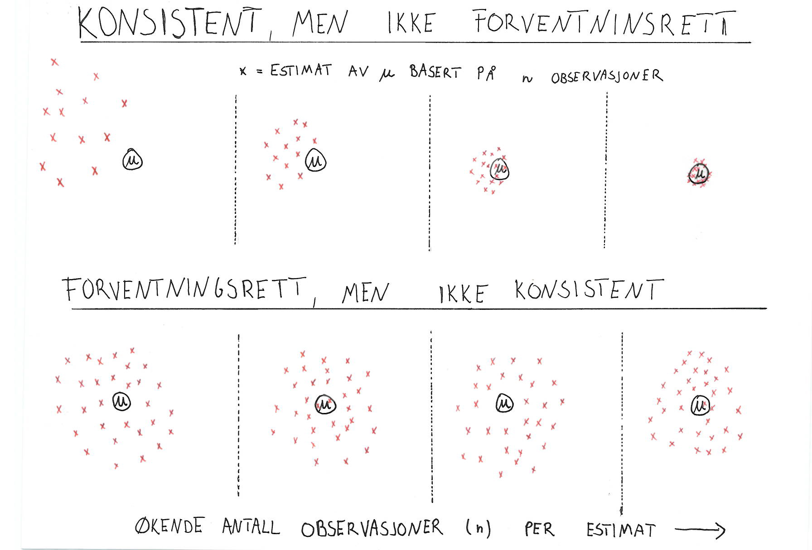
```

---

class: middle

## Korrelasjonsquiz

Hvilket diagram hører til følgende korrelasjonskoeffisienter?

$r = -0.98, r=0.86, r = 0.95, r = -0.96, r = -0.40$

```{r, echo = FALSE, out.width=800}
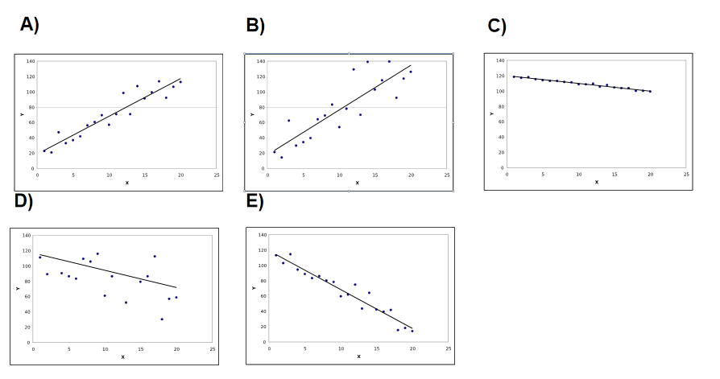
```


