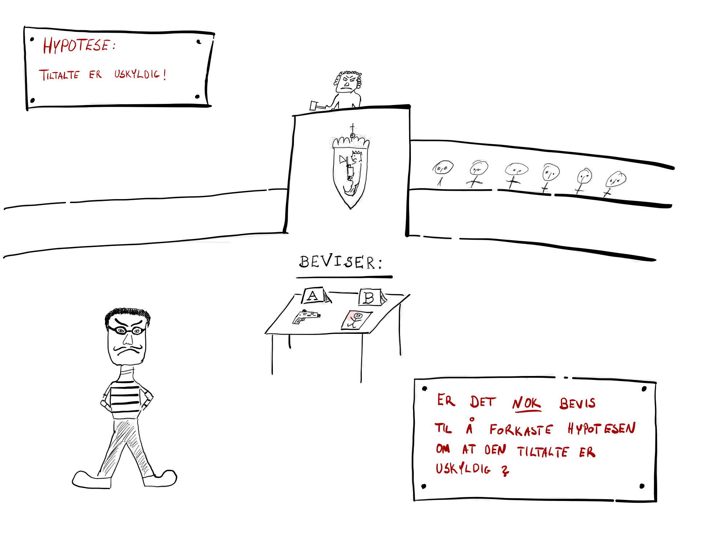
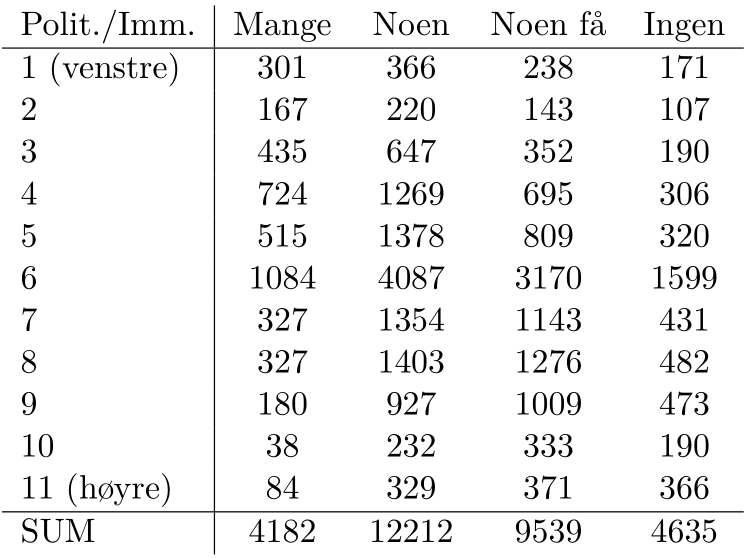
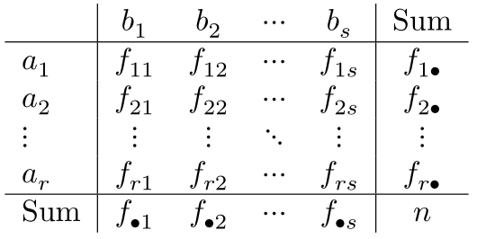

class: center, middle, inverse

# Del I: GENERELT OM HYPOTESETESTING

---

## Hypotesetesting

- I vitenskapen finner vi ut av mange ting ved å sette opp og teste hypoteser.
- Et klassisk verk om dette er Karl Poppers *The  Logic of Scientific Discovery*
- I statistikken har vi et rammerverk for hypotesetesting som er mye (for mye?) brukt i empirisk/kvantitativ forskning.
- En ganske god analogi til hypotesetesting er en **rettsak**.

---

## Rettsak

```{r, echo = FALSE, out.width = 700, fig.align = "center", fig.align='center'}

```

---

## Hypotesetesting

- Statistisk hypotesetesting gir oss et presist rammeverk til å definere nødvendige størrelser og begreper matematisk.

- La oss for eksempel anta at en stokastisk variabel er normalfordelt har varians $\sigma^2 = 2$. Dette er vi (foreløpig) **helt sikre på**. 
- Vi kjenner ikke forventningsverdien til $X$, men har en hypotese om at den er lik null, dvs $E(X) = \mu = 0$.

--

- **Vi er bombesikre på:**
    - ... at $X$ er normalfordelt.
    - ... at variansen $\sigma^2$ til $X$ er eksakt lik 2.

- **Vi er usikre på:**
    - ... hva forventningsverdien $\mu$ til $X$ er.
    
- **Men vi har en hypotese om:**
    - ... at $\mu = 0$.

---

## Hypotesetesting

Sagt med andre ord: vår hypotese er at tetthetsfunksjonen til $X$ ser slik ut:

```{r, echo = F, message = FALSE, fig.width = 10, fig.height = 6, fig.retina = 4, fig.align='center'}

library(dplyr)
library(ggplot2)

density_plot <- tibble(x0 = seq(-7, 7, length.out = 500)) %>% 
  mutate(f = dnorm(x0, mean = 0, sd = sqrt(2))) %>% 
  ggplot +
  geom_line(aes(x0, f)) +
  xlab("") +
  ylab("") +
  theme_classic()

density_plot
```
---

## Hypotesetesting

- Hvordan skal vi gå frem for å prøve å motbevise nullhypotesen om at $\mu = E(X) = 0$?
    - Jo, vi må observere *data*: $X_1, \ldots, X_n$.
- Stemmer de overens med nullhypotesen?
- Eller kan vi bruke observasjonene til å **forkaste** nullhypotesen, og heller tro at forventningsverdien til fordelingen må være forskjellig fra null?

Logikken bak hypotesetesting:

1. Vi setter opp en nullhypotese.
2. Vi gjør observasjoner.
3. Dersom observasjonene er *veldig overraskende*/*usannsynlige* under nullhypotesen, da tror vi ikke lenger på den, og forkaster den.

---

## La oss formalisere dette

- La $X$ være en stokastisk varabel med forvetningsverdi $\mu$.
- Vi vet at gjennomsnittet $\overline X$ er en forventningsrett og konsistent estimator for $\mu$. 
- En rimelig tanke er at at dersom $\overline X$ er langt fra en bestemt verdi $\mu_0$, så $\mu_0$ neppe den sanne forventningsverdien til $X$.
- Fra sist modul:
    - Dersom $X$ er normalfordelt med forventning $\mu_0$ og varians $\sigma^2$

\begin{align*}
& \Rightarrow \overline X \sim \mathcal{N} \left(\mu_0, \frac{\sigma^2}{n}\right)\\
& \Rightarrow Z = \frac{\overline X - \mu_0}{\sigma/\sqrt{n}} \sim \mathcal{N}(0,1).
\end{align*}

- $Z$ er en *testobservator* for følgende hypotesetest:
$$H_0: \mu = \mu_0 \textrm{  mot  } H_1: \mu \neq \mu_0$$

---

## Hypotesetesting

- Med andre ord: dersom nullhypotesen er *sann*, vil $Z$ være en trekning fra en standard normalfordeling.
- Forkastningsområde ved $\alpha = 5\%$ signifikansnivå:


```{r, echo = F, fig.width = 8, fig.height = 6, fig.retina = 4, fig.align='center'}
plot <- tibble(x0 = seq(-4, 4, length.out = 500)) %>% 
  mutate(f = dnorm(x0, mean = 0, sd = 1)) %>% 
  ggplot +
  geom_line(aes(x0, f)) +
  xlab("") +
  ylab("") +
  geom_segment(aes(x = -1.96, y = 0, xend = -1.96, yend = dnorm(-1.96)), linetype = 3) +
  geom_segment(aes(x = -4, y = 0, xend = -1.96, yend = 0), linetype = 3) +
  stat_function(fun = dnorm, 
                xlim = c(-4,-1.96),
                alpha = .3,
                geom = "area") +
  geom_segment(aes(x = 1.96, y = 0, xend = 1.96, yend = dnorm(-1.96)), linetype = 3) +
  geom_segment(aes(x = 4, y = 0, xend = 1.96, yend = 0), linetype = 3) +
  stat_function(fun = dnorm, 
                xlim = c(1.96, 4),
                alpha = .3,
                geom = "area") +
  theme_classic() 

plot
  
```

---

## To problemer

Husk at vi gjorde to veldig spesifikke antakelser før vi begynte på denne historien:

1. Vi antok at $\textrm{Var}(V) = \sigma^2 = 2$.
2. Vi antok at $X$ var normalfordelt.

**MEN: i hvilket univers er dette realistiske antakelser?**
 
--

**Jo, i** 
```{r, echo = FALSE, out.width = 100, fig.align = "center", fig.align='center'}

``` 
**-universet!**

Vi har to problemer som vi må fikse før vi kan bruke dette i praksis:

1. Det er ikke realistisk å **vite** at variansen $\textrm{Var}(X) = \sigma^2$ har en bestemt verdi.
2. Det er ikke realistisk å **vite** at $X$ er eksakt normalfordelt.

---

## Problem 1

- På samme måte som at $\overline X$ er en konsistent og forventningsrett estimator for $\mu$, er 
$$s^2 = \frac{1}{n-1}\sum_{i=1}^n (X_i - \overline X)^2$$ 
    en konsistent og forventningsrett estimator for $\sigma^2$.
- Altså er
$$Z = \frac{\overline X - \mu_0}{\sigma/\sqrt{n}} \approx \frac{\overline X - \mu_0}{s/\sqrt{n}} = T.$$
- Testobservatoren $T$ er $t$-fordelt med $n-1$ frihetsgader.
- Dette resultatet viser vi ikke, men konsekvensen er at vi må gå inn i $t$-tabellen for å finne kritisk verdi (forkastningsområdet) til testen vår.

---

## Problem 2

- Selv om $X$ ikke er normalfordelt, vet vi fra sentralgrenseteoremet at $\overline X$ uansett er omtrent normalfordelt.
- Altså vil $Z$ og $T$ være *omtrent* normal- og $t$-fordelt under nullhypotesen dersom $n$ er noenlunde stor, *uansett* hvilken fordeling $X$ måtte ha i utgangspunktet.

---

class: center, middle, inverse

# Del II: INFERENS OM EN POPULASJON

---

## Inferens om én populasjon med ukjent standardavvik 

1. *Inferens om gjennomsnittet*
     - antar normalfordelte målevariable
     - repetisjon av "målemodellen"
2. *Inferens om standardavviket/variansen*
    - antar normalfordelte målevariable
    - **nytt pensum**
3. *Inferens om en andel*
    - nominale variabler og binomisk modell
    - delvis repetisjon

---

## Når bruker vi ensidig og når bruker vi tosidig test?

* **Ensidig test brukes**
    + når vi har *a priori* informasjon som tilsier at vi kan utelukke at sann verdi ligger til en av sidene for nullhypotesen
    + når bare avvik til en av sidene er beslutningsrelevant. Nullhypotesen bør da uttrykkes som større eller lik/mindre eller lik, for eksempel $H_0: \mu \geq \mu_0$
* **Tosidig test brukes**
    + Når alternativet kan ligge på begge sider av nullhypotesen, og avvik til begge sider er beslutningsrelevant

---

## Inferens om et standardavvik

* I en populasjon med ukjent standardavvik/varians kan det også være aktuelt å teste hypoteser om $\sigma^2$
* Slike tester er basert på *kjikvadratfordelingen* ( $\chi^2$ )
* Anta at $X_1, X_2,\ldots,X_n \sim N(0,1)$. Da er 
$$Q = \sum_{i=1}^nX_i^2\sim \chi^2_n,$$
der $n$ er antall frihetsgrader.
* Fordelingen har ikke negative verdier
* Det kan vises at $\textrm{E}(Q) = n$

---

## II. Inferens om et standardavvik

**En testobservator for variansen:**

* Vi har at 
$$S^2=\frac{1}{n-1}\sum_{i=1}^n(X_i - \overline X)^2$$
* Det kan vises at $(n-1)S^2/\sigma^2$ kan skrives som en sum av $n-1$ kvadrerte standard normalfordelte variable når $X$ er normalfordelt
* Følgelig er
$$\frac{(n-1)S^2}{\sigma^2}\sim \chi^2_{n-1}$$
* Dette kan brukes til å teste hypoteser om $\sigma^2$

---

## Inferens om en andel

* Anta en binomisk situasjon med to utfall
* La $X$ være antall "suksesser" i $n$ forsøk
* En rimelig estimator for den sanne andelen suksesser i populasjonen, $p$, ("population proportion/sannsynligheten for suksess") vil være
$$\widehat p = \frac{X}{n}$$
* Repetisjon: Vi vet at $X$ er binomisk fordelt $(n,p)$
    + $\textrm{E}(X) = np$ og $\textrm{Var}(X) = np(1-p)$
    + For stor $n$ kan den binomiske fordelingen tilnærmes med normalfordelingen
    
---
    
## Inferens om en andel

Da har vi at $\widehat p$ er tilnærmet normalfordelt med
$$\textrm{E}(\widehat p) = \frac{1}{n}\textrm{E}(X) = p$$
$$\textrm{Var}(\widehat p) = \frac{1}{n^2}\textrm{Var}(X) = \frac{p(1-p)}{n}$$
og vi kan konstruere en testobservator
$$Z=\frac{\widehat p - p}{\sqrt{p(1-p)/n}}$$
som er tilnærmet standard normalfordelt

---

class: center, middle, inverse

# Del III: INFERENS OM TO POPULASJONER

---

## Inferens om to populasjoner

1. Sammenligning av to gjennomsnitt fra to normalfordelte populasjoner
    - Uavhengige utvalg
        1. Lik varians
        2. Ulik varians
    - Matchede par
2. Sammenligning av to standardavvik/varianser fra normalfordelte populasjoner.
3. Sammenligning av to andeler. 

---

## To uavhengige utvalg: to-utvalgsmodellen

- Anta at vi har to populasjoner med ukjente forventningsverdier $\mu_1$ og $\mu_2$.
- **Vi ønsker å teste følgende nullhypotese:** $\mu_1 = \mu_2$. **Har de to forventningene lik forventningsverdi?**
- Vi har tilgang til
    - $n_1$ observasjoner fra populasjon 1, med gjennomsnitt: $\overline{X}_1$.
    - $n_2$ observasjoner fra populasjon 2, med gjennomsnitt: $\overline{X}_2$.
- Ved å bruke regneregler for forventning og varians kan vi regne ut at:

\begin{align*}
\textrm{E}\left(\overline X_1 - \overline X_2 \right) &= \mu_1 - \mu_2 \\
\textrm{Var}\left(\overline X_1 - \overline X_2 \right) &= \frac{\sigma_1^2}{n_1} + \frac{\sigma_2^2}{n_2}
\end{align*}

- Hvis de to populasjonene er normalfordelte er differansen mellom gjennomsnittene også normalfordelt, og vi kan konstruere en standard normalfordelt variabel:

$$Z = \frac{\left(\overline X_1 - \overline X_2 \right) - \left(\mu_1 - \mu_2\right)}{\sqrt{\frac{\sigma_1^2}{n_1} + \frac{\sigma_2^2 }{n_2}}}$$
---

## Variant 1

Hvis vi antar at de to populasjonene har **lik varians**, kan vi estimere denne som 
$$S_P^2 = \frac{(n_1-1)S_1^2 + (n_2-1)S_2^2}{n_1+n_2-2}$$
* Setter vi inn denne for $\sigma^2$ får vi en testobservator som er $t$-fordelt med $\nu = n_1 + n_2 - 2$ frihetsgrader for nullhypotesen om at $\mu_1 = \mu_2$ (altså at $\mu_1 - \mu_2 = 0$):
 $$T = \frac{(\overline X_1 - \overline X_2) }{\sqrt{S_P^2\left(\frac{1}{n_1} + \frac{1}{n_2}\right)}}$$

---

## Variant 2

Hvis vi antar at de to populasjonene har **ulik varians** setter vi de estimerte standardavvikene $S_1$ og $S_2$ rett inn for $\sigma_1$ og $\sigma_2$ i formelen for $Z$
* Det gir testobservatoren 
$$T = \frac{(\overline X_1 - \overline X_2)}{\sqrt{\frac{S_1^2}{n_1} + \frac{S_2^2}{n_2}}}$$
* Denne er *tilnærmet* $t$-fordelt med antall frihetsgrader
$$\nu = \frac{(S_1^2/n_1 + S_2^2/n_2)^2}{\frac{(S_1^2/n_1)^2}{n_1-1}+ \frac{(S_2^2/n_2)^2}{n_2-1}}$$

---

## Et praktisk problem

**Hvordan vet vi om det er lik varians eller ikke?**
* Det vet vi ikke!
    + Man må vurdere om situasjonen gir grunn til å tro at variansene kan være forskjellige og se på forskjellen på $S_1$ og $S_2$
    + Er man i tvil kan man gjøre en formell test (se senere)
    
---
    
## Sammenligning av to gjennomsnitt ved bruk av matchede par

* Anta at observasjoner fra de to populasjonene som skal sammenlignes kan ordnes i $n$ par som er sammenlignbare langs en dimensjon som antas å være med å skape variasjon i datamaterialet
* La $X_{D_i}$ være differansen innen par $i$, $(i=1\ldots n)$
* Da kan vi gjøre inferens omkring forskjellen mellom de to populasjonene ved å teste hypoteser om den gjennomsnittlige parvise differansen
* Dermed er problemet redusert til å gjøre inferens om én populasjon av differanser

---


## Illustrasjon av forskjellen mellom to-utvalgsmodellen og konstanteffektmodellen

Anta at vi ønsker å teste om en ny produksjonsmetode er bedre enn en eksisterende

* Toutvalgsmodellen: La én gruppe med $n_1$ arbeidere produsere med den gamle metoden, og trekk en annen gruppe med $n_2$ arbeidere til å produsere med den nye metoden. Sammenlign gjennomsnittet til de to gruppene.
* Merk at noe av forskjellen mellom gruppene kan skyldes at de består av ulike individer med ulik produktivitet
* Matchede par/konstanteffektmodellen: La $n$ arbeidere produsere først med den ene metoden og så med den andre. Mål forskjellen for hver arbeider og analyser gjennomsnittsforskjellen. Vi har da renset ut variasjon knyttet til systematiske forskjeller i resultat mellom ulike arbeidere

---

## Sammenligning av to varianser

* Aktuelle problemstillinger
    + Kan vi ved sammenligning av to gjennomsnitt bruke en testobservator som forutsetter lik varians?
    + Gir én produksjonsprosess mindre variasjon i produktkvaliteten enn en annen?
    + Er én investeringsstrategi mindre risikabel enn en annen?
* Når vi sammenligner to varianser ser vi på forholdet $S_1^2/S_2^2$ heller en differansen $S_1^2 - S_2^2$
* Vi har lært at $(n-1)S^2/\sigma^2$ er kjikvadratfordelt med $n-1$ frihetsgrader dersom $S$ er det estimerte standardavviket til et utvalg på $n$ normalfordelte variabler
* Forholdet mellom to kjikvadratfordelinger delt på deres respektive frihetsgrader er såkalt $F$-fordelt

---

* Følgelig er
$$\frac{\frac{(n_1-1)S_1^2/\sigma_1^2}{(n_1-1)}}{\frac{(n_2-1)S_2^2/\sigma_2^2}{(n_2-1)}} = \frac{S_1^2/\sigma_1^2}{S_2^2/\sigma_2^2}$$
$F$-fordelt med $\nu_1 = n_1-1$ og $\nu_2 = n_2-1$ frihetsgrader
* Den mest alminnelige nullhypotesen er
$$\sigma_1^2 = \sigma_2^2$$
* Testobservatoren blir da
$$F = \frac{S_1^2/\sigma_1^2}{S_2^2/\sigma_2^2} = \frac{S_1^2}{S_2^2}$$
og vi forkaster $H_0$ på $95\%$ nivå dersom $F > k_{0.975}^{F_{n_1-1, n_2-2}}$. 
* Kritisk verdi finner vi i tabell i boken, eller vi kan gjennomføre testen i R.
* `r knitr::asis_output("\U1F480  \U1F480")` **NB!!** Sett alltid den største variansen øverst i brøken, og den minste variansen nederst når du gjør denne testen manuelt (som på skoleeksamen)!!`r knitr::asis_output("\U1F480  \U1F480")`

---

## Sammenligning av to andeler

* Anta at vi lurer på om det er signifikant forskjell mellom to andeler/sannsynligheter
    + F.eks defektsannsynligheten ved to produksjonsmetoder eller kjøpsannsynligheten blant individer tilhørende to ulike grupper konsumenter
    + Vi kan tenke på dette som to binomiske forsøksrekker (evt. tilnærmet binomiske hvis endelige utvalg og trekninger uten tilbakelegging)
    + Vi lar de relative hyppighetene $\widehat p_1$ og $\widehat p_2$ være estimatorer for de sanne sukessannsynlighetene $p_1$ og $p_2$ i hver av gruppene


---

## Sammenligning av to andeler

* Vanligvis er nullhypotesen at $p_1=p_2=p$
* Da er (hvis $H_0$ er sann)
$$\textrm{E}(\widehat p_1 - \widehat p_2) = 0$$
$$\textrm{Var}(\widehat p_1 - \widehat p_2) = \left(\frac{1}{n_1} + \frac{1}{n_2}\right)p(1-p)$$
* Vi kan konstruere en standardisert variabel
$$Z = \frac{\widehat p_1 - \widehat p_2 - 0}{\sqrt{\left(\frac{1}{n_1} + \frac{1}{n_2}\right)\widehat p(1-\widehat p)}},$$
der $\widehat p$ er den samlede relative hyppighet

---

class: center, middle, inverse

# Del IV: KJIKVADREATTESTER

---

## Ulike hypotesetester

- **Intervalldata:**
    - En populasjon: *Test for en forventning eller en varians*
    - To populasjoner: *Test for likhet mellom to forventninger eller to varianser*
    - Flere populasjoner: *Variansanalyse, (ANOVA)*
- **Nominale data:**
    - To kategorier/en populasjon: *Test for en andel*
    - To kategorier/en populasjon: *Test for likhet mellom to andeler*
    - Flere kategorier/en populasjon: *Goodness-of-fit*
    - Flere kategorier/flere populasjoner: *Kontingenstabell*
    
---
    
## Eksempel 15.1 - Test av en sannsynlighetsmodell

* To konkurrerende selskaper, A og B, har nylig gjennomført hver sin aggressive markedsføringskampanje
* Før kampanjene hadde de markedsandeler på hhv. 45% og 40% (altså 15% til andre selskaper)
* For å avgjøre kampanjenes effekt trekker et markedsanalyseselskap et tilfeldig utvalg på 200 kunder som spørres om deres produktpreferanse
    + 102 foretrekker As produkt
    + 82 foretrekker Bs produkt
    + 16 foretrekker et produkt fra et annet selskap
* Har markedsandelene endret seg?

---

## Fremgangsmåte

* Anta at et "forsøk" har $k$ mulige utfall:
$$u_1,u_2,\ldots,u_k$$
* Vi tror at sannsynligheten for at en tilfeldig observasjon tilhører en bestemt kategori er
$$p_1,p_2,\ldots,p_k, \,\,\, \textrm{ med }\,\,\, \sum_{i=1}^kp_i=1$$
* Vi har da spesifisert en sannsynlighetsmodell, og vi ønsker å teste om modellen passer med data
* Anta at vi har $n$ observasjoner/forsøk
* Antall observasjoner (frekvensen) i kategori $i$ er $f_i$
* *Forventet* antall observasjoner i kategori $i$ under $H_0$ er
$$e_i = \textrm{E}(f_i) = np_i$$
* Vi vurderer om modellen samsvarer med observasjonene ved å sammenligne avviket i hver kategori mellom faktisk antall observasjoner og forventet antall observasjoner $(f_i-e_i)$

---

## Fremgangsmåte

* Et mål for det samlede avviket er
$$\chi^2=\sum_{i=1}^k\frac{(f_i - e_i)^2}{e_i}$$
* Man kan vise at $\textrm{E}(\chi^2)=k-1$ og at $\chi^2$ er tilnærmet kjikvadratfordelt med $k-1$ frihetsgrader
    + Tilnærmingen er god når $e_i$ er større enn 5 for alle $i$
* Vi forkaster modellen når $\chi^2$ blir større enn kritisk verdi

---

## Kjikvadrattest for uavhengighet

* Anta at vi har observasjoner som kan karakteriseres ved to kjennetegn, $a$ og $b$
    + Eks.: Individdata med opplysning om yrkesstatus og holdning til et bestemt produkt
* Anta at $a$ kan klassifiseres i $r$ kategorier og at $b$ kan klassifiseres i $s$ kategorier
* Spørsmål: Er kjennetegnene $a$ og $b$ uavhengige?
* **Eksempel** Er holding til innvandring uavhengig av plassering på den politiske venstre-høyre-aksen?

---

## Eksempel

* Som en del av et større forskningsprosjekt har det blitt utført en spørreundersøkelse i flere europeiske land om holdninger til innvandring.
* To av spørsmålene var:
    + På en skala fra 1-11, der 1 = helt til venstre og 11 = helt til høyre, hvor står du politisk?
    + Hvor mange immigranter fra fattige land utenfor Europa skal få bosette seg i Europa? Mange (1), noen (2), noen få (3) eller ingen (4).
* Totalt svarte $n = 30568$ personer på undersøkelsen.
* Er disse to kjennetegnene uavhengige?

---

## Eksempel: Data

```{r, echo = F, out.width = "600px"}

```

---

## Generelt oppsett

Gitt $n$ observasjoner som klassifiseres og tabelleres i en hyppighetstabell med $(r\times s)$ mulige utfall

```{r, echo = F, out.width = "400px"}

```

La $p_{ij}$ være sannsynligheten for at en tilfeldig observasjon klassifiseres som $a_i,b_j$, og $p_{i\bullet}$ og $p_{\bullet j}$ være de marginale sannsynlighetene for hhv. $a_{i}$ og $b_j$. Vi vil teste

$$H_0: p_{ij}=p_{i\bullet}\cdot p_{\bullet j} \,\, \textrm{for alle } i \textrm{ og } j \,\, \textrm{(uavhengighet)}$$
---

## Generelt oppsett

* De marginale sannsynlighetene kan estimeres ved
$$\widehat p_{i\bullet} = \frac{f_{i\bullet}}{n} \,\,\, \textrm{ og } \,\,\, \widehat p_{\bullet j} = \frac{f_{\bullet j}}{n}$$
* Ved uavhengighet forventer vi $e_{ij}$ observasjoner i celle $ij$, der
$$e_{ij} = \textrm{E}f_{ij}\approx n\cdot \frac{f_{i\bullet}}{n}\cdot\frac{f_{\bullet j}}{n} = \frac{f_{i\bullet}\cdot f_{\bullet j}}{n}$$
* Antagelsen om uavhengighet er en antagelse om en bestemt sannsynlighetsmodell siden den tilordner en gitt sannsynlighet $p_{ij}$ til ethvert mulig utfall og $\sum p_{ij} = 1$

---

## Generelt oppsett

* Vi kan da bruke kjikvadrattesten for modelltilpasning til å teste om observasjonene er i overensstemmelse med den antatte modellen (dvs. teste uavhengighet i alle celler)
* Testobservatoren for *uavhengighetstesten* blir
$$\chi^2 = \sum_{i=1}^r\sum_{j=1}^s\frac{\left(f_{ij} - e_{ij}\right)^2}{e_{ij}}$$
* som er tilnærmet kjikvadratfordelt med $\nu = (r-1)(s-1)$ frihetsgrader

---

## R-verktøykassen

```{r, eval = FALSE}
# Ulike varianter av t-test (se ?t.test for detaljer)
t.test(x, alternative = ... , mu = mu0)    # Ett-utvalg
t.test(x, y, alternative = ... ,
       var.equal = ...)                    # To uavhengige utvalg
t.test(x, y, alternative = ... ,
       var.equal = ..., paired = TRUE)     # Paret t-test

# Sammenligning av to varianser
var.test(x, y)

# Kjikvadrattest for goodness-of-fit 
# Husk å gi navn til argumentene!
chisq.test(x = ..., p = ...)

# Kjikvadrattest for uavhengighet
# tabell er hele kontingenstabellen
chisq.test(tabell)
```

---

## Veien videre

* Dersom vi forkaster en nullhypotese om uavhengighet mellom to variabler har vi avhengighet eller samvariasjon
* Husk for at samvariasjon i seg selv ikke sier noe om årsaksforhold (kausalitet) *!!!*
* Kausaliteten kan gå fra den ene variabelen til den andre eller motsatt, eller de kan begge være kausalt påvirket av en tredje

* Fører utdanning til hjernesvulst?

`https://www.livescience.com/55131-brain-tumors-linked-to-education-level.html`
