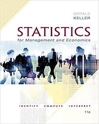

--- 
title: "MET4 - Empiriske Metoder - Vår 2021"
author: "Håkon Otneim og Geir Drage Berentsen"
site: bookdown::bookdown_site
output: 
  bookdown::gitbook:
    split_by: "section"
    config:
      toc:
        collapse: "section"
        toc_depth: 4
description: "Dette er hjemmesiden til kurset MET4 - Empiriske Metoder, som gis på bachelorstudiet ved Norges Handelshøyskole."
---

# Innledning {-}


<figure style="float:right; padding:10px; text-align:center">
  
  <figcaption>Håkon</figcaption>
</figure>

Velkommen til hjemmesiden for kurset [MET4 - Empiriske metoder](https://www.nhh.no/emner/empiriske-metoder/), som er et obligatorisk kurs på Bachelorprogrammet i Økonomi og Administrasjon ved Norges Handelshøyskole. Dette er et kurs i anvendt statistikk, spesielt tilpasset økonomistudiet, og vi skal fokusere på korrekt bruk av statistisk metodikk for å løse relevante problemstillinger i en verden der innsamlet data utgjør en stadig større del av beslutningsgrunlaget i bedrifts- og samfunnsstyring.

Kursansvarlige er Håkon Otneim og Geir Drage Berentsen, som begge jobber ved Institutt for Foretaksøkonomi ved NHH.

<figure style="float:right; padding:10px; text-align:center">
  
  <figcaption>Geir</figcaption>
</figure>

På grunn av coronasituasjonen er store deler av kurset digitalisert. Det vil si at teorigjennomgang plenumsforelesniger i sin helhet er erstattet med videoforelesninger. På denne siden vil du finne alle videosnuttene sammen med kommentarer til lærebokens fremstilling, samt supplementer og referanser til andre bøker der læreverket vårt ikke strekker til (særlig mot slutten av kurset).

Praktisk bruk av statistiske metoder står sentralt i MET4, og denne delen dekker vi gjenom kontakttimer, oppgaveseminarer med kursansvarlige, og dataøvinger med studentassistenter. Denne delen vil være digital dersom smittesituasjonen krever det, og fysisk på campus dersom smittesituasjonen tillater det. **Det vil være et fullgodt digitalt alternativ til MET4 gjennom hele semsteret**.

### Fremdriftsplan {-}

I et tradisjonelt kursopplegg ville forventet progresjon blitt definert av forelesningstempoet, og forelesningene ville vært den strukturen som mange trenger for å jobbe seg jevnt og trutt gjennom pensum.

I et digitalisert opplegg blir ikke pensumgjennomgang lenger gjort i fellesskap, men heller individuelt, der studenten selv kan bestemme tempo og progresjon tilpasset sin egen timeplan og studieteknikk. Prisen for økt fleksibilitet er derimot mindre struktur, og det kan oppleves som en ekstra belastning. Selv om det alltid har vært studentens eget ansvar å følge progresjonen i et kurs blir dette ansvaret enda mer tydelig i et heldigitalt kurs. Vi vil derfor minne om det åpenbare: **MET4 er et krevende kurs som krever full innsats fra første til siste dag.** 

Vi har laget et forslag til progresjon i tabellen under. Kolonnen "jobbe med" refererer til avsnitt på denne siden som dere finner igjen i menyen til høyre. Der finnes også alle dataøvingene. Ukene med grønn farge betyr at vi har tid på datasal med studentassistenter (så sant vi kan møtes fysisk, ellers vil disse selvsagt gjennomføres digitalt). 

Vi finner også hva vi skal gjøre i vår oppsatte forelesningstider. Som en hovedregel vil vi bruke tirsdagen som en ren kontakttime der kursansvalig(e) er tilgjengelige for spørsmål og diskusjon, mens torsdagstimen blir mer strukturert, med oppgaveregning i plenum (detaljer blir publisert på Canvas etter hvert). Begge disse aktivitetene er digitale i starten av semesteret, og så får vi se om det blir muligheter for å møtes fysisk etter hvert.

Legg merke til følgende viktige datoer:

- **1. mars:** Siste frist for oppmelding av grupper til obligatorisk øvelse og hjemmeeksamen.
- **26. mars:** Frist for innlevering av den obligatoriske innleveringen.
- **23.--24. mars:** Undervisningsfri pga. NHH symposium.
- **26.--28. april:** Gruppebasert hjemmeeksamen.
- **12. mai:** Individuell hjemmeeksamen.

```{r, echo = F, message = FALSE, warning = FALSE}
options(knitr.kable.NA = '')
library(dplyr)
library(kableExtra)

readxl::read_excel("diverse/tidsplan-v21.xlsx") %>% 
  kbl() %>%
  kable_styling(bootstrap_options = c("condensed", "hover"),
                fixed_thead = T) %>%
  row_spec(c(3, 5, 8, 10, 13) , background = "#2E8B5750") %>% 
  row_spec(11, bold = T, background = "DarkRed", color = "white")
```

*Passord til Zoom-møtene finnes på kursets Canvas-side.*

### Lærebok og pensum {-}

<figure style="float:right; padding:10px; text-align:center">
  
  <figcaption>11. utgave</figcaption>
</figure>

Vi bruker læreboken *Statistics for Management and Economics* av Gerald Keller, som nå foreligger i 11. utgave. I utgangspunktet er følgende kapitler pensum: 1--5, 9--13, 15--18 og 20. Mot slutten av kurset går vi gjennom noen tema som ikke er dekket i læreboken (logistisk regresjon, maskinlæring, paneldatamodeller, tidrekkemodeller). Der finner du referanser til andre kilder, samt en del materiale som vi har skrevet selv. I pensumgjennomgangen på denne siden finner du også en del kommentarer til læreboken, som for eksempel hva som er viktig, og hva som er mindre viktig for oss. 

Eldre utgaver av læreboken går bra. Under anbefalte regneoppgaver refererer vi til nummer i 11. og 10. utgave. Oppgavenummer tilbake til 7. utgave finner du i [dette dokumentet](oppgaver/Recommended excercises.doc).

**Merk: Fra og med neste semester kommer det en ny utgave av læreboken.**
