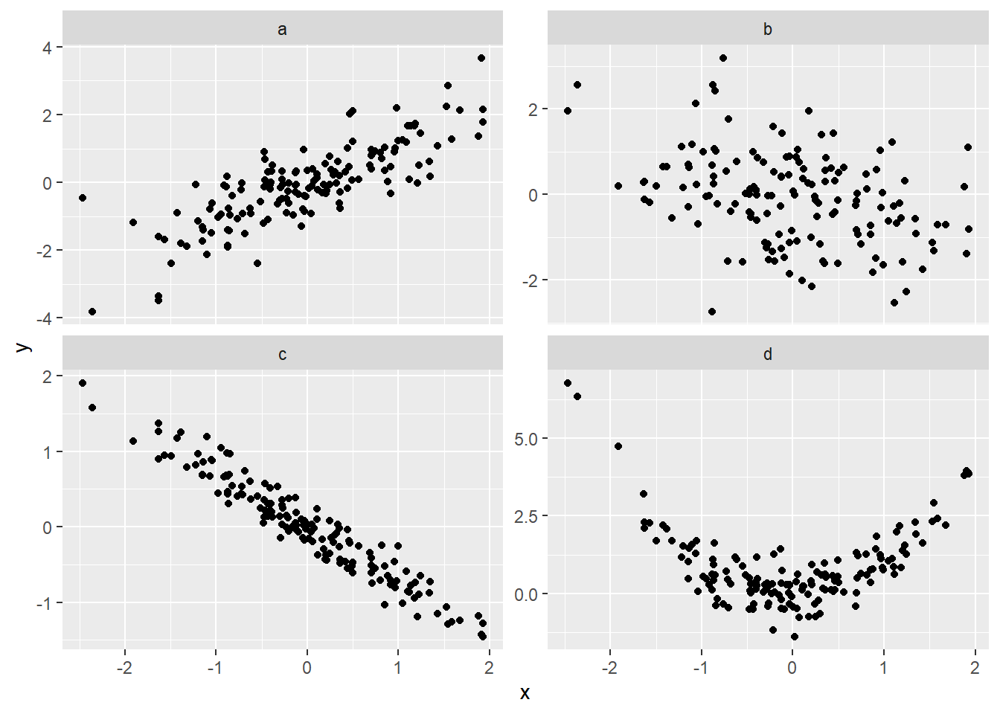
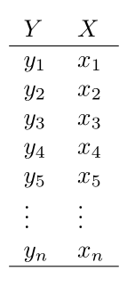
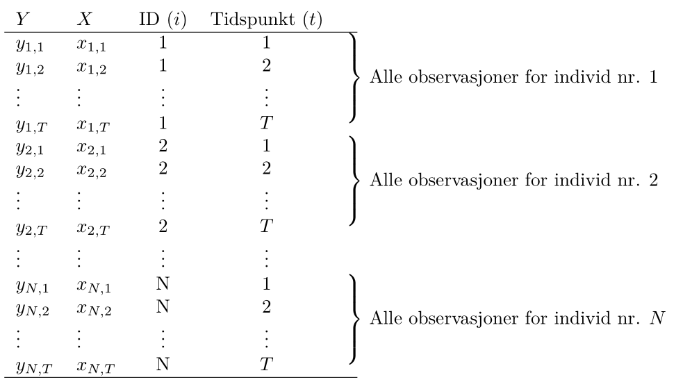
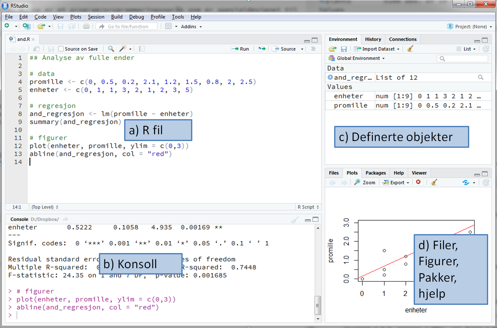
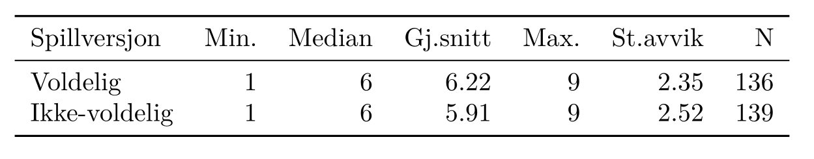

--- 
title: "MET4 - Empiriske Metoder - Vår 2021"
author: "Håkon Otneim og Geir Drage Berentsen"
site: bookdown::bookdown_site
output: 
  bookdown::gitbook:
    split_by: "section"
    config:
      toc:
        collapse: "section"
        toc_depth: 4
description: "Dette er hjemmesiden til kurset MET4 - Empiriske Metoder, som gis på bachelorstudiet ved Norges Handelshøyskole."
---

# Innledning {-}


<figure style="float:right; padding:10px; text-align:center">
  
  <figcaption>Håkon</figcaption>
</figure>

Velkommen til hjemmesiden for kurset [MET4 - Empiriske metoder](https://www.nhh.no/emner/empiriske-metoder/), som er et obligatorisk kurs på Bachelorprogrammet i Økonomi og Administrasjon ved Norges Handelshøyskole. Dette er et kurs i anvendt statistikk, spesielt tilpasset økonomistudiet, og vi skal fokusere på korrekt bruk av statistisk metodikk for å løse relevante problemstillinger i en verden der innsamlet data utgjør en stadig større del av beslutningsgrunlaget i bedrifts- og samfunnsstyring.

Kursansvarlige er Håkon Otneim og Geir Drage Berentsen, som begge jobber ved Institutt for Foretaksøkonomi ved NHH.

<figure style="float:right; padding:10px; text-align:center">
  
  <figcaption>Geir</figcaption>
</figure>

På grunn av coronasituasjonen er store deler av kurset digitalisert. Det vil si at teorigjennomgang plenumsforelesniger i sin helhet er erstattet med videoforelesninger. På denne siden vil du finne alle videosnuttene sammen med kommentarer til lærebokens fremstilling, samt supplementer og referanser til andre bøker der læreverket vårt ikke strekker til (særlig mot slutten av kurset).

Praktisk bruk av statistiske metoder står sentralt i MET4, og denne delen dekker vi gjenom kontakttimer, oppgaveseminarer med kursansvarlige, og dataøvinger med studentassistenter. Denne delen vil være digital dersom smittesituasjonen krever det, og fysisk på campus dersom smittesituasjonen tillater det. **Det vil være et fullgodt digitalt alternativ til MET4 gjennom hele semsteret**.

### Fremdriftsplan {-}

I et tradisjonelt kursopplegg ville forventet progresjon blitt definert av forelesningstempoet, og forelesningene ville vært den strukturen som mange trenger for å jobbe seg jevnt og trutt gjennom pensum.

I et digitalisert opplegg blir ikke pensumgjennomgang lenger gjort i fellesskap, men heller individuelt, der studenten selv kan bestemme tempo og progresjon tilpasset sin egen timeplan og studieteknikk. Prisen for økt fleksibilitet er derimot mindre struktur, og det kan oppleves som en ekstra belastning. Selv om det alltid har vært studentens eget ansvar å følge progresjonen i et kurs blir dette ansvaret enda mer tydelig i et heldigitalt kurs. Vi vil derfor minne om det åpenbare: **MET4 er et krevende kurs som krever full innsats fra første til siste dag.** 

Vi har laget et forslag til progresjon i tabellen under. Kolonnen "jobbe med" refererer til avsnitt på denne siden som dere finner igjen i menyen til høyre. Der finnes også alle dataøvingene. Ukene med grønn farge betyr at vi har tid på datasal med studentassistenter (så sant vi kan møtes fysisk, ellers vil disse selvsagt gjennomføres digitalt). 

Vi finner også hva vi skal gjøre i vår oppsatte forelesningstider. Som en hovedregel vil vi bruke tirsdagen som en ren kontakttime der kursansvalig(e) er tilgjengelige for spørsmål og diskusjon, mens torsdagstimen blir mer strukturert, med oppgaveregning i plenum (detaljer blir publisert på Canvas etter hvert). Begge disse aktivitetene er digitale i starten av semesteret, og så får vi se om det blir muligheter for å møtes fysisk etter hvert.

Legg merke til følgende viktige datoer:

- **1. mars:** Siste frist for oppmelding av grupper til obligatorisk øvelse og hjemmeeksamen.
- **26. mars:** Frist for innlevering av den obligatoriske innleveringen.
- **23.--24. mars:** Undervisningsfri pga. NHH symposium.
- **26.--28. april:** Gruppebasert hjemmeeksamen.
- **12. mai:** Individuell hjemmeeksamen.

<table class="table table-condensed table-hover" style="margin-left: auto; margin-right: auto;">
 <thead>
  <tr>
   <th style="text-align:right;position: sticky; top:0; background-color: #FFFFFF;"> Uke </th>
   <th style="text-align:left;position: sticky; top:0; background-color: #FFFFFF;"> Jobbe med </th>
   <th style="text-align:left;position: sticky; top:0; background-color: #FFFFFF;"> Tirsdag 08:15 - 10:00 </th>
   <th style="text-align:left;position: sticky; top:0; background-color: #FFFFFF;"> Torsdag 10:15 - 12:00 </th>
  </tr>
 </thead>
<tbody>
  <tr>
   <td style="text-align:right;"> 3 </td>
   <td style="text-align:left;"> Introduksjon til R </td>
   <td style="text-align:left;"> 19.01: Kontakttime, kursansvarlig tilgjengelig på [Zoom](https://nhh.zoom.us/j/63633653066?pwd=cTVNV0JvOXl4NnUrMHVKdkw2b0pCZz09). </td>
   <td style="text-align:left;"> 21.01: Introduksjon til R på [Zoom](https://nhh.zoom.us/j/63633653066?pwd=cTVNV0JvOXl4NnUrMHVKdkw2b0pCZz09). </td>
  </tr>
  <tr>
   <td style="text-align:right;"> 4 </td>
   <td style="text-align:left;"> Grunnleggende statistikk </td>
   <td style="text-align:left;"> 26.01: Kontakttime, kursansvarlig tilgjengelig på [Zoom](https://nhh.zoom.us/j/63633653066?pwd=cTVNV0JvOXl4NnUrMHVKdkw2b0pCZz09). </td>
   <td style="text-align:left;"> 28.01: Oppgaveseminar på [Zoom](https://nhh.zoom.us/j/63633653066?pwd=cTVNV0JvOXl4NnUrMHVKdkw2b0pCZz09). </td>
  </tr>
  <tr>
   <td style="text-align:right;background-color: rgba(46, 139, 87, 0.31) !important;"> 5 </td>
   <td style="text-align:left;background-color: rgba(46, 139, 87, 0.31) !important;"> Dataøving 1 </td>
   <td style="text-align:left;background-color: rgba(46, 139, 87, 0.31) !important;">  </td>
   <td style="text-align:left;background-color: rgba(46, 139, 87, 0.31) !important;">  </td>
  </tr>
  <tr>
   <td style="text-align:right;"> 6 </td>
   <td style="text-align:left;"> Hypotesetesting </td>
   <td style="text-align:left;">  </td>
   <td style="text-align:left;">  </td>
  </tr>
  <tr>
   <td style="text-align:right;background-color: rgba(46, 139, 87, 0.31) !important;"> 7 </td>
   <td style="text-align:left;background-color: rgba(46, 139, 87, 0.31) !important;"> Hypotesetesting og Dataøving 2 </td>
   <td style="text-align:left;background-color: rgba(46, 139, 87, 0.31) !important;">  </td>
   <td style="text-align:left;background-color: rgba(46, 139, 87, 0.31) !important;">  </td>
  </tr>
  <tr>
   <td style="text-align:right;"> 8 </td>
   <td style="text-align:left;"> Regresjon </td>
   <td style="text-align:left;">  </td>
   <td style="text-align:left;">  </td>
  </tr>
  <tr>
   <td style="text-align:right;"> 9 </td>
   <td style="text-align:left;"> Regresjon </td>
   <td style="text-align:left;">  </td>
   <td style="text-align:left;">  </td>
  </tr>
  <tr>
   <td style="text-align:right;background-color: rgba(46, 139, 87, 0.31) !important;"> 10 </td>
   <td style="text-align:left;background-color: rgba(46, 139, 87, 0.31) !important;"> Dataøving 3/Obligatorisk innlevering </td>
   <td style="text-align:left;background-color: rgba(46, 139, 87, 0.31) !important;">  </td>
   <td style="text-align:left;background-color: rgba(46, 139, 87, 0.31) !important;">  </td>
  </tr>
  <tr>
   <td style="text-align:right;"> 11 </td>
   <td style="text-align:left;"> Avansert regresjon og maskinlæring </td>
   <td style="text-align:left;">  </td>
   <td style="text-align:left;">  </td>
  </tr>
  <tr>
   <td style="text-align:right;background-color: rgba(46, 139, 87, 0.31) !important;"> 12 </td>
   <td style="text-align:left;background-color: rgba(46, 139, 87, 0.31) !important;"> Dataøving 4 </td>
   <td style="text-align:left;background-color: rgba(46, 139, 87, 0.31) !important;">  </td>
   <td style="text-align:left;background-color: rgba(46, 139, 87, 0.31) !important;">  </td>
  </tr>
  <tr>
   <td style="text-align:right;font-weight: bold;color: white !important;background-color: DarkRed !important;"> 13 </td>
   <td style="text-align:left;font-weight: bold;color: white !important;background-color: DarkRed !important;"> PÅSKE </td>
   <td style="text-align:left;font-weight: bold;color: white !important;background-color: DarkRed !important;">  </td>
   <td style="text-align:left;font-weight: bold;color: white !important;background-color: DarkRed !important;">  </td>
  </tr>
  <tr>
   <td style="text-align:right;"> 14 </td>
   <td style="text-align:left;"> Tidsrekker </td>
   <td style="text-align:left;">  </td>
   <td style="text-align:left;">  </td>
  </tr>
  <tr>
   <td style="text-align:right;background-color: rgba(46, 139, 87, 0.31) !important;"> 15 </td>
   <td style="text-align:left;background-color: rgba(46, 139, 87, 0.31) !important;"> Tidsrekker (Tid på datasal) </td>
   <td style="text-align:left;background-color: rgba(46, 139, 87, 0.31) !important;">  </td>
   <td style="text-align:left;background-color: rgba(46, 139, 87, 0.31) !important;">  </td>
  </tr>
</tbody>
</table>

*Passord til Zoom-møtene finnes på kursets Canvas-side.*

### Lærebok og pensum {-}

<figure style="float:right; padding:10px; text-align:center">
  
  <figcaption>11. utgave</figcaption>
</figure>

Vi bruker læreboken *Statistics for Management and Economics* av Gerald Keller, som nå foreligger i 11. utgave. I utgangspunktet er følgende kapitler pensum: 1--5, 9--13, 15--18 og 20. Mot slutten av kurset går vi gjennom noen tema som ikke er dekket i læreboken (logistisk regresjon, maskinlæring, paneldatamodeller, tidrekkemodeller). Der finner du referanser til andre kilder, samt en del materiale som vi har skrevet selv. I pensumgjennomgangen på denne siden finner du også en del kommentarer til læreboken, som for eksempel hva som er viktig, og hva som er mindre viktig for oss. 

Eldre utgaver av læreboken går bra. Under anbefalte regneoppgaver refererer vi til nummer i 11. og 10. utgave. Oppgavenummer tilbake til 7. utgave finner du i [dette dokumentet](oppgaver/Recommended excercises.doc).

**Merk: Fra og med neste semester kommer det en ny utgave av læreboken.**

<!--chapter:end:index.Rmd-->


# Introduksjon til R

Vi skal i dette kurset bruke programmeringsspråket **R** til å gjøre beregninger og gjennomføre de ulike statistiske analysene som vi skal lære etter hvert. Dette vil være nytt for mange. Vi skal først og fremst skal skrive *kode* og *kommandolinjer* for å få ut resultater i R, noe som kan oppleves uvant siden vi ellers er vant med å klikke oss frem i et menysystem når vi jobber med ulike programmer. Trøsten kan være at ferdigheter i programmering blir stadig viktigere i mange yrker, spesielt innen økonomifaget. 

Vi må installere to ting på maskinen vår før vi går videre; selve programeringsspråket R, samt programmet RStudio som vi skal bruke til å skrive og kjøre koden. Begge deler er gratis, og begge deler fungerer fint på både Windows og Mac (og Linux!). Det er greiest å gjøre dette i riktig rekkefølge:

1. Gå til [r-project.org](https://cran.uib.no/) for å laste ned R til ditt operativsystem, og installer på vanlig måte uten å forandre på foreslåtte innstillinger.

2. Gå til [rstudio.com](https://rstudio.com/), og naviger deg frem til siden for **RStudio**. Du skal der laste ned desktop-versjonen av programmet ("Open source edition") for ditt operativsystem og  installere på vanlig måte. Det er heller ikke her nødvendig å forandre på de foreslåtte innstillingene.

Du kan så åpne RStudio, og følge sekvensen av videoforelesniger som følger under. Merk at disse videoene er lånt fra seminaret [BAN420 - Introduction to R](https://www.nhh.no/en/courses/introduction-to-r/) som gis på masterprogrammet ved NHH. De er derfor spilt inn på engelsk. Det resterende videomaterialet i kurset gis på norsk.

## En gjennomgang av RStudio

<iframe src="https://player.vimeo.com/video/472587681" width="640" height="347" frameborder="0" allow="autoplay; fullscreen" allowfullscreen></iframe>

I denne videoen åpner vi opp Rstudio og rusler gjennom det grafiske grensesnittet.

## Enkle beregninger og variabler

<iframe src="https://player.vimeo.com/video/472587696" width="640" height="347" frameborder="0" allow="autoplay; fullscreen" allowfullscreen></iframe>

Vi går videre og skriver våre første kommandoer i R. Det er kritisk at vi allerede nå setter i gang med å få programmeringen inn i fingrene, og det gjøres best ved å skrive inn kodelinjene slik det gjøres i videoen, og passe på at du får ut de samme resultatene. Når du er ferdig med det kan du prøve deg på følgende lille oppgave:

**Oppgave:** Velg dine tre favorittall og lagre dem i tre forskjellige variabler. Beregn så ditt magiske tall, som er summen av favorittallene dine. Lagre ditt magiske tall i en ny variabel, og gi denne variabelen et informativt navn som identifiserer hva det er.

Fikk du det til? Kikk på løsningen under for å sjekke.

<details><summary>Løsning</summary>


```r
tall1 <- 1
tall2 <- 87
tall3 <- 101

magisk_tall <- tall1 + tall2 + tall3
```

</details>

## Vektorer

<iframe src="https://player.vimeo.com/video/472587712" width="640" height="347" frameborder="0" allow="autoplay; fullscreen" allowfullscreen></iframe>

Vi introduserer begrepet *vektorer* som er svært viktig i statistikk generel og R spesielt. En vektor er ganske enkelt en samling med tall, og når vi senere begynner å jobbe med data kommer vi til å lagre observasjoner av ulikt slag i vektorer. Vi ser også at vi kan gjøre operasjoner på vektorer ved å bruke *funksjoner*. For eksempel bruker vi `sum()`-funksjonen til å regne ut summen av alle tallene som er lagret i en vektor.

**Oppgave:** Beregn maksimum- og minimumsverdien av `vector1`, samt medianen, ved å bruke funksjoner i R. (**Hint:** en dårlig skjult hemmelighet i anvendt programmering er at dersom vi ikke vet navnet på funksjonen vi skal bruke, så er Google vår' beste venn!)

<details><summary>Løsning</summary>

```r
# Relevante Google-søk: "minimum value r", "maximum r", "median r"

min(vector1)
max(vector1)
median(vector1)
```
</details>

## Pakker

<iframe src="https://player.vimeo.com/video/472587752" width="640" height="347" frameborder="0" allow="autoplay; fullscreen" allowfullscreen></iframe>

Vi lærer at når vi laster ned R så følger det med et grunnleggende sett av funksjoner ("base R"), men at det finnes et stort antall tilleggspakker. Vi kan enkelt laste ned og installere disse pakkene ved å skrive kommandoen `install.packages("pakkenavn")`. Det trenger vi bare gjøre en gang på datamaskinen vår. For å bruke pakken må vi skrive kommandoen `library(pakkenavn)`, og det må vi gjøre hver gang i restarter R.

**Oppgave:** Installer følgende pakker, som vi kommer til å bruke senere i kurset:

- `ggplot2`
- `dplyr`
- `stargazer`

<details><summary>Løsning</summary>

```r
install.packages("ggplot2")
install.packages("dplyr")
install.packages("stargazer")
```
</details>

## Mappesti

<iframe src="https://player.vimeo.com/video/472587759" width="640" height="347" frameborder="0" allow="autoplay; fullscreen" allowfullscreen></iframe>

Vi kommer til å forholde oss til *filer* på flere måter. Vi skal lese inn datafiler, og vi kommer til å produsere ulike former for output, slik som figurer og tabeller. Vi må da ha kontroll på hva R bruker som gjeldende mappesti ("working directory") der filer som skal leses inn ligger, og der ulike output-filer havner. Vi kan bruke funksjonen `getwd()` til å sjekke hva som er gjeldende mappesti. For å forandre mappestien kan vi bruke menysystemet (Session -> Set Working Directory -> Choose Directory), eventuelt funksjonen `setwd()` med ønsket mappesti som argument.

**Oppgave:** Pass på at du har gjort følgende før du går videre til neste leksjon:

- Du har laget en dedikert mappe på datamaskinen din der du skal samle alt materiale som vi bruker i dette kapitlet.
- Du har lastet ned filen [testdata.xls](datasett/testdata.xls) og lagt den i den nye mappen din.
- Du har endret gjeldende mappesti til denne mappen.
- Du har **bekreftet** at gjeldende mappesti nå er korrekt.

## Innlesing av data

<iframe src="https://player.vimeo.com/video/472587809" width="640" height="347" frameborder="0" allow="autoplay; fullscreen" allowfullscreen></iframe>

Vi leser inn tabellen i excelfilen som en tabell ("data frame") i R ved hjelp av funksjonen `read_xls()` i `readxl`-pakken og ser på noen enkle kommandoer for å jobbe med en slik tabell. 

**Oppgave:** 

1. Hvor mange kolonner har datasettet vårt?
2. Kan du finne en måte å skrive ut en vektor som inneholder summen av `X1`- og `X2`-kolonnene i datasettet? (Altså, vi vil vite summen av de to første elementene i `X1` og `X2`, summen av de to andre elementene, osv.) 
3. Hva er summen av *alle* tallene i `X1`- og `X2`-kolonnene i`testdata`?

<details><summary>Løsning</summary>

```r
# 1
ncol(testdata)

# 2 
testdata$X1 + testdata$X2

# 3
sum(testdata$X1 + testdata$X2)
```
</details>

## Statistiske analyser

<iframe src="https://player.vimeo.com/video/472587826" width="640" height="347" frameborder="0" allow="autoplay; fullscreen" allowfullscreen></iframe>

Den første kommentaren i denne videoen er selvsagt ikke sann for MET4. For oss er det motsatt: Det er ikke R som er poenget med kurset, men de statistiske metodene som vi skal lære. R er bare verktøyet vi skal bruke. 

Vi ser på et eksempel der vi kjører en enkel statistisk analyse (en $t$-test) på datasettet vårt, og hvordan vi kan gjøre ulike valg ved å endre argumenter i funksjonskallet. Vi bruker også hjelpefilene til å lese mer om funksjonen vi bruker.

**Oppgave:** Hva er verdien av *testobservatoren* i testen som vi gjorde i denne videoen? Hint: Bruk hjelpefilene til `t.test()`-funksjonen.

<details><summary>Løsning</summary>

```r
test_result$statistic
```
</details>

## Plotting

<iframe src="https://player.vimeo.com/video/472587867" width="640" height="347" frameborder="0" allow="autoplay; fullscreen" allowfullscreen></iframe>

Vi lager vår første figur i R ved å bruke den innebygde `plot()`-funksjonen. Vi går så over til å se hvordan vi kan lage det samme plottet ved å bruke `ggplot`-pakken, som er det vi kommer til å bruke til å lage figurer i dette kurset. Vi ser også hvordan vi kan gå frem for å *lagre* plottet som en pdf-fil i arbeidsmappen vår.

**Oppgave:** Klarer du, for eksempel ved å søke etter relevante ggplot-kommandoer på nettet, å få prikkene i plottet til å bli større, og samtidig gjøre dem blå?

<details><summary>Løsning</summary>

```r
ggplot(testdata, aes(x = X1, y = X2)) + geom_point(colour = "blue", size = 5)
```
</details>

## Script

<iframe src="https://player.vimeo.com/video/472587939" width="640" height="347" frameborder="0" allow="autoplay; fullscreen" allowfullscreen></iframe>

I stedet for å skrive kommandoene rett inn i konsollen, hopper vi nå over til teksteditoren i RStudio og lager et *script* i stedet. Her kan vi samle alle kommandoene våre i en fil, som vi kan lagre og kjøre igjen senere. Vi ser også hvordan vi enkelt kan kjøre enkeltlinjer i scriptet vårt i R-konsollen ved hjelp av Ctrl-Enter (Command-Enter på Mac). Vi ser at vi kan skrive kommentarer i scriptene våre ved å bruke `#-tegnet, som kan være nyttig for å holde oversikten. Til slutt lagrer vi scripet i arbeidsmappen.

**Oppgave:** Pass på at du nå har lagret scriptet som en .R-fil i mappen som vi laget for denne R-leksjonen. Lukk RStudio. Naviger så til denne mappen i filutforskeren og dobbelklikk på skriptet. Forhåpentligvis åpnes RStudio nå (Hvis ikke, eller hvis filen åpnes i det som heter R GUI, høyreklikker du på filen og velger "Åpne i", og deretter RStudio. Du kan også gjerne sette RStudio som standarsprogram for .R-filer).

Finn ut hva gjeldende arbeidsmappe nå er i RStudio. Hva skjedde nå? Hvorfor er dette nyttig?

<details><summary>Løsning</summary>

Når vi åpner RStudio ved å dobbeltklikke på skriptfilen, så blir arbeidsstien satt automastisk til mappen der skriptfilen ligger. Dette er veldig nyttig når vil kommer tilbake og skal jobbe videre med prosjektet vårt.

</details>

## Oppsummering og ekstra oppgaver {#r-ekstra}

I denne modulen har vi gått gjennom noen helt grunnleggende funksjoner i R. Du har lært at

- R er navner på et programmeringsspråk, 
- RStudio er navnet på et program der vi kan skrive og kjøre R-kode, og
- identifisert fire forskjellige vindu i RStudio: konsollen (der R-koden kjøres), teksteditoren (der vi skriver script), samt to vinduer der vi kan se en oversikt over hva som er i dataminnet og få opp plott og figurer som vi lager.

Videre har du 

- kjørt noen enkle kommandoer,
- lagret tall og vektorer ved hjelp av variabelnavn,
- prøvd ut noen innebygde R-funksjoner for å regne ut f.eks. gjennomsnitt og standardavvik av tallvektorer,
- laget et spredningsplott,
- lært hva et *working directory* (arbeidsmappe) er, og 
- installert R-pakker, f.eks `readxl` som vi brukte den til å lese inn et lite datasett i R. 

Til slutt har du

- kjørt en $t$-test, og
- skrevet et *script* (et lite program om du vil) der vi har lagret flere av kommandoene over i en tekstfil.

Dersom du har fulgt modulen selv har du nå kanskje skrevet et lite script i tekstvinduet som ser ut omtrent som koden under. Når du har gjort alt riktig, skal du nå kunne kjøre gjennom disse kodelinjene uten feilmeldinger ved hjelp av `Ctrl-Enter`.

**Dette er helt grunnleggende (Spør om hjelp! Gi hjelp!). Har du problemer her, sørg for å få dem ordnet. Spør først en medstudent om hjelp, og deretter eventuelt studentassistent eller foreleser. Studenter som har god erfaring med data og/eller programmering, kan lære mye av å hjelpe medstudenter løse feilmeldinger.**


```r
# Introduksjon til R
# -------------------

# Laster inn nødvendige pakker
library(readxl)
library(ggplot2)

# Laster inn datasettet
testdata <- read_xls("testdata.xls")

# Gjør t-testen til spørsmål F i den første dataøvingen
testresultat <- t.test(testdata$X1, 
                       testdata$X2, 
                       var.equal = TRUE, 
                       alternative = "two.sided")

# Skriver ut resultatet av denne t-testen
testresultat

# Lager et plott av variabelen X1 mot X2
p <- ggplot(testdata, aes(x = X1, y = X2)) +
        geom_point()

# Lagrer plottet
ggsave("testplot.pdf", plot = p)
```

1. Lagre scriptet ditt. I RStudio velger du `File -> Save` og trykker `Ok` dersom det kommer opp et vindu om *character encoding* e.l. Finn en fornuftig plassering (gjerne i samme mappe som øvelsesdatasettet) og gi filen et fornuftig navn. Standard filending for R-script er `.R`, men det er skjult for de fleste Windowsbrukere. Lukk RStudio.

2. Du kan nå åpne skriptfilen i RStudio igjen. Enten ved å dobbeltklikke på den, eller ved å åpne RStudio, velge `File -> Open file`, og så videre (dersom skriptet ikke allerede ligger åpnet). Du kan også åpne skriptfilen i en hvilken som helst notatbok (Notebook e.l.) og se at det er en helt standard, *ren tekstfil*. Hva er fordelen med å lagre en analyse som *et skript* versus å gjøre ting i et menydrevet grafisk grensesnitt?

<details><summary>Løsning</summary>

Når vi lagrer koden vår i et skript sørger vi for at *hele analysen vår er lagret*, ikke bare resultatene. Med andre ord, dersom du på et senere tidspunkt ønsker å komme tilbake til et analyseprosjekt og gjøre noen enkle forandringer, så er det fort gjort å gjøre det i skriptet, og så kjøre hele analysen på nytt. Dersom du i stedet hadde brukt et menydrevet system for å gjennomføre analysen (pek og klikk) kunne du risikere å måtte gjøre alt sammen på nytt (hvis du da husker hvordan du gjorde det), fordi du ikke like enkelt kan *lagre* hvert eneste museklikk. 

</details>


3. Vi skal nå pynte på plottet og gjøre det riktig pent. Det gjør vi ved å legge til nye linjer i ggplot-kommandoen. Erstatt den nest siste linjen i skriptet med kommandoen under, og se at du får en figur omtrent som den som følger under det igjen (vi bruker aksetitler i henhold til oppgavene i den første datalabben, der vi får vite at datasettet representerer kvalitet på kaffeavlingen før og etter en omlegging i produksjonsmetode):


```r
ggplot(testdata, aes(x = X1, y = X2)) +
        geom_point(size = 2) +
        xlab("Produksjonsmetode 1") +
        ylab("Produksjonsmetode 2") +
        theme_classic()
```



4. Merk at vi pruker "+"-tegnet til å legge til flere "lag" med grafiske egenskaper til plottet. Hvert "lag" består av en funksjon, som ofte kan ta argumenter; f.eks. brukes funksjonen `geom_point()` til å lage prikker, og så kan vi f.eks. bruke argumentet `size` til å styre størrelsen på prikkene. Kan du finne ut hva hvert enkelt av disse "lagene" gjør? Hint: ta bort en linje av gangen, og se hva som skjer. Pass på at det er et pluss mellom hvert lag.

5. Prøv å endre på noen av lagene eller legg til nye. For eksempel kan du lage en tittel ved å legge til funksjonen `ggtitle()` som et lag, og du kan endre aksetitlene. Prøv også å bruke argumentet `shape` i `geom_point()` til å bytte ut prikkene med en annen form. Det finnes flere andre "tema" i tillegg til `theme_classic()`, f.eks. `theme_bw()`, `theme_dark()`, etc. 

<details><summary>Forslag</summary>

Prøv for eksempel dette:


```r
ggplot(testdata, aes(x = X1, y = X2)) +
        geom_point(size = 2, shape = 4) +
        ggtitle("Produksjonskvalitet") +
        xlab("Ny aksetittel") +
        ylab("Enda en aksetittel") +
        theme_light()
```


</details>

6. Det følger med omfattende dokumentasjon med `R`. Du kan lese om alle `R`-funksjoner ved å skrive `?` før funksjonsnavnet i konsollen. Prøv for eksempel å skrive `?mean` i konsollen og trykk enter.


<!--chapter:end:01-intro-til-r.Rmd-->


# Grunnleggende statistikk

I denne modulen introduserer vi en del grunnleggende statistiske begreper. Mye vil oppleves som repetisjon, mens noe vil være nytt. Noe er veldig praktisk ved at vi kan bruke det direkte i eksempler, mens andre ting er mer teoretisk av natur. Felles for det vi skal se på her er at vi kommer til å bruke mange av begrepene vi lærer senere i kurset.

I videoforelesningene går vi gjennom noen slides, og vi skriver et R-skript. Du kan laste disse ned ved å klikke på lenkene under:

[Slides til "Grunnleggende statistikk"](script-slides/grunnleggende-stat/grunnleggende-stat-slides.html)

[R-script til "Grunnleggende statistikk"](script-slides/grunnleggende-stat/grunnleggende-stat-script.R)

## Deskriptiv statistikk

### Videoforelesninger

<div style='padding:74.79% 0 0 0;position:relative;'><iframe src='https://vimeo.com/showcase/7748078/embed' allowfullscreen frameborder='0' style='position:absolute;top:0;left:0;width:100%;height:100%;'></iframe></div>

### Kommentarer

Deskriptiv statistikk handler ikke om analyse eller regning, men om å presentere kompleks informasjon på en effektiv måte. Det er altså noe ganske annet enn det vi ellers snakker om i kurset, men det er likevel et av de nyttigste læringspunktet vi har. Hvem kan ikke regne med å måtte presentere tall og resultater i løpet av sin karriere? Eller selge inn forslag og planer for overordnede i håp om å bli lyttet til? Det kan være direkte avgjørende for din egen gjennomslagskraft at du er i stand til å produsere overbevisende tabeller og figurer i slike situasjoner, og det er det dette temaet handler om. 

I læreboken er det kapitlene **2--4** som behandler deskriptiv statistikk, men det er veldig Excel-fokusert, som ikke er så relevant for oss. Det er likevel ikke dumt å lese gjennom stoffet for å se hva det går i, og legg spesielt merke til følgende punkter:

- Ulike datatyper i avsnitt **2-1**.
- **3-4**: The art and science of graphical presentations. Hva er det som gjør en grafisk illustrasjon god? Prøv å ta inn over dere all informasjonen som vi lett kan lese ut av bildet på side 75 om Napoleons felttog mot Moskva. Her presenteres informasjon om tid, antall, geografi og temperatur på en helt eksepsjonelt effektiv måte! Videre er det noen grelle eksempler på hvordan vi kan bruke grafiske virkemidler til å gi skjeve fremstillinger. I videoforelesningen gir vi flere eksempler på dette. 
- Kapittel **4** går litt mer i dybden om numeriske deskriptive teknikker, som gjennomsnitt, median, standardavvik, korrelasjon, osv. Dette skal være dekket greit i forelesningen, men boken går litt lenger.

Det kan være en fin øvelse å kikke på eksemplene i læreboken og forsøke å gjenskape noen av Excel-figurene i R. Se på eksempel 3.2, der man skal lage to histogrammer over historiske avkastninger for to ulike investeringsstrategier. Vi leser inn datasettet (last ned fra Canvas) som under og kikker på det:


```r
library(readxl)
returns <- read_xlsx("Xm03-02.xlsx")
returns
```


```
## # A tibble: 50 x 2
##    `Return A` `Return B`
##         <dbl>      <dbl>
##  1      30         30.3 
##  2      -2.13     -30.4 
##  3       4.3       -5.61
##  4      25         29   
##  5      12.9      -26.0 
##  6     -20.2        0.46
##  7       1.2        2.07
##  8      -2.59      29.4 
##  9      33         11   
## 10      14.3      -25.9 
## # ... with 40 more rows
```

Hver stategi har sin kolonne. Merk at variabelnavnene har mellomrom i seg, noe som er upraktisk når vi jobber med et seriøst programmeringsspråk. En god vane er å rett og slett gi dem nye navn, ved f.eks. å kjøre `colnames(returns) <- c("returnA", "returnB")`, eller så må vi alltid referere til variabelnavnene ved å bruke slike "backticks" som vi ser under.

Vi kan lage to enkle histogrammer slik vi gjorde det i forelesningen:


```r
ggplot(returns, aes(x = `Return A`)) +
        geom_histogram(bins = 10)
ggplot(returns, aes(x = `Return B`)) +
        geom_histogram(bins = 10)
```

<div class="figure">

<p class="caption">(\#fig:to-histogrammer)To histogrammer</p>
</div>

Her er noen kontrollspørsmål som du kan prøve deg på:

1. Hva er forskjellen på deskriptiv statistikk og statistisk inferens?
1. Deskriptiv statistikk kan gjøres grafisk eller numerisk, eventuelt som tabeller av ulike numeriske mål. Nevn noen fordeler og ulemper man må veie mot hverandre når vi skal velge mellom grafisk og numerisk deskriptiv statistikk.

## Utvalg og estimering

> You can, for example, never foretell what any one man will do, but you can say with presicion what an average number will be up to. Individuals vary, but percentages remain constant. So says the statistician.

<footer>--- Sherlock Holmes</footer>

### Videoforelesninger

<div style='padding:74.93% 0 0 0;position:relative;'><iframe src='https://vimeo.com/showcase/7774368/embed' allowfullscreen frameborder='0' style='position:absolute;top:0;left:0;width:100%;height:100%;'></iframe></div>

### Kommentarer

I videoforelesningene over går vi gjennom noen sentrale begreper i statistikk. Noen av dem skal vi bruke mye i fortsettelsen, mens andre er ment for å gi dere et solid teoretisk fundament når vi etter hvert skal begi oss ut på anvendt statistikk.

Vi startet med å sette opp en liten agenda. Som et første steg kan du kikke på, og notere ned noen setninger til, disse punktene og se om du har fått med deg hva de betyr:

- Samplingfordelinger
- Forventning/varians
- Sentralgrenseteoremet
- Hva er samplingfordelingen til et gjennomsnitt?
- Hva er samplingfordelingen til en andel?
- Forventningsrett
- Konsistens

I Boken er det kapittel **9** (*Sampling distributions*) og **10** (*Introduction to estimation*) som gjelder. Kapittel **6**--**8** omhandler stoff skal skal være greit dekket i MET2 (Sannsynlighet, fordelinger, stokastiske variable, osv.), men det kan være nyttig å skumme gjennom likevel hvis disse begrepene ligger langt bak i bevissheten din. 

Kapittel **9** starter med å diskutere samplingfordelingen til et gjennomsnitt. Dette er nyttig lesestoff, men de viktigste punktene er som følger:

- Dersom observasjonene $X_1, X_2, \ldots, X_n$ er normalfordelt, er også gjennomsnittet $\overline X = \frac{1}{n}\sum_{i=1}^n X_i$ normalfordelt.
- Dersom E$(X_i) = \mu$ og Var$(X_i) = \sigma^2$ for alle $i = 1,\ldots,n$, er E$(\overline X)=\mu$ og Var$(\overline X) = \sigma^2/n$. Dette regnet vi ut formelt.
- Dersom $n$ er *stor*, er $\overline X$ tilnærmet normalfordelt, uavhengig av fordelingen til den enkelte $X_i$. Dette følger av **sentralgrensesetningen**. 

Dette står i en boks på slutten av seksjon **9-1a**. Hvor stor må $n$ være for at denne tilnærmingen er god nok? Det finnes ikke et entydig svar på, men når vi passerer 50-100 observasjoner kan vi i våre MET4-problemer gjerne si at $n$ er «stor nok». I **9-1b** og **9-1c** brukes sentralgrenseteoremet til å regne på normalsannsynligheter i MET2-stil. I **9-1d** er det noen Excel-instruksjoner som du kan hoppe over hvis du vil.

Tekstboksen i **9-2c** oppsummerer det vi fant ut om samplingfordelingen til en observert andel. I seksjon **9-3** snakkes det om samplingfordelingen til *differansen av to gjennomsnitt*. Vi gikk ikke gjennom det eksplisitt i forelesningen, men det er ikke noe substansielt nytt her. Vi skal bruke dette reultatet i neste modul når vi skal sammenligne to gjennomsnitt. I seksjon **9-4** får vi forklart hva vi skal bruke samplingfordelinger til fremover. Bør leses.

Kapittel **10** omhandler *estimering*, dvs hvordan vi bruker data til å «gjette» på verdien til en ukjent parameter. Vi forsøkte i forelesningen å gi litt intuisjon til begrepene

- forventningsrett estimator,
- variansen til en estimator, og
- konsistens.

Vi kan lage et *punktestimat* av en forventningsverdi ved å ta gjennomsnittet av observasjoner, og vi kan lage et *konfidensintervall* ved å følge oppskriften i boksen på s. 316 (i 11. utgave).

I eksempel 10.1 har vi 25 observasjoner fra en normalfordeling. Oppgaven er å estimere forventningsverdien med et tilhørende 95% konfidensuntervall. Pass på at du forstår den manuelle utregningen. I stedet for å bruke Excel (eller taste alle disse tallene inn på en kalkulator) kan du skrive et lite R-script som gjør det samme:


```r
# Vi skriver inn datasettet i en vektor
demand <- c(235, 374, 309, 499, 253, 
            421, 361, 514, 462, 369,
            394, 439, 348, 344, 330,
            261, 374, 302, 466, 535,
            386, 316, 296, 332, 334)

# Vi trenger 4 verdier for å regne ut konfidensintervallet:
gj.snitt <- mean(demand)     # Regner ut gjennomsnittet
z <- 1.96                    # Denne finner vi i tabellen
sigma <- 75                  # Oppgitt i oppgaven
n <- length(demand)          # Antall observasjoner

# Vårt estimat av forventningsverdien er bare gjennomsnittet. 
# Regner ut nedre og øvre grense i konfidensintervallet (LCL, UCL):
LCL <- gj.snitt - z*sigma/sqrt(n)
UCL <- gj.snitt + z*sigma/sqrt(n)

# Samler de tre tallene i en vektor og skriver ut:
c(LCL, gj.snitt, UCL)
```

```
## [1] 340.76 370.16 399.56
```
 
 I seksjon **10-2a** forsøker boken å forklare fortolkningen av et konfidensintervall. Hovedpoengene her er at:
 
 - Et 95%-konfidensintervall skal *ikke* tolkes som «sannsynligheten for at den sanne parameterverdien ligger i intervallet er 95%».
 - Den korrekte tolkningen er: «Dersom vi hadde hatt tilgang til å trekke nye utvalg fra populasjonen med like mange observasjoner og bruker dem til å regne ut nye konfidensintervaller, vil 95 av 100 intervaller inneholde den sanne parameterverdien».
 
Forskjellen på disse formuleringene er meget subtil, så subtil faktisk at det ikke er åpenbart at det er særlig god pedagogikk å peke på den. Problemet med den første formuleringen er at vi der kan få inntrykk av at det er den sanne parameterverdien som er stokastisk og avhengig av datasettet vi observerer, mens det strengt tatt er grensene til konfidensintervallet som er tilfeldige, og altså avhengige av datasettet. Det kommer klarere frem i den andre formuleringen.
 
Bredden til et konfidensintervall er altså et uttrykk for *usikkerhet*, eller motsatt: *presisjon*.  

Seksjon **10-2b** og **10-2c** kan skummes raskt gjennom. Seksjon **10-3** handler om at vi først bestemmer oss for et presisjonsnivå (dvs bredde på konfiensintervallet) $B$, og så regner ut hvor mange observasjoner vi trenger for å oppnå det. Vi kommer frem til en formelen

$$n = \left(\frac{z_{\alpha/2}\sigma}{B}\right)^2,$$
men problemet i praksis er at vi gjerne ikke kjenner $\sigma$, og vi kan heller ikke estimere den fordi vi ikke har samlet inn data enda. Løsningen er at vi enten på bruke fornuften, eller eventuelt et tidligere estimat av $\sigma$ dersom det er tilgjengelig.

Når du har vært gjennom dette stoffet skal du forhåpentligvis være i stand til å diskutere følgende spørsmål med f.eks. en medstudent:

1. Hva er en samplingfordeling?
2. Hva sier sentralgrenseteoremet?
3. Hva mener en statistiker når hen sier at "gjennomsnittet konvergerer som $1/\sqrt{n}$"?
4. Hva er samplingfordelingen til et gjennomsnitt?
5. Hva er samplingfordelingen til en andel?
6. Hva vil det si at et estimator er forventningsrett?
7. Hva vil det si at et estimator er konsistent?

### Ekstra øving i R

Som demonstrert i forelesningen kan vi i R simulere standard normalfordelte observasjoner (dvs normalfordelte observasjoner med $\mu = 0$ og $\sigma^2 = 1$) med kommandoen `rnorm(n)`, der `n` er antallet observasjoner vi ønsker. For eksempel kan vi kjøre følgende kode for å generere 10 observasjoner (du vil helt sikkert få andre verdier):


```r
n <- 10
rnorm(n)
```

```
##  [1] -0.97767538 -0.85984779 -0.82942978 -0.06430916  0.15950549 -1.20907783
##  [7] -0.56030404  0.64536257  0.46662351  1.43241286
```

Ved å skrive `mean(dnorm(n))` i stedet regner vi ut gjennomsnittet av observasjonene direkte. 

La oss gjøre dette 100 ganger og notere ned gjennomsnittet hver gang. I stedet for å gjøre det manuelt, kan vi skrive et lite program som gjør dette for oss ved å bruke en for-løkke. Det er ikke nødvendig (eller pensum) å forstå akkurat hvordan dette fungerer, men dersom du kjører følgende linjer vil du få en ny vektor `gj.snitt` som inneholder 100 slike gjennomsnitt:


```r
gj.snitt <- rep(NA, 100)
for(i in 1:100) {
    gj.snitt[i] <- mean(rnorm(n))
}
```

Skriv ut denne vektoren og kontroller at det ser korrekt ut. Vi husker at funksjonen `sd()` regner ut standardavviket til en vektor. Hvilket tall forventer du å få ut dersom du nå kjører `sd(gj.snitt)` i konsollen? Stemmer det? 

<details><summary>Hint</summary>

Standardavviket til de enkelte observasjonene er $\sigma = 1$, og standardavviket til et gjennomsnitt bestående av 10 observasjoner er $\sigma/\sqrt{n} = 1/\sqrt{10} \approx 0.32$. Med andre ord skal det *empiriske* standardavviket `sd(gj.snitt)` være omtrent lik 0.32, pluss/minus en estimeringsfeil.

</details>

Du kan gjerne regne ut 1000 gjennomsnitt i stedet for 100 ved å erstatte erstatte `100` med `1000` på to steder i koden over. Stemmer det bedre da?

<details><summary>Hint</summary>


```r
gj.snitt <- rep(NA, 1000)            # Lager en tom vektor med 1000 plasser
for(i in 1:1000) {                   # Fyller hver plass med et gjennomsnitt av
    gj.snitt[i] <- mean(rnorm(n))    # 10 standard normalfordelte observasjoner.
}
```

</details>

Prøv å forklare.

<details><summary>Svar</summary>

Dette er ganske enkelt, men også litt vanskelig på en *inception*-aktig måte. På samme måte som at gjennomsnittet blir en mer og mer presis estimator for forventningsverdien når vi øker antall observasjoner (målt ved at standardavviket $\sigma/\sqrt{n}$ blir mindre når antall obserasjoner $n$ blir større), blir det empiriske standardavviket en mer og mer presis estimator av det sanne standardavviket når vi øker antall observasjoner. Altså; det empiriske standardavviket har *også* et standardavvik som går mot null som $1/\sqrt{n}$ 😵 

</details>

## Oppgaver

I tabellen under finner du noen oppgaver som du kan bryne deg på for å sjekke forståelsen din og trene på metodene som vi har gått gjennom i denne modulen. Vi peker også på noen tidligere eksamensoppgaver som er relevante til denne tematikken, du finner oppgavene under seksjon \@ref(skoleeksamen).

Har du en eldre utgave av boken kan du laste ned [dette dokumentet]("oppgaver/Recommended exersices.doc") for en oversikt over oppgavenummer tilbake til 7. utgave.

<table class="table table-striped table-hover table-condensed" style="margin-left: auto; margin-right: auto;">
 <thead>
  <tr>
   <th style="text-align:left;"> Kapittel i læreboken </th>
   <th style="text-align:left;"> 11. Utgave </th>
   <th style="text-align:left;"> 10. Utgave </th>
   <th style="text-align:left;"> Relevante eksamensoppgaver </th>
  </tr>
 </thead>
<tbody>
  <tr>
   <td style="text-align:left;">  </td>
   <td style="text-align:left;">  </td>
   <td style="text-align:left;">  </td>
   <td style="text-align:left;">  </td>
  </tr>
  <tr>
   <td style="text-align:left;"> 1. Hva er statistikk? </td>
   <td style="text-align:left;"> 2, 4, 6 </td>
   <td style="text-align:left;"> 2, 4, 6 </td>
   <td style="text-align:left;">  </td>
  </tr>
  <tr>
   <td style="text-align:left;"> 5. Datainnsamling og utvalg </td>
   <td style="text-align:left;"> 2, 4, 6, 16, 17, 18 </td>
   <td style="text-align:left;"> 2, 4, 6, 16, 17, 18 </td>
   <td style="text-align:left;">  </td>
  </tr>
  <tr>
   <td style="text-align:left;"> 2. Grafisk databeskrivelse I </td>
   <td style="text-align:left;"> 2, 8, 10, 29, 30, 31, 41, 44 </td>
   <td style="text-align:left;"> 2, 6, 10, 29, 30, 31, 42, 44 </td>
   <td style="text-align:left;">  </td>
  </tr>
  <tr>
   <td style="text-align:left;"> 3. Grafisk databeskrivelse II </td>
   <td style="text-align:left;"> 2, 6, 34, 58, 84 </td>
   <td style="text-align:left;"> 2, 6, 34, 50, 78 </td>
   <td style="text-align:left;">  </td>
  </tr>
  <tr>
   <td style="text-align:left;"> 4. Numerisk databeskrivelse </td>
   <td style="text-align:left;"> 8, 13, 30, 33, 34, 35, 37, 42, 58, 71, 83, 84, 92, 136 </td>
   <td style="text-align:left;"> 8, 12, 22, 25-27, 29, 34, 40, 53, 63, 64 , 72, 118 </td>
   <td style="text-align:left;"> H13:1a-b, H12:2a, H14:1g </td>
  </tr>
  <tr>
   <td style="text-align:left;"> 9. Samplingfordelinger </td>
   <td style="text-align:left;"> 9, 10, 11, 13, 14, 22, 42, 64, 32, 50, 70 </td>
   <td style="text-align:left;"> 1-3, 5-6, 14, 22, 30, 38, 48, 54 </td>
   <td style="text-align:left;"> H14:1d,n,o, V14:1e </td>
  </tr>
  <tr>
   <td style="text-align:left;"> 10. Estimering </td>
   <td style="text-align:left;"> 1-8, 16, 47, 48, 62 </td>
   <td style="text-align:left;"> 1-8, 12, 41-42, 56 </td>
   <td style="text-align:left;">  </td>
  </tr>
</tbody>
</table>


<!--chapter:end:02-grunnleggende-statistikk.Rmd-->


# Hypotesetesting

Hypotesetesting er et klassisk tema i statistikk. Vi skal først lære generelt om hva det egentlig vil si å *teste* en hypotese ved hjelp av statistikk, og kanskje like viktig: hva statistisk hypotesetesting *ikke* er. Vi går så videre til å lære noen vanlige anvendelser og ser hvordan alt dette kan implementeres i R.

I videoforelesningene går vi gjennom noen slides, og vi skriver et R-skript. Du kan laste disse ned ved å klikke på lenkene under:

[Slides til "Hypotesetesting"](script-slides/hypotesetesting/hypotesetesting-slides.html)

[R-script til "Hypotesetesting"](script-slides/hypotesetesting/hypotesetesting-script.R)

## Generelt om hypotesetesting

### Videoforelesninger 

<div style='padding:74.93% 0 0 0;position:relative;'><iframe src='https://vimeo.com/showcase/7780028/embed' allowfullscreen frameborder='0' style='position:absolute;top:0;left:0;width:100%;height:100%;'></iframe></div>

### Kommentarer

Her snakker vi om kapittel **11** i læreboken. Hvis du kan svare på følgende spørsmål har du i all hovedsak fått med deg de viktigste begrepene:

- Hva vil det si å gjennomføre en hypotesetest?
- Hva er Type I-feil og hva er Type II-feil? (Seksjon **11-1** forklarer dette greit)
- Hva er signifikansnivået ($\alpha$) til en test?
- Styrken (the power) til en test er definert som $1-P(\textrm{Type II-feil})=1-\beta$. Hvordan tolker du denne størrelsen? Se også **11-3d**.
- Hva er $p$-verdien til en test (Seksjon **11-2c**)? Les også **11-2d**, **e** og **f** om hvordan vi fortolker og snakker om $p$-verdien på en korrekt måte. Vi kommer tilbake til dette i kapittel \@ref(chap:enpop).

## Inferens om en populasjon {#chap:enpop}

### Videoforelesninger

<div style='padding:74.93% 0 0 0;position:relative;'><iframe src='https://vimeo.com/showcase/7780035/embed' allowfullscreen frameborder='0' style='position:absolute;top:0;left:0;width:100%;height:100%;'></iframe></div>

### Kommentarer

Dette er i hovedsak dekket av kapittel **12** i læreboken. Sjekk om du kan svare på følgende kontrollspørsmål:

1. Hva er det vi tester når vi gjennomfører en $t$-test for én populasjon? Hva forutsetter vi?
2. Hva er forskjellen på en ensidig og en tosidig test? (**11-2j**)

Det kan også være greit å repetere konfidensintervaller i seksjon **11-2k** for de som har glemt det fra MET2.

I Seksjon **11-2g** går boken gjennom en ett-utvalgs t-test i bokens Excel-plugin. La oss gjøre det samme i R. På kursets nettside finner du alle datasettene som følger med læreboken. I dette eksempelet er det snakk om `Xm11-01.xlsx`. Finn tak i denne filen (du kan også godt åpne den og se på den i Excel!), legg den i en mappe som du kan finne igjen, og åpne et nytt script i R-studio der du først sørger for å sette working directory til denne mappen slik vi gjorde i R-forelesningen.

Etterpå leser du inn datasettet ved å bruke `read_xlsx()`-funksjonen som under:


```r
library(readxl)
data <- read_xlsx("Xm11-01.xlsx")     # Vi bruker read_xslx() fordi det er en .xlsx-fil
```


Konteksten til datasettet er gitt i eksempel 11.1. Det er altså balansen på 400 tilfeldig utvalgte kredittkontoer i en butikk, og en lurer på om forventet balanse er større enn 170. Vi setter opp følgende test:

\begin{align*}
&H_0: \mu = 170 \\
&H_A: \mu > 170,
\end{align*}
der vi legger merke til at det blir brukt en ensidig test (hvorfor?).

For å regne ut testobservatoren for å enutvalgs $z$-test trenger vi fire tall: $\overline X$, $\mu_0$, $n$ og $\sigma$. Legger merke til at `data` har en kolonne som heter `Accounts`, og vi bruker dollartegnet til å hente den ut som en vektor. Regner ut observatoren:


```r
gj.snitt <- mean(data$Accounts)     # Gjennomsnittet av observasjonene
mu0      <- 170                     # Henter fra teksten
n        <- length(data$Accounts)   # Antall observasjoner
sigma    <- 65                      # Henter fra teksten

Z <- (gj.snitt - mu0)/(sigma/sqrt(n))   # Verdien av testobservatoren
Z                                       # Skriver ut testobservatoren
```

```
## [1] 2.460462
```
Vi ser at testobservatoren har samme verdi som i Excel-gjennomgangen. Kritisk verdi finner vi fra tabell (ensidig, 5%), eller rett fra R:


```r
qnorm(0.95)
```

```
## [1] 1.644854
```

Uansett; vi forkaster $H_0$ siden testobservatoren er større enn kritisk verdi.

Kapittel **11-3a-d** gir enda mer forståelse for hypotesetesting. Hopp over e og f om du vil. Kapittel 11-4 snakker litt om hvordan vi skal bruke hypotesetesting videre.

**Kapittel 12** presenterer de tre testene (ett gjennomsnitt, en varians, en andel) i tur og orden. Det du først og fremst må kunne fra dette kapitlet er å gjennomføre disse testene, både for hånd med penn og papir, og i R. Under følger kode for å gjøre noen av bokens eksempler i R (les i boken for kontekst):

**Eksempel 12.1:** 

\begin{align*}
&H_0: \mu = 2.0 \\
&H_A: \mu > 2.0,
\end{align*}


```r
data <- read_xlsx("Xm12-01.xlsx")

# Manuell utregning
gj.snitt <- mean(data$Newspaper)
mu0      <- 2.0
n        <- length(data$Newspaper)
s        <- sd(data$Newspaper)

# Testobservator:
(gj.snitt - mu0)/(s/sqrt(n))
```


```
## [1] 2.236869
```

Signifikansnivået er satt til $\alpha = 1\%$ i eksempelet. Kritisk verdi finner vi i $t$-tabell eller rett fra R:


```r
qt(0.99, df = n-1)
```

```
## [1] 2.351983
```

Altså forkaster vi **ikke** nullhypotesen. Sjekk gjerne verdiene vi regnet ut over og se at de stemmer overens med det som står i boken. Alternativt bruker vi `t.test()`-funksjonen direkte:


```r
t.test(data$Newspaper, alternative = "greater", mu = 2.0, conf.level = 0.99)
```

```
## 
## 	One Sample t-test
## 
## data:  data$Newspaper
## t = 2.2369, df = 147, p-value = 0.0134
## alternative hypothesis: true mean is greater than 2
## 99 percent confidence interval:
##  1.990716      Inf
## sample estimates:
## mean of x 
##  2.180405
```

Resultatet blir selvsagt det samme. Når $p$-verdien er større enn signifikansnivået på 1%, kan vi ikke forkaste nullhypotesen. Eksempel 12.2 handler om å lage kondidensintervall, noe du også kan prøve å gjøre ved å regne ut de nødvendige tallene i R. De som synes dette er greit kan kikke på seksjonene **12-1b-e** for å utvikle forståelsen enda litt mer.

**Eksempel 12.3:** 

\begin{align*}
&H_0: \sigma^2 = 1.0 \\
&H_A: \sigma^2 < 1.0.
\end{align*}

Testobservator:

$$\chi^2 = \frac{(n-1)s^2}{\sigma_0^2}.$$


```r
data <- read_xlsx("Xm12-03.xlsx")

# Regner ut testobservatoren direkte denne gangen, uten å lagre tallene underveis:
(length(data$Fills) - 1)*var(data$Fills)/1

# Kritisk verdi, 5% nivå, ensidig test, nedre hale:
qchisq(0.05, df = length(data$Fills) - 1)     
```


```
## [1] 15.2
```

```
## [1] 13.84843
```

Vi kan altså ikke forkaste nullhypotesen. Igjen, les eksempelet i sin fulle lengde i boken for å forstå bedre hva som skjer. Figur 12.4 viser på en fin måte hva tallene betyr.

**Eksempel 12.5** kan være grei å kikke på også. Vi kan selvsagt bruke R som kalkulator og regne ut det vi trenger. Vi skal teste:

\begin{align*}
&H_0: p = 0.5 \\
&H_A: p > 0.5.
\end{align*}

Vi har en observert andel på $\widehat p = 407/765 = 0.532$ etter å ha spurt $n = 765$ personer. Testobservatoren er 
$$Z = \frac{\widehat p - p}{\sqrt{p(1-p)/n}}.$$


```r
p.hatt <- 407/765
p0     <- 0.5
n      <- 765

(p.hatt - p0)/sqrt(p0*(1-p0)/n)
```

```
## [1] 1.771599
```

Kritisk verdi for en ensidig z-test på 5% nivå er 1.645 (`qnorm(0.95)`), og vi kan forkaste nullhypotesen.

Seksjonene **12-3d-f** bør leses på egen hånd, mens vi hopper over **12-3g**.

## Inferens om to populasjoner

### Videoforelesninger

<div style='padding:74.64% 0 0 0;position:relative;'><iframe src='https://vimeo.com/showcase/7780048/embed' allowfullscreen frameborder='0' style='position:absolute;top:0;left:0;width:100%;height:100%;'></iframe></div>

### Kommentarer

Vi har gått gjennom kapittel **13**, som i all hovedsak handler om å sammenligne to gjennomsnitt (som vi kan gjøre på tre forskjellige måter), to varianser og to andeler. Her følger noen kontrollspørsmål som du kan tenke over, og bruke som utgangspunkt for diskusjon i f.eks. kollokviegrupper:

- Hva er nullhypotesen når vi skal gjennomføre en t-test for to populasjoner?
- ... og hvilke antagelser må vi gjøre?
- Hvordan ser testobservatoren ut for en to-utvalgs t-test, og kan du gi en intuitiv forklaring for hvorfor den ser ut som den gjør?
- Når kan vi bruke matchede par, og hva er hensikten?
- Hvilken testobservator brukes for sammenligning av to varianser, og hvilken fordeling har den under nullhypotesen?
- Kan du gi en intuitiv forklaring for hvorfor den ser ut som den gjør?
- Hvilken test brukes for å teste om to andeler er like, og hva må du anta?

Videre bør du sjekke at du kan utføre **3** typer $t$-tester, test for like varianser og test for like andeler både for hånd (relevant for skoleeksamen) og i R (relevant til hjemmeeksamen og datalabber).

Den enkleste måten å gjøre $t$-tester i R på er å bruke funksjonen `t.test()`. Kikk på eksempel 13.1 i lærebokens 11. utgave, der vi har observert årlige avkastninger til to aksjefond som er kjøpt henholdsvis med og uten megler. 


```r
# Leser inn datasettet
funds <- read_xlsx("Xm13-01.xlsx")

# Ser at det er to kolonner, «Direct» og «Broker». Alternativhypotesen på s.433 spesifiserer at
# differansen i forventninger er *større* enn null, signifikansnivået skal være 5%. Antar først 
# ulik varians og at vi ikke skal gjøre en paret test:
t.test(funds$Direct, funds$Broker,
       alternative = "greater",
       paired = FALSE,
       var.equal = FALSE,
       conf.level = 0.95) 
```


```
## 
## 	Welch Two Sample t-test
## 
## data:  funds$Direct and funds$Broker
## t = 2.2872, df = 97.489, p-value = 0.01217
## alternative hypothesis: true difference in means is greater than 0
## 95 percent confidence interval:
##  0.79661     Inf
## sample estimates:
## mean of x mean of y 
##    6.6312    3.7232
```

Du kan så sjekke at du får ut de samme tallene på s. 434--435. Videre kan du skrive inn `?t.test` i R-konsollen i RStudio for å lese mer om hvilke argumenter vi kan bruke i `t.test()`-funksjonen. Der ser vi at argumentene `paired`, `var.equal` og `conf.level` som utgangspunkt allerede er satt til `FALSE`, `FALSE` og `0.95` henholdsvis, så det hadde vi strengt tatt ikke trengt å spesifisere i funksjonskallet over.

Vi kan enkelt kjøre den samme testen under antakelsen om like varianser ved å sette `var.equal = TRUE`:


```r
# Ser at det er to kolonner, «Direct» og «Broker». Alternativhypotesen på s.433 spesifiserer at
# differansen i forventninger er *større* enn null, signifikansnivået skal være 5%. Antar først 
# ulik varians og at vi ikke skal gjøre en paret test:
t.test(funds$Direct, funds$Broker,
       alternative = "greater",
       paired = FALSE,
       var.equal = TRUE,
       conf.level = 0.95) 
```

```
## 
## 	Two Sample t-test
## 
## data:  funds$Direct and funds$Broker
## t = 2.2872, df = 98, p-value = 0.01217
## alternative hypothesis: true difference in means is greater than 0
## 95 percent confidence interval:
##  0.7967156       Inf
## sample estimates:
## mean of x mean of y 
##    6.6312    3.7232
```

Resultatet bli akkurat det samme. Siden testens $p$-verdi er mindre enn 5%, kan vi forkaste nullhypotesen og slå fast at forskjellen i gjennomsnitt er statistisk signifikant.

I kapittel 13-3 leser vi om matchede par. Datasettet i eksempel 13.1 har like mange observasjoner  i de to populasjonene, så vi kan tenke oss at målingene er gjort sekvensielt i tid, slik at vi kan matche dem, og heller se om *gjennomsittet av differansene* er signifikant forskjellig fra null. Enkelt:


```r
# Ser at det er to kolonner, «Direct» og «Broker». Alternativhypotesen på s.433 spesifiserer at
# differansen i forventninger er *større* enn null, signifikansnivået skal være 5%. Antar først 
# ulik varians og at vi ikke skal gjøre en paret test:
t.test(funds$Direct, funds$Broker,
       alternative = "greater",
       paired = TRUE,
       conf.level = 0.95) 
```

```
## 
## 	Paired t-test
## 
## data:  funds$Direct and funds$Broker
## t = 2.5178, df = 49, p-value = 0.007563
## alternative hypothesis: true difference in means is greater than 0
## 95 percent confidence interval:
##  0.9716497       Inf
## sample estimates:
## mean of the differences 
##                   2.908
```

Da ser vi at $p$-verdien ble enda mindre. I eksemplene 13.4 og 13.5 kan du prøve selv. Pass på at du kan gjøre beregningene manuelt også, der du regner ut gjennomsnitt, testobservator, kritisk verdi osv, slik at du forstår hva som foregår. 

Kapittel **13-2** omhandler forskjellen mellom observasjonsdata og eksperimentelle data. Det er i grunn ganske viktig å sette seg inn i den forskjellen fordi det ofte har betydning for tolkningen vår av statistiske resultater. Det er et eksplisitt krav for å lykkes i MET4 at du er i stand til å sette resultatene inn i en fornuftig kontekst.

I kapittel **13-4** kan vi lese om varianstesten. Eksempel 13.7 ser slik ut i R:


```r
bottle <- read_xlsx("Xm13-07.xlsx")
var.test(bottle$`Machine 1`, bottle$`Machine 2`,
         alternative = "greater")
```


```
## 
## 	F test to compare two variances
## 
## data:  bottle$`Machine 1` and bottle$`Machine 2`
## F = 1.3988, num df = 24, denom df = 24, p-value = 0.2085
## alternative hypothesis: true ratio of variances is greater than 1
## 95 percent confidence interval:
##  0.7051295       Inf
## sample estimates:
## ratio of variances 
##           1.398807
```

Også her kan du sammenligne med tallene som fremgår av bokens gjennomgang, og sørg for at du får til dette på egen hånd, *spesielt* det å finne frem i tabellen, for det *må* du kunne på eksamen.

Til slutt har vi test for to andeler i kapittel **13-5**. De setter opp to varianter, en der vi sjekker om differansen mellom to andeler er *like* ($p_1 - p_2 = 0$), som er det vi har dett på i forelesning, men det går selvsagt like fint å sette opp en nullhypotese der differansen mellom andelene er lik et bestemt tall $D$. 

Det finnes ingen ferdig prosedyre for denne testen i R, men vi kan sette den opp likevel ved å regne ut testobservatoren fra datasettet. Vi ser på eksempel 13.9, der vi får oppgitt salget av en del forskjellige varenummer, og vi ønsker å finne ut om andelen «9077» er større i Supermarked 1 enn i Supermarked 2:


```r
# Laster inn data. Her er det to utvalg med forskjellig antall observasjoner, så jeg 
# velger å lese inn de to kolonnene hver for seg:
soap1 <- read_xlsx("Xm13-09.xlsx", range = cell_cols("A"))
soap2 <- read_xlsx("Xm13-09.xlsx", range = cell_cols("B"))

# Hvor stor andel utgjør «9077» i de to kolonnene?
p1 <- mean(soap1 == 9077)
p2 <- mean(soap2 == 9077)

# De to utvalgsstørrelsene:
n1 <- nrow(soap1)
n2 <- nrow(soap2)

# Felles estimat for p under nullhypotesen:
p <- (n1*p1 + n2*p2)/(n1 + n2)

# Testobservatoren:
z <- (p1 - p2)/sqrt(p * (1-p)*(1/n1 + 1/n2))

# Kritisk verdi på 5% nivå for en ensidig test:
qnorm(0.95)
```


```
## [1] 1.644854
```

Siden $z = 2.9$ forkaster vi nullhypotesen om at det er lik andel «9077» i de to populasjonene.

## Kjikvadrattester

### Videoforelesninger

<div style='padding:74.43% 0 0 0;position:relative;'><iframe src='https://vimeo.com/showcase/7780062/embed' allowfullscreen frameborder='0' style='position:absolute;top:0;left:0;width:100%;height:100%;'></iframe></div>

### Kommentarer

Vi må kunne *to* anvendelser av kjikvadrattester, der hver av de har sitt eget delkapittel i boken:

1. Teste for om en gitt fordeling passer med obervasjoner (*"Goodness-of-fit"*).
2. Teste for uavhengighet.

I den første anvendelsen får vi oppgitt en *diskret* sannsynlighetsfordeling der vi har noen mulige utfall $u_1, \ldots, u_k$, med tilhørende sannsynligheter $p_1, \ldots,p_k$. Dersom vi skal observere $n$ utfall fra denne fordelingen, vil vi forvente $e_i = p_i\cdot n$ observasjoner av utfall $u_i$.

Nå har det seg slik at vi *har* observert $n$ utfall fra fordelingen, og utfall $u_i$ har skjedd $f_i$ ganger. **Vi lurer da på om de observerte frekvensene ($f_i$) er så forskjellige fra de *forventede* frekvensene ($e_i$) at vi ikke lenger tror at $p_1, \ldots,p_k$ er den sanne sannsynlighetsfordelingen.**

Vi kom frem til en fornuftig testobservator:

$$\chi^2 = \sum_{i=1}^k \frac{(f_i - e_i)^2}{e_i},$$
som er $\chi^2$-fordelt med $k-1$ frihetsgrader dersom nullhypotesen er sann. Det betyr at vi kan gå inn i $\chi^2$-tabellen for å sjekke om verdien av testobservatoren er for stor (dvs, $f$´ene er for forskjellige fra $e$`ene) at vi ikke lenger tror at $(p_1, \ldots, p_k)$ er den sanne sannsynlighetsfordelingen.

Vi gjorde eksempelet i dette delkapitlet i forelesningen, og brukte følgende kommandoer:


```r
p0 <- c(0.45, 0.40, 0.15)  # Fordeling under H0
f  <- c(102, 82, 16)       # Observerte frekvenser

chisq.test(x = f, p = p0)
```

```
## 
## 	Chi-squared test for given probabilities
## 
## data:  f
## X-squared = 8.1833, df = 2, p-value = 0.01671
```

Den andre anvendelsen er å teste for om to kjennetegn opptrer uavhengig av hverandre. Ideen er den samme som over, fordi vi kan skrive sannsunligheten for «$A$ og $B$» som et produkt dersom de ar uavhengige: 

$$P(A \cap B) = P(A)\cdot P(B).$$

Vi kan regne ut hvor mange observasjoner vi forventer å se for hver kombinasjon av de to kjennetegnene ($e_{ij}$), og bruke kjikvadrattesten over til å sjekke om disse er langt fra det vi *faktisk* har observert ($f_{ij}$). Boken har et eksempel på dette som de regner ut både for hånd og i Excel. Slik kan vi gjøre det i R:


```r
# Leser inn data
mba <- read_xlsx("Xm15-02.xlsx")

# Kikker på datasettet
mba
```


```
## # A tibble: 152 x 2
##    Degree `MBA Major`
##     <dbl>       <dbl>
##  1      3           1
##  2      1           1
##  3      1           1
##  4      1           1
##  5      2           2
##  6      1           3
##  7      3           1
##  8      1           1
##  9      2           1
## 10      2           2
## # ... with 142 more rows
```

Vi legger merke til at strukturen på datasettet er litt annerledes enn krysstabellen som er vist s. 601 i læreboken. I stedet for at vi har telt opp antall studenter i hver enkelt kominasjon av «bachelorgrad» og «masterprofil», har vi fått oppgitt en tabell der hver rad representerer en enkeltstudents fagkombinasjon. Vi kan dog enkelt lage en krysstabell i R:


```r
table(mba)
```

```
##       MBA Major
## Degree  1  2  3
##      1 31 13 16
##      2  8 16  7
##      3 12 10 17
##      4 10  5  7
```

Det er denne som brukes som argument i `chisq.test()`:


```r
chisq.test(table(mba))
```

```
## 
## 	Pearson's Chi-squared test
## 
## data:  table(mba)
## X-squared = 14.702, df = 6, p-value = 0.02271
```

Her er det bare å sammenligne tallene med det som læreboken finner i Excel.

Noen kontrollspørsmål:

1. Vi har lært to veldig spesifikke anvendelser av kjikvadrattester. Hvilke?
2. Kan du gi en intuitiv forklaring på hvorfor testobservatoren vår er fornuftig?
3. **Litt mer vanskelig:** Kan du gi en intuitiv forklaring for hvorfor testobservatoren er tilnærmet kjikvadratfordelt?

## Oppgaver

I tabellen under finner du noen oppgaver som du kan bryne deg på for å sjekke forståelsen din og trene på metodene som vi har gått gjennom i denne modulen. Vi peker også på noen tidligere eksamensoppgaver som er relevante til denne tematikken, du finner oppgavene under seksjon \@ref(skoleeksamen).

Har du en eldre utgave av boken kan du laste ned [dette dokumentet]("oppgaver/Recommended exersices.doc") for en oversikt over oppgavenummer tilbake til 7. utgave.

<table class="table table-striped table-hover table-condensed" style="margin-left: auto; margin-right: auto;">
 <thead>
  <tr>
   <th style="text-align:left;"> Kapittel i læreboken </th>
   <th style="text-align:left;"> 11. Utgave </th>
   <th style="text-align:left;"> 10. Utgave </th>
   <th style="text-align:left;"> Relevante eksamensoppgaver </th>
  </tr>
 </thead>
<tbody>
  <tr>
   <td style="text-align:left;"> 11. Hypotesetesting </td>
   <td style="text-align:left;"> 1-4, 10, 26-28, 34, 46, 62, 64 </td>
   <td style="text-align:left;"> 1-4, 10, 18-20, 34, 46, 62, 64 </td>
   <td style="text-align:left;">  </td>
  </tr>
  <tr>
   <td style="text-align:left;"> 12. Inferens: En populasjon </td>
   <td style="text-align:left;"> 6, 10, 26, 32, 68, 74, 82, 84, 96 </td>
   <td style="text-align:left;"> 6, 10, 26, 32, 68, 74, 82, 84, 96 </td>
   <td style="text-align:left;"> V12:1a-f, H10:2, V10:1a </td>
  </tr>
  <tr>
   <td style="text-align:left;"> 13. Inferens: To populasjoner </td>
   <td style="text-align:left;"> 8, 12, 96, 94, 100, 120, 131, 136, 138 </td>
   <td style="text-align:left;"> 8, 12, 96, 94, 100, 120, 131, 136, 138 </td>
   <td style="text-align:left;"> H13:1c-f, V10:1b, V13:1e </td>
  </tr>
  <tr>
   <td style="text-align:left;"> 15. Kjikvadrattester </td>
   <td style="text-align:left;"> 1-4, 10, 14, 22-25, 28, 38 </td>
   <td style="text-align:left;"> 1-4, 10, 14, 22-25, 28, 38 </td>
   <td style="text-align:left;"> H08:3 </td>
  </tr>
</tbody>
</table>


<!--chapter:end:03-hypotesetesting.Rmd-->


# Regresjon

I forrige modul fokuserte vi på *binære* spørsmål av typen "Er det en forskjell mellom disse to populasjonene, eller ikke?", "Er disse kjennetegnene uavhengige, eller ikke?", og så videre. I denne modulen skal vi prøve å gå et steg lenger og tillate mer interessante spørsmål. I stedet for bare å spørre om en eller annen effekt er til stede (eller ikke), så vil vi heller finne ut hvor stor denne effekten er, hvilken retning den går, og kanskje om vi kan bruke kunnskapen vi får om statistiske sammenhenger til å si noe fornuftig om hva som vil skje for noe som vi enda ikke har observert. Da er det regresjon som gjelder, og mer spesifikt for vår del: *lineær regresjon*. 

Regresjon er et hovedtema i MET4. Vi innfører en *statistisk modell* som i sin enkleste form sier at en *forklaringsvariabel* $X$ henger sammen med en responsvariabel $Y$ på en helt bestemt måte, nemlig gjennom ligningen

$$Y = \beta_0 + \beta_1 X + \epsilon.$$

Ligningen over sier at det er en *lineær* sammenheng mellom $X$ og $Y$, men at det i tillegg kommer en uforutsigbar støyvariabel $\epsilon$ som gjør at vi ikke vil kunne observere den lineære sammenhengen direkte. Det vi derimot kan gjøre, er å bruke de observerte $X$er og $Y$er til å finne ut hvilke verdier av $\beta_0$ og $\beta_1$ som passer *best*. Til det bruker vi minste kvadraters metode, som beskrevet i videoforelesningene i denne modulen.

Vi deler arbeidet med regresjon inn i tre deler. I den første (og største) delen går vi grundig gjennom ulike sider vi den enkle lineære regresjonsmodellen over. I den andre delen ser vi på *multippel regresjon* som er en utvidelse av enkel regresjon der vi tillater flere forklaringsvariabler på høyre side av likhetstegnet, og i den tredje delen ser vi på ulike praktiske aspekter ved regresjonsmodellering og modellbygging.

I videoforelesningene går vi gjennom noen slides, og vi skriver et R-skript. Du kan laste disse ned ved å klikke på lenkene under:

[Slides til "Regresjon"](script-slides/regresjon/regresjon-slides.html)

[R-script til "Regresjon"](script-slides/regresjon/regresjon-script.R)

## Enkel regresjon

### Videoforelesninger

<div style='padding:75% 0 0 0;position:relative;'><iframe src='https://vimeo.com/showcase/7781447/embed' allowfullscreen frameborder='0' style='position:absolute;top:0;left:0;width:100%;height:100%;'></iframe></div>

### Kommentarer

Vi har sett på en del figurer som illustrerer noen pedagogiske poenger, og lærebokens kapittel **16** går detaljert til verks når de beskriver de ulike læringsmomentene:

I kapittel **16.1** kan vi lese mer om den statistiske modellen som vi kaller enkel regresjon. I kapittel **16.2** introduseres minste kvadraters metode for å estimere regresjonskoeffisientene ved hjelp av data. De viser til og med hvordan det kan gjøres manuelt ved hjelp av bildatasettet, men det er selvsagt kun for å illustrere hvodan formlene ser ut. Vi estimerer ved hjelp av R, og vi har sett i videoforelesningen hvordan vi gjør det ved hjelp av `lm()`-funksjonen.

Det som gjør regresjon til et *statistisk* problem er feilleddet $\epsilon$. Vi tenker oss at for en gitt verdi av $X$, så vil «naturen» regne ut verdien av $Y$ ved å regne ut den lineære sammenhengen $Y = \beta_0 + \beta_1 X$, og så legge til støyvariabelen $\epsilon$ som *trekkes* fra en sannsynlighetsfordeling. Vi kan ikke observere direkte hvilke $\epsilon$ som «naturen» har «trukket» (for da ville vi med en gang kunne regnet oss frem til verdiene av $\beta_0$ og $\beta_1$). For gitte estimater av regresjonskoeffisientene $\widehat \beta_0$ og $\widehat \beta_1$ (som vi kan finne f.eks. ved hjelp av minste kvadraters metode), så kan vi regne ut de *observerte residualene* 

$$\widehat\epsilon_i = Y_i - \widehat Y_i = Y_i - (\widehat \beta_0 + \widehat \beta_1 X_i).$$

Ved å analysere residualene kan vi si mer om f.eks

1. Er det egentlig en lineær sammenheng mellom $X$ og $Y$? Hvis det er mønstre og sammenhenger i de observerte residualene, tyder det på at den enkle lineære modellen *ikke* fanger opp hele sammenhengen mellom $X$ og $Y$.
2. Vi kan gå mer spesifikt til verks: nøyaktig *hvilke* antakelser om residualene er ser ut til å være brutt? I senere økonometrikurs vil dere kunne lære mer om hvordan vi håndterer de ulike problemene. 
3. Hvor stor er variansen til $\epsilon$? Det brukes videre til å sette opp den viktige signifikanstesten for om stigningstallet i regresjonen er forskjellig fra null.

Alt dette behandles grudig i bokens kapittel **16.3--16.6**. Her bør teksten leses godt. Kode til bileksempelet finnes i scriptet som følger med videoforelesningene.

Når det gjelder enkel regresjon kan du sjekke om du har fått med deg det vesentligste ved å diskutere følgende spørsmål:

1. Hva er responsvariabelen og hva er forklaringsvariabelen i enkel regresjon?
1. Hva er fortolkningen av de to regresjonskoeffisientene?
1. Hvilket prinsipp er det vi legger til grunn når vi skal bestemme (estimere) verdien av koeffisientene ved hjelp av data?
1. Skriv opp formlene for koeffisientestimatene. Kan du gi en intuitiv fortolkning av disse? Er de rimelige? 
1. Kan du ved hjelp av formelen for $\widehat\beta_1$ utlede sammenhengen mellom *stigningstallet* $\beta_1$ og korrelasjonskoeffisienten* mellom $X$ og $Y$?
1. Hvilken rolle spiller feilleddet ($\epsilon$)?
1. Skriv opp de 4 + 1 forutsetningene. Når må den siste være oppfylt? Når kan vi klare oss uten?
1. Hva er testobservatoren når vi tester H$_0: \beta_1 = 0$?
1. Kan du holde styr på de fire standardavvikene vi har jobbet med i denne forelesningen?
1. Hva mener vi med å diagnostisere en regresjonsmodell?
1. Hva er $R^2$, og hva måler den?
1. Hva sier $R^2$ *ikke* noe om?

Her er noen grunnleggende ferdigheter fra kapittel 16. Klarer du dette? 

1. Bruke \texttt{R} til å tilpasse en enkel regresjonsmodell for et datasett?
1. Bruke \texttt{R} til å skrive ut oversiktlige regresjonstabeller?
1. Tolke en regresjonsutskrift?
1. Hente ut relevant informasjon etter en slik tilpasning?
1. Bruke informasjon fra regresjonsutskriften til å regne ut antall stjerner for hånd?
1. Lage diagnoseplott i \texttt{R}?
1. Diagnistisere en modell?
1. Identifisere innflytelsesrike observasjoner?

## Multippel regresjon

### Videoforelesninger

<div style='padding:75.14% 0 0 0;position:relative;'><iframe src='https://vimeo.com/showcase/7793207/embed' allowfullscreen frameborder='0' style='position:absolute;top:0;left:0;width:100%;height:100%;'></iframe></div>

### Kommentarer

I kapittel **17** utvides regresjonsbegrepet til *multippel* regresjon, som i prasis betyr at vi kan ha flere enn en forklaringsvariable:

$$Y = \beta_0 + \beta_1X_1 + \cdots \beta_kX_k + \epsilon,$$
men utover dette er alle detaljene vi har snakket om de samme. For eksempel:

- Tolkningen av regresjonskoeffisienten: En endring på en enhet i forklaringsvariabelen $X_j$ henger sammen med $\beta_j$ enhets endring i responsvariabelen $Y$ (merk at jeg ikke brukker begrepet "fører til", vi kan ikke uten videre fortolke sammenhengen som kausal!).
- Analysen av residualene $\widehat \epsilon_i = Y_i - \widehat Y_i$ er den samme og har samme formål 1--3 som over.
- $R^2$ har samme fortolkning.
- R-kommandoen er den samme, vi bare sette pluss mellom forklaringsvariablene, f.eks `reg <- lm(Y ~ X1 + ... + Xk, data = x)`

I tillegg innfører vi noen nye begreper:

**Justert** $R^2$: Vi viste i forelesningen at vi vil alltid klare å øke $R^2$ ved å legge til forklaringsvariable, selv om de ikke har noe med problemet å gjøre. Derfor innførte vi en *justert* $R^2$ som tar høyde for nettopp dette, ved å bli større bare dersom den aktuelle forklaringsvariebelen faktisk forklarer en reell mengde av variasjonen i responsvariabelen. Se avsnitt **17-2f** i læreboken.

**Multikolinearitet**: Dersom en forklaringsvariabel er sterkt korrelert med en eller flere andre forklaringsvariabler har vi multikolinearitet. Det blir naturlig nok et problem å skille effekter fra hverandre når de i realiteten er helt eller nesten like. Ekstremtilfellet er *perfekt multikolinearitet* der en variabel er en eksakt lineær funksjon av en eller flere andre variable. Det typiske tilfellet er at vi har to kolonner der vi måler det samme fenomenet, men med to ulike enheter, f.eks. **cm** og **m**. Selvsagt kan vi ikke klare å identifisere en *separat* og *uavhengig* effekt av $X$ på  $Y$ om vi skifter måleenhet, og vi vil få en feilmelding dersom vi prøver på det. Det er ekvivalent med å dele på null (every time you divide by zero, God kills a kitten!). Løsning: fjern en av kolonnene fra regresjonsanalysen.

Verre er det om to variable måler *nesten* det samme, men ikke helt, som i skoledataeksempelet der vi kunne bruke både innbyggertall og antall femteklassinger i kommunen som forklaringsvariabler. De henger tett sammen, men selvsagt ikke eksakt, og det virker rart å kunne knytte separate efekter til disse to variablene. I dette tilfellet får vi likevel ikke feilmeldinger, men konsekvensen kan fort bli at standardavvikene (usikkerheten!) til koeffisientestimatene eksploderer, og at ingen av variablene blir signifikant forskjellige fra null, selv det det faktisk er en sterk sammenheng mellom kommunestørrelse og prøveresultat (husk at testobservatoren: $t = \widehat \beta_k/\sigma_{\beta_k}$ blir liten når nevneren blir stor).

**F-test for multiple sammenligninger**: Dette henger nøye sammen med *variansanalyse (analysis of variance, ANOVA)*, som nå er tatt ut av pensum i kurset. For å forstå dette kan vi sette opp et eksempel, med to forklaringsvariabler:
$$Y = \beta_0 + \beta_1X_1 + \beta_2X_2.$$
Etter å ha brukt miste kvadraters metode for å estimere de tre koeffisientene er vi kanskje interessert i å vurdere den statsistiske signifikansene til de to stigningstallene separat. Da tester vi de to nullhypotesene $\beta_1 = 0$ og $\beta_2 = 0$, som vi i praksis gjør ved å se på hvor mange stjerner de får i regresjonsutskriften. Men sett at ingen av koeffisientene er signifikant forskjellige fra null, kan vi da slutte at vi ikke kan forkaste hypotesen $\beta_1 = \beta_2 = 0$, dvs at *begge* koeffisientene er lik null, og at ingen av forklaringsvariablene forklarer variasjon i $Y$? **NEI**, det kan vi ikke. Vi kan for eksempel lett tenke oss at vi på grunn av multikolinearitet ikke får separate forkastninger av de to nullhypotesene, men at ved å fjerne en variabel, så blir den andre signifikant.

For å virkelig forstå dette problemet kan du godt lese starten på kapittel **14.1** samt kapittel **14.2** om multiple sammenligninger (som strengt tatt ikke er pensum), men essensen er altså:

$$\textrm{Å forkaste H}_0: \beta_1 = 0 \textrm{ og H}_0: \beta_2 = 0 \textrm{ er ikke det samme som å forkaste H}_0: \beta_1 = \beta_2 = 0!$$

For å gjennomføre den siste testen må vi sette opp en egen testobservator, som viser seg å være $F$-fordelt. Læreboken lister opp noen detaljer i avsnitt **17-2f**, og essensen er at vi setter opp en brøk på formen
$$F = \frac{\textrm{Variasjon i } Y \textrm{ som fanges opp av regresjonsmodellen med } X_1 \textrm{ og }X_2}{\textrm{Variasjon i } Y \textrm{ som fanges opp av regresjonsmodellen uten } X_1 \textrm{ og }X_2}.$$
Dersom denne brøken viser seg å være stor (som definert av signifikansnivå og frihetsgrader, se lærebok), forkaster vi nullhypotesen om at begge koeffisientene begge kan være lik null. I en generell multippel regresjon med $k$ forklaringsvariable rapporterer R `F-statistic: ` etc, med verdien av $F$-observatoren i testen for
$$H_0: \beta_1 = \cdots = \beta_k = 0,$$
og dersom den oppgitte $p$-verdien er mindre enn f. eks. 5%, kan vi slutte at ikke alle koeffisientene kan være null samtidig (selv om ingen av koeffisientene i seg selv nødvendigvis er signifikant forskjellig fra null).

Som en såkalt *fun fact* kan vi nevne at det er enkelt å teste for signifikansen til *grupper* av variable på denne måten, f.eks hvis det er noen variable som måler lignende ting (si $X_2, X_4$ og $X_5$). I R kan du estimere to modeller, en modell som *inkluderer* variablene (f.eks. `reg_stor`) og en modell der du tar bort de aktuelle variablene (f.eks. `reg_liten`). Du kan da kjøre kommandoen `anova(reg_stor, reg_liten)` for å teste
$$H_0: \beta_2 = \beta_4 = \beta_5 = 0.$$


> **Kritikk av læreboken:** Læreboken har en tabell på s. 701 som viser sammenhengen mellom ulike statistiske størrelser som vi kan regne ut for en regresjonsmodell. $R^2$ kjenner vi som forklaringsgraden, $s_{\epsilon}$ er standardavviket til residualene, $F$ er testobservatoren for modellgyldighet som vi definerte uformelt over, og som er definert formelt nederst på s. 700, mens SSE (Sum of Squares Error) henger nøye sammen med standardavviket, som vi også kan se på s. 700. På disse sidene ser vi mange ligninger som viser hvordan disse størrelsene formelt henger sammen, og i tabellen på s. 701 ser vi blant annet at dersom SSE er liten, er også $s_{\epsilon}$ liten, $R^2$ er nær null, og $F$-observatoren er stor. Det er greit nok, **men** de har en ekstra kolonne som slår fast at regresjonsmodellen er *good*. 

 > Her menes det **ikke** at regresjonsmodellen er *god* i den forstand at vi skal reagere med glede eller lettelse (slik noen gjerne gjør), men at variasjonen i datamaterialet i stor grad lar seg forklare av modellen vår. I et tenkt eksempel der den sanne sammenhengen mellom $Y$ og $X$ er gitt ved $Y = \beta_0 + \beta_1X + \epsilon$, men der $\beta_1$ er forholdsvis liten og $s_{\epsilon}$ er relativt stor, vil f.eks. $R^2$ bli *liten*, selv om den enkle lineære regresjonsmodellen repsesenterer sannheten og av alle tenkende mennesker må sies å være *god*. 

> Det er desverre mange lærebøker som blander disse to fortolkningene, ikke gjør det!


Her er enda noen grunnleggende begreper. Har du fått med deg dette?

1. Hva mener vi med at en observasjon er innflytelsesrik?
1. Hva er grunnen til at vi trenger *justert* $R^2$ med flere forklaringsvariable?
1. Hva er forskjellen på *perfekt* og *tilnærmet* multikolinearitet i lineær regresjon? Hva blir konsekvensen i hvert av tilfellene?
1. Kan du gi en praktisk og intuitiv forklaring på hvorfor multikolinearitet nødvendigvis må være et problem?
1. Hva er forskjellen på statistisk og økonomisk signifikans? Kan du sette opp konkrete eksempler der vi kan estimere statistisk signifikante, men ikke økonomisk signifikante effekter i multippel regresjon? Hva med den motsatte situasjonen, økonomisk signifikant, men ikke statistisk signifikant? 

Grunnleggende ferdigheter: Klarer du dette?

1. Bruke R til å tilpasse en multippel regresjonsmodell for et datasett?
1. Bruke R til å finne særlig innflytelsesrike observasjoner?
1. Tolke en multippel regresjonsutskrift?

## Modellbygging

### Videoforelesninger

<div style='padding:75.21% 0 0 0;position:relative;'><iframe src='https://vimeo.com/showcase/7793253/embed' allowfullscreen frameborder='0' style='position:absolute;top:0;left:0;width:100%;height:100%;'></iframe></div>

### Kommentarer

Kapittel **18** dekker de grunnleggende begrepene innen modellbygging. I kap. **18.1** snakkes det om polynomiske modeller, i kap. **18.2** behandles dummyvariabler. Kapittel **18.3** og **18.4** handler om hvordan vi i praksis kan jobbe for å velge ut variable i en gitt situasjon. Forelesningene dekker i grunn greit det vi skal få med oss her. Som en sjekk om du har fått med deg det vesentlige, kan du svare på følgende spørsmål:

1. Vi har lært tre typer log-transformasjoner. Hva blir fortolkningen av koeffisientene for hver av disse?
1. Kan du nevne tre gode grunner til at log-transformasjoner er nyttige?
1. Hvorfor sier vi at følgende modell er lineær? $Y = \beta_0 + \beta_1X + \beta_1X^2 + \varepsilon$
1. Vil vi ikke få problemer med multikolinearitet i modellen over?
1. Nevn en veldig god grunn til at vi må være ytterst forsiktig med polynomtransformasjoner.
1. Hva er en dummyvariabel? 
1. Hva er fortolkningen av regresjonskoeffisienten til en dummyvariabel?
1. Hva er fortolkningen av regresjonskoeffisienten til et interaksjonsledd mellom målevariabelen $X$ og dummyvariabelen $D$?
1. Et utrolig viktig poeng, men bruk tid til å tenke over og formulere et svar: Hvorfor er det viktig å tenke på *multippel testing* i sammenheng med *variabelutvelgelse*?

Grunnleggende ferdigheter: Klarer du dette?

1. Bruke logtransformasjoner i R?
1. Bruke poynomtransformasjner i R?
1. Sette opp en fornuftig regresjonsmodell ved å ta utgangspunkt i et datasett og et analyseformål, og argumentere godt for dine valg? **Denne ferdigheten har blitt testet på hver eneste hjemmeeksamen i manns minne!**

## Oppgaver

I tabellen under finner du noen oppgaver som du kan bryne deg på for å sjekke forståelsen din og trene på metodene som vi har gått gjennom i denne modulen. Vi peker også på noen tidligere eksamensoppgaver som er relevante til denne tematikken, du finner oppgavene under seksjon \@ref(skoleeksamen).

Har du en eldre utgave av boken kan du laste ned [dette dokumentet]("oppgaver/Recommended exersices.doc") for en oversikt over oppgavenummer tilbake til 7. utgave.

<table class="table table-striped table-hover table-condensed" style="margin-left: auto; margin-right: auto;">
 <thead>
  <tr>
   <th style="text-align:left;"> Kapittel i læreboken </th>
   <th style="text-align:left;"> 11. Utgave </th>
   <th style="text-align:left;"> 10. Utgave </th>
   <th style="text-align:left;"> Relevante eksamensoppgaver </th>
  </tr>
 </thead>
<tbody>
  <tr>
   <td style="text-align:left;"> 16. Enkel regresjon </td>
   <td style="text-align:left;"> 1, 4, 8, 17, 26, 30, 52, 61, 80 , 84, 93 </td>
   <td style="text-align:left;"> 1, 4, 8, 26, 30, 48, 52, 70, 74, 83 </td>
   <td style="text-align:left;"> H10:1 </td>
  </tr>
  <tr>
   <td style="text-align:left;"> 17. Multippel regresjon </td>
   <td style="text-align:left;"> 2, 6, 10, 31, 50, 52, 54 </td>
   <td style="text-align:left;"> 2, 6, 10, 29, 46, 48, 50 </td>
   <td style="text-align:left;"> H15:1, V13:2, H08:2, V11:1 </td>
  </tr>
  <tr>
   <td style="text-align:left;"> 18. Modellbygging </td>
   <td style="text-align:left;"> 2 8, 16, 19, 20, 34 </td>
   <td style="text-align:left;"> 2 8, 16, 19, 20, 34 </td>
   <td style="text-align:left;"> V15:1, V12:2, V10, 2a-f </td>
  </tr>
</tbody>
</table>


<!--chapter:end:04-regresjon.Rmd-->


# Avansert regresjon og maskinlæring

I denne modulen tar vi en titt på noen litt mer avanserte statistiske metoder. De to første temaene, logistisk regresjon og "K-nearest-neighbor"-metoden (kNN), har til felles at de kan brukes når responsvariabelen er en kategorisk variabel med kun to kategorier. Begge disse metodene faller inn under det som populært kalles maskinlæring og er således en introduksjon til dette temaet. I det siste temaet, paneldata, skal vi se hvordan vi kan bygge regresjonsmodeller når hvert individ er observert flere ganger etter hverandre i tid. 

## Logistisk regresjon

### Videoforelesninger

<div style='padding:56.25% 0 0 0;position:relative;'><iframe src='https://vimeo.com/showcase/7802418/embed' allowfullscreen frameborder='0' style='position:absolute;top:0;left:0;width:100%;height:100%;'></iframe></div>

### Kontrollspørsmål

* I hvilke situasjoner bruker vi logistisk regresjon?
* Hva er det vi modellerer?
* Hvordan tolker vi èn enhets økning i forklaringsvariabelen?
* Hvilken metode brukes til å estimere en logistisk regresjonsmodell?
* Hva betyr klassifisering og hvordan gjøres dette?
* Hvis vi har flere modeller, hvilke(n) metode(r) kan vi bruker til å velge den beste?

### Teori

I denne forelesningen ser vi på situasjonen der vi ønsker å forklare utfallet av en *binær* variabel (en dummyvariabel) ved hjelp av et sett med forklaringsvariabler. Vi så at vanlig lineær regresjon ikke er særlig passende her fordi utfallet bare kan ta to verdier (0 eller 1, `FALSE` eller `TRUE` etc.), og fordi vi heller ikke kan tolke et kontinuerlig utfall direkte som en sannsynlighet fordi vi kan få ut verdier utenfor intervallet $[0, 1]$.

Løsningen er å heller forklare *log-oddsen til suksessansynligheten*. Sagt på en annen måte: på venstresiden i regresjonsligningen plasserer vi en *transformasjon* av suksessansynligheten, som gir oss en kontinuerlig variabel som kun kan variere mellom 0 og 1.

Pensumboken vår behandler desverre ikke logistisk regresjon. Heldigvis finnes det et meget godt alternativ, *An Introduction to Statistical Learning* (ISLR)  av James m.fl. som kan lastes ned gratis her:

[An introduction to statistical learning](http://faculty.marshall.usc.edu/gareth-james/ISL/)

Denne boken er for øvrig pensum i **BAN404**. Logistisk regresjon er omhandlet i kapittel *4.3* (avsnitt 4.3.5 er ikke pensum). Eksempelet vårt er tatt herfra, og datasettet er, som vist i forelesningsscriptet, inkludert i bokens egen R-pakke `ISLR`.

Bruk litt tid på å lese gjennom disse sidene, konseptet er ganske godt forklart. Bli også kjent med R-syntaksen, som ligner på den vi allerede kan for vanlig lineær regresjon. Vi bruker f.eks.


```r
reg1 <- glm(default ~ balance, 
            data = Default,
            family = "binomial")
```

Når du er klar til å prøve selv, kan du se på oppg *10a*, *b* og første del av *d* på s. 171 i ISLR. Dette datasettet er også inneholdt i `ISLR`-pakken.

## Introduksjon til maskinlæring med kNN

### Videoforelesninger

<div style='padding:56.25% 0 0 0;position:relative;'><iframe src='https://vimeo.com/showcase/7802427/embed' allowfullscreen frameborder='0' style='position:absolute;top:0;left:0;width:100%;height:100%;'></iframe></div>

### Kontrollspørsmål

* For hvilke typer responsvariabler bruker vi KNN?
* Hvordan fungerer KNN teoretisk sett?
* Hva er den praktiske tolkningen av KNN?
* Hvordan påvirker valget av $k$ måten KNN fungerer på?
* Hvordan velger vi $k$?

### Teori

Kanskje har du allerede hørt om maskinlæring, "data science", prediktiv modellering, "business analytics", etc., og kanskje har du fått med deg at disse tingene virkelig er i vinden for tiden. Som akademisk institusjon skal vi selvsagt være på vakt mot å la popularitet være en avgjørende faktor for hva vi driver med, men, som en kollega så treffende uttrykte seg: "Internett er kommet for å bli." Det skjer utrolig mye verdiskapning når vi får tak i den verdifulle informasjonen som ligger gjemt i de store datamengdene, og næringslivet skriker etter kompetanse. NHH har som svar på dette opprettet masterprofilen "Business Analytics (BAN)" (som ironisk nok er blitt superpopulær!), og det er naturlig å gi en liten smakebit på hva det går ut på i MET4. Det herlige er at vi ikke trenger å dykke så dypt i detaljene for å få brukbar innsikt i hva som skjer.

Overgangen fra logistisk regresjon er naturlig. Vi bruker det vi kan fra regresjonsanalyse til å sette opp en modell der vi *forklarer* utfallet i en dummyvariabel ved hjelp av et sett forklaringsvariable i allerede observerte data. I første omgang kan vi si at den moderne anvendelsen av logistisk regresjon (kall det gjerne en form for maskinlæring) er å bruke data til å estimere sammenhengen mellom $X$-ene og responsvariabelen $Y$, og så bruke denne sammengengen til å predikere $Y$ for nye $X$.

Artikkelen [*To explain or to predict* av Galit Shmueli](https://projecteuclid.org/euclid.ss/1294167961) forklarer distinksjonen mellom det å forklare og det å predikere godt, og skal være noenlunde lesbar for en interessert student.

Eksempelet fra logistisk regresjon er et godt eksempel på en anvendelse: Vi predikerer sannsynligheten for at kunder vil misligholde gjelden i fremtiden, basert på karakteristika vi kan observere nå. Slike sannsynligheter kan vi mate inn i en strategisk analyse for å bestemme oss hvem som skal få innvilget nye lån, men på en systematisk måte der vi sørger for at vi oppnår nødvendige profittmarginer og håndterer risiko på en fornuftig måte, og kan ta hensyn til f.eks. etiske avveininger. Selv om vi ut fra eget behov for profitt og innenfor en akseptabel risikoprofil kan tilby nye lån til kunder med 15% sannsynlighet for å havne i betalingsproblemer, bør vi likevel gjøre det? *Poenget her er at du ikke kan gjøre slike vurderinger før du faktisk kan estimere sannsynligheten for mislighold!* Statistikken er bunnplanken, og blir mer og mer relevant etter hvert som vi innser at svarene ligger i å analysere data.

Vi går videre til et annet eksempel. En teleoperatør med abonnementskunder ser at det er en systematikk i hvilke kunder som sier opp avtalene sine. Ved å se på spredningsplottet under (rød prikk = kunde som har sagt opp abonnementet), ser det ut til at *nye* kunder med *dyre* abonnementer har en tendens til å forlate oss. Kan vi sette opp en klassifiseringsregel der som vi kan anvende på *alle* kundene våre, som automatisk plukker ut kunder som har f.eks. mer enn 50% sannsynlighet for å si opp? Denne listen kan vi så sende videre til markedsavdelingen, som kan sette i verk forebyggende tiltak (f.eks. lokke de inn i bindende avtaler...?), og vi kan oppnå en *umiddelbar* gevinst.

<div class="figure">

<p class="caption">(\#fig:churn)Røde prikker er kunder som har sagt opp abbonnementet sitt, svarte prikker er kunder som ikke har gjort det. Finn den optimale avveiningen mellom systematikk og tilfeldig variasjon.</p>
</div>

Vi kan angripe dette datasettet på to måter:

- Vi estimerer sannsynligheter ved hjelp av logistisk regresjon. Den stramme strukturen gjør at klassifiseringsgrensen alltid utgjør en rett linje i koordinatsystemet.
- Vi ser også på en annen klassifiseringsregel: kNN (*k* nearest neighbours), som ikke bruker sannsynlighetsmodeller eller regresjonsparametre til å klassifisere, men heller er en enkel regel basert på følgende prinsipp:

> Hvis et flertall av kundene som er mest lik meg har sagt opp, er det mer enn 50% sannsynlig at også jeg vil si opp.

Her bruker vi litt tid på detaljer, men det handler i grunn bare om å lage en presis definisjom om hvem vi definerer som de kundene som ligner mest på meg, og svaret er de $k$ kundene som ligger nærmest meg i koordinatsystemet. 

På samme måte som for logistisk regresjon kan vi lese mer om kNN i [ISLR](http://faculty.marshall.usc.edu/gareth-james/ISL/). På s. 39--42 står det hvordan teknikken fungerer, og i forelesningsnotatene og det medfølgende scriptet ser vi hvordan det kan gjøres i praksis.

Når vi forstår hvordan kNN fungerer, er neste steg å reflektere litt over hvordan vi har tenkt å velge parameteren $k$ i praksis. Vi så i forelesningen at:

- Vi kan ikke velge $k$ for liten. Da ser vi for mye på støy og tilfeldigheter. Vi kan enkelt tenke oss at jeg er en lavrisikokunde, selv om de to kundene som er nærmest meg i koordinatsystemet sa opp av en eller annen grunn. Hvis vi velger $k = 3$, vil jeg likevel bli klassifisert som høyrisiko og bli bombardert med unødvendig reklame (som i seg selv kan gjøre stor skade!) Hadde vi heller valgt $k = 50$ eller $k=500$ ville disse to raringene ikke bli tatt hensyn til, men blitt dominert av alle andre i området som faktisk ikke har sagt opp. Altså: **vi kan ikke henge oss for mye opp i detaljene og den tilfeldige variasjonen!**

- Vi kan heller ikke velge $k$ for stor, for det vil til slutt nærme seg en situasjon det det bare blir en avstemning mellom alle kundene i datasettet. Det er flest kunder som ikke sier opp avtalen, så da blir alle kunder klassifisert som lavrisiko. Altså: **vi vil heller ikke ignorere variasjonen i datamaterialet!** Hele poenget er jo å lære noe nyttig fra hvordan prikkene fordeler seg i koordinatsystemet.

I Figur \@ref(fig:churn) kan du prøve følgende: En liten $k$ svarer til å se nøye på figuren (putt hodet ditt helt inntil skjermen!), og virkelig legge merke til hvor hver eneste en av de røde prikkene befinner seg. Å velge en større $k$ svarer til å trekke lenger bort, og kanskje begynne å myse litt, slik at du får øye på systematikken, nemlig at det røde dominerer nede til høyre i figuren. Til slutt står du i rommet ved siden av med lukkede øyne, og da ser du plutselig ingenting! Et eller annet sted i mellom der ønsker vi å være.

*Kryssvalidering* er en systematisk og generell måte å velge *k* for KNN (og tilsvarende parametre i andre maskinlæringsmetoder), som litt lenger enn å bare dele datasettet inn i trenings- og testdata [ISLR](http://faculty.marshall.usc.edu/gareth-james/ISL/) behandler temaet på s. 181--186, men det er forholdsvis teknisk og skrevet i lys av noen metoder som vi ikke har sett på i MET4. 

## Paneldata

### Videoforelesninger

<div style='padding:56.25% 0 0 0;position:relative;'><iframe src='https://vimeo.com/showcase/7802431/embed' allowfullscreen frameborder='0' style='position:absolute;top:0;left:0;width:100%;height:100%;'></iframe></div>

### Kontrollspørsmål

* Hva er paneldata?
* Hva må vi ta hensyn til når vi analyserer paneldata?
* Hvordan ser en generell modell for paneldata ut?
* Hva er den konseptuelle forskjellen mellom faste og tilfeldige effekter?
* Når kan vi bruke faste effekter?
* Når kan vi bruke tilfeldige effekter?
* Finnes det en måte å formelt teste om man skal bruke faste eller tilfeldige effekter? (obs: se helt nederst på denne siden for svaret på denne.)

### Teori og R

I denne forelesningen introduserer vi en ny datastruktur. Vi observerer flere individer (tversnittsdimensjonen) *gjentatte ganger* (tidsdimensjonen), og et slikt datasett kaller vi et *panel*, eller *paneldata*. Fordelen ved å jobbe med slike data er åpenbar: vi har mer informasjon og kan gjennomføre mer presise statistiske analyser. På den annen side må vi akseptere at en mer kompleks datastruktur gjør det nødvendig å innføre mer kompleks metodikk.

I gjennomgangen under bruker vi et liten del av dataene fra eksempelet som er beskrevet i videoene. Ønsker du å følge R-gjennomgangen laster du ned følgende datasett:

- [`panel_liten.xls`](datasett/panel_liten.xls)

#### Struktur på Paneldata

Til nå har vi typisk observert $n$ individer *en* gang. Hvis vi holder oss til eksempelet fra videoforelesningen, kan vi tenke oss at vi har spurt $n$ arbeidstakere om hvor mange timer de jobbet forrige år ($X$), og hvor mye de hadde i timelønn ($Y$). Da ville datasettet sett omtrent slik ut:



Her er $y_i$ timelønn til arbeidstaker nummer $i$, og $x_i$ er antall timer jobbet for arbeidstaker nummer $i$. Hvis vi så ønsker å se om det er en sammenheng mellom disse to variablene, kan vi sette opp en enkel regresjonsmodell som vi har gjort før:

\begin{equation}
y_i = \alpha + \beta x_i + \epsilon_i,
\label{p-ols}
\end{equation}
der vi gjør de vanlige antakelsene om homoskedastisitet, uavhengige feilledd, og selvsagt at forklaringsvariabelen er *eksogen*, dvs at de stokastiske variablene $X$ og $\epsilon$ er *uavhengige fra hverandre*. Hvis vi aksepterer det, så kan vi estimere $\beta$ ved hjelp av minste kvadreters metode (OLS - orinary least squares), som vi kan tolke som forventet økning i timelønn ved å jobbe en time ekstra.

For paneldata har vi ikke lenger kun observert $n$ arbeidstakere 1 gang, men  spurt $N$ arbeidstakere $T$ ganger, slik at vi trenger to indekser til å identifisere hver enkelt observasjon: $y_{i,t}$ er timelønn til arbeidstaker nummer $i$ ved tidspunkt $t$. Våre observerte $X$er og $Y$er kan vi samle i en tabell som før, se illustrasjonen under. Legg merke til at det bare er de to første kolonnene for $X$ og $Y$ som utgjør de faktiske observasjonene, mens de to neste kolonnene sier hvilket individ som er observert, og ved hvilket tidspunkt observasjonen er utført, og viser bare indeksene til $X$- og $Y$-observasjonene. Kall det gjerne *metadata*, og vi trenger den informasjonen når vi skal utføre paneldatateknikker.



Formatet i tabellen over kalles gjerne et *langt* format, og omtrent samtlige R-pakker og funksjoner som brukes til å analysere panel data forventer at dataene er organisert på denne måten.

Vi kan ta en titt på hvordan dette ser ut i R for eksempelet vårt:


```r
df <- read.csv("panel_liten.csv")              # Leser inn datasettet
head(df)                                       # Ser på datasettet
```


```
##      X lnhr lnwg kids age disab id year  mlhr  mlwg   dlhr    dwg
## 1 5241 7.71 3.19    0  30     0  1 1979 7.742 3.218 -0.032 -0.028
## 2 5242 7.64 3.14    0  32     0  1 1980 7.742 3.218 -0.102 -0.078
## 3 5243 7.71 3.11    0  33     0  1 1981 7.742 3.218 -0.032 -0.108
## 4 5244 7.72 3.00    0  34     0  1 1982 7.742 3.218 -0.022 -0.218
## 5 5245 7.72 2.94    0  35     0  1 1983 7.742 3.218 -0.022 -0.278
## 6 5246 7.73 3.12    1  35     0  1 1984 7.742 3.218 -0.012 -0.098
```

Her svarer `lnwg`til responsvariabelen (log) lønn og `lnhr` til forklaringsvariabelen (log) antall timer jobbet. Legg merke til at det er en egen kolonne med navn `id` som forteller oss hvilket individ observasjonene gjelder for. Dette svarer til $i$-indeksen i notasjonen over. Det er også en egen kolonne kalt `year` som forteller oss hvilket år observasjonen er fra, og dette svarer til $t$-indeksen. F.eks er første rad observasjoner gjort for individ nr. 1 i år 1979.    

#### Hva må vi ta hensyn til?

Hovedmotivasjonen for å analysere paneldata er ennå å undersøke sammenhengen mellom respons og forklaringsvariabelen. En slik måte å samle inn data på gir f.eks mer innformasjon om sammenhengen mellom timelønn og antall arbeidstimer fordi vi har flere observasjoner enn om vi bare betraktet en observasjon per individ. Men siden vi har gjentatte observasjoner over tid kan responsvariablene være avhengige. Vi kan se for oss to grunner til dette:

1. En utvikling i tid som er felles for alle individene; Det er f.eks tenkelig at det er en generell utvikling i lønnsnivået over tid, eller at det f.eks finnes *gode* år hvor alle tjener spesielt godt. 
2. De gjentatte observasjonene for ett gitt individ vil typisk være avhengige; Har et individ høy inntekt det ene året er det tenkelig at det også har høy inntekt det neste året. Denne effekten kan misforstås som en effekt av forklaringsvariabelen.  
 
 Altså må vi både ta hensyn til at det kan være en *generell* utvikling i tid og at det kan være  *individuelt*  forskjellige lønnsnivå. Disse aspektene kan nemlig påvirke vårt estimat av effekten av å jobbe mer dersom vi bruker den tradisjonelle regresjonsmodellen og OLS.

La oss inspisere de $3$ individene vi har data for i vårt lille datasett ved å lage et figur med lønnsutvikling (`lnwg`) langs y-aksen og år (`year`) langs x-aksen for å se om det finnes et slags felles mønster i lønnsutviklingen (ref. punkt 1. over):


```r
library(ggplot2)  
ggplot(df) +
  geom_point(aes(x = year, y = lnwg, color = factor(id)))
```


her ser vi f.eks at alle individene har et dårlig år i 1983, mens 1985 virker å være et godt år. Det også tydelig at lønnen holder seg relavivt lik lønnen det foregående året. Det er altså rimelig å tro at det er fellestrekk i lønnen til individene for gitte år.
 
La oss så lage et spredningsplott mellom `lnhr` og `lnwg` hvor vi fargelegger hvilket individ observasjonene kommer fra:
 

```r
library(ggplot2)  
ggplot(df) +
  geom_point(aes(x = lnhr, y = lnwg, color = factor(id)))
```


Ser vi på disse dataene samlet sett ser du til å være en klart positiv korrelasjon mellom lønn og antall timer jobbet. Men legg merke til at individ nr. 1  ligger på et høyere lønnsnivå og jobber mer enn de to andre individene. Det er dette som i stor grad skaper et bilde av en sterk positiv sammenheng mellom variablene. Hvis vi ser på de individuelle observasjonene (hver fargesky) hver for seg, virker ikke sammenhengen å være like sterk, og det har kanskje ikke like mye å si for lønnen om du individuelt velger å jobber mer. Dette svarer til fenomenet beskrevet i punkt 2. over.   

#### Generelt oppsett av modell

Effektene av de fenomene vi beskrev over kan vi ta hensyn til ved å *inkludere* dem i regresjonsmodellen på følgende måte: 
 
 $$y_{it} = \beta_0 + \beta_1 x_{it} + v_t + \alpha_i + \epsilon_{it} $$
hvor vi nå har lagt til to nye ledd, $v_t$ og $\alpha_i$, i modellen:

1. Her representerer $v_t$ den generelle utviklingen i tid som er felles for alle individene (det er ingen "i"-indeks i denne). Det kan f.eks være en lineær trend ($v_t = \delta t$) eller helt unike årlige effekter $v_t$, som fanger opp *gode* og *dårlige* år. 

2. Leddene $\alpha_i$ representerer så de individuelle lønnsnivåene (disse er "i" indeksert). Har individ $1$ høyere lønn enn individ $2$ så vil $\alpha_1$ blir estimert til å være større enn $\alpha_2$. 

Vi justerer altså for at individer kan ligge på et forskjellig lønnsnivå, og at det er en felles årlige variasjoner i lønn. I praksis betyr dette at vi justerer regresjonslinjen *vertikalt* slik at den tilpasser seg lønnsnivået til hvert individ. Effekten $\beta_1$ av å jobbe mer er derimot antatt lik for hvert individ og den estimerte effekten vil da bli et slags gjennomsnitt av hvor mye det individuelt lønner seg å jobbe mer.

I utgangspunktet kan vi betrakte $v_t$ og $\alpha_i$ som kategoriske variabler som kan estimeres ved hjelp av dummyvariabler slik vi har lært før. Problemet er at i et tradisjonelt paneldatasett så er $N$ (antall individer) et stort tall, mens $T$ (antall observasjoner per individ) et relativt lite tall. Dette fører til svært mange kategoriske variabler $\alpha_i$ å estimere, og i praksis må vi derfor betrakte andre metoder. Vi noterer oss følgende:

* Egenskapene til $\alpha_i$ bestemmer typen paneldatamodell og vi deler disse modellene grovt sett inn i modeller med *faste effekter* og *tilfeldige effekter*. Selve ligningene vil altså se like ut, men tolkning og estimering er forskjellig.

* Leddene $v_t$ vil vi i de fleste tilfeller klare å estimere som kategoriske variabler og i fortsettelsen ser vi bort fra dette leddet 

* For enkelthets skyld betrakter vi bare èn forklaringsvariabel, men det kan selvsagt være flere forklaringsvariabler i en regresjonsmodell for panel data også.    

#### Forskjellige parameteriseringer

Merk at det både i lærebøker og i forskjellige R-pakker veksles mellom å to typer formuleringer av den generelle modellen over. Hvis vi ser bort fra $v_t$ leddet, er modellen vi til nå har betraktet formulert som:

\begin{align}
y_{it} = \beta_0 + \beta_1 x_{it}  + \alpha_i + \epsilon_{it} 
(\#eq:withb)
\end{align}

hvor $\beta_0$ er inkludert. Her kan $\beta_0$ tolkes som det *gjennomsnittlige* skjæringspunktet med y-aksen blant de individuelle regresjonslinjene, mens $\beta_0 + \alpha_i$ vil være skjæringspunktet med y-aksen for individ nr. $i$. Men det er også svært vanlig (og kanskje litt lettere) å formulere modellen uten $\beta_0$: 

\begin{align}
y_{it} = \beta_1 x_{it}  + \alpha_i + \epsilon_{it} 
(\#eq:withoutb)
\end{align}

og da vil $\alpha_i$ være det individuelle skjæringspunktet med y-aksen for individ nr. $i$. Forskjellen er rett og slett tolkningsmessig. I videoen for faste effekter går vi igjennom estimeringen av begge modellene, men under betrakter vi bare estimering av sistnevnte modell når vi bruker faste effekter. Dette gjør vi siden modellen i R er definert på denne måten. Når vi så ser på *tilfeldige effekter* vil vi av samme grunn betrakte modell \@ref(eq:withb). 

#### Faste effekter
 
I en modell med *faste effekter* betrakter vi $\alpha_i$ leddene som *faste størrelser* som må estimeres. Denne modellen er omtrent alltid gyldig og kan brukes selv om vi tror de individuelle forskjellene $\alpha_i$ er relativt store og at det er avhengighet mellom forklaringsvariabelen(e) og $\alpha_i$.

 I modellen vår som er formulert som

 $$y_{it} = \beta_1 x_{it}  + \alpha_i + \epsilon_{it} $$

skal vi altså estimere $\alpha_1, \alpha_2, ..., \alpha_N$ samt effekten av det å jobbe mer $\beta_1$.  Det finnes en rekke estimeringsteknikker og vi vil her (og i videoen) bare beskrive en metode. 

Vi begynner med å ta tidsgjennomsnittet av ligningen over for hvert individ: 

$$1/T \sum_{t = 1}^T y_{it} = 1/T \sum_{t = 1}^T \beta_1 x_{it} + 1/T \sum_{t = 1}^T \alpha_i + 1/T \sum_{t = 1}^T \epsilon_{it}$$
Her vil tidsgjennomsnittet av $\alpha_i$ bare være $\alpha_i$ siden dette leddet ikke varierer med tiden. Altså kan vi skrive ligningen over som:

\begin{align}
\overline{y}_{i} = \beta_1\overline{x}_i + \alpha_i + \overline{\epsilon}_i
(\#eq:timemean)
\end{align}

Her er henholdsvis $\overline{y}_i$ og $\overline{x}_i$ den gjennomsnittlige lønnen og antall timer jobbet for individ nr. i, og dette er størrelser vi kan regne ut. Vi tar så vår originale modell å trekker fra denne ligningen:

$$y_{it} - \overline{y}_{i}  = \beta_1(x_{it} - \overline{x}_i) + \alpha_i - \alpha_i +  \epsilon_{it} - \overline{\epsilon}_i$$
Nøkkelen her er at $\alpha_i$-leddene kansellerer hverandre og vi kan formulere en ligning helt uten disse leddene:

$$\tilde{y}_{it} = \beta_1\tilde{x}_{it} + \tilde{\epsilon}_{it},$$
hvor $\tilde{y}_{it} = y_{it} - \overline{y}_{i}$, $\tilde{x}_{it} = x_{it} - \overline{x}_{i}$ og $\tilde{\epsilon}_{it} =  \epsilon_{it} - \overline{\epsilon}_{i}$. 

Siden vi nå ikke lenger har $\alpha_i$ i ligningen, og siden $\tilde{\epsilon}_{it}$ bare er et nytt feilledd sentrert rundt null, kan vi estimere $\beta_1$ ved vanlig OLS, altså velge den verdien $\hat{\beta}_1$ som minimerer:

$$\sum_{i=1}^N\sum_{t=1}^T(\tilde{y}_{it} - \beta_1\tilde{x}_{it})^2$$

Gitt et estimat av $\beta_1$ kan vi få estimater av $\alpha_1, \dots, \alpha_N$ ved å  og ta forventning av den tidsgjennomsnittlige modellen \@ref(eq:timemean) (da forsvinner $\overline{\epsilon}_{it}$ leddet), erstatte $\beta_1$ med estimatet $\hat{\beta}_1$ og løse ligningen m.h.p $\alpha_i$.  

\begin{align}
\hat{\alpha}_1 &= \overline{y}_{1} - \hat{\beta}_1\overline{x}_1\\
\hat{\alpha}_2 &= \overline{y}_{2} - \hat{\beta}_1\overline{x}_2\\
&\vdots\\
\hat{\alpha}_N &= \overline{y}_{N} - \hat{\beta}_1\overline{x}_N\\
\end{align}

Sluttproduktet er derfor $N$ individuelle regresjonslinjer:

\begin{align}
y_{1t} &= \hat{\alpha}_1 + \hat{\beta}_1 x_{1t}   \\
y_{2t} &= \hat{\alpha}_2 + \hat{\beta}_1 x_{2t}   \\
&\vdots\\
y_{Nt} &= \hat{\alpha}_N + \hat{\beta}_1 x_{Nt}   \\
\end{align}

som har individuelle skjæringspunkt med $y$-aksen ($\hat{\alpha}_i$) for å justere for forskjellig lønnsnivå, men hvor *alle* observasjonene har blitt brukt til å estimere det felles stigningstallet $\hat{\beta}_1$. 

Det er verdt å merke seg at denne metoden ikke kan brukes dersom forklaringsvariabelen ikke varierer med tid (eksempelvis kjønn). Da vil nemlig $x_{it} - \overline{x}_i = x_{it} - x_{it} = 0$, og vi har derfor ingen mulighet til å estimere $\beta_1$ med OLS. 

Det finnes flere pakker som kan estimere slike modeller i R, men en veldig enkel pakke å bruke heter `plm`. Det første vi gjør er å laste pakken forså å "oversette" dataene våre til paneldata. På denne måten forstår `plm` funksjonen hva som er individ indeksen og hva som er tidsinndeksen:


```r
library(plm)      # Pakke for å estimere faste effekter

# Oversetter til panel data frame
p.df <- pdata.frame(df,
                    index = c("id" ,"year"))
```

Syntaksen for å bruke `plm` funksjonen er svært lik den for `lm` og `glm`. For å bruke en modell med faste effekter må man huske å spesifiserer argumentet `model = "within"`:


```r
reg.fe <- plm(lnwg ~ lnhr,
              data = p.df,
              model = "within")
summary(reg.fe)
```

```
## Oneway (individual) effect Within Model
## 
## Call:
## plm(formula = lnwg ~ lnhr, data = p.df, model = "within")
## 
## Balanced Panel: n = 3, T = 10, N = 30
## 
## Residuals:
##      Min.   1st Qu.    Median   3rd Qu.      Max. 
## -0.270016 -0.042538 -0.011427  0.051738  0.336355 
## 
## Coefficients:
##      Estimate Std. Error t-value Pr(>|t|)
## lnhr  0.36293    0.26210  1.3847   0.1779
## 
## Total Sum of Squares:    0.37546
## Residual Sum of Squares: 0.34967
## R-Squared:      0.068678
## Adj. R-Squared: -0.038782
## F-statistic: 1.91731 on 1 and 26 DF, p-value: 0.17792
```

Vi ser at den estimerte $\beta_1$ effekten av å jobbe mer estimeres til $0.36$. Vi kan også få ut estimatene for de faste effektene $\alpha_1$, $\alpha_2$ og $\alpha_3$: 


```r
fixef(reg.fe)
```

```
##         1         2         3 
##  0.408228 -0.062905 -0.279994
```

Det kan være nyttig å ta en visuell innspeksjon på hvordan de individuelle regresjonskurvene passer til dataene:


```r
plot(reg.fe)
```


Denne figuren viser også hvordan regresjonskurven ville sett ut dersom vi hadde sett bort fra paneldatastrukturen og brukt en helt vanlig (pooled) regresjonsmodell. Sammenlignet med modellen med faste faste effekter (within) så ville vi da estimert effekten av jobbe mer til å være større. Selv om produktet her er $3$ individuelle regresjonsmodeller, presiserer vi at dette ikke er $3$ uavhengige analyser; alle observasjonene er brukt til å finne et estimat på $\beta_1$.        

Vi husker at det også kunne være en felles tidskomponent $v_t$ i en slik modell og at denne kunne betraktes som en kategorisk variabel siden det typisk ikke er så mange ($T$) av disse. Vi kan derfor bare legge til `year`  som en ekstra (kategorisk) forklaringsvariabel forutsatt at den er koded som en `factor`:


```r
is.factor(p.df$year)
```

```
## [1] TRUE
```

```r
reg.fe <- plm(lnwg ~ lnhr + year,
              data = p.df,
              model = "within")
summary(reg.fe)
```

```
## Oneway (individual) effect Within Model
## 
## Call:
## plm(formula = lnwg ~ lnhr + year, data = p.df, model = "within")
## 
## Balanced Panel: n = 3, T = 10, N = 30
## 
## Residuals:
##       Min.    1st Qu.     Median    3rd Qu.       Max. 
## -0.1740253 -0.0689048  0.0054976  0.0668643  0.2081334 
## 
## Coefficients:
##           Estimate Std. Error t-value Pr(>|t|)
## lnhr      0.182181   0.317431  0.5739   0.5735
## year1980  0.030310   0.095869  0.3162   0.7557
## year1981  0.015762   0.095752  0.1646   0.8712
## year1982 -0.050297   0.095805 -0.5250   0.6064
## year1983 -0.063590   0.103765 -0.6128   0.5481
## year1984  0.031862   0.102964  0.3094   0.7607
## year1985  0.162429   0.095752  1.6964   0.1081
## year1986  0.066977   0.095869  0.6986   0.4942
## year1987  0.082429   0.095752  0.8609   0.4013
## year1988  0.087881   0.095682  0.9185   0.3712
## 
## Total Sum of Squares:    0.37546
## Residual Sum of Squares: 0.23334
## R-Squared:      0.37853
## Adj. R-Squared: -0.060163
## F-statistic: 1.03543 on 10 and 17 DF, p-value: 0.45624
```
For dette lekedatasettet kunne vi strengt tatt også betraktet $\alpha_i$-leddene som kategoriske variabler, men som sagt er som regel $N$ for stor til at dette lar seg gjøre.


#### Tilfeldige effekter
Hovedmotivasjonen for analysen av paneldataene er å finne ut hva effekten av å jobbe mer er ($\beta_1$). Vi vet at det eksisterer individuelle effekter $\alpha_i$ som en konsekvens av datastrukturen, men vi er ikke nødvendigvis interessert i disse verdiene i seg selv.  

I motsetning til en modell med *faste effekter* hvor vi betraktet $\alpha_i$ som faste størrelser,  vil vi i en modell med *tilfeldige effekter* betrakte disse som *tilfeldige variabler*. I en slik modell estimerer vi derfor heller *fordelingen* til disse effektene. En vanlig antagelse er da at

*$\alpha_i\sim N(0, \sigma_{\alpha}^2)$ dersom vi bruker parameteriseringen \@ref(eq:withb) med $\beta_0$ inkludert.  
* $\alpha_i\sim N(\beta_0, \sigma_{\alpha}^2)$ dersom vi bruker parameteriseringen \@ref(eq:withoutb) uten $\beta_0$.  

Variansen $\sigma_{\alpha}^2$ er da et mål på *uobservert heterogenitet*; i dette tilfellet hvor stor variasjon det i lønnsnivået mellom individene. Det også vanlig å anta at $\epsilon_{it}\sim N(0, \sigma_{\epsilon}^2)$, så i en slik modell skal vi altså estimere $\beta_1$ (og $\beta_0$), $\sigma_{\alpha}^2$ og $\sigma_{\epsilon}^2$. Vi bruker altså bare èn ekstra parameter ($\sigma_{\alpha}^2$) for å justere for forskjellen i lønnsnivåene. Sammenligner vi dette med modellen med faste effekter der vi trengte $N$ ($\alpha_1, \alpha_2,\dots,\alpha_N$) ekstra parametre er dette en mye enklere modell.

En modell med tilfeldige effekter brukes dersom det er rimelig å anta at de individuelle effektene $\alpha_i$ er små og uavhengig av forklaringsvariabelen(e). Dersom dette er oppfylt viser det seg at en kan få mer presise estimat av effekten vi egentlig er interessert i , $\beta_1$. Det finnes en rekke estimeringsmetoder og vi skal ikke gå detaljer på noen her, men nevner:

* Varianter av minstekvadraters metode som kan minne om det vi gjorde for faste effekter.
* Sannsynlighetsmaksimeringsestimering.
* Bayesiansk estimering.

De to siste metodene er mye brukt for å estimere tilfeldige effekter. 

I R kan vi fortsatt bruke `plm`, men må endre `model` argumentet til `"random"`:


```r
# tilfeldig effekt modell
reg.re <- plm(lnwg ~ lnhr,
              data = p.df,
              model = "random")
summary(reg.re)
```

```
## Oneway (individual) effect Random Effect Model 
##    (Swamy-Arora's transformation)
## 
## Call:
## plm(formula = lnwg ~ lnhr, data = p.df, model = "random")
## 
## Balanced Panel: n = 3, T = 10, N = 30
## 
## Effects:
##                   var std.dev share
## idiosyncratic 0.01345 0.11597 0.356
## individual    0.02429 0.15586 0.644
## theta: 0.771
## 
## Residuals:
##      Min.   1st Qu.    Median   3rd Qu.      Max. 
## -0.182643 -0.082132 -0.017109  0.046306  0.421926 
## 
## Coefficients:
##             Estimate Std. Error z-value Pr(>|z|)  
## (Intercept) -1.35059    2.17414 -0.6212  0.53446  
## lnhr         0.54307    0.28506  1.9051  0.05677 .
## ---
## Signif. codes:  0 '***' 0.001 '**' 0.01 '*' 0.05 '.' 0.1 ' ' 1
## 
## Total Sum of Squares:    0.53409
## Residual Sum of Squares: 0.47281
## R-Squared:      0.11475
## Adj. R-Squared: 0.083133
## Chisq: 3.62944 on 1 DF, p-value: 0.056766
```
I motsetningen til modellen vi estimerte med faste effekter er nå parameteriseringen gjort med $\beta_0$ leddet inkludert (modell \@ref(eq:withb)) og vi ser at dette blir estimert til å være $-1.35$. Videre estimeres effekten av å jobbe mer til $\hat{\beta}_1 = 0.54$. Litt lenger oppe i utskriften ser vi at  $\hat{\sigma}^2_{\alpha}= 0.0242$ ("individual"), mens $\hat{\sigma}^2_{\epsilon}= 0.0134$ ("idiosyncratic").   

#### Hausman test

En modell med faste effekter vil være mulig å bruke i alle tilfeller, mens en modell med tilfeldige effekter har strengere krav til hvordan disse individuelle effektene oppfører seg. Dersom disse er oppfylt er det en fordel å bruke en modell med tilfeldige effekter. 

En strategi for å finne riktig modell er å estimere begge modellene forså å utføre en såkalt Hausman test. Nullhypotesen er da at den riktige modellen er den med tilfeldige effekter. Forkaster vi bruker vi modellen med faste effekter, forkaster vi ikke bruker vi modellen med tilfeldige effekter.

I R utfører vi testen slik:


```r
# Hausman test
phtest(reg.fe, reg.re)
```

```
## 
## 	Hausman Test
## 
## data:  lnwg ~ lnhr + year
## chisq = 6.6775, df = 1, p-value = 0.009764
## alternative hypothesis: one model is inconsistent
```
Siden vi får forkastning vil den beste modellen for dette (leke-) datasettet være modellen med faste effekter.

## Regneoppgaver

### Oppgaver om logistisk regresjon

Kommentar: Oppgave 1 a) og oppgave 2) er svært like i *hva* du skal gjøre, bare at den siste er mer realistisk.

**Oppgave 1 **

Du har estimert en logistisk regresjonsmodell med to forklaringsvariabler $x_1$ og $x_2$. Koeffisientene i modellen er estimert til $\hat{\beta}_0 = 0.4$, $\hat{\beta}_1 = -0.1$ og $\hat{\beta}_2 = 0.3$. Du observerer så et nytt individ med forklaringsvariablene $x_1 = 1$ og $x_2 = 2$. 

a) Prediker sannsynlighet for at $Y=1$ for dette individet.

<details><summary>Løsning</summary>

$$z = \beta_0 + \beta_1x_1 + \beta_2x_2 = 0.4 -0.1\times1 + 0.3\times2 = 0.9$$
Den predikerte *sannsynligheten* er gitt ved følgende sammenheng:

$$P(Y=1|Z=z) = \frac{e^z}{1+e^z} = \frac{e^{0.9}}{1 + e^{0.9}} \approx 0.71.$$
</details>


b) Klassifiser det nye individet.

<details><summary>Løsning</summary>
Siden vi estimerer $P(Y=1)$ til å være $0.71$ som er større enn $0.5$ klassifiserer vi dette individet til $\hat{y}=1$. Avhengig av kontekst, kan det være relevant å bruke enn høyere eller lavere terskel enn $0.5$, men dette er altså standardverdien.
</details>


**Oppgave 2 (Individuell Eksamen V2020 1 i))**

Denne eksamensoppgaven handlet om luftforurensning der myndighetene bruker en målestasjon for å advare innbyggerne dersom konsentrasjonen av nitrogendioksid (NO$_2$) overstiger 100 $\mu\textrm{g}/\textrm{m}^3$. I en av deloppgavene tilpasses det en logistisk regresjonsmodell der responsvariabelen er en dummyvariabelen `danger_warning`, som indikerer om gjenomsnittskonsentrasjonen av NO$_2$ den aktuelle dagen oversteg 100 $\mu\textrm{g}/\textrm{m}^3$. Dersom det skjer må myndighetene utstede et såkalt gult farevarsel. Den estimerte modellen er gitt i kolonne (2) i tabellen under.

..... I morgen er det lørdag 16. mai, og i den aktuelle byen er det meldt en gjennomsnittlig temperatur på 19 $^\circ$C og en gjennomsnittlig relativ luftfuktighet på 47%. 

i) Bruk den logistiske regresjonsmodellen til å predikere *sannsynligheten* for at gjennomsnittlig NO$\mathbf{_2}$-konsentrasjon overstiger 100 $\mu\textrm{g}/\textrm{m}^3$. Gi en kort vurdering om myndighetene bør utstede gult farevarsel. (Husk at luftfuktigheten er gitt på skala 0--100, og ikke 0--1).


<details><summary>Løsning</summary>

Den predikerte log-oddsen får vi ved å sette inn for variablene (lørdag, temperatur, fuktighet, vinterdummyen er null):

$$z = 5.052 + -2.292 - 0.086*19 - 0.044*47 = -0.942.$$
Den predikerte *sannsynligheten* er gitt ved følgende sammenheng:

$$P(Y=1|Z=z) = \frac{e^z}{1+e^z} = \frac{e^{-0.942}}{1 + e^{-0.942}} \approx 0.28.$$


Den predikerte sannsynligheten er klart under 50%, som passer godt med den tidlighere analysen vår. Det er snakk om en forholdsvis varm lørdag i sommerhalvåret, og vi vil nok ikke utstede farevarsel.

Det kan også være gode argumenter for at vi ikke nødvendigvis bruker 50% som terskel for farevarsel. Kanskje er det mer alvorlig å *ikke* utstede et farevarsel som burde vært sendt ut fordi det kan være farlig for folk, enn å utstede et unødvendig farevarsel. Føre var osv., og det kan tilsi at vi f.eks. bruker 40% eller 30% sannsynlighet som grense. Det kommer litt an på situasjonen, som vi ikke har full oversikt over her.

</details>

### Oppgaver om KNN

**Oppgave 1  (Individuell hjemmeeksamen H2020, oppgave 3)**

Vi har følgende datasett med seks observasjoner bestående av en binær responsvariabel $y$ og to forklaringsvariabler $x_1$ og $x_2$:

<table>
<caption>(\#tab:knn)Datasett</caption>
 <thead>
  <tr>
   <th style="text-align:right;"> y </th>
   <th style="text-align:right;"> x1 </th>
   <th style="text-align:right;"> x2 </th>
  </tr>
 </thead>
<tbody>
  <tr>
   <td style="text-align:right;"> 0 </td>
   <td style="text-align:right;"> 3 </td>
   <td style="text-align:right;"> 4 </td>
  </tr>
  <tr>
   <td style="text-align:right;"> 0 </td>
   <td style="text-align:right;"> 4 </td>
   <td style="text-align:right;"> 5 </td>
  </tr>
  <tr>
   <td style="text-align:right;"> 1 </td>
   <td style="text-align:right;"> 5 </td>
   <td style="text-align:right;"> 3 </td>
  </tr>
  <tr>
   <td style="text-align:right;"> 0 </td>
   <td style="text-align:right;"> 3 </td>
   <td style="text-align:right;"> 6 </td>
  </tr>
  <tr>
   <td style="text-align:right;"> 1 </td>
   <td style="text-align:right;"> 4 </td>
   <td style="text-align:right;"> 3 </td>
  </tr>
  <tr>
   <td style="text-align:right;"> 1 </td>
   <td style="text-align:right;"> 6 </td>
   <td style="text-align:right;"> 2 </td>
  </tr>
</tbody>
</table>

Du observerer så forklaringsvariablene $(x_1, x_2) = (3, 3)$ for et nytt individ.

(a) Regn ut hva klassifiseringen av $y$ blir for det nye individet ved å bruke k-nearest neighbor (KNN), med $k=3$.

<details><summary>Løsning</summary>

Vi begynner med å regne ut den euklidske avstanden mellom $(3,3)$ og alle punktene $(x_1, x_2)$ i datasettet vårt. F.eks er avstanden mellom $(3,3)$ og $(3,4)$ 

\begin{equation*}
d((3,3), (3,4)) = \sqrt{(3 - 3)^2 + (3 - 4)^2} = 1
\end{equation*}

Vi kan så legge disse avstandene inn i en egen kolonne i tabellen:

<table>
<caption>(\#tab:knnfasit)Utregnede avstander</caption>
 <thead>
  <tr>
   <th style="text-align:right;"> y </th>
   <th style="text-align:right;"> x1 </th>
   <th style="text-align:right;"> x2 </th>
   <th style="text-align:right;"> avstand </th>
  </tr>
 </thead>
<tbody>
  <tr>
   <td style="text-align:right;"> 0 </td>
   <td style="text-align:right;"> 3 </td>
   <td style="text-align:right;"> 4 </td>
   <td style="text-align:right;"> 1.000 </td>
  </tr>
  <tr>
   <td style="text-align:right;"> 0 </td>
   <td style="text-align:right;"> 4 </td>
   <td style="text-align:right;"> 5 </td>
   <td style="text-align:right;"> 2.236 </td>
  </tr>
  <tr>
   <td style="text-align:right;"> 1 </td>
   <td style="text-align:right;"> 5 </td>
   <td style="text-align:right;"> 3 </td>
   <td style="text-align:right;"> 2.000 </td>
  </tr>
  <tr>
   <td style="text-align:right;"> 0 </td>
   <td style="text-align:right;"> 3 </td>
   <td style="text-align:right;"> 6 </td>
   <td style="text-align:right;"> 3.000 </td>
  </tr>
  <tr>
   <td style="text-align:right;"> 1 </td>
   <td style="text-align:right;"> 4 </td>
   <td style="text-align:right;"> 3 </td>
   <td style="text-align:right;"> 1.000 </td>
  </tr>
  <tr>
   <td style="text-align:right;"> 1 </td>
   <td style="text-align:right;"> 6 </td>
   <td style="text-align:right;"> 2 </td>
   <td style="text-align:right;"> 3.162 </td>
  </tr>
</tbody>
</table>

Vi ser da at observasjon $1$,$3$ og $5$ med avstander på h.h.v. $1$, $2$ og $1$ er de tre nærmeste naboene, og blant dem er det 2 mot 1 i flertall for å klassifisere $y$ som en 1'er. Altså er $\hat{y}=1$. 
  
Det går selvsagt an å løse oppgaven visuelt også.

</details>


(b) Hvordan fungerer KNN når $k = n$, hvor $n$ er antall observajoner i datasettet? Hva vil skje dersom $k = 6$ for dette datasettet?

<details><summary>Løsning</summary>

Siden vi bare har seks observasjoner vil alle verdier av $k\geq 6$ fullstendig ignorere informasjonen som ligger i forklaringsvariablene. Klassifiseringen vil da bare være basert på om det totalt sett er mest 1'ere eller 0'ere. I dette spesifikke datasettet har vi totalt tre 1'ere og tre 0'ere, så enhver majortetsavstemning med $k\geq 6$ blir uavgjort. Altså vil det her ikke være mulig å oppnå flertall for verken 0'er eller 1'er for store verdier av $k$.

</details>

### Oppgaver om paneldata

**Oppgave 1**

For et paneldata bestående av en responsvariabel $Y$ og en forklaringsvariabel $X$ har du estimert modellen

$$y_{it} =  \beta_1 x_{it}  + v_t + \alpha_i + \epsilon_{it} $$
der du har betraktet $\alpha_i$ som faste effekter og $v_t$ som kategoriske variabler. Estimatet av $\beta_1$ er $\hat{\beta}_1 = 1.5$. 

a) For individ $4$ i datasettet har du estimert $\alpha_4$ til å være $0.2$. Videre er årseffekten for 2012, $v_{2012}$, estimert til å være $-0.5$. Prediker responsvariabelen til dette individet for 2012 dersom $x_{4,2012} = 2$.

<details><summary>Løsning</summary>
$$\hat{y}_{4,2012}=\hat{\beta}_1 x_{4,2012}  + \hat{v}_{2012} + \hat{\alpha}_4 = 1.5\times2 -0.5 + 0.2 = 2.7$$
</details>

b) Du tilpasser også en tilsvarende modell med tilfeldige effekter. En Hausman test gir en p-verdi på $0.23$. Hvilken modell skal du da bruke?

<details><summary>Løsning</summary>

Forenklet sett har denne testen som nullhypotese at modellen med tilfeldige effekter er gyldig. Her er p-verdien veldig stor og vi har lite bevis for at denne nullhypotesen er feil. Vi kan altså bruke modellen med tilfeldige effekter. 

Dersom vi hadde fått forkastning ville det vært lurt å bruke modellen med faste effekter.

</details>

**Oppgave 2**

Prøv deg på Oppgave 2 i den individuelle hjemmeeksamen H2020 som du finner i kapittel \@ref(skoleeksamen). Det er spesielt oppgave e) og f) som er relatert til paneldata, men vi bemerker at oppgave f) var "nøtten" i det oppgavesettet.


<!--chapter:end:05-avansert-regresjon-og-maskinlaering.Rmd-->


# Tidsrekker

Vi er nå klare for den siste modulen i MET4 som handler om tidsrekker. Opplegget er ganske likt det vi har hatt så langt i semesteret, men siden læreboken behandler dette stoffet særs stemoderlig, har vi valgt å lage en litt annen variant.

I motsetning til modulene vi har jobbet med frem til nå, der vi separerte teorivideoene og dataøvingene, er disse to elementene nå blandet sammen. Vi har delt stoffet opp i en serie overskrifter, der du finner videosnuttene fulgt av en guide til relevante R-funksjoner og noen oppgaver.

Det er altså ikke en *egen* dataøvingsoppgave til tidsrekker. Hvis du jobber grundig med stoffet på disse sidene, enten alene eller i grupper, vil du få et godt grunnlag i et viktig tema innen statistikk for økonomifag, som går igjen i mange empiriske kurs senere i studiet.

Faglærer og studentassistenter vil være tilgjengelig på vanlig måte for konsultasjon, diskusjon og problemløsning.

Lykke til!

## Introduksjon til tidsrekker {#intro}

<div style='padding:75% 0 0 0;position:relative;'><iframe src='https://vimeo.com/showcase/7660844/embed' allowfullscreen frameborder='0' style='position:absolute;top:0;left:0;width:100%;height:100%;'></iframe></div>

### Kontrollspørsmål

1. Hvilke forskjeller er det mellom en tidsrekke og et sett med samtidige observasjoner?
2. Nevn noen typiske mønstre som vi kan se etter i en tidsrekke.
3. Hvorfor er det nyttig å identifisere slike mønstre?
4. Hvorfor kan det være nyttig å glatte en tidsrekke?
5. Beskriv kort hvordan man regner ut et glidende gjennomsnitt.
6. Hvorfor kan vi ikke bruke det glidende gjennomsnittet til å predikere neste observasjon i en tidsrekke?
7. Beskriv kort hvordan eksponensiell glatting fungerer, og hvorfor denne teknikken kan brukes til prediksjon.

### Oppgaver fra lærebok 

**Keller: Statistics for Management and Economics, 11. utg**

**a)** Regn ut et glidende gjennomsnitt med vindusstørrelse 3 for følgende tidsrekke:

{#id .class width=80% height=80%}

**b)** Regn ut et glidende gjennomsnitt med vindusstørrelse 5 for tidsrekken over.

**c)** Tegn inn tidsrekken over med de to glattingene inn i samme figur.


**d)** Regn ut eksponensiell glatting for tidsrekken under med glattefaktor $w = 0.1$:

{#id .class width=80% height=80%}

**e)** Gjenta oppgaven over med glattefaktor $w = 0.8$.

**f)** Tegn tidsrekken over inn i samme figur som de to glattede versjonene. Ser det ut til å være en trend i denne tidsrekken?

**bonusspørsmål)** Hva blir prediksjonen av $Y_{11}$ når du bruker modellen i henholdsvis oppgave d) og e)? 

### R-øving

Vi har lastet [ned den daglige prisen på Eqinoraksjen](./equinor.xlsx) over en 5-års periode fra Oslo Børs' hjemmeside. Vi laster inn datasettet som før ved hjelp av `readxl`-pakken, og henter ut den aktuelle kolonnen. Legg merke til at vi bruker `rev()`-funksjonen til å reversere rekkefølgen til observasjonene slik at den første verdien komme først:


```r
library(readxl)
equinor <- read_excel("equinor.xlsx")
pris <- rev(equinor$Siste)                
```


Du kan så lage et raskt plott av tidsrekken:


```r
plot(pris, type = "l")
```

Både glidende gjennomsnitt og eksponensiell glatting har flere ulike implementeringer i R. For glidende gjennomsnitt skal vi bruke funksjonen `rollmean()` i pakken `zoo`. Du må først installere pakken og laste den inn;


```r
install.packages("zoo")
library(zoo)
```


Hvis du leser litt på dokumentasjonen til `rollmean()` ved å kjøre `?rollmean` vil du se at du kan regne ut f.eks et glidende gjennomsnitt for Equinoraksjen med vindusstørrelse 5 ved å kjøre


```r
pris_glatt5 <- rollmean(pris, k = 5, fill = NA)
```

Da får vi ut en ny vektor med lik lengde som den vi hadde, og som inneholder den glattede versjonen. Den fyller opp verdiene i starten og slutten som vi ikke kan regne ut med et glidende gjennomsnitt med NA, slik at vi kan tegne inn den glattede versjonen i samme plott som vi viste selve tidsrekken:


```r
lines(pris_glatt5, col = "red")
```

Dersom du er interessert kan du lese mer [her](https://tradingsim.com/blog/simple-moving-average/) om hvordan det glidende gjennomsnittet blir brukt som en investeringsstrategi.

Tanken er at det glidende gjennomsnittet representerer den langsiktige trenden. Dersom tidrekken ligger under det glidende gjennomsnittet tolkes det som at aksjen er på vei nedover, og motsatt: dersom prisen ligger over det glidende gjennomsnittet, så er det et tegn på at aksjen er på vei oppover. Når de to seriene krysser hverandre går "alarmen", og man tar stilling til om man skal kjøpe eller selge. 

Vindusstørrelsen velger man ut fra hvor hyppig man handler. For profesjonelle investorer som driver med handel i høy hastighet kan kanskje 5-dagersviduet som vi regnet ut over være nok. Andre med mellomlang og lang sikt vil gjerne bruke et vindu på 50 eller 200 dager.

**Oppgave:** Regn ut et glidende gjennomsnitt med vindusstørrelse 200 for Equinoraksjen, og tegn det inn i figuren du har laget. Hjelper denne figuren deg til å lage en investeringsstrategi?

Et problem med analysen over  er at vi trenger *fremtidige observasjoner* til å regne ut den glattede tidsrekken. Det betyr at vi kjenner den glattede versjonen av tidsrekken ved tid $t$ først ved tid $t+200$. Vi kan enkelt lage en annen variant der vi glatter tidsrekken ved tid $t$ ved å ta gjennomsnittet av $Y_{t-200}, Y_{t-199}, \ldots, Y_{t-1}$ i stedet for $Y_{t-100}, \ldots, Y_{t}, \ldots, Y_{t+100}$, altså at vi bare bruker fortiden. Det gjør du i R ved å legge til det ekstra argumentet `align = "right"` i funksjonen `rollmean`. Fordelen nå er at vi ved hvert tidspunkt kjenner både prisen på aksjen og den glattede varianten.

**Oppgave:** Regn ut et glidende gjennomsnitt med vindusstørrelse 200 for Equinoraksjen som hele tiden bruker tidligere observasjoner i glattingen. Tegn glattingen inn i figuren. Hvordan ser investeringsstrategien din ut nå?

**Eksponensiell glatting** har også et annet navn: Holt Winters Metode. En funksjon for å gjennomføre den finnes innebygget i R, og heter `HoltWinters()`. I denne funksjonen er vektparameteren $w$ representert ved argumentet `alpha`. Funksjonen har noen flere argumenter som ikke vi skal bruke, så dersom vi ønsker å regne ut den eksponensielle glattingen for Equinoraksjen med $w = 0.5$, kjører vi:


```r
pris_exp1 <- HoltWinters(pris, alpha = .5, beta = FALSE, gamma = FALSE)
```

For å hente ut den glattede versjonen skriver vi


```r
pris_exp1$fitted[,"xhat"]
```

**Oppgave:** Lag en ny figur der du tegner inn aksjeprisen, samt den eksponensielle glattingen med hhv. $w = 0.5$, $w = 0.01$ og $w = 0.99$.

## Trend og sesong {#trend-og-sesong}

<iframe src="https://player.vimeo.com/video/467126794" width="640" height="360" frameborder="0" allow="autoplay; fullscreen" allowfullscreen></iframe>

### Kontrollspørsmål

1. Hvilke tre komponenter kan en tidsrekke typisk bestå av?

### R-øving

**1. Data.** I pakken `fpp` finnes en tidsrekke som heter `ausbeer`, som er den kvartalsvise produksjonen av øl i Australia fra 1956 til 2008. Du kan få tak i det og se på tidsrekken ved å kjøre følgende  kommandoer:


```r
install.packages("fpp")
library(fpp)
plot(ausbeer)
```


Vi ser at det er en klar trendkomponent, selv om den ikke er lineær, samt en årlig sesongvariasjon.


**2. Dekomponering.** Funksjonen `stl`  *dekomponerer* tidsrekken i de tre komponentene: trend, sesong, og tilfeldig variasjon. For å få tilgang på denne funskjonen trenger vi pakken `forecast`:


```r
install.packages("forecast")
library(forecast)
```

Vi så kan kjøre funksjonen slik:


```r
dekomponert <- stl(ausbeer, s.window = "periodic")
```

Vi kan hente ut de ulike komponentene ved å bruke dollartegnet: `dekomponert$time.series`. Pakken `forecast` har en egen plottefunksjon, `autoplot` som er spesialdesignet for tidsrekkeobjekter. Prøv å plotte de tre komponentene hver for seg ved å kjøre:


```r
autoplot(dekomponert)
```


**3. Predikere.** For predikering bruker vi funksjonen `forecast()`, som tar en estimert modell som input, og som bruker modellen til å skrive frem tidsrekken ved å estimere fremtidige verdier. Dekomponeringen over utgjør også en modell som vi kan bruke til å predikere fremtidige observasjoner med.  

Kodesnutten under viser hvordan man predikerer $10$ tidssteg frem i tid ved å sette `h = 10` i funksjonen. I tillegg kan funksjonen regne ut prediksjonsintervall med en gitt dekningsgrad, her velger vi `level = 0.95` for $95\%$ prediksjonsintervall. Resultatet lagrer vi i objektet `prediksjon`. Dette objektet kan vi plotte ved bruk av `autoplot`-funksjonen:


```r
prediksjon <- forecast(dekomponert, h = 10, level = 0.95)
autoplot(prediksjon)
```


## AR(p) {#ar}

<div style='padding:56.25% 0 0 0;position:relative;'><iframe src='https://vimeo.com/showcase/7661169/embed' allowfullscreen frameborder='0' style='position:absolute;top:0;left:0;width:100%;height:100%;'></iframe></div>

### Kontrollspørsmål

1. Hva er definisjonen på en Hvit-støy-prosess?
2. Hva er definisjonen på en AR(1)-prosess?
3. Hvilken effekt har parameteren $\phi$ på egenskapene til en AR(1)-prosess?
4. Hva er forskjellen på en AR(1)-prosess og en generell AR($p$)-prosess?
5. Hvorfor kan vi si at AR($p$) er en *utvidelse*/*generalisering* av hvit støy?

### R-øving

**1. Simulere.** La oss først se hvordan vi kan simulere noen realiseringer fra disse tidsrekkene. Hvit støy består av ukorrelerte trekninger som alle har samme forventningsverdi og varians, noe vi kan simulere i R ved å bare trekke $n$ uavhengige observasjoner fra hvilken som helst fordeling og kalle det en tidsrekke. For eksempel har vi tidligere trukket standard normalfordelte observasjoner ved hjelp av `rnorm()`-funsksjonen. La oss gjøre det igjen, og plotte det som en tidsrekke. Merk at din trekning ikke vil være identisk som den under:


```r
n <- 50
hvit_støy <- rnorm(n)
plot(hvit_støy, type = "b")
```


Vi kan bruke funksjonen `arima.sim()` til å simulere tidsrekker fra AR-modellen (og den mer generelle ARIMA-modellen, mer om det senere). Du kan for eksempel simulere $n$ observasjoner fra en AR(1)-prosess med $\phi = 0.95$ ved hjelp av følgende kommandoer:


```r
ar1 <- arima.sim(model = list(ar = 0.95), n)
plot(ar1, type = "b")
```


I det siste eksempelet trekker `arima.sim()`-funskjonen hvit-støy-prosessen $u_t$ fra `rnorm()`-funksjonen, men det kan vi endre på hvis vi vil, se hjelpesiden `?arima.sim`. Videre kan vi bruke denne funksjonen til å simulere fra hvit støy ved å sette `model`-argumentet til en tom liste (`model = list()`), eller vi kan simulere fra en AR(2)-prosess med $\phi_1 = 0.2$ og $\phi_2 = 0.1$ ved å sette `model = list(ar = c(0.2, 0.1))`.

**2. Estimere.** 

La oss i første omgang si at vi har observert tidsrekken `ar1` som vi simulerte over, at vi mistenker at den følger en AR(1)-prosess $Y_t = \phi Y_{t-1} + u_t$, og at vi ønsker å estimere den ukjente parameteren $\phi$ ved hjelp av observasjonene. Som vi antydet i **AR**-videoen kan vi i dette tilfellet betrakte det som et regresjonsproblem med $Y_t$ som responsvariabel og $Y_{t-1}$ som forklaringsvariabel. La oss lage en `data.frame` med disse to kolonnene, og se hva vi får når vi bruker `lm()`-funksjonen. .


```r
df <- data.frame(Y = ar1[2:n],
                 lagged_Y = ar1[1:(n-1)])
summary(lm(Y ~ lagged_Y, data = df))
```

```
## 
## Call:
## lm(formula = Y ~ lagged_Y, data = df)
## 
## Residuals:
##     Min      1Q  Median      3Q     Max 
## -1.5400 -0.6819 -0.1418  0.6725  1.9269 
## 
## Coefficients:
##             Estimate Std. Error t value Pr(>|t|)    
## (Intercept)  0.04664    0.13890   0.336    0.739    
## lagged_Y     0.87116    0.06494  13.415   <2e-16 ***
## ---
## Signif. codes:  0 '***' 0.001 '**' 0.01 '*' 0.05 '.' 0.1 ' ' 1
## 
## Residual standard error: 0.9106 on 47 degrees of freedom
## Multiple R-squared:  0.7929,	Adjusted R-squared:  0.7885 
## F-statistic:   180 on 1 and 47 DF,  p-value: < 2.2e-16
```

Vi ser at vårt estimat av $\phi$, som i regresjonutskriften er koeffisienten til `lagged_Y`, er i nærheten av den sanne verdien 0.95, men med så få observasjoner kan det godt hende at ditt estimat er noe forskjellig. Poenget er: vi kan bruke lineær regresjon til å estimere koeffisientene i en AR-modell basert på observasjoner. 


Som i forrige oppgave er pakken `forecast` svært nyttig for estimering og predikering:


```r
library(forecast)
```


Denne pakken inneholder en funskjon `Arima` for å estimere koeffisientene i en AR-modell (egentlig den mer generelle klasssen av ARIMA-modeller som vi kommer tilbake til senere). Denne funksjonen kan vi andvende direkte på tidsrekken ved å skrive


```r
Arima(ar1, order = c(1, 0, 0))
```

```
## Series: ar1 
## ARIMA(1,0,0) with non-zero mean 
## 
## Coefficients:
##          ar1    mean
##       0.8916  1.1769
## s.e.  0.0601  1.0403
## 
## sigma^2 estimated as 0.8496:  log likelihood=-66.64
## AIC=139.29   AICc=139.81   BIC=145.03
```
I første omgang kan vi legge merke til at vi har spesifisert *hvilken* modell vi ønsker å estimere gjennom argumentet `order = c(1, 0, 0)`, der ett-tallet angir AR-modellens orden $p$, som i dette tilfellet er 1. Dersom du mistenker at AR(2)-modellen gir en bedre beskrivelse av tidsrekken din, kan du endre til `order = c(2, 0, 0)`. Vi kommer tilbake til spørsmålet om hvordan du kan velge den beste modellen for et gitt praktisk problem.

Legg merke til at de to estimatene ikke er identiske selv om vi bruker det samme tidsrekken. Det er fordi `arima()`-funksjonen ikke bruker minste kvadraters metode til å regne ut estimatene (slik `lm()` gjør), men heller bruker en annen estimeringsteknikk som heter *maximum likelihood*.

**3. Predikere.** For predikering bruker vi funksjonen `forecast()`, som tar en estimert modell som input, og som bruker modellen til å skrive frem tidsrekken ved å estimere fremtidige verdier.

I kodesnutten under bruker vi den simulerte tidsrekken, og estimerer en AR(1)-modell som over som vi lagrer i objektet `ar1_estimat`. Så bruker vi det som argument i `forecast()`, der vi også spesifiserer hvor mange tidssteg fremover vi ønsker å predikere, her velger vi `h = 10`. I tillegg kan funksjonen regne ut prediksjonsintervall med en gitt dekningsgrad, her velger vi `level = 0.95` for $95\%$ prediksjonsintervall.  Resultatet lagrer vi i objektet `prediksjon`.


```r
ar1_estimat <- Arima(ar1, order = c(1, 0, 0))
prediksjon  <- forecast(ar1_estimat, h = 10, level = 0.95) 
```

Vi kan plotte resultatet i en pen liten figur ved å bruke funksjonen `autoplot` som under:


```r
# Plotter den opprinnerlige tidsrekken, sammen med prediksjon og
# prediksjonsintervall
autoplot(prediksjon)
```


## Stasjonaritet {#stasjonaritet}

<iframe src="https://player.vimeo.com/video/467126666" width="640" height="360" frameborder="0" allow="autoplay; fullscreen" allowfullscreen></iframe>

### Kontrollspørsmål

1. Hva er definisjonen på en stasjonær tidsrekke?
2. Hva er poenget med å innføre stasjonaritet som et konsept i tidsrekkeanalyse?
3. Er AR(1) prosessen $X_t = 1.5 X_{t - 1} + u_t$ stasjonær? 

### Merk

En AR-prosess kan vi definere også med et konstantledd $c$, f.eks: $Y_t = c + \phi Y_{t-1} + u_t$. Vi kan ikke forvente at alle tidsrekkene vi observerer i praksis vil ligge å variere rundt null (dvs at E$(Y_t) = 0$). Vi kan flytte den opp og ned ved å legge til den samme konstanten $c$ i hver tidssteg. I forrige oppgavesett, der vi estimerte parameteren $\phi$ i en AR(1)-modell, kom det (på samme måte som når vi gjør regresjon) ut et estimat av et `intercept`, som altså er denne $c$'en. I den simulerte tidsrekken vi jobbet med der, var det ikke noe konstantledd (altså, $c = 0$), som vi ser igjen i estimatene ved at de ikke er signifikant forskjellige fra null. Vi kunne tvunget estimeringsfunksjonene til å sette $c = 0$, f.eks ved å inkludere argumentet `include.mean = FALSE` i `arima()`-funksjonen.

## Autokorrelasjon {#autokorrelasjon}

<iframe src="https://player.vimeo.com/video/467120768" width="640" height="360" frameborder="0" allow="autoplay; fullscreen" allowfullscreen></iframe>

### Kontrollspørsmål/Diskusjonsspørsmål

1. Formuler med egne ord: Hva er autokorrelasjon?
2. Hva kan vi lære ved å se på autokorrelasjonsplottet til en tidsrekke?
3. Kan du komme på noe vi *ikke* kan finne ut av ved å se på korrelasjoneplottet til en tidsrekke?

### R-øving

**1. Utregning av ACF** I R bruker vi funsksjonen `acf()` til å lage autokorrelasjonsplott. La oss i første omgang gjenskape noen av figurene fra videoen ved hjelp av simuleringer. For eksempel kan vi laget til to tidsrekker som på forrige oppgavesett, en hvit støy og en AR(1):


```r
n <- 50
hvit_støy <- rnorm(n)
ar1 <- arima.sim(model = list(ar = 0.95), n)
```

Autokorrelasjonsplottene til disse to tidsrekkene kan vi få frem ved å anvende `acf()`-funksjonen på dem:

<!-- ```{r fig.subcap=c('Autokorrelasjonsplott til en simulert hvit støy prosess', 'Autokorrelasjonsplott til en simulert AR(1)-prosess'), out.width='.49\\linewidth', fig.asp=1, fig.ncol = 2} -->
<!-- acf(hvit_støy) -->
<!-- acf(ar1) -->
<!-- ``` -->


```r
acf(hvit_støy)
```


```r
acf(ar1)
```


Vi ser igjen mønsteret fra videoen: Hvit støy består av ukorrelerte observasjoner, mens AR(1)-modellen består av observasjoner som bygger på forrige observasjon, slik at det er en viss korrelasjon, og dermed avhengighet fra dag til dag. Det ser vi igjen i autokorrelasjonsplottet som gir tydelig utslag, og der korrelasjonen går gradvis mot null med økende avstand mellom observasjonene.

**2. ACF som sjekk av modell** En sjekk vi gjerne gjør for å se om en estimert tidsrekkemodell passer dataene våre, er å se autokorrelasjonen til residualene i modellen er liten. Det betyr nemlig at modellen plukker opp den (lineære) avhengigheten i tidsrekken. For en AR(1) modell er residualene f.eks gitt ved $\hat{u}_t = Y_t - \hat{\phi}Y_{t-1}$, men disse er tilgjengelig direkte fra modell estimeringen i R:


```r
library(forecast)
ar1_estimat <- Arima(ar1, order = c(1, 0, 0))
acf(ar1_estimat$residuals)
```


**3. Oppgave:** Prøv nå lage et plott av følgende tre tidsrekker, plott autokorrelasjonsfunksjonen, og knytt en kort kommentar til hver av dem om hva du lærer om tidsrekken ved å se på autokorrelasjonsplottet til:

1. Prisen på Equinor-aksjen, som vi jobbet med i det første oppgavesettet.
2. Equinoraksjens *prosentvise avkastning* (som er tilnærmet lik `diff(log(pris))`) fra dag til dag.
3. Tidsrekken som er igjen etter at du fjernet trend og sesong fra ølproduksjonstidsrekken i det andre oppgavesettet.

Til slutt: husk at også autokorrelasjonsplottene må pyntes og ordnes på hvis vi skal vise dem til andre i rapporter, innleveringer etc. Du kan stort sett bruke de samme argumetene som i vanlige plott: `xlab = `, `ylab = `, `main = ` osv.


## MA(q) {#ma}

<iframe src="https://player.vimeo.com/video/467126617" width="640" height="360" frameborder="0" allow="autoplay; fullscreen" allowfullscreen></iframe>

### Kontrollspørsmål/Diskusjonsspørsmål

1. Hva er definisjonen på en MA(1)- og en MA($q$)-modell?
2. Hvordan skiller definisjonen av en MA-prosess seg fra definisjonen av en AR-prosess?
3. På hvilken måte er autokorrelasjonsfunksjonene til AR- og MA-prosesser forskjellige?
4. Kan du, med egne ord, beskrive en type reelle fenomener som kan modelleres som en MA-prosess?

### R-øving

**1. Estimering og predikering.** På samme måte som for AR-prosessen kan vi nå **simulere** og **estimere** en MA(1)-prosess med $\theta = 0.95$:


```r
library(forecast)                                # Trengs for estimering
n    <- 100                                      # Antall observasjoner
ma1  <- arima.sim(model = list(ma = 0.95), n)    # Simuler tidsrekken
plot(ma1, type = "b")                            # Lag et plott 
Arima(ma1, order = c(0,0,1))                     # Estimer theta
```


Stemmer estimatet overens med den sanne $\theta$? Sjekk ut dokumentasjonen `?Arima` og se hva du må gjøre for å spesifisere at modellen ikke har noe konstantledd $c$. Prøv også å modifisere koden fra AR-oppgavene slik at du predikerer den simulerte MA(1)-tidsrekken 10 steg frem. 


**2. Analyse av global temperatur.** La oss når ta for oss eksempelet fra videoen der vi ser på den globale månendlige gjennomsnittstemperaturen fra 1880 til 2016. Last ned [temp.csv](datasett/temp.csv), som er en CSV-fil med datasettet. Se på de første par radene:


```r
temp <- read.csv("temp.csv")
head(temp)
```


```
##         Date    Mean
## 1 1880-01-06  0.0009
## 2 1880-02-06 -0.1229
## 3 1880-03-06 -0.1357
## 4 1880-04-06 -0.0499
## 5 1880-05-06 -0.0738
## 6 1880-06-06 -0.1692
```

Første kolonne inneholder informasjon om tidspunkt, og temperaturen er inneholdt i andre kolonne. La oss plotte både temperaturrekken og den *differensierte* temperaturrekken (dvs. forskjellen fra dag til dag). Hvis vi avslører at den differensierte tidsrekken kan regnes ut ved å kjøre `difftemp <- diff(temp$Mean)`, skulle det nå være grei skuring å produsere følgende to enkle plott:


```r
difftemp <- diff(temp$Mean)
plot(temp$Mean, type = "l")
```


```r
plot(difftemp, type = "l")
```


Lag videre autokorrelasjonsplottet som vist i videoen for den differensierte tidsrekken:


I autokorrelasjonsplottet ser vi nettopp et slikt MA-mønster som vi så i videoen; nemlig at autokorrelasjonen plutselig blir null (eller omtrent null) for et gitt lag. I dette tilfellet har vi at første ordens autokorrelasjon er klart forskjellig fra null, men at den fra og med $k = 2$ nesten ikke har utslag. 

Hvis de differensierte temperaturmålingene faktisk er MA(1), kan den skrives slik:

$$Y_t = c + \theta u_{t-1} + u_t,$$
der $\theta$ er en ukjent parameter. Vi kan bruke datasettet vårt til å estimere $\theta$ ved å bruke `Arima()`-funksjenen på samme måte som da vi estimerte en AR(1)-modell. Den eneste forandringen vi må gjøre er å endre `order`-argumentet fra `c(1, 0, 0)` til `c(0, 0, 1)`:


```r
Arima(difftemp, order = c(0, 0, 1))
```

```
## Series: difftemp 
## ARIMA(0,0,1) with non-zero mean 
## 
## Coefficients:
##           ma1    mean
##       -0.4988  0.0005
## s.e.   0.0251  0.0012
## 
## sigma^2 estimated as 0.009078:  log likelihood=1532.11
## AIC=-3058.23   AICc=-3058.21   BIC=-3042.01
```

Hvis du har tid til slutt og vil ha litt ekstra trening kan du prøve deg på følgende oppgave: 

- Prediker den differensierte temperaturrekken tre måneder frem i tid.
- Lag en figur der du plotter de 12 siste månedene i den observerte tidsrekken sammen med prediksjonene dine med prediksjonsintervaller.
- **Bonuspoeng:** Husk at vi nå har predikert *forandringen* i den globale gjennomsnittstemperaturen fra måned til måned. Kan du heller lage en figur med selve temperaturserien og bruke prediksjonene dine til å heller plotte inn de tilhørende predikerte temperaturene?
- Pynt så figuren slik at du kan sende den fra deg.

## ARMA og ARIMA {#arma-arima}

<div style='padding:56.25% 0 0 0;position:relative;'><iframe src='https://vimeo.com/showcase/7661207/embed' allowfullscreen frameborder='0' style='position:absolute;top:0;left:0;width:100%;height:100%;'></iframe></div>

### Kontrollspørsmål/Diskusjonsspørsmål

1. Hva er sammenhengen mellom AR-, MA-, og ARMA-modellene?
2. Hva er en ARIMA-modell?
3. Hvilken modell er dette: $$y_t = \phi_1 y_{t-1} + \phi_2 y_{t-2} + \theta u_{t-1} + u_t$$

### R-øving

**1. Data**
Vi tar en ny titt på [den daglige prisen på Eqinoraksjen](datasett/equinor.xlsx) over en 5-års periode som vi så på i introduksjonen til tidsrekker. Vi laster inn datasettet som før ved hjelp av `readxl`-pakken, og henter ut den aktuelle kolonnen. Legg merke til at vi bruker `rev()`-funksjonen til å reversere rekkefølgen til observasjonene slik at den første verdien komme først:


```r
library(readxl)
equinor <- read_excel("equinor.xlsx")
pris <- rev(equinor$Siste)
plot(pris, type = "l")
```


Vi kan lage en figur av den differensierte tidsrekken på følgende måte:


```r
# Sjekk av differanse 
diff_pris <- diff(pris)
plot(diff_pris, type = "l")
```


**Oppgave:** Vurder om en ARIMA modell er bedre egnet enn en ARMA modell ut fra de to figurene over.


**2. Estimering av ARIMA modeller**
Vi bruker den samme funksjonen `Arima` fra `forecast` pakken til å estimere både ARMA og ARIMA modeller og spesifisering av modellen gjør vi via argumentet `order`. Skal du estimerer en ARMA(1,1) modell setter du f.eks dette argumentet til `c(1, 0, 1)`. Elementet i midten av denne vektoren spesifiserer hvor mange ganger tidsrekken skal differensieres i ARIMA modellen. Estimering av en ARIMA modell med en enkelt differensiering og ett MA og AR ledd kan gjøres slik:

```r
library(forecast)
arima111 <- Arima(pris, order = c(1, 1 , 1))
```

**3. Hvordan skal vi velge p, d og q i en ARIMA(p,d,q) modell?**
Etter å ha tilpasset en ARIMA modell kan vi bruke modellen til å predikere de samme observasjonene vi har brukt til å tilpasse modellen. Vi kan så sammenligne hvor nær prediksjoner fra forskjellige modeller er de sanne dataene. Dette heter på godt norsk å gjøre en "in-sample" vurdering av modellen. 

Når du har tilpasset en modell, kan du ved å bruke `summary` funksjonen få opp flere mål på hvor god modellen er in-sample under fanen "Training set error measure":


```r
summary(arima111)
```

```
## Series: pris 
## ARIMA(1,1,1) 
## 
## Coefficients:
##          ar1      ma1
##       0.5121  -0.5780
## s.e.  0.1680   0.1584
## 
## sigma^2 estimated as 6.614:  log likelihood=-2958.16
## AIC=5922.32   AICc=5922.34   BIC=5937.72
## 
## Training set error measures:
##                      ME     RMSE      MAE         MPE     MAPE      MASE
## Training set 0.03973471 2.568719 1.949446 0.009091475 1.251353 0.9955157
##                    ACF1
## Training set 0.02035596
```

Her er f.eks $RMSE = \sqrt{1/T\sum_{t = 1}^T (\hat{y}_t - y_t)^2}$ et slags gjennomsnittlig avvik mellom prediksjonene og observasjonene. Litt lenger oppe i `summary` utskriften er det også en størrelse som heter AIC som måler hvor sannsynlig hver observasjon er gitt modelvalget ditt. Sammenligner du flere modeller er du  på jakt etter den modellen som har minst RMSE og/eller AIC.

Det krever en del arbeid skal du sammenligne mange ARIMA(p,d,q) modeller ettersom det er så mange måter å kombinere p,d og q på selv om du bestemmer en maksverdi for hver av dem. Det finnes heldigvis en veldig smart R funksjon kalt `auto.arima` som følger med pakken `forecast` som estimerer mange modeller og gir deg ut den modellen med minst AIC:


```r
arima_best_AIC <- auto.arima(pris)
summary(arima_best_AIC)
```

```
## Series: pris 
## ARIMA(0,1,2) 
## 
## Coefficients:
##           ma1      ma2
##       -0.0421  -0.0947
## s.e.   0.0282   0.0281
## 
## sigma^2 estimated as 6.581:  log likelihood=-2955.04
## AIC=5916.09   AICc=5916.1   BIC=5931.48
## 
## Training set error measures:
##                     ME    RMSE      MAE         MPE     MAPE      MASE
## Training set 0.0398931 2.56232 1.948444 0.009249629 1.249956 0.9950042
##                      ACF1
## Training set -0.001297121
```
Hva slags modell har `auto.arima` valgt her?


**4. Prediksjon**
Prediksjon gjøres som tidligere med `forecast` funksjonen, så hvis en vil predikere 10 tidssteg frem i tid gjør man følgende:

```r
pred_arima111 <- forecast(arima111, h =  10)
autoplot(pred_arima111, include = 100)
```


merk at i `autoplot` har vi valgt å bare vise 100 observasjoner av tidsrekken sammen med prediksjonene

## Modellbygging 

Vi har allerede sett på hvordan vi kan sammenligne modeller "in-sample". For å sammenligne tidsrekkemodeller bruker en ofte også å sammenligne hvor godt modellene predikerer observasjoner som ikke har vært inkludert når man tilpasser modellen. Dette heter på godt norsk å vurdere "out-of-sample" egenskapene ved modellen. 

Det finnes mange varianter for å undersøke dette, og under skal vi ta en titt på en enkel variant.

**Oppgave** Vi viser hvordan dette gjøres for en modell med eksponensiell glatting. Du skal gjenta prosedyren, men for en ARIMA-modell (velg den med best AIC, hint: `auto.arima`). Sammenlign så out-of-sample egenskapene til til disse to modellene.


### R-øving


**1. Data** 
Vi skal i denne øvingen prøve å finne en god modell for dax-indeksen:

```r
library(forecast)
dax <- EuStockMarkets[ ,1]
plot(dax)
```


**2. Trening og test data**
Vi ønsker f.eks å teste hvor god modellen er til å predikere de 10 siste observasjonene i datasettet. Vi deler derfor dataene inn i et treningssett bestående av alle observasjoner utenom disse 10 siste observasjonene, og et testsett bestående av de 10 siste observasjonene:


```r
trening <- head(dax, length(dax) - 10)
test <- tail(dax, 10)
```


**3. Estimering og prediksjon**
Vi tilpasser så en modell til treningssettet ved bruk av eksponensiell glatting og predikerer 10 tidssteg frem for å få prediksjoner av testsettet:


```r
fit_exp <- HoltWinters(trening)
pred_exp <- forecast(fit_exp, h = 10)
```

Merk at når vi ikke spesifiserer noen argumenter i `HoltWinters` vil en mer avansert modell bli tilpasset, samtidig som glattingsparameteren faktisk vil bli estimert ved å minimerer MSE. 

**3. Out-of-sample vurdering**

Vi kan så sammenligne disse prediksjonene `pred_exp` med de faktiske observasjonene `test` ved å "måle" hvor langt disse er fra hverandre. Funksjonen `accuracy` som kommer med `forecast` pakken regner ut flere forskjellig mål på avstand:


```r
accuracy(pred_exp, test)
```

```
##                       ME      RMSE       MAE         MPE      MAPE       MASE
## Training set    1.251117  35.82454  23.42652  0.03438446 0.8276219 0.04295353
## Test set     -317.477645 350.63504 317.47765 -5.82900543 5.8290054 0.58210884
##                    ACF1 Theil's U
## Training set 0.07394258        NA
## Test set     0.62441059  3.510695
```
Hver kolonne i utskriften over representerer et slikt mål, og det er rad nummer to med navn "Test set" som vi er interessert i siden det er utregningen av disse målene mellom prediksjonene og testsettet (Den første raden representerer in-sample egenskapene). Jo mindre disse verdiene er jo mindre er avstanden mellom prediksjonene og de sanne verdiene i vårt testsett.


<!--chapter:end:06-tidsrekker.Rmd-->


# Dataøvinger

Her finner du dataøvingene som skal gjennomføres i MET4. Se tidsplanen til kurset for en oversikt over når de ulike øvingene skal gjøres og hvilke uker studentassistentene gjennomfører øvingene på datasal.

## Dataøving 1

### Innledning

Velkommen til den første dataøvelsen i MET4. I denne øvelsen skal vi bli litt kjent med verktøyene R og Rstudio som brukes i datalabbene. Disse verktøyene er også essensielle for gjennomføringen av den obligatoriske innleveringen og på hjemmeksamen. Den første delen av øvingen inneholder praktisk informasjon om bruk av R og Rstudio etterfølgt av oppgaver.

### Om R og Rstudio

R er et program/programmeringsspråk som er spesialdesignet til å utføre statistiske analyser. R er basert på at du må skrive forskjellige kommandoer for å utføre utregninger og analyser. Gjennomsnittet av 3, 2 og 5 finner man for eksempel ved å skrive:  


```r
mean(c(3,2,5))
```
Dette kan for mange være litt uvant i starten, men datalabbene vil gi deg god trening på denne type tankegang.

Rstudio er et program som gjør det enklere å bruke R. På samme måte som Word kan hjelpe deg til å lage fine og oversiktlige tekster, kan Rstudio hjelpe deg til å utføre fine og oversiktlige statistiske analyser. Rstudio er et redigeringsprogram som vi i dette kurset skal bruke til å redigere og utføre R-kommandoer.

#### Installere R og Rstudio

Bruker du din egen datamaskin kan du enkelt laste ned og installere R og Rstudio. Begge programvarene er gratis og kan installeres med å følge instruksene under. Får du problemer kan du få en av studentassistentene til å hjelpe deg.

1. Start med å installere R:
    - Gå til [r-project.org](https://cran.uib.no/)
    - Last ned versjonen som passer ditt operativsystem (Windows/Mac/Linux) 
    - Kjør installasjonsfilen og følg instruksene. Standard innstillingene skal være greie å bruke, så du kan trykke neste/ok til installasjonen er ferdig. 
2. Installer så RStudio:
    - [rstudio.com](https://rstudio.com/), og naviger deg frem til siden for **RStudio**. Du skal der laste ned desktop-versjonen av programmet ("Open source edition") for ditt operativsystem og  installere på vanlig måte.
    - Kjør installasjonsfilen som lastes ned og følg instruksene 

#### Vinduene i Rstudio og det å jobbe med R
Første gang du åpner Rstudio vil du se tre vinduer. Et fjerde vindu åpner du med å klikke på **File** i menyen, så **New File**, og så **R Script**. Figur \@ref(fig:rstudio1) viser en oversikt over de fire vinduene. Det er viktig at du forstår forskjellen på de to vinduene til venstre. 

<div class="figure">

<p class="caption">(\#fig:rstudio1)Oversikt over vinduene i RStudio.</p>
</div>


Nederste vindu til venstre (b) viser R-konsollen og det er her alle utregninger blir gjennomført. I dette vinduet kan du for eksempel skrive

```r
(3*5 - 3/4)*(2 + 2)
```

```
## [1] 57
```

Her er $(3*5 - 3/4)*(2 + 2)$ en såkalt kommando og det er programmet R som finner ut hva du mener med kommandoen og gir deg svaret $57$ i retur. Du kan se at R tillater standard matteoperasjoner som gange, deling, pluss og minus (`*, /, +, -`). 

R er det vi kaller 'objektbasert', som betyr at du kan definere 'objekter'. Utregningen over kan for eksempel også regnes ut ved å skrive: 


```r
a <- 3*5 - 3/4
b <- 2 + 2
a*b
```

```
## [1] 57
```


Her er `a` og `b` objekter som vi definerer ved bruk av 'tildelingspilen'  `<-` (du kan også bruke `=`). Det går an å lagre objekter i egne filer, men vi skal se at det stort sett er smartere å lagre 'oppskriften' (selve koden) på hvordan de lages i en egen .R fil. 

Det øverste vinduet til venstre (a) viser en .R fil (et skript). En .R fil fungerer som et manuskript med R-kommandoer (kode) og kan lagres slik at du kan senere kan se hvilke kommandoer du har brukt i analysen og eventuelt fortsette der du slapp. I Del 2 av denne dataøvingen skal du selv lage en .R fil som inneholder alle kommandoer som brukes i en enkel analyse.  Når du vil at R skal utføre noen av kommandoene du har skrevet i .R filen markerer du bare disse (eller lar pekeren stå i linjen du vil kjøre) og trykker **ctrl + Enter** (**Cmd + Enter** på Mac):

<div class="figure">

<p class="caption">(\#fig:rstudiorun)Utførelse av kommandoer du har skrevet i R filen. Marker eller la pekeren stå i linjen du vil kjøre og trykk **ctrl + Enter** (**Cmd + Enter på Mac**)</p>
</div>

Vinduet nederst til høyre (d) vil vise blant annet figurer du lager og hjelpetekst. Vinduet øverst til høyre (c) gir deg en oversikt over hvilke objekter du har laget og er spesielt nyttig hvis du vil ta en nærmere titt på et datasett du har lest inn. 

Vinduet nederst til høyre (d) vil vise blant annet figurer du lager og hjelpetekst. Vinduet øverst til høyre (c) gir deg en oversikt over hvilke objekter du har laget og er spesielt nyttig hvis du vil ta en nærmere titt på et datasett du har lest inn. 

Det er viktig at du forstår forskjellen på de to vinduene til venstre, altså .R filen og konsollen. R kode du ønsker å ta vare på og som er en essensiell del av analysen skriver og lagrer du i .R filen, mens små eksperimenter og undersøkelser kan du gjerne gjøre direkte i konsollen. 

For de av dere som er glad i hurtigtaster finnes det en oversikt i Rstudio som kommer opp dersom du trykker **Alt + Shift + K** (**Option + Shift + K** på Mac). Ofte vil man f.eks måtte skifte musepeker fra R-filen til konsoll og motsatt, og hurtigtaster for å veksle mellom disse er **Ctrl + 1** (R-fil) og **Ctrl + 2** (konsoll). Hurtigtasten du kommer til å bruke desidert mest er **ctrl + Enter** for å kjøre kode fra R-skriptet ditt i konsollen (På Mac erstatter du **ctrl** med **command** over alt).

#### Funksjoner, dokumentasjon og R-pakker

I R kan man lage egne funksjoner som utfører det en måtte ønske, f.eks en funksjon som regner ut t-observatoren gitt en vektor med observasjoner `x` og en gitt $\mu_0$:


```r
t.observator <- function(x, mu0){
  t <- (mean(x) - mu0)/(sd(x)/sqrt(length(x)))
  return(t)
}
```

R kommer med en rekke "innebygde" funksjoner som kan utføre ulike statistiske analyser. For eksempel kan en t-test utføres med å bruke en funksjon som heter nettopp `t.test`. Alle slike funksjoner kommer med en dokumentasjon som viser hva funksjonen gjør og hvordan den skal brukes. For å tilgang til denne dokumentasjonen skriver man `?` foran funksjonen i konsollen. Skriver du f.eks `?t.test` ser du at det dukker opp en side i vinduet nede til høyre:

<div class="figure">

<p class="caption">(\#fig:dokumentasjon)Dokumentasjon av funksjoner dukker opp i et vindu nede til høyre. Dette vinduet kan åpnes til et større vindu som vist over</p>
</div>

Dokumentasjonen vil som hovedregel inneholder en kort beskrivelse av hva funksjonen gjør, hvilke argumenter funksjonen tar og hva den gir ut. Helt i slutten av dokumentasjonen er det ofte et eksempel på hvordan funksjonen kan brukes og er ofte svært nyttig å se på. 

Selv om det finnes mange funksjoner som allerede er innebygget i R, må man noen ganger installere ekstra 'pakker' for å få tilgang til spesielle funksjoner. I oppgave 2.2 i denne øvelsen vil vi gå gjennom hvordan dette gjøres for en bestemt pakke. 

#### Skriv pen R-kode!

Det er viktig at R-koden du skriver er veldokumentert og skrevet på en oversiktlig og pen måte. Hvis vi ønsker å skrive kommentarer til koder som står i .R filen bruker vi tegnet `#` foran kommentaren. Dette gjør at R ikke prøver å evaluere kommentaren som en R-kode. Det finnes en rekke konvensjoner når det kommer til mellomrom, linjeskift, navngivning av objekter og lignende. Vi anbefaler tipsene som er oppsummert på (http://adv-r.had.co.nz/Style.html)[http://adv-r.had.co.nz/Style.html], men det er selvsagt lov å ha sine egne preferanser. 

Under ser du et eksempel på dårlig praksis ved R-koding. Her er det manglende dokumentasjon, dårlig navngivning og ingen 'luft' i form av mellomrom og linjeskift. Dette gjør at du eller andre vil måtte bruke unødvendig tid på å finne ut hva koden faktisk gjør på et senere tidspunkt.


```r
# Dårlig praksis:

library(readxl)
library(tidyverse)
d<-readxl(file="financedata.xlsx",sheetIndex = 1) %>%
  na.omit()
Ø95<-mean(d$value)-qt(0.975,df=length(d$value)-1)*sd(d$value)  
N95<-mean(d$value)+qt(0.975,df=length(d$value)-1)*sd(d$value)
```

Følgende R kode gir det samme resultatet men er mye mer oversiktlig siden den er mer luftig, er brutt ned i biter, er godt dokumentert og har fornuftige objektnavn:


```r
# God praksis:

# ---------- Analyse av data

# Nødvendige pakker i analysen
library(readxl)
library(tidyverse)

# Les data, fjern NA-verdier og hent ut gjeld
my_data <- readxl(file = "financedata.xlsx", sheetIndex = 1) %>%
  na.omit()
debt <- my_data$debt

# Konfidensintervall
n_obs <- length(debt)     # antall observasjoner
alpha <- 0.05             # signifikansnivå  
average <- mean(debt)     # gjennomsnitt
st_dev <- sd(debt)        # standardavvik
lower <- average - qt(1 - alpha/2, df = n_obs - 1)*st_dev/sqrt(n)  # nedre grense
upper <- average + qt(1 - alpha/2, df = n_obs - 1)*st_dev/sqrt(n)  # øvre grense
```

Vi oppfordrer deg til å prøve å skrive R-kode som er pen og oversiktlig i datalabbene fremover. Dårlige vaner kan være vonde å vende!

### Oppgave 1: Interaktiv øvelse 

Her skal du bruke et læringsverktøy kalt `swirl` som vil ta deg gjennom en interaktive øvelse hvor du må utføre forskjellige oppgaver i konsollen. I flere av dataøvingene vil det være en slik interaktiv del. Her er tanken at du skal leke deg litt med R.

Før du kan begynne må du installere swirl. Kopier derfor følgende tre linjer og lim dem inn i R-konsollen: 

```r
install.packages("swirl")
library(swirl)
install_course("R Programming")
```

For å starte swirl skriver du så følgende i konsollen:


```r
swirl()
```

Du vil i starten bli bedt om å skrive inn ditt navn og så følger litt info om hvordan swirl fungerer. Du blir så bedt om å velge kurs. Her skal du velge alternativet 'R Programming' (**1** og så **enter**). Du får så se alle modulene dette kurset inneholder:


I denne øvingen skal du prøve deg på modul 1 **'Basic Building Blocks'**, modul 4  **'Vectors'** (kun første halvdel), og modul 12 **'Looking at Data'**.  I modul 1 vil du lære litt om de mest grunnleggende operasjonene som kan gjøres i R. Modul 4 ser nærmere på vektorer og her er første halvdel av modulen mest relevant. Modul 12 tar for seg det å utforske strukturen på et datasett. Start med modul 1 (**1** og så **enter**). Du vil bli bedt om å gjøre enkle operasjoner i R og av og til må du svare på multiple choice spørsmål:


Merk at det helt til høyre vil står hvor langt du har kommet i prosent. Står du helt fast med et punkt kan du skrive `skip()` for å hoppe over dette punktet. Når du har fullført en modul blir du spurt om du vil motta 'credit' for å ha fullført modulen. Her kan du svare nei. Ønsker du å avbryte underveis skriver du `bye()`. Skriver du inn det samme navnet når du eventuelt starter swirl igjen kan du fortsette der du slapp. Husk å avslutt swirl (**esc**) før du begynner på del to av øvingen. Lykke til!

### Oppgave 2: Innlesning av data og deskriptiv statistikk i R

I denne oppgaven skal vi lese inn noen data og produsere enkel deskriptiv statistikk av disse dataene. Dataene kommer fra [et amerikansk forsøk](https://journals.sagepub.com/doi/10.1177/0956797619829688) hvor man ville undersøke påstanden om at voldelige dataspill fører til voldelig adferd ved la to grupper spille hvert sitt dataspill. I det "voldelige" dataspillet var oppdraget å *skyte* og *drepe* et romvesen,  mens i den ikke-voldelige varianten skulle man *finne* og *redde* romvesenet fra fare. Utover det var spillene helt likt utformet, og i etterkant av en spilleøkt ble deltakernes aggresjonsnivå målt på en skala fra 1 til 9 ved hjelp av en standard psykologisk test. Dette datasettet ble brukt i eksamensoppgaven vårsemesteret 2019.

**Oppgave 2.1.** [Last ned filen violence.xslx](datasett/violence.xlsx). Denne filen lagrer du fortrinnsvis i en egen mappe der du ønsker at filer fra denne øvingen skal ligge. Åpne så **RStudio**, velg  `File -> New File -> R Script` for å åpne et nytt Rscript.  Lagre så scriptet ditt i samme mappen som du har lagt datasettet, slik at du nå har en mappe som ser ut som figuren under:


Når vi skal lese inn data, lagre figurer og andre ting har R en standard 'mappesti' (working directory) den leter/lagrer i. Du kan se hva denne stien peker på ved å skrive \textbf{getwd()} i konsollen. Du skal nå spesifisere denne mappestien til mappen du har opprettet. Dette gjør du raskest ved å velge `Session -> Set Working Directory -> To Source File Location`. Neste gang du skal jobbe med dette prosjektet kan du åpne **RStudio** ved å dobbeltklikke på `dataøving1.R`, og mappestien skal da settes automatisk til riktig mappe.

Lag gjerne en liten overskrift ved hjelp av kommentartegnet `#` slik at .R filen din ser omtrent slik ut:


**Oppgave 2.2.** Du skal nå lese inn excel filen du lagret i over i R. Selv om det finnes mange funksjoner som allerede er innebygget i R, må man noen ganger installere ekstra 'pakker' for å få tilgang til spesielle funksjoner. For å lese inn en excel fil trenger du nettopp en slik ikke standard funksjon. Denne finnes i pakken `readxl`. Selve installeringen kan du gjøre direkte i konsollen med å skrive (hvis du ikke har gjort det allerede):


```r
install.packages("readxl")
```

Pakken legger seg da i en bibliotekmappe der R er installert. For å gi R beskjed om å laste inn funksjonene til pakken du nettopp installerte bruker du funksjonen `library`. Du har nå tilgang til en funksjon kalt `read_excel()` som du kan bruke til å lese inn excel filen:


```r
# MET4 - Dataøving 1
# ------------------

# les inn data
library(readxl)
violence <- read_excel("violence.xlsx")
```


Marker linjene du nettopp skrev i R-skriptet ditt og trykk **ctrl + enter** (**cmd + enter**), for å opprette objektet `violence` som inneholder datasettet.  Funksjonen `ls` lister opp alle objekter som har blitt definert. Du kan prøve selv å skrive følgende i konsollen:


```r
ls()
```

```
## [1] "violence"
```

Du ser at det har kommet et nytt objekt som heter `violence`. En tilsvarende oversikt finner du i vinduet øverst til   høyre i Rstudio (se Figur \@ref(fig:rstudio1)) hvor du også kan klikke på objektet for å se nærmere på det.

**Oppgave 2.3.** Ta en titt på strukturen til datasettet du nettopp leste inn. Husker du kanskje noe fra den interaktive øvelsen 'Looking at Data'? Når du gjør slike små utforskninger kan du gjerne jobbe direkte i konsollen, og det du gjør i dette punktet trenger nødvendigvis ikke være med i .R-filen din. Gå til konsollen og bruk funksjoner som `class`, `dim`, `names`, `head` og `str` for å utforske strukturen på dataene. Vi ser at det er 5 variabler:

- `id` er bare et tall som identifiserer forsøkspersonen.
- `aggression_level` er aggresjonsnivået som ble målt rett etter at forsøkspersonen hadde spilt en viss tid.
- `violent_treatment` er varianten av dataspillet som forsøkspersonen ble utsatt for; enten `Violent` eller `Less Violent`.
- `difficulty_treatment` er vanskelighetsgraden av spillet, som enten var `Easy` eller `Hard`. En mulig forklaring på aggressiv adferd er at vanskelige spill fører til høyere stressnivå, som igjen kan føre til aggressivitet.
- `experienced_violence` er svaret til forsøkspersonen på spørsmålet om vedkommende *oppfattet* spillet som `Violent` eller `Less Violent`.  Forsøkspersonene visste ikke selv hva forssøket gikk ut på, eller at det var flere varianter av det samme spillet.

**Oppgave 2.4**

Vi skal se nærmere på om aggresjonsnivået er forskjellig i de to gruppene. Da må vi trekke ut de aktuelle tallene fra datasettet. Vi ønsker å velge ut *to vektorer* for å gjøre denne sammenligningen: en vektor som inneholder aggresjonsnivået til gruppen som har spilt det voldelige dataspillet, og en vektor som inneholder aggresjonsnivået til gruppen som har spilt det ikke-voldelige dataspillet. 

La disse to vektorene få navn `voldelig` og `ikke_voldelig`, og lag dem ved å skrive følgende kodelinjer:


```r
# Vektorer med aggresjonsnivå til gruppen som har spilt voldelig/ikke-voldelig spill 
voldelig      <- violence$aggression_level[violence$violent_treatment == "Violent"]      
ikke_voldelig <- violence$aggression_level[violence$violent_treatment == "Less Violent"]
```

Sjekk nå at dette har fungert ved å skrive `voldelig` og `ikke_voldelig` inn i konsollen for å se at det faktisk er vektorer som inneholder tallene 1 -- 9. Bruk også noen minutter til å prøve å forstå hva kodelinjene over faktisk gjør. Her er noen punkter som kan hjelpe til med å obdusere den første linjen:

1. `violence$aggression_level` henter ut kolonnen `aggression_level` fra datasettet `violence`.
2. Vi kan bruke firkantparantes `[ ]` til å hente ut spesifikke elementer fra en vektor. Her skal vi hente ut bestemte elementer fra vektoren `violence$aggression_level`, og vi kan for eksempel skrive  `violence$aggression_level[1]`, `violence$aggression_level[1:10]` eller `violence$aggression_level[c(1, 5)]` for å hente ut henholdsvis det første, de ti første, eller det første og det femte tallet i vektoren. (Prøv!)
3. Vi skal hente ut noen helt bestemte tall fra `violence$aggression`, nemlig de målingene som tilhører testpersonene som har `violent_treatment` lik `"Violent"`. Alle disse kan vi finne ved å skrive inn `violence$violent_treatment == "Violent"`. Prøv det. Du vil da få ut en vektor fylt med enten `TRUE` eller `FALSE`, alt etter om den tilhørende forsøkspersonen har `violent_treatment` lik `Violent` eller ikke.
4. Denne vektoren kan vi bruke til å hente ut tall som svarer til `TRUE` fra `violence$aggression_level` ved å putte den i firkantparanteser. Det er det som står til høyre for tilordningen `<-`.
5. Til slutt lagrer vi resultatet i vektoren `voldelig`.

(**NB!** Pass på at du skriver `Violent` og `Less Violent` helt riktig med store og små bokstaver, ellers vil det ikke fungere!)

**Oppgave 2.5.** I eksamensoppgaven fra 2019 får vi oppgitt deskriptiv statistikk over aggresjonsnivået for de to gruppene i følgende tabell:



Bruk funksjoner som `min()`, `max()`, `median()`, `mean()`, `length()` og `summary()` til å finne ut om tallene stemmer. Hvordan kan det ha seg at tallene ikke er identiske?

**Oppgave 2.6.** Vi skal nå lage et histogram av hver av gruppene du lagret som vektorer i tidligere, og vi skal gjøre det på to måter:

- Først skal vi bruke plottefunksjonene som følger med R ("Base R").
- Så skal vi gjøre det samme ved hjelp av `ggplot`-pakken.

Vi skal først bruke funksjonen `hist()` som altså følger med R-installasjonen din. De fleste R-funksjoner har flere argumenter slik de kan utføre forskjellige operasjoner. Om vi for eksempel ønsker at histogrammet skal vise andel og ikke frekvens, må vi angi dette i ett av argumentene. For å ta en titt på hvilke argument `hist()` har å tilby skriver `?hist`  i konsollen. Det vil da poppe opp en dokumentasjonside i vinduet nede til høyre. Skroll ned å les om argumentet 'freq'. Hva skal du erstatte spørsmålstegnene under med for at histogrammene skal vise andel? 


```r
# Skalert Histogram, vi velger breaks = 9 fordi det er 9 mulige utfall: 1 -- 9.
hist(voldelig, freq = ?, breaks = 9, main = "Voldelig")
hist(ikke_voldelig, freq = ?, breaks = 9, main = "Ikke-voldelig")
```

De fullførte linjene over skal være med i .R-filen din. For å se histogrammene kan du kjøre kommandoene en etter en i konsoll med å trykke **ctrl + enter**. Figurene dukker da opp i vinduet nede til høyre. Du kan også prøve å eksperimentere med argumentet `breaks`.

La oss så forsøke å gjenta denne operasjonen ved å bruke `ggplot`-pakken. Vi kan først kikke på Figur \@ref(fig:to-histogrammer) og koden som lagde disse figurene for å få en idé om hva vi må gjøre. Et svært viktig punkt er føgende:

**`ggplot`-funksjonen skal alltid ha hele datasettet (en data frame) som argument!!**

Det betyr at vi *ikke* skal bruke de to vektorene `voldelig` og `ikke_voldelig`, slik som i `hist()`-funksjonen, men bruke hele datasettet `violence`. Vi ser av oversikten over at variabelen som inneholder aggresjonsnivået er `aggression_level`, så det er den vi skal bruke som $x$-argument. Ved å ta utganspunkt i koden som lagde Figur \@ref(fig:to-histogrammer), kan vi gjøre et første forsøk (der vi husker å laste inn `ggplot2`-pakken først):


```r
library(ggplot2)
ggplot(violence, aes(x = aggression_level)) +
        geom_histogram(bins = 9)
```


Nesten! Det eneste problemet er at vi har ett histogram for alle observasjonene, mens det vi egebntlig ønsket var å lage et histogram for hver av gruppene. Dette er såre enkelt i `ggplot2`. Det eneste vi trenger å gjøre er å identifisere den variabelen i datasettet som angir gruppetilhørighet (sjekk variabeloversikten over, svaret er `experienced_violence`), og så plusse på en funksjon som heter `facet_wrap()` som vist under.


```r
ggplot(violence, aes(x = aggression_level)) +
  geom_histogram(bins = 9) +
  facet_wrap(~ experienced_violence)
```


Dersom vi i stedet ønsker et skalert histogram kan vi spesifisere `y`-argumentet på følgende vis:


```r
ggplot(violence, aes(x = aggression_level, y = ..density.. )) +
  geom_histogram(bins = 9) +
  facet_wrap(~ experienced_violence)
```

**Oppgave 2.7.** Når man skal sammenligne sentrum og spredning i to grupper er et boxplott et ypperlig alternativ og vi kan da bruke funksjonen `boxplot()` i "base R", eller funksjonen `geom_boxplot()` hvis vi heller ønsker å benytte `ggplot2`. Vi holder oss til det siste alternativet her, og ser at kodelinjene ligner på det vi laget over.

Dersom vi ønsker å lage et enkelt boxplot av en variabel for å sammenligne spredingen i to eller flere grupper kan vi skrive


```r
ggplot(a, aes(x = b, y = c)) +
  geom_boxplot()
```

Her må du selv erstatte bokstavene a, b og c i henhold til følgende regel:

- `a` er navnet på datasettet.
- `b` er variabelen som inneholder gruppeinndelingen.
- `c` er variabelen som inneholder målingene.

De ferdige kodelinjene skal være med i .R-skriptet ditt. For å se boxplottet kan du som vanlig kjøre kommandoene med å trykke **ctrl + enter**. Ser det ut til å være noe forskjell på sentrum og spredning i de to gruppene?

**Bonusoppgave.** Bytt ut `geom_boxplot()` over med `geom_jitter()` og `geom_violin()`. Hva viser disse plottene?

## Dataøving 2

### Interaktiv øvelse 
Før vi tar fatt på dataanalysen begynner vi med litt R-trening i swirl.  Har du allerede installert pakken `swirl` (skriv `install.packages("swirl")` i konsoll hvis ikke) starter du opp swirl med å skrive følgende i konsollen:


```r
library(swirl)
swirl()
```

Du vil i starten bli bedt om å skrive inn ditt navn. Hvis du bruker samme navn som tidligere får du kanskje tilbud om å starte opp igjen der du slapp, men da kan du bare velge det nederste valget 'No. Let me start something new'. Du velger så alternativet 'R Programming' hvor du får se alle modulene dette kurset inneholder. I denne øvingen skal du prøve deg på modul 6 **'Subsetting Vectors'** og modul 8 **'Logic'**. 

Husk at det helt til høyre vil står hvor langt du har kommet i prosent. Står du helt fast med et punkt kan du skrive `skip()` for å hoppe over dette punktet. Når du har fullført en modul blir du spurt om du vil motta 'credit' for å ha fullført modulen. Her kan du svare nei. Ønsker du å avbryte underveis skriver du `bye()`. Skriver du inn det samme navnet når du eventuelt starter swirl igjen kan du fortsette der du slapp. Husk å avslutt swirl (\textbf{esc}) før du begynner på neste del av datalabben. Lykke til!


### Data til dataøvelsen

I denne dataøvelsen skal vi ved hjelp av R gjennomføre en del av testene som vi har lært i praksis. Vi skal gjøre både ett- og to-utvalgs tester, og vi skal bruke $\chi^2$-testen

Vi skal jobbe med tre ulike datasett i denne øvingen, og alle sammen kan lastes ned ved å klikke på lenkene under:

- [`testdata.xls`](datasett/testdata.xls)
- [`violence.xlsx`](datasett/violence.xlsx)
- [`roubik_2002_coffee_yield.xlsx`](datasett/roubik_2002_coffe_yield.xlsx)

Last ned disse filene og legg dem i en mappe på datamaskinen din. Åpne så **RStudio**, velg  `File -> New File -> R Script` for å åpne et nytt Rscript, og lag gjerne en liten overskrift ved hjelp av kommentartegnet `#`. Lagre så scriptet ditt i samme mappen som du har lagt datasettene, slik at du nå har en mappe som ser ut som figuren under:


Det neste du må gjøre er å sørge for at du har satt opp riktig mappesti (working directory) i **RStudio**, og det gjør du raskest ved å velge `Session -> Set Working Directory -> To Source File Location`. Neste gang du skal jobbe med dette prosjektet kan du åpne **RStudio** ved å dobbeltklikke på `dataøving2.R`, og mappestien skal da settes automatisk til riktig mappe. I alle tilfeller skal vinduet ditt se omtrent slik ut:


### Oppgaver til øvingen:

#### Oppgave 1

Costa Rica er en stor kaffeprodusent med moderne produksjon. Kaffeprodusentene har over lengre tid benyttet en standardisert miks av sprøytemidler som skal ta knekken på ugress og skadelige insekter, men uten å skade avlingen eller miljøet ellers. 

En liten kaffeplantasje i Costa Rica har begynt å eksperimentere med en ny kombinasjon av sprøytemidler som skal være like effektiv mot ugress, men samtidig enda mer skånsom mot kaffeplantene, slik at avlingen blir større. Innehaveren av plantasjen ønsker å sette opp et eksperiment for å undersøke denne påstanden. Han velger ut 25 tilfeldige jordlapper fordelt på hele eiendommen der han bruker de nye sprøytemidlene gjennom en hel sesong.

Lang erfaring har vist at avlingen ved bruk av gammel metode er normalfordelt med forventning $\mu = 100$ og varians $\sigma^2 = 10$, der vi har brukt en standardisert enhet for mengde avling per arealenhet. Hjelp bonden, ved å løse følgende oppgaver:

**Oppgave 1.1:** Les inn datasettet `testdatasdata.xsl` i **RStudio** og se på de første par radene. Det kan du gjøre ved å kjøre følgende kodelinjer:


```r
library(readxl)                                 # Pakke for å lese excel-filer
data <- read_excel("testdata.xls")              # Leser inn datasettet
data                                            # Ser på datasettet
```


```
## # A tibble: 25 x 4
##       X1    X2    A1    A2
##    <dbl> <dbl> <dbl> <dbl>
##  1 122.  121.      1     1
##  2 101.  105       1     1
##  3 114.  108       1     1
##  4 103    99.1     1     0
##  5  97.6  96.2     0     0
##  6  85.9  95.4     0     0
##  7  93.5 101.      0     1
##  8  92    97       0     0
##  9  98.8 106.      0     1
## 10  99.9 100.      0     1
## # ... with 15 more rows
```

Det er kolonnen `X2` som inneholder de observerte avlingene på de 25 forsøksseksjonene. 

**Oppgave 1.2:** Er forventet avling ved bruk av den nye metoden *større* enn forventet avling ved bruk av den gamle metoden? *Hint: Forelesningsnotatene/scriptet inneholder koden du trenger for å løse denne og neste oppgave.*

**Oppgave 1.3:** Det er viktig for kaffebonden at avlingen ikke varierer for mye mellom de ulike delene av farmen. En viktig måleparameter for denne type produksjon er derfor variansen. Kan vi slå fast at variansen til avlingen har forandret seg etter omlegging til ny metode? 

**Oppgave 1.4:** Kaffebonden er skeptisk til påstanden om at forventet avling med den gamle metoden er $\mu = 100$, og mener at det vil variere med for eksempel jordsmonn. For å ta høyde for dette gjennomførte han året i forveien tilsvarende målinger på de samme jordlappene, med med gammel sprøytemetode. Disse målingene finner du i kolonne `X1` i datasettet. Test om avlingene er forskjellige, både med og uten paring av observasjonene. Kommenter resultatet. 

#### Oppgave 2

Vi skal i denne oppgaven se på oppgave **1a** og **1b** som ble gitt på skoleeksamen i MET4 vårsemesteret 2019. Dette er det samme datasettet som vi så på i forrige dataøving. I [et amerikansk forsøk](https://journals.sagepub.com/doi/10.1177/0956797619829688) ville man undersøke påstanden om at voldelige dataspill fører til voldelig adferd ved la to grupper spille hvert sitt dataspill. I det "voldelige" dataspillet var oppdraget å *skyte* og *drepe* et romvesen,  mens i den ikke-voldelige varianten skulle man *finne* og *redde* romvesenet fra fare. Utover det var spillene helt likt utformet, og i etterkant av en spilleøkt ble deltakernes aggresjonsnivå målt på en skala fra 1 til 9 ved hjelp av en standard psykologisk test.

I denne oppgaven skal vi i hovedsak finne ut om gruppen som spilte de voldelige dataspillet hadde signifikant høyere aggresjonsnivå enn kontrollgruppen.

**Oppgave 2.1:** Les inn datasettet `violence.xslx` på samme måte som over. Hvis du allerede har kjørt `library(readxl)` trenger du ikke gjøre det igjen med mindre du har startet **RStudio** på nytt. Gi datasettet et passende navn, f.eks


```r
violence <- read_excel("violence.xlsx")
```


Vi skal altså teste om aggresjonsnivået er forskjellig i de to gruppene. Da må vi trekke ut de aktuelle tallene fra datasettet. Som vi husker fra forelesningsnotatene trenger vi *to vektorer* for å gjøre en to-utvags $t$-test: en vektor som inneholder aggresjonsnivået til gruppen som har spilt det voldelige dataspillet, og en vektor som inneholder aggresjonsnivået til gruppen som har spilt det ikke-voldelige dataspillet. 

La disse to vektorene få navn `voldelig` og `ikke_voldelig`, og lag dem ved å skrive følgende kodelinjer:


```r
voldelig      <- violence$aggression_level[violence$violent_treatment == "Violent"]
ikke_voldelig <- violence$aggression_level[violence$violent_treatment == "Less Violent"]
```

For en forklaring på disse kodelinjene, se Dataøving 1.

**Oppgave 2.2:** Vi er nå klare til å gjøre en to-utvalgs $t$-test for om aggresjonsnivået er det samme i de to gruppene. Prøv å gjøre det nå, men vær bevisst på hvilke valg du gjør underveis, og som du mater inn i `t.test()`-funksjonen, f.eks:

- Antar du lik varians i de to gruppene? Hvorfor/Hvorfor ikke?
- Bruker du ensidig eller tosidig test? Hvorfor?

**Oppgave 2.3:** En avgjørende detalj i studien som vi ser på i denne oppgaven er at forskerne også spurte forsøkspersonene hvorvidt de selv syntes spillet de spilte var voldelig. For å kunne trekke noen som helst lærdom fra et slikt forsøk er det viktig at den voldelige spillvarianten faktisk blir oppfattet som voldelig og vice versa. Vi ønsker dermed å undersøke nullhypotesen om at variablene `violence_tratment` og `experienced_violence` er uavhengige av hverandre. Den hypotesen er vi nødt til å forkaste for at forsøket skal være gyldig: hvis det ikke er noen sammenheng mellom opplevd og faktisk voldelighet er forsøket helt klart ugyldig.

Første steg er å lage et nytt datasett der vi bare ta med oss de to kolonnene vi er interessert i. Kall det hva du vil, f.eks. `violence_redusert`:


```r
violence_redusert <- violence[c("violent_treatment", "experienced_violence")]
```

Vi fortsetter som i videoforelesningen og lager en krysstabell for disse variablene


```r
krysstabell <- table(violence_redusert) 
krysstabell
```

```
##                  experienced_violence
## violent_treatment Less Violent Violent
##      Less Violent          114       9
##      Violent                33      93
```

**Oppgave 2.4:** Heldigvis ser det ut til at det er en klar sammenheng mellom faktisk og opplevd voldelighet ved at de fleste forsøkspersonene havner på diagonalen i krysstabellen. Bruk funksjonen `chisq.test()` på samme måte som i forelesningen til å teste nullhypotesen om uavhengighet formelt.

#### Oppgave 3

Vi skal i denne oppgaven returnere til kaffeproduksjon. Vi skal gjøre statistiske tester i R som i de tidligere oppgavene i denne øvingen, men vanskelighetsgraden går opp fordi vi også må tenke nøye over hvordan vi anvender metodene korrekt i en gitt kontekst.

I 2002 publiserte det prestisjetunge tidsskriftet *Nature* en kort artikkel skrevet av David W. Roubik^[David W. Roubik: *The value of bees to the coffee harvest*. Nature (2002)], som handler om den kjente kaffebønnen *Arabica*. Arabicabønnen kommer opprinnelig fra Afrika, og er en selvpollinerende plante. Det vil si at den ikke er avhengig av insekter for å formere seg, og man trodde lenge at den heller ikke hadde noen fordeler av insektspollinering. 

For å undersøke denne påstanden samlet Roubik inn historiske data over arabicaavlinger fra hele verden. Han delte verdens kaffeproduserende land inn i to kategorier: *Old world* som omfatter afrikanske  og asiatiske land, og *New world* som omfatter land i Latin-Amerika. Han registrerte videre *gjennomsnittlig årlig avling* (målt i kg/hektar) i to perioder: 1961--80 og 1981--2001.

Nøkkelen til analysen er at den afrikanske honningbien var en viktig pollinator i Afrika og Asia både i den første og andre perioden, men knapt eksisterte i Amerika før 1980. Etter 1980, derimot, økte utbredelsen av denne bien i Amerika, og ble fort naturalisert. Kan vi sette denne utviklingen i sammenheng med økt kaffeavling i Latin-Amerika etter 1980, og dermed skrote teorien om at kaffeplanter ikke drar nytte av insektspollinering?

**Oppgave 3.1:** For å undersøke dette kan vi bruke datasettet som Roubik brukte, som finnes i filen `roubik_2002_coffe_yield.xlsx`. Last datasettet inn i R på vanlig måte, og se på det:


```r
yield <- read_excel("roubik_2002_coffe_yield.xlsx")
yield
```


```
## # A tibble: 28 x 4
##    world country     yield_61_to_80 yield_81_to_01
##    <chr> <chr>                <dbl>          <dbl>
##  1 new   Costa_Rica            9139          14620
##  2 new   Bolivia               7686           8767
##  3 new   El_Salvador           9996           8729
##  4 new   Guatemala             5488           8231
##  5 new   Colombia              5920           7740
##  6 new   Honduras              4096           7264
##  7 new   Nicaragua             4566           6408
##  8 new   Brazil                4965           6283
##  9 new   Peru                  5487           5740
## 10 new   Mexico                5227           5116
## # ... with 18 more rows
```

Vi ser at det er fire kolonner i datasettet:

- `world` angir om det er snakk om *New world* (`new`) eller *Old world* (`old`).
- `country` angir navnet på landet.
- `yield_61_to_80` angir avlingen i perioden 1961--80.
- `yield_81_to_01` angir avlingen i perioden 1981--2001.

**Oppgave 3.2:** Kall den første tidsperioden `p1` og den andre tidsperioden `p2`. Lag så *fire* vektorer, en for hver kombinasjon av `world` og tidsperiode ved å bruke samme teknikk som i oppgave **2.2** over. Når du er ferdig, skal du ha laget følgende vektorer:

- `new_p1`: inneholder avling for alle land med `world == new` i første periode.
- `new_p2`: inneholder avling for alle land med `world == new` i andre periode.
- `old_p1`: inneholder avling for alle land med `world == old` i første periode.
- `old_p2`: inneholder avling for alle land med `world == old` i andre periode.


Dersom du har gjort det riktig, ser vektorene slik ut når du er ferdig:


```r
new_p1
```

```
##  [1] 9139 7686 9996 5488 5920 4096 4566 4965 5487 5227 2347 3089 1938
```

```r
new_p2
```

```
##  [1] 14620  8767  8729  8231  7740  7264  6408  6283  5740  5116  4124  3240
## [13]  2789
```

```r
old_p1
```

```
##  [1]  4251 10522  3509 10028  5667 17064  5904  4001  6604  4738  5716  3824
## [13]  3525  3393  3213
```

```r
old_p2
```

```
##  [1] 13380 11561  9652  9593  8797  7869  7354  7288  6055  5432  5394  3576
## [13]  3141  2391  2136
```

**Oppgave 3.3:** Bruk en paret $t$-test til å finne ut om kaffeavlingen i den gamle verden er signifikant forskjellig i de to tidsperiodene.

**Oppgave 3.4:** Bruk en paret $t$-test til å finne ut om kaffeavlingen i den nye verden er signifikant forskjellig i de to tidsperiodene.

**Oppgave 3.5 (Diskusjonsopgave):** Dersom du har gjort de to foregående oppgavene riktig vil du se at den gjennomsnittlige kaffeavlingen ikke har endret seg signifikant i den gamle verden, mens økningen i den nye verden er klart statistisk signifikant. Vi har brukt parrede $t$-tester, slik at vi "kontrollerer for" eventuelle landeffekter (denne terminologien blir skal vi bruke mer når vi skal jobbe med regresjon).

Roubik omtaler funnet som følger:

> *A substantial increase in Latin American coffee yield partly coincided with the establishment of African honeybees in those countries, although there was no such change in the Old World, where honeybees originated [...]. This comparison underlines a possible cause-and-effect relationship between the presence of social bees and cofee yield.* 

Dette er intet mindre enn en **kortslutning**, på minst to forskjellige måter. Hvorfor? Diskuter med dine medstudenter. Kan det gjennomføres en enkel test som gir et bedre bilde av situasjonen?

### BONUS: En alternativ teknikk for datamanipulering (Gjør bare om du har overskudd til det!)
 
Se på denne kodelinjen:


```r
voldelig <- violence$aggression_level[violence$violent_treatment == "Violent"]
```

Vi skrev denne linjen for å hente ut noen bestemte verdier fra et bestemt datasett. Det er kanskje ikke så lett å se hva kodelinjen gjør ved å bare kaste et raskt blikk på den, og det er spesielt to grunner til det:

- den er lang, og
- du må lese den delvis "innenfra og ut" (alstå, begynne innerst i parantesene) og delvis fra høyre mot venstre.

Spesielt det siste punktet er kontraintuitivt, siden det er motsatt av slik vi vanligvis leser. Mye arbeid i R går ut på å manipulere datasett på ulike vis (hente ut kolonner og rader, lage nye kolonner), og derfor er det utviklet noen alternative verktøy for å gjøre slike jobber mye mer effektivt. Vi vil i dette avsnittet gi en kort og meget grunleggende innføring i slike teknikker. Merk at dette ikke er *pensum* i klassisk forstand. Det viktigste er at jobben blir gjort korrekt. Hvordan du gjør det er i så måte underordnet.

For å gjennomføre øvelsen under må du installere og laste inn en ny pakke: `dplyr`:


```r
install.packages("dplyr")
library(dplyr)
```


#### KONSEPT 1: Pipe-operatoren `%>%` {-}

Tenk deg at vi skal regne ut logaritmen til kvadratroten av 2. Vi må da anvende to funksjoner i riktig rekkefølge. Vi kan alltids bruke en mellomregning:


```r
kvadratroten_til_2 <- sqrt(2)
log(kvadratroten_til_2)
```

```
## [1] 0.3465736
```

Eventuelt kjører vi alt sammen i en linje:


```r
log(sqrt(2))
```

```
## [1] 0.3465736
```

Nå er ikke den siste linjen spesielt lang, men den er som sagt ikke helt intuitiv. Grunnen er at hvis vi skal lese høyt hva den gjør, så må vi begynne innerst i parantesene: "Vi starter med tallet 2, så tar vi kvadratroten, så tar vi logaritmen..."

I `dplyr`-pakken finnes en såkalt pipe-operator som gjør at vi kan skrive dette som kode i den rekkefølgen ting skal skje. Eksempelet over skrives slik:


```r
2 %>% sqrt %>% log
```

```
## [1] 0.3465736
```

Det som skjer er at R leser linjen fra venstre, og ved hver "pipe/`%>%`" sendes det som står på venstre side inn som argument i funksjonen på høyre side. Når du leser kode, kan denne operatoren uttales som **så** (**then** på engelsk): **Først** har vi tallet 2, **så** tar vi kvadratroten, **så** tar vi logaritmen.

Tenk når vi har en sekvens av 10 eller 20 eller 50 steg (ikke uvanlig i den virkelige verden), hvor mye enklere det blir å kode på denne måten fremfor å ha 10, 20 eller 50 nivå med paranteser!

**Tips:** Hurtigtasten for `%>%` i RStudio er `Ctrl - Shift - M` (Bytt ut **Ctrl** med **Cmd** på Mac).

#### KONSEPT 2: Datamanipuleringsfunksjoner i `dplyr` {-}

I `dplyr` finnes det noen meget praktiske funksjoner som vi kan bruke til å manipulere datasatt i R. La oss ta utgangspunkt i datasettet `violence` og prøve å skrive om den aktuell kodelinjen over ved hjelp av pipe-operatoren. I klartekst skal vi gjøre følgende operasjoner:

1. Starte med datasettet `violence`
2. Plukke ut alle radene som har verdi `"Violent"` i kolonnen `violent_treatment`.
3. Plukke ut kolonnen `aggression_level`

For å velge ut bestemte rader kan vi bruke funksjonen `filter()`. Ved hjelp av pipe-operatoren kan vi skrive steg 1 og 2 som


```r
violence %>% filter(violent_treatment == "Violent")
```

```
## # A tibble: 126 x 5
##       id aggression_level violent_treatment difficulty_treatm~ experienced_viol~
##    <dbl>            <dbl> <chr>             <chr>              <chr>            
##  1     1                4 Violent           Easy               Less Violent     
##  2     2                5 Violent           Hard               Violent          
##  3     5                2 Violent           Easy               Violent          
##  4     6                9 Violent           Hard               Less Violent     
##  5    10                4 Violent           Hard               Violent          
##  6    18                4 Violent           Hard               Violent          
##  7    21                4 Violent           Easy               Violent          
##  8    22                9 Violent           Hard               Less Violent     
##  9    25                7 Violent           Easy               Violent          
## 10    26                1 Violent           Hard               Less Violent     
## # ... with 116 more rows
```

Nå ser vi at vi bare har 126 rader igjen, og det er nettopp de radene som i kolonnen `violent_treatment` har verdi `"Violent"`. Det neste steget er å velge ut kolonnen `aggression_level`. Det gjør vi ved å bruke funksjonen `select()`, og hele sekvensen ser da slik ut (linjeskift gjør det enda mer lesbart):


```r
violence %>% 
  filter(violent_treatment == "Violent") %>% 
  select(aggression_level)
```

```
## # A tibble: 126 x 1
##    aggression_level
##               <dbl>
##  1                4
##  2                5
##  3                2
##  4                9
##  5                4
##  6                4
##  7                4
##  8                9
##  9                7
## 10                1
## # ... with 116 more rows
```

Man kan velge flere kolonner ved å sette komma mellom kolonnenavn, og man kan i stedet velge *bort* kolonner ved å sette minustegn foran kolonnenavnet, f.eks:


```r
violence %>% select(id, aggression_level)
violence %>% select(-id)
```

Nå har det seg slik at vi gjerne ønsker å hente ut den aktuelle kolonnen som en *vektor*. Det gjør vi enkelt ved å slenge på en `pull` på slutten av en pipe-sekvens. Til slutt må vi passe på å lagre vektoren med riktig navn, slik at vi får:


```r
voldelig <- violence %>% 
  filter(violent_treatment == "Violent") %>% 
  select(aggression_level) %>% 
  pull
```

Denne koden er ekvivalent med den som startet dette avsnittet i øvingen. Den er derimot mye enklere å lese, og *veldig* mye enklere å utvide til å inkludere flere operasjoner.

La oss se på enda en funksjon som vil være svært nyttig for oss senere. Vi kan bruke `mutate()` til å *lage nye kolonner*. La oss for eksempel si at vi vil lagre kvadratet av `aggression_level` eller summen av `aggression_level` og `id` som egne kolonner (som selvsagt er helt meningsløst i dette tilfellet, kun et eksempel). Det kan vi gjøre slik:


```r
violence %>% 
  mutate(ny1 = aggression_level^2) 
```

eller


```r
violence %>% 
  mutate(ny2 = id + aggression_level)
```

Her er `ny1` og `ny2` navn på de nye kolonnene, som vi kan velge selv.

**Oppgave:** Gjenta **Oppgave 3.2**, men ved å bruke teknikkene i dette avsnittet.

#### Interaktiv øving i `dplyr` {-}

Hvis du ønsker å trene mer på dette så finnes det en interaktiv modul i `swirl` som omhandler datamanipulasjon ved hjelp av `dplyr`. Hvis du ikke har gjort det alledede, skriv `install.packages("swirl")` i konsoll. Start du opp `swirl` med å skrive følgende:


```r
library(swirl)
install_course("Getting_and_Cleaning_Data ") # legger til nytt kursmateriale
swirl()
```

Du vil i starten bli bedt om å skrive inn ditt navn og så følger litt info om hvordan swirl fungerer. Du blir så bedt om å velge kurs. Her skal du først velge alternativet 'Getting and Cleaning Data'. Du får så se alle modulene dette kurset inneholder. I denne øvingen skal du prøve deg på modul 1 **'Manipulating Data with dplyr'**. 

## Dataøving 3

### Oppgave 1: Interaktiv øvelse

Før vi tar fatt på dataanalysen begynner vi som vanlig med litt R-trening i swirl.  Har du allerede installert pakken swirl (skriv `install.packages("swirl")` i konsoll hvis ikke) starter du opp swirl med å skrive følgende i konsollen:


```r
library(swirl)
install_course("Regression_Models") # legger til nytt kursmateriale om regresjon
swirl()
```

Du vil i starten bli bedt om å skrive inn ditt navn. Hvis du bruker samme navn som tidligere får du kanskje tilbud om å starte opp igjen der du slapp, men da kan du bare velge det nederste valget 'No. Let me start something new'. Du velger så alternativet 'Regression Models' hvor du får se alle modulene dette kurset inneholder. I denne øvingen skal du prøve deg på modul modul 1 **'Introduction'**. Her vil du lære litt om hvordan du kan bruke R til å gjøre en regresjonsanalyse ved hjelp av et treningsdatasett. Noen av kommandoene som gjennomgås i denne modulen vil komme til nytte senere i datalabben. 

Husk at det helt til høyre vil står hvor langt du har kommet i prosent. Står du helt fast med et punkt kan du skrive `skip()` for å hoppe over dette punktet. Når du har fullført en modul blir du spurt om du vil motta 'credit' for å ha fullført modulen. Her kan du svare nei. Ønsker du å avbryte underveis skriver du `bye()`. Skriver du inn det samme navnet når du eventuelt starter swirl igjen kan du fortsette der du slapp. Husk å avslutt swirl (`esc`) før du begynner på del to av øvingen. Lykke til!

### Oppgave 2: Regresjonsanalyse 

Et rock-and-roll museum åpnet i Atlanta i 1990. Museet lå i en sentral del av byen i nærheten av mange ulike butikker. Mot slutten av juli måned i 1992 startet en stor brann i en av disse butikkene som ødela hele kvartalet, inkludert museet. Heldigvis var museet forsikret, både mot selve brannskadene, og mot tapte billettinntekter i gjennoppbyggingsperioden. 

Vanligvis vil et forsikringsselskap beregne erstatningsbeløpet under antakelsen om at besøkstallene i gjenoppbyggingsperioden ville vært på samme nivå som besøkstallene i tiden før brannen. I dette tilfellet mente derimot eierne av museet at besøkstallene var *økende*, slik at de reelt sett hadde krav på et større erstatningsbeløp. Argumentet var basert på besøkstallene til en fornøyelsespark like ved. Fornøyelsesparken åpnet i desember 1991, slik at museet og parken opererte sammen i de siste fire ukene av 1991, og de første 28 ukene i 1992 før brannen ødela museet. 

Museet åpnet igjen i april 1995, men var da betydelig større enn det var opprinnelig. Data for besøkstall for museet og fornøyelsesparken finner vi i regnearket [`C16-01.xlsx`](datasett/C16-01.xlsx). Som i de to foregående dataøvingene legger du denne filen i en mappe på maskinen din, og oppretter et tomt R-script der du lagrer koden for denne oppgaven. 

**Oppgave 2.1:** Kikk raskt på datasettet i Excel eller tilsvarende. Du ser at det er tre kolonner, en som angir ukenummer (`Week`, teller fra 1 til 205), en som angir ukentlig besøkstall på museet (`Museum`) og en som angir ukentlig besøkstall i fornøyelsesparken (`A-Park`). Legg merke til at besøkstallet i museet er null fra og med uke 33, til og med uke 179, som er perioden fra brannen til nyåpning.

**Oppgave 2.2:** Last så datasettet inn i R som før ved hjelp av `read_excel()`-funksjonen. Gi det et passelig navn (f.eks `visits`), og sjekk raskt at det har gått bra ved å taste inn datanavnet i konsollen. Da skal det se omtrent slik ut:


```r
visits
```

```
## # A tibble: 205 x 3
##     Week Museum `A-Park`
##    <dbl>  <dbl>    <dbl>
##  1     1    787     1379
##  2     2   1179     1396
##  3     3   4225     5332
##  4     4   1336     1477
##  5     5   2122     3717
##  6     6   1136     1663
##  7     7   2413     3573
##  8     8   1399     2086
##  9     9   1528     2503
## 10    10   1788     2553
## # ... with 195 more rows
```
Legg merke til følgende:

- Observasjonene ser ut til å være de samme som vi så da vi kikket på selve regnearket. Det er alltid en god vane å forsikre seg om at R har lest inn datasettet på riktig måte.
- Et av variabelnavnene har fått noen rare tødler rundt seg. Grunnen til det er at `A-park` inneholder en bindestrek, så for at R ikke skal tolke det tegnet som et minustegn (og dermed gi oss et mareritt med feilmeldinger), må vi alltid bruke disse tødlene når vi refererer til denne variabelen. (På tastaturet som forfatteren av disse ord skriver på, er det `Shift +`  tasten til venstre for `Backspace`. 

**Oppgave 2.3:** Før vi går videre, må vi få et bedre begrep om problemet ved å kikke grafisk på observasjonene. La oss plotte observasjonene i et linjeplott for å se hvordan de utvikler seg over tid, ved å ha ukenummer på $x$-aksen og besøkstall på $y$-aksen. Vi kan lage et enkelt plott for besøkstall for museet ved å skrive


```r
# Laster først ggplot-pakken (det trenger vi bare gjøre en gang i skriptet)
library(ggplot2)        

# Lager et enkelt linjeplott:
ggplot(visits, aes(x = Week, y = Museum)) +
  geom_line()
```


Du kan legge til besøkstall for fornøyelsesparken ved å plusse på en ny linje med `geom_line()`, men da må du spesifisere `y`-variabelen på nytt. Hele plottekommandoen blir da:


```r
ggplot(visits, aes(x = Week, y = Museum)) +
  geom_line() +
  geom_line(aes(y = `A-Park`))
```


Vi ser at det er en sterk sammenheng mellom besøkstallene til museet og parken, spesielt etter gjenåpningen i 1995, og det skal vi utnytte når vi senere skal beregne erstatningssummen.

**Oppgave 2.4:** Juster på argumentene i `geom_line()`-funskjonene, og legg til flere "lag" på samme måte som vi gjorde for å pynte på figuren i oppgave 3 i kapittel \@ref(r-ekstra) (det er 100% lov å Google). Dette ser bedre ut:


**Oppgave 2.5:** La oss nå ta utgangspunkt i forsikringsselskapets påstand: besøkstallet i perioden der museet er stengt skal beregnes ved hjelp av observasjonene *før brannen*. Vi estimerer parametrene i en enkel regresjonsmodell

$$y_i = \beta_0 + \beta_1x_i + \epsilon,$$
der responsvariabelen $y_i$ er besøkstallet på museet på dag nr. *i*, og $x_i$ er besøkstallet i fornøyelsesparken samme dag. Datasettet vi skal bruke er altså *de 28 første radene* i datasettet `visits`. Da kan vi enten lage en ny tabell som består av de 28 første radene, eller så kan vi bruket argumentet `subset` i `lm()`-funkesjonen til å spesifisere hvilke observasjoner som skal brukes.

Estimer regresjonsmodellen ved å kjøre følgende kall til `lm()`:


```r
reg1 <- lm(Museum ~ `A-Park`, data = visits, subset = 1:28)
```

**Oppgave 2.6:** Pakken `stargazer` inneholder funksjoner for å lage pene regesjonstabeller automatisk fra regresjonsobjekter i R. Pakken må installeres og lastes på vanlig måte:


```r
install.packages("stargazer")
library(stargazer)
```

Inne i `stargazer`-pakken er det en funksjon som også heter `stargazer()`. Hvis du ikke har sett den brukt før (f.eks i forelesning), kan du lese mer om den ved hjelp av hjelpefunksjonen: `?stargazer`. Bruk så `stargazer()` til å lage følgende regresjonsutskrift (hint: bruk argumentet `type = text`):


```

===============================================
                        Dependent variable:    
                    ---------------------------
                              Museum           
-----------------------------------------------
`A-Park`                     0.712***          
                              (0.035)          
                                               
Constant                      -63.489          
                             (160.948)         
                                               
-----------------------------------------------
Observations                    28             
R2                             0.941           
Adjusted R2                    0.938           
Residual Std. Error      355.223 (df = 26)     
F Statistic           411.512*** (df = 1; 26)  
===============================================
Note:               *p<0.1; **p<0.05; ***p<0.01
```

**Oppgave 2.7:** Lag tre diagnoseplott etter mal som er gitt i forelesningsnotatene: Et som viser residualene i regresjonsmodellen i et spredningsdiagram, et QQ-plott, og et histogram. Kan du gjøre en grov vurdering om hvorvidt forutsetningene for lineær regresjon er oppfylt?

**Oppgave 2.8:** Bruk denne regresjonsmodellen til å beregne hva besøkstallet *hadde vært* dersom museet hadde vært åpent som vanlig. Dette kan vi gjøre ved å bruke `predict()`-funksjonen. Følg oppskriften under nå, så skal du prøve å gjøre det selv etterpå.


```r
# La oss bruke R til å finne ut hvilke uker museet var stengt. Kommandoen under
# lager en vektor som viser hvilke uker museet var stengt:
uker_stengt <- visits$Museum == 0

# Så lager vi en ny data frame som inneholder verdiene av ukenummer og `A-Park`
# de ukene museet var stengt. Vi velger rader før kommaet i firkantparantesene,
# og vi velger kolonner etter kommaet:
visits_pred <- visits[uker_stengt, c("Week", "A-Park")]

# Bruker predict()-funksjonen til å predikere tilhørende y'er:
predicted_visits1 <- predict(reg1, newdata = visits_pred)

# Til slutt legger vi til de predikerte verdiene som en ny kolonne i visits_pred:
visits_pred$predikert1 <- predicted_visits1
```

De predikerte besøkstallene er nå lagret som kolonne `predicted1` i datasettet `visits_pred`.

**Oppgave 2.9** For å få bedre greie på hvordan prediksjonene egentlig ser ut kan vi legge dem til figuren vår fra over. La oss lage en blå stiplet linje, og det kan vi gjøre med å legge til enda et kall til `geom_lines()`. Denne gangen må vi bruke flere argumenter:

- Vi må bruke argumentet `data` til å si at tallene vi skal plotte for den nye linjen nå ligger i datasettet `visits_pred`, og ikke `visits`.
- Vi må bruke argumentet `colour` til å fortelle hvilken farge vi skal ha på linjen.
- Vi må bruke argumentet `linetype` til å fortelle at vi vil ha en stiplet linje.

Ta for deg figuren du lagde i oppgave 2.4, og legg til følgende linjer (husk å få med en `+` mellom hvert lag):


```r
geom_line(aes(x = Week, y = predikert1), 
          data = visits_pred, 
          colour = "blue", 
          linetype = "dashed")
```

Da blir figuren min seende slik ut:


**Oppgave 2.10:** Kommenter kort regresjonsutskriften fra oppgave 2.6 og figuren fra oppgave 2.9. Ser det fornuftig ut?

**Oppgave 2.11:** Se på saken heller fra museets side. De mener at det er besøkstallene fra *etter* åpningen i 2005 som skal brukes til å estimere regresjonsmodellen. Det er lett å forstå hvorfor de ønsker det, for da ser det ut som at det er omtrent like mange besøkende på museet som i fornøyelsesparken.


Repeter oppgave 2.5, men nå bruker du altså besøkstallene fra etter åpningen til å estimere regresjonskoeffisientene. **Hint 1:** Det eneste du må endre er hva som skal inn i `subset`-argumentet. **Hint 2:** Stigningstallet i den nye modellen skal være 0.97.

**Oppgave 2.12:** Beregn hvilke besøkstall museet hadde hatt i perioden det var stengt ved å legge til grunn den nye regresjonsmodellen etter mønster fra oppgave 2.8, og legg dem inn i figuren etter mønster fra oppgave 2.9. Figuren blir skal da se omtrent slik ut hvis vi bruker en finn grønnfarge (`forestgreen`) til den siste linjen:


**Oppgave 2.13:** Når vi ser hvor tett de to besøkstallene beveger seg etter nyåpningen er det ikke rart at de beregnede besøkstallene basert på den nye modellen (markert i grønt over) følger observasjoenen fra fornøyelsesparken.  

Anta at hver billett til museet koster $6.99. Hvor stor er differansen mellom erstatningskravet til museet og tilbudet til forsikringsselskapet?


**Oppgave 2.14 (Diskusjon):** Det er ganske stor forskjell mellom tilbud og krav, men hvis vi tenker oss om skjønner vi fort at begger parter befinner seg i en klassisk *catch-22*. Hvis den ene partens argument fører til en utbetaling som er for stor eller for liten fordi de tar utgangspunkt i slutten eller starten på en stigende utvikling, må nødvendigvis det motsatte standpunkt også være galt av nøyaktig samme grunn. Kan du foreslå et kompromiss?

### Oppgave 3: Rapporter basert på R-analyser

Ofte er det ønskelig å bruke resultater fra R inn i rapporter, artikler og foredrag. I MET4 skal du blant annet levere både en obligatorisk innlevering og en hjemmeksamen. Det er fullt mulig å åpne et hvilken som helst tekstdokument (f.eks Word) for så å belage seg på en 'klipp og lim'-tilnærming. I R-studio kan man lagre figurer ved å trykke på 'Export' fanen i vinduet nede til høyre og så 'Save as', eventuelt bruke `ggsave()`-funksjonen til å lagre plott laget med `ggplot2`. Disse kan så åpnes i det samme dokumentet. 

En klipp og lim-tilnærming kan være tidkrevende og det finnes verktøy som gjør det lett å lage ganske så elegante rapporter av R-analyser. I de følgende oppgavene gir vi to alternativer til å lage rapporter. Den første metoden er noe enklere enn den andre. 
**Oppgave 3.1:**  Rstudio kan lage en enkel rapport ut av .R filen din ved at du trykker **ctrl + shift + k** (**cmd + shift + K** på mac).  Prøv det med .R filen du laget i Oppgave 2. Første gang du gjør dette blir du bedt om å installere noen pakker og det aksepterer du. Du får så opp et vindu som ber deg velge format på rapporten:


Har du tilgang til 'Word' kan du velge 'MS word', hvis ikke velger du formatet HTML. For PDF format er du avhengig av å installere 'latex'. Rapporten vil da legge seg i mappen hvor du har lagret datasettet og .R filen. Fordelen med å velge 'MS word' formatet er at du kan bruke den samme word filen til å redigere og kommentere resultatene.     

**Oppgave 3.2 (litt mer krevende):** Man kan også lage rapporter ved å bruke et tekstformat kalt R Markdown. Dette er nok litt mer utfordrende enn tilnærmingen i oppgaven over, men vil gi svært pene raporter/dokumenter. Ønsker du å utforske denne muligheten så ta en titt på [denne videoguiden](https://www.youtube.com/watch?v=tKUufzpoHDE).

## Dataøving 4

### Oppgave 1: Interaktiv øvelse
Før vi tar fatt på dataanalysens begynner vi som vanlig med litt R-trening i swirl.  Har du allerede installert pakken swirl (skriv `install.packages("swirl")` i konsoll hvis ikke) starter du opp swirl med å skrive følgende i konsollen:


```r
library(swirl)
swirl()
```

Du vil i starten bli bedt om å skrive inn ditt navn og så følger litt info om hvordan swirl fungerer. Du blir så bedt om å velge kurs. Her skal du først velge alternativet 'R Programming'. Merk at du kanskje må trykke alternativet **'No. Let me start something new'** for å komme tilbake til hovedmenyen etter å ha brukt swirl tidligere. Du får så se alle modulene dette kurset inneholder. I denne øvingen skal du prøve deg på modul 9 **'Functions'**. I denne modulen vil du lære litt om funksjoner i R.

Merk at det helt til høyre vil står hvor langt du har kommet i prosent. Står du helt fast med et punkt kan du skrive `skip()` for å hoppe over dette punktet. Når du har fullført en modul blir du spurt om du vil motta 'credit' for å ha fullført modulen. Her kan du svare nei. Ønsker du å avbryte underveis skriver du `bye()`. Skriver du inn det samme navnet når du eventuelt starter swirl igjen kan du fortsette der du slapp. Husk å avslutt swirl (`esc`) før du begynner på del to av øvingen. Lykke til!

### Oppgave 2 - Maskinlæring: Logistisk regresjon og k nærmeste naboer

I denne oppgaven skal vi se på de samme dataene som ble brukt i forelesningen om logistisk regresjon. Vi har data på 10000 kredittkortkunder og vi ønsker å kunne bygge og trene en best mulig modell til å predikere hvilke kunder som vil misligholde sin gjeld. 

**Oppgave 2.1:** Vi starter med å få tak i dataene. Disse er integrert i pakken `ISLR`. Last inn pakken og ta en titt på dataene ved bruk av følgende linjer (hvordan du kommenterer er opp til deg):


```r
library(ISLR)       # Pakke som inneholder dataene     
head(Default)       # Viser starten på dataframen
str(Default)        # Viser hvilke typer variabler dataframen inneholder
```
 
* Responsvariabelen er
    + \texttt{default}: Dette er en kategorisk variabel. Misligholdt kunden gjelden?
* Forklaringsvariabler:
    + \texttt{student}: Kategorisk
    + \texttt{balance}: Kontinuerlig, størrelsen på gjelden ($)
    + \texttt{income}: Kontinuerlig, kundens årlige inntekt ($)

**Oppgave 2.2:** Det neste vi gjør er å visuelt undersøke avhengigheten mellom det å misligholde (`default`) og hvor stor gjeld (`balance`) kunden har . Vanligvis når vi visuelt skal inspisere sammenhengen mellom to variabler lager vi et spredningsplott. Men når den ene variabelen er kategorisk er det mer informativt å sammenligne to boksplott av den kontinuerlige variabelen for hver av gruppene den kategoriske variabelen representer. Dette kan gjøres på følgende måte:


```r
boxplot(balance ~ default, data = Default,
        ylab = "balance", xlab = "default")
```
Her er det formelen `balance ~ default` som gjør at `boxplot()` funksjonen lager to boksplott av `balance`; et for gruppen som misligholdt ("Yes") og et for gruppen som ikke misligholdt ("No"). Reflekter over figuren og gjør deg opp en mening om sammenhengen mellom `default` og `balance`.

**Oppgave 2.3:** Det er lurt å dele inn dataene i et treningssett og et testsett når vi driver med maskinlæring. Treningsettet bruker vi til å tilpasse (trene/lære) modellen, mens testsettet bruker vi til å se hvor godt forskjellige modeller presterer. Dette kan gjøres på flere måter, men vi velger her å bruke pakken `dplyr` som ble beskrevet i siste del av datalabb 2. 

Først legger vi til en unik id til hver kunde. Vi lar id-nummeret være lik radnummeret til kunden og til dette bruker vi funksjonen `mutate`: 


```r
library(dplyr)
my_data <- Default %>%
  mutate(id = row_number()) 
```
Siden vi nå skal trekke et utvalg av dataene våre kan det være lurt å sikre at resultatet er reprodusibelt ved å sette 

```r
set.seed(123) 
```
foran koden som følger. Du kan gjerne velge et annet tall enn 123, men når en gjør dette i forkant av en tilfeldig trekning i R er trekningen bestemt.

Så trekker vi et treningssett bestående av 70 % av dataene ved bruk av funksjonen `sample_frac`:

```r
train <- my_data %>%  
  sample_frac(.70)
```
De resterende kundene bruker vi som testsett ved bruk av funksjonen `anti_join`: 

```r
test <- my_data %>%         # Treningssettet er da de resterende 30 % av dataene
  anti_join(train, by = 'id')
```
Koden over trekker ut alle kunder som ikke har lik `id` som i treningssettet som derfor svarer til de resterende 30 % av dataene.

**Oppgave 2.4:** Vi forklarer i denne oppgaven hvordan en logistisk regresjonsmodell kan estimeres, tolkes og brukes. Du vil måtte lage nye modeller med tilsvarende koder i oppgavene som følger.

Vi lager en modell hvor vi bruker variabelen `balance` (gjeld) som forklaringsvariabel.  Vi bruker da funksjonen `glm`:

```r
model1 <- glm(default ~ balance, data = train,
              family = "binomial")
```
Syntaksen til `glm`-funksjonen er veldig lik den vi bruker i regresjon (`lm`-funksjonen) bortsett fra at vi på spesifisere argumentet `family = "binomial"` for at å fortelle `R` at vi ønsker å gjøre en logistisk regresjon. Merk at vi bruker treningssettet til å estimere (trene) modellen ved å spesifisere argumentet `data = train`. 

Det kan være lurt å se om forklaringsvariabelen `balance` har en signifikant effekt på `default` ved å bruke `summary` funksjonen:

```r
summary(model1)
```

For å tolke hvilken effekt `balance` (gjeld) har på `default` (mislighold) er det lurt å regne ut hva effekt en økning på 1 $ i  `balance` har på oddsen for `default` (Se forelesning): 

```r
exp(coef(model1))
```

```
##  (Intercept)      balance 
## 2.205746e-05 1.005567e+00
```
Vi ser at oddsen for `default` øker med en faktor 1.0056 (en 0.56 % økning) dersom `balance` øker med 1 $.

Si at du ønsker å predikere sannsynligheten for hvorvidt to kunder med henholdsvis 1000 \$ og 2000 \$ i `balance`  vil misligholde sitt lån. Da kan vi bruke `predict`^[Funksjonen `predict`  er satt opp med litt forskjellige argumenter alt ettersom hvilken type modell vi bruker. Du kan lese dokumentasjonen `?predict.glm` for å se hvordan den er satt opp for `glm` objekter] på følgende måte:


```r
to_personer <- data.frame(balance = c(1000, 2000))
pred <- predict(model1, newdata = to_personer, type = "response")
pred
```

```
##           1           2 
## 0.005648303 0.593966756
```
Det første argumentet i funksjonen `predict` er hvilken modell vi skal bruke i prediksjonen (`model1`). Det andre argumentet `newdata` er hvilke kunder vi ønsker å predikere misligholdsannsynligheter for. Vi setter dette argumentet til `data.frame`'n vi har kalt `to_personer` hvor hver rad svarer til en kunde med et sett forklaringsvariabler (i dette tilfellet to kunder og derfor to rader). Det er viktig at den inneholder en (eller flere) kolonne(r) med kolonnenavn som svarer til navnet til forklaringsvariabelen(e) vi har brukt i modellen.  Argumentet `type = "response"` gjør at vi får returnert sannsynligheten for mislighold og ikke bare verdien av det lineære leddet i modellen. 

Hvis vi ut fra disse sannsynlighetene ønsker en klassifiseringsregel som klassifiserer om kunden vil misliholde eller ikke ("Yes/No") er det naturlig å tildele kunden "Yes" hvis misligholdsannsynligheten overstiger en hvis grense og "No" hvis ikke. Det kan det tenkes at kredittgiver vil være enten konservativ (sette grensen lavt, si 0.3) eller liberal (sette grensen høyt, si 0.7), men i eksempelet under bruker vi en "nøytral" grense på 0.5:


```r
ifelse(pred > 0.5, "Yes", "No")
```

```
##     1     2 
##  "No" "Yes"
```
Som navnet tilsier, vurderer `ifelse` funksjonen en logisk test i første argumentet (`pred > 0.5` hvor `pred` er misligholdsannsynlighetene vi predikerte) og hvis testen har verdi `TRUE` gir den ut det du skriver i det andre argumentet (`"Yes"`), og det tredje argumentet (`"No"`) ellers. Vi ser at individet med 1000 \$ i gjeld blir klassifisert som "No", mens individet med 2000 \$ i gjeld blir klassifisert som "Yes".    

**Oppgave 2.4:** Lag en ny modell ved navn `model2` hvor du bruker den kategoriske variabelen `student` som forklaringsvariabel.

* Hvilken effekt har det å være student på for oddsen for mislighold? 
* Prediker sannsynligheten for at en student og en ikke-student misligholder gjelden sin.

**Oppgave 2.5:** Lag en tredje model ved navn `model3` hvor du bruker alle forklaringsvariablene. 

* Hvilken effekt har det å være student på for oddsen for mislighold nå? Sammenlign med forrige oppgave.
* Undersøk visuelt om det er en sammenheng mellom `student` og `balance` med å lage et boxplot over `balance` for studenter og et for ikke-studenter (hint: se Oppgave 2.2). 
* Prediker sannsynligheten for mislighold for en ikke-student og en student med lik `balance` og `income` på henholdsvis 1500 $ og 10000 $. Sammenlign med prediksjonen du gjorde i Oppgav 2.4. Basert på `model2` og `model3`, hvordan skal kredittgiver forholde seg til en student versus en ikke-student dersom a) Ingen informasjon om `balance` eller `income` er oppgitt og b) dersom en vet `balance` og `income`?  

**Oppgave 2.6:** I denne oppgaven skal vi trene opp en knn (k-nærmeste-naboer) modell til å gjøre en tilsvarende klassifisering som den logistiske regresjonsmodellen gjorde over. Funksjonen `train` som vi trenger er inneholdt i pakken `caret` (som må installeres ved hjelp av `install.packages("caret")`). Vi velger å tilpasse en modell hvor antall naboer "k" velges automatisk med kryssvalidering vi argumentet "`trControl":  


```r
library(caret)

# R-kode dersom vi vil velge k automatisk
set.seed(200)
trControl <- trainControl(method  = "cv", # 5-fold kryssvalidering
                          number  = 5)

# Tilpasser modellen
model4 <- train(default ~ balance + income + student,
                 data = train,
                 method = "knn",
                 trControl  = trControl,
                 metric     = "Accuracy")
```

Vi kan sjekke hvilken k som ble valgt på følgende måte (siden kryssvalidering bruker tilfeldige trekninger kan resultatet bli noe foreskjellig fra gang til gang, selv om datasettet er det samme):


```r
# Hvilken k valgte kryssvalideringen?
k <- model4$finalModel$k
k
```

```
## [1] 5
```
Som for de andre modellene bruker vi funksjonen `predict` når vi skal predikere og syntaksen er helt lik:

```r
to_kunder <- data.frame(balance = c(1000, 2000), income = 10000, student = c("Yes", "Yes"))
predict(model4, newdata = to_kunder)
```

```
## [1] No  Yes
## Levels: No Yes
```
Merk at i motsetning til de logistiske regresjonsmodellene som predikerte sannsynligheter klassifiserer knn modellen kundene direkte som "Yes"/"No". 

**Oppgave 2.7:** Vi ønsker å vurdere hvilken av `model3` (logistisk regresjon) og `model4` (knn) som er best. Vi kan da sjekke hvor godt de klarer å klassifisere testsettet vårt hvor vi vet hvem som har misligholdt lånene sine. Vi starter med å hente ut de sanne verdiene av `default` i treningssettet: 


```r
sann <- test$default  # Den sanne verdien av default i testdataene
```
Disse skal vi så sammenligne med hvordan modellene klassifiserer de samme kundene basert på de andre variablene. Vi gjør først klassifiseringen med den logistiske regresjonsmodellen:


```r
pred_logreg <- predict(model3, newdata = test, type = "response") # Predikert sannsynlighet
klass_logreg <- ifelse(pred_logreg > 0.5, "Yes", "No")            # Klassifisering av kundene
```
En oversikt over hvor mange riktige/feil klassifiseringer modellen gjør kan lett oppsummeres med en kontigenstabell. For å lage en kontigenstabell i R bruker vi funksjonen `table`:


```r
logreg_tab <- table(sann, klass_logreg) # Kontigenstabell
logreg_tab
```

```
##      klass_logreg
## sann    No  Yes
##   No  2889   11
##   Yes   70   30
```
Her kan vi f.eks se at 2889 kunder blir riktig klassifisert som "No", dvs at de ikke misligholdt lånet og modellen spår at de ikke vil misligholde lånet. Merk at diagonalen (2889 og 30) representerer korrekte klassifiseringer, mens av-diagonal (11 og 70) representer feil klassifiseringer. 

Det kan være en fordel å dele kontigenstabellen over med totalt antall kunder for å få andelel i stedet. Funksjonen `prop.table` gjør nettopp dette:


```r
logreg_tab_norm <- logreg_tab %>% 
  prop.table %>%  # normaliser
  round(3)        # rund av til 3 desimaler
logreg_tab_norm
```

```
##      klass_logreg
## sann     No   Yes
##   No  0.963 0.004
##   Yes 0.023 0.010
```

Summen av diagonalen på denne tabellen (0.963 og 0.01) gir da totalt andel korrekt klassifiseringer:


```r
logreg_tot <- sum(diag(logreg_tab_norm))               # Total andel korrekt klassfisering
logreg_tot
```

```
## [1] 0.973
```

**Oppgave 2.8:** Gjør en tilsvarende klassifisering av kundene i testsettet med knn modellen `model4` og sammenlign med resultatet over. Hvilken modell foretrekker du? Hvilke egenskaper ved klassifisering tror du kredittgiver vektlegger?

<!--chapter:end:07-dataøvinger.Rmd-->


# Diverse ekstrastoff

Her vil du finne diverse ekstrastoff somm kan være nyttig etter hvert som semesteret skrider frem. Per nå er det snakk om tidligere eksamensoppgaver, samt diverse (og lett redigert) korrespondanse mellom studenter og studentassistenter som kan være nyttig for senere årganger av studenter.

## Tidligere eksamensoppgaver (skoleeksamen) {#skoleeksamen}

I tabellen under finner du en lang rekke eksamenssett som er gitt tidligere i MET4 (og dets forløper INT010). Vi har lagt til en kolonne med oppgaver som åpenbart ligger utenfor pensum i dag. Utover det er selvsagt oppgavene relevante i større eller mindre grad for kurset i dag, uten at vi har mulighet til å gå nærmere inn på en slik detaljert rangering.

Lenger nede på siden finner du noen kommentarer og rettelser til oppgavesett og løsningsforslag som har dukket opp i ettertid.

<table class="table table-striped table-hover table-condensed" style="margin-left: auto; margin-right: auto;">
 <thead>
  <tr>
   <th style="text-align:left;"> Semester </th>
   <th style="text-align:left;"> Oppgaver </th>
   <th style="text-align:left;"> Løsningsforslag </th>
   <th style="text-align:left;"> Ikke lenger pensum per 2021 </th>
  </tr>
 </thead>
<tbody>
  <tr>
   <td style="text-align:left;"> 2008 - Vår </td>
   <td style="text-align:left;"> [Oppgaveformulering](tidligere-eksamensoppgaver/skole-08-v.pdf) </td>
   <td style="text-align:left;"> [Løsningsforslag](tidligere-eksamensoppgaver/skole-08-v-fasit.pdf) </td>
   <td style="text-align:left;"> 1c-1e, 3a-3c, 4a-4c </td>
  </tr>
  <tr>
   <td style="text-align:left;"> 2009 - Vår </td>
   <td style="text-align:left;"> [Oppgaveformulering](tidligere-eksamensoppgaver/skole-09-v.pdf) </td>
   <td style="text-align:left;"> [Løsningsforslag](tidligere-eksamensoppgaver/skole-09-v-fasit.pdf) </td>
   <td style="text-align:left;"> 1, 2c-2e </td>
  </tr>
  <tr>
   <td style="text-align:left;"> 2009 - Høst </td>
   <td style="text-align:left;"> [Oppgaveformulering](tidligere-eksamensoppgaver/skole-09-h.pdf) </td>
   <td style="text-align:left;"> [Løsningsforslag](tidligere-eksamensoppgaver/skole-09-h-fasit.pdf) </td>
   <td style="text-align:left;">  </td>
  </tr>
  <tr>
   <td style="text-align:left;"> 2010 - Vår </td>
   <td style="text-align:left;"> [Oppgaveformulering](tidligere-eksamensoppgaver/skole-10-v.pdf) </td>
   <td style="text-align:left;"> [Løsningsforslag](tidligere-eksamensoppgaver/skole-10-v-fasit.pdf) </td>
   <td style="text-align:left;"> 1c, 3a-3e </td>
  </tr>
  <tr>
   <td style="text-align:left;"> 2010 - Høst </td>
   <td style="text-align:left;"> [Oppgaveformulering](tidligere-eksamensoppgaver/skole-10-h.pdf) </td>
   <td style="text-align:left;"> [Løsningsforslag](tidligere-eksamensoppgaver/skole-10-h-fasit.pdf) </td>
   <td style="text-align:left;"> 3a-3c </td>
  </tr>
  <tr>
   <td style="text-align:left;"> 2011 - Vår </td>
   <td style="text-align:left;"> [Oppgaveformulering](tidligere-eksamensoppgaver/skole-11-v.pdf) </td>
   <td style="text-align:left;"> [Løsningsforslag](tidligere-eksamensoppgaver/skole-11-v-fasit.pdf) </td>
   <td style="text-align:left;"> 1d-1e </td>
  </tr>
  <tr>
   <td style="text-align:left;"> 2011 - Høst </td>
   <td style="text-align:left;"> [Oppgaveformulering](tidligere-eksamensoppgaver/skole-11-h.pdf) </td>
   <td style="text-align:left;"> [Løsningsforslag](tidligere-eksamensoppgaver/skole-11-h-fasit.pdf) </td>
   <td style="text-align:left;"> 1a-1f, 3c-3e </td>
  </tr>
  <tr>
   <td style="text-align:left;"> 2012 - Vår </td>
   <td style="text-align:left;"> [Oppgaveformulering](tidligere-eksamensoppgaver/skole-12-v.pdf) </td>
   <td style="text-align:left;"> [Løsningsforslag](tidligere-eksamensoppgaver/skole-12-v-fasit.pdf) </td>
   <td style="text-align:left;">  </td>
  </tr>
  <tr>
   <td style="text-align:left;"> 2012 - Høst </td>
   <td style="text-align:left;"> [Oppgaveformulering](tidligere-eksamensoppgaver/skole-12-h.pdf) </td>
   <td style="text-align:left;"> [Løsningsforslag](tidligere-eksamensoppgaver/skole-12-h-fasit.pdf) </td>
   <td style="text-align:left;"> 1a (ANOVA-delen) </td>
  </tr>
  <tr>
   <td style="text-align:left;"> 2013 - Vår </td>
   <td style="text-align:left;"> [Oppgaveformulering](tidligere-eksamensoppgaver/skole-13-v.pdf) </td>
   <td style="text-align:left;"> [Løsningsforslag](tidligere-eksamensoppgaver/skole-13-v-fasit.pdf) </td>
   <td style="text-align:left;">  </td>
  </tr>
  <tr>
   <td style="text-align:left;"> 2013 - Høst </td>
   <td style="text-align:left;"> [Oppgaveformulering](tidligere-eksamensoppgaver/skole-13-h.pdf) </td>
   <td style="text-align:left;"> [Løsningsforslag](tidligere-eksamensoppgaver/skole-13-h-fasit.pdf) </td>
   <td style="text-align:left;"> 1g-1h </td>
  </tr>
  <tr>
   <td style="text-align:left;"> 2014 - Vår </td>
   <td style="text-align:left;"> [Oppgaveformulering](tidligere-eksamensoppgaver/skole-14-v.pdf) </td>
   <td style="text-align:left;"> [Løsningsforslag](tidligere-eksamensoppgaver/skole-14-v-fasit.pdf) </td>
   <td style="text-align:left;"> 1f-1i </td>
  </tr>
  <tr>
   <td style="text-align:left;"> 2014 - Høst </td>
   <td style="text-align:left;"> [Oppgaveformulering](tidligere-eksamensoppgaver/skole-14-h.pdf) </td>
   <td style="text-align:left;"> [Løsningsforslag](tidligere-eksamensoppgaver/skole-14-h-fasit.pdf) </td>
   <td style="text-align:left;">  </td>
  </tr>
  <tr>
   <td style="text-align:left;"> 2015 - Vår </td>
   <td style="text-align:left;"> [Oppgaveformulering](tidligere-eksamensoppgaver/skole-15-v.pdf) </td>
   <td style="text-align:left;"> [Løsningsforslag](tidligere-eksamensoppgaver/skole-15-v-fasit.pdf) </td>
   <td style="text-align:left;">  </td>
  </tr>
  <tr>
   <td style="text-align:left;"> 2015 - Høst </td>
   <td style="text-align:left;"> [Oppgaveformulering](tidligere-eksamensoppgaver/skole-15-h.pdf) </td>
   <td style="text-align:left;"> [Løsningsforslag](tidligere-eksamensoppgaver/skole-15-h-fasit.pdf) </td>
   <td style="text-align:left;"> 3a-3c </td>
  </tr>
  <tr>
   <td style="text-align:left;"> 2016 - Vår </td>
   <td style="text-align:left;"> [Oppgaveformulering](tidligere-eksamensoppgaver/skole-16-v.pdf) </td>
   <td style="text-align:left;"> [Løsningsforslag](tidligere-eksamensoppgaver/skole-16-v-fasit.pdf) </td>
   <td style="text-align:left;">  </td>
  </tr>
  <tr>
   <td style="text-align:left;"> 2016 - Høst </td>
   <td style="text-align:left;"> [Oppgaveformulering](tidligere-eksamensoppgaver/skole-16-h.pdf) </td>
   <td style="text-align:left;"> [Løsningsforslag](tidligere-eksamensoppgaver/skole-16-h-fasit.pdf) </td>
   <td style="text-align:left;">  </td>
  </tr>
  <tr>
   <td style="text-align:left;"> 2017 - Vår </td>
   <td style="text-align:left;"> [Oppgaveformulering](tidligere-eksamensoppgaver/skole-17-v.pdf) </td>
   <td style="text-align:left;"> [Løsningsforslag](tidligere-eksamensoppgaver/skole-17-v-fasit.pdf) </td>
   <td style="text-align:left;"> 1c </td>
  </tr>
  <tr>
   <td style="text-align:left;"> 2017 - Høst </td>
   <td style="text-align:left;"> [Oppgaveformulering](tidligere-eksamensoppgaver/skole-17-h.pdf) </td>
   <td style="text-align:left;"> [Løsningsforslag](tidligere-eksamensoppgaver/skole-17-h-fasit.pdf) </td>
   <td style="text-align:left;"> 1f-1g </td>
  </tr>
  <tr>
   <td style="text-align:left;"> 2018 - Vår </td>
   <td style="text-align:left;"> [Oppgaveformulering](tidligere-eksamensoppgaver/skole-18-v.pdf) </td>
   <td style="text-align:left;"> [Løsningsforslag](tidligere-eksamensoppgaver/skole-18-v-fasit.pdf) </td>
   <td style="text-align:left;">  </td>
  </tr>
  <tr>
   <td style="text-align:left;"> 2018 - Høst </td>
   <td style="text-align:left;"> [Oppgaveformulering](tidligere-eksamensoppgaver/skole-18-h.pdf) </td>
   <td style="text-align:left;"> [Løsningsforslag](tidligere-eksamensoppgaver/skole-18-h-fasit.pdf) </td>
   <td style="text-align:left;"> 1d, 1g </td>
  </tr>
  <tr>
   <td style="text-align:left;"> 2019 - Vår </td>
   <td style="text-align:left;"> [Oppgaveformulering](tidligere-eksamensoppgaver/skole-19-v.pdf) </td>
   <td style="text-align:left;"> [Løsningsforslag](tidligere-eksamensoppgaver/skole-19-v-fasit.pdf) </td>
   <td style="text-align:left;"> 1c </td>
  </tr>
  <tr>
   <td style="text-align:left;"> 2019 - Høst </td>
   <td style="text-align:left;"> [Oppgaveformulering](tidligere-eksamensoppgaver/skole-19-h.pdf) </td>
   <td style="text-align:left;"> [Løsningsforslag](tidligere-eksamensoppgaver/skole-19-h-fasit.pdf) </td>
   <td style="text-align:left;">  </td>
  </tr>
  <tr>
   <td style="text-align:left;"> 2020 - Vår </td>
   <td style="text-align:left;"> [Oppgaveformulering](tidligere-eksamensoppgaver/skole-20-v.pdf) </td>
   <td style="text-align:left;"> [Løsningsforslag](tidligere-eksamensoppgaver/skole-20-v-fasit.pdf) </td>
   <td style="text-align:left;">  </td>
  </tr>
  <tr>
   <td style="text-align:left;"> 2020 - Høst </td>
   <td style="text-align:left;"> [Oppgaveformulering](tidligere-eksamensoppgaver/skole-20-h.pdf) </td>
   <td style="text-align:left;"> [Løsningsforslag](tidligere-eksamensoppgaver/skole-20-h-fasit.pdf) </td>
   <td style="text-align:left;">  </td>
  </tr>
</tbody>
</table>

### Rettelser og kommentarer til oppgaver og løsningsforslag {-}

Her vil du finne en del kommentarer og rettelser som er spesifikke for de enkelte oppgavesettene. Dette er basert på et dokument som [Jarle Møen](https://www.nhh.no/en/employees/faculty/jarle-moen/) startet på i sin tid, og som senere er oppdatert av [Benjamin Narum](https://www.nhh.no/en/employees/faculty/benjamin-narum/). Vi vil oppdatere denne oversikten med de nyeste årgangene etter hvert som det kommer inn spørsmål til eksamensoppgavene.

<details><summary>Vår 2008</summary>

**Spørsmål 1d:** *Vi skal regne ut forventet nytte. Hvorfor får vi $EX^2 =  20( var + \mu^2 )$?* 

Det er tatt utgangspunkt i den første regneregelen for varians i forelesningsnotatene. $Var(X)=E(X^2)-(E(X))^2$. Derav $E(X^2)=Var(X) +(E(X))^2$

**Spørsmål 2a:** *Jeg lurer jeg på hvordan man kommer frem til $S^2$*?

Du regner ut variansen til de to observasjonsseriene som er gitt i oppgaven (evt. standardavviket slik det er oppgitt i løsningsforslaget). Det kan du gjøre på en lommeregner, eller du kan bruke den informasjonen som er oppgitt. For den første serien er $S^2=1,835/7$ hvor 7 er $n-1$ med $n=8$ observasjoner.

**Spørsmål 2b:** *Jeg lurer på hvorfor en skal bruke ensidig test der. Har du tid til å forklare meg det, for jeg ser ikke helt hvorfor det skal være ensidig. Kan det ikke være tosidig også?*

Jeg ser ingen dypere mening i dette. Oppgavegiver ber om ensidig test i b/c og tosidig i d - og i løsningsforslaget kommenterer vedkommende at man burde brukt ensidig test også i d for å sammenligne resultatet av testene. Pussig. Dersom jeg skal resonnerer utenfor oppgaven antar jeg at argumentet for ensidig test er at dersom sølvinnholdet endrer seg, knytter det seg til at de som lager penger har et incentiv til å begynne jukse med sølvinnholdet, mens det er vanskelig å se for seg hvorfor noen skulle øke sølvinnholdet i samme mynttype over tid. Dermed er man a priori villig til å se bort fra at sant sølvinnhold øker.

**Spørsmål 3b:** *I oppgaven får vi oppgitt at det er 39 observasjoner. I oppgave b skal vi finne konfidensintervall. Hvorfor bruker vi 36 som frihetsgrader når det står at det er n-2? Og hvilken formel brukes for å komme fram til 0,083?*

*(n-2)* har du nok fra plansjene om enkel regresjon dvs konstantledd pluss én variabel. Her blir det *n-3* (konstantledd pluss to forklaringsvariabler, *n-k-1*). *0,083* er oppgitt i regresjonsutskriften som standardavviket til koeffisienten.

**Oppgave 3c:** *Skal man ikke her på $F$-testen bruke $(F, \alpha, k-1,n-k)$? Er ikke $k$ her 2? (arbeidskraft og kapital) og $n$ fortsatt 36? Fasiten sier frihetsgradene er 2 og 36.*

$F$-testen er $(F, \alpha, k,n-k-1)$ dersom $k$ er antall forklaringsvariabler i tillegg til konstantleddet (slik det er i bokas og min notasjon). $n$ er 39.

**Oppgave 3i** *Det spørres om hvordan man kan teste en hypotese om konstant skalautbytte! Jeg finner ikke ut av hvordan man gjør det! Kan du hjelpe meg med det?*

Jeg tror ikke dette er et spørsmål jeg ville gitt i denne formen. Våren 2008 lå kurset i siste semester. Da kunne vi forutsette at studentene skulle vite at konstant skalautbytte med denne funksjonsformen innebærer at summen av koeffisientene er én (Det ligger også inne som et punkt i plansjene mine om multikolinearitet, tror jeg). Da vi gjennomgikk $F$-testen for regresjon (test for om alle koeffisientene er null samtidig) nevnte jeg muntlig at $F$-testen også kan brukes på mindre grupper av koeffisienter. Man kan altså teste uttrykk av typen $\alpha+\beta=1$. Det som kommer i klammeparentes i løsningsforslaget har dere ingen forutsetning for å forstå siden heller ikke boken har med noe om dette. Kanskje ble det sagt noe om det på forelesningene det semesteret, eller kanskje oppgavegiveren har tatt det med i løsningsforslaget for spesielt interesserte...
 
</details>

<details><summary>Høst 2008</summary>

**Oppgave 1d:** *Med 0.05,3,144 (5 %, 3 og 144 frihetsgrader) burde grensen vært på 2.67, men i fasiten står det 2.60.*

Enig. Det må være trykkfeil i løsningsforslaget.

**Oppgave 2d:** *Når man skal lage et konfidensintervall for koeffisienten til en av de uavhengige variablene i en multippel regresjon, hva er da riktig antall frihetsgrader for t-verdien? I H09 oppgave 2g benyttes $(n-k-1)$ mens i H08 oppgave 2d benyttes $(n-2)$.*

Det er $n-k-1$ som er riktig frihetsgradstall, så løsningsforslaget høst 2008 må være feil.

**Oppgave 3c:** *I Tabellen for kjikvadrattesten er $(f_i-e_i)^2 /e_i$ oppgitt å være 0,04 og 0,05 i hhv. 1. og 2. rekke. Deler man 1/228 og 1/212 får man hhv. ca 0,004 og 0,005. Dette slår dog ikke ut på konklusjon til testen.*

Du har rett.

</details>

<details><summary>Vår 2009</summary>

**Oppgave 2c:** *Jeg lurer på hvorfor fasiten sier at frihetsgradene til $F$-testen er $F_{\alpha, k-1,n-1}$? Jeg trodde frihetsgradene ved denne testen var $F_{\alpha, k, n-k-1}?*

Det ser for meg ut som om løsningsforslaget er riktig, og at du blander sammen denne F-testen med formelen for den nært beslektede F-testen knyttet til multippel regresjon.

</details>

<details><summary>Høst 2009</summary>

**Oppgave 1a:** *렗opulation brukes veldig fritt i boken, og kan, som jeg har forstått oversettes til både gruppe og populasjon. Eksempelvis i denne oppgaven med 렱ormalfordelte populasjoner. Dette sjekkes jo vha dataene (fra utvalget?). Er det da snakk om hele populasjonen eller utvalget?*

Populasjonene i den virkelige verden kan vi aldri observere, men det er de som har en fordeling. Så observerer vi utvalget som er trukket fra populasjonen til å teste hypoteser om populasjonen, for eksempel en hypotese om at populasjonen er normalfordelt. Du har sikkert rett i at vi noen ganger snakker om grupper for det som er en populasjon.

**Oppgave 2c:** *Vi skal drøfte et residualplott. I fasiten her står det at histogram og normalscore antyder at residualene ikke er normalfordelt? Vi har da godkjent mye dårligere figurer tidligere, med ca. likt antall observasjoner? I samme eksamenssett oppgave1 b) skal vi teste for lik varians. her er n1=14 og n2=9. videre skal v1=n1-1=14-1=13 og v2=n2-2=9-2=7 (jf. formel s. 442 i pensumboken) fasiten her sier derimot at v2=8?*

For å ta det siste først. Det er trykkfeil i boken på side 442. Når det gjelder residualplottet er jeg enig med deg. Man kunne like gjerne skrevet at det ikke er tydelig avvik fra normalitet.

**Oppgave 2g:** *I kompendiet står det at man bruker $k$ fra $t$-tabell med $n-2$ frihetsgrader, i fasiten her ser det ut til at de har brukt $n-k-1$?*

Også i forelesningsnotatene står det *n-k-1* under multippel regresjon (plansje 269).
</details>

<details><summary>Vår 2010</summary>

**Oppgave 3d:** *Hvorfor blir det 12  F(12) - 10F(11)-(12-10) når $q=15$ og $\mu=10$?*

Dette ser merkelig ut for meg også (Han som har laget oppgaven har sluttet.) Antar det skulle vært 15 og 14.

</details>

<details><summary>Høst 2010</summary>

**Oppgave 1a:** *I høsteksamen i 2010 oppgave 1a) har de brukt antall frihetsgrader lik 31. Jeg lurte på hvorfor det ikke blir 34, altså n-2? Hvordan vet vi når frihetsgrader er $n - k - 1$, og når det er $n - 2$?*

For lineær regresjon er antall frihetsgrader lik $n$ minus antall parametre du har estimert i analysen din. I enkel regresjon antar vi formen på uttrykket $Y = \beta_1 X + \beta_0$ og må estimere $\beta_1$ og $\beta_0$, altså 2 parametre. Derfor blir regelen $n - 2$. I Multippel regresjon antar vi f.eks. en form på uttrykket $Y = \beta_2 X_2 + \beta_1 X_1 + \beta_0$ og må estimere $\beta_2$, $\beta_1$ og $\beta_0$, altså 3 stk. I regelen $n - k - 1$ er $k$ antall variable vi estimerer en koeffisient for ($k = 2$) og den siste "1" er for $\beta_0$. I eksempelet mitt blir det da $n - 3$. I eksamensoppgaven blir det $n - 5$.

**Oppgave 1b:** *Har du mulighet til å sende meg utdypende forklaring på Eksamen H10 oppgave 1 b?*

Her er det det er feil i løsningsforslaget. Jeg tror oppgavegiver endret modellen etter at førsteutkastet til løsningsforslaget var klar, og så har løsningsforslaget ikke blitt oppdatert tilsvarende. Rett svar skal være $-0,160 \pm 2,042*0,034$.

**Oppgave 1d:** *Hvordan er fremgangsmåten for å forstå at dette er en loglog-modell, og ikke en log-lin eller lin-log? Fasiten slår fast at det er en loglog, men forstår ikke helt hvordan man går frem.*

Modellen er loglog mellom pris (PG) og inntekt (I) fordi regresjonen er gjort med hensyn på logaritmen av disse to. I fasit tenker de nok at de isolerer de to variablene for å tolke dem for seg først. Vi har jo egentlig år lineært og kvadrert i modellen også. Kanskje man skal kalle hele modellen en log-log-lin-sq modell (ikke gjør det). Poenget er at loglog-forhold har tolkningen om at prosentvis økning i den ene svarer til prosentvis økning av den andre, som gjør seg fint i en diskusjon der man skal tolke en modell.

</details>

<details><summary>Høst 2012</summary>

**Oppgave 1a:** *I løsningsforslaget er Analyse 2 omtalt som «enveis faktoranalyse». Er dette riktig?*

Nei, det er en trykkfeil. Det skulle stått «enveis variansanalyse». Faktoranalyse er en helt annen metode som ligger utenfor pensum, men som noen ganger foreleses i forbindelse med hjemmeeksamen.

**Oppgave 1d:** *Hvor en skal regne ut en kritisk grense for $F$ på 5% sign.nivå for v1= 175 og v2= 569. Hvorfor er det brukt en ensidig test her? (gir verdi 1,18) Er det ikke mer naturlig å bruke en tosidig her? En annen ting, er det nok å se på p-verdi eller må man regne ut en kritisk grense?*

Enig med deg. Det er ikke noe holdepunkt for å bruke ensidig test her. Jeg har ment å bruke tosidig test, men brukt feil tabell – 0.05 i stedet for 0.025. Korrekt kritisk grense skulle dermed være 1,22. Det er ingen grunn til å regne ut kritisk grense hvis det er gitt en programutskrift med p-verdi

</details>

<details><summary>Høst 2015</summary>

**Oppgave 1b:** *I H15-eksamen b) bruker vi en ensidig t-test for å se om koeffisienten er 0 eller negativ. Jeg lurer på hvordan fasiten kom fram til antall frihetsgrader. Antall observasjoner er 898. Er det sånn at antall frihetsgrader er 893 fordi vi har et konstantledd og 4 frihetsgrader? Dersom det hadde vært en tosidig test, hadde vi fått samme antall frihetsgrader?*

Det stemmer at man trekker fra antall estimerte parametre. Tosidig vs ensidig påvirker ikke antall frihetsgrader, men påvirker signifikansnivået du bruker.

**Oppgave 1b:** *Vi gjennomføre en t-test for koeffisienten i en regresjonsmodell. Hvorfor finner vi her testobservatoren ved å ta koeffisienten delt på standardavvik? Er dette en formel, eller kan du forklare nærmere intuisjonen bak dette?*

Se kapittel 16-4d og 17-2h i boken for formelene. Altså, $t = \frac{\widehat \beta - \beta}{s_{b}}$ hvor $s_{b} = \frac{s_{\epsilon}}{\sqrt{(n-1) s_x^2}}$ er standardavviket til regresjonskoeffisienten.

Dette minner om å sammenligne avvik i forventningen på en normalfordeling, ved å dele på standardavviket til estimatoren $\widehat \mu = \overline X$, som er $s/\sqrt{n}$.

**Oppgave 1b og 1c:** *I b) bruker man t-test for to utvalg, mens i c) bruker man t-test for matchede par. Kommer det av at i b) har man to utvalg, mens i c) tester man forventet poengsum i samme utvalg, men med ulike sensorer? Jeg vet ikke om jeg helt har skjønt når man skal bruke t-test for matchede par.*

Matchede par vil jo gi større presisjon til å vurdere om de to sensorene retter forskjellig. Vi kan bruke matchede par fordi de to sensorene har rettet nøyaktig de samme eksamensoppgavene. Altså har vi fjernet kilden til variasjon som ellers kommer av at ulike studenter scorer ulikt på prøven.

I b) skal vi jo teste om den samme sensoren retter likt, men vi vet jo ikke om de to gruppene av studenter (som altså ikke er de samme, hver student har bare tatt eksamen en gang) egentlig burde gjøre det like godt på eksamen. Dermed er det to utvalg. Du kan se video om matchede par om dette.

Man bruker T-test fordi standardavviket også må estimeres i analysen, det har ikke så mye med matchede par i seg selv å gjøre.

**Oppgave 1e:** *I oppgave e) blir vi bedt om å bruke modell 2 hvor vi har 3 koeffisienter og 1 konstantledd. hvorfor er antall frihetsgrader fortsatt 893 og ikke 894 (da vi har en mindre koeffisient i modell 2 sammenlignet med modell 5)? Men i oppgave e) bruker man tosidig test, men er usikker på om det har noe å si for antall frihetsgrader.*

Det har nok gått litt fort i fasit på oppgave e), det skal være 894 frihetsgrader, men fordi antallet er veldig stort (over 200) har det heller ikke noe å si. 

</details>

<details><summary>Høst 2016</summary>

**Oppgave 1h:** *I oppgave 1 h, eksamen høst 2016 bes det om å regne ut "... variansen til andelen klager (av kandidatene som møtte) våren 2014 og våren 2015." I løsningsforslaget bruker man imidlertid  data oppgitt for vår 2013 og 2014 til å regne variansen til andelen klager for henholdsvis våren 2014 og 2015. Hvorfor skal man her bruke fjoråret til å regne ut variansen til andel klager for gjeldende år?*

De har bommet med året.

</details>

<details><summary>Vår 2017</summary>

**Oppgave 2c:** *Eksamen V17, oppgave 2c): Man blir bedt om å regne ut om koeffisienten er signifikant, hvorfor er frihetsgraden 282 ($v = n - k - 1$) og ikke 286 ($n-2$)?*

Den generelle regelen for lineær regresjon er at man trekker fra antall frihetsgrader som svarer til antall parametre man har estimert først, som så brukes i beregningen av standardavviket. I oppgave 2c på analyse (1) er det brukt 6 estimerte parametre (5 koeffisienter og ett konstantledd) dermed blir det $n - 5 - 1$. I sliden du viser er det en koeffisient og ett konstantledd, dermed $n - 2$.

</details>

<details><summary>Høst 2017</summary>

**Oppgave 1b:** *"Viser resultatet av testen at studentene i gruppe A kanskje har plagiert?". F-testen vil jo kun teste om variansene er den samme for gruppe A og gruppe B, eller ulik? Hvordan kan vi svare på dette spørsmålet ved hjelp av en F-test? I fasiten står det at studentene i gruppe A har kanskje plagiert. Er dette fordi variansen i gruppe A er minst, dermed har de mer like respons, noe som kan indikere plagiat?*

Ja, oppgave a og b henger tett sammen. Det stemmer at F-testen bare kan si om de er ulik. Man må tolke hva ulike standardavvik må bety utfra konteksten av "eksperimentet" for å komme frem til at det er juks på gang. Det stemmer som du sier at lavt standardavvik betyr plagiat. Poenget her er at gruppe B skal være representativt for studenter generelt, så ettersom standardavviket er signifikant forskjellig fra det det skulle vært (statistisk lik gruppe B) er det noe som foregår.

</details>

<details><summary>Vår 2018</summary>

**Oppgave 1b:** *I fasiten står det at man også kan bruke T-test for å sammenligne forventningsverdiene i de to datasettene, er det fordi n er stor og dermed vil normal og t-fordeling være omtrent det lik?*

Vi kan gjøre to forskjellige argumenter når $n$ er stor i dette tilfellet:

- Når $n$ er stor er det ikke så farlig med normalitetsantakelsen for observasjonene, siden sentralgrenseteoremet sørger for at testobservatoren er tilnærmet normalfordelt uansett, og da kan vi bruke Z-test eller t-test avhengig av om vi kjenner det/de sanne standardavviket/standardavvikene eller ikke.
- I tillegg ser vi at når $n$ blir stor så er de kritiske verdiene for hypotesetesten nesten like. Det følger av at vi da kan estimere standardavviket mer presist, så de empiriske standandardavvikene $s$ (eventuelt ($s_1$ og $s_2$) er nærme de sanne verdiene $\sigma$ (eventuelt $\sigma_1$ og $\sigma_2$).
</details>

<details><summary>Høst 2018</summary>

**Oppgave 1c:** *I oppgaven skal man se hvorvidt "... the trimmed mean of the offers is smaller in 2008 than in 2006." De setter opp H0 = Mean(Libor2006) = Mean(Libor2008), men så setter de opp H1 : Mean(Libor2006) < Mean(Libor2008). Burde det ikke være omvendt her ettersom vi skal se om gjennomsnittet er lavere i 2008 enn i 2006? altså at H1: Mean(Libor2006) > Mean(Libor2008). Videre konkluderer man med at "The test indicates that the Libor in 2006 is lower than the Libor in 2008". Men i summary tabellen får man oppgitt at gjennomsnittlig libor i 2006 = 3.09 og 2.00 i 2008. Hvordan kan det ha seg da at man konkluderer med at libor er lavere i 2006 enn i 2008?*

De har snudd ulikheten. Det er feil i fasiten og det skal egentlig være Mean(Libor2006) > Mean(Libor2008). I konklusjonen skal det følgelig konkluderes med at Libor i 2006 er større enn i 2018.

</details>

<details><summary>Høst 2019</summary>

**Oppgave 1a:** *Oppgaven spør om hvilke tester man kan utføre for å finne ut hvilket land som har den signifikant største andelen kjempelykkelige land. Er det ikke z-test man da bruker? Videre blir vi bedt om å gi et datatransformasjon for Norge, hva mener de med dette? Hvorfor har fasiten kun brukt det som står under brøkstreken i testobservatoren?*

Det stemmer at de bruker en z-test i fasit, men det er også mulig å bruke en chi-squared goodness-of-fit test. Poenget her er at man skal finne ut hvem som er mest lykkelig i forhold til hverandre og dermed må man teste to og to land mot hverandre ved bruk av flere z-tester. Tanken med "transformasjonen" er at man tar tallene fra tabellen og beregner noe man enkelt kan sammenligne to og to land basert på, det blir da estimatet av "sannsynlighet for kjempelykkelig" med et empiriske standardavvik. Det empiriske standardavviket er da det som står i telleren for testobservatoren (se kap 12-3c i boken). Siden testen i teorien må gjennomføres 3 ganger er det bedre å regne p og empirisk standardavvik for så å sette disse tallene inn i uttrykket for testobservatoren etterpå.


**Oppgave 1b:** *Etter at $z = 5.33$ er regnet ut dukker det opp en $z = 0.11$ under. Hvor kommer denne fra og hva forklarer den? Den blir ikke kommentert videre.*

I oppgave B har de først regnet ut z dersom man antar pooled standardavvik, deretter har de beregnet z med hvert sitt standardavvik og testet om disse to z-verdiene er ulike. Det er en litt knotete måte å gjøre det på. De kunne bare brukt den sistnevnte z og testet den ulik null heller enn lik førstnevnte z. Konklusjonen blir den samme. Se side 482, Case 2. I eksemplene i boken beregner de ikke D først slik de har gjort i fasit, men sier at den er kjent.

**Oppgave 1j:** *Vi blir bedt om å skissere regresjonslinjen for råalders samlede påvirkning på lykkenivået. Jeg forstod fasiten, men dersom oppgaven hadde bedt om å skissere regresjonslijen for rettferdighet samlede påvirkning på rettferdighet, hadde linjen bare vært lineær med en stigningstall på 0.03? Måtte vi gjøre alle de beregningene igjen siden variabelen var logaritmen til alder?*

Det stemmer. Rettferdighet-til-lykke-forholdet er linært, så det hadde bare blitt en linje. Her spørres det om en skisse nettopp fordi forholdet skal være ikke-lineært, så du ville nok ikke fått samme spørsmål for "rettferdighet" med mindre begge skulle inn i figuren samtidig som sammenligning. Beregningene var for å støtte at plottet ble riktig. I det lineære tilfellet kunne du jo bare ha funnet to punkter og dratt en linje imellom, det går jo ikke i det ikke-lineære tilfellet.

</details>

<details><summary>Vår 2020</summary>
**Oppgave 3c:** *Jeg er litt usikker ifm oppgave c) hvor vi blir spurt om redisualserien er stasjonær. Jeg forstår resonnementet i fasiten, men er litt usikker når det kommer til denne figuren. Her ser det jo ut til at variansen øker med tiden? Et av forutsetningene for stasjonær tidsrekke er jo at variansen skal være konstant og uavhengig av t? Hvordan ser vi forresten om forventningen er konstant eller ikke?*

Visuell inspeksjon kan gi deg en del innsikt, men noen ganger kan det være vanskelig å konkludere eksakt kun fra figuren. Om det er tvil må man støtte seg videre på beregninger.

For residualserien er den litt kort til å konkludere bare fra plottet om variansen øker eller ikke. De laveste residualverdiene (på bunnen av plottet) ser ikke ut til å endre seg slik som det kanskje kan se ut for de høyeste (på toppen av plottet). Om du hadde plottet denne over lenger tid ville du kanskje ikke lenger tenkt at variansen endrer seg.

Forventningen er konstant, og lik 0, om det er ca like mange punkter over som under 0-linjen over tid. Det ser ut til å være tilfelle her.
</details>

## Tidligere eksamensoppgaver (hjemmeeksamen)

Her finner du oppgavene som er gitt ved hjemmeeksamen etter at eksamensformen ble lagt om i 2017. Merk at besvarelsen skal leveres som en sammenhengende rapport, og at løsningsforslagene under ikke oppfyller det kravet, men heller er en skisse av kodesnutter som *kan* brukes til å besvare spørsmålene. For vår 2018 har vi et sett med eksempelbesvarelser på ulike karakternivåer, med sensors kommentarer.

<table class="table table-striped table-hover table-condensed" style="margin-left: auto; margin-right: auto;">
 <thead>
  <tr>
   <th style="text-align:left;"> Semester </th>
   <th style="text-align:left;"> Oppgaver </th>
   <th style="text-align:left;"> Løsningsforslag </th>
   <th style="text-align:left;"> Data, relevante artikler, etc. </th>
  </tr>
 </thead>
<tbody>
  <tr>
   <td style="text-align:left;"> 2017 - Vår </td>
   <td style="text-align:left;"> [Oppgaveformulering](tidligere-eksamensoppgaver/hjemme-17-v.pdf) </td>
   <td style="text-align:left;"> Ikke tilgjengelig </td>
   <td style="text-align:left;"> [Materiale](tidligere-eksamensoppgaver/hjemme-17-v-ekstra.zip) </td>
  </tr>
  <tr>
   <td style="text-align:left;"> 2017 - Høst </td>
   <td style="text-align:left;"> [Oppgaveformulering](tidligere-eksamensoppgaver/hjemme-17-h.pdf) </td>
   <td style="text-align:left;"> [Løsningsforslag](tidligere-eksamensoppgaver/hjemme-17-h-solprop.pdf) </td>
   <td style="text-align:left;"> [Materiale](tidligere-eksamensoppgaver/hjemme-17-h-ekstra.zip) </td>
  </tr>
  <tr>
   <td style="text-align:left;"> 2018 - Vår </td>
   <td style="text-align:left;"> [Oppgaveformulering](tidligere-eksamensoppgaver/hjemme-18-v.pdf) </td>
   <td style="text-align:left;"> [Løsningsforslag](tidligere-eksamensoppgaver/hjemme-18-v-solprop.pdf) </td>
   <td style="text-align:left;"> [Materiale](tidligere-eksamensoppgaver/hjemme-18-v-ekstra.zip), [Eksempelbesvarelser](tidligere-eksamensoppgaver/hjemme-18-v-eksempler.zip) </td>
  </tr>
  <tr>
   <td style="text-align:left;"> 2018 - Høst </td>
   <td style="text-align:left;"> [Oppgaveformulering](tidligere-eksamensoppgaver/hjemme-18-h.pdf) </td>
   <td style="text-align:left;"> [Løsningsforslag](tidligere-eksamensoppgaver/hjemme-18-h-solprop.pdf) </td>
   <td style="text-align:left;"> [Materiale](tidligere-eksamensoppgaver/hjemme-18-h-ekstra.zip) </td>
  </tr>
  <tr>
   <td style="text-align:left;"> 2019 - Vår </td>
   <td style="text-align:left;"> [Oppgaveformulering](tidligere-eksamensoppgaver/hjemme-19-v.pdf) </td>
   <td style="text-align:left;"> [Løsningsforslag](tidligere-eksamensoppgaver/hjemme-19-v-solprop.pdf) </td>
   <td style="text-align:left;"> [Materiale](tidligere-eksamensoppgaver/hjemme-19-v-ekstra.zip) </td>
  </tr>
  <tr>
   <td style="text-align:left;"> 2019 - Høst </td>
   <td style="text-align:left;"> [Oppgaveformulering](tidligere-eksamensoppgaver/hjemme-19-h.pdf) </td>
   <td style="text-align:left;"> [Løsningsforslag](tidligere-eksamensoppgaver/hjemme-19-h-solprop.pdf) </td>
   <td style="text-align:left;"> [Materiale](tidligere-eksamensoppgaver/hjemme-19-h-ekstra.zip) </td>
  </tr>
  <tr>
   <td style="text-align:left;"> 2020 - Vår </td>
   <td style="text-align:left;"> [Oppgaveformulering](tidligere-eksamensoppgaver/hjemme-20-v.pdf) </td>
   <td style="text-align:left;"> [Løsningsforslag](tidligere-eksamensoppgaver/hjemme-20-v-solprop.pdf) </td>
   <td style="text-align:left;"> [Materiale](tidligere-eksamensoppgaver/hjemme-20-v-ekstra.zip) </td>
  </tr>
  <tr>
   <td style="text-align:left;"> 2020 - Høst </td>
   <td style="text-align:left;"> [Oppgaveformulering](tidligere-eksamensoppgaver/hjemme-20-h.pdf) </td>
   <td style="text-align:left;"> [Løsningsforslag](tidligere-eksamensoppgaver/hjemme-20-h-solprop.pdf) </td>
   <td style="text-align:left;"> [Materiale](tidligere-eksamensoppgaver/hjemme-20-h-ekstra.zip) </td>
  </tr>
</tbody>
</table>

## Spørsmål og svar

På denne siden vil vi samle  svar på spørsmål som er kommet inn til studentassistenter på e-post og gjennom snapmentor, og som kan være nyttige for senere årganger av studenter. Tusen takk til [Benjamin Narum](https://www.nhh.no/en/employees/faculty/benjamin-narum/) for at han har samlet inn materiale til denne siden.

### Hypotesetesting og frihetsgrader

<details><summary>Hvor mange frihetsgrader skal det være i andre, eller mer kompliserte modeller, enn dem vi går gjennom i faget?</summary>

Det finnes en rekke forskjellige typer statistiske tester som har ulike formål. En tommelfingerregel som ofte fungerer i statistisk inferens (som for eksempel i en test for om en estimert parameter er signifikant forskjellig fra null) er:

Antall frihetsgrader = Antall observasjoner - Antall parametre som er estimert i modellen. 

I multippel regresjon estimerer vi $k+1$ regresjonskoeffisienter, ergo blir antall frihetsgrader i testene $n-(k+1) = n - k - 1$. Begrepet "frihetsgrader" har lange historiske røtter og spiller på denne type intuisjon (observasjonene gir oss frihet til å finne ut av ting med en viss presisjon, og denne friheten "bruker vi opp" når vi estimerer ukjente parametre), men det er ikke et idiotsikkert system. Det at testobservatoren i en ett-utvalgs $t$-test med ukjent varians er $t$-fordelt med $n-1$ frihetsgrader ($n$ observasjoner minus en estimert parameter $s^2 \approx \sigma^2$) er et presist matematisk resultat som bevises på vanlig måte ved hjelp av antakelsene i testen (dvs nullhypotesen om at observasjonene er trukket fra den samme normalfordelingen).
</details>

<details><summary>I en F-test, hvor går grensen for når man skal runde frihetsgradene opp til uendelig eller ned til 200?
</summary>

Om du kommer i en situasjon der det er tvil ville jeg brukt en funksjon i R til å få den eksakt. Ellers kan du vurdere det utfra differansen for verdien av testobservatoren for lavere frihetsgrader. For eksempel: Om du har 250 frihetsgrader vil forskjellen i testobservatoren mellom 150 og 200 frihetsgrader være høyere enn den mellom 200 og 250 frihetsgrader. Så lenge du ser at konklusjonen for oppgaven blir den samme spiller det ingen rolle.
</details>

<details><summary>Er det ikke slik at man skal bruke Z-tester for sammenligning av to forventningsverdier? Hvorfor bruker man da t-tester i noen eksamensoppgaver, som f.eks v17 1b)?</summary>

Z-test brukes når man vet det eksakte standardavviket. I dette eksempelet setter vi det empiriske standardavviket i nevneren av testobservatoren, og da kan man bevise matematisk at den ikke lenger er standard normalfordelt, men heller t-fordelt med n-1 frihetsgrader.

Dersom antall observasjoner er stort er vårt estimat av populasjonens standardavvik så presist at det ikke utgjør noen forskjell, noe vi ser fra t-tabellen for stor n, som gir tilnærmet samme kritiske verdi som den tilsvarende verdien i Z-tabellen.

Sagt med andre ord: Når n blir stor er t-fordelingen med n frihetsgrader tilnærmet lik normalfordelingen. Dette er en eksakt grenseverdi når $n \to \infty$.
</details>

<details><summary>Når man skal finne kritisk verdi av z-test, bruker man da t-fordeling med uendelig frihetsgrader?</summary>

Det blir det samme, ja. Det er også gitt i Tabell 3 i boken, men da er verdien av z-observatoren gitt langs aksene (første desimal langs radene og andre desimal langs kolonnene) med sannsynligheten gitt i midten.
</details>

<details><summary>Dataøving 2, oppgave 1.3: Testobservatoren blir beregnet til ca 2.5, mens oppgaven sier at den ligger i mellom de kritiske verdiene på 0.025 og 0.975. Hvilken tabell skal jeg bruke for å få dette til å stemme? Hvilke linjer skal jeg se på i den tabellen for å se at det er riktig?</summary>

Tabell 5 "Critical values of the chi^2 distribution" gir deg riktige verdier. Du kan også bruke R-funksjonen qchisq(0.025, df = n - 1) til å få samme tall. Det er 25 observasjoner og du har benyttet et estimat av forventningsverdien til å beregne det empiriske standardavviket. Da er det 25 - 1 = 24 frihetsgrader, så da må du se på linjen hvor "Degrees of Freedom" er 24. Kolonnene er $\chi_{0.025}$ og $\chi_{0.975}$, så skal du finne 12.4 og 39.4.

</details>

### Regresjon

<details><summary> Hvordan finner man kritisk grense for $F$-test i multippel regresjon? $F$-observatoren er jo oppgitt i regresjonstabellen, men dersom det ikke er oppgitt signifikansnivå der, skal man finne forkatsningsgrense i normaltabell eller i $F$-fordeling, og skal antall frihetsgrader være $n-k-1$?  </summary>

F-observatoren har to tall for frihetsgrader. For multippel regresjon tester den nullhypotesen om at alle koeffisientene er null **samtidig**. Den første frihetsgraden kommer av modellen og er lik antall koeffisienter, den andre kommer av frihetsgradene i datasettet som er $n - k - 1$. Tabell 6 i boken viser kritisk grense for ulike signifikansnivå og kombinasjoner av de to frihetsgradene. Stargazer oppgir `df=x;y`, der `x` er første frihetsgrad og `y` er andre frihetsgrad.

</details>

<details><summary> Hva er en indikatorvariabel? Og hvordan kan man lage dette, eventuelt finne mer informasjon. Sikter til eksamen våren 2020 oppgave 2. </summary>

Indikatorvariabler er et annet ord for dummyvariabler, og tar verdien 0 eller 1. Det kan gjerne brukes til å gjøre statistisk analyse når noe enten er sant eller ikke-sant. I oppgaven på eksamen bruker de jo det til å si om NO2 oversteg faregrensen. Da bruker man gjerne en indikator fordi du har informasjon om hva som er farlig og ikke, altså bryr vi oss ikke så mye om akkurat hva nivået er, bare vi det om det er farlig eller ikke (i akkurat denne analysen i hvert fall). Indikatorvariabler er også interessante som verktøy for å danne "kategorier" i dataene.

Du kan se her eller google litt om du er interessert: https://en.wikipedia.org/wiki/Dummy_variable_(statistics) 
</details>

<details><summary> Om det ikke er multikolinearitet, er det slik at man da kan tolke koeffisienten som kausalt?  </summary>

Nei, ikke nødvendigvis.

</details>

<details><summary> Hvordan tolker man et konfidensintervall for en koeffisient i en regresjonsmodell? Si for eksempel at et 95% konfidensintervall for koeffisienten er (-50,-30).
 </summary>

På samme måte som andre konfidensintervaller for ukjente, men estimerte paramtetre: Dersom modellen er riktig (det vil si at det eksisterer en *sann* regresjonskoeffisient $\beta$), og dersom vi hadde hatt mulighet til å trekke flere datasett av samme størrelse som det vi har, så ville 95% av konfidensintervallene inneholdt den sanne regresjonskoeffisienten. 
</details>

### Tidsrekker

<details><summary> Jeg forstår ikke helt hvordan man kan se om det er autokorrelasjon i residualene eller ikke. F.eks i eksamen v20 oppgave 2g). </summary>

På oppgave 2g er det nok vanskelig å se at det er autokorrelasjon rett fra residualene, men du kan set det på ACF plottet. Der er det signifikante (barer over den blå linjen) autokorrelasjoner for flere "lag" større enn 0. Se video om autokorrelasjon for en forklaring. 
</details>

### R etc.

<details><summary>  Jeg skal gjøre noe i R, og får opp en feilkode. Hva kan jeg gjøre for å få den til å fungere? F.eks. kommer det opp «Error in plot.new()».  </summary>

Koding kan ofte føre til mange forskjellige type feil og det kan være vanskelig å vite alltid hva som er galt. For denne type feil er Google din venn. Søk på feilkoden, i dette tilfellet "plot.new() figure margins too large", så kommer det som regel opp en tråd men noen som opplever noe lignende og en løsning.

Et annet tips er å kommentere ut deler av koden og se om du får deler av den til å fungere. Da kan du isolere hva som forårsaker problemet og prøve å Google kun for det, da kommer det oftere opp gode svar. 
</details>

<details><summary>  Jeg skriver inn i `stargazer()`-funksjonen, men output-en ser underlig ut. </summary>
Du må bruke tillegsargumentet: `type = "text"`.
</details>

<details><summary>  Hvordan lager jeg regresjonsanalyse i Excel slik det er gjort i oppgave 17.2 h? 
 </summary>
Selve regresjonsanalysen gjøres i Excel under: Data > Data Analysis > Regression. Velg ut rutene for X (begge kolonner) og Y og trykk ok. Om "Data Analysis" ikke ligger der må du aktivere "Analysis ToolPak in Excel", google det så finner du ut av det.
</details>


<!--chapter:end:08-ekstra.Rmd-->

