class: center, middle, inverse

# Del I: ENKEL REGRESJON

---

## Innledning

- Ofte ønsker vi å modellere variasjon (respons) i en målevariabel med variasjon i andre variabler (forklaringsvariabler) uten å måtte begrense oss til kategorivariable

- Eksempel 1: $Y$ er salg og $X$ reklame:

$$\textrm{E}(Y) = \beta_0 + \beta_1X$$

- Eksempel 2: $Y$ er produksjon, $L$ er arbeidskraft og $K$ er kapital  

$$\textrm{E}(Y) = \beta_0 + \beta_1L + \beta_2K$$

- Med utgangspunkt i data ønsker vi å estimere de ukjente parameterene $\beta_0, \beta_1$ og $\beta_2$, lage konfidensintervaller for estimatene og teste hypoteser om parameterverdiene
- Basert på estimatene kan vi også predikere $Y$ for hypotetiske verdier av forklaringsvariablene og konstruere prediksjonsintervaller
- Vi skal nå ta for oss minste kvadraters regresjonsanalyse (“OLS”) med én forklaringsvariabel, såkalt enkel regresjon

---

## Et datasett

* For bruktbilforhandlere er “listepris” et viktig verktøy for verdibestemmelsen av biler
* I USA utgis månedlig en såkalt Red Book med gjennomsnittlig omsetningspris for ulike bilmodeller
* Når en spesifikk bil skal verdibestemmes må man imidlertid justere for kjørelengde
* **En forhandler ønsket å gjør en nærmere analyse av sammenhengen mellom kjørelengde og oppnådd pris**
* **Han plukket tilfeldig ut 100 Toyota Camry i topp stand og med en bestemt utstyrspakke, som hadde vært solgt på bilauksjoner den siste måneden**
* Pris og kjørelengde ble notert (i datasettet Xm16-02)

---

## Formell statistisk analyse

- Det ser ut til å være en lineær tendens i sammenhengen mellom pris og kjørelengde
- Hva er forventet pris for en gitt kjørelengde?
- Følgende modell for sammenhengen synes rimelig
\begin{align*}
&\textrm{E(Pris)} = \beta_0 + \beta_1\cdot\textrm{miles} \\
& \Rightarrow \textrm{Pris} =  \beta_0 + \beta_1\cdot\textrm{miles} + \epsilon, \,\,\, \textrm{ der } \,\,\, \textrm{E}(\epsilon) = 0
\end{align*}
- Koeffisientene $\beta_0$ og $\beta_1$ kan bestemmes ved å gjøre en regresjonsanalyse basert på *minste kvadraters metode*

---

## Den enkle lineære regresjonsmodellen

$$\textrm{E}(Y|X) = \beta_0 + \beta_1X$$
Gitt $n$ sammenhørende observasjonssett
$$(Y_i, X_i), \,\,\, i = 1,\ldots,n$$
kan vi skrive
$$Y_i = \beta_0 + \beta_1X_i + \epsilon_i, \,\,\, i = 1,\ldots,n$$

- Feilleddene $\epsilon_i$ er stokastiske variable som antas innbyrdes uavhengige, med $\textrm{E}(\epsilon_i)= 0$ og konstant varians $\sigma^2_{\epsilon}$ (dermed er også $Y_i$ stokastisk med betinget varians $\sigma_{\epsilon}^2$)
- $X$ er deterministisk, evt. stokastiske og uavhengige av $\epsilon$
- Dersom vi i tillegg antar at $\epsilon_i$'ene er normalfordelte, kan vi gjøre inferens.

---

## Den enkle lineære regresjonsmodellen


- Vi ønsker å estimere de ukjente parametrene $\beta_0$ og $\beta_1$ basert på observasjoner av $Y$ som varierer tilfeldig omkring sin forventning, $\textrm{E}(Y|X)$, med $\epsilon$ som et stokastisk feilledd
- *Grafisk illustrasjon av enkel regresjon (én forklaringsvariabel)*. $\epsilon$ er stokastisk. Linjen $\textrm{E}(Y|X)$, bestemt av $\beta_0$ og $\beta_1$ er derfor ukjent:

```{r, echo = F, out.width=500, fig.align='center'}
knitr::include_graphics("forelesning10_reg1.jpg")
```

---

## Minste kvadraters metode

* Regresjonen $\textrm{E}(Y|X)$ bestemmes ved å legge “linjen” slik at kvadratsummen av forskjellene mellom observert verdi og beregnet forventingsverdi for de n observasjonen er minst mulig, dvs. ved å minimere “Sum of Squared Errors” mhp. $\beta_0$ og $\beta_1$:
\begin{align*}
\textrm{SSE}(\beta_0,\beta_1) &= \sum_{i=1}^n\left(Y_i - \widehat Y_i\right)^2 = \sum_{i=1}^n \left(Y_i - [\beta_0 + \beta_1X_i]\right)^2 \\
&= \sum_{i=1}^n\left(Y_i - \beta_0 - \beta_1X_i\right)^2
\end{align*}
* Dette kan gjøres ved å derivere uttrykket mhp. $\beta_0$ og $\beta_1$ hver for seg og sette de deriverte lik null. Vi får da 2 ligninger til bestemmelse av de to estimatene

---

## Minste kvadraters metode

Legger linjen slik at summen av de hvite arealene minimeres

```{r, echo = F, out.width=400, fig.align='center'}
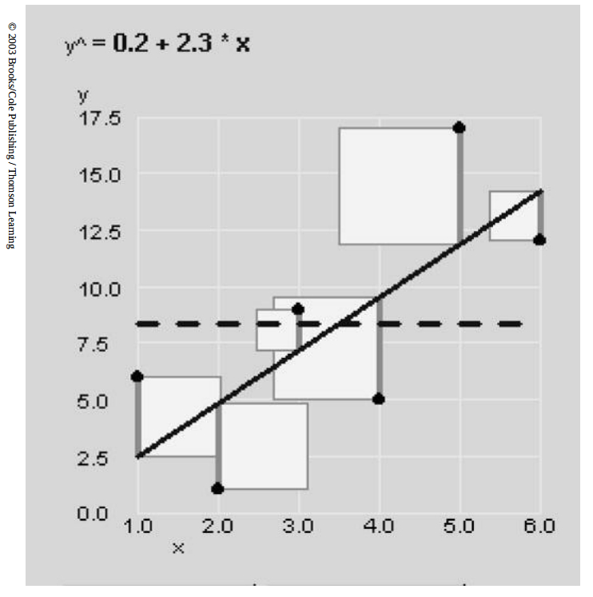
```

---

## Minste kvadraters metode

* Løsningen på minimeringsproblemet er
\begin{align*}
\widehat \beta_1 &= \frac{\sum_{i=1}^n \left(X_i - \overline X\right)(Y_i - \overline Y)}{\sum_{i=1}^n\left(X_i - \overline X\right)^2} = \frac{\textrm{Cov}(X,Y)}{\textrm{Var}(X)} \\
\widehat \beta_0 &= \overline Y - \widehat\beta_1\overline X
\end{align*}
* Dette regner vi vanligvis ikke på for hånd! Vi legger dataene inn i R eller tilsvarende programmer og lar datamaskinen gjøre beregningene!

---

## La oss repetere forutsetningene for OLS

i. $\textrm{E}{(\epsilon) = 0}$
  - Tilnærmet trivielt når modellen har et konstantledd

ii. ${\sigma_{\epsilon}}$ er konstant for alle ${X}$
  - Brudd på denne forutsetningen kalles heteroskedastisitet

iii. ${\epsilon_i}$ er uavhengig av ${\epsilon_j}$ for alle $i$ og $j$
  - Et vanlig brudd på denne forutsetningen er autokorrelasjon

iv. Dersom $X$-variabelen ikke er deterministisk, men stokastisk, må den være uavhengig av $\epsilon$
  - Brudd på denne forutsetningen er svært alvorlig i mange sammenhenger, fordi det skaper forventningsskjeve estimater. Avhengighet mellom $X$ og $\epsilon$ kalles endogenitet. Det er et sentralt tema i økonometri, men er ikke behandlet i boken.


---

## En forutsetning til 

v. Tilleggsforrutsetning: Normalitet
  - Vanligvis er vi ikke fornøyde med bare å beregne $\widehat\beta_0$ og $\widehat\beta_1$ (som er punktestimater for de ukjente parameterne $\beta_0$ og $\beta_1$)
  - Vi ønsker også å kunne teste hypoteser og lage konfidensintervaller basert på modellen
  - *Da må vi gjøre en tilleggsantagelse om at* $\epsilon$ *er normalfordelt*

---

## Aktuelle problemstillinger for oss

Den estimerte regresjonsligningen 

$$\widehat Y = \widehat\beta_0 + \widehat\beta_1 X$$ 

kan brukes til å

I. Teste forklaringsvariabelens betydning

II. Estimere $\textrm{E}(Y)$ ( $\widehat{Y}$ med konfidensintervall ) for gitte $X$-verdier
  - Estimert $\textrm{E}(Y)$ er en usikker størrelse fordi $\beta$'ene er usikre
  
III. Predikere ny $Y$ ( $\widehat{Y}$ med prediksjonsintervall ) for gitte $X$-verdier
  - Faktiske nye observasjoner av $Y$ vil avvike fra estimert forventet verdi av to grunner:
    - Avvik mellom estimert og sann $\textrm{E}(Y)$ (usikre $\beta$'er som over)
    - De stokastiske feilleddene $\epsilon$
    
IV. Vurdere om den lineære regresjonsmodellen passer til datasettet (diagnose).

---

## I. Teste hypoteser om stigningstallet

Hvis det er tilstrekkelig mange observasjoner og det ikke er noen sammenheng mellom $X$ og $Y$ vil vi estimere en flat regresjonslinje.

```{r, echo = FALSE, message = FALSE, fig.retina = 3, fig.width=10, fig.height = 6.5}
set.seed(1)
n <- 500
x <- runif(n)
y = rnorm(n)
plot(x, y, xaxt = "n", yaxt = "n", xlab = "", ylab = "",
     bty = "l", pch = 20, xlim = c(0, 1.6))
abline(h = 0, lwd = 2)
abline(lm(y ~ x), lty = 2)
legend("topright",
       c(expression(paste("Sann linje med ", beta[1] == 0)),
         expression(paste("Estimert linje med ", hat(beta)[1] %=~% 0))),
       lwd = c(2, 1),
       lty = c(1, 2),
       bty = "n")
```

---

## I. Teste  hypoteser om stigningstallet

* Med et begrenset antall observasjoner vil vi kunne få tilfeldige avvik fra null selv om det ikke er noen sann sammenheng mellom $X$ og $Y$
* Vi har derfor behov for å kunne teste hypoteser om størrelsen på de sanne koeffisientene ( $\beta$’ene ) med utgangspunkt i de estimerte verdiene ( $\widehat\beta$’ene )
* Vi ønsker vanligvis å teste nullhypotesen
$$H_0: \beta_1 = 0 \,\,\, \textrm{ mot } H_A:\beta_1\neq 0$$
* En egnet testobservator er 
$$T = \frac{\widehat \beta_1 - \textrm{E}(\widehat \beta_1)}{S(\widehat\beta_1)} = \frac{\widehat\beta_1 - \beta_1}{S(\widehat\beta_1)} = \frac{\widehat\beta_1}{S(\widehat\beta_1)}$$
* Testobservatoren er $t$-fordelt med $n-2$ frihetsgrader under $H_0$

---

## I. Teste  hypoteser om stigningstallet

* For å utføre testen trenger man standardavviket til $\widehat\beta_1$
* Dette er
$$S(\widehat\beta_1) = S_{\widehat\beta_1} = \frac{S_{\epsilon}}{\sqrt{(n-1)S_X^2}}$$
* Vi ser at standardavviket
    + øker med variansen til $\epsilon$
    + avtar med antall observasjoner, $n$
    + avtar med variasjonen til forklaringsvariabelen, $X$
* Regresjonsprogrammer oppgir typisk T-verdi for hver estimert koeffisient, og tilhørende P-verdi for tosidig test (Hvis ensidig test er det relevante må oppgitt P-verdi halveres) 
* En kan også bruke T-test til å teste mot andre verdier enn null

---

## Konfidensintervall for $\beta$-estimatene

* Når vi har estimert en effekt som er signifikant forskjellig fra null vil vi være interessert i å beregne et konfidensintervall for størrelsen på effekten
* Det er enkelt når vi kjenner standardavviket til koeffisienten
$$\beta_1 \in \left[\widehat\beta_1 - k\cdot S\left(\widehat\beta_1\right), \widehat\beta_1 + k\cdot S\left(\widehat\beta_1\right)\right]$$
der $k = t_{1-\alpha/2}$ hentes fra $T$-tabell med $n-2$ frihetsgrader
* Med 95% prediksjonsintervall og stor $n$ blir $k=1.96$
* I bileksempelet er $n = 100$, og $t_{0.975, 98} = 1.98$, så et 95% konfidensintervall for $\beta_1$ er

$$\big[0.067 \pm 1.98\cdot0.005\big] = \big[0.0571, 0.0769\big]$$

- Vi kan se at $\beta_1$ er signifikant forskjellig fra 0 på 5% signifikansnivå, ved at et 95% konfidensintervall ikke inneholder null..

---

## Aktuelle problemstillinger for oss

Den estimerte regresjonsligningen 

$$\widehat Y = \widehat\beta_0 + \widehat\beta_1 X$$ 

kan brukes til å

I. Teste forklaringsvariabelens betydning

II. Estimere $\textrm{E}(Y)$ ( $\widehat{Y}$ med konfidensintervall ) for gitte $X$-verdier
  - Estimert $\textrm{E}(Y)$ er en usikker størrelse fordi $\beta$'ene er usikre
  
III. Predikere ny $Y$ ( $\widehat{Y}$ med prediksjonsintervall ) for gitte $X$-verdier
  - Faktiske nye observasjoner av $Y$ vil avvike fra estimert forventet verdi av to grunner:
    - Avvik mellom estimert og sann $\textrm{E}(Y)$ (usikre $\beta$'er som over)
    - De stokastiske feilleddene $\epsilon$
    
IV. Vurdere om den lineære regresjonsmodellen passer til datasettet (diagnose).


---

## II. Konfidensintervall for $\textrm{E}(Y)$

* Et 95% konfidensintervall for $\textrm{E}(Y|X)$ konstrueres som 
$$\widehat Y \pm t_{\alpha/2, n-2}\cdot S\left(\widehat Y\right)$$
der $t_{\alpha/2, n-2}$ er kritisk grense fra en $t$-fordeling.
* Formelen for $S\left(\widehat Y\right)$ er
$$S\left(\widehat Y\right) = S_{\epsilon}\sqrt{\frac{1}{n} + \frac{(X-\overline X)^2}{(n-1)S_X^2}}$$
der de to leddene har med usikkerhet i hhv. konstantleddet og stigningstallet å gjøre

---

## II. Konfidensintervall for $\textrm{E}(Y)$

* Dette ser vi enklere ved å skrive uttrykket om til
$$S\left(\widehat Y\right) = \sqrt{\frac{S_{\epsilon}^2}{n} + \left[S(\widehat\beta_1)\right]^2\cdot\left(X-\overline X\right)^2}$$
* Merk at første leddet er identisk med uttrykket for variansen til et gjennomsnitt i målemodellen, og at usikkerheten til det estimerte stigningstallet ( $\widehat\beta_1$ ) gjør at konfidensintervallet til $\widehat Y$ vider seg ut jo lengre $X$-verdiene ligger fra sitt gjennomsnitt.
* Vi kan tenke på $S(\widehat Y)$ som usikkerheten til vårt estimat for gjennomsnittet av mange $Y$-verdier for gitt $X$

---

## Aktuelle problemstillinger for oss

Den estimerte regresjonsligningen 

$$\widehat Y = \widehat\beta_0 + \widehat\beta_1 X$$ 

kan brukes til å

I. Teste forklaringsvariabelens betydning

II. Estimere $\textrm{E}(Y)$ ( $\widehat{Y}$ med konfidensintervall ) for gitte $X$-verdier
  - Estimert $\textrm{E}(Y)$ er en usikker størrelse fordi $\beta$'ene er usikre
  
III. Predikere ny $Y$ ( $\widehat{Y}$ med prediksjonsintervall ) for gitte $X$-verdier
  - Faktiske nye observasjoner av $Y$ vil avvike fra estimert forventet verdi av to grunner:
    - Avvik mellom estimert og sann $\textrm{E}(Y)$ (usikre $\beta$'er som over)
    - De stokastiske feilleddene $\epsilon$
    
IV. Vurdere om den lineære regresjonsmodellen passer til datasettet (diagnose).

---

## III. Prediksjonsintervall for ny $Y$

* Et intervall som med gitt sannsynlighet fanger opp enkeltstående nye verdier av $Y$ for gitte verdier av $X$ kalles prediksjonsintervall
* Dette vil være videre enn konfidensintervallet til $\textrm{E}(Y)$, siden det omfatter både usikkerhet i estimeringen av $\textrm{E}(Y)$ og at realisert $Y$ varierer omkring $\textrm{E}(Y)$
* For å beregne et prediksjonsintervall trenger vi å kjenne standardavviket til avviket mellom en ny $Y$-verdi og dens estimerte forventning: $S\left(Y-\widehat Y\right)$

---

## III. Prediksjonsintervall for ny $Y$

* Generelt har vi at
\begin{align*}
S\left(Y-\widehat Y\right) &= \sqrt{S_{\epsilon}^2 + S\left(\widehat Y\right)^2} \\
&= S_{\epsilon}\sqrt{1 + \frac{1}{n} + \frac{\left(X - \overline X\right)^2}{(n-1)S_X^2}}
\end{align*}
* Et 95% konfidensintervall til $Y$ er for stor $n$
$$\widehat Y \pm 1.96\cdot S\left(Y-\widehat Y\right)$$

---

## En liten oppsummering av standardavvikene


|                                   |                                                     |
|-----------------------------------|-----------------------------------------------------|
| $S_{\epsilon}$                  | Estimert standardavvik til feilleddet               |
| $S\left(\widehat\beta_1\right)$ | Estimert standardavvik til stigningstallet          |
|                                   | (regresjonskoeffisienten til $X$)                 |
| $S\left(\widehat Y\right)$      | Estimert standardavvik til estimert forventet $Y$ |
| $S\left(Y-\widehat Y\right)$    | Estimert standardavvik til prediksjonsfeilen        |


Merk: dersom man bare skriver $S$ mener man vanligvis $S_{\epsilon}$

---

## Aktuelle problemstillinger for oss

Den estimerte regresjonsligningen 

$$\widehat Y = \widehat\beta_0 + \widehat\beta_1 X$$ 

kan brukes til å

I. Teste forklaringsvariabelens betydning

II. Estimere $\textrm{E}(Y)$ ( $\widehat{Y}$ med konfidensintervall ) for gitte $X$-verdier
  - Estimert $\textrm{E}(Y)$ er en usikker størrelse fordi $\beta$'ene er usikre
  
III. Predikere ny $Y$ ( $\widehat{Y}$ med prediksjonsintervall ) for gitte $X$-verdier
  - Faktiske nye observasjoner av $Y$ vil avvike fra estimert forventet verdi av to grunner:
    - Avvik mellom estimert og sann $\textrm{E}(Y)$ (usikre $\beta$'er som over)
    - De stokastiske feilleddene $\epsilon$
    
IV. Vurdere om den lineære regresjonsmodellen passer til datasettet (diagnose).

---

## Aktuelle problemstillinger for oss

Den estimerte regresjonsligningen 

$$\widehat Y = \widehat\beta_0 + \widehat\beta_1 X$$ 

kan brukes til å

I. Teste forklaringsvariabelens betydning

II. Estimere $\textrm{E}(Y)$ ( $\widehat{Y}$ med konfidensintervall ) for gitte $X$-verdier
  - Estimert $\textrm{E}(Y)$ er en usikker størrelse fordi $\beta$'ene er usikre
  
III. Predikere ny $Y$ ( $\widehat{Y}$ med prediksjonsintervall ) for gitte $X$-verdier
  - Faktiske nye observasjoner av $Y$ vil avvike fra estimert forventet verdi av to grunner:
    - Avvik mellom estimert og sann $\textrm{E}(Y)$ (usikre $\beta$'er som over)
    - De stokastiske feilleddene $\epsilon$
    
IV. Vurdere om den lineære regresjonsmodellen passer til datasettet (diagnose).

---

## Diagnose: Er modellen god?

```{r, echo = FALSE, fig.height = 3, fig.width = 9, fig.retina = 4}
n <- 100
x <- runif(n)
x3 <- seq(0, 1, length.out = n)
eps <- .1*rnorm(n)

y1 <- x + eps
y2 <- (x - 0.5)^2 + eps/3
y3 <- 3*x3 + eps*seq(.1, 5, length.out = n)^2

par(mfrow = c(1, 3))
plot(x, y1, xlab = "", ylab = "", bty = "l",  pch = 20,
     xaxt = "n", yaxt = "n", main = "Data 1")
abline(lm(y1 ~ x))
plot(x, y2, xlab = "", ylab = "", bty = "l",  pch = 20,
     xaxt = "n", yaxt = "n", main = "Data 2")
abline(lm(y2 ~ x))
plot(x3, y3, xlab = "", ylab = "", bty = "l",  pch = 20,
     xaxt = "n", yaxt = "n", main = "Data 3")
abline(lm(y3 ~ x3))
```


```{r, echo = FALSE, fig.height = 3, fig.width = 9, fig.retina = 4}
par(mfrow = c(1, 3))
plot(x, lm(y1 ~ x)$residuals, xlab = "", ylab = "", bty = "l", pch = 20,
     xaxt = "n", yaxt = "n")
abline(h = 0)
plot(x, lm(y2 ~ x)$residuals, xlab = "", ylab = "", bty = "l", pch = 20,
     xaxt = "n", yaxt = "n")
abline(h = 0)
plot(x3, lm(y3 ~ x3)$residuals, xlab = "", ylab = "", bty = "l", pch = 20,
     xaxt = "n", yaxt = "n")
abline(h = 0)
```

---

## Diagnose: Er modellen god?

De "beregnede" verdiene
$$\widehat Y = \widehat\beta_0 + \widehat\beta_1X$$
ligger på regresjonslinjen, og forskjellene
$$e_i = Y_i - \widehat Y_i$$
kalles *residualer* (eller restledd eller feilledd). 


*Residualene* $e_i$ *kan betraktes som estimater for de sanne feilleddene* $\epsilon_i$. *De kan brukes til å*

- Teste hvor godt regresjonslinjen føyer dataene
- Teste forutsetningene vi har gjort om $\epsilon$

---

## Diagnose: Er modellen god?

```{r, echo = F, out.width=800, fig.align='center'}
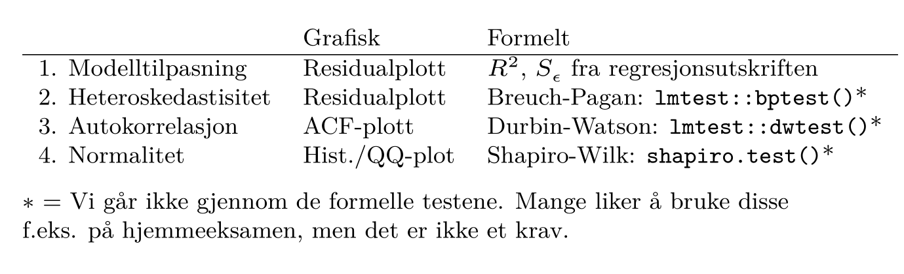
```

---

## Standardavviket til residualene, $S_{\epsilon}$
* Hvis modellen er god bør observasjonene “i gjennomsnitt” ligge nær regresjonslinjen
* Et mulig mål for dette er standardavviket til feilleddet, $\sigma_{\epsilon}$
* $\sigma_{\epsilon}$ er en ukjent parameter, men vi kan estimere den basert på de beregnede residualene $e_i$:
$$S_{\epsilon} = \sqrt{\frac{\sum_{i=1}^n\left(Y_i - \widehat Y_i\right)^2}{n-2}} = \sqrt{\frac{\sum_{i=1}^ne_i^2}{n-2}} = \sqrt{\frac{\textrm{SSE}}{n-2}}$$
* **Hva er** ${S_{\epsilon}}$ **i bileksempelet?** 

---

##  Forklaringsgraden, $R^2$

* Et annet og enda mer brukt mål på hvor godt modellen passer til dataene er forklaringsgraden, $R^2$, også kalt determinasjonskoeffisienten 
* $R^2$ er et mål på hvor stor andel av variasjonen i $Y$ modellen forklarer
* Et mål på den totale variasjonen i Y er “Total Sum of Squares”
$$\textrm{SS(Total)} = \sum_{i=1}^n\left(Y_i - \overline Y\right)^2$$

---

## Forklaringsgraden, $R^2$
* Den variasjonen i $Y$ som modellen *ikke* kan forklare er "sum of Sqared Errors"
$$\textrm{SSE} = \sum_{i=1}^n\left(Y_i - \widehat Y_i\right)^2 = \sum_{i=1}^ne_i^2$$
* Forklaringsgraden til modellen kan uttrykkes
$$R^2 = \frac{\textrm{SS(Total)} - \textrm{SSE}}{\textrm{SS(Total)}} = \frac{\textrm{forklart variasjon}}{\textrm{total variasjon}}$$
* En kan vise at $R^2$ er kvadratet av korrelasjonskoeffisienten, $r$, mellom $X$ og $Y$, derav navnet
* **Hva er** ${R^2}$ **i bileksempelet?** 

---

## Heteroskedastisitet

- Feilleddene skal ha lik varians, uavhengig av $X$
- I så fall forventer vi at et plott av feilleddene mot $X$-verdiene, evt. de predikerte $Y$-verdiene, ikke skal vise noe spesielt mønster
- Ikke sjelden kan variansen til feilleddene øke med økende verdier av $X$ eller $\widehat Y$
- Dette kalles heteroskedastisitet
- **Da er ikke lenger minste kvadraters metode den “beste” estimatoren og den statistiske inferensen (hypotesetester, konfidens- og prediksjonsintervaller) er ikke lenger korrekt, men estimatene er fortsatt forventningsrette**

---

## Typisk bilde av heteroskedastisitet

```{r, echo = F, out.width=800, fig.align='center'}
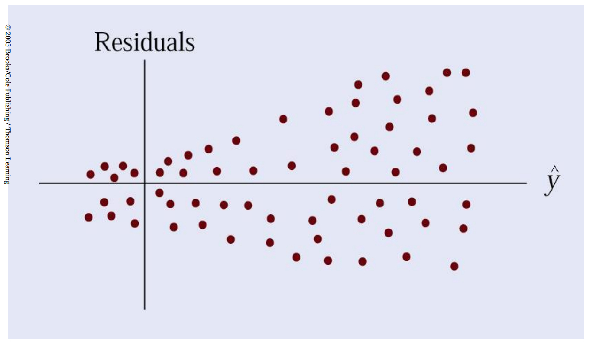
```

---

## Tydelig bilde av heteroskedastisitet

Resultat mot investert kapital for 250 store vestlandsbedrifter

```{r, echo = F, out.width=600, fig.align='center'}
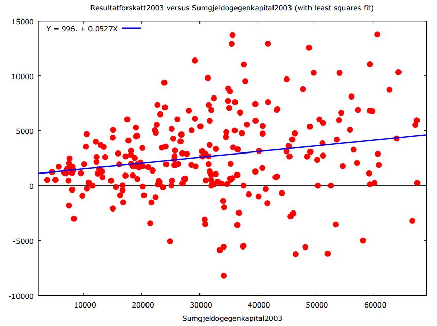
```

---

## Innbyrdes uavhengige feilledd

- Avhengighet mellom feilleddene til ulike observasjoner kan oppstå av forskjellige grunner
- Den vanligste årsaken er autokorrelasjon
- Autokorrelasjon kan oppstå i tidsseriedata og innebærer at feilleddet på tidspunkt $t$ er  positivt eller negativt korrelert med feilleddet på tidspunkt $t+1$
- Lik konkjunktursituasjon i to påfølgende perioder kan for eksempel gi positiv autokorrelasjon dersom vår modell ikke kontrollerer for konjunkturer 
- **Med autokorrelerte feilledd er ikke lenger minste kvadraters metode den “beste” estimatoren og inferens er ikke gyldig, men estimatene er fortsatt forventningsrette**

---

## Typisk bilde av tidsserie med negativ autokorrelasjon


```{r, echo = F, out.width=600, fig.align='center'}
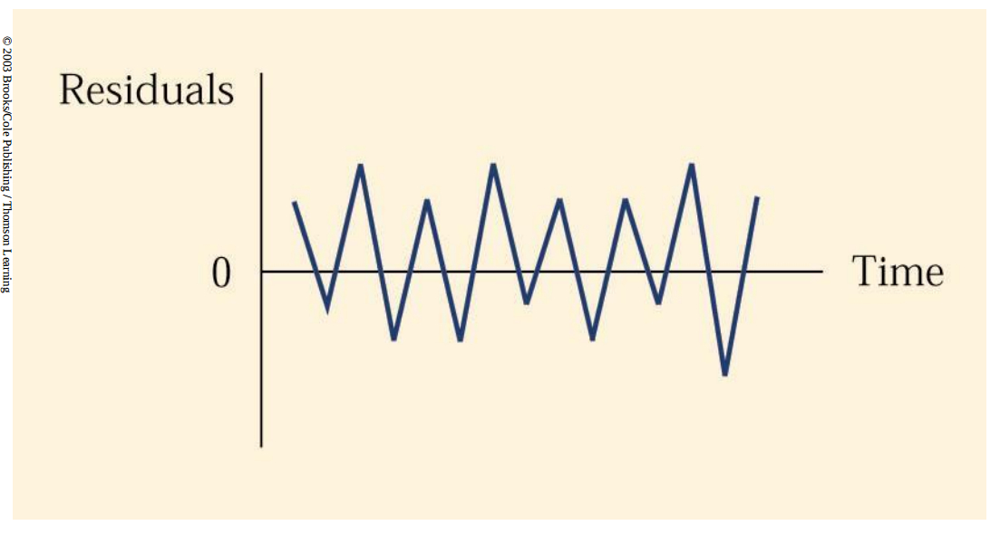
```

---

## Typisk bilde av tidsserie med positiv autokorrelasjon

```{r, echo = F, out.width=600, fig.align='center'}
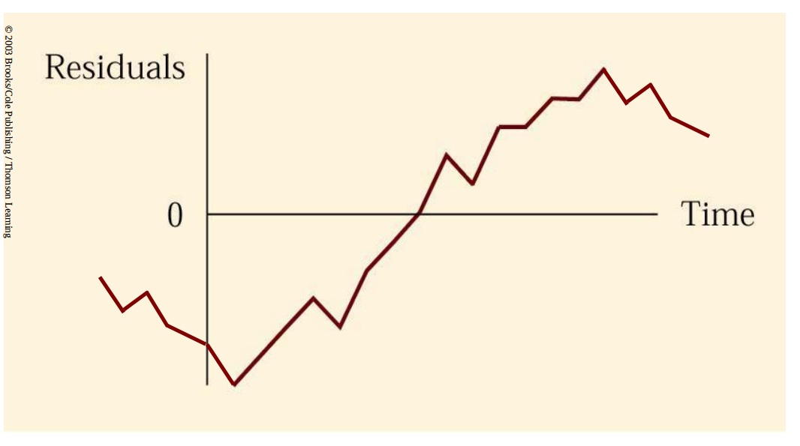
```

---

## Typisk bilde av tidsserie uten autokorrelasjon

```{r, echo = F, out.width=600, fig.align='center'}
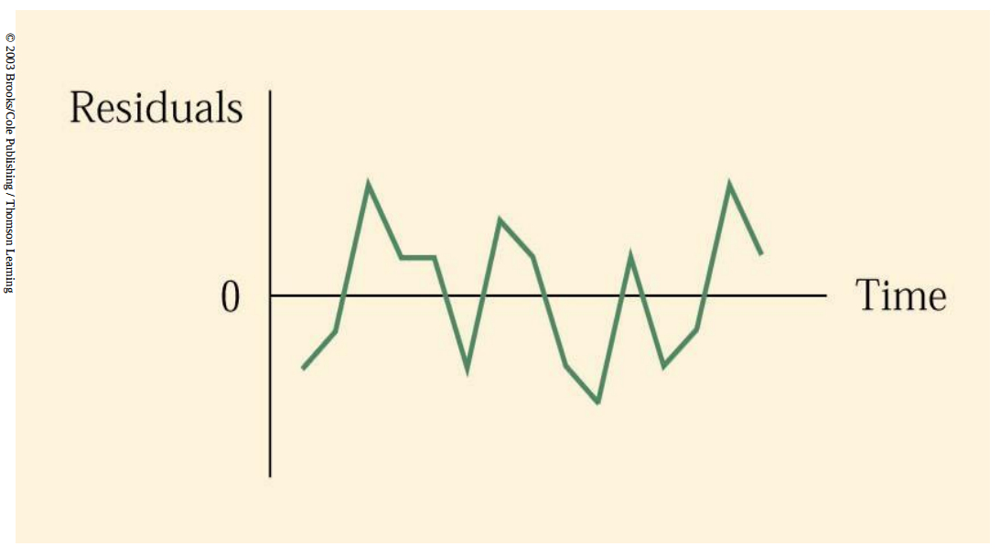
```

---

## Eksempel fra eksamen V17

```{r, echo = FALSE, fig.height = 6, fig.width = 8, fig.retina = 4, fig.align="center"}
oslo <- data.frame(fritak = c(4, 4.5, 3.8, 5.2, 0, 6, 2.8, 7.5, 14.1),
                   lesing = c(48, 52, 53, 53.5, 50, 52, 50, 52, 65))
oslofit1 <- lm(lesing ~ fritak, data = oslo)
plot(oslo$fritak, oslo$lesing,
     xlab = "Fritaksprosent", ylab = "Lesescore",
     pch = 20, bty = "l")
abline(oslofit1)
```

---

## Spesielt innflytelsesrike observasjoner 

- Vi ønsker å se nærmere på observasjoner som har stor innflytelse på hvor regresjonslinjen legges
- Dette vil typisk være avvikende observasjoner (“outliers”)
- **Dersom slike observasjoner skyldes feil i dataene, eller er atypiske er de svært skadelige for analysen**
- **Dersom det ikke er noe galt med disse observasjonene er de svært verdifulle for analysen**
- Er du i tvil bør du vurdere å rapportere resultater med og uten slike observasjoner
- R kan plukke dem ut for oss


---

## Vi tar bort den ekstreme observasjonen

```{r,echo = FALSE, fig.height = 6, fig.width = 8, fig.retina = 4, fig.align="center"}
oslofit2 <- lm(lesing ~ fritak, data = oslo[-9,])
plot(oslo$fritak, oslo$lesing,
     xlab = "Fritaksprosent", ylab = "Lesescore",
     pch = 20, bty = "l")
abline(oslofit1)
abline(oslofit2, col = "red")
points(oslo[9,], pch = 4, col = "red", cex = 2)
```

---

## Identifiserer innflytelsesrike observasjoner

- Cooks avstand (Cook's distance) er et mye brukt mål på en observasjons innflytelse.
- Cooks avstand til observasjon $i$ er et mål på hvor mye regresjonslinjen forandrer seg dersom man fjerner observasjon $i$. (Vi går ikke inn i detaljer her)
- Vi finner Cooks avstand (samt flere andre mål på innflytelse) ved hjelp av funksjonen `influence.measures()` i R.

---

## Oppsummering: Konsekvensen av brudd på forutsetningene som OLS bygger på

* Ikke konstant varians:
    + Vanlig minste kvadraters metode gir forventingsrette estimat, men det er ikke lenger den mest “effektive” estimatoren, og inferensen er ikke gyldig
* Ikke uavhengige feilledd:
    + Vanlig minste kvadraters metode gir forventingsrette estimat, men det er ikke lenger den mest “effektive” estimatoren, og inferensen er ikke gyldig
* Ikke normalfordelte feilledd:
    + Inferens er ikke gyldig i små utvalg, dvs. at hypotesetester, konfidensintervaller etc. kan bli feil. Hvis avvikene fra normalitet ikke er for sterke går inferens bra i store utvalg, og normalitet er heller ikke en forutsetning for at miste kvadraters metode skal være en “effektiv” estimator
* Ikke uavhengighet mellom forklaringsvariablene og feilleddet:
    + **Får forventningsskjeve estimater!!**
    + **Men, metoden kan fremdeles fungere for prediksjonsformål**

---

class: center, middle, inverse

# Del II: MULTIPPEL REGRESJON

---

## Multippel regresjon

Multippel regresjon er regresjon med flere forklaringsvariabler. Dengenerelle lineære regresjonsmodellen er

$$\textrm{E}(Y|X) = \beta_0 + \beta_1X_1 + \beta_2 X_2 + \cdots \beta_k X_k,$$

der de $k$ forklaringsvariablene antas lineært uavhengige.

Gitt $n$ sammenhørende observasjonssett

$$(Y_i, X_{i1}, X_{i2}, \ldots, X_{ik}), \qquad i = 1,2,\ldots,n,$$

kan vi skrive 

$$Y_i = \beta_0 + \beta_1X_{i1} + \beta_2X_{i2} + \cdots + \beta_kX_{ik} + \epsilon_i, \qquad i = 1,2,\ldots,n.$$

Koeffisientene estimeres fortsatt ved kjelp av minste kvadraters metode, dvs $\widehat \beta_0, \widehat\beta_1, \ldots, \widehat\beta_k$ velges slik at de kvadrerte observerte residualene under minimeres:

$$\textrm{SSE}(\beta_0, \beta_1, \ldots, \beta_k) = \sum_{i=1}^n\left(Y_i - \widehat Y\right)^2$$

---

## Grafisk illustrasjon av regresjon med to forklaringsvariabler

```{r, echo = F, out.width=600, fig.align='center'}
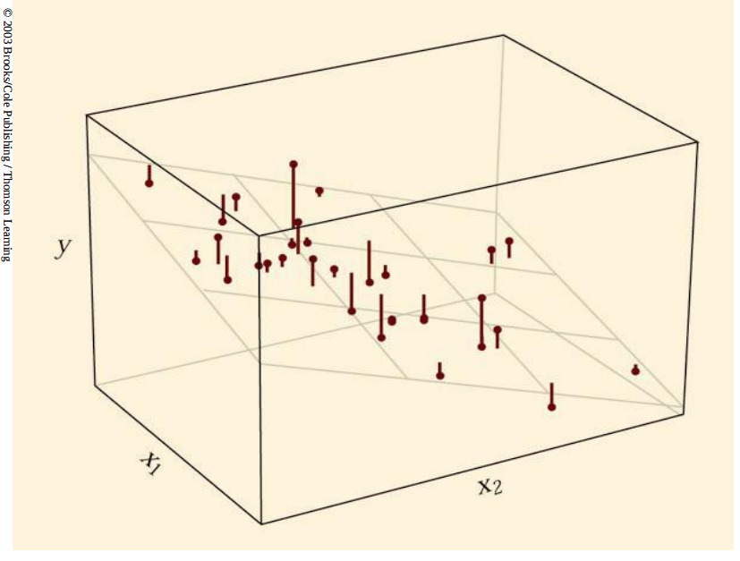
```

---

## Multippel regresjon

* Alt vi har lært om den enkle regresjonsmodellen lar seg generalisere til en situasjon med flere variabler, men
    + formlene blir kompliserte og krever bruk av matrisenotasjon
    + antall frihetsgrader blir $(n-k-1)$, der $k$ er antall forklaringsvariabler
    + “regresjonslinjen” blir et plan i tilfellet med to forklaringsvariabler og generelt et hyperplan som ikke lar seg illustrerer grafisk
Nye tema:

1. Justert $R^2$
2. Multikolinearitet
3. F-test

---

## I - Justert $R^2$

* $R^2$ er det mest brukte (og misbrukte?) målet på forklaringskraft
* Jo flere forklaringsvariabler vi legger til modellen desto høyere $R^2$
* $R^2$ øker selv om nye variabler ikke har reell forklaringskraft
    + med $k = (n-1)$ vil all variasjon bli forklart dvs. $R^2=1$, idet vi da kan legge et “plan” gjennom alle punktene.
    + jfr. figur med $n=2$ og $k=1$
* En modell med flere forklarende variabler og høyere $R^2$ behøver ikke ha bedre prediksjonsevne, idet en da må estimere flere parametere som det hefter usikkerhet ved.
* **Forklaringsgraden til modellen bør derfor korrigeres for antall forklaringsvariabler (frihetsgrader) dersom vi skal sammenligne modeller med ulikt antall forklaringsvariabler.**
* I regresjons-utskrifter oppgis det en justert $R^2$ som tar hensyn til dette
    + Merk at vi kun kan sammenligne modeller med samme $Y$-variabel

---
    
## I - Justert $R^2$

* **Formelen for** ${R^2}$ **er**
$$R^2 = \frac{\textrm{forklart variasjon}}{\textrm{total variasjon}} = \frac{\textrm{SS(Total)} - \textrm{SSE}}{\textrm{SS(Total)}} \\
= 1-\frac{\textrm{SSE}}{\textrm{SS(Total)}}$$
- **Formelen for justert** ${R^2}$ **er**
$$R^2_{\textrm{justert}} = 1-\frac{\textrm{MSE}}{\textrm{MS(Total)}} = 1-\frac{\textrm{SSE}/(n-k-1)}{\textrm{SS(Total)}/(n-1)}$$
* **Men vi kan ikke bruke** ${R^2}$ **til å sammenligne modeller med forskjellige responsvariabler!!**

---

## II - Multikolinearitet

* Multikollinearitet har vi når noen av forklaringsvariablene samvarierer sterkt, dvs. at en regresjon av en forklaringsvariabel mot de øvrige forklaringsvariablene får høy $R^2$

---

## Perfekt multikolinearitet

* *Perfekt* multikollinearitet er et brudd på forutsetningen for minste kvadraters metode om at forklaringsvariablene skal være lineært uavhengige
* Anta at du skal estimere
$$Y = \beta_0 + \beta_1X_1 + \beta_2X_2 + \epsilon$$
* Anta videre at i datasettet er alltid $x_2$ lik $2x_1$
* Det er da åpenbart at man ikke kan få ut selvstendige estimat for både $\beta_1$ og $\beta_2$

---

## Tilnærmet multikolinearitet

* Dersom $x_2\approx2x_1$ har vi ikke formelt brudd på forutsetningene for miste kvadraters metode og kan regne ut selvstendige estimater for $\beta_1$ og $\beta_2$
* Disse estimatene vil imidlerid bli svært usikre. Når $x_2$ og $2x_1$ beveger seg nesten i takt er det vanskelig å skille de to effektene fra hverandre.
    + Typisk vil $\beta_1$ og $\beta_2$ være ikke-signifikante hver for seg mens de sammen er sterkt signfikante (krever F-test, se senere)
    + Det reflekterer at vi kan få et presist estimat for $\beta_1+2\beta_2$, men vi vet ikke hvor mye hver av variablene bidrar med. 
    + Små endringer i datamaterialet kan da gi store utslag i $\beta_1$ og $\beta_2$, men på en slik måte at $\beta_1+2\beta_2$ endres lite
    + For prediksjonsformål er dette uproblematisk hvis $x_1$ og $x_2$ alltid er sterkt korrelerte
    
---

## Multikolinearitet er ikke nødvendigvis et problem

* I en generell multippel regresjon er
$$S(\widehat\beta_j) = \frac{S_{\epsilon}}{\sqrt{(n-1)S_{X_j}^2}}\times\underbrace{\frac{1}{\sqrt{1-R_j^2}}}_{\text{Variance inflation} \atop\text{factor (VIF)}}$$
der $R_j^2$ er $R^2$ fra en regresjon av $X_j$ mot de andre forklaringsvariablene
* Parameterestimatet vil altså ha lav presisjon hvis 
    + $S_{\epsilon}$ er høy (mye støy)
    + Vi har få observasjoner, $n$
    + Det er lite variasjon i $X_j$ **eller**
    + $R_j^2$ er høy (multikolinearitet)
* Multikollinearitet er altså verken nødvendig eller tilstrekkelig betingelse for lav presisjon 
* Vi kan bruke funksjonen `vif()` i R til å regne ut VIF.

---

## Mulige løsninger hvis multikolinearitet er et problem

* Det finnes ingen statistisk teknikk som kan løse problemet
* Mulige “løsninger” er da
    + Tenke grundigere gjennom hvilke spørsmål vi kan svare på (har for eksempel “ $\beta_1+2\beta_2$ ” en selvstendig tolkning?)
    + Fjerne en av de sterkt korrelerte variablene, hvis den ikke er viktig i modellen. Det vil redusere variansen til de gjenværende parametrene, i bytte mot at de blir skjeve/får en annen tolkning.

---

## F-test i multippel regresjon

- Vi husker tilbake til problemet om multippel testing.
- Vi må tenke på det samme når vi leser en regresjonstabell:
- Det at vi ikke forkaster hypotesene $\beta_1 = 0$ og $\beta_2 = 0$ hver for seg betyr **ikke** at vi ikke kan forkaste hypotesen $\beta_1 = \beta_2 = 0$.
- Til det trenger vi en egen test, og det er vanlig i regresjonsutskrifter  å rapportere resultatet for testen
$$\beta_1 = \beta_2 = \cdots = \beta_k = 0.$$
- Dette er en $F$-test (vi går ikke inn i detaljer).

---

## Tolking av parametrene i multippel regresjon

- **Koeffisienten til en gitt variabel angir *den forventede* endringen i Y for én enhet endring i denne X-verdien, gitt at alle de andre X-verdiene holdes uforandret**
* MEN HUSK: Dersom en inkludert forklaringsvariabel er korrelert med en relevant *utelatt* forklaringsvariabel, vil den inkluderte variabelen delvis plukke opp effekten av den utelatte variabelen
    + Den inkluderte variabelen er da endogen og koeffisienten kan ikke tolkes kausalt!
* **Statistisk signifikans versus økonomisk signifikans**
    + At en effekt er statistisk signifikant betyr ikke nødvendigvis at den er viktig. Med nok data vil selv den mest ubetydelige gjennomsnittsforskjell fremstå som statistisk signifikant 
    + Tilsvarende, en effekt kan godt være reell og viktig selv om den ikke framstår som statistisk signifikant. Problemet kan være høy varians og for få observasjoner
* **Tolkning av konstantleddet**
    + Konstantleddet må tolkes med stor varsomhet dersom vi ikke har observasjoner i nærheten av $X_i=0$ for alle $i$
    + Gjelder både multippel og enkel regresjon

---

class: center, middle, inverse

# Del III: MODELLBYGGING

---

## Eksempel fra eksamen V17

* Hvert år gjennomføres nasjonale prøver i lesing, regning og engelsk, for 5., 8. og 9. trinn.
* Vi har data fra en slik prøve, der vi har registrert gjennomsnittlig score på leseprøven for hver enkelt kommune.
* Vi har i tillegg en del ekstra informasjon fra hver kommune.
* Kan vi forklare resultat på leseprøven med noen av de andre variablene?

---

## F-test

* En vanlig «regresjonsfelle» er å prøve og feile helt til man får en regresjonsmodell som *ser bra ut*.
* Men husk at enhver stjerne (eller mangel på stjerne) er resultatet av en statistisk test.
* `F-statistic` er testobservatoren i følgende test:

\begin{align*}
&H_0: \beta_1 = \cdots = \beta_k = 0 \\
&H_A: \textrm{Minst en koeffisient er forskjellig fra null.}
\end{align*}

* Observatoren er $F$-fordelt under nullhypotesen, og testen er nært beslektet med variansanalyse (som ikke i seg selv er pendum i MET4).

---

## F-test

* Kan brukes til å teste signifikans av *grupper av variable*:

```{r, eval = F}
reg_liten <- lm(lesing ~ log(folketall), data = skoledata)
reg_stor  <- lm(lesing ~ log(folketall) + 
                             driftsutgifter + 
                             nynorsk, data = skoledata) 

anova(reg_liten, reg_stor)
```

```{}
Analysis of Variance Table

Model 1: lesing ~ log(folketall)
Model 2: lesing ~ log(folketall) + driftsutgifter + nynorsk
  Res.Df    RSS Df Sum of Sq      F Pr(>F)
1    383 1989.7                           
2    381 1972.2  2    17.494 1.6898 0.1859
```

---

## Modellbygging

* Vi har ofte data på mange variable i et datasett, og stiller oss følgende spørsmål:
    + Hvilke variable skal være med?
    + Hvor mange variable skal være med?
    + Skal noen av variablene transformeres? Hvis ja, hvordan? Polynom, log, ...?
    + Hvilke kriterier skal vi bruke for å vurdere de ulike modellene?
* Disse spørsmålene har ikke matematiske eller universelle svar. Vi kan lære mye av å prøve ut forskjellige varianter.
    + Men vi trenger noen strategier for å angripe datasettet.

---

## Antall sider vs. antall poeng v/ MET4 V17

```{r, echo = F, out.width=500, fig.align='center'}
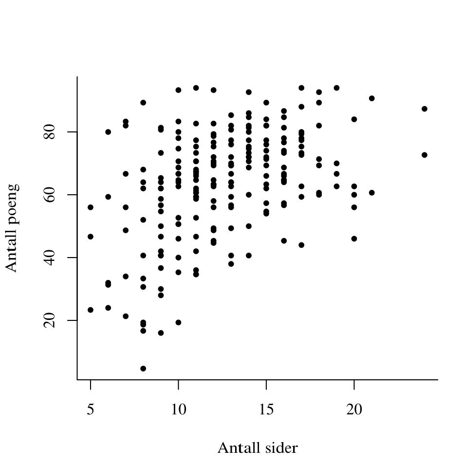
```

---

## Antall sider vs. antall poeng v/ MET4 V17


```{}
Call:
lm(formula = poeng ~ pagelength, data = eks)

Residuals:
   Min     1Q Median     3Q    Max 
-49.16 -12.24   2.40  10.26  35.50 

Coefficients:
            Estimate Std. Error t value Pr(>|t|)    
(Intercept)  37.0576     3.8743   9.565  < 2e-16 ***
pagelength    2.0967     0.2957   7.092 1.99e-11 ***
---
Signif. codes:  0 ‘***’ 0.001 ‘**’ 0.01 ‘*’ 0.05 ‘.’ 0.1 ‘ ’ 1

Residual standard error: 15.93 on 210 degrees of freedom
Multiple R-squared:  0.1932,	Adjusted R-squared:  0.1894 
F-statistic: 50.29 on 1 and 210 DF,  p-value: 1.988e-11
```

---

## Antall sider vs. antall poeng v/ MET4 V17

```{r, echo = F, out.width=500, fig.align='center'}
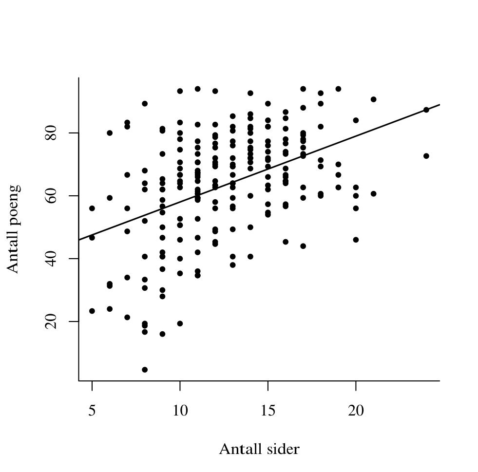
```

---

## Antall sider vs. antall poeng v/ MET4 V17

```{}
Call:
lm(formula = poeng ~ pagelength + square, data = eks2)

Residuals:
    Min      1Q  Median      3Q     Max 
-46.853 -10.885   1.584  10.383  37.814 

Coefficients:
            Estimate Std. Error t value Pr(>|t|)    
(Intercept)   9.3918    10.3177   0.910  0.36373    
pagelength    6.6348     1.5995   4.148 4.88e-05 ***
square       -0.1711     0.0593  -2.885  0.00432 ** 
---
Signif. codes:  0 ‘***’ 0.001 ‘**’ 0.01 ‘*’ 0.05 ‘.’ 0.1 ‘ ’ 1

Residual standard error: 15.66 on 209 degrees of freedom
Multiple R-squared:  0.2241,	Adjusted R-squared:  0.2167 
F-statistic: 30.19 on 2 and 209 DF,  p-value: 3.044e-12
```

---

## Antall sider vs. antall poeng v/ MET4 V17

```{r, echo = F, out.width=500, fig.align='center'}
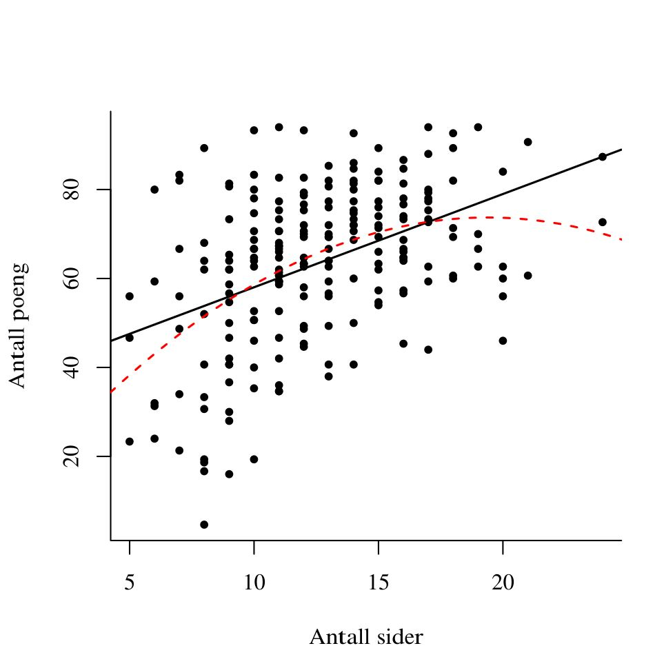
```

---

## Polynomtransformasjoner

- Vi kan bruke lineær regresjon til å tilpasse polynommodeller, f.eks.
$$\textrm{E}(Y|X) = \beta_0 + \beta_1X + \beta_2X^2.$$
- I praksis gjør vi det ved å legge til $X^2$ som en ny kolonne, og bruke den som forklaringsvariabel på vanlig måte.
- Kan brukes til å fange opp ikke-lineære sammenhenger.
    
.small[Eksempel: Forsikringsselskap ønsker å modellere *forventet* skadeutbetaling for kundene sine slik at de kan beregne riktig pris på forsikrking. Ved bilforsikring er *alder* en viktig faktor, der unge sjåfører gjør mer skade, men at forventet skadeutbetaling går ned med alderen. En fin oppgave for lineær regresjon! Problemet er bare at skadefrekvensen går litt opp for eldre igjen. Det kan enkelt fanges opp med et svakt positivt andregradsledd for alder i regresjonen.]

- **Gir ikke dette mulikolinearitet?** Nei, fordi det handler om *lineær* avhengighet mellom forklaringsvariablene; $X$ og $X^2$ er ikke lineært avhengige.
- **Hva med fortolkningen?** Vi kan *ikke* lenger tolke $\beta_1$ som "en enhets økning i $X$ henger sammen med $\beta_1$ enhets økning i $Y$".
- **Forsiktig!!** Polynomer, spesielt når vi øker graden, kan gi veldig store utslag. Bruk med forsiktighet, og vær ekstra forsiktig med å ekstrapolere.

---

## Funksjonsform og transformasjoner

* Heteroskedastisitet, ikke-normalfordelte feilledd, avvikende observasjoner og andre problemer kan være en konsekvens av feil funksjonsform.
* Minste kvadraters metode kan brukes på en langt videre klasse av modeller enn den lineære og polynomiske som vi har sett så langt, f.eks

$$\textrm{E}(Y|X) = \beta_0 + \beta_1X_1 + \beta_2X_2 + \beta_3\frac{\sqrt{X_1}}{X_2} + \beta_4\cos(X_1) + \beta_5\textrm{e}^{X_1X_2^3}$$ 

* Mange funksjoner som er *ikke-lineære i parametrene* kan transformeres til uttrykk som er *lineære i parametrene*.
    + Alle modeller som er lineære i parametrene kan estimeres med minste kvadraters metode.
    + En del standard transformasjoner er derfor nyttig å kjenne til.
    + En annen interessant retning (som ikke vi skal gå) er *ikke-lineær* regresjon. Der trenger vi ikke bry oss om funksjonsform i hele tatt.

---
    
## Dummyvariabler (også kalt indikatorvariabler)

* En dummyvariabel er en variabel som er enten null eller én, og brukes vanligvis til å skille ut ulike kategorier som kvinner, ulike yrkesgrupper osv.
* Dummyvariabler har mange anvendelser, men brukes særlig til å “utvide” funksjonsformen slik at ulike grupper kan ulikt gjennomsnitt og/eller ulik respons
    + Vi skal her ta for oss dummyvariabler på høyresiden, men man kan også ha en dummyvariabel som venstresidevariabel. Dette behandles under temaet kategorisk (logistisk) regresjon
    
---
    
## Ulikt konstantledd

* Hvis datasettet består av observasjoner fra to grupper som kan forventes å ha ulikt konstantledd, kan dette modelleres ved å inkludere en dummyvariabel for den ene gruppen, for eksempel
$$\ln W = \beta_0 + \beta_1D_{\textrm{kvinne}} + \beta_2\textrm{edu} + \epsilon$$
* For hvert utdanningsnivå tillater vi nå kvinner å ha en annen gjennomsnittslønn enn menn. Vi kan teste denne hypotesen ved å se om $\beta_1$ er forskjellig fra null
* Merk at for å unngå perfekt kollinearitet (*dummy variable trap*) må da én næring utelates, jfr. at vi ikke har dummy både for menn og kvinner. Den utelatte kategorien “fanges opp” av $\beta_0$ og de andre næringene måles i forhold til denne.

---

## Ulikt konstantledd

```{r, echo = F, out.width=500, fig.align='center'}
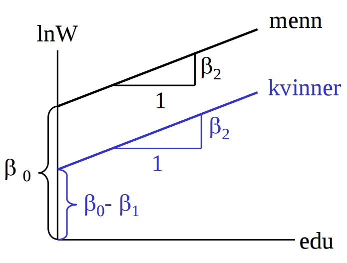
```

---

## Ulikt konstantledd


- Spesifikasjonen kan lett utvides til en situasjon med mange kategorier, for eksempel testing av lønnsforskjeller mellom næringer:

$$\ln W = \beta_0 + \sum_{i=1}^{n-1}\beta_iD_i^{\textrm{næring}} + \beta_n\textrm{edu} + \epsilon$$

```{r, echo = F, out.width=500, fig.align='center'}
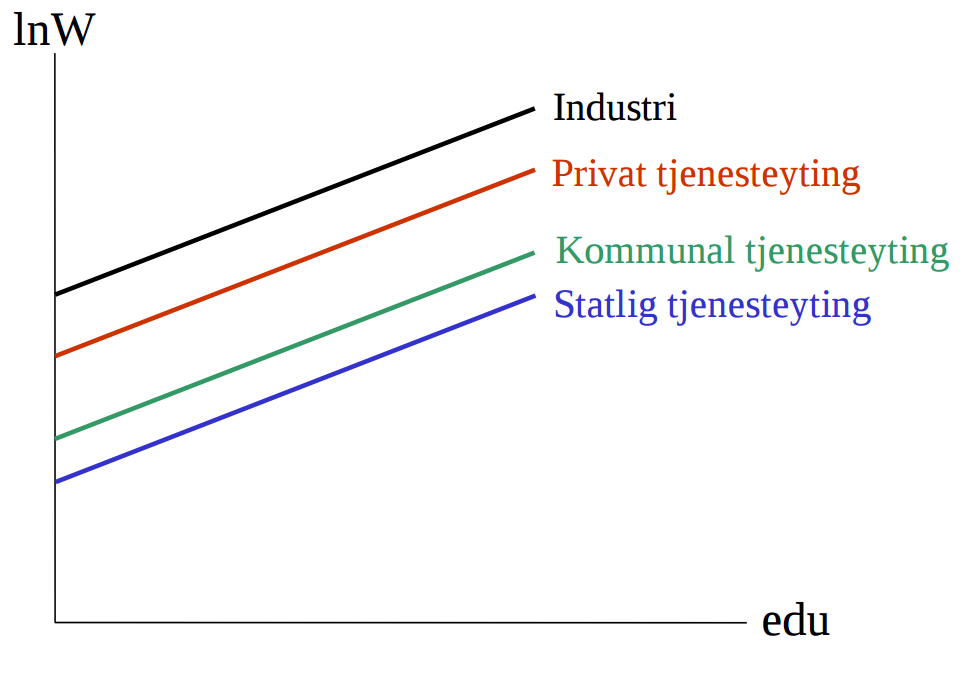
```

---

## Ulikt konstantledd

- Merk at for å unngå perfekt kollinearitet (*dummy variable trap*) må da én næring utelates, jfr. at vi ikke har dummy både for menn og kvinner. Den utelatte kategorien “fanges opp” av $\beta_0$ og de andre næringene måles i forhold til denne.

---

## Ulike stigningstall

* Dummyvariabler kan også brukes til å la to grupper ha ulikt stigningstall
* Hvis vi vil teste om menn og kvinner har ulik avkastning på utdanning kan vi bruke spesifikasjonen

$$\ln W = \beta_0 + \beta_1\textrm{edu} + \beta_2\textrm{edu}\cdot D_{\textrm{kvinne}} + \epsilon$$

```{r, echo = F, out.width=400, fig.align='center'}
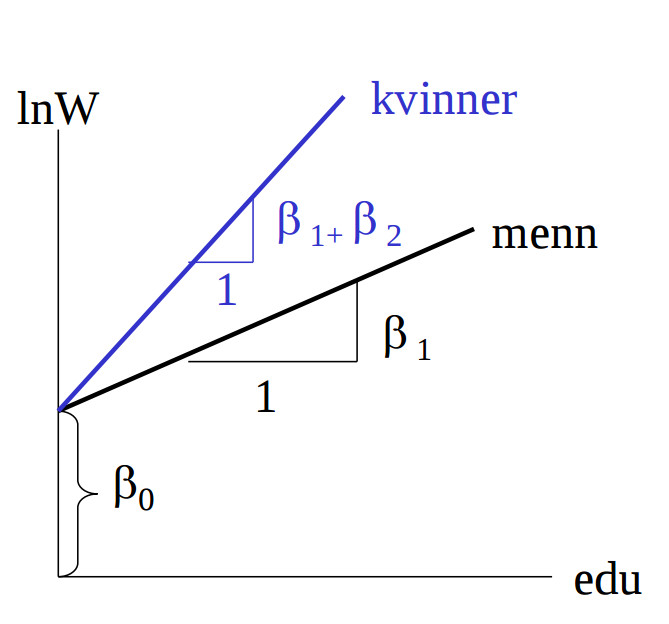
```

---

## Ulikt konstantledd *og* ulikt stigningstall

- Anta at kvinner har høyere avkastning på utdanning på enn menn som vist i figuren, men at de samtidig lavere gjennomsnittslønn for gitt utdanning. Da vil vi neppe få estimert positiv $\beta_2$. Derfor bør vi tillate både konstantleddet og stigningstallet å være forskjellig, dvs. estimere:

$$\ln W = \beta_0 + \beta_1D_{\textrm{kvinne}} + \beta_2\textrm{edu} + \beta_3\textrm{edu}\cdot D_{\textrm{kvinne}} + \epsilon$$

```{r, echo = F, out.width=400, fig.align='center'}
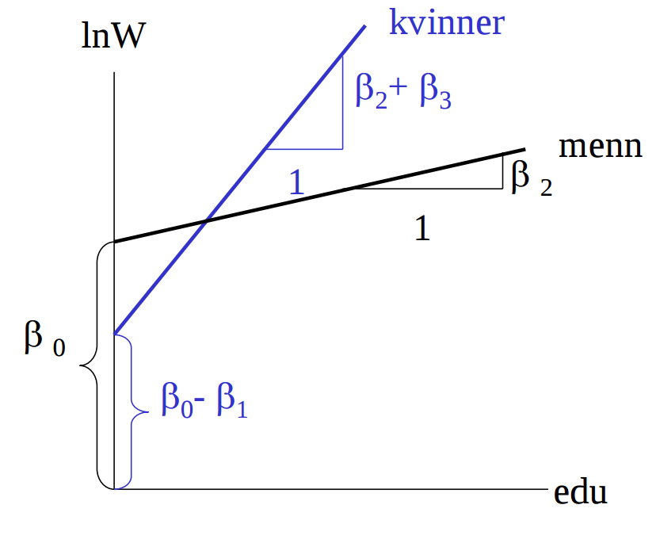
```

---

## Variabelutvelgelse og faremomenter

* Ønsker en enkel modell som får fram de viktigste trekkene ved virkeligheten
* Ideelt sett bør modellutformingen ha et teoretisk fundament, men teorien strekker sjelden til i praksis, og et element av prøving og feiling er vanskelig å unngå
* To tilnærminger:
    + Begynn enkelt og legg til signifikante variabler (forward inclusion)
    + Begynn med rik modell og fjern ikke-signifikante variabler som ikke har et sterkt teoretisk fundament (backward exclusion)
    + “Full stepwise”: Automatisk metode basert på F-tester (Ch. 18.5)
* Ved å prøve og feile risikerer en å konstruere en modell som føyer seg etter de tilfeldige feilleddene i utvalget og som ser god ut uten å fange opp noe allmenngyldig
* Ved å inkludere mange variabler risiker en å få dårligere prediksjoner fordi prediksjonene da er basert på mange usikre koeffisienter
* `r knitr::asis_output("\U1F480  \U1F480")` **DOKUMENTER!** `r knitr::asis_output("\U1F480  \U1F480")`
